# 0

## Ричард Брайтфилд

# ПОХИЩЕНЫ!

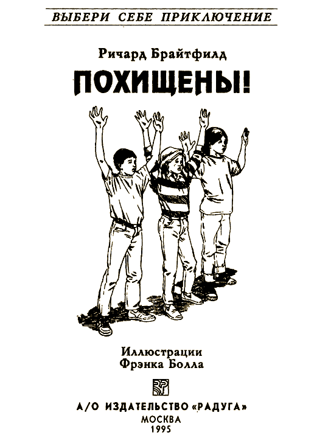

#### Посвящается Сьюзен Корман и Чарльзу Кохману

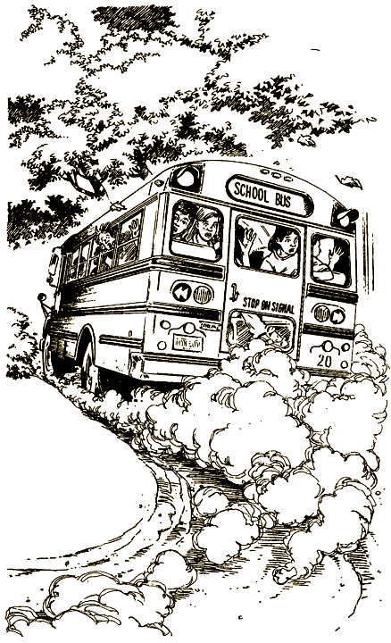

Это необычная, книга. Не пытайся читать ее по порядку с начала до конца, переходя от одной страницы к другой, — ничего не получится! Ведь это игра, где тебя ждет множество приключений, — на этот раз тебя похитили террористы. Время от времени тебе придется делать выбор. Что принесет он? Успех или поражение?

Твои приключения — результат твоего выбора. Тебе самому решать, куда пойти, что сделать. А дальше — читай указания в конце страницы, и тогда узнаешь, к чему приведет твой выбор.

И помни: назад пути нет! Поэтому хорошенько подумай, прежде чем действовать. Игра есть игра: ты можешь проиграть, а можешь и выиграть!

### ОБ АВТОРЕ

Ричард Брайтфилд окончил Университет Джона Хопкинса. Изучал биологию, психологию, археологию. Долго занимался графическим дизайном в Колумбийском университете. В серии «Выбери себе приключение» сотрудничает давно, написал, в частности, книжки «Planet of the Dragons», «Hurricane!», «Master of Kung Fu» и «Master of Tae Kwon Do». Кроме того, более дюжины книжек-игр написал в соавторстве со своей женой, Глорией. Брайтфилды с дочерью Сэвитри живут в Оушн-Ридж, Флорида.

### О ХУДОЖНИКЕ

Фрэнк Болл учился в Институте Пратта. Работал и продолжает работать иллюстратором во многих журналах, любит рисовать карикатуры. Занимался рекламой, оформлял учебные пособия для детей. Рисовал комиксы для газет, в том числе «Anni and Winnie Winkle». Давно сотрудничает с серией «Выбери себе приключение». Иллюстрировал, в частности, книжки «Master of Kung Fu», «South Pole Sabotage», «Return of the Ninja», «You Are a Genius», «Through the Black Hole», «The Worst Day of Your Life», «Master of Tae Kwon Do», «The Cobra Connection», «Master of Karate», «Invaders From Within», «The Lost Ninja», «Daredvil Park» и «Kidnapped». Родился в Бруклине, Нью-Йорк. В настоящее время живет и работает в Уэстпорте, Коннектикут.

#### [Начать приключение](#1)

# 1

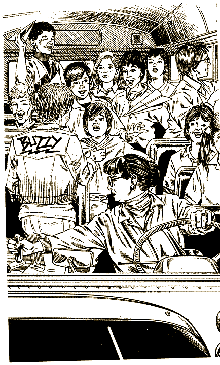

Наконец-то наступила пятница. Ты сидишь в школе и с удовольствием думаешь о том, что остался последний урок. Ты уже убрал учебники в сумку и внимательно смотришь, как стрелки часов отсчитывают минуты. Учительница по обществоведению, миссис Мейерс, увлеченно рассказывает о международном терроризме. К сожалению, на твой взгляд, это жуткая скучища. Но вот звенит звонок, и тебе удается вскочить с места и вырваться за дверь еще до того, как он умолкает.

Возле школы ты встречаешь своих друзей Салли и Дэна, и вы вместе идете к школьному автобусу.

— Давайте сядем сзади, подальше от Бази Харгроува, а? — просит Салли. — А то он вечно начинает доставать миссис Уилсон и не дает ей спокойно вести автобус.

— Если Бази будет продолжать в том же духе, ему вообще запретят пользоваться автобусом, — отзывается Дэн, — и его родителям придется каждый день забирать его из школы.

Вы с Салли и Дэном пробираетесь в самый конец автобуса. Тебе досталось место у окна. Еще через минуту миссис Уилсон включает зажигание и кричит: «Все успокоились!» Автобус медленно выруливает со стоянки, на секунду тормозит у поворота на Главную улицу и плавно вливается в поток машин.

— Бази, сиди на своем месте, — говорит миссис Уилсон.

— Я просто хотел взять у Тома классную работу. Я всегда делаю уроки в автобусе…

— Еще одно нарушение дисциплины, Бази, и тебе придется идти домой пешком.

Автобус проезжает еще шесть кварталов и останавливается, чтобы выпустить нескольких учеников. Если ты живешь в пределах этих самых шести кварталов, официально считается, что ты должен ходить пешком, ездить в школьном автобусе тебе не положено.

Автобус набирает скорость, поворачивает направо, делает еще несколько остановок и спускается вниз по длинной улице.

Неожиданно миссис Уилсон резко тормозит, и ты едва не вылетаешь со своего сиденья. В последний момент тебе удается схватиться за спинку переднего кресла, но сумка и учебники разлетаются в разные стороны. Оказывается, дорогу перегородил грузовик, и только хорошая реакция миссис Уилсон спасла вас от катастрофы.

Миссис Уилсон открывает дверь кабины и начинает ругаться с водителем грузовика. Ты смотришь в заднее стекло и просто не можешь поверить своим глазам.

К автобусу бегут вооруженные люди в камуфляжах цвета хаки и плотных масках. Ты снова поворачиваешься и видишь, что еще двое спрыгивают с грузовика. Один из них вскакивает в кабину.

— Это что же творится? — спрашивает Салли.

— Понятия не имею, — отвечаешь ты. — Может, они снимают фильм.

— Всем оставаться на своих местах, — приказывает человек в маске. Его слова не действуют на ребят. Тогда человек стреляет в крышу. Звук оглушительный. Все ученики моментально садятся.

— Отлично, заводи мотор, — обращается бандит к миссис Уилсон.

— Кто бы вы ни были, вам это даром не пройдет, — миссис Уилсон смотрит на бандита так же строго, как на провинившихся школьников.

— Заткнись и заводи мотор, — повторяет бандит.

Миссис Уилсон нехотя выжимает сцепление и ведет автобус к повороту.

Бандит отталкивает миссис Уилсон и сам нажимает на газ. Автобус сворачивает на тихую боковую улочку. В середине квартала бандит отшвыривает миссис Уилсон в салон автобуса и садится за руль. Резкий поворот направо. Взглянув вперед, ты замечаешь огромный фургон. В таких обычно перевозят мебель и большие грузы. Автобус на полной скорости несется к этому фургону. Еще чуть-чуть, и вы врежетесь.

Вдруг задняя дверь фургона откидывается. Получается что-то вроде ската. Водитель тормозит, затем снова нажимает на газ, и автобус с глухим толчком въезжает в фургон. Задняя дверь поднимается, и ты оказываешься в полной темноте. Водитель в маске выходит из кабины и включает фонарь. Он открывает дверь, и в автобус входит еще один похититель. Царит полная тишина — настолько все поражены происходящим.

Бандит толкает миссис Уилсон назад, на водительское место, хотя совершенно ясно, что она не сможет вести машину внутри фургона.

— Я отказываюсь вам подчиняться, — успевает она сказать, пока бандиты затыкают ей рот кляпом. Потом ее руки привязывают к рулю.

Ты чувствуешь, как громко бьется твое сердце. Что они сделают с вами? Мурашки пробегают по спине. Фургон медленно трогается с места, разворачивается и набирает скорость.

Кажется, что прошло много часов. Фургон резко сворачивает с шоссе и едет по ухабистой дороге. Наконец он останавливается, откидывается задняя дверь, и автобус заливает светом.

— Всем выйти из автобуса, — командует один из бандитов. Он отвязывает руки миссис Уилсон от руля и выталкивает ее из кабины. Твои одноклассники по одному выходят из автобуса, проходят по фургону и спускаются по скату. Один похититель остается в автобусе, другой — стоит в фургоне у двери. Они следят, чтобы никто не вздумал прятаться.

Салли, Дэн и ты выходите последними. Вы уже встаете на подножку, как вдруг раздается плач Бази Харгроува. Он все еще внутри, размахивает руками во все стороны.

— Не трогайте меня! Не трогайте меня! — кричит он.

Наверно, прятался под одним из сидений.

Похититель никак не может справиться с Бази. Ему на помощь бежит второй. Так вы с Салли и Дэном остаетесь в фургоне одни.

— Давайте спрячемся под автобусом, — шепчет Салли. — Кто знает, что еще вздумается этим бандитам.

— Не пойдет, — вздыхает Дэн. — Нас найдут и вытащат наружу, как Бази.

— Попытка не пытка, — возражает Салли.

На размышление у тебя несколько секунд.

Если ты подчиняешься похитителям, открой страницу [75](#75).

Если ты прячешься под автобусом, открой страницу [4](#4).

# 4

— Ладно, давай прятаться, — соглашаешься ты.

Дэн решает, что лучше не рисковать. Ты хватаешь Салли за руку и как можно быстрее запихиваешь ее под автобус.
Вы с Салли ползете к одному из больших передних колес автобуса и укрываетесь за ним.

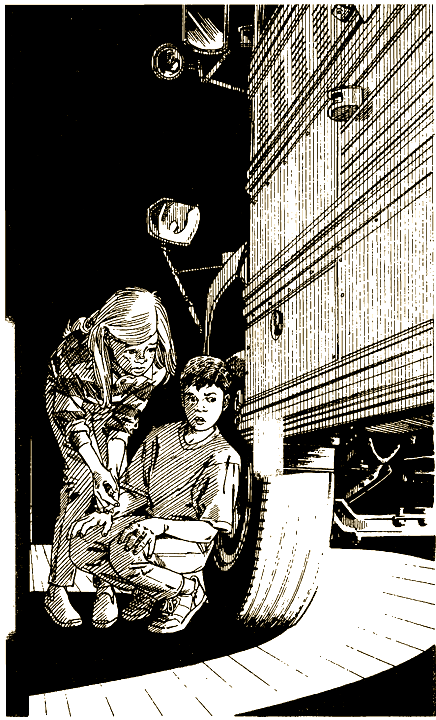

Двое бандитов в это время, схватив Бази за руки, вытаскивают его из фургона.

Ещё через минуту один из похитителей возвращается в фургон и заходит внутрь автобуса. Ты слышишь, как тяжело стучат его ботинки прямо у тебя над головой. Ясно, что он проверяет, не спрятался ли кто-нибудь под сиденьями. Тут тебе приходит в голову, что он может заглянуть под автобус.

Бандит выпрыгивает из автобуса, наклоняется и быстро проводит лучом фонарика по дну фургона. К счастью, он очень спешит и не замечает вас. Наконец, он выходит из фургона, поднимает скат и закрывает двери. Ты чувствуешь, как фургон трогается с места.

Вы с Салли осторожно выглядываете из-за колеса. Вокруг темно, но через щель у задней двери фургона проглядывает узкая полоска света. Через эту щель почти ничего не видно. Тебе удается рассмотреть, что бандиты выстроили ваших товарищей в ряд. Фургон медленно поворачивает, и ты видишь, как Дэна и других сажают в грузовик.

— Ну что, давай залезем обратно в автобус, — говоришь ты.

Проходит несколько минут. Дорога становится ухабистой. Кругом полная темнота. Фургон резко поворачивает и увеличивает скорость.

— По-моему, дорога снова гладкая. Мы наверняка вернулись на шоссе. Интересно, куда это мы так несемся? — спрашиваешь ты у Салли.

— Слушай, а вдруг полиция остановит фургон за превышение скорости, — с надеждой говорит она.

— Даже если остановят, они не будут заглядывать в кузов.

— Как ты думаешь, кто нас похитил?

— Понятия не имею. Надеюсь все-таки, что это не настоящие террористы.

Тут ты чувствуешь, что фургон поднимается вверх по склону.

— А что они сделают с нами, если найдут?

— Я стараюсь не думать об этом. Давай-ка посмотрим в щелочку. Может, поймем, где мы находимся.

— Мы проезжаем через какой-то городок. Вон вывеска: «Глоувильские скобяные изделия».

Ты сам смотришь в щелку.

— Да. Сейчас мы уже проехали город. Вокруг сельская местность.

Скоро фургон снова сворачивает на неровную каменистую дорожку. Тоненькая светлая щель исчезает.

— Ничего себе! — восклицаешь ты. — Мы въехали в какой-то туннель или пещеру.

Фургон останавливается.

— Лучше снова залезть в автобус, а то вдруг кто-нибудь откинет заднюю дверь, — шепчешь ты.

Впрыгиваешь в автобус и заползаешь под сиденье. Задняя дверь начинает медленно опускаться.

Ты потихоньку выглядываешь в узкую щель между двумя задними сиденьями. Рядом с фургоном переговариваются несколько мужчин. Они уже сняли маски.

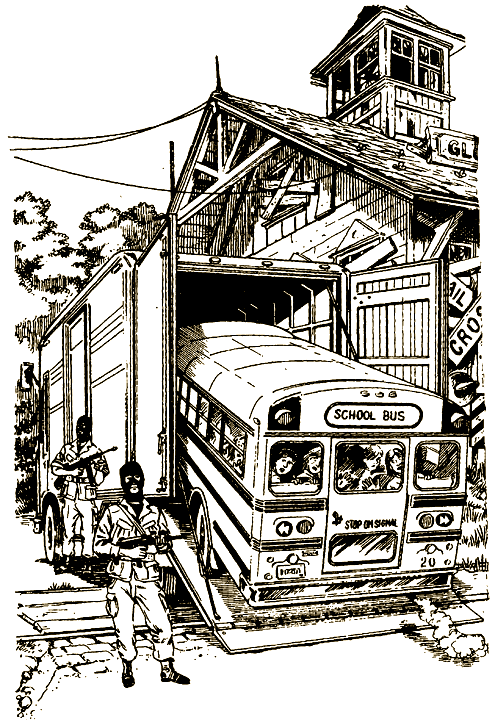

— Нужно как можно быстрее избавиться от автобуса, — говорит один из бандитов, — утопите его в одной из этих глубоких шахт.

— Я сейчас же прикажу это своим людям, — отвечает другой.

— Глубокие шахты! Быстро сматываемся из автобуса, — командуешь ты Салли.

Вы с Салли потихоньку выбираетесь из автобуса и по скату бежите из фургона. Вы понимаете, что находитесь в слабо освещенной пещере. С высокого потолка свисают сталактиты. Навстречу кое-где поднимаются сталагмиты, но почти всюду пол залит цементом.

Быстро оглядываешься, думая, куда бы спрятаться. Ура! Возле фургона в стене пещеры есть щель, почти скрытая сталагмитами. И вот вы с Салли уже в этой щели, смотрите по сторонам. В дальнем конце коридора мелькают какие-то фигуры. В другом конце к грубой стене пещеры прислонился в кресле охранник. Вроде дремлет, но попробуй узнай наверняка.

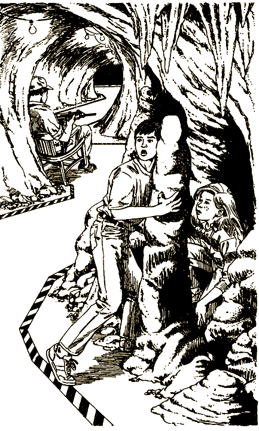

Откуда-то издали быстро приближаются голоса. Вы прячетесь за сталагмитами. Приближается группа хорошо вооруженных людей. Ты приседаешь на корточки. Отряд поворачивает направо прямо перед вами и скрывается в боковом коридоре.

— Мы должны выбраться отсюда, — канючит Салли. — Давай проскользнем мимо охранника. Выход небось прямо рядом с ним.

— Мимо него-то мы проскользнем, но охрана может стоять и снаружи. Лучше пойдем по одному из боковых коридоров и постараемся отыскать запасный выход.

И то, и другое очень рискованно.

Если ты идешь мимо охранника, открой страницу [60](#60).

Если ты решаешь идти в пещеры, открой страницу [37](#37).

# 6

— Ладно, — соглашаешься ты с доктором Крэншоу, — пожалуй, я вступлю в вашу организацию.

Сестра помогает доктору развязать тебя. Она привозит инвалидное кресло. По длинному коридору тебя увозят из лазарета. В конце концов ты попадаешь в огромный зал. Он полон Борцами за свободу. В центре, на возвышении, стоит главный бандит, Карлос. Он выбрасывает руку вперед, в фашистском приветствии, и толпа восторженно ревет.

Карлос замечает тебя. Он медленно спускается с возвышения и идет по центральному проходу. Подходит к тебе вплотную. Достает из-под мундира металлический жезл и касается им твоей головы.

Ты чувствуешь, как по телу проходит электрический ток. Одновременно тебя как будто ослепляет яркая вспышка прямо в мозгу.

— Добро пожаловать в международную организацию Борцов за свободу. Теперь ты стал одним из нас, — торжественно произносит Карлос и идет обратно к своему возвышению.

Ты садишься и вдруг понимаешь, что не в силах пошевелиться. Как только ты пытаешься подумать о том, что произошло, тебя снова ослепляют яркие вспышки.

— Не напрягайся, — шепчет доктор Крэншоу, — скоро ты научишься вообще не думать.

#### КОНЕЦ

# 10

Полицейский участок — одноэтажное кирпичное здание. Вы с Салли идете через главный вход к стойке посреди комнаты. Но за ней никого нет.

— Эй, кто-нибудь! — кричишь ты.

Никто не отзывается. Вы возвращаетесь на улицу. Прямо перед вами тормозит патрульная машина. Из нее выскакивает полицейский.

— Вы, должно быть, и есть те дети. О вас говорилось в сообщении. Почему вы бродите по городу?

— Мы не бродим по городу, — обиженно отвечает Салли, — мы пришли, чтобы сообщить о преступлении.

— Что еще за преступление?

— Наш школьный автобус вместе с целым классом угнали террористы.

— Вроде бы вы не особо пострадали.

— Мы нет. Нам удалось бежать.

— И где же сейчас эти ваши террористы?

— Их штаб-квартира в пещерах, в горах недалеко отсюда.

— М-да. Видите ли, сейчас я вряд ли смогу их найти. Мне необходима помощь. Теперь что касается вас. Я должен поместить вас в камеру. Пойдемте, она в этом здании.

— Поместить нас в камеру?!

— Для вашей же безопасности. Или вы хотите, чтобы террористы вернулись за вами, пока меня не будет?

— Мы не хотим сидеть в камере. Послушайте, мы сами о себе позаботимся.

— Нет, это вы послушайте, — полицейский достает пистолет. — Вы задержаны как важные свидетели, нравится вам это или нет.

Он хватает тебя и Салли, тащит в участок, толкает в камеру и запирает дверь.

Полицейский бормочет себе под нос: «Пусть пока посидят здесь. А я свяжусь с Карлосом и доложу ему обо всем».

Через час в участок заходят еще двое полицейских. Ты видишь их через решетку.

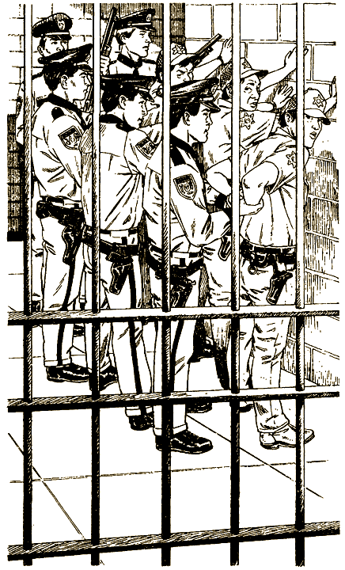

— Запомни, это должно выглядеть как самоубийство, — говорит один из них.

Вы с Салли сидите в уголке камеры. Ты пытаешься хоть что-нибудь придумать, чтобы спастись. Полицейские подходят к решетке. Один из них, усмехаясь, отпирает дверь. Вдруг снаружи раздается вой сирен, затем скрип тормозов. В участок вбегают полдюжины полицейских с пистолетами. На них другая форма — федеральной полиции. Они хватают глоувильских «блюстителей порядка», заламывают им руки за спину, разоружают и ставят лицом к стене.

— Что происходит? — глоувильский полицейский бледнеет от злости. — Кто вам дал право врываться сюда?

— Мы из федеральной полиции, — отвечает начальник специального подразделения. — Почти час назад поступило сообщение от мисс Бинни Атуотер из аптеки. Мы узнали, что вы силой удерживаете здесь двух невинных детей.

На следующий день твоя фотография и фотография Салли появляются во всех газетах. «Террористы обезврежены. Найдены двое из пропавшего автобуса. Поиски продолжаются», — кричат заголовки.

Вы с Салли рассказываете полиции о тайне пещер. Еще через несколько дней все ваши одноклассники возвращаются к родителям, ну а вы становитесь героями.

#### КОНЕЦ

# 22

Ясно, что такой случай упускать нельзя. Вы с Салли выходите на поляну и чуть не сталкиваетесь с неизвестным человеком. Он вскакивает на ноги и прыгает к костру, стараясь вас получше рассмотреть.

— Не бойтесь, — успокаивает его Салли, — мы просто потерялись.

— Вы меня чуть до инфаркта не довели. Меня зовут Джейсон. — Человек держит вертел с кусками жареного мяса. — Хотите попробовать?

Вы с Салли дружно киваете.

— Как это вы ухитрились потеряться? — Джейсон передает вам мясо.

— Похитили наш школьный автобус. Но нам удалось убежать от террористов. — И вы рассказываете ему обо всех ваших бедах.

— Н-да. Не самая обычная история. Ладно. Оставайтесь здесь на ночь, а утром пойдем в полицию. По пути сюда я проезжал через какой-то городок, кажется, Глоувиль…

— Мы не доверяем тамошней полиции, — объясняет Салли. — По-моему, они заодно с террористами.

— Лучше бы обратиться в полицию в другом городе, — добавляешь ты.

Джейсон бросает на вас недоверчивый взгляд.

— Сообщения о похищении, конечно, передают по радио и телевидению, приходит в голову Салли. — Послушайте радио, если вы нам не верите.

— Я приехал сюда на целый день, чтобы ловить рыбу и сидеть у костра. Я и так сыт по горло плохими новостями. Поэтому я не захватил радио.

— Нам очень нужна ваша помощь, — умоляюще говорит Салли.

— Это я понял. Но ночью лучше спать, а не гоняться за террористами. Вот там моя палатка. В машине валяются запасные одеяла. Берите их, и пошли.

— Огромное вам спасибо, — снова подает голос Салли, — мне ужасно неловко. Видите ли, дело в том… в общем, вы были так добры к нам… мне просто стыдно… Очень хочется есть!

— В машине, по-моему, остались бутерброды с сыром. Сейчас принесу.

Через минуту Джейсон возвращается, а еще через минуту ты проглатываешь последний бутерброд и закутываешься в одеяло.

Когда затухает костер, вы с Салли уже спите рядом с палаткой Джейсона.

Рано утром вы просыпаетесь. Пасмурно, моросит мелкий дождичек. Джейсон уже поднялся. Помогаешь ему собрать палатку и положить ее в багажник.

— Классная машина.

— Спасибо. Тут стоит восемь цилиндров. Мне такой мотор и не нужен, а все-таки приятно, что он есть. Кроме того, никогда ведь не знаешь, что может произойти.

Подходишь к ручью и умываешься холодной водой. Джейсон складывает удочки.

— Вы точно не хотите обратиться в полицию в Глоувиле?

— Кто-нибудь еще мог сбежать из пещер этой ночью. Вдруг бандиты узнали об этом? Тогда они будут следить за всем городом.

— Ну ладно. Если что, я скажу, что вы мои дети.

Вы садитесь в машину и медленно поворачиваете на лесную дорогу. Вскоре выезжаете на глоувильское шоссе.

По пути попадается много полицейских машин. Каждый раз они сбрасывают скорость и внимательно осматривают вас. На въезде в город Джейсона останавливает патруль. Полицейский медленно подходит к машине.

— Это ваши дети? — спрашивает полицейский Джейсона.

— Конечно, — отвечает тот.

— Вам никто больше не попадался по дороге? Парочка малолетних преступников сбежала из колонии. Те еще детки. Выглядят как ангелы, а разыскиваются за убийство.

— Убийство? — Джейсон открывает рот от изумления.

— Ага. И не поверишь. Вот такие сейчас дети.

Полицейский отпускает машину. В Глоувиле Джейсон тормозит у первого же магазина. Ты покупаешь тоник и утреннюю газету.

Вся первая полоса газеты посвящена истории с похищением.

— Вы, значит, не придумали это все, — говорит Джейсон. — А я, по правде сказать, вам не очень-то верил.

Переворачиваешь газетную страницу. Там фотографии похищенных школьников. Есть там и вы с Салли. Бандиты увидят это и поймут, что мы смылись, соображаешь ты. Надо срочно убираться из этого города.

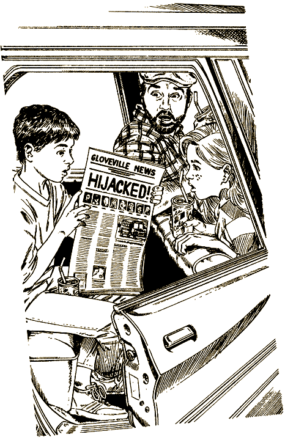

Джейсон разворачивается и выезжает на шоссе. Вы хотите побыстрее покинуть город. Вдруг ты слышишь резкий звук полицейской сирены. Сзади на полной скорости приближается патрульная машина. Из нее высовывается полицейский и знаками приказывает Джейсону остановиться.

— Ну что на этот раз? — ворчит Джейсон. — Я же не превышал скорость.

— По-моему, это что-то более серьезное, — говорит Салли.

— Слушайте, это ведь могут быть ненастоящие полицейские, — встревоженно говоришь ты Джейсону. — А что, если переодетые террористы просто увидели наши фотографии в газете?

— У меня очень мощный мотор. Я могу попытаться оторваться от них.

С одной стороны, ты хочешь во что бы то ни стало уехать из Глоувиля. Но, с другой, стоит ли рисковать?

Если ты решаешь уйти от преследователей, открой страницу [63](#63).

Если ты решаешь остановиться, открой страницу [38](#38).

# 31

Ты говоришь:

— Слушай, нужно как можно дальше убраться от берега.

В джунглях сплошное болото — пройти почти нельзя. Вы перепрыгиваете с крошечных островков твердой земли на стволы упавших деревьев. Скоро ты вконец устаешь. Останавливаешься, чтобы передохнуть.

— По-моему, это вполне съедобно. — Дэн срывает с дерева небольшой плод, похожий на сливу.

— А вдруг он ядовитый? — сомневаешься ты.

— Не может быть, если он приятный на вкус. Погоди, я попробую… Неплохо. Вкус необычный, но приятный. Возьми кусочек.

Вы с Дэном сидите на сыром бревне и грустно жуете необычные плоды.

— И на лимон похоже, и на киви, — пожимает плечами Дэн.

— Киви? — переспрашиваешь ты.

— Ну да, киви, это такие фрукты из Новой Зелан…

Вдруг глаза Дэна стекленеют. Он застывает, как парализованный. Ты хочешь броситься к нему на помощь, но тоже не можешь сдвинуться с места. Конечно, плоды вкусные, но ты был прав… В них смертельный яд.

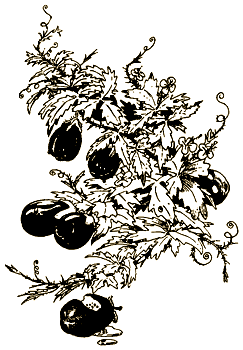

#### КОНЕЦ

# 37

Итак, ты советуешься с Салли, и вы решаете поглубже проникнуть в пещеры. Ступаете как можно тише, прижимаясь к стенам. Надеетесь найти боковой проход, который приведет к выходу. В конце концов натыкаетесь на неприметную дверь в стене.

— Зайдем? — спрашивает Салли.

— Ну. Мы же не можем спускаться еще дальше, а то, не ровен час, опять встретимся с бандитами.

Ты прислоняешься к двери и прислушиваешься — вроде бы все тихо. Осторожно поворачиваешь ручку. Тут дверь распахивается изнутри, и ты неожиданно вваливаешься в нее. Перед тобой стоит высокий человек с лысой головой и огромными усами. Похоже, он тоже не ожидал тебя увидеть.

Ты резко поворачиваешься, хватаешь Салли за руку и бежишь вниз.

— Стоять! — кричит бандит. В конце коридора появляются еще несколько фигур.

Ты оглядываешься вокруг. Справа и слева узкие проходы скрываются в глубине пещер. Но в конце левого прохода можно с трудом рассмотреть еще одну маленькую дверь. Внимательно смотришь направо. С этой стороны проход быстро расширяется и уходит за угол. Что же делать?

Если ты поворачиваешь налево, открой страницу [89](#89).

Если ты поворачиваешь направо, открой страницу [73](#73).

# 38

— Лучше все же узнать, чего они хотят, — наконец решаешь ты.

Джейсон кивает и тормозит у обочины. Полицейская машина, на борту которой крупными буквами написано «Полиция Глоувиля», останавливается прямо за вами. Из нее выпрыгивают двое и подбегают к вам, доставая на ходу пистолеты. Они распахивают задние двери.

— Выйти из машины, руки за голову, — кричат они вам с Салли.

Вы, конечно, подчиняетесь.

— Парни, вы их с кем-то путаете. Эти дети скрываются от каких-то бандитов, — пытается объяснить Джейсон.

— Они вам могли рассказать еще и не такое, — усмехается сержант. — Лучше уезжайте отсюда, пока вас не арестовали за пособничество преступникам.

Джейсон барабанит пальцами по рулю. Он явно в растерянности.

— Вы оглохли, что ли? Я сказал — убирайтесь, — сержант ударяет кулаком по двери автомобиля.

— Они же врут! — плачет Салли, пока Джейсон заводит мотор.

— А ну, заткнись и садись к нам в машину, — обрывает ее сержант.

На заднем сиденье полицейской машины — как в клетке: спереди металлическая решетка, а на дверях нет ручек. Шофер поворачивает к Глоувилю.

— Как думаешь, много они успели рассказать? — спрашивает он сержанта.

— Вряд ли. Но мы примем обычные меры предосторожности.

— У вас ничего не выйдет, — отчаянно кричишь ты им через решетку, — Джейсон обязательно расскажет обо всем полиции.

— Мы сами полиция, — усмехается шофер.

— Вы бандиты!

— Последний раз предупреждаю — заткнись!

Через полчаса вы подъезжаете к полицейскому участку в Глоувиле. Вас хватают и затаскивают внутрь.

— Этих двоих — немедленно в изолятор. Никакой связи с внешним миром. Повторяю — никакой. Не думай, что они кроткие овечки, это самые настоящие убийцы, — говорит сержант дежурному.

В изоляторе нет даже окон. И тебе, и Салли осталось только надеяться, что Джейсон когда-нибудь вернется вместе с полицией из какого-нибудь другого города. Может быть, тогда вас спасут.

#### КОНЕЦ

# 40

Ты решаешь идти вброд. Сползаешь с уступа в воду. Она такая холодная, что у тебя перехватывает дыхание. Подаешь руку Салли.

— Ай! — кричит она. — Я сейчас умру!

— И кроме того, течение очень сильное. Но все же надо рискнуть, — отвечаешь ты и идешь вперед. Салли держится за тебя. Речка становится вам по пояс.

Вдруг под ноги попадается маленький скользкий камешек, ты падаешь и тянешь за собой Салли. Течение быстро несет вас вниз, к узкому туннелю. Уже видно, что стены у туннеля высокие и гладкие. Не за что уцепиться.

Речка заметно расширяется. Слышится нарастающий гул воды.

— Что там? — вопит Салли.

— Не знаю, — кричишь в ответ, — похоже на…

— …водопад! О Господи! Помогите! — В отчаянии Салли пытается плыть против течения. Бесполезно! Ты тоже совершенно беспомощен. Вода увлекает вас вниз… К счастью, водопад небольшой — каких-нибудь шесть метров. Вы оказываетесь под водой, а потом выплываете на поверхность, задыхаясь и судорожно ловя ртом воздух.

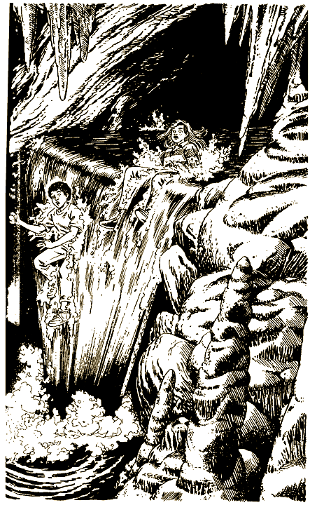

Несколько минут ты держишься на воде и стараешься получше рассмотреть большой бассейн, в который только что свалился. Вскоре замечаешь берег. Подплываешь к нему. Через небольшую трещину наверху видно далекое синее небо. На склонах пещеры лежат большие валуны. К трещине ведет высокая шероховатая стена.

— Если удастся добраться дотуда, — говоришь ты, указывая на трещину, — то мы выйдем из пещер.

Вдруг за валунами показывается исхудавшее мальчишеское лицо и тут же снова скрывается.

— Эй, кто это там? Привет! — кричишь ты.

Мальчишка примерно твоих лет неохотно вылезает из-за камней.

— Мы убежали от каких-то террористов, — рассказывает он. — Меня зовут Боб.

— Мы тоже убежали, — говоришь ты в ответ.

Мальчик поворачивается к камням и свистит. Появляется еще несколько мальчиков и девочек.

— Нам не удалось выбраться из пещер, — продолжает Боб. — Мы научились карабкаться на эту стену, но снаружи иногда проходят патрули. Многие ребята торчат здесь уже несколько месяцев. Кто-то пытался бежать, но их поймали.

— Что же вы едите? — удивляется Салли.

— В бассейне полно разной мелкой рыбы. Джордж, мой товарищ, бывший бойскаут. Он умеет разжигать огонь без спичек. А что еще нам остается? Кстати, сегодня вечером небольшая группа еще раз попробует пролезть наверх. Хотите присоединиться? Вдруг нам повезет и мы проскочим мимо патруля? Но сначала мы вас накормим.

Боб ведет вас с Салли вдоль берега. Тут вы наталкиваетесь на Джорджа, который бродит по берегу, собирая мокрую древесину.

— Я понятия не имею, как сюда попадают эти щепки, но они буквально спасают нас, — объясняет он. — Если потереть две сухие палочки друг об друга, можно высечь искру и разжечь костер.

— Не может быть.

— Честно. Вот посмотри, — Джордж приседает на корточки и резко проводит небольшой веточкой по толстому круглому куску дерева. Затем складывает руки лодочкой и трет палочку между ладонями — и вот появляется, искра. Джордж долго раздувает огонь, пока язычки пламени не разгораются на самой веточке. Он ловко кидает веточку в горстку стружек и добавляет дров. Вскоре получается настоящий костер.

— Фантастика, — улыбается Салли.

— Я мечтаю найти хоть что-нибудь съестное кроме рыбы. Если мне удастся вернуться домой, я никогда больше не притронусь к рыбе, — уверяет Джордж. Он снимает с костра несколько небольших форелей и передает их Салли и тебе.

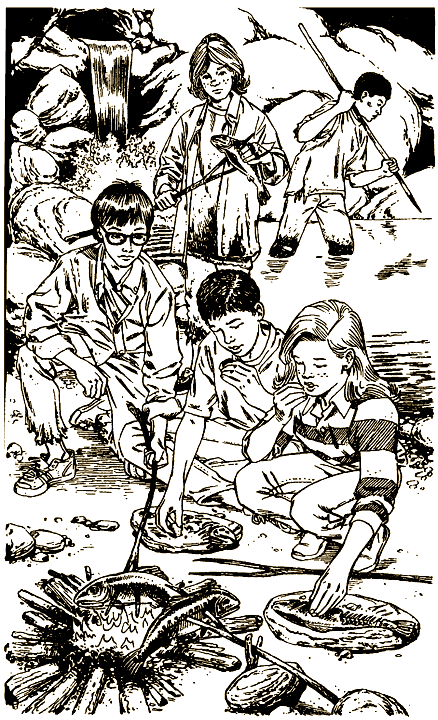

— Изумительная форель, — с чувством говорит Салли и благодарит Джорджа. Она аккуратно кладет рыбу на круглый камень. Такие камни заменяют беглецам тарелки. Едят они руками.

— Давайте отдохнем, — предлагает Боб после обеда, — а вечером попробуем выбраться отсюда. Вы с нами?

Ясно, что тебе необходимо отсюда выбраться. Можно сделать первую попытку и сегодня вечером. Но что, если похитители уже ждут вас снаружи? Пожалуй, все же лучше подождать.

Если ты решаешь пойти вместе с Бобом и его друзьями, открой страницу [82](#82).

Если ты остаешься, открой страницу [78](#78).

# 56

Ты решаешь идти в город.

— По этой тропинке мы можем выйти на шоссе, — объясняешь Салли.

— Это слишком опасно. Вдруг по этой дороге ездят террористы из города в пещеры и обратно?

— А мы будем осторожны. Ты не забывай, что бандиты даже не знают, что мы из того автобуса.

Ты был прав. По тропинке вы быстро доходите до шоссе. Движения почти нет. Наблюдаешь за дорогой, стоя на краю леса. Приближаются два грузовика. Быстро прячешься за дерево. Пока они проезжают, внимательно их разглядываешь. Грузовики как грузовики, ничего особенного. И водители в них вроде бы вполне нормальные.

— Пошли. Все в порядке.

На шоссе стоит указатель: «До Глоувиля пять миль».

Когда вы наконец приходите в Глоувиль, уже почти темно. Улицы совсем пустынны.

— Странно, что никого нет, — говорит Салли.

— Да. И все магазины закрыты. Вроде не так уж поздно.

— Смотри, по-моему, аптека открыта, — замечает Салли.

— Сейчас проверим.

Входите внутрь. Снова никого нет.

— Эй, есть тут кто-нибудь? — кричишь ты.

Несколько минут ты стоишь перед входной дверью. Уже собираешься уйти, но тут на пороге появляется немолодая женщина.

— Чем могу помочь? — спрашивает она.

— Мы хотели бы узнать… — начинаешь ты.

— Вы не местные, правда? — перебивает она. — Приехали к кому-нибудь в гости?

— Как пройти к ближайшему полицейскому участку? — вступает в разговор Салли.

— Полицейский участок — вниз по этой улице через два квартала. — Женщина показывает дорогу. — Только на вашем месте я бы туда не ходила. Городская полиция… ну… не очень хорошо работает.

— Спасибо, — удивленно говоришь ты.

Вы с Салли неуверенно поворачиваете к полицейскому участку.

— Неужели полиция заодно с террористами? — говоришь ты. — Все равно не верю. Те два полицейских в пещерах, в конце концов, могли быть просто переодетыми бандитами.

— Ты слышал, что сказала женщина, — отвечает Салли. — Мне кажется, лучше уйти от этого участка как можно дальше.

Если ты все-таки отправляешься в полицию, открой страницу [10](#10).

Если ты уходишь подальше, открой страницу [57](#57).

# 57

— По-моему, надо бежать из этого города, — неуверенно обращаешься ты к Салли.

— Я с тобой, — соглашается она.

Вы бежите по переулкам. Оказываетесь в другом конце города. Вы все идете. Вот наконец шоссе. Указатель сообщает, что до Денвера тридцать пять миль.

Вы выходите на шоссе и пытаетесь остановить попутную машину. Вдруг ты замечаешь полицейскую мигалку. Патруль приближается к вам.

— Быстро прячемся за этим деревом!

Полицейские не замечают вас. Они проезжают вниз по дороге, разворачиваются и медленно возвращаются назад. Поворачивают в город. Ты снова выходишь на дорогу и внимательно смотришь по сторонам. Снова появляется патруль. Он то появляется, то исчезает. Так продолжается целых два часа. Еще через некоторое время машина с мощными фарами выезжает из Глоувиля. Ты уже готов снова спрятаться. Тут ты замечаешь, что это не полиция, а обычный грузовик.

— Остановим его? — спрашиваешь у Салли.

— Пожалуйста. А то у меня отвалятся ноги.

Отчаянно машешь рукой. Грузовик тормозит.

— Не подвезете нас? — жалобно просишь ты водителя.

— Прыгайте в кузов, — кивает тот.

Вы с Салли прыгаете внутрь. Задняя дверь грузовика захлопывается, и ты слышишь щелчок.

— Эй, почему вы нас заперли? — кричишь ты и барабанишь в дверь кулаками.

Слышно, что шофер смеется, заводит мотор и поворачивает назад, в Глоувиль.

Вскоре грузовик тормозит у пещер. Дверь распахивается, вас хватают бандиты и тащат в разные стороны.

Тебя бросают в пустую камеру без окон, прорубленную в скалах. Целых четыре дня кормят только безвкусной кашей. Миску с кашей проталкивают через небольшое отверстие в нижней части двери.

Наконец дверь отпирают. Ты с трудом встаешь на ноги. Перед тобой Салли в форме хаки как у террористов. Кажется, ее накачали наркотиками.

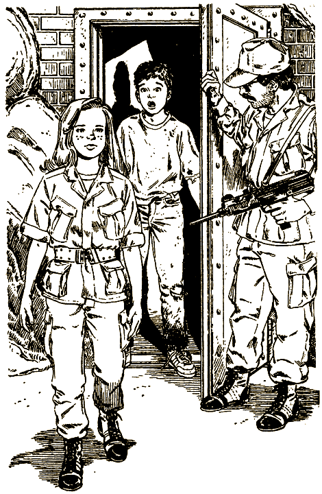

— Что они с тобой сделали?

— Я зашла попрощаться. Я вступила в ряды Борцов за свободу. Только что я доложила Карлосу, нашему вождю, что ты никогда не станешь служить нашей великой идее. Поэтому тебя стоит прикончить.

— Прикончить? — кричишь ты. — Салли, ты не можешь позволить им так поступить со мной.

Подбегаешь к Салли, но дверь захлопывается у тебя перед носом. Еще несколько минут, и за тобой приходят.

#### КОНЕЦ

# 60

— Может, удастся пройти мимо охранника, — шепчешь ты.

Вы выбираетесь из укрытия и крадетесь к выходу из пещеры. Охранник точно спит, спит, да еще похрапывает. Вы прижимаетесь к стене. Бандит у выхода шевелится, но так и не просыпается.

Ты проскальзываешь мимо него. Внимательно осматриваешь проход. И тут замечаешь еще двух бандитов — они стерегут наружную дверь.

— Ну и не везет нам, — в сердцах говоришь ты.

— Неужели придется возвращаться? — спрашивает Салли.

Киваешь в ответ. Но тут совсем некстати просыпается первый охранник и громко зевает. Хорошо хоть, что он пока вас не заметил.

Еще раз оглядываешься по сторонам. На другой стороне пещеры вдруг замечаешь неприметную дверь. Указываешь на нее, боясь произнести хоть слово.

Сердце бешено колотится. Бандит поднимается со своего кресла. Вас он еще не видит. Он равнодушно отворачивается и смотрит в глубину пещеры. Хватаешь Салли за руку, и вы крадетесь к двери.

Еще секунда — и ты оказываешься в маленькой темной комнате. С одной стороны в стену вделана лестница. Она ведет к люку в потолке. Знаками показываешь Салли, что по лестнице можно выбраться отсюда. Салли кивает. Собираешься подниматься наверх. Неожиданно в пещере начинается суматоха. Со всех сторон звучат команды. Автобус снимают с фургона и подвозят к большой дыре в противоположной стене. Рядом переговариваются террористы. Двое одеты в полицейскую форму.

— Смотри, — шепчешь ты, — какие-то полицейские с ними заодно.

Террористы и «полицейские» вталкивают автобус в дыру. Слышно, как автобус падает и со скрежетом бьется о стены. Должно быть, эта дыра — вход в одну из тех глубоких шахт. Скрежет становится все тише и затихает где-то глубоко внизу.

Подбегаешь к лестнице и поднимаешься. Руки слегка дрожат. Толкаешь люк, но тот не поддается. Изо всех сил снова толкаешь люк, но тебе так и не удается сдвинуть крышку с места. И тут ты нащупываешь щеколду.

Тебе удается отодвинуть щеколду и наконец-то открыть люк. Протискиваешься в него и киваешь Салли.

Вы оказываетесь в трубе, достаточно широкой, чтобы ползти по ней на четвереньках. В лицо ударяет порыв свежего воздуха.

— Ненавижу такие места, — хнычет Салли. — Мне становится плохо, когда я в замкнутом пространстве. А вдруг в другом конце трубы нас уже поджидают?

— А вдруг это вентиляционная труба? Тогда она выведет нас из пещер. Или аварийный выход? Так что давай не ныть и быстро подниматься.

Вверху брезжит тусклый свет. Доползаешь до места, где труба поворачивает почти под прямым углом, так что можно выпрямиться во весь рост. На поверхность земли ведет еще одна лестница.

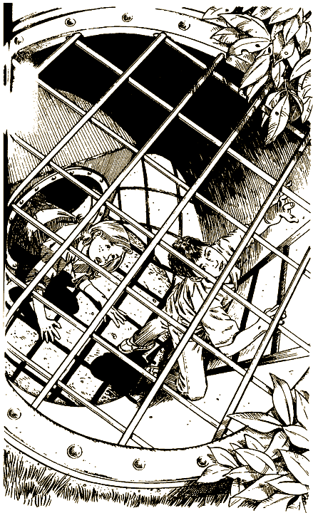

— Вон блестит металлическая решетка. Вдруг нам повезет, и там такая же щеколда, как внизу. Тогда мы точно выберемся отсюда.

Последнее усилие, и ты добираешься до решетки. Ты попал в точку — на внутренней стороне решетки приделана щеколда. В мгновение ока отодвигаешь ее, поднимаешь решетку и подтягиваешься. Салли не отстает. Вы оба стоите, растерянно оглядываясь вокруг.

От того, что ты видишь, просто захватывает дух. Далеко, у самой линии горизонта, за хуторами и лесами, поднимаются синеватые, окутанные дымкой горы. А вдруг террористы выставили дозор? — думаешь ты и ползешь назад, к кустам. Кусты растут тут же, неподалеку. Еще раз внимательно осматриваешь окрестности.

Ты на вершине высокого холма. Вдали сквозь деревья проглядывают несколько высоких домов и купола церквей небольшого городка. Ясно, что это Глоувиль. Вы проезжали через него по пути к пещерам. Пыльная дорога ведет из города к темному пятну. На фоне горы оно почти незаметно. Это вход в пещеры. Еще дальше можно различить шоссе.

Под горой по правую руку от тебя начинается лес. Могучие деревья. С другой стороны — несколько ферм, стада коров, опрятные жилые домики и большие красные амбары.

— В городе мы сможем обратиться в полицию, — говорит Салли. — По радио наверняка уже передали, что нас похитили.

— Не знаю, — раздумываешь ты. — Помнишь полицейских в пещерах? Вдруг они из Глоувиля? Надо быть очень осторожными. В лесу мы будем в безопасности.

Если ты решаешь спуститься в город, открой страницу [56](#56).

Если ты идешь в лес, открой страницу [105](#105).

# 63

— Ладно, я не хочу попасть к ним в руки, — говоришь ты Джейсону.

— Я всегда хотел испытать свой мотор, — отзывается тот и жмет на газ. Машина быстро набирает скорость.

Смотришь на полицейских в зеркальце. «По-моему, они выжали из своего мотора все, что могли, но все равно им не угнаться за нами», — думаешь ты.

На максимальной скорости вы проезжаете по боковой дороге и поднимаетесь на высокий крутой склон по извилистому шоссе. Путь вам загораживает длинный трейлер. Его не обгонишь — навстречу тянется целая вереница машин.

— Если мы не обойдем трейлер, полицейские догонят нас, — соображаешь ты.

— Точно. Но мы проскочим, — Джейсон спокойно сбрасывает скорость.

Сзади снова появляется патруль. Из окна высовывается полицейский и достает пистолет.

Вас с Салли отбрасывает к стене — Джейсон неожиданно поворачивает на встречную полосу и всем телом наваливается на акселератор. Еще секунда, и трейлер остается позади.

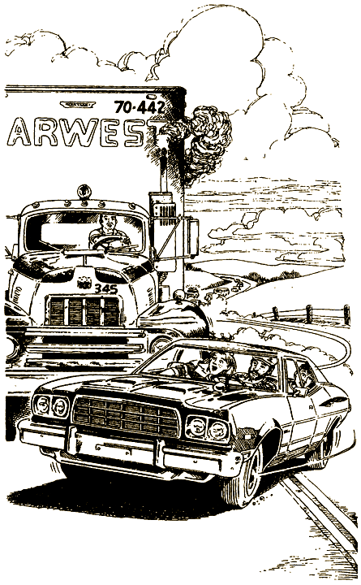

— Отлично. Видите, сколько машин идет навстречу. Ни одному автогонщику теперь не обогнать такую махину, не то что полицейскому, — Джейсон довольно кивает на трейлер, и вы возвращаетесь на свою полосу.

Джейсон увеличивает скорость, и вы несетесь по шоссе. Проезжаете указатель «Разрешено скоростное движение». Через некоторое время мелькает другой: «Скорость не выше 30 миль в час».

Вдруг из-за рекламного щита выезжает патрульная машина с надписью «Денверская полиция» на борту. Полицейские включают сирену и знаками приказывают вам остановиться.

— На этот раз я, пожалуй, остановлюсь и все объясню. — Джейсон сворачивает на обочину. Сзади тормозит патруль.

Один из полицейских выходит из машины и направляется к вам.

— Превышение скорости, — заявляет он и достает блокнот, — девяносто миль в час.

Вы с Салли поворачиваетесь к нему.

— Мы убегаем от бандитов. Честное слово! Вы, наверное, читали об этом. Вот, у нас с собой газета.

— Чего только люди не придумывают, чтобы не платить штраф, — усмехается полицейский.

Тут рядом с вами резко тормозит полицейская машина из Глоувиля. К вам подбегают еще двое полицейских.

— Спасибо за помощь, ребята, — говорит один из них патрульным из Денвера. — Эти дети — преступники. Мы забираем их.

— Они врут! — кричишь ты. — Они заодно с бандитами.

— На днях, действительно, похитили автобус с детьми, — вспоминает денверский полицейский.

— Нам некогда спорить. Они поедут с нами, — полицейский из Глоувиля достает пистолет.

— Полегче, парень, — второй денверский полицейский с пистолетом выходит из машины.

— Вам что, нужны проблемы? — Глоувильский полицейский бледнеет от злости.

— Проблемы будут у вас.

Глоувильские полицейские растерянно переглядываются. Они неохотно возвращаются к своей машине и уезжают.

— Зря вы их отпустили, — говоришь ты.

— Не волнуйся, парень. Мы свяжемся с полицией Колорадо. Далеко они не уйдут. Садитесь в машину и следуйте за нами. ФБР передало нам материалы о похищении.

Вы подъезжаете к полицейскому участку и останавливаетесь прямо за патрульной машиной. Вас провожают к дежурному. У него есть вся информация о похищении и фотографии вашего класса. С удовольствием разглядываешь себя и Салли. Надо же! Фотографировали еще в прошлом году, а вы особенно не изменились.

Инспектор улыбается и рвет протокол о превышении скорости.

Потом еще два часа вас допрашивают агенты ФБР. Конечно, ты все им выкладываешь. Но смотрят они по-прежнему недоверчиво. Они задают хитрые вопросы. Специально вас запутывают! В это время особое подразделение полиции Колорадо обыскивает все пещеры под Глоувилем. Вашим родителям уже сообщили, что вы нашлись. Полицейский участок осаждают репортеры.

Тут начинают поступать странные сообщения. Все пещеры вокруг Глоувиля были якобы закрыты полицией еще двадцать лет назад для обеспечения безопасности.

— Этого просто не может быть, — пытаешься ты объяснить им, — мы видели…

— Сержант, — в комнату вбегает полицейский. — Они не лгут. Поисковая бригада нашла останки школьного автобуса. На дне шахты глубиной в двести футов.

Агенты ФБР отводят вас в другую комнату.

— Простите нас, ребята, за этот допрос. Надо было убедиться, что вы не подосланы террористами.

— Значит, они на самом деле террористы?

— Да. Организация Борцов за свободу.

— Странно они борются за свободу.

— Да уж. К сожалению, игра еще не закончена. Вы подвергаетесь большой опасности. Мы вынуждены попросить вас провести несколько дней на маленькой ферме далеко от города. Дом охраняют. С вами поедут двое — наши лучшие люди. Там есть телефон, так что сможете позвонить родителям и даже сколько угодно болтать с друзьями.

Два агента ФБР ведут вас через задний ход к небольшому фургону. Фургон должен доставить вас на ферму. Вы с Салли садитесь назад, двери захлопываются. Внутри сидят еще двое полицейских. Но тут ты замечаешь, что они оба связаны, а рты заткнуты кляпами. Хочешь открыть дверь, но вдруг на голову тебе накидывают мешок. Руки быстро связывают за спиной. В ноздри ударяет сладковатый запах хлороформа. Ты чувствуешь, что сейчас потеряешь сознание. До тебя доносятся слова: «Мы доставим их в наш новый лагерь». Больше ты уже ничего не слышишь.

#### КОНЕЦ

# 64

— Точно. Мы ведь не знаем, что это за человек. Давай лучше спрячемся, — соглашаешься ты с Салли.

Возвращаетесь на другую поляну. Вы уже проходили через нее. Валитесь с ног от усталости и постепенно засыпаете.

Только через несколько часов ты просыпаешься. Лунная ночь уже сменилась бледно-серым рассветом. Поднимаешься с жесткой земли и потягиваешься. Тело затекло. Салли еще спит. Ты пытаешься ее растормошить. В конце концов она раскрывает глаза.

— Вот бы сейчас принять горячий душ, а потом позавтракать. Все тело так и зудит, — жалуется Салли.

— Надо думать только о том, как убежать от террористов подальше. Вон тропинка. Она вроде не должна проходить через лагерь туристов, или кто они там.

— Ладно, тогда пошли. Может, нам попадется какой-нибудь ручей, и я наконец-то умоюсь.

Смотри-ка, эти ветки над тропинкой как будто прикрывают вход в туннель.

— Наверно, этот туннель вырыли карлики, — вздыхает Салли, опустив голову, — или какие-нибудь зверушки.

— Видишь, земля здесь вымощена гладкими камешками. Зверушки до такого не додумались бы.

Ты сгибаешься и идешь вперед.

— Давай найдем другую тропинку. У меня уже спина заболела, — хнычет Салли.

— Ну, еще чуть-чуть. По-моему, мы… — но тут ты видишь такое, что слова буквально застревают у тебя в горле.

На поляне стоит крошечный домик. У него остроконечная крыша в виде шапочки, а стены покрыты резьбой и ярко раскрашены. Над каменной трубой струится дымок.

От изумления ты просто теряешь дар речи. Потом приходишь в себя, подходишь ближе и кричишь:

— Есть кто живой?

Хлопает верхняя половинка маленькой двери, и из нее выглядывает голова с большой белой бородой.

— Чем могу помочь? — спрашивает старичок.

— Ну… это… дело в том…

— Заблудились? Дети всегда теряются в этом лесу. — Старичок открывает нижнюю половину двери и подходит к вам.
У тебя опять глаза лезут на лоб — ростом он меньше метра.

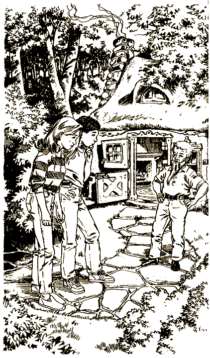

— Мы не то чтобы потерялись… — изумленно глядя на него, говорит Салли. — Мы сбежали из пещер от каких-то бандитов и…

— Вы хотите сказать, от этих жалких шалопаев внизу? Ну что ж, входите.

Чтобы войти в дверь, тебе приходится согнуться в три погибели. Потолок не намного больше метра высотой. Все время приходится стоять скрючившись.

— Меня зовут Тур. Полное имя Турман Оливер Трокмортон, но для вас я просто Тур. Вы, конечно, заметили, что я карлик. Не смущайтесь, я привык, что на меня глазеют. Когда-то я работал в цирке и в кинотеатрах. Потом ушел на покой и построил дом здесь, в Глоувиле. Дом, в котором мне удобно. Туристы чуть не падают от удивления, когда натыкаются на этот дом, гуляя по лесу. Но детям всегда нравится здесь, и я люблю детей. Мне не так одиноко, когда они случайно попадают сюда, — Тур вздыхает, подходит к дымящейся плите в углу и снимает с нее два котелка с горячей кашей. — Ну, теперь рассказывайте.

С набитым ртом ты рассказываешь Туру о похищении и о том, как вам чудом удалось спастись из пещер.

— Я давно думал, что с этими людьми произойдет нечто подобное. Но то, что ты рассказал, ни в какие ворота не лезет. Слушайте, ешьте поскорее. Я покажу вам кое-что интересное.

Вы просите чуть-чуть подождать и доедаете остатки овсянки — так голодны. Потом Тур ведет вас в заднюю комнату маленького домика и откидывает крышку люка в полу.

— Видите, тут начинается тайный путь в пещеры. Понимаете, пещеры огромные и выходят к поверхности в разных местах. В один прекрасный день я обнаружил, что мой дом построен как раз над одним из таких ответвлений. Ни одна живая душа не знает об этом. Айда за мной.

Не очень-то ты хочешь вернуться назад, в пещеры. Ведь вы буквально прыгнули выше головы, чтобы выбраться оттуда. Не лучше ли отказаться от предложения Тура?

Если ты решаешь вернуться в пещеры, открой страницу [66](#66).

Если ты прощаешься с Туром и пытаешься добраться до дома, открой страницу [74](#74).

# 66

Вы с Салли влезаете вслед за Туром в люк и спускаетесь по лестнице. Тур зажигает свечу, и она освещает длинный подземный туннель. Ты слышишь далекие голоса.

— Ни за что не пойду дальше, — говорит Салли.

— Да не бойтесь вы. Они нас не заметят, а мы сможем прекрасно их разглядеть. Я же не первый раз здесь хожу.

— Ну ладно, — решаешь ты.

Идешь вперед в темный конец коридора. В стене проделано несколько отверстий. Ты понимаешь, что голоса доносятся из них.

— Посмотри туда. Но не слишком сильно высовывайся, а то тебя и в самом деле заметят.

В отверстие видно огромную пещеру. Она забита сотнями людей в форме цвета хаки. В центре стоит человек с поднятой рукой. По его знаку все крики разом смолкают. Он начинает говорить. Ты отчетливо слышишь каждое слово, хотя и находишься, слава Богу, достаточно далеко от него.

— Борцы за свободу не должны испытывать никакой жалости к врагам революции. Все наши враги будут уничтожены…

Тут ты слышишь шаги — по туннелю кто-то приближается к вам.

— Нас обнаружили! Быстро за мной, — кричит Тур.

Он исчезает в крошенном полукруглом отверстии у самого основания стены. Салли опускается на четвереньки и с трудом пролезает следом за ним. Ты пытаешься последовать ее примеру. Кто-то грубо хватает тебя за ноги и вытаскивает назад. Несколько человек моментально связывают тебе руки и ноги и уносят куда-то. Больше ты никогда не увидишь ни Салли, ни удивительного карлика по имени Тур.

#### КОНЕЦ

# 71

— Три, — кричит Лания и прыгает за борт. Вы с Дэном прыгаете вслед за ней с другой стороны шлюпки.

Ты задерживаешь дыхание. Главное — как можно дольше не показываться на поверхности. Наконец ты не выдерживаешь, выныриваешь и делаешь большой глоток воздуха. Над тобой строчит пулемет, и ты снова глубоко ныряешь.

Неожиданно ногами ты чувствуешь дно. Оказывается, тебе удалось доплыть до берега. Поднимаешься. Рядом стоит Дэн. На вас снова пикирует вертолет. Десятки купающихся вокруг вас в ужасе бегут из воды. Это вас спасает — бандиты не могут стрелять, они боятся задеть туристов. Вертолет разворачивается, набирает высоту и улетает.

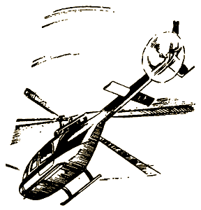

Лания выходит на берег чуть подальше. Ее ранило в руку. В первом же медпункте ей оказывают необходимую помощь. Вы с Дэном не отходите от нее ни на шаг.

— Еле успели, — улыбается Лания. — Пойдем поищем моих друзей. Потом сразу в полицию.

#### КОНЕЦ

# 73

Вы пробираетесь по коридору направо. Делаете поворот, и ты замечаешь толстую двойную дверь. Открываешь ее, и вы оказываетесь в огромном подземном зале. Сотни террористов в одинаковой форме цвета хаки выстроились в шеренги по обе стороны центрального прохода. Вдруг замечаешь, что все эти бандиты поворачивают головы и смотрят на вас. В ужасе ты замираешь. В шеренгах раздаются удивленные возгласы.

— Смирно! — рявкает человек в более нарядной форме со странными знаками отличия. Он стоит в дальнем конце прохода. — Доставить их ко мне!

К вам подбегают бандиты и тащат через весь проход к своему командиру. Уже видно, что он стоит у края глубокой шахты. Террористы окружают вас со всех сторон.

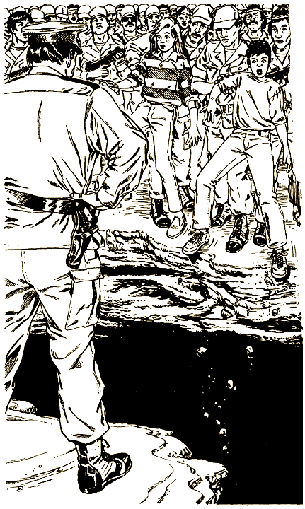

— Я покажу вам, как надо поступать с нашими врагами, — кричит главный бандит.

Он подталкивает тебя и Салли к краю шахты и сталкивает вниз, в черную пропасть. Когда вы долетаете до дна, вы уже ничего не чувствуете.

#### КОНЕЦ

# 74

— Ну уж нет, я никогда больше не пойду в эти пещеры, — говоришь ты. — Да и потом, нам пора уходить из леса.

Вы благодарите Тура, и он провожает вас до маленькой тропинки. По ней можно дойти до шоссе.

— Ни в коем случае не доверяйте полиции в Глоувиле. Многие из них заодно с террористами, — наставляет вас Тур на прощание.

Вы еще раз благодарите его, и вот вы снова идете через лес. Вскоре впереди появляется шоссе. Вы оказываетесь на вершине холма. Дорога в обоих направлениях уходит круто вниз и скрывается за горизонтом. На обочине стоит указатель: «Пять миль до Глоувиля».

— Куда пойдем? — спрашивает Салли.

— Только не в Глоувиль. Вспомни, что говорил Тур.

— Но через город самая короткая дорога к дому. А куда мы придем, если пойдем в другую сторону?

— Вообще-то ты права. Но, с другой стороны, совет Тура тоже хорош.

Если ты идешь через Глоувиль, открой страницу [111](#111).

Если ты решаешь идти в другую сторону, открой страницу [115](#115).

# 75

Ты наблюдаешь, как Салли залезает под автобус. Потом вы с Дэном выходите наружу.

— Эй, вы двое, быстро становитесь в строй, — кричит бандит в маске.

Потом из автобуса вытаскивают Бази и подталкивают его к автомобилю, стоящему рядом. Пока его запихивают внутрь, ты замечаешь, что в автомобиле уже сидит связанная миссис Уилсон с кляпом во рту.

Между тем подъезжает небольшой грузовик и останавливается рядом с вами.

— Живо залезайте внутрь, — командуют угонщики.

Вдоль бортов грузовика тянутся длинные скамейки. Садишься на самом краю. Так тесно, что ты едва втиснулся.

Захлопывается задняя дверь, и грузовик медленно трогается с места. Около получаса вы трясетесь по неровной, ухабистой дороге, затем резко останавливаетесь.

Всем велят вылезти из грузовика, и вы оказываетесь на большом поле в лесу. Рядом с грузовиком стоит самолет. Похож на военный транспортный, только без опознавательных знаков.

Теперь вас погружают в самолет, и вот ты уже в воздухе. Сидишь прямо рядом с окном. Но все окна закрыты черными шторками. Опять ничего не удается разглядеть!

Несколько бандитов прохаживаются по салону самолета. Они внимательно наблюдают за вами. Ты потихоньку протягиваешь руку к занавеске. Слегка отодвигаешь ее. Прислоняешься к окошку и притворяешься спящим.

Приоткрываешь один глаз и смотришь в окошко. Вы летите над океаном! Закрываешь глаз на минутку, потом снова смотришь в окошко. Вы все еще над водой, но быстро приближаетесь к какому-то острову. Самолет наклоняется влево, потом начинает снижаться.

Самолет приземляется. На залитой солнцем взлетной полосе всех строят в одну шеренгу. Воздух жаркий и влажный. Аэродром окружают пальмы. Похоже на тропики.

Перед самолетом стоят мужчины и женщины в полувоенной форме без оружия. Вас быстро делят на группы и разводят в разные стороны. К счастью, вы с Дэном остаетесь вместе.

— Каждая группа получит своего инструктора, — говорит один из похитителей. — Они быстро объяснят, зачем вас сюда привезли.

Молодая женщина с длинными русыми волосами неожиданно появляется из пальмовой рощи и жестом отпускает охранников. Она одета в обычное платье, но тоже цвета хаки.

— Меня зовут Лания. Добро пожаловать на наш остров, в Главный штаб Организации Борцов за свободу. Поздравляю вас с избавлением от ваших школ и семей. Дома вас только обманывали. К счастью, во всем мире действуют подразделения нашей организации. Вы должны благодарить их за свое спасение. В эти дни вам предстоит еще многое узнать, но сейчас все, конечно, нуждаются в отдыхе. Прошу вас следовать за мной…

Лания ведет вашу группу через пальмовую рощу к большой палатке. Внутри стоит несколько низеньких круглых столиков со сладостями и прохладительными напитками. Все усаживаются прямо на одеяло, которым покрыт пол, и принимаются за еду.

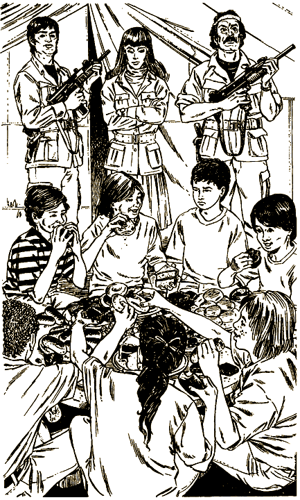

— Как здесь здорово! — говорит один из твоих одноклассников. — Прямо как в летнем лагере. Надеюсь, так будет и дальше.

Еда, действительно, очень вкусная. Дэн чуть не мурлычет от удовольствия.

— Вот что значит настоящее похищение, — заявляет он.

— Не знаю, — отвечаешь ты, — это зависит от того, что мы за это заплатим.

— Как это?

— Чего от нас потребуют за это и что с нами сделают, если мы откажемся.

После обеда Лания ведет вас к маленьким одноэтажным домикам на побережье. В больших комнатах рядами стоят кровати.

— Можете отдохнуть здесь или прямо на берегу. Помните — запрещается выходить за веревочное ограждение. С завтрашнего дня начинаются занятия по перевоспитанию.

— Интересно, что это еще за перевоспитание, — шепчет Дэн.

— Я думаю, то самое, о чем нам рассказывала учительница обществоведения, миссис Мейерс. Она называла это промыванием мозгов. Террористы заставляют тебя поверить в то, что им выгодно, а ты и не замечаешь, как это происходит, — отвечаешь ты ему.

— Не на такого напали. Я не поверю в то, во что не захочу поверить.

— Смотри. Миссис Мейерс говорила, у них эффективные методы.

— Ладно. Тем более мы должны убежать отсюда.

— Вообще-то убежать отсюда нелегко. Давай-ка прогуляемся по берегу. Вдруг что-нибудь придет в голову, — предлагаешь ты Дэну.

Вы доходите до дальнего конца пляжа. Садитесь на песок под пальмами у самого ограждения.

— Слушай, а что, если перепрыгнуть через веревку? — оживляется Дэн.

— Как же. Мы ведь на острове — нас в два счета найдут.

— Пожалуй, ты прав.

Молча вы любуетесь океаном. Вдруг за деревьями раздается «тссс». Оглядываешься вокруг. За деревом стоит Лания и манит тебя пальцем.

Вы с Дэном перелезаете через ограждение и подбегаете к ней.

— Быстро за мной, — шепчет Лания и скрывается в роще.

Вы идете за ней.

— То, что я делаю, очень опасно, — говорит Лания, — но у меня нет другого выхода. Мне необходима ваша помощь. Я собираюсь бежать с острова. Хотите составить мне компанию?

— Но вы же сами из террористической организации, — возражаешь ты Лании.

— Это не организация, а бандитская шайка. Вначале я верила в их так называемые идеалы, но теперь мне все ясно. Эти люди могут только грабить и убивать.

— Что мы должны сделать? И почему вы выбрали именно нас?

— Мне нужны люди. Люди, которым я могла бы доверять. Люди, которым бандиты еще не повесили лапшу на уши.

— Так что вы все-таки от нас хотите? — вступает в разговор Дэн.

— Сейчас нет времени подробно объяснять. Вечером выберитесь из своей комнаты. Вылезьте в заднее окно — охрана обычно стоит только перед домом. Потом приходите на это место. И никому ни слова…

— А… — начинаешь ты.

Но Лания уже успела скрыться за деревьями.

— Что ты об этом думаешь? — интересуешься ты у Дэна.

— Я бы рискнул.

— А вдруг нас просто проверяют?

Если ты доверяешь Лании, открой страницу [83](#83).

Если ты ей не доверяешь, открой страницу [93](#93).

# 77

Вы с Салли идете вверх по течению вдоль уступа. Уступ все сужается и сужается. По нему едва можно идти.

— По-моему, пора возвращаться, — говорит Салли.

— Слушай, прямо перед нами в стену вделана стальная дверь. Вдруг она открыта?

Уступ под вашими ногами становится совсем узким. Ноги то и дело соскальзывают. Ты прислоняешься к стене и медленно идешь вперед. Ура, тебе это удается! Изо всех сил ты толкаешь дверь. Она легко поддается. Последнее усилие — ты хватаешься за дверной косяк и протискиваешься внутрь. Подаешь руку Салли.

Вы оказываетесь в небольшой комнате. С другой стороны еще одна железная дверь. Ты пробуешь открыть ее, но ничего не получается.

— Я что-то не вижу щеколды. Может быть… — начинаешь ты.

Вдруг дверь сзади вас с шумом захлопывается. Ты бросаешься к ней и изо всех сил налегаешь на нее.

— Теперь они заперли и эту дверь. Мы в ловушке, — говоришь ты.

Вода начинает быстро прибывать, она уже доходит до лодыжек, ползет к коленям.

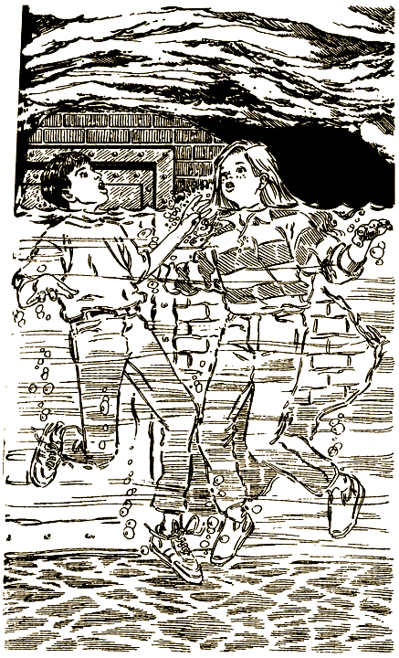

— Эту комнату затопит через две-три минуты. Надо бежать отсюда, — кричит Салли.

Ты разбегаешься и всем телом толкаешь одну дверь, другую. Никакого проку. Вода все поднимается, доходит до потолка. Потом постепенно убывает. На полу остаются два безжизненных тела.

#### КОНЕЦ

# 78

Ты решаешь, что лучше остаться в пещере. Смотришь, как ребята во главе с Бобом карабкаются вверх по каменной стене и исчезают в неярком лунном свете.

Через несколько минут вдалеке раздаются крики и выстрелы. Потом наступает тишина.

— Господи, хоть бы кому-нибудь удалось бежать, — вздыхает Салли.

— Иначе и быть не может. Они обязательно спасутся, а потом вернутся с полицией и спасут нас.

Вас действительно спасли, но не скоро, лишь через несколько месяцев. Однажды вы слышите голос:

— Есть кто живой?

— Да, помогите нам. Мы здесь! — хором кричите вы в ответ.

Сверху опускают веревочную лестницу. Все разом бросаются к ней. Вы с Салли поднимаетесь первыми.

Вас уже поджидают несколько высоких мужчин в длинных плащах и широкополых шляпах.

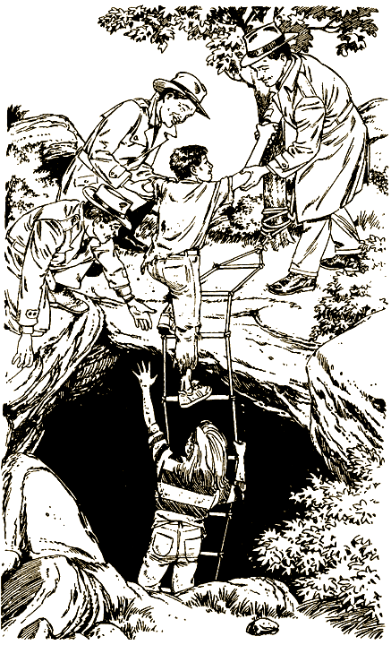

— Меня зовут Митчелл, — говорит один из них, — я из ФБР. Да, нелегко было сюда добраться. Все остальные давно уже дома, у родителей. Они и сообщили, что вы остались в пещерах. Мы накрыли здесь всю бандитскую шайку. Так что террористы отдыхают в тюрьме.

— Как вы вовремя, — улыбаешься ты. — Мне эта рыба уже в рот не лезет.

#### КОНЕЦ

# 82

— Я пойду с тобой, — отвечаешь ты Бобу и вопросительно смотришь на Салли.

— Я тоже, — кивает она.

— А вот тебе, по-моему, лучше остаться. Зачем рисковать обоим? Если я выберусь из пещер, первым делом сообщу о тебе полиции, обещаю, — уговариваешь ты.

— Ну ладно. Но смотри не забывай обо мне.

Вечером, когда лишь тусклый лунный свет в темноте освещает выход из пещеры, ты клянешься Салли и другим ребятам, что попытаешься спасти их. С тобой идут Боб, мальчик по имени Дарси и Норма. Боб показывает дорогу. Нужно добраться до трещины в стене довольно высоко над землей. Чтобы вскарабкаться туда, приходится прикладывать все силы.

Наконец ты добираешься до трещины и повисаешь на ней. Все мускулы ноют, спина болит так, что нельзя пошевельнуться. Еще секунда, и пальцы разожмутся. Тогда ты точно упадешь вниз. Ты делаешь последнее усилие, стискиваешь зубы, подтягиваешься и прыгаешь вперед.

Чудом удается добраться до вершины холма. От усталости ты падаешь на землю, лежишь и дрожишь от страха. Что же ты наделал? Одно неудачное движение — и ты мог сорваться. Полететь в полуторакилометровую пропасть. Шатаясь, ты встаешь на ноги. Выбираешься на груду камней, снаружи прикрывающих трещину. Смотришь по сторонам, С одной стороны мерцают огни далекого города, с другой — высокая каменистая гора.

Неожиданно сверху падает луч света.

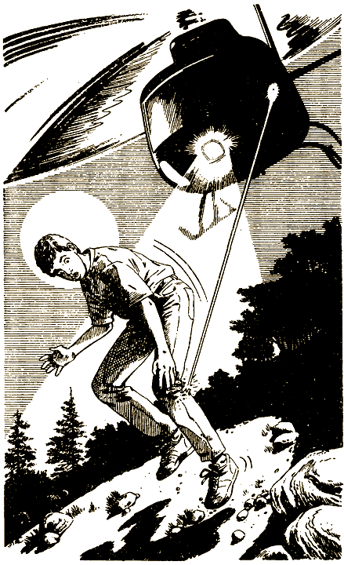

— Это бандиты! — кричит Боб. — Разбегайтесь в разные стороны. Всех они не поймают.

Бежишь вниз по склону, но луч света быстро находит тебя. Раздается выстрел из винтовки. Ты чувствуешь острую боль в ноге. Снова падаешь на землю. Голова ударяется обо что-то твердое, в глазах темнеет.

Просыпаешься ты в лазарете. Вокруг толстые каменные стены — значит, ты снова в пещерах. Голова и нога перевязаны, а крепкие ремни удерживают тебя на кровати. Рядом стоит сестра в белом халате.

— Как ты себя чувствуешь?

— Голова кружится, и немножко болит нога. Почему меня привязали к кровати?

— Так велел доктор Крэншоу. Он сказал… а, вот и он сам.

Поворачиваешь голову и видишь, как кто-то входит в комнату. Этого человека ты уже видел в пещерах, за стальной дверью. Та же лысая голова и огромные усы.

— Жаль, что пришлось стрелять в тебя. — Доктор Крэншоу подходит к кровати и жестом отсылает сестру. — Но мы не могли дать тебе уйти, верно?

Доктор Крэншоу осматривает твои повязки и быстро шепчет на ухо:

— Делай то, что я скажу. Тогда мы оба спасемся. Ты захвачен организацией Борцов за свободу. Для виду ты должен вступить в организацию. Я заберу тебя в свое подразделение. Эти люди — совсем не то, что я думал о них раньше, это обыкновенные бандиты, они…

Возвращается сестра, и Крэншоу быстро выпрямляется.

— Ну что, согласен вступить в наши ряды? — спрашивает он.

Если ты веришь доктору Крэншоу, открой страницу [6](#6).

Если нет, открой страницу [116](#116).

# 83

— Похоже, ей можно доверять, — говоришь ты Дэну.

Вечером Лания возвращается и строит всех в одну шеренгу. Вас ведут на ужин. Рядом со столовой прохаживается несколько бандитов. К счастью, они ни к кому не пристают. Ясно, что они никого не трогают, пока не нарушают их идиотские приказы.

После ужина можно посмотреть телевизор. Вместо рекламных пауз на экране вспыхивают яркие пятна. От них слегка кружится голова. В то же время они почему-то притягивают взгляд. «Наверно, так начинается их программа по перевоспитанию», — думаешь ты.

Когда объявляют отбой, ты чуть не засыпаешь. Перед глазами вспыхивают те же пятна. Они словно усыпляют тебя. Тебе удается перебороть себя. Ложишься в постель и делаешь вид, что засыпаешь.

Проходит несколько минут. Все вокруг засыпают. Тихонько встаешь и крадешься к койке Дэна. Он тоже не спит. Вы осторожно вылезаете через заднее окно. Прислушиваешься. Все как будто тихо.

Вы стараетесь как можно дальше отойти от дома. Ночь безлунная, но небо достаточно светлое. Можно рассмотреть дорогу к берегу.

Вы подходите к тому самому месту, где днем встречались с Ланией.

— Я здесь, — шепчет она.

И ты, и Дэн взвинчены и напуганы.

Ты различаешь в темноте фигуру Лании и бежишь за ней к берегу. Лания исчезает в роще пальмовых деревьев. «Сюда», — слышишь ты ее шепот. Ты вбегаешь в рощу. Прямо под вами, на берегу, лежит перевернутая вверх дном шлюпка.

— Быстро, мы должны спустить ее на воду. Ради Бога, скорее, у нас совсем нет времени.

Шлюпка очень тяжелая. Втроем вы с трудом переворачиваете ее и везете по песку. Ясно, что Лания без вас не обошлась бы.

— Сейчас самое трудное. Мы должны вывести шлюпку из залива в открытый океан. Но сначала надо хорошенько толкнуть. Начинаем по счету «раз».

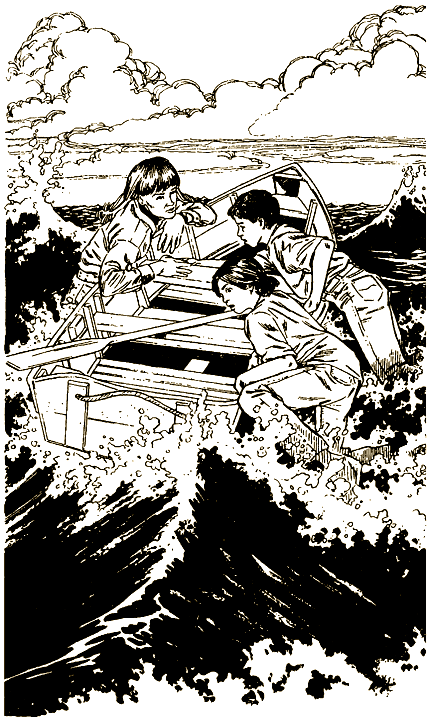

Сильная волна ударяет тебя по коленям.

— Раз! — кричит Лания.

Вы изо всех сил толкаете лодку. Следующая волна еще сильнее предыдущей. Лодку резко подбрасывает вверх, а тебе чудом удается не упасть в воду. Еще секунда — и лодка плавно опускается вниз и медленно плывет вперед.

— Отлично! — улыбается Лания. — Хорошо, что волна не накрыла нас. Лодку бы выбросило обратно на берег. Мы словно в рубашке родились. Вперед!

Вы усаживаетесь в лодке поудобнее.

— Держи, — Лания протягивает тебе весло. Передает другое Дэну. Вы быстро вставляете их в уключины. — Вперед, — командует Лания и начинает вычерпывать воду большим ведром.

Вы опускаете весла. Хорошо, что вы научились грести еще на Клеверном озере во время каникул.

— Отлично, — довольно говорит Лания, когда вы уплываете от острова. — На нас работает отлив. Он вынесет нас в открытое море. Если нам повезет и прогноз погоды верный, утром будет густой туман.

— В чем же тут везенье? — недоумеваешь ты.

— Когда они обнаружат, что мы бежали, — объясняет Лания, — на поиски вышлют вертолет. В предыдущий раз несчастных беглецов поймали именно так. А в тумане с вертолета ничего не видно.

— Сколько мы должны проплыть, чтобы чувствовать себя в безопасности?

— На севере есть небольшие острова. Я проложила весь маршрут по карте. Попыталась учесть основные течения. Если по очереди грести всю ночь и раннее утро, к полудню мы доплывем до них. Нас в лодке трое. Один гребет, двое отдыхают. У меня с собой фрукты и вода.

— Хорошо бы, мы не устали все трое одновременно, — вздыхает Дэн.

В течение часа вы гребете вместе с Дэном. Потом вас сменяет Лания. Потом ты сменяешь Дэна. Лания как будто сделана из железа, она вообще не устает. Все время проверяет курс по карте и компасу.

Наступает утро. Небо потихоньку светлеет. Лания оказалась права — вокруг густой туман.

— Прекрасно, — улыбается она, — они в жизни нас не найдут.

Проходит еще час. И тут туман неожиданно начинает рассеиваться.

— Вот не повезло! — говорит Дэн.

— Не волнуйся. По моим расчетам, мы уже почти у цели, — успокаивает Лания.

— Точно! Посмотрите, кажется, я уже вижу землю.

— Да. Это Сосновый остров. Теперь главное, чтобы течение не подвело. На острове нас ждут верные друзья. Они нам помогут.

Проходит еще час. Вам остается проплыть каких-то полмили.

— Ну, ребята, теперь гребите изо всех сил, — просит Лания.

Вы с Дэном налегаете на одно весло, а Лания — на другое. Вы почти у берега, когда на горизонте вдруг появляется вертолет, пикирующий над водой. Кажется, что он летит по вашему следу.

— Неужели это… — начинаешь ты.

— Да, это они. Не падайте духом, мы еще можем спастись.

Вертолет зависает прямо над вами. Из него высовывается человек и кричит в мегафон:

— Немедленно бросайте весла. Вы вернетесь на остров вместе с нами. В противном случае я открываю огонь на поражение.

— Что же делать? — Дэн чуть не плачет от страха. — Если мы им не подчинимся, нас наверняка убьют.

— Нужно прыгать в воду и плыть. На берегу они нас не тронут, — предлагает Лания.

— Но они подстрелят нас в воде, — говоришь ты. — Может, лучше сдаться?

— Решайте сами. Я считаю до трех и прыгаю. Раз, два…

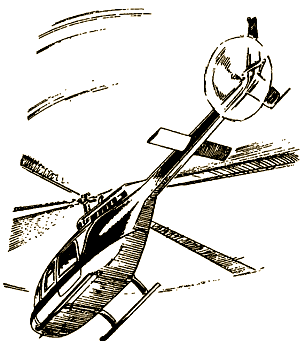

Если ты плывешь вслед за Ланией, открой страницу [71](#71).

Если ты сдаешься бандитам, открой страницу [98](#98).

# 89

— Быстро налево, — шепчешь ты.

Вы добегаете до небольшой двери. Бандиты почти догнали вас.

— Не дайте им уйти, — кричит один из них.

На двери висит большой замок. К счастью, он не закрыт. Срываешь его и передаешь Салли. Дверь хотя и маленькая, но стальная. С трудом открываешь ее и протискиваешься внутрь.

— Отлично! На этой стороне тоже есть щеколда. Быстро вешай на нее замок.

Вдвоем вы захлопываете и запираете дверь. С той стороны раздаются яростные крики.

— Какой идиот оставил эту дверь открытой? — спрашивает кто-то. — Вызовите команду и взрывайте ее.

— Какая темнота! — говорит Салли.

Вы делаете поворот и бежите по узкому проходу.

— Надо бежать как можно быстрее. Вдруг этот проход выведет нас из пещер, — стараешься ты ободрить Салли.

Скоро проход начинает расширяться, и вы оказываетесь в другой пещере. Она почти целиком заполнена мощным подземным потоком. Над ним проходит узкий каменный уступ. В высоком глиняном потолке пещеры небольшая трещина. Через нее едва пробивается слабый солнечный свет. На другой стороне потока в стене виднеется что-то похожее на дверь.

— Вроде здесь неглубоко, — говорит Салли. — Дно даже отсюда видно. Ты что предпочитаешь — перейти по воде на другую сторону или пройти по уступу? Надо на что-то решиться, а то они взорвут дверь и догонят нас.

Идти через речку страшновато. Вдруг дно скользкое или в нем ямы? Но уступ тоже не внушает доверия. Он может где-нибудь сойти на нет. Тогда придется возвращаться.

Если ты выбираешь уступ, открой страницу [77](#77).

Если тебе больше нравится подземная речка, открой страницу [40](#40).

# 93

Этой ночью вы с Дэном дожидаетесь, пока все уснут. Потом потихоньку выбираетесь из дома. Вы решаете больше не встречаться с Ланией и бежите в противоположном направлении.

— Что будем делать? — шепчет Дэн.

— Еще не знаю. Но лучше убежать, а не ждать, пока эти проклятые Борцы тебя перевоспитают.

— Может, все-таки пойдем к Лании?

— Я не верю ей! Поэтому-то мы и идем в другую сторону.

Вы выходите за территорию лагеря, перелезаете через ограждение. Решаете спуститься к берегу и идете вдоль пальмовой рощи. Вдруг впереди вас возникают несколько фигур с фонарями. Ты бросаешься за ближайшее дерево и слышишь чей-то сдавленный стон.

— По-моему, я на кого-то наступил, — шепчешь ты Дэну.

— Не «по-моему», а точно. Наступил мне на ногу, — раздается в ответ незнакомый голос.

— Кому это «мне»?

— Молчите оба, пока не пройдет патруль, — шепчет тот же голос, — ночью они проходят здесь каждый час.

Вы затихаете. Слышно, как песок хрустит под тяжелыми шагами. Шум прибоя заглушается громким треском раций.

Наконец патруль уходит с пляжа. Слава Богу, вас никто не заметил. Твой собеседник отряхивается.

— Когда они подошли близко, пришлось зарыться в песок, — объясняет он. Это парень примерно твоих лет.

— Мы тоже зарылись, — говорит Дэн.

— Вы что, новенькие? Из группы, которую привезли сегодня?

— Да. А ты?

— Меня зовут Джимми. Я уже неделю здесь торчу. Представляете, стою я как-то на шоссе рядом с домом, ловлю такси. Тормозит рядышком машина, какие-то симпатичные ребята предлагают меня подвезти. Сажусь. Угощают меня тоником. И все. Сразу после этого полный провал в памяти. Короче, очнулся я уже на этом острове. В общем, сегодня вечером я попытаюсь удрать.

— В точности как мы. А какой-нибудь план у тебя есть?

— Да. У этих бандитов есть свои воздушные силы — гидроплан, вертолет и транспортный самолет. Ну, я и угоню гидроплан. Вряд ли он заперт. Им и в голову не придет, что кто-нибудь из детей способен управлять такой машиной.

— А ты что, на самом деле способен?

— Да у моего отца спортивный самолет. Он меня и научил. Хотя я никогда не летал без него.

— Прекрасно, — встревает Дэн, — значит, ты никогда не…

— Ерунда. Я же знаю, что справлюсь. Хотите лететь со мной — пожалуйста. Если нет — что ж, счастливо оставаться.

Что же делать? С острова нужно бежать как можно скорее. Но лететь с пилотом, который в первый раз сам ведет самолет, — тоже радость небольшая.

Если ты все же решаешь лететь, открой страницу [102](#102).

Если нет — открой страницу [104](#104).

# 98

«…Три», — кричит Лания и ныряет в воду. Вы с Дэном остаетесь в лодке и покорно поднимаете вверх руки. Тут раздаются выстрелы. Бандиты стреляют туда, куда только что прыгнула Лания. Фонтанчики от пуль заливают лодку. Вертолет делает еще один круг над вами, стреляя во все стороны. Ты надеешься, что Лания успела доплыть до берега. Она до сих пор не появилась на поверхности.

Вертолет возвращается и зависает над вами. Террористы сбрасывают веревочную лестницу. Ты взбираешься по ней вслед за Дэном. Вертолет резко поднимается вверх примерно на тысячу футов.

Бандиты в вертолете смотрят друг на друга и улыбаются.

— А сейчас мы научим вас нырять, — говорит один из них.

— Как это? — удивляешься ты.

— Вот так, — отвечает бандит и выбрасывает вас с Дэном в открытую дверь вертолета.

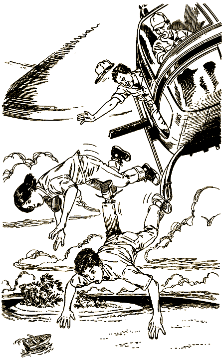

#### КОНЕЦ

# 102

— Мы пойдем с тобой, — наконец решаешь ты.

— Отлично. Вы мне пригодитесь. Рядом с гидропланом всегда стоит часовой. Вот почему я думаю, что он всегда готов к полету. Слушайте мой план. Часовой стоит у самого края пирса. Один из вас сталкивает часового в воду, а я перерезаю швартовы и завожу самолет. Пока они опомнятся, мы успеем взлететь.

— Хорошо придумано, — усмехается Дэн, — ты взлетаешь, а мы держимся за хвост самолета.

— Не болтай. Я так не поступлю.

— Ну хорошо, — неохотно говоришь ты, — хотя не нравится мне вся эта затея.

— Хватит ныть! Главное, чтобы нас не засекли.

Вы с Дэном идете за Джимми по берегу, затем сворачиваете и продвигаетесь в глубь острова. Кажется, Джимми прекрасно знает дорогу. Доходите до небольшой лагуны.

Вы ползете к пирсу. Вспыхивает огонек — это часовой прикуривает сигарету. Снимаете кроссовки и ползете еще осторожнее. В последний момент охранник замечает вас и резко оборачивается, но уже поздно. Ты подбегаешь к нему и сталкиваешь вниз. Он успевает нажать на спусковой крючок автомата. Тишину нарушает оглушительный звук выстрела. Потом ты слышишь, как охранник шлепается в воду, и все стихает.

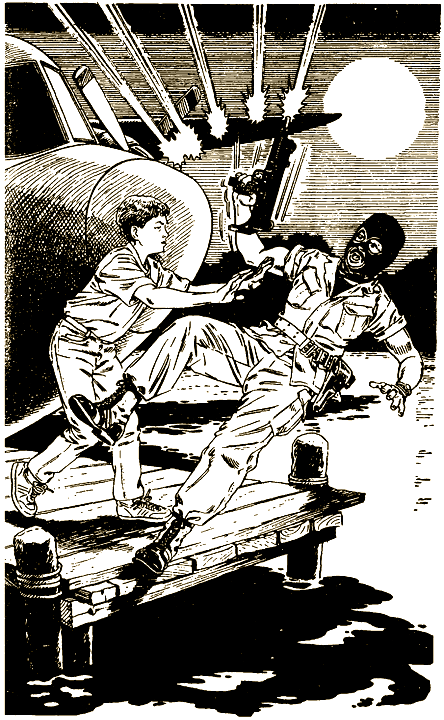

В ближайшем доме зажигаются огни. Оттуда же раздаются крики. Джимми перерезает швартовы и забирается в кабину.

Джимми запускает пропеллер. Вы с Дэном наконец залезаете в самолет. Пропеллер быстро увеличивает обороты. Гидроплан медленно сдвигается с места.

— Отлично! — радуется Джимми. Гидроплан отрывается от поверхности воды и взлетает в воздух. — У нас полные баки с горючим. Лучше просто не бывает.

— Ты знаешь, каким курсом лететь?

— Мой отец научил меня пользоваться авиационным компасом. Я уверен, что земля — по курсу «северо-северо-запад».

Примерно через десять минут рядом с вами появляется вертолет.

На гидроплане автоматически включается радио. Через динамики доносится голос: «Внимание! Немедленно возвращайтесь на остров. В противном случае открываем огонь на поражение».

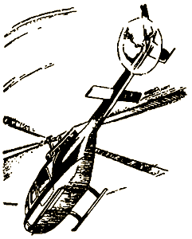

— Что делать? — спрашивает Дэн.

— Какая-то кнопка на панели управления должна посылать сигнал тревоги береговой охране Соединенных Штатов. Интересно, какая? Отец показывал мне, но я, конечно, не запомнил, — раздумывает Джимми.

— По-моему, вот эта, — показываешь ты на одну из кнопок.

— Не уверен. Давай попробуем. — Джимми быстро кладет руку на панель.

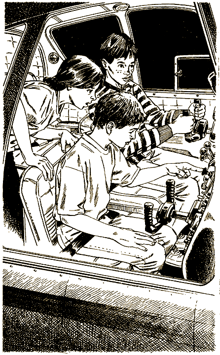

Самолет резко вздрагивает. Из-под него что-то быстро вылетает. Перед передним стеклом неожиданно вырастает огромный столб пламени. Джимми резко поворачивает самолет, чтобы не столкнуться с ним.

— Ура! — кричит он. — Мы уничтожили неприятельский вертолет. Я и не знал, что на этом гидроплане есть ракеты «воздух-воздух».

— Джимми, когда вернемся домой, обязательно устроим в твою честь такой праздник, что никому и не снилось, — смеешься ты.

Потом вы приземляетесь на материке. Сообщаете обо всем полиции. На остров немедленно посылают крейсер береговой охраны и десантно-штурмовую бригаду. Всех твоих одноклассников удается спасти. Террористов арестовывают. Сейчас они ждут суда.

#### КОНЕЦ

# 104

— По-моему, у нас нет шансов, — решаешь ты.

— Ладно, я понимаю, — отвечает Джимми, — пойду сам. Я не обиделся, и докажу вам это. Идите по берегу к краю острова. Там начинаются джунгли. Можете прятаться там сколько угодно. Когда доберусь до материка, сообщу о вас в полицию. Так что скоро вас спасут.

— Ты парень что надо, Джимми. Удачи тебе.

— Спасибо. Вам тоже. — Джимми скрывается в темноте.

Быстро идете вдоль берега. Прижимаетесь как можно ближе к воде. Прилив смоет все следы. Через несколько минут ты слышишь крики и выстрелы вдали. Потом шум гидроплана. Здорово, если Джимми все удалось.

Когда вы добираетесь до края острова, уже совсем светло.

— Джимми не обманул, — говоришь ты Дэну. — Смотри, кругом сплошные джунгли.

— Как ты думаешь, нас здесь не найдут бандиты? — спрашивает Дэн.

— Здесь мы в гораздо большей безопасности, чем на берегу. Всегда успеешь просто скрыться за деревьями.

На берегу пальмы сменяются кипарисами. Кипарисы покрыты мхом и увиты виноградом. Земля под ногами мягкая и кое-где топкая.

— Как ты думаешь, их проклятый патруль доходит досюда? — спрашивает Дэн.

— Не знаю. Надо затаиться и все время смотреть по сторонам.

Зарываешься в ветви винограда. Они так тесно переплелись, что получается настоящий гамак. Скоро вы оба засыпаете.

Тут тебя будит яркий свет. Осторожно выглядываешь из-за кустов. У самого берега стоит на приколе катер. Человек на палубе смотрит в бинокль. Быстро падаешь в траву. Хотя все равно через такие заросли он тебя не разглядит.

— Что там? — просыпается Дэн.

— У берега катер. Видно, за нами охотятся террористы.

— Что же делать?

— Только не ной. Прячемся здесь. Молимся, чтобы Джимми добрался до большой земли. Или идем дальше в джунгли и ищем какие-нибудь плоды.

Любое решение может стать последним и для тебя, и для Дэна.

Если ты остаешься у берега, открой страницу [109](#109).

Если ты уходишь в джунгли, открой страницу [31](#31).

# 105

— Пошли в лес. Там можно отсидеться до утра. Завтра решим, что делать дальше. Скоро совсем стемнеет. В полумраке будет не так уж трудно передвигаться, а вот заметить нас гораздо труднее.

Проходит еще час. Последние лучи солнца пробегают по небу, словно волшебные прожектора.

— Посмотри, как красиво, — говорит Салли.

— Да. Приготовься. Уже пора идти… — тут ты неожиданно замолкаешь.

— Что случилось? — спрашивает Салли.

— Там, у входа в пещеры… Только что оттуда вышли двое мужчин и пошли вниз по дороге, — шепчешь ты. Слышно, как трещат их рации.

— Думаешь, нас засекли?

— Вряд ли. Они бы сразу побежали к нам. Скорее всего, обычный патруль.

Вскоре бандиты возвращаются в пещеры. Решаешь, что пора выбираться из укрытия и уходить в лес. Исчезли последние следы заката, и на другой стороне горизонта уже появляется луна.

Вы уже у самой кромки леса. Вдруг поле сзади вас перерезает яркий луч света.

— Быстро за мной! — шепчешь ты.

Укрываетесь за камнями. Луч света падает туда, где вы только что стояли. Рядом с входом в пещеры ты снова слышишь треск раций. Луч света перемещается и исчезает.

Решаешь подняться, но тут слышишь крики. Несколько машин выезжают из подземного убежища. Свет фар прорезает темноту.

— Они заметили нас, — плачет Салли.

— Не валяй дурака. Кто-то еще попытался удрать, — принимаешься ты ее успокаивать.

— Хорошо бы, они убежали в другую сторону.

Вы с Салли сидите за камнями, пока все не затихает. Уже ночь, но луна светит так ярко, что можно спокойно идти в лес. Немного постояв у тропинки, ты глубоко вздыхаешь, и вы с Салли входите в лес.

Вскоре вы видите небольшую поляну. Здесь неплохо было бы отдохнуть. С удовольствием садитесь под дерево. Повсюду вокруг вас ветви в лунном свете отбрасывают длинные тени.

— Наверное, я схожу с ума, — вздыхает Салли, — мне чудится запах съестного.

— Мне тоже. По-моему, запах исходит во-он оттуда. Там может быть домик или туристская палатка. Я страшно голоден. Вон тропинка. Подойдем поближе?

— Давай. Только аккуратнее. Вдруг это бандиты?

Осторожно вы идете по тропинке. Сквозь деревья брезжит желтый свет.

— Точно, здесь туристы, — шепчешь ты Салли. Подходишь ближе. У костра сидит человек и поджаривает мясо.

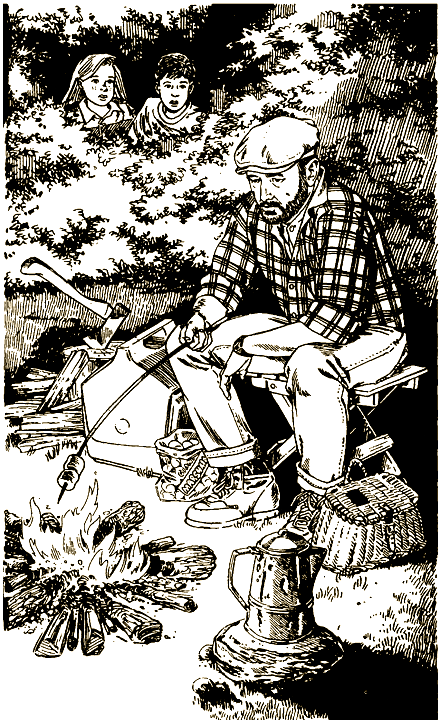

— Попросим у него кусочек?

— Ни в коем случае. Он может быть заодно с террористами.

— А что, если это простой турист?

«Подойти к костру или лучше не рисковать?», — раздумываешь ты.

Если ты подходишь к костру, открой страницу [22](#22).

Если ты снова прячешься в лесу, открой страницу [64](#64).

# 109

Решаете остаться в джунглях. Ты греешься на солнце весь день, а ночью устраиваешься поближе к берегу. На следующее утро Дэн не выдерживает:

— Давай вернемся. Мне наплевать, как бандиты накажут нас. Все равно это лучше, чем умереть от голода в джунглях.

— Ладно, — соглашаешься ты, — вернемся так вернемся. Наверно, Джимми погиб.

Добираться назад вам приходится целый день. У самого лагеря бегают люди с автоматами. Они окружают террористов. Тут появляется Джимми.

— Привет! — весело кричит он. — Куда это вы запропастились? Я как раз собирался вас искать. Как видите, я вернулся. С береговой охраной Соединенных Штатов.

— Молодец! — хором кричите вы с Дэном и пожимаете ему руку.

Ты свободен. Проходит еще совсем немного времени, и вот ты уже дома. Сидишь за столом, с аппетитом уплетаешь вкусный обед и рассказываешь обо всем родителям. Они не верят своим ушам. Вообще-то, ты и сам с трудом веришь, что все это произошло на самом деле.

#### КОНЕЦ

# 111

Решаете идти в Глоувиль. Через несколько минут на дороге появляется машина. Она едет в город.

— Полицейская машина? — спрашивает Салли.

— Да нет… Обычная машина. Внутри двое.

— Давай рискнем. Вдруг они едут не в Глоувиль, а куда-нибудь поближе к дому.

Останавливаетесь. Ты поднимаешь руку. Автомобиль тормозит недалеко от вас. За рулем сидит мужчина средних лет в обычном костюме и рядом женщина в ситцевом платье — наверно, его жена.

— Садитесь назад, — предлагает водитель.

Машина трогается с места.

— Мы в Денвер, — говорит водитель.

— Отлично. Мы тоже, — отзываешься ты.

Беспокойно смотришь в окно, пока машина проезжает через Глоувиль. Вы быстро минуете город и снова выезжаете на шоссе.

— Хотите пить, ребята? На дороге полно пыли, — женщина передает вам большой термос, — тут лимонад. Пейте весь, если понравится.

Салли с жадностью делает несколько больших глотков и передает термос тебе. Ты следуешь ее примеру. Вдруг у тебя начинает сильно кружиться голова, а перед глазами все расплывается.

Проснувшись, ты оглядываешься по сторонам и видишь пальмы и песок. Тебя окружают люди в форме цвета хаки, такой же, как у бандитов в пещерах.

— Где… где я? — слабым голосом спрашиваешь ты.

— Добро пожаловать в главный штаб Международной организации Борцов за свободу, — отвечает один из них. — Я уверен, что тебе понравится у нас.

#### КОНЕЦ

# 115

Вы с Салли пытаетесь остановить какую-нибудь машину. Несколько автомобилей едут в Глоувиль, но в вашем направлении пока ничего нет. Через час наконец на дорогу позади вас выезжает грузовик. Водитель видит вас и останавливается.

— Подвезти вас? — кричит он.

— Пожалуйста, — просите вы и быстренько залезаете в кабину.

— Далеко собрались? — спрашивает водитель и снова трогает с места.

— Еще не знаем, — отвечает Салли, — нам нужно попасть в крупный город.

— Город в другой стороне, вы ошиблись. Высадить вас?

— Не надо, пожалуйста. Мы поедем вместе с вами.

— Это долгое путешествие. Я посоветую вам другое. В нескольких милях отсюда есть аэропорт. Я хорошо знаю управляющего, Смитти. Назовете ему мое имя, и он возьмет вас с собой. Хотя, подождите-ка, я лучше напишу ему записку.

Вы высаживаетесь у аэропорта и благодарите водителя. Несколько небольших самолетов и огромный транспортный аэробус стоят на взлетном поле.

Недалеко от транспортного самолета появляется машина. Двое мужчин в хаки вытаскивают из нее женщину и мальчика. Это же Бази Харгроув и миссис Уилсон! Надо быстро что-то делать.

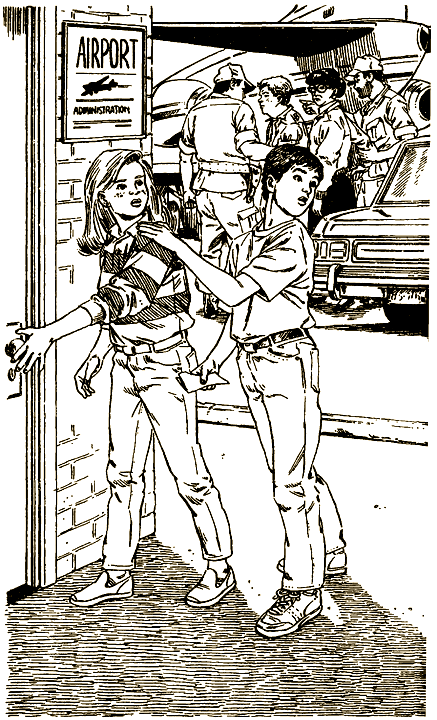

Вы с Салли быстро вбегаете в административный корпус. Около автомата с кока-колой стоит человек.

— Как мне найти Смитти? — выпаливаешь ты.

— Это я.

Отдаешь ему записку шофера.

— Ну конечно, я помогу вам.

— Нам нужна помощь немедленно. На улице только что похитили еще двоих, мы их знаем.

— На улице? Перед нашим зданием? Я и то думал, что это за подозрительные личности шатаются перед входом. Что ж, они будут иметь дело со мной. — Смитти вытаскивает из сейфа револьвер. — Подождите здесь.

Скоро он возвращается. Вместе с ним двое связанных бандитов. Появляются миссис Уилсон и Бази Харгроув. Они широко улыбаются. Вы обнимаетесь.

— Надо срочно звонить в полицию. — Смитти берет телефонную трубку. — Я все равно не понимаю, что происходит.

— Вы слышали о похищении школьного автобуса? — спрашивает Салли.

— Это о котором сообщали в новостях?! — кричит Смитти.

— Ну да. Но в новостях не было самого интересного. Садитесь. У нас есть что вам рассказать.

#### КОНЕЦ

# 116

— Я не вступлю в вашу организацию, — говоришь ты, — вы всего лишь шайка бандитов.

— Боюсь, что в таком случае я ничем не смогу тебе помочь, — вздыхает доктор Крэншоу. Он выходит из лазарета и кричит на ходу: — Сестра, позовите Карлоса.

На несколько минут ты остаешься один. Пытаешься сорвать ремни. В конце концов тебе почти удается освободиться. В этот момент в комнату входит Карлос.

— Вот он, самый главный упрямец, — улыбается он. — Меня восхищает твое мужество. Но я тоже упрям. Когда-нибудь я, возможно, отпущу тебя. Конечно, не сейчас. В тот день, когда весь мир будет у меня в руках.

Карлос издевательски смеется, подает кому-то знак и уходит. Появляются двое бандитов. Их поставили здесь, чтобы ты не вздумал убежать.

Сколько времени тебе суждено здесь пробыть? Сможешь ли ты когда-нибудь освободиться от этого сумасшедшего Карлоса? Ты смотришь на охранников, затем на каменные стены пещеры и понимаешь, что во всяком случае это произойдет не скоро.

#### КОНЕЦ
