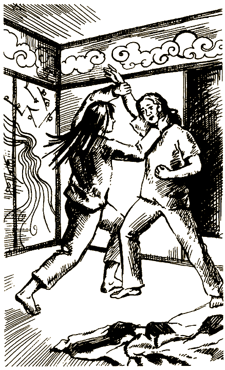

# 0

## Джей Либолд

# СЕКРЕТ НИНДЗЯ

Ты уже наверняка знаешь, как читать эту книгу, если знаком с предыдущими выпусками серии, но все же стоит повторить: это необычная книга! Не пытайся читать ее по порядку, от начала до конца! Тебя ждет множество разных приключений, если захочешь выяснить, что за таинственная сила нарушила спокойствие в школе боевых искусств твоей подруги Нады. Во время чтения тебе придется не раз делать выбор. От твоего решения зависит, сумеешь ли ты разгадать тайну.

В поисках разгадки ты столкнешься с секретами ниндзя и попадешь в их загадочный мир. Может быть, тебе придется даже самому стать ниндзя. Ты сам в ответе за свою судьбу — ведь решения предстоит принимать тебе. Сделав выбор, читай указания в конце страницы, чтобы выяснить, что случится дальше.

Будь осторожен — ниндзя бывают опасны! Чтобы побольше узнать о них, сначала прочти информацию на следующих страницах.

### ОБ АВТОРЕ

Джей Либолд родился в Денвере, штат Колорадо. Кроме «Секрета ниндзя», он написал для серии «Выбери себе приключение» такие книги, как «Sabotage», «Grand Canyon Odyssey», «Spy for George Washington», «The Antimatter Formula» и «Beyond the Great Wall».

### О ХУДОЖНИКЕ

Антонина Иващенко родилась в 1976 году. После окончания Московского академического художественного лицея поступила в Московский художественный институт имени В. И. Сурикова. В ее оформлении вышел сборник «Москва в русской поэзии» «Нилова пустынь», книга А. Ишимовой «Русская история для детей» и др.

Живописные и графические работы экспонировались на молодежных выставках России и Финляндии.

### КОЕ-ЧТО О НИНДЗЯ

Древнее искусство ниндзя называется «ниндзюцу» — умение превращаться в тень или становиться невидимым. Оно возникло из множества источников, в число которых входят японские боевые искусства (будзюцу), китайская военная тактика, мистические тибетские ритуалы и японские горные религиозные культы. Члены горных религиозных сект развили это искусство, тайно передавая его из поколения в поколение. Поскольку ниндзя обычно были выходцами из простонародья, они не придерживались строгого самурайского кодекса поведения, но различными изощренными средствами могли добиваться результатов, недоступных самураям. Ниндзюцу — боевое искусство, которым издавна занимались и мужчины и женщины.

Ниндзя обладал множеством различных навыков. В каждой рю (традиции или школе) существовали собственные приемы, которыми ниндзя обучался у сенсея (учителя или мастера). Ученик мог оттачивать приемы рукопашного боя или боя с применением различных видов оружия. Ученик или ученица постигали способы маскировки, учились взбираться на стены и деревья, применять в бою обманную тактику — разные хитрости и уловки. Одни ниндзя пользовались своим искусством только в целях самозащиты и обороны деревень, где они жили, другие — для разведки и внезапных нападений, а некоторые даже становились наемными убийцами.

Сюжеты большинства приключений в этой книге были взяты из японских народных сказок и преданий. Если верить легенде, боевым искусствам и колдовству «кудзи» ниндзя научились от горных существ под названием «тенгу». Мистические фигуры из пальцев, транс и гипноз помогают ниндзя направлять энергию. Большинство ниндзя применяют эти методы для ведения привычного им духовного образа жизни, но некоторые пользуются ими не по назначению, чтобы управлять другими людьми.

СЛОВАРЬ

Айкидо — «ай» — гармония, «ки» — энергия, «до» — путь. Приемы самообороны, в которых применяют вращательные движения и используют инерцию нападающего, чтобы отразить атаку.

Бива — четырехструнный музыкальный инструмент, напоминающий лютню.

Будзюцу — общее название всех японских боевых искусств.

Горё синко — обычай строить храмы и устраивать празднества, чтобы умилостивить мстительных духов. Основой обычая послужило поверье: когда человек, затаивший злобу, умирает, его дух будет преследовать живых.

Гохэй — священный жезл горных священников.

Гэн — иллюзия. Один мудрец сказал, что весь мир — гэн, представление театра марионеток.

Даймё — феодальный властитель.

Дзёнин — глава отряда ниндзя.

Додзё — помещение, в котором упражняются в боевых искусствах.

Кагинава — кошка или крюк, привязанный к концу веревки.

Ками — дух, демон или божество.

Карате — дословно: «безоружный, с голыми руками». Боевое искусство, основу которого составляют удары кулаками и ступнями ног.

Кимоно — одежда наподобие халата, обычно хлопчатобумажная или шелковая. Ее носят и мужчины и женщины.

Кото — музыкальный инструмент с шелковыми струнами, напоминающий цитру.

Кудзи — колдовство ниндзя. Иногда его называют «девять фигур из пальцев» или «девять слогов». Мистические фигуры из пальцев помогают направлять энергию.

Кусари-фундо — оружие ниндзя, цепь определенной длины с грузами на обоих концах.

Мико — жрица или служительница храма; также колдунья.

Ниндзя — знаток искусства ниндзюцу.

Ниндзюцу — «искусство тени». Особое учение, обучающее боевым искусствам, пользованию специальным оружием, методам маскировки и колдовству.

Родзё — экономка, присматривающая за домашней прислугой.

Ронин — дословно: «человек, плывущий по воле волн». Вольный самурай, у которого нет хозяина и, как правило, нет постоянной работы.

Рю — школа или стиль боевых искусств.

Сайминдзюцу — гипноз ниндзя.

Сакэ — японское рисовое вино.

Сакки — род так называемого шестого чувства, способность выявить недобрые намерения — «силу убийцы».

Самурай — японский воин эпохи феодализма. Самураи принадлежали к высшему сословии), а низшими считались крестьяне, ремесленники и наконец, после всех, торговцы.

Сенсей — мастер, учитель.

Сэппуку — ритуальное самоубийство, почетная смерть для самурая.

Сюгендо — японский горный религиозный культ, предполагающий аскетичный образ жизни и обучающий магии. По традиции основателем сюгендо считается Эн-но Одзуну, иногда называемый Эн-но Гёдза. Приверженцев сюгендо называют ямабуси.

Сюрикен — металлический нож для метания, часто в виде звезды.

Татаригами — ритуальный транс.

Тенгу — мифические существа, которых считают первыми учителями ниндзя. Тенгу изображали иногда добродушными, но хитрыми, а иногда коварными существами с длинными носами или клювами, крыльями, прикрепленными к человеческому старческому телу, и длинными когтями или ногтями на пальцах рук. Они носят плащи из перьев или листьев, живут на деревьях в горах и, согласно одному из описаний, являются олицетворением духовной первоосновы инь, или мрака.

Тенгу-би — свет тенгу, фосфоресцирующие искры, вспыхивающие среди деревьев в горах, где живут тенгу.

Тенгу-кадзе — ветер, который вызывают тенгу, — вихрь, поднимающий людей в воздух.

Фуросики — большой платок для переноски вещей.

Футон — толстый стеганый матрас.

Харагэй — своего рода шестое чувство, способ существа удерживаться в собственном теле и настраиваться на внутреннюю энергию. Хара — центр тяжести человека, точка, находящаяся на пять сантиметров ниже пупка.

Якудзи — самураи-разбойники.

Ямабуси — дословно: «тот, кто не сходит с гор» — священник сюгендо, аскет или колдун.

#### [Начать приключение](#1)

# 1

Раздается раскат грома, и молния над твоей головой сверкает с такой силой, что кажется, небо сейчас разобьется вдребезги. Ты бежишь под крышу. Ливень обрушивается на землю сплошной стеной, струи воды колотят тебя, как кулаки. Похоже, гроза решила разрушить все, что есть на земле.

Оказавшись за раздвижными дверями додзё, ты останавливаешься рядом с подругой Надой. Промокшие до нитки, вы обе наблюдаете за яростью грозы. Еще один оглушительный раскат грома сотрясает дом.

Нада искоса бросает в твою сторону взгляд, словно желая спросить: «Теперь понимаешь, что я имела в виду?» Вы вдвоем садитесь на пол, скрестив ноги, не в силах отвести глаз от бушующей снаружи бури.

— За последнюю неделю это уже третья гроза, — бормочет Нада. — А ведь это время года обычно бывает засушливым. Пойдем поищем сухую одежду для тебя, — предлагает Нада.

Ты следуешь за ней в глубину дома, где Нада протягивает тебе полотенце и кимоно.

Вытираясь и переодеваясь, ты мысленно вспоминаешь, как подружилась с Надой. Ты изучала карате в Калифорнии, прежде чем провести лето в Японии. Там ты познакомилась с Надой и вскоре обнаружила, что у вас много общего, в том числе и увлечение боевыми искусствами. Нада познакомила тебя с новым искусством под названием «айкидо». Год назад ты переехала в город Киото, чтобы пройти интенсивный курс обучения айкидо. Вы с Надой стали лучшими подругами. Ты загрустила, когда три месяца назад Нада вернулась домой, в Нару. Несмотря на расстояние, вы продолжали поддерживать связь.

И вот теперь, завязывая кимоно и готовясь выпить чаю вместе с Надой, ты гадаешь, зачем сегодня утром она так срочно вызвала тебя в Нару.

— Здесь творятся странные вещи, — произносит Нада, заливая кипятком заварку, разложенную по чайным чашкам. — Грозы — всего лишь одна из примет, есть и другие. Стоит задуматься о них, и становится ясно: здесь что-то не так. — Бамбуковой мутовкой она взбивает заварку в каждой чашке в зеленую пену, затем подает одну из чашек тебе. Ты берешь ее обеими руками, впитывая тепло. — Но даже без примет я чувствую рядом присутствие какого-то нового и в то же время древнего существа.

Ты наслаждаешься горьковатым привкусом чая и смотришь на Наду, сидящую напротив, по другую сторону низенького стола.

— Расскажи все с самого начала.

Нада ерзает на бамбуковой циновке.

— Примерно месяц назад я начала замечать, что вещи исчезают и вновь появляются в самых неожиданных местах. Затем в додзё стали раздаваться странные звуки, возгласы, смех. На этой неделе начались грозы. Сами по себе эти признаки еще ни о чем не говорят. Но сакки подсказывает мне, что где-то рядом находится мощная сила, которая стремится уничтожить нас.

— Что такое сакки?

— Нечто вроде шестого чувства, которое появилось у меня много лет назад благодаря тренировкам. С помощью сакки я чувствую недобрые намерения.

— Скажи, не заметила ли ты еще что-нибудь, кроме этих примет? Может, в додзё появились какие-то новые предметы или что-нибудь изменилось?

— Нет, вряд ли… Постой-ка, ты права: кое-что появилось — это меч. Неизвестный человек прислал его нам вместе с письмом, в котором говорится, что меч должен храниться у нас. Мы так и не поняли, что это значит.

— Может, меч какой-то необычный? — спрашиваешь ты.

— Сказать по правде, я видела его лишь мельком. Как тебе известно, я не поклонница оружия, но должна признать, этот меч великолепен. Помню, я заметила на его рукояти загадочные знаки.

— Ты еще не рассказывала об этом сенсею?

— Только упомянула. Он не поверил, что нам грозит опасность. Но теперь, когда ты здесь, я приглашу его присоединиться к нам.

Сенсей — худощавый мужчина с несколькими прядями седых волос на голове и редкой бородкой. Нада знакомит тебя с ним, и сенсей кланяется, а затем садится за чайный стол и ждет, когда Нада заговорит.

— Вам наверняка известно о событиях, которые произошли в нашем додзё в последнее время, — начинает Нада.

— Да, — бесстрастно отвечает сенсей. — Но об этом мы уже говорили. По-моему, не следует терять самообладания, и все пройдет само.

— Разве сегодня вы не слышали гром? — нетерпеливо спрашивает Нада.

— Действительно, в древности такую грозу считали предвестницей войны, но… — Сенсей пожимает плечами.

Нада вскакивает.

— Сенсей, нельзя сидеть сложа руки! Кто-то задумал уничтожить нас!

Сенсей переводит взгляд на тебя.

— Должно быть, мать Нады предвидела будущее, нарекая дочь таким именем. Тебе известно, что означает имя твоей подруги?

— Кажется, «нада» — это бурное, открытое море, в котором трудно вести судно, — неуверенно отвечаешь ты.

— Вот именно, — подхватывает сенсей с улыбкой. — Но когда-нибудь, возможно, когда Нада сама станет сенсеем, она научится терпению.

Твое внимание привлекают несколько зеленоватых огоньков размером с кулак, вспыхивающих над кипарисами.

— Что это? — спрашиваешь ты.

Едва Нада и сенсей оборачиваются, неизвестно откуда взявшаяся молния ударяет в самое высокое из деревьев, раскалывая его надвое. Ты съеживаешься, услышав мгновенно последовавший за молнией раскат грома. Затем наступает тишина.

Похоже, сенсей изумлен. Нада хмурится.

— Ну, теперь вы убедились? — спрашивает она. — Других доказательств не требуется: это дерево мы считали священным. Мы должны защищаться.

Сенсей кивает.

— Ты права, Нада. Я не предполагал, что в наше время возможны подобные события — на нас напали гром и молния! Можно подумать, мы перенеслись в прошлое, во времена наших предков.

— А может, — подхватывает Нада, — это времена предков явились к нам!

— О чем ты говоришь, Нада? — спрашивает сенсей.

— Как я уже объясняла подруге, я чувствую рядом присутствие какого-то древнего существа. Сакки подсказывает мне, что оно настроено враждебно. Возможно, это ками.

— Что такое ками? — спрашиваешь ты.

— Что-то вроде духа, — поясняет Нада. — Дух никогда не умирает, только переселяется. У всех неодушевленных предметов и живых существ есть дух, и этот дух способен проникать в мир, окружающий нас. Если ками преследует нас, наша задача — выяснить, что ему надо.

Сенсей несколько раз переводит взгляд с тебя на Наду и обратно, а затем кладет ладони на стол и произносит:

— Нада, ты потомок древнего рода воинов — впрочем, в течение многих веков они упражнялись в своем искусстве ради мира, а не ради войны. Я уже стар. Тебе придется самой справиться с этой опасностью.

Нада кланяется сенсею.

— Итак, — продолжает сенсей, — как ты предлагаешь поступить?

Наступает тишина. Дождь кончился. Ты вмешиваешься в разговор:

— Пожалуй, надо как следует рассмотреть этот меч, а затем попытаться отыскать человека, который прислал его.

Сенсей кивает:

— Хорошая мысль.

— Есть и другой путь, — произносит Нада и, помедлив, продолжает: — Я говорила, что существо, присутствие которого я почувствовала, показалось мне очень древним. Мы могли бы вернуться в прошлое, чтобы выяснить, откуда оно.

Сенсей бросает пристальный взгляд на Наду и уже собирается что-то сказать, но Нада поднимает руку, останавливая его, и говорит тебе:

— Потом я объясню, в чем дело, а пока давай обдумаем такую возможность.

Cчитаешь, что вам следует выяснить, [кто прислал меч](#78) или думаешь, что возвращение [в прошлое](#17) — удачная мысль?

# 6

Через мгновение после того, как ты схватила Наду за руку и юркнула за дерево, на дороге выросла стена пламени, а на то место, где вы только что стояли, упала сеть. Откуда ни возьмись появились пятеро ниндзя.

Нада выхватывает из фуросики свой лук и меткими выстрелами выводит из строя двоих ниндзя прежде, чем остальные замечают вас. Ниндзя разделяются: двое начинают обходить вас справа, а один — слева.

Нада склоняет голову вправо, сообщая, что берет на себя двоих. Ты киваешь, и она исчезает.

Ты находишь под деревьями ложбинку, распластываешься в ней, прикрывшись листьями и ветками, и поджидаешь третьего ниндзя.

Внезапно прямо перед твоим лицом появляется нога. Ты хватаешься за нее и рывком валишь ниндзя на землю. Ты пытаешься придавить его к земле, но ниндзя пружинисто вскакивает и выхватывает меч. Ты с ужасом видишь, что это меч из додзё Нады!

Ты отражаешь удар приемом айкидо и вцепляешься в правое предплечье ниндзя левой рукой. Резким движением ты перехватываешь руку противника правой рукой и перекидываешь его через правое плечо. Меч отлетает в сторону, а твой противник растягивается на земле.

Краткое мгновение тебя разрывают два желания: схватить меч, который лежит совсем рядом, или помешать ниндзя вновь вскочить.

Тянешься [за мечом](#18) или бросаешься [к ниндзя](#108)?

# 10

Санхиро опускает меч. От удара о твою шею кончик меча ломается. Санхиро ошеломленно переводит взгляд со сломанного клинка на тебя, постепенно осознавая, что произошло. Внезапно на его лице отражается ужас. Он роняет меч и скрывается в лесу.

Повернувшись к Наде, ты говоришь:

— Похоже, мы проучили его.

Нада кивает:

— Давай вернемся в додзё.

#### КОНЕЦ

# 16

Вы бредете по дороге, которая постепенно поднимается в гору.

К полудню вы добираетесь до горной деревушки. Вокруг — ни души.

— Должно быть, все работают в поле, — шепчет Нада.

Наконец вы встречаете старика, который указывает вам тропу, ведущую вверх по склону горы к дому сестер Микияка. Старик объясняет, что сестры Микияка — мико. Поднимаясь по тропе, ты спрашиваешь Наду, кто такие мико.

— Некоторые мико служат в храмах, — отвечает она, — а других считают колдуньями. Среди них попадаются даже ниндзя.

Тропа заканчивается у порога покосившейся хижины, приткнувшейся к склону горы. Вы дважды стучите в дверь. Ее открывает согбенная пожилая женщина с седеющими волосами.

— Что вам нужно? — спрашивает она.

— Прошу прощения, достопочтенная мико, мы хотели бы расспросить вас кое о чем, — говорит Нада.

— Не стой на пороге, сестра, впусти их, — слышится голос из хижины.

Ворча, стоящая в дверях женщина отступает, пропуская вас. Внутри хижины вас приветствует рослая женщина с прямой спиной и белоснежными волосами.

— Садитесь, уважаемые гости, и выпейте чаю. Меня зовут Юкио, а это моя сестра, Гин.

— Знакомство с вами — честь для нас, — отвечает Нада, кланяется и называет свое и твое имя.

Ты показываешь женщинам таинственные знаки, изображенные на рукояти меча, и спрашиваешь:

— Вы не знаете, что это за знаки?

— Эти знаки мне незнакомы, хотя я чувствую, они означают зло, — говорит Гин.

— Мы решили, что этот меч принадлежит одному из кланов ниндзя или рю, — объясняет Нада.

— Знаки напоминают герб Миямотори, — вступает в разговор Юкио. — Но боюсь, больше мы ничем не сможем вам помочь. Я подскажу, что вам нужно сделать. Выше по склону этой горы живет мудрый старый ямабуси по имени Гёдза. Уверена, он объяснит вам…

— Нет-нет, — перебивает Гин. — Если вы хотите узнать о ниндзя, разыщите тенгу. Ниндзя научились своему искусству от них.

— Это неудачный совет, — возражает Юкио. — Вам следует избегать тенгу. Им нравится подшучивать над людьми, но их шутки иногда бывают злыми.

— Кто такие тенгу и ямабуси? — шепотом спрашиваешь ты у Нады.

— Ямабуси — горный священник, — торопливо поясняет Нада. — А тенгу — сведущее в колдовстве существо. Согласно поверью, с виду оно напоминает старика с длинным клювом и крыльями.

— Тенгу отвратительны! — вмешивается Юкио. — Они поджигают хижины, пожирают младенцев и обманывают буддийских монахов. На вашем месте я бы отправилась к Гёдзе.

— Вот только о ниндзя им известно больше, чем любому монаху. И потом, случалось, тенгу помогали людям, — говорит Гин.

Решаешь [поискать тенгу](#20) или решаешь отправиться [к Гёдзе](#44)?

# 17

— Но как мы попадем в прошлое? — спрашиваешь ты.

— Сначала я должна объяснить тебе кое-что, — отвечает Нада. — Помнишь, когда мы познакомились, то узнали, что у нас много общего, в том числе стремление отказаться от более агрессивных видов будзюцу, боевых искусств, ради айкидо? Мы беседовали о том, каким образом айкидо объединяет нашу физическую, умственную и духовную энергию, о том, как оно придает нам внутреннее равновесие, благодаря которому мы получаем не только средство самозащиты, но и новый образ жизни. Ты прекратила заниматься карате ради айкидо.

— И ты тоже, — вставляешь ты.

— Не совсем так. Видишь ли, моя семья на протяжении веков представляла собой клан ниндзя. Я изучала ниндзюцу.

— Почему же ты бросила заниматься им? — спрашиваешь ты.

— Я не бросала, — возражает Нада, — просто на время мне хотелось сосредоточиться на айкидо. Я боялась, что случится беда, боялась пойти по пути насилия, ведь тратя слишком много времени на совершенствование смертоносных приемов, невольно испытываешь желание испробовать их в деле. Возможно, когда-нибудь, когда я стану мудрее, я возобновлю занятия.

Ты киваешь, переваривая информацию. От матери ты слышала удивительные рассказы о ниндзя. Ниндзя, говорят, умели становиться невидимыми и даже владели колдовским искусством. Тебе давно хотелось побольше узнать о ниндзюцу, а теперь выяснилось, что твоя лучшая подруга — ниндзя!

— Вместе с боевыми искусствами я изучала кудзи, — продолжает Нада. — Это особое колдовство, благодаря которому можно призвать на помощь силы вселенной. Как только ты призовешь эти силы, все, из чего состоит настоящее, — время и материя — становится прозрачным. Это все равно что научиться открывать дверь, о существовании которой ты даже не подозревала.

— Для этого понадобится понять смысл гэн, — добавляет сенсей.

— Гэн — это иллюзия, — объясняет Нада. — Представь себе физический мир, в том числе и наши тела, в виде сгустка вещества, которое может распасться на составные части. Существуют способы проскальзывать в почти незаметные трещины, если правильно настроиться на вибрацию материи и времени. Конечно, это лишь общее описание, но, чтобы вникнуть в подробности, понадобятся годы.

— У твоего плана есть лишь один недостаток, Нада, — говорит сенсей. — Он слишком опасен. Ты уже несколько лет не упражнялась в искусстве кудзи, к тому же тебе известно, как это рискованно — путешествовать в прошлом.

— Но другого выхода у нас нет, — возражает Нада. — С вашей помощью мы обязательно справимся.

— По крайней мере можно попытаться побольше узнать о ками, если это он, прежде чем идти на такой риск, — предлагает сенсей.

— Но как? — спрашиваешь ты.

— С помощью татаригами, — отвечает сенсей, — то есть транса.

— Но ни вы, ни я никогда не были проводниками в трансе, — напоминает сенсею Нада.

— Верно, — кивает сенсей и смотрит на тебя.

— Транс — почти то же самое, что гипноз, — объясняет тебе Нада. — С твоей помощью мы предложим ками поговорить и выясним, что ему нужно. Но это еще опаснее, чем отправляться в прошлое. Ками может вселиться в твое тело и завладеть тобой.

— Можно попросить Тацумо, священника сюгендо, управлять трансом, — предлагает сенсей.

— А если это на редкость могущественный ками… — Нада умолкает.

Ты не против, чтобы тебя ввели [в транс](#54) или ты предпочитаешь не погружаться в транс, а сразу отправиться [в прошлое](#40)?

# 18

Ты хватаешь меч и мгновенно поворачиваешься к ниндзя. Он лежит на земле, не сводя с тебя глаз. Ты пробуешь отвернуться, но не можешь. Нада сражается с двумя другими ниндзя, а ты стоишь, словно примерзнув к месту.

Ниндзя выкрикивает условный сигнал, приказывая двум товарищам прекратить бой с Надой. Ты беспомощно наблюдаешь, как он отбирает у тебя меч и ниндзя спасаются бегством.

Вернувшись к тебе, Нада сразу понимает, что с тобой случилось. Она складывает пальцы в несколько фигур кудзи, и твое оцепенение быстро проходит.

— В погоню! — спохватываешься ты. — У них меч — тот самый, который прислали в додзё!

Нада бросается следом за ниндзя, но вскоре возвращается.

— Они исчезли, как сквозь землю провалились, — говорит она.

Вы с Надой устраиваете в лесу привал и отдыхаете после боя. За обедом, состоящим из риса и овощей, вы обсуждаете случившееся.

— Должно быть, мы случайно наткнулись на засаду, предназначенную для кого-нибудь другого, — предполагаешь ты.

— Да, — соглашается Нада, — иначе ниндзя не сбежали бы, оставив нас в живых.

— По крайней мере теперь мы знаем, у кого находится меч, — продолжаешь ты. — Пожалуй, все, что нам остается сделать завтра, — выяснить, откуда явились ниндзя.

Утром вы вновь выходите на дорогу, ведущую через долину. Подобно большинству дорог в феодальной Японии, это скорее узкая тропа, предназначенная для конных и пеших путников.

Через некоторое время вам попадается деревня покрупнее. Вы переходите вброд широкую, но мелкую реку. На другом берегу дорога раздваивается. Поодаль, слева от вас, возвышаются горы, справа виднеется долина.

Вы с Надой останавливаетесь у развилки.

— Я не знаю, в какую сторону лучше повернуть, — признается Нада. — Выбирай сама.

Поворачиваешь налево, [к горам](#16) или направо, [к долине](#31)?

# 20

— Возможно, тенгу нам помогут, — говоришь ты.

— Да, помочь они способны, — подтверждает Гин. — Вопрос лишь в том, захотят ли они? Скорее, они будут не прочь полакомиться вами.

Гин выводит вас из дома и указывает на одну из гор.

— Я знаю тенгу, которые живут вон там. Самого мудрого из них зовут Сэнлу. Тайная тропа приведет вас прямо к мосту через ущелье между горами. Ищите тенгу-би — свет тенгу.

Вы благодарите Гин и Юкио и направляетесь по тайной тропе. Вскоре вы выходите к мосту, шаткому сооружению из веревок и досок.

— Перейдем мост по очереди, — решаешь ты.

Ты перебираешься на другую сторону ущелья первой. Как только ты сходишь с моста, Нада идет следом.

Вдруг над тобой проносится крылатая тень. Ты запрокидываешь голову, и поначалу тебе кажется, что над вами кружит огромная птица. Но по мере того, как эта птица снижается над Надой, ты с ужасом видишь красное морщинистое лицо, длинный нос-клюв и человеческое тело. Это тенгу!

Тенгу впивается когтями в спину Нады и тащит ее прочь. Нада отчаянно цепляется за веревочные поручни моста, проклиная тенгу. Что делать? Может, попытаться броситься к Наде и разжать когти тенгу? Или же сбить его с помощью сюрикена — металлического метательного ножа?

Пытаешься [освободить Наду](#23) или [выхватываешь сюрикен](#103)?

# 22

Ты входишь следом за Надой в потайную дверь. Вы оказались в длинном узком коридоре и молча, ощупью движетесь во мраке. Ты чутко вслушиваешься в звуки, раздающиеся где-то впереди.

Вы подходите к тому месту, где один коридор пересекается с другим. Перед вами открываются пути в четырех направлениях. Негромкий звук, донесшийся справа, заставляет вас повернуть направо. Вы идете по коридору, пока он вдруг не заканчивается тупиком. Вы ощущаете стены.

— Я что-то нашла, — шепчет через минуту Нада. — Едва дотянулась… По-моему, это нижняя перекладина веревочной лестницы. — Она подпрыгивает, хватается за перекладину и начинает подтягиваться.

— Подожди! — останавливаешь ее ты. — Неужели тебя ничто не настораживает? По-моему, все складывается чересчур удачно — как будто кто-то хочет, чтобы мы следовали именно по этому пути.

— Возможно, ты права, — соглашается Нада, — но теперь, когда до разгадки осталось несколько шагов, мне не хочется поворачивать обратно.

— Ручаюсь, наверху нас поджидают, — возражаешь ты. — Мы попадем прямиком в ловушку.

— Может быть, — отвечает Нада, — но у нас есть одно преимущество: мы знаем, что, возможно, нас ждет ловушка. Мы можем заранее обдумать план.

Соглашаешься взобраться [по лестнице](#96) или убеждаешь Наду пойти [другим путем](#100)?

# 23

Ты бросаешься к подруге и начинаешь вырывать ее из когтей тенгу. Тенгу только смеется, сбивает тебя с ног взмахом крыльев и улетает прочь вместе с Надой. Тебе приходится схватиться за веревки моста, чтобы не свалиться в ущелье.

Ты подтягиваешься и влезаешь на мост, а затем добираешься до земли. Ты думаешь только о том, как найти Наду и спасти ее от тенгу. Уже смеркается — наступает вечер.

Ты бредешь вверх по тропе. Дневной свет быстро угасает, и вскоре тебе приходится пробираться вперед ощупью.

С вершины горы слышится рокот. В просветы между ветками деревьев ты мельком видишь странные голубоватые вспышки, мерцающие у самого гребня горы. Ты понимаешь, что это свет тенгу — тенгу-би.

Ты прибавляешь шагу, но внезапно твое внимание привлекают звуки, доносящиеся из чащи леса. Невероятно, но ты слышишь кото — музыкальный инструмент с шелковыми струнами, напоминающий цитру. Тебе никогда еще не доводилось слышать такой сверхъестественной, прекрасной музыки — похоже, в ней слилось пение звезд и деревьев. Ты размышляешь над тем, сумеет ли неизвестный музыкант помочь тебе найти тенгу.

Идешь на звуки кото, надеясь, что они приведут тебя [к тенгу](#24) или продолжаешь идти туда, где виден [тенгу-би](#110)?

# 24

Пробираясь сквозь низко нависающие ветви деревьев и кусты, ты идешь по лесу туда, откуда доносится музыка. Подойдя поближе, ты видишь свет костра. Приближаешься к краю поляны, и твоему взору открывается удивительное зрелище: ямабуси с блестящими глазами танцуют вокруг костра, пьют сакэ и подкрепляются рыбой с рисом.

Один из ямабуси замечает тебя и зовет к себе. Ты начинаешь:

— Я только хотела спросить…

— Все вопросы потом, — перебивает ямабуси, втягивая тебя в круг. — Сейчас время плясать. Станцуй для нас.

Музыка прекращается, а затем раздаются звуки новой, более медленной мелодии.

— Танцуй! — неистово кричат ямабуси.

Решаешь [танцевать](#95) или предпочитаешь поскорее [уйти](#114)?

# 28

— Похоже, я оказалась в меньшинстве, — недовольно бурчит Нада.

Вы направляетесь по дороге вслед за самураем, который говорит, что его зовут Сасами. Вы идете за ним через заброшенную деревню и наконец выходите на широкую дорогу — очевидно, по ней часто проходят путники.

— Здесь нам ничто не грозит, — говорит Сасами. — Якудзи держатся в стороне от таких оживленных дорог.

Вы шагаете по дороге вместе с Сасами. Неожиданно сзади слышатся крики: «Кланяйтесь! Кланяйтесь!»

Приближается шествие. Сасами и Нада мгновенно падают ниц на обочине дороги, и ты следуешь их примеру.

Ты украдкой поднимаешь голову, разглядывая проезжающих мимо конных самураев, носильщиков и слуг. В середине процессии движется паланкин. Его несут двое мужчин, в паланкине восседает даймё — феодальный властитель. Шествие останавливается, к вам приближаются двое самураев.

— Даймё хочет видеть вас, — говорят они.

Вместе с Сасами и Надой ты робко приближаешься к паланкину. Занавеси раздвигаются, даймё оглядывает вас, а затем спрашивает у Сасами его имя.

Услышав ответ, даймё продолжает:

— Значит, ты — тот самый самурай, который согласился защищать одну из здешних деревень от якудзи?

Интересно, думаешь ты, как даймё узнал об этом.

Сасами неуверенно кивает и объясняет:

— Я оказался в безвыходном положении…

— И тем не менее кодекс самурая обязывает тебя быть верным своему слову. Лучше погибнуть в благородном бою, чем сдаться, — заявляет даймё.

Сасами молчит, и даймё продолжает:

— Я позволю тебе умереть достойно — ты совершишь сэппуку.

Ты изумленно приоткрываешь рот: тебе известно, что сэппуку — это ритуальное самоубийство.

— Что касается твоих слуг, — говорит даймё, указывая на тебя и Наду, — я намерен пощадить их. Они станут моими слугами.

Теперь тебя беспокоит не только ужасная судьба Сасами: похоже, пройдет немало времени, прежде чем вам удастся возобновить поиски.

#### КОНЕЦ

# 31

Никто из жителей придорожных селений ничего не знает о ниндзя. На пути вам попадается еще одна горная деревушка. Услышав ваши расспросы о мече, жители пугаются.

— Спросите у Хитоси, — говорят они.

К полудню вы находите Хитоси — худощавого юношу с проницательным взглядом. Он действительно знает, где найти ниндзя.

— Они живут вон там, в замке. — Хитоси указывает на горный склон над деревушкой. — Но самим вам ни за что туда не добраться. Я провожу вас — разумеется, за плату.

Ты уже хочешь сказать, что вам нечем платить, но Нада тебя опережает:

— Мы заплатим не раньше, чем окажемся возле замка.

Хитоси задумывается, затем кивает.

— Придется дождаться темноты, — говорит он и уводит вас с Надой на уединенную поляну, окруженную кедрами. — Побудьте здесь, а я приду за вами, когда стемнеет.

После ухода Хитоси ты говоришь Наде:

— Он не внушает мне доверия.

— И мне тоже, — признается она. — Но кроме него, ждать помощи нам не от кого.

— Он показал нам, где находится замок, — напоминаешь ты. — Может, нам самим удастся отыскать дорогу?

— Вряд ли, — отвечает Нада. — Уверена, там полно ловушек и обманных троп. Подобраться к жилищу ниндзя нелегко.

Говоришь, что лучше разыскать [дорогу в замок](#47) самим, или решаешь [дождаться Хитоси](#50)?

# 33

Ты медленно подходишь к колодцу, ожидая подвоха. Убедившись, что тебе ничто не угрожает, ты крепко вцепляешься в каменный борт колодца, наклоняешься и заглядываешь внутрь.

Увиденное изумляет тебя — в колодце нет никаких призраков, только молодая женщина сидит на дне перед зеркалом, расчесывает длинные черные волосы.

Плавные взмахи гребня завораживают тебя. Женщина поднимает голову и улыбается, и твое сердце сжимается от ужаса. Не в силах отвести взгляд, ты перегибаешься через край колодца, наклоняясь еще ниже. Ты теряешь ощущение равновесия, переваливаешься через край и плюхаешься в холодную воду.

Ты всплываешь на поверхность, хватая ртом воздух и стараясь удержаться на плаву. К счастью, у тебя на поясе висят приспособления, чтобы карабкаться по стенам, — веревка и бамбуковая лестница с металлическими крючками по всей длине. Ты находишь выбоину в стене колодца, вонзаешь в нее крючок и начинаешь карабкаться вверх.

На полпути к отверстию колодца тебя окликает голос из воды:

— Постой, не уходи! Пожалуйста, спаси меня!

Ты смотришь вниз. Под водой ты различаешь старое мутное зеркало. Подъем по отвесной стене колодца уже утомил тебя, и ты размышляешь, не решил ли призрак колодца вновь заманить тебя в ловушку.

Решаешь вернуться [за зеркалом](#41) или продолжаешь карабкаться [по стене](#48)?

# 35

Из последних сил ты разводишь руки в стороны, выходя из транса. Гохэй падает, тебя окружает мрак.

Открыв глаза, ты с удивлением видишь, что лежишь в углу комнаты. Нада и сенсей стараются прижать твои руки и ноги к полу, Тацумо похлопывает тебя по спине. Увидев, что ты вышла из транса, они разжимают руки.

— Не вставай, — предупреждает Тацумо, удерживая тебя на полу, — лежи тихо. — Он начинает массировать твои ноги, а сенсей — руки.

— Как тебе удалось разорвать чары? — спрашивает Нада.

— Сама не знаю, — отвечаешь ты. — Я поняла только, что должна действовать, пока не поздно.

— Тебе повезло, — кивает она.

— Да, — подтверждает Тацумо, — ты оказалась во власти на редкость могущественного ками.

— Вам удалось что-нибудь выяснить? — спрашиваешь ты.

— Достаточно, чтобы я убедилась: надо вернуться в прошлое и узнать, откуда взялся этот ками, — отвечает Нада. — Очевидно, тобой завладел ками воина, жившего давным-давно. Кажется, он враждовал с одним из моих предков и пытался исполнить проклятие, лежащее на моей семье.

— Значит, надо отправиться в прошлое, узнать, что это было за проклятие, и снять его, — говоришь ты.

— Вот именно, — подтверждает сенсей. — Но сначала тебе придется в течение нескольких дней пройти курс подготовки. Ты будешь учиться не только манерам и обычаям прошлого — тебе придется изучать основы ниндзюцу. Они потребуются во время поисков этого воина.

Через три дня подготовка к путешествию в прошлое заканчивается. Нада объясняет, что энергия меча и нами направят вас в то время и пространство, откуда они явились. Ты садишься в пустом додзё и медитируешь. Спустя некоторое время Нада просит начать обратный отсчет, а сама начинает гипнотизировать тебя с помощью искусства сайминдзюцу.

— Десять, девять, восемь, семь…

Последним, что ты видишь, становятся скрученные пальцы Нады — они сложены в точно такую же фигуру, как пальцы Тацумо, когда он вводил тебя в транс.

Открыв глаза, ты видишь, что стоишь рядом с Надой на дороге близ японской деревни феодальных времен, и тут вас чуть не сбивает самурай в боевых доспехах. Задыхаясь, он останавливается, глядя на вас.

— Ради вашего же блага советую поскорее уйти с дороги и спрятаться, где удастся, — говорит он.

— Почему? — спрашиваешь ты.

— Потому, что сюда с минуты на минуту нагрянет банда конных якудзи.

— Кто такие якудзи?

— Если вы никогда не сталкивались с ними, считайте, что вам повезло. Это самураи-разбойники, которые грабят города и села. Я согласился встать на защиту этой деревни, но в то время я думал, что приближаются всего два-три якудзи. А теперь я знаю, что у меня будет по меньшей мере шестеро противников!

— Мы поможем тебе защитить деревню, — заявляет Нада.

— Не смеши! — возражает ваш собеседник. — Ведь вы не самураи. Даже с вашей помощью у нас не будет ни малейшего шанса.

— Мы не беспомощны, — настаивает Нада.

Самурай качает головой.

— Если хотите, можете сбежать вместе со мной, пока не поздно, — я постараюсь защитить вас. Но только глупец согласится встретиться лицом к лицу с якудзи.

Однако Нада не двигается с места. Приходит твоя очередь вступить в разговор.

Говоришь Наде: «[Надо спасаться, пока не поздно](#28)» или говоришь самураю: «[Мы останемся и поможем защитить деревню](#59)»?

# 37

Ты удивляешься, увидев, как меч взмывает в воздух, хотя сознаешь, что в движение его привел ками, а не ты. Ты уворачиваешься от удара, перекатываешься на спину, приподнимаешься и описываешь клинком дугу. Нада валится на пол, ты тоже падаешь на спину.

Внезапно все силы покидают твое тело, словно их уносит вихрь. Знания, которыми ты владела всего мгновение назад, исчезают.

С ужасом ты наконец понимаешь, что произошло. Торжествующий ками покинул твое тело. Нада мертва. А тебе вскоре предъявят обвинение в убийстве.

#### КОНЕЦ

# 40

— По-моему, нам следует отправиться в прошлое, — говоришь ты. — Но как это сделать?

— С помощью сайминдзюцу, — отвечает сенсей. — Это почти то же самое, что гипноз, только гораздо сильнее. Он поможет тебе сопровождать Наду.

У тебя возникает еще один вопрос:

— Но как узнать, в какое время и место мы должны попасть?

— Знаки на рукояти меча помогут нам, — отвечает Нада. — Мы перерисуем их и возьмем рисунок с собой. Нас будут направлять меч и энергия, которую излучает ками.

— Прежде всего вам надо подготовиться к путешествию во времени, — говорит сенсей. — Ты должна освоить основные приемы ниндзюцу и узнать обычаи прошлого, чтобы не выдать себя странным поведением.

Следующая неделя проходит в приготовлениях к путешествию в прошлое. Днем ты упражняешься в искусстве ниндзюцу вместе с Надой и сенсеем, а по ночам учишь историю Японии. Сенсей разыскивает старую одежду, благодаря которой вы сойдете за странствующих плотников, поскольку крестьянам в те времена не позволялось покидать свои поля. Кроме того, сенсей дает вам обеим по большому платку-фуросики для переноски вещей.

Наконец наступает долгожданный день. Нада усаживает тебя на скамью в додзё. После медитации она встает и устремляет на тебя взгляд. С помощью приемов сайминдзюцу вы вместе начинаете обратный отсчет:

— Девять, восемь, семь, шесть…

Открыв глаза, ты обнаруживаешь, что стоишь рядом с Надой посреди рисового поля. Крутые, поросшие лесом холмы возвышаются по обе стороны от вас.

— Идем, — говорит Нада.

— Но как мы узнаем, куда идти?

— Это ни к чему, — отвечает Нада, шагая к дамбе.

— Что ты имеешь в виду? — спрашиваешь ты.

— Мы просто побредем куда глаза глядят и рано или поздно найдем то, что ищем.

— Разве у тебя нет плана? — настойчиво допытываешься ты.

— Есть, — кивает Нада. — Мой план — бесцельно брести куда-нибудь, пока мы не найдем того, кто нам поможет.

Нехотя ты следуешь за Надой и выходишь на дорогу, ведущую к краю долины. До сих пор ты была уверена, что Нада точно знает, что делать дальше. Ты погружаешься в размышления о том, в какое опасное дело ввязалась.

Там, где кончаются поля, долина сужается. Когда вы приближаетесь к повороту дороги, с пруда внезапно взлетает стая испуганных диких гусей. Что могло их напугать? — гадаешь ты. Внезапно у тебя возникает желание свернуть с дороги.

Хватаешь Наду за руку и бросаешься [в лес](#6) или упрекаешь себя за беспричинный испуг и остаешься [на месте](#82)?

# 41

Ты начинаешь спускаться по лестнице. Тем временем голос продолжает:

— Меня зовут Яёй. Однажды я отправилась в паломничество вместе с моей госпожой, богатой женщиной. В пути она разбила вазу и испугалась, что муж накажет ее. Поэтому она столкнула меня в этот колодец и рассказала всем, что я украла вазу, а потом от раскаяния совершила самоубийство, прыгнув в колодец. Моя душа заключена в этом зеркале, — продолжает Яёй, когда ты спускаешься на последнюю перекладину лестницы. — Если ты достанешь зеркало из колодца, душа моя освободится. И, может быть, потом зеркало поможет тебе.

Ты бросаешься в воду и снова выныриваешь на поверхность с зеркалом в руках. Взяв его под мышку, ты начинаешь новое утомительное путешествие вверх по лестнице. Из колодца ты выбираешься с трудом, совершенно выбившись из сил.

— Вот ты где! — восклицает Нада. — Что ты делала в колодце? Ведь Юкио предупреждала: от него надо держаться подальше!

Ты протягиваешь Наде зеркало и падаешь на землю.

— Я спасла призрака, — отдышавшись, говоришь ты, рассказываешь историю призрака зеркала и добавляешь: — Он сказал, что зеркало поможет нам.

— Я надеюсь только на одно: что тебя не обманули, — замечает Нада и спустя мгновение выпаливает: — Смотри-ка!

Ты садишься. Нада смотрит в зеркало. В зеркале ты видишь пятерых ниндзя — тех самых, что напали на вас. Их предводитель несет знакомый вам меч.

— Они идут по дороге, ведущей через долину, — говорит Нада. — Бежим!

Вы быстро собираете свое снаряжение и спускаетесь с горы. Через считанные минуты вы с Надой оказываетесь в долине и спешите к дороге, чтобы встретиться с ниндзя.

— Мне пришла в голову одна мысль, — вдруг говорит Нада. — Юкио сказала, что знаки на рукояти меча напоминают фамильный герб Миямотори. Миямотори — клан ниндзя, некогда смертельно враждовавший с моими предками. Может, ниндзя, с которыми мы столкнулись, принадлежат к этому клану?

Ты не успеваешь ответить, за поворотом дороги вы сталкиваетесь лицом к лицу с пятью ниндзя. Их вожак усмехается, а затем на его лице появляется жестокое выражение. Он вскидывает меч.

— Постой! — Нада поднимает руку. — Ответь на один вопрос: ты Миямотори?

— Я Санхиро Миямотори, — бесстрастно произносит вожак ниндзя, приближаясь к вам. Неожиданно для себя ты протягиваешь ему зеркало. Миямотори застывает. На его лице отражается ужас, пальцы разжимаются, выпуская меч. Санхиро и остальные поворачиваются и стремглав убегают.

Дождавшись, когда ниндзя скроются из виду, ты поворачиваешься к Наде и говоришь:

— Хотела бы я знать, что они там увидели?

— А мне об этом даже думать не хочется, — отвечает Нада, глядя на зеркало. — Говорят, зеркало способно отразить душу человека. Как бы там ни было, похоже, мы раскрыли тайну. Можно возвращаться в додзё.

— А меч? Мы возьмем его с собой? — спрашиваешь ты.

— Это ни к чему, — отвечает Нада. — В будущем меч и так находится в нашем додзё. Кроме того, вмешиваться в события прошлого небезопасно.

#### КОНЕЦ

# 42

Дождавшись, когда Санхиро уйдет, ты незаметно выскальзываешь из своего убежища. Ты возвращаешься в комнату, где видела меч, но оказывается, его уже кто-то взял. Решив, что искать меч слишком рискованно, ты выбираешься из комнаты через окно и благополучно возвращаешься в лес, окружающий замок.

Ночью тебе удается немного отдохнуть — ты чутко дремлешь. Наступает утро, и ты прячешься среди деревьев у ворот замка, ожидая появления Санхиро. Дождавшись его, ты слышишь, как он говорит, что вернется в замок сразу же, как только расправится с Кураямой.

Словно тень, ты крадешься вслед за Санхиро по тропе, ведущей к деревне. Но путь Санхиро неожиданно преграждает еще один ниндзя, выскочивший из-за деревьев, — ты догадываешься, что это и есть Дана Кураяма. Ты не слышишь, о чем они говорят, но видишь, как они сворачивают с дороги и выходят на поляну. Противники опускаются на колени друг напротив друга, кланяются, затем встают и начинают поединок. 

Он продолжается всего несколько минут, за которые тебе удается увидеть поразительные удары мечом и искусные оборонительные приемы. Побеждает Кураяма.

Ты привстаешь, чтобы выйти на поляну. Едва завидев тебя, Кураяма скрывается в лесу. Ты слышишь, как умирающий Санхиро что-то бормочет. Ты подходишь поближе. Оказывается, Санхиро проклинает род Кураяма! Неожиданно тебя осеняет: вот она, причина странных событий в додзё! Благодаря способностям, переданным Надой, ты знаешь, как снять проклятие — с помощью нескольких знаков кудзи. Сняв с рода Нады проклятие, ты спешишь в деревню, где осталась твоя подруга.

#### КОНЕЦ

# 44

— Пожалуй, надежнее и безопаснее будет разыскать Гёдзу, — говоришь ты.

— Верно, — соглашается Юкио.

— Но он не в силах справиться с ниндзя, — возражает Гин.

— Возвращайтесь в деревню, — советует Юкио. — За самым большим кедром вы найдете тропу. Она ведет вверх по склону горы к заброшенному монастырю. Иногда Гёдза ночует там. Если вы не застанете его на месте, то сможете переждать ночь в монастыре. А утром, — продолжает Юкио, — поищите Гёдзу на горе.

Вы с Надой кланяетесь и благодарите сестер за помощь. Вы уже уходите, когда Юкио окликает вас:

— Совсем забыла: держитесь подальше от колодца в монастыре, там обитает призрак. Удачи вам!

Следуя указаниям Юкио, вы добираетесь до заброшенного монастыря. Его двор зарос кустарником, стены потрескались и местами обрушились. Вокруг нет никаких следов Гёдзы, поэтому вы с Надой ужинаете рисовыми лепешками и устраиваетесь на ночлег.

— Страшноватое место, — замечаешь ты.

Утром монастырь выглядит приветливее. Пока Нада готовит завтрак, ты бродишь по монастырю и находишь старый каменный колодец. На вид он кажется совершенно безобидным, и в тебе вспыхивает любопытство: интересно, почему Юкио советовала держаться от колодца подальше?

Решаешь заглянуть [в колодец](#33) или [поскорее уйти](#109)?

# 47

— И все-таки нам не следует доверять Хитоси, — настойчиво убеждаешь ты Наду.

— Мы можем попытаться разыскать замок, — нехотя говорит Нада, — но, если нам не повезет, давай до наступления темноты вернемся сюда и попытаем удачи вместе с Хитоси.

Вы с Надой идете в деревню и находите тропу, ведущую к узкой долине, которую показал вам Хитоси. Сразу за деревней вам попадается развилка, затем еще одна и еще.

— Нужно каждый раз запоминать, куда мы поворачиваем, — начинает Нада, — иначе нам никогда отсюда не…

Внезапно неведомая сила хватает вас обеих за ноги и поднимает в воздух. Прежде чем вы успеваете опомниться, вы уже покачиваетесь между двумя деревьями, крепко схваченные за ноги веревочными петлями.

— Ну что же, — бормочет Нада, — по крайней мере теперь мы не заблудимся.

#### КОНЕЦ

# 48

Ты смотришь вниз, уверенная, что тебе не хватит сил еще раз спуститься на дно колодца и выбраться из него. Кроме того, призрак колодца уже однажды обманул тебя.

Ты продолжаешь медленно, с огромным трудом карабкаться по лестнице, но каждый раз, глядя вверх, обнаруживаешь, что расстояние до края колодца ничуть не сократилось. Твои мышцы ноют от усталости. Как сквозь сон, ты слышишь, что где-то далеко Нада зовет тебя. Но у тебя уже не осталось сил, чтобы ответить. По правде говоря, тебе не хватает сил даже для того, чтобы держаться за перекладины лестницы. Твои пальцы разжимаются, и ты падаешь в воду.

#### КОНЕЦ

# 49

После поисков в комнате ты прокрадываешься в коридор. Тебе удается осмотреть комнаты, двери которых выходят в коридор.

В одной из комнат тебе попадается свиток с описанием всех подвигов владельца замка, Санхиро Миямотори. Ты размышляешь, почему это имя кажется тебе знакомым. Внезапно ты понимаешь, что оно составляет часть знаний, переданных тебе Надой. Откуда-то тебе известно, что Миямотори — давний враг рода Кураяма, предков Нады.

Услышав шаги в коридоре, ты застываешь. Дверь открывается. Ты мгновенно подпрыгиваешь с места вверх и хватаешься за потолочную балку. В комнату входят двое мужчин. Один из них говорит:

— Давайте лучше уйдем в комнату дзёнина. Он может вернуться с минуты на минуту.

Как только дверь за незнакомцами закрывается, ты беззвучно спрыгиваешь на пол и решаешь последовать за ними. Должно быть, эти мужчины говорили именно о Санхиро. Ты тенью крадешься за ними по коридорам замка. Наконец они подходят к двери, ведущей в комнату Санхиро. Дверь охраняют два стражника. Дождавшись, когда первые двое мужчин войдут в комнату, ты вырастаешь перед охранниками как из-под земли. Не успевают они поднять оружие, как ты поднимаешь руку и останавливаешь их взглядом.

Ты проходишь в тесную комнату слева от большой и открываешь раздвижные двери, сталкиваясь лицом к лицу с людьми, за которыми следовала раньше, и еще двумя незнакомцами. Прежде чем они успевают шевельнуться, ты вводишь их в состояние гипноза с помощью мистических знаков кудзи. Ты закрываешь раздвижные двери, садишься за ними и ждешь прихода Санхиро.

Вскоре ты слышишь, как Санхиро занимает свое место на возвышении в передней части комнаты.

— Разведчик прибыл? — спрашивает он. — Отлично. Пусть войдет. — Спустя минуту Санхиро продолжает: — Ну, какие вести ты принес от Кураямы?

Ты напрягаешь слух.

— Очень важные, — отвечает разведчик. — Дана Кураяма направляется сюда, чтобы вызвать тебя на бой. Он заявляет, что больше не позволит тебе разбойничать в округе.

Санхиро смеется.

— Вот и хорошо! Наконец-то я встречусь лицом к лицу с давним врагом. С таким мечом мне нечего, бояться.

— Он уже близко, — продолжает разведчик. — Скорее всего, он будет здесь завтра утром.

— Прекрасно, — говорит Санхиро. — Но я не стану сидеть и ждать его. Утром мы устроим бой там, где встретимся.

Ты продолжаешь слушать разговор, но собеседники больше не упоминают ни про меч, ни про Дану Кураяму. Санхиро отпускает разведчика и других слуг. Только ты остаешься с загипнотизированными охранниками в боковой комнате. Ты размышляешь о том, что теперь делать. Завтрашний бой между Санхиро и предком Нады может стать ключом к разгадке. Но ты не уверена, стоит ли ждать до завтра. Может быть, лучше вступить в схватку с Санхиро самой — и немедленно, пока он остался один.

Вызываешь Санхиро [на поединок](#71) или решаешь последовать за ним завтра, когда он отправится [на бой](#42)?

# 50

Вы устраиваетесь под кедрами, ожидая возвращения Хитоси. Медленно сгущаются сумерки. Вы с Надой сидите совершенно неподвижно, ловя каждый звук.

— Слышишь? — вдруг спрашивает Нада.

— Что?

— Все насекомые вдруг замолчали…

Но со своим предостережением Нада запоздала: на вас нападают со спины. Тебя оглушают ударом по голове, но ты успеваешь увернуться от цепи, которой противник-ниндзя пытается опутать тебя. Ты вскакиваешь, встаешь в оборонительную позу, пригнувшись как можно ниже, чтобы различить силуэт нападающего. Он пытается отвлечь твое внимание, взмахивая цепью, а затем наносит удар ногой, целясь тебе в голову. Ты отражаешь удар, резко выбрасываешь в воздух левую ногу, захватываешь в воздухе ногу противника и валишь его на землю. Вскочив, он скрывается в лесу.

Нада стонет на земле неподалеку от тебя. Ты бросаешься к ней.

— Похоже, насчет Хитоси ты была права, — шепчет она сквозь стоны, — он выдал нас. Очевидно, нас пытались взять в плен или убить прямо здесь. Нам повезло — мы сумели отбить атаку. Но противник задел меня мечом. Тебе придется продолжать поиски без меня.

— Сначала надо перевязать твою рану, — возражаешь ты.

Ты подхватываешь Наду и несешь ее к деревне. Встретившаяся на пути старушка спрашивает:

— Что случилось с твоей подругой?

Мгновение ты колеблешься, гадая, можно ли доверять незнакомке, затем объясняешь:

— Ее ранили ударом меча. Вы не знаете, кто бы мог помочь ей?

— Я помогу, — обещает старушка, — пойдем со мной.

Ты идешь за ней к маленькой хижине в стороне от дороги. Старушка говорит, что ее зовут Никкия и что она вдова. Она помогает тебе уложить Наду и подходит к ней со словами:

— Дай-ка мне взглянуть на рану…

После осмотра она объявляет:

— Рана глубока, но, пожалуй, я сумею вылечить ее. Твоей подруге придется побыть здесь несколько дней. Сейчас я принесу все, что понадобится.

Дождавшись, когда Никкия уйдет, Нада шепчет тебе, преодолевая боль:

— У нас есть только один выход: я могу передать тебе свои способности. Отправляйся в замок и попробуй выяснить, кому принадлежит меч и кто напал на додзё. Но ты должна идти немедленно — моих сил хватит ненадолго.

Ты согласно киваешь. Из последних сил приподнявшись, Нада впивается в тебя взглядом, гипнотизируя. Затем, выведя тебя из состояния гипноза, она успевает пробормотать:

— Поспеши! Обо мне не беспокойся. Никкия мне поможет, — и теряет сознание.

Ты выбегаешь из хижины и возвращаешься на поляну среди кедров. Ты выбираешь оружие ниндзюцу, которое может тебе понадобиться, а затем направляешься в ту сторону, куда указал Хитоси.

Внезапно впереди вырастает мрачная громада замка. Ты не веришь своим глазам: замок оказался совсем рядом! Ты обходишь его с тыла и привязываешь к ладоням и ступням специальные металлические крюки, чтобы карабкаться по стенам. После длительного восхождения ты попадаешь внутрь, но до главной башни тебе еще только предстоит добраться. Ты пересекаешь открытый двор бесшумными шагами призрака, прячась в тени.

Достигнув внутреннего дворика, ты бросаешь кагинава — веревку, крюк на конце которой цепляется за подоконник, и забираешься по ней вверх. У окна ты замираешь и прислушиваешься к звукам, доносящимся изнутри. Все тихо. Ты перелезаешь через подоконник.

Внутри ты ждешь несколько минут. Убедившись, что поблизости никого нет, ты начинаешь обыскивать комнату. Ты не веришь в свою удачу: комнату переполняет боевое снаряжение ниндзя, и среди него ты находишь тот самый меч!

Первым делом у тебя возникает желание сбежать вместе с мечом, пока есть возможность. Но затем ты задумываешься: может, стоит задержаться в замке и последить за его обитателями, чтобы разгадать тайну?

Берешь меч и [убегаешь](#113) или решаешь [задержаться](#49) в замке?

# 52

Дождавшись, когда прямо под тобой проедут двое последних всадников-якудзи, ты спрыгиваешь с ветки.

Но реакцией и проворством ты уступаешь Наде. Спрыгивая с дерева, ты издаешь шум, который привлекает внимание одного из самураев. Оглянувшись, он видит тебя и за секунду до удара успевает отшвырнуть прочь. Ты с силой ударяешься о землю. Видя над собой занесенный меч, ты успеваешь пожелать только одного — чтобы Нада сумела спастись и самостоятельно закончить поиски.

#### КОНЕЦ

# 53

Ты остаешься в трансе, дав волю чужой силе, вселившейся в твое тело. Подобно свирепой буре, она сметает все на своем пути. Вскоре ты понимаешь, в чем дело. Ты ощущаешь острую боль во всем теле, боль от ударов Нады и сенсея, на которые ты яростно отвечаешь. Ты испытываешь непреодолимую ненависть к сенсею и в особенности — к Наде.

Но похоже, буря утихает. Твои руки безвольно повисают, ты тяжело опускаешься на пол.

Нада и сенсей вздыхают с облегчением. Тацумо склоняется над тобой и похлопывает по спине — вероятно, чтобы вывести из транса.

— С тобой все в порядке? — спрашивает Нада.

— Да, — отвечаешь ты, наблюдая, как Тацумо отходит в сторону. — Все кончено.

— Вот и хорошо, — вздыхает Нада. — Ты оказалась во власти невероятно могущественного ками, который напал на нас. Нам не осталось ничего другого, кроме как вступить в бой с тобой.

— Вам удалось что-нибудь узнать? — спрашиваешь ты.

— Благодаря тебе, — отвечает сенсей, — мы выяснили, что это ками воина, который жил в феодальную эпоху. Похоже, он враждовал с родом Нады. Один из ее предков убил этого воина, и тот, умирая, поклялся отомстить.

— Теперь я окончательно убедилась, что нам необходимо побывать в прошлом, — заявляет Нада. — Но сначала ты должна отдохнуть. Завтра мы обсудим план действий.

Ты киваешь. Чей-то голос внутри тебя злорадно усмехается.

Нада выводит тебя в коридор.

— Сенсей поражен тем, как мужественно ты держалась, — говорит она. — Вот твоя комната. Утром мы приготовим целебный чай, который залечит твои ссадины.

После того как Нада уходит, ты с поразительной ясностью вспоминаешь события прошедшего часа. Ты видишь, как нападала на Наду и сенсея, как отбивалась, когда они загнали тебя в угол. Внезапно ты понимаешь: твои движения ничем не напоминали те, которым тебя учили. Значит, ты пользовалась приемами ниндзюцу! Откуда ты узнала об этом, неизвестно, но новое знание будоражит тебя.

Ты засыпаешь и видишь сон: ты настойчиво пытаешься что-то объяснить Наде, но выглядишь непохожей на саму себя. Черты твоего лица изменились, ты одета в японские доспехи феодальных времен, на боку у тебя висит меч. Нада одета почти так же, как ты, и тоже не похожа на себя. Ты втолковываешь, что она чем-то обязана тебе или должна для тебя что-то сделать, но Нада не желает слушать. Разозлившись, ты выхватываешь меч и замахиваешься.

Ты просыпаешься с чувством ненависти к Наде. Сон по-прежнему кажется тебе реальным. Ты хочешь заснуть и посмотреть, чем кончится сон, но вместе с тем тебя охватывает желание немедленно рассказать о нем Наде.

Снова [засыпаешь](#74) или решаешь [встать](#65)?

# 54

— Я согласна войти в транс, — говоришь ты.

Сенсей посылает за Тацумо, священником секты сюгендо.

Вскоре приходит Тацумо. Он велит принести в комнату две скамьи и поставить их рядом. Он усаживает тебя на одну скамью, а сам занимает противоположную. Нада и сенсей подходят поближе.

— Закрой глаза, — просит Тацумо, — и постарайся ни о чем не думать. Сожми ладони перед собой. Дыши глубоко. Прогони все мысли, опустоши разум. А теперь, — продолжает он, — открой глаза и смотри на меня. Направь взгляд в точку прямо за моим затылком. Не своди с меня глаз.

Тацумо вынимает из рукава священный жезл гохэй, кладет его на скамью, а затем начинает читать молитвы. Глядя сквозь пристальные черные глаза священника в точку за его головой, ты чувствуешь, как куда-то уплываешь. Тацумо читает ритмичную монотонную молитву и вдруг резким движением переплетает пальцы. Ты удаляешься все дальше от самой себя, но какая-то частица твоего «я» по-прежнему остается в додзё. Тебе кажется, что ты наблюдаешь за происходящим откуда-то издалека.

Пальцы Тацумо складываются в замысловатый узел, он принимается еще усерднее читать молитву. Внезапно он замолкает, кладет между твоих сцепленных ладоней гохэй и возобновляет молитву. Крохотная частица тебя смутно сознает, что жезл вдруг начал вибрировать. Эта вибрация нарастает. Ты чувствуешь в комнате присутствие незнакомого существа.

Тацумо перестает нараспев читать молитву, кладет ладони на твои колени и произносит:

— Скажи нам, уважаемый гость, кто ты такой.

Неестественно гулкий мужской голос, не принадлежащий ни одному из присутствующих в комнате, но раздающийся из твоего рта, говорит: «Я…» Но имени ты не слышишь — внезапно у тебя возникает ощущение, будто на твою грудь обрушивается страшная тяжесть.

— Что тебе надо? — смутно различаешь ты вопрос Тацумо. В этот миг в тебе вскипает дикая, необузданная ярость. Она рвется во все стороны, ее чудовищная сокрушительная сила ищет виновника, заслужившего наказание. Тысячи голосов вопят, требуют и мести, и помощи. В хоре этих голосов ты различаешь собственный — тонкий и слабый, но не слышишь, что он говорит. Тобой овладевает страстное желание выплеснуть ярость, пока она не уничтожила тебя изнутри.

Пытаешься выйти [из транса](#35) или остаешься [в трансе](#53), чтобы выяснить, что нужно ками?

# 57

Ты видишь, как Нада бросается к тебе, а затем все вокруг скрывает мрак.

Открыв глаза, ты сразу ощущаешь невыносимую боль во всем теле, как будто тебя переехал грузовик. Нада, сенсей и Тацумо склоняются над тобой со встревоженными лицами.

— Я так виновата перед тобой! — произносит Нада, заметив, что ты пришла в себя.

— У тебя не было выбора, — слабым голосом отзываешься ты. — Я напала на тебя.

— Но ведь я знала, что на самом деле это не ты. Это был ками, — возражает она.

— Во всем виноват только я, — признается Тацумо. — Мне следовало заметить, что ками вселился в тебя. Правда, он оказался хитрым и умело спрятался.

— Этот ками — дух ниндзя, — вмешивается Нада. — Я поняла это, пока мы сражались. Только ниндзя способен так ловко владеть мечом.

— Я тоже поняла это, — киваешь ты. — Должна признаться, мне понравилось делить с ками его познания и ловкость.

— Да, — подтверждает Нада, — это удивительное искусство. Но его можно обратить не только во благо, но и во зло. Если бы ты не сдалась, не знаю, какими могли бы стать последствия…

— Значит, ками побежден? — спрашиваешь ты.

— Да, — отвечает Нада, — по крайней мере на какое-то время.

#### КОНЕЦ

# 59

Самурай виновато опускает голову.

— Самураи гордятся возможностью погибнуть в благородной схватке — многие, но не я. Но поскольку вы обе готовы остаться и вступить в бой, я помогу вам.

— Вот и хорошо, — отвечает Нада. — А теперь покажи нам место, подходящее для засады.

Самурай, которого зовут Сасами, приводит вас туда, где дорога входит в узкое ущелье, заросшее густым лесом.

— По-моему, это как раз то, что нам надо, — говоришь ты Наде, и она соглашается. Вы готовите боевое снаряжение и устраиваете засаду.

Через несколько минут после того, как вы занимаете свои места, с дороги доносится топот копыт. Якудзи галопом несутся к ущелью, выстроившись по двое в ряд.

Сидя на дереве, ты дергаешь за конец веревки, протянутой поперек дороги. Первые четверо всадников валятся на землю.

Сасами выскакивает из-за кустов, вступая в бой с первыми двумя якудзи. Как только еще двое якудзи поднимаются с земли, Нада, сидящая напротив тебя, спрыгивает с дерева. Ударяя противников коленями в прыжке, она опрокидывает их на землю.

Приближаются еще двое всадников. Одного ты выбиваешь из седла с помощью сюрикена — метательного ножа в виде звезды, а в другого бросаешь металлическое кольцо, привязанное к концу длинной веревки. Всадник без труда ловит кольцо и усмехается, не сомневаясь, что сейчас стащит тебя с дерева. Но ты захлестываешь веревку вокруг запястья противника и валишь его с лошади.

Едва покончив со своим делом, ты видишь еще двоих приближающихся якудзи! Тебе придется каким-то образом справиться с ними самой, поскольку Нада и Сасами еще продолжают сражаться со своими противниками. Ты размышляешь о том, удастся ли тебе сбросить двух последних якудзи с лошадей, спрыгнув на них сверху, как сделала Нада. Но вдруг ты вспоминаешь, что прихватила с собой петарды — если поджечь их, создастся впечатление, будто грохочут ружейные выстрелы.

Решаешь [спрыгнуть на всадников](#52) с дерева или [поджигаешь петарды](#94)?

# 63

Ты хватаешь футляр от альта и бросаешь его странным существам, напоминающим огромные пузыри лавы. Футляр быстро тонет в расплавленной густой массе.

— Спасибо! — слышатся голоса. Пузыри шевелятся, словно кланяясь тебе. Лодка выплывает в прохладные воды, и Нада в изнеможении падает на скамью. Вскоре ты следуешь ее примеру.

К тому времени, когда ты приходишь в себя, остров скрывается из виду. Нада извиняется перед тобой.

— Не знаю, что на меня нашло, — говорит она. — Почему-то я никак не могла расстаться с мечом. Хорошо, что ты отдала его кузнецам. Теперь меч вернется туда, откуда появился, а наши беды прекратятся.

— Если только нас спасут, — напоминаешь ты.

— Нам не придется долго ждать, — уверяет тебя Нада. — Часа два назад над нами пролетел самолет. Пилот подал сигнал, что заметил нас. Вскоре за нами пришлют спасательное судно.

#### КОНЕЦ

# 65

Чтобы не заснуть, ты поспешно вскакиваешь на ноги. Ты уверена, что Нада уже спит, но считаешь, что ее необходимо разбудить.

Твое чувство злости на Наду не утихает. Ты спешишь к комнате Нады, чтобы разбудить ее, пока ненависть окончательно не овладела тобой.

Едва ты врываешься в комнату, Нада мгновенно садится на постели. Ты бросаешься к ней.

— Нада! — кричишь ты со смесью тревоги и ненависти. Ваши взгляды на миг встречаются, а затем одним быстрым движением Нада вскакивает и сдавливает нерв на твоей шее. Ты без сознания падаешь на пол.

Очнувшись, ты обнаруживаешь, что стоишь, привязанная к колонне, в помещении для занятий боевыми искусствами. Рядом Нада, сенсей и Тацумо.

— Что случилось? — заплетающимся языком спрашиваешь ты.

— Прости, что нам пришлось так поступить с тобой, — говорит Нада. — Но как только я увидела тебя, то поняла, что ками по-прежнему повелевает тобой.

Ты медленно киваешь.

— Да, теперь и я это понимаю. Я пришла, чтобы рассказать про сон, в котором мы с тобой были феодальными воинами. Я пыталась что-то объяснить тебе, но ты не слушала. Я разозлилась и выхватила меч.

— Что ты пыталась объяснить? — спрашивает сенсей. — Постарайся вспомнить, это очень важно.

— Я хотела, чтобы Нада что-то сделала для меня. Мне казалось, она мне чем-то обязана.

— Чем я была тебе обязана? — допытывается Нада.

Ты закрываешь глаза, расслабляешься и мысленно возвращаешься к своему сновидению.

— Не знаю… Я хотела заставить тебя признаться: ты поступила неправильно. Я хотела, чтобы ты извинилась, возместила ущерб…

— Загладила вину?

— Кажется, да… Скорее, сделала подношение в знак примирения.

— Ну конечно! — восклицает Нада. — Как мы сами не догадались! Ками, убитому моим предком, нужен храм!

Ты широко раскрываешь глаза.

— Храм?

— По-моему, Нада права. Наша задача — построить храм, — вмешивается Тацумо. — Таков обычай горё синко: если кто-нибудь, особенно воин, умирает оскорбленным, его дух жаждет мести. Помнишь, во время транса ты сказала нам, что ками принадлежит воину, который поклялся отомстить, умирая от руки одного из предков Нады? Теперь этот ками вернулся, чтобы исполнить клятву. Но если мы построим храм, его гнев утихнет сам собой.

— Как странно… — произносишь ты. — Зачем строить храм своему врагу?

— Да, на первый взгляд этот обычай кажется странным, — кивает Нада, — но так делали испокон веков.

— К сожалению, — добавляет сенсей, — нам придется присматривать за тобой, пока храм не будет построен.

Ты понимающе киваешь в ответ. Однако уже чувствуешь, что злоба ками иссякает, и понемногу приходишь в себя.

#### КОНЕЦ

# 69

Ты шагаешь за Надой по коридорам замка, разыскивая мистера Хатаму. По пути вы натыкаетесь на старшего сына Миямотори. Нада нервно кланяется, представляет тебя и говорит:

— Я рада вновь встретиться с тобой, Като.

— И я тоже, — холодно отзывается Като. — Но мне казалось, ты собиралась просмотреть наши архивы, а не слоняться по замку и совать повсюду нос.

— Да, ты совершенно прав, — говорит Нада. У нее не остается выбора, кроме как рассказать Като об урне из склепа.

На лице Като отражается гнев.

— Покажи мне эту урну, — требует он.

Вы с Надой ведете Като в пыльный склеп. Он открывает дверь и включает свет. Разбитая урна лежит на прежнем месте, но труп исчез.

— Это возмутительно! — восклицает Като. — В этой урне хранилось тело моего дяди, умершего на прошлой неделе. Значит, вот как вы отплатили за разрешение просмотреть наши архивы!

— Дело в том, что… — пробует объяснить Нада.

Като прерывает ее:

— Объясняться будешь в полиции.

Вы с Надой ждете прибытия полиции. Вас возьмут под стражу, пока дело не прояснится. Пройдет по крайней мере несколько дней, прежде чем вы возобновите поиски таинственной силы, появившейся в додзё, но, возможно, тогда будет уже слишком поздно.

#### КОНЕЦ

# 71

Ты выбегаешь из боковой комнаты и застываешь перед Санхиро в позе нападения. 

Но прежде, чем ты успеваешь нанести удар, что-то взрывается, подняв клубы дыма. Ты успеваешь заметить, как Санхиро подпрыгивает и исчезает в потайном люке на потолке.

Преследуя Санхиро, ты попадаешь в коридор, проходящий под потолком комнаты. Он ведет к парапету на крыше замка. Санхиро нигде не видно.

Поразмыслив, ты понимаешь, что Санхиро заманил тебя туда, где он окажется в более выгодном положении. На крыше замка он знает каждый выступ и впадину, а ты видишь ее впервые. Остается лишь одна надежда: ты должна найти Ку — Пустоту — и избавиться от всех предрассудков, иллюзий и даже силы воли, чтобы оставаться начеку и быть готовой к нападению.

Противник появляется с неожиданной стороны. Он сбивает тебя с ног сокрушительным ударом по почкам. Ты безвольно падаешь, а Санхиро подходит поближе, чтобы сбросить тебя с крыши. Твоя беспомощность так изумляет Санхиро, что он спотыкается о тебя, переваливается через парапет и сам падает на землю.

Ты быстро покидаешь замок. Из последних сил ты добираешься до хижины Никкии и рассказываешь Наде о случившемся.

— Хорошо, что ты победила Санхиро, — говорит она. — Но выяснить, чем именно были вызваны странные события в додзё, нам так и не удалось. А еще я боюсь, что мы вмешались в ход истории и изменили ее. Мы должны немедленно вернуться в свое время, — наконец решает Нада. — Нам осталось только одно — надеяться, что твой поступок разрешил наши затруднения.

#### КОНЕЦ

# 73

— Что ты делаешь? — вскрикивает Нада, когда ты оттаскиваешь ее в сторону и падаешь в канаву у обочины дороги.

Санхиро прячет меч в ножны и усмехается:

— Вот так-то лучше! Надо уважать господ.

Ты сердито вскакиваешь и бросаешься за ним.

Но, едва заметив, что ты преследуешь его, Санхиро просто набрасывает на плечи плащ и пропадает из виду.

Ты озадаченно смотришь на Наду.

— Это плащ-невидимка, — объясняет она. — Должно быть, еще один подарок Сэнлу. Почему ты не послушалась его?

— Я боялась, что он решил снова подшутить над нами, — робко признаешься ты.

Нада вздыхает.

— Мы упустили свой лучший шанс. Теперь нам ни за что не догнать Санхиро.

#### КОНЕЦ

# 74

Посреди ночи ты снова просыпаешься и, не задумываясь, выходишь из своей комнаты в коридор. Странно, но ты знаешь, куда надо идти.

Дверь в комнату, в которую ты направляешься, заперта. Но ты без труда проходишь сквозь дверь. Ты находишь длинную коробку и поднимаешь крышку, а затем благоговейно вынимаешь какой-то предмет, завернутый в шелковую ткань. Неизвестным предметом оказывается меч. Прикосновение его рукояти к ладони кажется поразительно знакомым.

Ты бесшумно крадешься к тому помещению додзё, где спит Нада. Ты проскальзываешь к ее кровати и застываешь с занесенным мечом.

Внезапно кто-то внутри тебя кричит: «Нет!» Ты замираешь в нерешительности.

Минутного замешательства оказалось достаточно, чтобы Нада проснулась и открыла глаза. Увидев меч, она мгновенно выбрасывает вперед руку, блокируя твою кисть, сжимающую меч. Ударом ноги Нада пытается опрокинуть тебя на пол. Восстановив равновесие, ты снова бросаешься к ней. Уклоняясь от меча, Нада подпрыгивает в воздух и ступней наносит удар тебе в грудь.

Судорожно хватая ртом воздух, ты падаешь на пол и обнаруживаешь, что от ударов Нады ками внутри тебя ослабел. Ты понимаешь, что пыталась убить Наду! Ты видишь, что она изготовилась к последнему удару. У тебя есть только два выхода: принять удар Нады или отразить его движением меча.

[Лежишь неподвижно](#57) или [взмахиваешь мечом](#37)?

# 78

— Давай попытаемся выяснить, откуда взялся меч, — предлагаешь ты.

— Сейчас я принесу меч, — говорит Нада, — и мы как следует его рассмотрим.

Меч завернут в шелковую ткань. Нада кладет его на стол, разворачивает шелк и вытаскивает меч из неясен; Такого острого клинка ты еще никогда не видела. Твое внимание привлекают загадочные знаки на рукояти.

— Странные символы, — замечает сенсей. — Не знаю, что они означают. Должно быть, это знаки тайной секты.

— Они похожи на фамильный герб, — произносишь ты.

— Да, — подтверждает сенсей. — По правде сказать, они немного напоминают мне герб рода Миямотори.

— Миямотори! — восклицает Нада. — Когда-то они были заклятыми врагами моих предков.

— Ваши семьи по-прежнему враждуют? — спрашиваешь ты.

— Не совсем так, — отвечает Нада, — но кровная вражда не проходит бесследно. Давайте лучше узнаем, кто прислал нам меч.

— Это нелегко, — возражает сенсей. — К мечу было приложено краткое письмо, но ни имени, ни адреса отправителя на нем не оказалось. А что, если изучить историю рода Миямотори? Может быть, что: нибудь подскажет нам значение знаков на рукояти меча?

— Но для этого придется попросить у Миямотори разрешения просмотреть их фамильные архивы, — напоминает Нада.

— К счастью, один из моих друзей — сенсей в рю Миямотори. Мы позвоним ему и обо всем договоримся, — предлагает сенсей.

Нада поворачивается к тебе и спрашивает:

— А что бы выбрала ты?

[— Лучше поищем разгадку в архиве Миямотори](#87)

[— Давайте все же попытаемся выяснить, кто прислал меч](#101)

# 81

Вы с Надой осторожно обходите труп. Нада останавливается по одну сторону от него, ты — по другую. Ты наклоняешься и осматриваешь мертвеца.

Перевернув труп на спину, ты видишь у него на лице ужасную маску демона, глаза которого смотрят прямо на тебя. Внезапно эти белые глаза вспыхивают. Их взгляд сковывает тебя, связывает, будто веревочной петлей, и петля эта затягивается все туже. Нада наносит по трупу-демону беспорядочные удары, но все напрасно — труп словно сделан из непробиваемой стали. В отчаянии Нада стаскивает маску с лица трупа. Захват невидимой веревки ослабевает, а Нада немедленно складывает пальцы в таинственные фигуры. Проходит всего несколько мгновений, и труп вновь становится безжизненным, на этот раз по-настоящему.

— Что случилось? — ошеломленно спрашиваешь ты. — Как только ты стащила с него маску, он словно потерял всю силу.

— По-моему, маска тут ни при чем. Просто он отвлекся, и это дало мне возможность нанести удар, — объясняет Нада. — По-моему, в труп вселился ками ниндзя, тот самый, присутствие которого я чувствовала в нашем додзё. Я воспользовалась кудзи — колдовством, которому научилась, когда занималась боевыми искусствами ниндзя, и отпугнула ками. Впрочем, он еще может вернуться.

— По крайней мере, это произойдет не сразу, — говоришь ты. — Может быть, тем временем нам удастся узнать, откуда он взялся и что ему надо.

#### КОНЕЦ

# 82

Ты отмахиваешься от дурного предчувствия и упрекаешь себя за страх. Спустя секунду вокруг вспыхивает пламя: повсюду, куда ни повернись, вы видите только огненные языки. Нада тащит тебя прочь с дороги, но на ваши головы уже опускается сеть. Вы попали в ловушку. Пять фигур в черных одеждах ниндзя выходят из леса и направляются к вам.

Неизвестно почему, но вам предстоит стать жертвами ниндзя-убийц.

#### КОНЕЦ

# 83

— Надо избавиться от меча, — говоришь ты Наде. — Очевидно, он и есть причина наших бед.

— Так нельзя, — возражает Нада. — Без меча мы не узнаем, кто прислал его.

— Мы перерисуем символы с рукояти — этого будет достаточно.

— Не знаю… — нерешительно произносит Нада.

Решение за вас принимает стюардесса. Схватив меч, она бросает его за борт. Нада тянется за ним, но волны быстро относят меч в сторону, и он тонет.

Вскоре капитан грузового судна объявляет:

— Двигатели удалось починить! Скоро мы придем в порт.

Грузовое судно доставляет вас на атолл Уэйк. Нада немедленно созванивается с сенсеем и сообщает ему о случившемся. Сенсей воспринимает новости спокойно, заметив только, что атмосфера в додзё перестала быть тягостной.

Вы с Надой возвращаетесь в додзё. Ты задерживаешься в гостях еще на несколько дней. За это время не происходит никаких бурь или других странных событий. Однажды, когда вы с Надой и сенсеем потягиваете чай, он объявляет:

— Пожалуй, можно считать, что тайна раскрыта. Бедствия прекратились. Очевидно, вместе с мечом к нам попал какой-то злой дух, а теперь и меч, и дух находятся на дне моря.

Вы с Надой соглашаетесь с сенсеем. На следующей день ты собираешься вернуться в Киото, радуясь, что тебе представился случай погостить у Нады.

#### КОНЕЦ

# 84

Экипаж грузового судна спускает на воду шлюпку. Вы с Надой садитесь в нее, прихватив с собой меч. Вам дают недельный запас воды, сухой паек и желают удачи.

Как только вы покидаете судно, его двигатели вновь начинают работать. Корабль на полной скорости удаляется. Вы остаетесь одни посреди Тихого океана.

Проходит два дня, а вы по-прежнему покачиваетесь на волнах в шлюпке.

— Должно быть, мы оказались далеко в стороне от воздушных и морских путей, — говоришь ты.

Позднее ты замечаешь на горизонте столб дыма.

— Смотри! — кричишь ты. — Может, это корабль?

Но когда дым превращается в черную тучу и в небо взлетают языки пламени, ты понимаешь: это вовсе не корабль. Из моря поднимается вулканический остров, над которым вырастает столб огня. Вашу шлюпку несет прямо к острову. Жар, исходящий от него, быстро становится нестерпимым. Нада начинает грести прочь.

— Подожди! — говоришь ты. — Смотри, что там у берега?

На поверхности расплавленной лавы появляются пузыри — похоже, они приветствуют вас. Ртов у них не видно, но ты слышишь низкие, дребезжащие голоса:

— Мы — божества кузнечного и оружейного цела. В ваших руках находится меч, который принес миру немало бед. Вы должны отдать его нам.

— Ни за что! — с вызовом выкрикивает Нада.

Тоже [не хочешь](#106) отдавать меч или считаешь, что надо [бросить меч](#63) существам из лавы?

# 87

На следующий день вы с Надой на поезде добираетесь до отдаленной деревни рядом с поместьем Миямотори. Такси подвозит вас к границе усадьбы, в долине виден неприступный замок.

После продолжительного восхождения по каменной лестнице, пройдя через несколько ворот, вы звоните в дверь. Вам открывает родзё — экономка. Ей известно о том, что вы договорились о визите с мистером Хатамой. Родзё проводит вас в глубину замка, в тесную комнату, где хранится архив рода Миямотори.

После ухода родзё Нада вспоминает, что пообещала передать привет от сенсея мистеру Хатаме.

— Я сейчас вернусь, — говорит она и уходит.

Тем временем ты начинаешь рыться в толстых ветхих свитках пергамента. Спустя минуту ты слышишь гулкий грохот. Похоже, он доносится из коридора. Сначала ты стараешься не обращать на него внимания, но вскоре грохот становится таким сильным и настойчивым, что тебе никак не удается сосредоточиться на бумагах.

Ты опасливо выглядываешь в коридор и подходишь к тяжелой низкой двери, из-за которой доносится шум. Убедившись, что за тобой никто не следит, ты осторожно тянешь за ручку. Дверь открывается.

Через минуту твои глаза привыкают к слабому зеленоватому свету, и ты обнаруживаешь, что оказалась в пыльном склепе. На стенах висят боевые доспехи, в некоторых из них видны скелеты. Но грохот издают не доспехи, а большая урна, стоящая в центре комнаты. Урна с огромной силой вертится вокруг своей оси. Зеленоватый свет исходит от нее. Урна вращается все быстрее и быстрее, а потом вдруг подпрыгивает, ударяется о землю и превращается в груду осколков. Оказывается, внутри урны находится труп, мертвые белые глаза которого смотрят прямо на тебя!

Ты торопливо выбегаешь из комнаты, захлопываешь за собой дверь и возвращаешься в архив. Дождавшись появления Нады, ты подробно рассказываешь о том, что только что видела.

— Очень плохо, — замечает Нада. — В этом замке мы должны остерегаться неприятностей. Здесь нас не причисляют к желанным гостям. Лучше расскажем обо всем мистеру Хатаме.

Говоришь: «[Разве ты не хочешь сначала сама заглянуть в склеп?](#90)» или соглашаешься, что надо сообщить о случившемся [мистеру Хатаме](#69)?

# 90

— Ну хорошо, только быстро, — соглашается Нада.

Ты ведешь Наду по коридору, некоторое время медлишь у двери, а затем входишь в комнату. Дверь закрывается за вашими спинами. В комнате царят кромешная тьма и духота.

— Он здесь! Я чувствую присутствие ками! — шепчет Нада.

Ты чиркаешь спичкой. Осколки разбитой урны по-прежнему лежат на полу, но труп исчез!

Из другого конца склепа доносится скрежещущий звук. Вы с Надой крадетесь туда. Наконец вы добираетесь до задней стены склепа. Вокруг не видно ничего, кроме трех каменных стен тупика.

— Это необычная стена, — говорит Нада, ощупывая камень. Она подносит зажженную спичку к трещине в стене. — Здесь есть потайная дверь. — Она нажимает на один из камней, и часть стены поворачивается.

— Но как ты узнала? — спрашиваешь ты.

На мгновение Нада останавливается.

— Об этом я тебе никогда не говорила, но теперь ты должна узнать мою тайну, — начинает она. — Прежде чем начать заниматься айкидо, я осваивала совсем другое искусство — ниндзюцу. Мой род веками входил в клан ниндзя — как и род Миямотори.

Нада делает паузу, давая тебе возможность переварить информацию. Ниндзя владели не только боевыми искусствами, но и другими поразительными способностями, и в том числе колдовством и умением становиться невидимыми.

— Значит, мы имеем дело с ниндзя? — спрашиваешь ты.

— Вполне возможно, — отвечает Нада. — Я до сих пор не совсем понимаю, что все это значит.

— Давай вернемся в архив, — предлагаешь ты. — Может быть, мы найдем какие-нибудь сведения, которые помогут нам разобраться, что к чему, пока мы не попали в ловушку.

— Да, — кивает Нада, — хотя теперь, когда мы напали на след, мне не хочется поворачивать обратно.

Настаиваешь на том, чтобы вернуться [в архив](#102) или решаешь, что лучше будет пойти [по потайному ходу](#22)?

# 94

Ты бросаешь петарды перед двумя последними якудзи. Петарды взрываются одна за другой, эхо взрывов прокатывается по ущелью.

На такую удачу ты даже не надеялась: лошади встают на дыбы, при звуке взрывов остальные якудзи приходят в панику.

— Мы окружены! — кричит один из них.

Развернувшись, пешие якудзи бегут прочь, за ними припускаются двое конных. Нада и Сасами не преследуют их, убедившись, что в спешке их противники забыли о лошадях.

Ты спускаешься с дерева, и Нада благодарит тебя за помощь.

— Это было блестящее применение обманной тактики, — говорит она. — Если на стороне противника реальный численный перевес, значит, надо создать иллюзию перевеса.

Сасами кланяется вам обеим.

— Если бы я знал, что мои союзники — столь опытные ниндзя, то без колебаний вступил бы в бой с якудзи.

— Они вернутся? — спрашиваешь ты.

— Ни в коем случае, — уверяет Сасами. — После столкновения с таким сильным противником они убегают без оглядки.

Сасами объясняет, что он — ронин, вольный самурай, у которого нет хозяина. Ронины путешествуют в поисках случайной работы.

— С вашей помощью я исполнил свой долг перед жителями деревни. А теперь выполню обещание, которое дал вам. Я к вашим услугам.

— Бой утомил всех нас. Давайте устроимся на ночлег, а о делах поговорим утром, — предлагает Нада.

За завтраком ты греешь руки о пиалу с рисом, вместе с Надой и Сасами ожидая восхода солнца. Сасами напоминает о своем обещании помочь вам.

— Пожалуй, вы и вправду сможете нам помочь, — говоришь ты и показываешь Сасами листок бумаги, на который перерисовала знаки с рукояти меча. — Мы решили, что эти знаки принадлежат одному из кланов ниндзя.

При виде знаков у Сасами вытягивается лицо.

— Вам они знакомы? — спрашивает Нада.

— Рассказать обо всем я не смогу, — приглушенным голосом отвечает Сасами, — потому что об этом мучительно даже вспоминать. Просто скажу, что это тайный герб жестокого клана Миямотори. Из-за жадности и лживости главы этого клана, Санхиро, мне пришлось покинуть своего хозяина, родной город и семью.

— Эти ниндзя угрожали и нам, — говорит Нада.

— Тогда буду только рад помочь вам одолеть Санхиро, — отвечает Сасами. — Я проведу вас в замок Миямотори. Если мы возьмем лошадей якудзи, мы доберемся до замка через два дня.

Два дня вы едете верхом через заснеженные перевалы, заросшие травой равнины и феодальные города, пока наконец не приезжаете в небольшую деревню. Сасами указывает на узкую горную долину на склоне и говорит:

— Там находится замок Миямотори. Я знаю тайную тропу к замку. Следуйте за мной, только будьте начеку.

Но, не успев добраться до замка, вы слышите доносящиеся из лесу крики. Вы спешиваетесь и торопитесь выяснить, в чем дело.

Вы обнаруживаете поляну, на которой лицом друг к другу стоят два ниндзя. Каждый держит в руке меч. Они кланяются, а затем начинают медленно сходиться.

— Это Санхиро Миямотори! — шепчет Сасами.

— А у него тот самый меч, который теперь находится в додзё! — добавляешь ты.

Ты выхватываешь у Сасами меч, готовая броситься на помощь ниндзя. Но вдруг задумываешься, стоит ли поддаваться порыву. Может быть, лучше дать ниндзя возможность закончить поединок?

Порываешься выбежать [на поляну](#112) или остаешься [на месте](#107)?

# 95

Ты медленно выходишь в круг, надеясь, что твой импровизированный танец не рассмешит ямабуси. Внезапно тебя осеняет: танцуя, в тут же сочиненной песне ты рассказываешь о своих поисках ниндзя, о знакомстве с сестрами Микияка, о том, как тенгу похитил Наду. Под конец танца ты просишь:

— Подскажите, как мне спасти подругу?

Ямабуси весело кричат и хлопают в ладоши, одобряя твой танец. Ты с тревогой ищешь среди них того, кто позвал тебя в круг.

— А как же мой вопрос? — кричишь ты, разыскав его.

— Мало кто способен перехитрить тенгу, — отвечает ямабуси. — У тебя есть лишь одна надежда — что он сжалится над тобой.

Ямабуси снова вводит тебя в круг, и ты нехотя присоединяешься к веселью, размышляя, как же теперь быть. Но постепенно в танце ты забываешь о своих бедах. Ты получаешь подарки, в том числе нитку жемчуга и маску в виде головы дракона. Ты не помнишь, как засыпаешь.

Просыпаешься ты в одиночестве на поляне возле тлеющих углей костра. Все исчезло. Жемчуг оказался каплями воды, а голова дракона — грубой корягой.

Ты с трудом поднимаешься на ноги. Внезапно на поляну налетает странный ветер. Он превращается в вихрь, который подхватывает тебя с земли и несет на вершину горы, где ставит на ноги у подножия огромного дерева. Сверху раздается смех. Ты поднимаешь голову и видишь, как с веток к тебе слетают Нада и тенгу.

— Я рад, что вчера ночью тебе понравилось у моих друзей, — блеснув глазами, произносит тенгу. — Особенно мы были рады твоему танцу!

— Вчера мы были здесь в обличье ямабуси, — объясняет Нада. — Твой танец был превосходен — к счастью для меня, поскольку, если бы ты отказалась танцевать, мне пришлось бы до конца жизни прислуживать Сэнлу.

— А жаль, — вмешивается Сэнлу, — мы сразу подружились. Нада рассказала мне о ниндзя, с которым вы сражались. Стыдно признаться, но этот человек перенял свое искусство у меня.

— Этого ниндзя зовут Санхиро Миямотори, — добавляет Нада. — Наш род и род Миямотори враждуют с давних времен. Сэнлу говорит, что ками Санхиро вторгся в наш додзё. Его проклятие пало на наш род.

— Меч достался Санхиро тоже от меня, — объясняет Сэнлу. — Как только мы отнимем его силу, проклятие будет снято. Вот что надо сделать: вы с Надой встретитесь с Санхиро на проселочной дороге. Вы будете одеты как крестьяне. Санхиро потребует пропустить его. Не двигайтесь — пусть он ударит вас.

— Нам пора идти, — говорит Нада и поворачивается к Сэнлу. — Я рада знакомству, но еще больше рада тому, что могу уйти. До свидания.

— До свидания, — печально отвечает Сэнлу. Он хлопает крыльями, и вихрь подхватывает вас с Надой, спускает с горы и несет над полями.

— Это тенгу-кадзе, — объясняет Нада. — Ветер, который вызывают тенгу.

Тенгу-кадзе опускает вас, уже облаченных в крестьянскую одежду, на дорогу посреди широкой долины.

— Эй вы, глупые крестьяне! Поберегитесь! — рявкает сзади незнакомый голос.

Вы не спеша поворачиваетесь лицом к Санхиро Миямотори, одетому в доспехи ниндзя.

— Я сказал, прочь с дороги! — вопит он.

Но вы не двигаетесь с места. Санхиро хватается за меч. Внезапно вас охватывает страх: возможно, Сэнлу сыграл с вами злую шутку, отдав на милость Санхиро.

Решаешь [схватить Наду](#73) за руку и сойти с дороги или [не двигаешься](#10) с места?

# 96

— Каким же будет наш план, если мы все-таки решим подняться по лестнице? — спрашиваешь ты у Нады.

— Соберись с силами и вспомни обо всех оборонительных приемах, — говорит Нада. — Ты поднимешься по лестнице первой, а я последую за тобой. Будь готова наверху столкнуться с опасностью. Если ты сумеешь отвлечь противника на несколько секунд, мне хватит времени, чтобы подоспеть на подмогу.

Ты киваешь, некоторое время собираешься с силами, а затем начинаешь подниматься по лестнице. Достигнув верха, ты осторожно ощупываешь то, что находится над тобой.

— Это люк, — шепчешь ты Наде.

— Ясно, — тоже шепотом отвечает она. — Открывай его… вот сейчас!

Ты толкаешь люк и мгновенно отстраняешься, одной рукой продолжая цепляться за лестницу. Нечто, напоминающее челюсти зверя, хватает тебя за руку. Ты видишь, как Нада взлетает наверх следом за тобой со скоростью пушечного ядра. Спустя секунду ты видишь яркую вспышку, а затем — клубы дыма.

— Поднимайся, — зовет Нада, кашляя от дыма. — Он бросил дымовую шашку, чтобы спастись бегством.

Ты распутываешь кусари-фундо — цепь с металлическими грузами на концах, обвивающую твою руку, — и выбираешься из люка на крышу. Когда дым рассеивается, вашего противника нигде не видно.

— Теперь у меня нет сомнения в том, что мы имеем дело с ниндзя, — говорит Нада. — Но почему он напал на нас, я не знаю. Он ухитрился избежать ответного нападения. Пора продумать новый план.

— Почему бы нам не разделиться? — предлагаешь ты. — Так мы быстрее найдем его, и он не нападет на обеих сразу.

— Хорошо, — соглашается Нада, — только будь осторожна. Попробуй настроиться на сакки, энергию убийцы. Если за двадцать минут мы ничего не выясним, давай встретимся на этом же месте.

Ты киваешь, и вы расходитесь в разные стороны — искать ниндзя. Ты спускаешься по парапету и идешь по одному из крепостных валов, удерживая равновесие с помощью харагэй. Ты доходишь до одной из наружных стен, с которой видны черепичные крыши и изогнутые карнизы строений замка.

Внезапно ты отклоняешься влево, срываешься со стены и хватаешься обеими руками за край. Фигура в черном в ту же секунду приземляется на то место, где только что стояла ты, но его инерция — препятствием для которой, как надеялся нападающий, станешь ты — сбрасывает его со стены в ущелье. Пока он пролетает мимо, ты видишь его глаза — это белые глаза трупа.

Ты подтягиваешься, взбираешься на стену, зовешь Наду и рассказываешь ей о случившемся.

— Ума не приложу, откуда я узнала о его приближении, — говоришь ты. — Просто взяла и отскочила в сторону.

— Тебе помогло шестое чувство — сакки, — говорит Нада.

— А труп? — спрашиваешь ты. — Как он мог напасть на меня?

— По-моему, ками вселился в тело мертвеца, чтобы напасть на нас. Но я до сих пор не знаю, почему этот ниндзя желает нам смерти.

— Давай лучше уйдем отсюда, — предлагаешь ты. — Будем надеяться, что сенсей во всем разберется.

#### КОНЕЦ

# 100

— Давай поищем другой выход, — предлагаешь ты. — Мне бы не хотелось идти прямиком в ловушку, пусть даже мы готовы к ней.

— Да, нелепо подниматься по лестнице, теряясь в сомнениях, — соглашается Нада.

Вы с Надой возвращаетесь обратно к развилке и идете направо. Потайной ход поворачивает, изгибается и, по-видимому, ведет в никуда.

— Я уже забыла, в какую сторону мы идем, — говоришь ты.

— Для этого и был построен такой ход, — отвечает Нада. — Мы должны быть осторожны, когда наконец найдем выход из него. Ниндзя или тот, кто направил нас сюда, наверняка точно знает, в каком месте мы выберемся.

Наконец вы оказываетесь в тупике. Нада ощупывает стену в поисках потайной двери.

— Будь готова ко всему, — шепчет она. — Прижмись к стене по другую сторону двери. Открыв ее, я отпрыгну, и мы увидим, кто нас поджидает.

Ты прижимаешься к стене. Нада быстро открывает дверь и тут же отпрыгивает от нее. В дверной проем вливается яркий свет.

Вы ждете — пять, десять, пятнадцать минут. Ничего не происходит. Снаружи — ни звука. Вы осторожно подходите к двери и выглядываете на мощенный камнем двор. Посреди двора лицом вниз лежит труп.

Решаешь [осмотреть труп](#81) или считаешь, что пора [предложить Наде](#115) рассказать о странных событиях мистеру Хатаме?

# 101

Вы с Надой находите письмо, которое пришло вместе с мечом. В письме нет ни обратного адреса, ни подписи.

— Не знаю, как мы сумеем выяснить, кто его прислал, — говорит Нада.

— Может быть, коробка, в которой был прислан меч, еще цела?

Ухитрившись отыскать посылочную коробку, ты ищешь штемпель на оберточной бумаге.

— Ее выслали из Сан-Франциско! — восклицаешь ты.

— Туда мы и направимся, — решает Нада. — Завтра утром мы вылетим самолетом из Киото.

Вы с Надой заворачиваете меч и укладываете его в футляр от альта, чтобы пронести на самолет. В аэропорту вы покупаете билеты и направляетесь к выходу на посадку. Приближаясь к детектору металла, вы понимаете, что вам придется пронести через него меч.

— Что же нам делать? — шепчет Нада, пока вы стоите в очереди. — С мечом нас ни за что не пустят в самолет.

— Возвращаться обратно уже слишком поздно, — приглушенным голосом отвечаешь ты. — Скажем, что это наша фамильная реликвия.

— Пожалуй, эта уловка сработает, — кивает Нада.

Ты проходишь через детектор первой. Нада ставит футляр с мечом на бегущую дорожку просвечивающего устройства для багажа. Досмотр проходит без приключений — вы не слышите никаких сигналов. Нада берет футляр, и вы вместе уходите.

— Надеюсь, полет пройдет без происшествий, — бормочет она.

— Должно быть, это заколдованный меч, — замечаешь ты.

В самолете, направляющемся в Сан-Франциско, ты бережно укладываешь меч в ящик для багажа над сиденьем. Самолет разгоняется по взлетной полосе.

Но как только взлет заканчивается, один из пассажиров, проходящий мимо твоего кресла, падает без всякой причины. Затем стюардесса внезапно переворачивает полный поднос тебе на колени. Ты вскакиваешь: горячий чай мгновенно пропитывает твою одежду.

После завтрака злоключения на время прекращаются, но затем из ящика над сиденьем раздается шум. Ты открываешь дверцу. Футляр с мечом дрожит и бьется о стенки ящика. В салоне раздается голос пилота:

— Леди и джентльмены, я с сожалением должен сообщить вам о неисправности двигателей. Нам придется совершить вынужденную посадку на воду. Просьба пристегнуть ремни. Мы передали по рации сигнал бедствия.

Стюардесса быстро проходит по салону, готовя к посадке и успокаивая перепуганных пассажиров. Самолет начинает снижение. При вынужденной посадке чудом никто не пострадал. Надуты спасательные плоты, открыты запасные двери, начинается эвакуация пассажиров. В замешательстве Нада хватает футляр с мечом.

Несколько часов спустя прибывает грузовое судно и подбирает вас. Оказавшись на борту, некоторые пассажиры начинают смеяться, а другие плачут от облегчения. Но через несколько минут из футляра раздается высокий пронзительный звук. Капитан судна объявляет:

— К сожалению, с двигателями что-то случилось. Придется подождать некоторое время, пока мы не устраним неисправность.

Все пассажиры как по команде смотрят на вас с Надой. Стюардесса, та самая, что опрокинула поднос, говорит:

— Послушайте, я не знаю, что у вас в этом футляре, но, по-моему, он причина всех наших бед. Либо вы сами выбросите его за борт, либо отправитесь в воду следом за ним.

— Нет! — выкрикивает Нада. — Мы не можем выбросить его! Мы должны выяснить, что происходит!

Считаешь нужным уговорить Наду [выбросить меч](#83) за борт или согласна с Надой и считаешь, что [меч надо сохранить](#84)?

# 102

— Давай вернемся в архив, — предлагаешь ты. — У меня есть предчувствие, что нам повезет найти что-нибудь там.

Вы выходите из склепа и продолжаете поиски. Наконец вы случайно замечаете странные знаки — такие же, как на рукояти меча.

— Вот они! — восклицаешь ты. Тебе удается выяснить, что эти знаки — тайный герб рю ниндзя, которая была основана четыреста лет назад Санхиро Миямотори. Согласно легенде, Санхиро научился искусству ниндзюцу и колдовству у тенгу — мифического длинноносого и крылатого существа, обитающего на деревьях в горах. Тенгу подарил Санхиро меч, который и был источником его силы.

Санхиро пользовался своим искусством, чтобы разбогатеть и заполучить новые земли. Но однажды его вызвал на поединок другой ниндзя, по имени Дана Кураяма, — предок Нады. Санхиро умер, наложив проклятие на клан Кураяма и поклявшись отомстить.

— Вот и разгадка! — восклицает Нада. — В нашем додзё появился ками Санхиро Миямотори. Когда мы получили его меч, в ками вспыхнула жажда мести. Тот, кто прислал меч, хотел вновь посеять рознь между нашими родами. Уверена, в склепе тот же ками предстал перед нами в другом виде, пытаясь заманить нас в ловушку.

— Тогда, может быть, стоит вернуть меч роду Миямотори… — начинаешь ты.

— Разумеется! — восклицает Нада. — Отличная мысль! Миямотори будут рады получить его обратно. Это событие не только успокоит ками, но и станет началом примирения между нашими семьями.

#### КОНЕЦ

# 103

Ты выхватываешь сюрикен из платка-фуросики и бросаешь его в тенгу. Сюрикен попадает тенгу в крыло, и тот от неожиданности вскрикивает. Гневно уставившись на тебя пылающими глазами, он пронзительно кричит:

— Как ты посмела!

Тенгу отпускает Наду и взвивается в воздух, неловко хлопая раненым крылом. Ты спешишь на мост, чтобы помочь Наде. Тенгу хохочет. Внезапно пламя охватывает мост, стремительно пожирая его. Вы с Надой падаете в пропасть.

#### КОНЕЦ

# 106

Ты пытаешься объяснить существам из лавы, что меч должен остаться у вас — только так вы сумеете выяснить, какая сила появилась в додзё Нады. Тем временем Нада гребет прочь от берега.

— Вернитесь! — зовут голоса. — Отдайте нам меч! Он не принесет вам ничего, кроме бед!

Вскоре голоса затихают вдали. Течение выносит шлюпку в открытое море. Но у вас возникает ощущение, что шлюпку несет не просто течение, а неведомая сила, которая нарастает с каждой минутой.

Наконец вы видите, что вас притягивает гигантский водоворот! Вы наваливаетесь на весла, пытаясь уплыть прочь, но водоворот уже завладел шлюпкой. Вы кругами движетесь в водовороте, спускаясь по его стенкам все ниже и ниже. Вы прикрываете голову в напрасной попытке уберечься от тяжести воды, обрушивающейся на вас.

Открыв глаза, вы с Надой с изумлением обнаруживаете себя в подводном дворце. Три белых морских дракона везут вашу шлюпку по сияющим коридорам дворца.

Вас привозят к трону, на подушках которого восседает женщина в короне, с изображением змеи. Женщина играет на бива — струнном музыкальном инструменте. Подняв голову, она приветствует вас и говорит:

— Вам, должно быть, интересно, куда вы попали. Не бойтесь. Я — морская царица, а это мой дворец.

— Значит, это вы заманили нас сюда? — спрашиваешь ты.

— Да, — кивает морская царица. — Я хотела обратиться к вам с важной просьбой.

— Отдайте этот меч мне, — говорит морская царица. — Понимаю, я прошу слишком многого. Нелегко расставаться с таким могущественным оружием.

— Но мы не собираемся пускать его в ход, — возражает Нада.

— Я объясню вам, в чем дело, — продолжает морская царица. — Этот меч принадлежит воину — ниндзя, жившему в феодальную эпоху. Его звали Санхиро Миямотори. В основном силу ему придавал меч, который Миямотори получил в дар от тенгу. Кроме того, тенгу научил воина колдовству.

Нада шепотом объясняет тебе, что тенгу — существо с крыльями и клювом, живущее в горах, на деревьях.

— К несчастью, — продолжает морская царица, — Санхиро злоупотреблял знаниями, полученными от тенгу. Он принес в мир столько зла, что в борьбу с ним вступил другой ниндзя, Дана Кураяма. — (Нада шепотом поясняет тебе, что Кураяма был ее предком.) — Кураяма убил Санхиро, но перед смертью тот поклялся отомстить Кураяме. С появлением меча в вашем додзё ожил и мстительный дух ниндзя, вознамерившийся исполнить клятву.

— Как же нам теперь быть? — спрашиваешь ты.

— Отдайте меч мне, — отвечает морская царица. — Гнев ками утихнет.

Нада протягивает меч морской царице, и та благодарит ее. Нада низко кланяется, произнося:

— Это нам следует поблагодарить вас — за приглашение в морской дворец и помощь.

Морская царица машет вам рукой на прощание:

— Только никому не рассказывайте, что видели меня!

Вы с Надой покидаете дворец, гадая, поверит ли сенсей вашему рассказу.

#### КОНЕЦ

# 107

— Не стоит вмешиваться, — говорит Нада. — Ниндзя обойдутся без нашей помощи.

— Я тоже так считаю, — отвечаешь ты.

Поединок между двумя ниндзя начинается.

Ты едва успеваешь следить за быстрым обменом ударами мечом и прыжками. Вскоре второй ниндзя ранит Санхиро.

Сасами вскакивает, чтобы поздравить победителя, но, едва завидев его, ниндзя скрывается в лесу. Вы с Надой осторожно выходите на поляну.

— Слышишь? — спрашиваешь ты. — Санхиро что-то говорит!

Ты слышишь, как умирающий Санхиро проклинает род Кураяма — предков Нады!

— Должно быть, сбежавший ниндзя был моим предком, — говорит Нада. — А сейчас мы узнали, почему ками мстит нашему роду. Когда в додзё появился меч, ками разгневался и решил исполнить клятву.

— Мы сумеем противостоять ему? — спрашиваешь ты.

— Попробуем, — отвечает Нада, складывает пальцы так, как делала, когда вы переносились в прошлое, а затем поворачивается к тебе и произносит: — Несмотря на то что мое искусство кудзи не действует, теперь, когда мы знаем, как возникло проклятие, сенсей поможет нам снять его.

Тем временем возвращается Сасами и смущенно бормочет:

— Похоже, я спугнул ниндзя.

— Неважно, — говоришь ты. — Без твоей помощи мы бы никогда не раскрыли эту тайну.

Вы обе прощаетесь с Сасами и готовитесь к возвращению в додзё.

#### КОНЕЦ

# 108

Оставив меч на месте, ты бросаешься к ниндзя, который с трудом пытается подняться. Внезапно он поворачивается и бросает тебе в лицо какой-то порошок. Тебе кажется, будто твои глаза вспыхивают. Затем он опрокидывает тебя на спину и приставляет к животу острие меча.

— Стой! — кричит ниндзя Наде. — Иначе я убью твою подругу!

Вас с Надой связывают и доставляют в замок ниндзя. Поскольку ваш противник знает все способы бегства, которыми может воспользоваться ниндзя, у вас с Надой нет ни малейшего шанса спастись. На несколько дней вас запирают в башне, а затем приводят в комнату вожака ниндзя. Вас заставляют встать на колени перед возвышением, на котором он сидит.

— Откровенно говоря, — начинает он, — вы застали нас врасплох. Мы поджидали других противников. Мы до сих пор не понимаем, откуда вы взялись, но, похоже, вы — опытные ниндзя. Должно быть, нас с вами свела судьба.

— Что это значит? — спрашиваешь ты.

— Мы хотим, чтобы вы присоединились к нашему отряду. Для вас это большая удача. В горах я многому научился у тенгу, а благодаря мечу, который он подарил мне, я стал неуязвимым. Должно быть, вы уже поняли: мы богаты, нам принадлежит много земли. Но нам нужно еще больше.

— А если мы откажемся присоединиться к вам? — спрашивает Нада.

Ниндзя пожимает плечами.

— Тогда вы умрете.

#### КОНЕЦ

# 109

Решив, что от колодца надо держаться подальше, ты возвращаешься, чтобы позавтракать вместе с Надой. Потом вы поднимаетесь на гору в поисках Гёдзы.

Вы ищете весь день, но не находите никаких следов ямабуси; Вы уже собираетесь прекратить поиски, как вдруг замечаете маленький храм, скрытый среди деревьев. В храме вы находите приземистого, морщинистого старика с длинными волосами и флейтой из витой раковины, висящей на боку. Он изумленно таращится на вас.

— Даже здесь мне нет покоя! — восклицает он. — Целый день я прятался, и все напрасно. Должно быть, вас привело ко мне важное дело.

— Верно, — подтверждает Нада и кланяется. Она посвящает ямабуси в подробности, происшествий в додзё, рассказывает о нападении ниндзя и его мече. — Юкио считает, что вы сумеете нам помочь, — говорит в завершение Нада.

— К счастью, на своем веку я слишком многое повидал, поэтому способен поддержать репутацию мудреца, — говорит Гёдза с лукавой усмешкой. — По-моему, вас преследует рассерженный ками. Почти наверняка этот ками принадлежит ниндзя, устроившему засаду. Подозреваю, гнев ками был вызван именно появлением его меча в вашем додзё. Не знаю точно, почему он злится, но вы должны как можно скорее задобрить его.

— Но ведь он нападал на нас! — возражаешь ты.

— Лучший способ отразить нападение — понять, чем оно вызвано, — отвечает Гёдза. — Насилие порождает только ответное насилие.

— Каким образом можно примириться с ками? — спрашивает Нада.

— Постройте ему храм, — предлагает Гёдза. — Отдайте в храм на хранение этот меч. Устройте празднество. Если все это вы проделаете искренне, гнев вашего ками перейдет к другому духу.

Вы с Надой низко кланяетесь и благодарите Гёдзу за совет. Затем вы спускаетесь к монастырю, чтобы переночевать там. Утром вы вернетесь в свое время и последуете совету Гёдзы.

#### КОНЕЦ

# 110

Не обращая внимания на звуки кото, ты продолжаешь взбираться на гору и не сводишь глаз с тенгу-би. Тебе кажется, что вспышки становятся все ярче.

Но, едва ты достигаешь гребня, над которым виднеется тенгу-би, огни вдруг взрываются, превращаясь в ливень молний. Они яростно сверкают, закрывая все небо над тобой и освещая вершины гор. Грохочет гром. Дикий вихрь гнет к земле деревья.

Ты ищешь какое-нибудь укрытие, но, похоже, ветер и молнии проникают повсюду. Внезапно с неба спускается тенгу: его глаза горят, с крыльев сыплются искры, когтистые пальцы зловеще вытягиваются. Ты бежишь вниз по склону горы. Тенгу летит следом, кружит над твоей головой. 

Наконец он выкрикивает:

— Не знал, что ты настолько глупа!

Он улетает, а вихрь, в котором кружатся ветки и камешки, уносит тебя прочь от склона и горной цепи, тащит над Японским морем и сбрасывает на землю в крохотной деревушке за Великой Китайской стеной.

#### КОНЕЦ

# 112

— Нет! — шепотом вскрикивает Нада, едва ты протягиваешь руку к мечу Сасами. Она пытается удержать тебя, но безуспешно. Шум вашей борьбы отвлекает ниндзя, и Санхиро не упускает случая воспользоваться преимуществом. Ниндзя падает.

Санхиро поворачивается к вам. Ты шагаешь к нему навстречу, и от первого же удара твой меч ломается пополам. Ты понимаешь, что совершила ужасную ошибку. Должно быть, меч Санхиро заколдован и защититься от его ударов невозможно.

#### КОНЕЦ

# 113

Ты хватаешь меч и выскакиваешь в окно. Перебравшись через стену замка, ты благополучно возвращаешься к хижине Никкии.

Ты стучишь в дверь. Никкия открывает ее и прикладывает палец к губам, приказывая говорить потише.

— Нада выживет, — шепчет она, — но ей необходимо выспаться. Утром ты сможешь поговорить с ней.

Хотя тебе не терпится показать Наде меч, ты понимаешь, что Никкия права. Ты в изнеможении погружаешься в сон.

Утром ты рассказываешь Наде о своих поисках и показываешь меч. Но она воспринимает твой рассказ совсем не так, как ты ожидала.

— Не могу поверить, что ты ухитрилась завладеть мечом, — говорит Нада, — но не понимаю, какая от него польза. В конце концов, меч у нас уже есть — в нашем времени, в додзё. Нам необходимо узнать источник бед, а его мы так и не нашли.

— Ты права, — соглашаешься ты. — Об этом я не подумала.

— Никкия кое в чем помогла мне. Она рассказала, что замок принадлежит Санхиро Миямотори. Миямотори — давние враги нашего рода. Возможно, нам будет полезно выяснить, почему это произошло. Все, что нам сейчас остается, — вернуться в свое время с надеждой, что сенсей во всем разберется.

#### КОНЕЦ

# 114

— Нет, спасибо, — отвечаешь ты ямабуси. — Я должна разыскать и спасти подругу.

Ты быстро ускользаешь в лес и направляешься к дороге, но не находишь ее. Ты продолжаешь поиски в темноте и вскоре понимаешь, что ходишь по одному и тому же месту кругами. Усталая, исцарапанная колючими ветками, ты наконец ложишься на землю и засыпаешь как убитая.

Проснувшись на следующее утро, ты решаешь забыть о дороге и идешь прямиком к вершине горы. Все утро ты блуждаешь по густому лесу и наконец выходишь на поляну у самого гребня горы.

От увиденного у тебя перехватывает дыхание: со всех сторон тебя окружает вода. Ты стоишь на вершине одинокой горы, поднимающейся посреди океана. Ты понимаешь, что на остров тебя забросило колдовство — возможно, ямабуси отомстили тебе за отказ потанцевать с ними. Ты понятия не имеешь, как теперь добраться до цивилизованного мира.

#### КОНЕЦ

# 115

— Все это выглядит очень странно, — говоришь ты Наде. — По-моему, будет лучше сообщить обо всем мистеру Хатаме.

— Пожалуй, ты права, — отвечает Нада. — Если кто-нибудь из членов рода Миямотори застанет нас здесь, рядом с трупом, не оберешься неприятностей.

Вы с Надой идете прочь со двора, намереваясь разыскать мистера Хатаму. Легкий шорох заставляет тебя оглянуться. Ты поворачиваешься как раз вовремя, чтобы увидеть, как труп в ужасной маске демона обрушивает меч на твою шею.

#### КОНЕЦ
