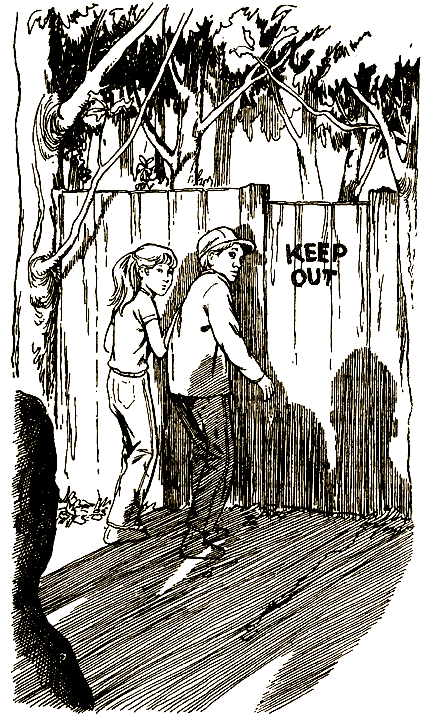
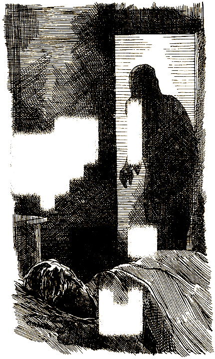
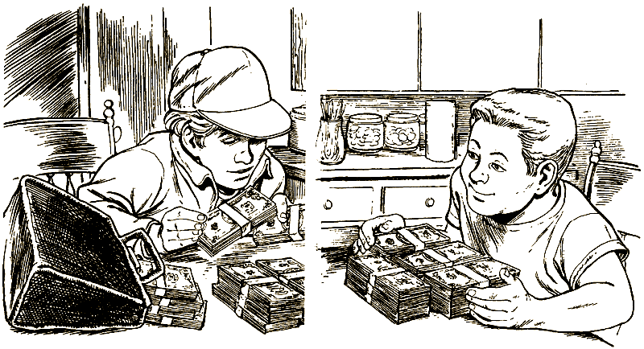

# 0

## Джей Либолд

# ТЫ — МИЛЛИОНЕР

Это необычная книга. Не пытайся читать ее по порядку с начала до конца, переходя от одной страницы к другой, — ничего не получится! Ведь это игра, где тебя ждет множество приключений после того, как ты найдешь портфель, набитый долларами. Время от времени тебе придется делать выбор. Что принесет он? Успех или поражение?

Твои приключения — результат твоего выбора. Тебе самому решать, куда пойти, что сделать. А дальше — читай указания в конце страницы, и тогда узнаешь, к чему приведет твой выбор.

Хорошенько подумай, прежде чем принимать решение. Иметь миллион долларов — это, конечно, здорово, но в то же время довольно опасно. Даже если ты сумеешь принести деньги домой, не исключено, что тебе не удастся ими воспользоваться!

Желаю удачи!

### ОБ АВТОРЕ

Джей Либолд родился в Денвере, штат Колорадо. Он является автором многих книг из серии «Выбери себе приключение», в том числе «Secret of the Ninja» и двух ее продолжений: «Return of the Ninja» и «The Lost Ninja», a также «Revenge of the Russian Ghost», «Fight for Freedom». Сейчас писатель живет в Сан-Франциско и в свободное время играет в местной команде по софтболу под названием «Ползучий страх». В настоящее время писатель работает над новой серией книг.

### О ХУДОЖНИКЕ

Рон Уинг — художник-карикатурист, проиллюстрировавший множество книг. В последние годы он оформлял серию юмористических книг Ларри Уайлда «Official», выходившую в издательстве «Бентам». Кроме того, он является художником-оформителем многих книг из серии «Выбери себе приключение», таких, как «Skateboard Champion», «The Island of Time», «Vampire Invaders», «Outlaw Gulch», а также ряда книг из аналогичной серии под названием «Skylark», в том числе: «Haunted Halloween Party», «А Day with the Dinosaurs», «Spooky Thanksgiving», «You Are Invisible». Сейчас Рон Уинг живет и работает в Бентоне, штат Пенсильвания.

#### [Начать приключение](#1)

# 1

Представь себе, что в один из летних дней ты гоняешь мяч на пустыре вместе со своим приятелем Брюсом.

— Эй, лови! — кричит тебе Брюс с другого конца пустыря.

Он бьет по мячу, и ты наблюдаешь, как мяч медленно проплывает над твоей головой и исчезает в зарослях кустов. Ты тяжело вздыхаешь и думаешь, что, может быть, тебе лучше пойти домой. Вы с Брюсом уже сыграли во все, что только можно придумать, и каждый раз он обыгрывал тебя. Он начинает понемногу надоедать тебе.

Вообще-то Брюс — парень ничего, с ним можно иметь дело, когда есть чем заняться. Как только твоя фантазия иссякает, он тут же начинает командовать и даже пытается обращаться с тобой несколько грубовато-снисходительно. Он обожает быть главным, а поскольку он постарше и повыше тебя и твоих друзей, то обычно ему это удается. И все же ты не прочь водиться с ним, особенно когда все твои друзья в лагере. Но стоит тебе только заикнуться, что ты собираешься домой, как от командирского тона Брюса не остается и следа.

А впрочем, это не его вина. Он не любит распространяться об этом, но дома у него не все в порядке. Несколько раз он даже убегал из дому. Да и друзей у него не так чтобы много. И все же он не перестает удивлять тебя своей неуемной фантазией. Ему в голову приходят действительно стоящие идеи.

— Ну что же ты, Брюс, — кричишь ты ему, — иди и доставай мяч!

— И не подумаю, — раздается в ответ. — Ты его упустил, ты его и доставай.

Пора идти домой, говоришь ты себе. Ты раздвигаешь ветки, протискиваешься в заросли кустов и пытаешься глазами отыскать мяч.

Но дело-то в том, что вовсе не хочется идти домой с тех пор, как там появилась миссис Хакли. Твоя младшая сестренка Тереза называет ее не иначе как «ужасная миссис Хакли».

Сперва ты страшно обрадовался, когда родители сказали тебе, что им необходимо какое-то время побыть одним и что они собираются провести лето в Европе. Но когда ты узнал, что присматривать за тобой будет миссис Хакли, то ужасно расстроился. Ты попросил родителей подыскать кого-нибудь другого, но мама сказала, что за такой короткий срок она не сумеет найти подходящего человека, которому она могла бы полностью доверять. Кроме того, миссис Хакли жила одна, и такая работа во всех отношениях могла бы пойти ей на пользу.

Она кажется тебе довольно-таки странной, как и ее нелепая привычка расхаживать по дому с нанизанными на запястье резинками, будто она того и гляди выстрелит ими в тебя, если застанет врасплох на месте «преступления».

С миссис Хакли ты действительно чувствуешь себя в полной безопасности, она и впрямь человек надежный и ответственный. Но вместо того, чтобы наслаждаться свободой в полной мере, тебе приходится довольствоваться самым малым. Она заставляет тебя вовремя ложиться спать. Каждое утро, сразу после завтрака, она выпроваживает тебя из дома, чтобы никто не мешал ей целый день напролет смотреть по телевизору «мыльные оперы». Ей не нравится, когда к тебе заходят друзья, а вместо пирога с курицей или спагетти на ужин тебе приходится есть то, что любит миссис Хакли, например печенку или плоды бамии. Она даже прячет от тебя печенье, выдавая его по одной штучке, не больше, и не разрешает есть в гостиной, сидя перед телевизором.

Ты все еще находишься на пустыре вместе с Брюсом, ты никак не можешь найти мячик в кустах, и, чтобы отыскать его, тебе придется залезть в самые заросли — ничего уж тут не поделаешь. Ты раздвигаешь ветки и пробираешься еще дальше. Твои ноги все в царапинах, а на лице паутина.

Мяча по-прежнему нигде не видно, но вдруг какой-то предмет привлекает твое внимание. Его почти незаметно, потому что сверху он присыпан ветками и листьями, словно кто-то впопыхах пытался его спрятать. Ты разгребаешь листья и обнаруживаешь под ними старый, изрядно потрепанный кожаный портфель. Похоже, ему немало пришлось повидать на своем веку.

Портфель довольно тяжелый. Ты уже собираешься сказать что-то Брюсу, расстегиваешь портфель — и замолкаешь на полуслове, когда раскрываешь его и заглядываешь внутрь. Глаза у тебя начинают ползти на лоб от изумления, и ты шепчешь: «Вот это да… Сколько денег!»

— Эй! — зовет тебя Брюс. — Что ты там застрял?

Ты с трудом отрываешь взгляд от денег и видишь сквозь кусты, что Брюс прямиком направляется к тебе. Сказать ему о находке? Или, может быть, лучше снова спрятать портфель, а потом вернуться за ним?

Ты закрываешь портфель, лихорадочно соображая, как же тебе лучше поступить. А Брюс подходит все ближе и ближе — возможно, он уже заметил тебя с портфелем в руках.

Решаешь [рассказать](#75) Брюсу о своей находке или [умолчать](#10) о набитом деньгами портфеле?

# 7

Ты встаешь, суешь несколько стодолларовых бумажек в карман и отправляешься завтракать. Прежде чем миссис Хакли успевает спросить у тебя, куда ты собрался, ты выходишь из дома и ловишь такси, которое везет тебя на центральную торговую улицу города.

Первым делом ты устремляешься в магазин электронной аппаратуры. Продавец вежливо спрашивает, что бы ты хотел купить. «Меня интересует переносной кассетный магнитофон, — небрежно говоришь ты. — Самый лучший».

Продавец показывает тебе несколько магнитофонов и объясняет, в чем особенности и преимущества каждого из них. Наконец ты останавливаешь свой выбор на одном, а потом — гулять так гулять — добавляешь: «А еще я хотел бы купить у вас плейер». Ты очень доволен тем, сколь вежлив и почтителен с тобой продавец. Кажется, он вот-вот попросит тебя купить еще что-нибудь. «Нет-нет, в другой раз, — произносишь ты, — может быть, даже завтра». Ты лихо расправляешься с несколькими счетами и выходишь из магазина, нагруженный покупками.

Затем ты вспоминаешь, что тебе просто нечего прослушивать на своем новом стереомагнитофоне. Ты отыскиваешь нужный тебе магазин и покупаешь несколько кассет с записями, иметь которые было твоей давней мечтой. Ты находишь и другие интересные записи и тоже покупаешь их на тот случай, если твои любимые мелодии тебе наскучат.

В тот вечер Тереза, заглянув к тебе, обнаруживает все твои покупки. Самое большое впечатление производит на нее магнитофон, однако ей даже и в голову не приходит спросить, откуда у тебя такие деньги. Ты включаешь ей магнитофон, делаешь звук то тише, то громче, чтобы продемонстрировать, на что он способен.

На следующий день ты вдруг понимаешь, что тебе позарез нужен новый велосипед, а также аквариум, кое-что из одежды и видеомагнитофон. А еще через день ты уже просто жить не можешь без компьютера, кожаной куртки и целой кучи игрушечных машин с дистанционным управлением.

Всю следующую неделю хождение по магазинам становится твоим главным занятием, смыслом твоей жизни. Каждый день ты встаешь, завтракаешь и устремляешься в центр, чтобы побродить по магазинам, и проводишь там почти все время, занятый поисками, оценкой и покупкой вещей.

Чем больше ты покупаешь, тем больше тебе хочется купить и, как ни странно, тем меньше удовлетворения получаешь от каждой новой купленной вещи. И дело не только в этом: тебе становится все труднее радоваться своим новым покупкам. Ведь если ты покажешь Терезе или своим друзьям слишком много из купленного тобой, они сразу поймут, что здесь что-то не так.

Некоторые уже стали задавать тебе вопросы вроде: «Ты что, банк ограбил?» Слыша такое, ты просто смеешься и стараешься сменить тему. Но теперь ты вынужден с большей осторожностью проносить покупки в свою комнату и прятать их в стенном шкафу. Ты вдруг начинаешь замечать, что становишься скрытным и нервным.

И вот однажды, в один из очередных твоих рейдов по магазинам, ты чувствуешь, как кто-то дергает тебя за рукав в тот самый момент, когда ты уже собираешься выложить несколько сот долларов за проигрыватель компакт-дисков. Ты оборачиваешься и… перед тобой стоит Тереза и смотрит широко открытыми глазами на пачку долларов в твоей руке.

— Ого, — еле слышно произносит она, — откуда это у тебя столько денег?

— Взял и накопил, — говоришь ты так, будто речь идет о каком-то пустяке.

Тереза выразительно смотрит на тебя.

Ты понимаешь, что пришло время принимать решение. Ты же не сможешь до бесконечности сваливать свои покупки в шкафу. Видимо, пора рассказать Терезе и друзьям о случайно найденных деньгах и, может быть, даже поделиться с ними. В противном случае тебе придется спрятать деньги, и спрятать понадежнее. Выходит, что деньги приносят больше плохого; чем хорошего. Наверное, стоит их все-таки закопать где-нибудь, а потом, когда станешь старше, можно будет выкопать их и уж тогда решить, что с ними делать.

Тереза все еще вопросительно смотрит на тебя.

— Пойдем, я тебе дома все объясню, — предлагаешь ты.

Если ты решаешь рассказать обо всем Терезе, открой страницу [23](#23).

Если вместо этого ты принимаешь решение закопать деньги, открой страницу [36](#36).

# 10

— Никак не найду этот мяч! — кричишь ты Брюсу из кустов.

— Вот как, — говорит Брюс, — давай-ка теперь я поищу. А все-таки, что ты тут нашел, а? Я ведь видел, как ты поднял что-то с земли.

— Ничего я не находил, — отвечаешь ты и начинаешь потихоньку выбираться из кустов.

— Так-таки и ничего, — с сомнением произносит Брюс, продираясь сквозь заросли. — А ну признавайся, что ты там нашел.

— Да ничего, — повторяешь ты и преграждаешь ему путь. — Пойдем-ка лучше купим себе мороженого.

— Ты мне зубы не заговаривай. Ты мне все-таки скажи, что там? — настаивает он. — Уйди с дороги.

По какой-то непонятной причине Брюс твердо решил обшарить все кусты. Быть может, что-то в твоем голосе показалось ему подозрительным.

— Пошли, Брюс, мне все это уже надоело, — несколько наигранно произносишь ты.

Ты пытаешься развернуть его в обратную сторону и подтолкнуть к выходу.

— Эй ты, посторонись, — говорит он, отталкивая тебя в сторону.

Похоже, Брюс настроен решительно. Ты отчаянно пытаешься найти способ остановить его. Ты не находишь ничего лучшего, как обозвать его и наброситься на него с кулаками. Финал вашей драки предопределен, но это, вероятно, единственный способ не дать ему найти портфель с деньгами.

Если ты решаешь вступить в схватку с Брюсом, открой страницу [116](#116).

Если ты все-таки уступаешь Брюсу и позволяешь ему заняться поисками, открой страницу [91](#91).

# 12

Ты хватаешь портфель, набитый долларами, выходишь на улицу и направляешься к банку.

— Что вы хотите? — вежливо обращается к тебе кассир, едва ты подходишь к ней.

— Я хотел бы открыть счет в вашем банке, — деловито отвечаешь ты.

— Какую сумму вы хотели бы положить на счет? — интересуется кассир.

— Я точно не знаю, — говоришь ты. — Думаю, где-то около миллиона.

Она мило улыбается, открывая портфель, но, когда она видит все эти пачки денег, выражение ее лица мгновенно меняется. Она изучающе глядит на тебя, и ты внезапно вспоминаешь, что одежда у тебя разорвана, что на лице следы крови, а на руках синяки и ссадины.

— Это ваши деньги? — спрашивает она.

— Мои, — уверенно отвечаешь ты.

Она делает еле заметное движение ногой, словно нажимает на кнопку сигнализации.

— Ну что же, в таком случае, — ровным голосом произносит она, — я хотела бы знать, желаете ли вы положить свои деньги на хранение под проценты или будете постоянно снимать какие-то суммы со счета?

Ты начинаешь размышлять над преимуществами каждого варианта, как вдруг обнаруживаешь, что находишься в плотном кольце людей в полицейской форме. Один из них кладет руку тебе на плечо, другой хватает портфель и говорит:

— Тебе придется пройти с нами в полицейский участок.

В участке они заполняют какие-то формы и снимают отпечатки твоих пальцев. Затем следователь уводит тебя в комнату для допросов.

— Где ты взял эти деньги? — спрашивает он.

Ты рассказываешь, что нашел портфель в кустах на пустыре.

— Так, значит, ты его просто нашел там? — весьма недоверчиво переспрашивает следователь. Ты киваешь.

Следователь смотрит поверх тебя на других полицейских, находящихся в комнате, делает глубокий вдох и, обращаясь к тебе, говорит:

— Да пойми же ты, все это выглядит очень подозрительно и малоубедительно.

— Я сейчас вам все объясню, — тут же отвечаешь ты и принимаешься рассказывать им о своей драке с Брюсом.

Слушая твой рассказ, следователь понимающе кивает головой. Выслушав все до конца, он просит офицера немедленно разыскать Брюса и привести его в участок.

— Нам придется все проверить, — говорит он. — Но даже если твой приятель подтвердит то, что ты рассказал, нам все равно придется содержать тебя под стражей до тех пор, пока мы точно не установим, что это за деньги и не связано ли с ними какое-нибудь преступление. — Заметив испуг на твоем лице, он добавляет: — Не бойся, — ничего страшного в этом нет. А пока, пожалуй, нам нужно пригласить врача, чтобы он обработал твои раны.

Две недели спустя ты возвращаешься домой с чистой совестью и без денег. По словам следователя, они попали «куда следует». Тебе так и не суждено узнать, откуда они взялись и куда делись потом.

На следующий день тебе звонит Брюс.

— Я всегда говорил, что ты зануда и балда, — слышишь ты в трубке.

#### КОНЕЦ

# 14

Ты крепко прижимаешь портфель к груди и направляешься к себе домой, очень надеясь на то, что по дороге тебе никто не встретится. А то ведь кто увидит — просто испугается: одежда разорвана, лицо в крови.

Ты решаешь войти через парадную дверь, рассудив, что миссис Хакли должна быть на кухне — в это время она всегда готовит ужин. Ты поворачиваешь ручку, медленно приоткрываешь дверь и прислушиваешься. В доме тихо. Ты быстро проскальзываешь внутрь, тащишь портфель наверх, в свою комнату, и прячешь его в стенном шкафу.

Спрятав портфель в надежном месте, ты спускаешься вниз, чтобы принять горячую ванну. Услышав шум воды, миссис Хакли что-то пронзительно кричит тебе. «Я принимаю ванну!» — кричишь ты ей в ответ.

Ты выключаешь кран, закрываешь дверь на замок и, погрузившись в горячую воду, мгновенно расслабляешься. Какое-то время ты просто лежишь и отмокаешь. Ты позволяешь себе ни о чем не думать и только чувствуешь, как пульсируют болью твои синяки и царапины в горячей воде, от которой идет пар.

Как только ты немного приходишь в себя, тебя тут же начинают одолевать мысли о портфеле. Что это за деньги и почему их бросили в кустах? Может быть, за этими людьми кто-то гнался и у них не было другого выхода? Но почему?

Ты мысленно представляешь себе, как портфель мирно покоится в темноте стенного шкафа. В этом есть что-то зловещее, словно где-то рядом находится бомба, которая ждет своего часа. Всякое ведь может случиться.

Тебя охватывают противоречивые чувства. Может быть, стоит рассказать обо всем кому-нибудь из взрослых? Поскольку твои родители сейчас практически вне досягаемости, то остается миссис Хакли.

Опять-таки допустим, что ты отнес портфель в полицию. Что, если эти деньги принадлежат какому-нибудь мошеннику? Полиция об этом знать не знает, а он приходит в участок и требует вернуть ему его деньги? А что, если полиция решит их просто-напросто прикарманить? В таком случае чем же ты хуже их? Но даже если эти деньги были добыты честным путем, ты должен признаться самому себе, что любой, кто разгуливает с таким количеством долларов наличными, должен был причинить зло кому-то другому, чтобы заполучить эти деньги.

Твои размышления прерывает голос миссис Хакли:

— Ужинать!

— Я буду готов через минуту! — кричишь ты в ответ.

Ты принимаешься за работу, старательно смывая с лица грязь и следы крови, но мысли твои заняты одним: что же делать с портфелем?

Решаешь [рассказать](#50) миссис Хакли про деньги или завтра же отнести портфель [в полицию](#64)?

Или [оставить](#109) портфель себе?

# 23

Вернувшись домой, ты рассказываешь Терезе все с самого начала: как ты нашел портфель на пустыре. Тереза начинает прыгать на кровати и с восторгом говорит:

— Ты только представь себе, сколько всего можно сделать. Купить лошадь, к примеру!

— Да, конечно, но возникает одна проблема, — отвечаешь ты. — Где ее держать? Кроме того, мы должны все хранить в секрете, иначе у нас отберут деньги.

— Да, ты прав, — соглашается Тереза. — Я знаю, что нам нужно, — тайное убежище. Это место, где мы могли бы делать все, что захотим.

— Что-то вроде замка или форта, — добавляешь ты.

— Эй, послушай, а разве в лесу нет форта? — спрашивает Тереза. — За кабельной фабрикой, знаешь? Брюс вместе с ребятами устроил там форт.

— Да ну? А что же они мне ничего не сказали?

— У каждого есть свои секреты, — говорит Тереза. — Я покажу тебе завтра это место.

Утром Тереза ведет тебя в лес. Форт расположен в весьма уединенном месте, которое имеет форму треугольника: одна его сторона граничит с рекой, другая — с шоссе, а третью образуют задворки кабельной фабрики.

— Похоже, здесь действительно можно заниматься чем угодно, и никто об этом не узнает, — произносишь ты.

Внезапно за вашей спиной раздаются какие-то голоса, хруст сучьев и шорох листьев под ногами.

— Интересно знать, что это вы здесь делаете?

Ты узнаешь голос Брюса. За ним стоят его приятели Келли и Роджер.

— Да вот решили осмотреть ваш форт, — небрежно сообщаешь ты.

— Да что ты говоришь! — восклицает он. — А кто это вам разрешил?

Тут в разговор вступает Тереза, не дав тебе возможности ответить Брюсу.

— Эй вы, оба, кончайте задираться. Есть кое-что поважнее, и это стоит обсудить.

— Например? — спрашивает Келли, подбоченившись.

— Например, деньги. У меня есть деньги, и мы собираемся их потратить, — отвечаешь ты так, чтобы не показалось, будто ты хвастаешься. — Вот тут-то и возникла идея форта. Я хочу построить тайное убежище, где все мы могли бы хранить свои вещи. Что-то вроде клуба.

— А кто это «мы»? — насмешливо интересуется Брюс.

— Ты, я, Тереза… да любой, — отвечаешь ты, — денег всем хватит.

— Вот я, например, собираюсь купить лошадь, — вставляет Тереза, — и построить для нее конюшню.

— А откуда у вас эти деньги? — спрашивает Роджер.

— Я нашел их, — отвечаешь ты. — Больше я ничего не могу вам сказать. Придется поверить мне на слово.

Брюс и его друзья пристально смотрят на тебя, стараясь осмыслить то, что ты сказал.

— Это что, розыгрыш? — недоверчиво спрашивает Брюс.

— Да нет же, — говоришь ты, глядя ему прямо в глаза.

Через минуту Брюс уже улыбается и протягивает тебе руку. Ты пожимаешь ее.

На следующий день ты и Тереза встречаетесь с Брюсом, Келли и Роджером в форте. Все вместе вы направляетесь на склад лесопильных материалов. Брюс по-прежнему настроен скептически. Но когда ты начинаешь расплачиваться наличными, все его сомнения разом улетучиваются.

В течение следующих нескольких недель каждый день вы с Терезой говорите миссис Хакли, что идете в бассейн. Она очень рада, что вы уходите, и потому не задает лишних вопросов.

Все больше и больше ребят из вашей округи принимают участие в реализации проекта. Каждый новичок должен внести в него свой личный вклад. Это может быть какая-то новая полезная информация или же предложение по улучшению проекта. Единственное условие, на котором ты настаиваешь, — это дать клятву хранить все в тайне.

Каждое утро ты встаешь и отправляешься в лес к ребятам, чтобы делать необходимые замеры, пилить доски или забивать гвозди. Взятые в библиотеке книги помогают тебе во всем разобраться. Вскоре ваш превосходный клуб готов. Когда строительство и покраска клуба закончены, ты даешь каждому немного денег, чтобы он купил для клуба все то, что ему хочется. Клуб становится местом, где каждый день царит праздник. Тереза затевает строительство конюшни для лошади, которую она хочет купить. Другие ребята начинают работать над своими увлекательными проектами. Ты просто ждешь не дождешься следующего дня, чтобы узнать, что же нового произойдет в клубе.

Можно с уверенностью сказать, что это лето станет самым лучшим в твоей жизни.

#### КОНЕЦ

# 32

Воспользовавшись телефоном на втором этаже, чтобы никто не смог ничего услышать, ты вызываешь такси и просишь забрать тебя на ближайшем к дому углу. После этого ты бросаешь еще кое-какие вещи в собранную накануне вечером сумку и приносишь портфель. Ты пишешь Терезе записку, что поехал навестить Билла, и оставляешь ее на кровати в комнате сестры.

Тебе удается незамеченным выскользнуть на улицу. Едва ты появляешься на углу, как к краю тротуара подкатывает такси. Ты залезаешь внутрь.

— В лагерь «Кэмп Пайн», — обращаешься ты к водителю.

— Это тот, что в горах? — не верит он своим ушам. — Да туда добираться часа три!

Ты вручаешь ему сто долларов и говоришь:

— Остальные — когда доберемся до места.

Такси несется к горам, а ты внезапно понимаешь, что вся эта поездка — просто какая-то авантюра. Но потом тебе приходит в голову, что ты любишь совершать безумные поступки.

Через три часа такси останавливается у главного корпуса лагеря. Ты платишь водителю все, что ему причитается, и щедро даешь на чай.

— Огромное спасибо! — радостно восклицает он.

Ты отыскиваешь кабинет директора лагеря и спрашиваешь у секретаря, где можно найти Билла. Она просматривает список мероприятий и говорит тебе:

— Он ушел с отрядом траншеекопателей.

— А когда он вернется? — интересуешься ты.

— Вообще-то посетителей мы обычно не пускаем, — предупреждает секретарь, — но если ты постараешься никому не попадаться на глаза, то сможешь увидеть его сегодня вечером, часов в семь, когда отряд вернется в лагерь.

Весь день ты слоняешься по лагерю. Прямо скажем, не очень-то веселое место. Когда же наконец появляется Билл, который, несмотря 4 на усталость, страшно рад тебя видеть, он подтверждает твое впечатление:

— Это скорее учебный лагерь для новобранцев, чем летний лагерь для детей. Они поднимают нас в шесть утра. Кроме того, у каждого из нас есть свои повседневные обязанности, вроде мытья туалетов. Но даже если мы все-таки начинаем заниматься чем-то более интересным, они превращают это дело в большое соревнование, начисто лишая его какой-либо радости. — Билл оглядывается по сторонам, чтобы удостовериться, что его не слышит ни один вожатый, и только после этого продолжает: — Ты не уезжай. Мы с ребятами решили сегодня ночью улизнуть из лагеря и устроить в лесу костер. А между прочим, как ты сюда добрался?

— Я расскажу тебе вечером, — отвечаешь ты.

Позднее ты встречаешься с Биллом и другими ребятами на лесной поляне. Некоторых из них ты знаешь — они учатся в вашей школе, но даже те, кого ты видишь впервые, настроены к тебе очень дружелюбно. Вы принимаетесь собирать дрова и складывать костер. И вот уже весело заплясали яркие языки пламени, ребята рассаживаются вокруг костра и принимаются рассказывать всякие истории.

— Ну, — обращается к тебе Билл, — выкладывай, зачем пожаловал?

Вместо ответа ты тащишь его в сторону и открываешь портфель. Он долго не может прийти в себя, а потом делает короткий вдох и произносит шепотом:

— Ты что, банк ограбил?

Ты рассказываешь Биллу, как все было. От изумления он лишь качает головой, а в конце спрашивает:

— И что же ты собираешься с ними делать?

— Для того я сюда и приехал, чтобы обсудить это с тобой, — отвечаешь ты. — Давай не будем с этим тянуть. Попробуем немного печеного алтея и потом все решим.

У костра становится все веселее и веселее. Вместе со всеми ты поешь песни и рассказываешь всякие истории. Когда костер начинает понемногу затухать, а языки пламени то ярко вспыхивают, то гаснут, ребята затевают разговор о том, чем бы они хотели заниматься в своей жизни.

— У меня вопрос, — произносит Билл. — А что бы вы сделали, окажись у вас миллион долларов?

— Я бы купила остров, — начинает разговор девочка по имени Марина. — На нем бы росли пальмы, а вокруг него была бы теплая изумрудного цвета вода. Я бы ничего не делала, а только загорала.

— А я бы отложила их, чтобы потом поступить в колледж, — произносит серьезного вида девочка по имени Рамона. — Образование стоит теперь так дорого.

— А зачем тебе учиться, если у тебя столько денег? — спрашивает у нее парень по имени Грег. — Я бы, к примеру, вложил бы эти деньги во что-нибудь и заработал бы миллиард.

— Или потерял бы все, — вставляет Билл.

— А потом бы я взялся вести дела различных корпораций, — невозмутимо продолжает Грег. — Первым делом я бы приобрел кондитерскую фабрику. Представляете, хоть всю жизнь ешь шоколад.

— А я бы купил бейсбольную команду, — сообщает веснушчатый мальчишка по имени Питер. — И стал бы ее менеджером.

— Сплошные капиталисты собрались, — сокрушается Рамона. — А вот я бы, заплатив за свою учебу, оставшуюся часть денег потратила на какие-нибудь благородные цели.

— Да, ты могла бы заняться спасением дикой природы, — предложил кто-то.

— Или открыть лекарство от рака.

— А я бы накормил всех голодных детей в мире, — произносит Грег притворно-слащавым голосом. — Моих денег хватило бы на один день, а потом они опять начали бы голодать. Мне не хочется тебе об этом говорить, Рамона, но миллион долларов не решит мировых проблем.

— Но для начала хватит, — возражает Рамона. — А ты что же, считаешь, что лучше быть причиной таких проблем? К примеру, твоя кондитерская фабрика, вполне вероятно, станет загрязнять воду, и тогда другим людям придется платить за ее очистку.

— А я бы купил огромный телескоп, — вступает в разговор худенький мальчик, которого зовут Том, — и еще какой-нибудь сверхмощный компьютер. Я бы стал независимым ученым и проводил бы все время, наблюдая за звездами и делая открытия.

— Звучит довольно забавно, — произносит Марина. — Я бы, пожалуй, разрешила тебе обосноваться на моем острове.

— А я бы купила телестанцию и стала бы делать программы для моих друзей, чтобы нам не нужно было смотреть обычное телевидение, — сообщает девочка по имени Лайла.

— Ты могла бы организовать это на моем острове, — предлагает Марина.

— А как насчет летнего лагеря? — спрашивает Билл. — Тогда нам не пришлось бы заниматься всеми этими дурацкими вещами, которые нас заставляют тут делать.

— Да, я бы купила наш лагерь и первым делом уволила бы директора, — говорит Рамона.

— Отличная идея! — соглашается Билл и смотрит на тебя. — А ты как думаешь? Можно было бы вложить в это часть денег.

Все глядят на тебя с любопытством. Если ты собираешься рассказать им о найденных тобой деньгах, то сейчас самый подходящий момент. Но ты так еще для себя и не решил, что же с ними делать. Разделить их между всеми этими ребятами или лучше пока промолчать и оставить их себе?

Решаешь [посвятить](#34) всех ребят в свою тайну или предпочитаешь пока [промолчать](#84)?

# 33

На следующий день ты звонишь Джин Фейи, и она приглашает тебя приехать в ее офис.

Ты садишься на велосипед и направляешься в центр города. Джин Фейи, на твой взгляд, не очень-то похожа на адвоката — крупная женщина с добрым лицом, да еще и в джинсах.

Она просит тебя рассказать все с самого начала. Внимательно выслушав тебя, она говорит:

— Да, все это выглядит очень подозрительно. Получить обратно то, что попало в руки полиции, практически невозможно. Обычные методы в таких случаях либо не подходят, либо не срабатывают. Мне придется действовать по своим личным каналам. Но если дело примет плохой оборот, нам, вероятно, придется сделать официальное заявление в прессе. Как ты думаешь, ты сможешь пойти на это?

Ты киваешь головой.

— Значит, согласен, — продолжает она. — Поговорим теперь об оплате. Обычно мне платят за каждый час моей работы, но в данном случае я хотела бы получить десять процентов от той суммы, которую мне удастся тебе вернуть. Что скажешь на это?

— Я согласен, радостно отвечаешь ты.

— Тогда я позвоню тебе, как только появятся новости, — говорит она на прощание.

Ты покидаешь офис Джин Фейи с ощущением, что если кто и сумеет докопаться до истины, так это она. И твоя интуиция тебя не подводит. Через две недели она звонит тебе и сообщает: «Кажется, дело стронулось с места. Окружной прокурор начал расследование. В понедельник утром состоятся слушания по этому делу. Ты готов дать показания?»

Ты не задумываясь соглашаешься.

Ты страшно удивлен, когда в понедельник утром встречаешь в здании суда своего приятеля Брюса, но потом понимаешь, что он тоже будет давать показания. Слушания проходят нормально: ты просто рассказываешь, что произошло после того, как ты нашел портфель и отнес его в полицию. Брюс подтверждает твой рассказ, хотя время от времени бросает на тебя свирепые взгляды, потому что ты не сказал ему о своей находке.

Вскоре твое дело получает широкую огласку. Благодаря журналистам оно попадает на первые страницы газет. Одна из них помещает твой портрет под заголовком: «Ограблен полицией».

В скором времени на лужайке перед твоим домом уже толпятся репортеры, каждое утро засыпая кучей новых вопросов о ходе расследования.

В один прекрасный день Джин Фейи приглашает тебя к себе в офис.

— Завтра все должно решиться, — как всегда, очень спокойно и невозмутимо сообщает она тебе. — Большое жюри предъявит обвинения нескольким офицерам полиции. Даже если суд оправдает их, мы все равно установили, что им не удалось найти ни единой улики или какой-нибудь зацепки, которые могли бы вывести их на хозяина портфеля. Таким образом, деньги по праву принадлежат тебе, и я их получу завтра в суде.

— Значит, мы выиграли? — спрашиваешь ты.

— Да, мы выиграли это дело, — отвечает она и даже позволяет себе улыбнуться.

Ты бросаешься к ней, крепко сжимаешь в своих объятиях, и, обнявшись, вы начинаете кружить по ее кабинету.

Немного успокоившись и отдышавшись, ты спрашиваешь у Джин Фейи:

— Расскажите все-таки, как вам удалось выяснить…

— Ну что же, расскажу, — отвечает она, не дослушав твой вопрос до конца. — А дело было вот как. Когда несколько старших офицеров увидели портфель, действительно набитый долларами, то устоять от соблазна они не смогли. Как только они поняли, что искать хозяина портфеля вовсе не обязательно, они попытались найти способ, как бы прикарманить денежки, и затеяли вокруг портфеля разные бюрократические игры, так чтобы в один прекрасный момент он мог просто «исчезнуть».

— А как же сержант Винуски?

— Она и несколько других офицеров знали в общих чертах о том, что происходило, и пытались положить этому конец, вот почему их отстранили от дальнейшего расследования. Но ты не расстраивайся. Когда скандал вокруг этого дела немного уляжется, Винуски обязательно повысят, помяни мое слово.

На следующий день Джин вручает тебе портфель, предварительно вынув оттуда свои десять процентов.

— С такими деньгами я сумею взяться за гораздо более интересные и стоящие дела, — говорит она и, оглядев свой офис, добавляет: — К тому же я смогу перебраться в помещение получше и найти себе компаньона. Ну а как ты поступишь с этими деньгами?

Ты смотришь на портфель и говоришь:

— Боюсь, мне еще нужно об этом хорошенько подумать.

#### КОНЕЦ

# 34

Ты страшно нервничаешь, но все-таки решаешь рассказать ребятам о деньгах.

— Потому я и приехал сюда, чтобы обсудить с Биллом, как лучше поступить с этими деньгами. Мне очень нравятся ваши идеи.

— Лучше забудь о них, — говорит Грег. — Если речь идет о реальных деньгах, то тебе стоит положить их в банк под большие проценты или купить на них облигации.

— Нет, — возражаешь ты. — Я хочу сделать что-нибудь грандиозное, осуществить какой-нибудь проект, в котором приняли бы участие несколько человек. Ты, Грег, мог бы стать, например, консультантом по инвестициям.

У Грега от удивления глаза лезут на лоб. И тут Рамона спрашивает:

— А может, отнести деньги в полицию?

— Да они просто-напросто оставят их себе, — возражает кто-то.

— Или вернут еще тому жулику, который их потерял.

— Скажи, а какой именно проект ты имел в виду? — обращается, к тебе Билл.

— Я еще точно не знаю, — отвечаешь ты, — но мне хочется, чтобы каждый принял в нем участие, проявил свои способности.

— Что-то вроде моего острова, — говорит Марина. — Лайла будет вести свои передачи, Рамона займется охраной дикой природы, Том станет изучать звезды, Грег будет распоряжаться финансами и так далее. Ну а я буду отвечать за загар.

— А я думаю, нам все-таки стоит купить этот лагерь, — предлагает Билл. — И тогда мы сможем организовать по-настоящему веселый лагерь, куда будут приезжать дети и заниматься кто чем хочет.

И вдруг на фоне освещенных костром деревьев появляется огромная тень.

— Вечеринка окончена! — ревет мужской голос.

Вы поднимаете глаза и видите директора лагеря. Он направляется в центр круга и, прежде чем ты успеваешь как-нибудь отреагировать, выхватывает у тебя портфель со словами:

— Я вынужден это конфисковать.

Вы все просто оторопели от неожиданности. Директор пристально оглядывает сидящих вокруг костра и говорит:

— Признаться, вы меня разочаровали, ребята. Я думал, вы придумаете что-нибудь поинтересней, чем просто костер.

Вы все бредете в лагерь, уныло понурив головы. Когда подходите к домикам, директор произносит:

— О мерах дисциплинарного воздействия поговорим завтра утром, а теперь все марш по своим местам. — Повернувшись к тебе, он добавляет: — Что же касается тебя, то тебе следует убраться из лагеря — чем быстрее, тем лучше.

— А как же мои деньги… — произносишь ты.

— Молчать! — командует директор, зажав портфель под мышкой. — Сначала я выясню, как у тебя оказались эти деньги. Стоит мне только сообщить в полицию, и у тебя будут большие неприятности.

Ты забираешься в спальный мешок и располагаешься на полу в домике Билла. Билл и его друзья пытаются тебя утешить.

— Да не расстраивайся ты, — говорит Билл. — Не сможет он отобрать у тебя деньги. Завтра утром мы что-нибудь придумаем.

Но ты так и не можешь заснуть. Ворочаешься с боку на бок и все время думаешь только о том, удастся ли вам заполучить деньги обратно.

Через час раздается стук в окно. Ты открываешь дверь — на пороге стоят Рамона и Лайла.

— Не пора ли нам заняться делом? — шепчет Рамона.

— О чем это ты? — спрашивает Билл.

— Неужели же мы позволим директору вот так вот взять и отобрать у нас деньги? — обращается ко всем Лайла. — Мы должны их вернуть.

— Боюсь, мы и так влипли, — жалуется Грег.

— Да парни вы, в конце концов, или нет?! — с возмущением восклицает Рамона.

— Что ты, собственно, предлагаешь — совершить вооруженный налет на кабинет директора? — спрашивает ее Билл.

— Вот именно.

— Эй, я, например, не хочу оказаться в полиции, — возражает Грег. — По мне, так лучше провести оставшееся время на гауптвахте и постараться вернуть деньги законным путем.

— А что, если директор все-таки заявит в полицию и мы не сможем их вернуть? — беспокоишься ты.

— Ты ничего не понимаешь, — перебивает тебя Рамона. — Нисколько не сомневаюсь, что директор их прикарманит, если, конечно, мы ему не помешаем.

— Да бросьте вы эту затею, — говорит Грег. — Лично я в ней участвовать не собираюсь.

— А ты что думаешь? — обращается к тебе Билл.

Хочешь [совершить налет](#44) на кабинет директора лагеря или [проявить осторожность](#45) и занять выжидательную позицию?

# 35

Ты продолжаешь ровно и глубоко дышать и даже иногда громко посапываешь для большей убедительности. Дверь шкафа открывается, и тут до тебя вдруг доносится знакомый запах детской присыпки. Сомнений нет — это…

— Миссис Хакли! — резко произносишь ты.

Миссис Хакли с визгом подпрыгивает от неожиданности. Ты зажигаешь лампу.

— Что вы здесь делаете?

Миссис Хакли щурится от яркого света. Она бледная, как привидение.

— Я хотела просто убедиться… — пытается объяснить она. — На самом деле я просто хотела поглядеть на них, на эти деньги, — продолжает миссис Хакли, медленно пятясь к двери. — Мне вдруг так захотелось посмотреть, как они выглядят, что я ничего не могла с собой поделать. Как только встану завтра, сразу же позвоню по поводу объявления. Спокойной ночи, — бормочет она и быстро закрывает за собой дверь.

Утром, прежде чем спуститься вниз к завтраку, ты прячешь портфель в новое место, на сей раз в комнате. Вместо того чтобы, как обычно, уткнуться в газету с чашкой кофе, миссис Хакли вся в движении, вся светится от радости. Она спрашивает тебя, как ты спал и что тебе приготовить на завтрак — яйца, блины или что-нибудь еще.

Ты бормочешь, что не отказался бы от тарелки хлопьев и сладкого пирожка. Однако даже это не портит ее настроения. Она сообщает тебе, что уже позвонила по поводу объявления и что готова сидеть у телефона весь день напролет. Сам-то ты вовсе не собираешься дежурить у телефона и разговаривать со всеми подряд. Сразу после завтрака ты берешь полотенце, плавки и отправляешься в ближайший бассейн поплавать.

Когда ты возвращаешься домой к обеду, то застаешь на кухне незнакомого мужчину.

— Вы пришли по поводу портфеля? — спрашиваешь ты.

— Да нет, — смеясь отвечает он.

Миссис Хакли входит на кухню и представляет незнакомца:

— Это мой племянник Роско.

Роско улыбается и жмет тебе руку.

— Рад познакомиться.

На вид ему лет тридцать, мускулистый блондин с короткой стрижкой и чисто выбритым лицом.

— В свое время Роско служил в правоохранительных органах, — объясняет миссис Хакли. — Вот я и подумала: имея в доме столько денег, мы не можем рисковать.

Роско подмигивает тебе.

— А еще я имею некоторое представление, как лучше распорядиться деньгами, — сообщает он. — Конечно, если их хозяин не найдется.

Ты подходишь к буфету и делаешь себе бутерброд с арахисовым маслом и джемом.

— У меня есть связи в деловом мире, — продолжает Роско. — С такими деньгами можно сделать очень много.

— В свое время мы подумаем, как с ними поступить, — замечаешь ты и, взяв с собой бутерброд, удаляешься в гостиную смотреть мультики.

В этот вечер раздается несколько телефонных звонков. Ты прислушиваешься, но каждый раз до тебя доносится один и тот же ответ миссис Хакли: «Извините, но боюсь, мы говорим о разных портфелях».

Отправляясь вечером спать, ты закрываешь дверь своей комнаты на замок — так, на всякий случай.

Утром тебя будит настойчивый звонок в дверь. Ты набрасываешь на себя халат и скатываешься по лестнице вниз, по дороге замечая записку: «Мы уехали в магазин. Скоро вернемся. С любовью, миссис X.».

Ты открываешь дверь. На пороге стоит мужчина в рубашке и брюках цвета хаки и в темных очках. Его ясные голубые глаза смотрят на тебя оценивающе из-под густых бровей.

— Я по поводу портфеля, — говорит он.

— Вы можете его описать?

— Да, конечно. Такой желтовато-коричневый, кожаный, весьма потрепанный, примерно такого вот размера, — он показывает руками.

— На нем есть какие-нибудь инициалы?

— Да есть, — произносит он с раздражением, — но я не знаю какие. Твоя бабушка — а может, она тебе и не бабушка — вчера вечером уже спрашивала по телефону об этом. Не могу же я помнить такие мелочи. Когда же я позвонил второй раз, она даже не захотела меня слушать — взяла и повесила трубку.

Ты молчишь, не зная, как поступить.

— Послушай, — продолжает он, — сейчас я скажу тебе самое главное: портфель набит деньгами. Я вынужден был спрятать его в кустах, потому что за мной гнались иностранные агенты. Позволь мне рассказать тебе, для чего предназначены эти деньги, и я думаю, ты согласишься вернуть их мне.

Ты как-то не очень уверенно киваешь головой, и мужчина проходит в гостиную. Он снимает очки, садится на диван и делает тебе знак последовать его примеру.

— Меня зовут Джек Уэст, — доверительно сообщает он, — я — агент по особым поручениям. Одним словом, шпион.

— Ты, наверное, даже и не слышал о такой африканской стране, как Момбаве. Не так давно власть в ней захватила группа людей, которые попирают все то, что дорого нам. Они организовали восстание, в результате которого был свергнут законный правитель Момбаве. И теперь в стране воцарилась «демократия», вернее, то, что революционеры называют демократией. Некоторые граждане Момбаве, обеспокоенные судьбой своей страны, решили поддержать движение за возвращение незаконно свергнутого правителя. Мне доводилось иметь дело с тамошними борцами за свободу, и поверь мне, более отважных людей ты нигде не встретишь. Мы вооружаем их, инструктируем и даже воюем вместе с ними бок о бок. Но вот чего нам больше всего не хватает, так это денег. Я многим жертвую, но ничего не прошу взамен. Я просто считаю своим патриотическим долгом помочь маленькой стране в трудную минуту. — Уэст пристально смотрит на тебя своими голубыми глазами. — Я так много сделал для того, чтобы собрать эти деньги. И я очень надеюсь, что ты тоже окажешься патриотом и вернешь мне портфель.

Ты обдумываешь все то, о чем тебе рассказал Уэст. Похоже, что портфель действительно принадлежит ему. Однако ты все еще до конца не уверен в том, что готов принять его рассказ за чистую монету.

Решаешь [отдать портфель](#63) или тебе стоит все [хорошо обдумать](#92)?

# 36

Дома ты объясняешь Терезе, что многие годы копил деньги и вот наконец решил немного их потратить. Ты прекрасно понимаешь: она догадывается о том, что ты чего-то недоговариваешь. Но ты решаешь для себя, что будет лучше не втягивать ее в эту историю.

На следующий день, дождавшись, когда миссис Хакли отправится за покупками, ты идешь на задний двор, вооружившись лопатой, и выкапываешь глубокую яму. Ты заворачиваешь портфель в несколько больших целлофановых пакетов, бросаешь его в яму и забрасываешь землей. Затем ты присыпаешь это место старыми листьями и травой.

Теперь, когда ты избавился от денег, у тебя словно гора с плеч свалилась. Ты уже не должен больше бояться разоблачений. Тебе уже не нужно ломать голову, с кем поделиться деньгами. Вместо этого ты можешь снова вести обычную, нормальную жизнь, зная при этом, что в один прекрасный день, когда тебе будет нужно и когда ты будешь готов к этому, ты извлечешь из земли свои сокровища.

#### КОНЕЦ

# 44

— Давайте совершим налет, — принимаешь решение ты.

— Очень хорошо, — обрадовалась Рамона. Она собирает тебя, Билла и Лайлу в кружок, чтобы обсудить, как спасти портфель.

Через некоторое время Грег говорит:

— Ну ладно, ребята, я с вами.

— Тоже мне осчастливил, — бормочет Лайла.

Через полчаса вы начинаете осуществлять свой план. Рамона и Лайла возвращаются в свой домик, а тем временем ты, Грег и Билл складываете все самое ценное и нужное в свои рюкзаки. Вы встречаетесь у ручья за домом, где расположен кабинет директора, и оставляете там свои вещи. Грег и Билл направляются к главному зданию лагеря. Лайла идет по берегу ручья к конюшням. Вы с Рамоной затаились в кустах за зданием дирекции и внимательно прислушиваетесь.

Через пятнадцать минут вы слышите звон разбитого стекла.

— Билл и Грег уже на кухне, пошли, — говорит Рамона.

Вы подкрадываетесь к одному из выходящих во двор окон дирекции. Оно приоткрыто, но затянуто сеткой от насекомых. Рамона сцепляет руки в замок. С ее помощью ты поднимаешься наверх и ножом вырезаешь в сетке квадрат. Затем распахиваешь окно и влезаешь в кабинет.

Ты помогаешь Рамоне забраться наверх, затем вы зажигаете фонарики и принимаетесь обыскивать кабинет. Вы открываете каждый ящик, заглядываете в каждую папку, но портфеля нигде нет.

— А что, если он положил его в сейф? — шепчешь ты Рамоне.

Прежде чем она успевает ответить, в противоположном конце здания раздается звук захлопнувшейся двери. Вы с Рамоной выключаете свои фонарики и бросаетесь к окну. Голос директора раздается откуда-то снаружи: «Что здесь происходит? Я спрашиваю, что здесь такое происходит?!»

— Он идет на кухню в главное здание, — говорит Рамона. — Давай-ка пока проверим его спальню. Если портфеля и там нет, мы погибли.

Вы идете через приемную и холл к двери, ведущей в жилые помещения. Вы медленно открываете ее и прислушиваетесь. До вас долетает отдаленный звук разбивающихся тарелок и разгневанный голос директора. Ты делаешь знак Рамоне, и вы заходите внутрь.

Сначала вы попадаете в небольшую кухоньку. Свет проникает сюда из другой комнаты. Вы идете на свет, и вдруг из-за угла раздается угрожающее рычание. Вы выбегаете из кухни и бросаетесь в спальню, быстро захлопнув за собой дверь. Собака начинает неистово лаять.

— Посмотри! — восклицает Рамона. — Вот он, на стуле!

Она выхватывает портфель из-под лежащей на стуле одежды.

— Давай здесь вылезем! — обращается она к тебе.

Ты вылезаешь через окно спальни и спрыгиваешь на землю. Когда ты поворачиваешься, чтобы взять портфель у Рамоны, то видишь, как директор бежит от главного здания по направлению к своему дому. Когда он замечает вас, то начинает пронзительно кричать:

— Стойте! Воры!

Рамона спрыгивает вниз, и вы вместе бежите к тому месту у ручья, где оставили свои рюкзаки. Лайла поджидает вас там с лошадьми. Билл и Грег, уже верхом, направляют своих лошадей в другую сторону, чтобы отвлечь директора, который с воплями гонится за вами.

— Пошел, Сильвер, вперед! — кричит Рамона.

Все вместе вы перескакиваете через ручей и мчитесь в сторону леса, оставив директора далеко позади.

Единственное, что вам теперь остается сделать, — это решить, каким же образом истратить деньги.

#### КОНЕЦ

# 45

— Я согласен с Грегом, — говоришь ты. — Давайте сначала попытаемся вернуть портфель законным путем. Даже если нам удастся выкрасть его из кабинета директора, нас все равно могут арестовать. Поэтому я предлагаю проявлять осторожность и занять выжидательную позицию.

— Трус, — недовольно произносит Рамона.

— Так будет лучше, — говорит Грег.

Наутро ты первым делом звонишь миссис Хакли и просишь ее забрать тебя. Ты намерен отправиться прямо в полицию и подать иск на директора лагеря.

В полиции тебе обещают во всем разобраться. Вскоре предъявляются обвинения, и в конце концов дело передается в суд. Во время судебного разбирательства директор начинает во всем обвинять тебя, Билла и его друзей.

— Они занимались недозволенными вещами, — обращается он к суду. — Они находились за пределами лагеря во время комендантского часа, устроив что-то вроде вечеринки вокруг костра, что запрещено. И никакого портфеля с деньгами там не было. — Он делает паузу, затем продолжает: — Очевидно, что эти ребята — просто какие-то возмутители спокойствия, и прежде всего моего. А это очередная их выходка.

Несмотря на показания остальных ребят, присутствовавших на костре, судья снимает обвинение с директора и объявляет его невиновным.

— Мне очень жаль, — говорит тебе судья, — но не хватает улик. Это были лишь словесные обвинения против него. — Повернувшись к директору, судья произносит: — Вы свободны.

Вскоре директор покидает лагерь, и ты уже о нем больше никогда не услышишь.

#### КОНЕЦ

# 50

Ты вытираешься, одеваешься и спускаешься к ужину. Как и обычно, ужин состоит целиком из любимых блюд миссис Хакли: индейка, вареная репа и лимская фасоль. Взглянув на Терезу, которая весьма выразительно вращает глазами, ты принимаешься за еду.

— Итак, — произносит миссис Хакли, — чем же ты сегодня занимался?

Ты решаешь поведать ей, как вы с Брюсом гоняли мяч на пустыре и как ты нашел в кустах портфель. Пока ты все это рассказываешь, Тереза и миссис Хакли не отрываясь смотрят на тебя, совершенно ошеломленные услышанным.

— Так вот, — произносишь ты после небольшой паузы, — я все никак не решу, что же мне делать.

— Ты мог бы купить лошадь, — предлагает Тереза.

— Ты хочешь сказать, что я мог бы купить тебе лошадь, — говоришь ты в ответ.

— И ранчо в придачу, — добавляет она.

— Пожалуй, а почему бы и нет, — изрекает миссис Хакли, обретя наконец-то дар речи. — С такими деньгами можно делать все, что хочешь…

— Но разве мне не стоит попробовать выяснить, кто все-таки их потерял? — спрашиваешь ты.

— О… О да, конечно, — говорит она быстро. — Именно это и нужно сделать. Теперь понятно, почему они и думать забывают об этом несчастном, что потерял портфель, у них начинается… страшная паника. — Она на какое-то время замолкает, явно что-то обдумывая. — И потом, если они были настолько беспечны, чтобы бросить портфель на пустыре, то, может быть, он им не очень-то и нужен.

— А может быть, за ними гнались, — высказываешь предположение ты.

— Вполне вероятно, — говорит миссис Хакли. — Это означает, что их могли…

На этом месте ее голос замолкает, а немного погодя она произносит:

— Знаете, отыскать этого человека, скорее всего, будет очень и очень трудно. Я даже не представляю, как мы сможем это сделать.

— Мы можем дать объявление в разделе о пропажах и находках, — вступает в разговор Тереза.

Миссис Хакли начинает вдруг страшно хохотать.

— Тереза, милая, не можешь же ты взять и поместить такое вот объявление: «Найден 1 миллион долларов»!

— Конечно, нет, — соглашаешься ты, — но мы могли бы описать портфель, не упоминая о его содержимом. Тот, кто позвонит, и должен будет сказать нам, что в портфеле.

— Пожалуй, ты прав, — говорит миссис Хакли, и вдруг ее лицо начинает светиться от радости. — Представляю себе, какое хорошенькое вознаграждение мы получим.

Ты бежишь наверх и внимательно изучаешь портфель, чтобы потом как следует описать его. На одной из сторон портфеля ты обнаруживаешь полустертые золотые буквы О.К.Н. — по-видимому, чьи-то инициалы. Миссис Хакли настойчиво предлагает тебе свою помощь, когда ты принимаешься писать объявление. «Первое, что я сделаю завтра утром, — это позвоню и передам его по телефону», — обещает она.

В эту ночь ты спишь на редкость беспокойно. Ты страшно взволнован и нервничаешь по поводу денег и того, чем закончатся ваши поиски хозяина портфеля. Тебя постоянно мучает один вопрос: кто бы это мог быть?

Посреди ночи ты просыпаешься от легкого щелчка. Ты мгновенно открываешь глаза и чувствуешь, что в комнате кто-то есть. Постепенно твои глаза привыкают к темноте, и ты различаешь фигуру в дверном проеме. Первое, что тебе приходит в голову, — это грабитель. Ты замираешь: закрываешь глаза и стараешься дышать как можно ровнее, чтобы он подумал, будто ты спишь. При этом голова твоя напряженно работает. Это просто какое-то роковое стечение обстоятельств — именно в тот день, когда ты находишь набитый долларами портфель, к тебе в комнату забирается вор!

Тень направляется к твоему стенному шкафу. Мысль о том, что ты можешь потерять деньги, кажется тебе невыносимой. Тут ты вспоминаешь, что у тебя под кроватью валяется бейсбольная бита. Ты уже готов потихоньку выскользнуть из кровати, схватить биту и ударить вора по голове. Но в самую последнюю минуту тебе приходит другая мысль. А стоит ли рисковать своей жизнью даже ради одного миллиона долларов?

Решаешь выскочить из кровати и [схватить биту](#70) или дальше [притворяться спящим](#35)?

# 57

Ты вылезаешь из окна и забираешься на оконный карниз. Прямо над тобой Уэст карабкается по крыше на самый верх. Ухватившись руками за водосточный желоб, ты подтягиваешься и оказываешься на крыше. Ты видишь, как Уэст, добравшись до верха, уже перелезает на другую сторону. И тут снизу раздается пронзительный крик миссис Хакли:

— Человек на крыше! Рос ко, иди сюда скорей!

Уэст выбирает тактически выгодное и удобное место на крыше и берет на мушку подъездную аллею к дому, на которой вот-вот должен появиться Роско. Одним прыжком ты перемахиваешь через острие крыши, скатываешься вниз и со всего размаха врезаешься в Уэста в тот самый момент, когда он нажимает на спусковой крючок. Уэст с воплями соскальзывает вниз. Какие-то доли секунды портфель балансирует на самом краю крыши, а затем тоже падает вниз.

Ты заглядываешь через край крыши и видишь, что Роско держит под прицелом лежащего на земле Уэста, Тереза хватает портфель.

— Отлично, Тереза! — кричит ей Роско. — Спрячь его в надежном месте.

— Нога, моя нога! — стонет Уэст.

— Принесите-ка мне какую-нибудь веревку, — обращается Роско к миссис Хакли.

Миссис Хакли мчится в дом, а ты тем временем пытаешься спуститься вниз. Прежде чем ты успеваешь коснуться ногами земли, из-за угла раздается звук полицейских сирен.

— Эй! — кричит Роско. — А кто вызвал легавых?

— Я, — отвечает ему Тереза.

Полицейская машина, визжа тормозами, останавливается перед твоим домом, и из нее выпрыгивают двое полицейских.

— Что здесь происходит? — спрашивает один из них, быстро доставая пистолет.

— Мы поймали этого парня, — мрачно произносит Роско.

— Ну хорошо, в таком случае вам всем придется поехать с нами.

В полицейском участке ты рассказываешь следователю всю историю от начала до конца. Записав твое имя и адрес, следователь отпускает тебя домой.

— Но смотри, никуда далеко не отлучайся, ты нам можешь еще понадобиться для дачи показаний. Сейчас еще трудно сказать, чем все это закончится, а пока мы подержим Роско у себя — его пистолет оказался незарегистрированным. Уэст же находится в госпитале под нашей охраной.

На следующее утро рассказ о твоих подвигах оказывается на первых полосах газет. Гордость за совершенное тобой увеличивается еще больше, когда через несколько дней следователь приглашает тебя к себе и сообщает, что узнал еще кое-что важное об Уэсте.

— То, что Уэст рассказал тебе, правда, — говорит следователь. — Он действительно поддерживал контрреволюционный заговор в Момбаве. Однако он зарабатывал деньги и на незаконной продаже наркотиков и оружия, и у меня есть подозрение, что большая часть этих денег осела в его собственных карманах. К сожалению, — продолжает он, — это значит, что тебе придется сдать все деньги. Но ведь ты поймал на крючок крупную рыбу, поэтому тебя ждет солидное вознаграждение.

#### КОНЕЦ

# 63

Ты бежишь наверх в свою комнату и приносишь портфель Джеку Уэсту. Его лицо просто сияет от радости. Он открывает портфель, чтобы проверить, все ли деньги на месте, затем жмет тебе руку и говорит:

— Ты являешься блестящим примером для всех здравомыслящих людей мира. — После этого он вручает тебе сто долларов в качестве «небольшого вознаграждения».

Уэст отдает тебе честь и военным шагом выходит из дома. Ты наблюдаешь, как он вышагивает по улице, до тех пор, пока совсем не исчезает из поля твоего зрения, а буквально через минуту машина миссис Хакли подъезжает к дому. Ты помогаешь ей занести сумки в дом. Положив их на стол в кухне, ты сообщаешь миссис Хакли:

— Тут приходил один человек по поводу объявления, и я ему отдал портфель.

Миссис Хакли словно удар хватил. С трудом она выдавливает из себя:

— Ты все отдал? Когда?

— Да только что, — отвечаешь ты. — Его имя — Джек Уэст. Я уверен, что это его портфель. Он сказал, что эти деньги предназначались для борцов за свободу в…

Прежде чем ты успеваешь договорить, Роско бросается вон из кухни. Миссис Хакли обрушивается на тебя:

— Какой же ты дурак! Неужели ты не понимаешь, сколько всего можно было бы сделать с такими деньгами?! Мы бы обеспечили себя на всю жизнь! Мы были бы богаты!

Ты не находишь ничего лучшего, как сказать:

— Но ведь это же были не наши деньги.

Через несколько часов возвращается Роско, совершенно измученный и обессиленный, миссис Хакли вопросительно смотрит на него, но в ответ он лишь качает головой. К ужину он покидает твой дом.

В течение следующей недели жизнь в твоем доме постепенно входит в свое нормальное русло. Тебя не покидает чувство, что миссис Хакли никогда не простит тебя, но ты решаешь не обращать на это никакого внимания.

Несколько месяцев спустя тебе попадается на глаза газета с фотографией Джека Уэста. Судя по заголовку, ФБР арестовало его за контрабанду наркотиков и оружия, причем Уэст был мозговым центром всех этих операций. Прочитав сообщение, ты начинаешь понимать, какие это были деньги. Ну что же, теперь они осядут где-нибудь в Министерстве финансов, вместо того чтобы тихо-мирно лежать себе в твоем стенном шкафу.

#### КОНЕЦ

# 64

На следующее утро ты тащишь портфель в полицейский участок. Ты говоришь дежурному офицеру, что хотел бы сдать потерянный кем-то портфель, и он направляет тебя через вестибюль в кабинет к одной очень милой и приветливой женщине, которая представляется тебе как «сержант Винуски».

— Я нашел его на пустыре около дома, — рассказываешь ты сержанту, с трудом водрузив портфель на ее стол. — Я подумал, что мне следует его сдать.

— Но почему? Что в нем? — с удивлением спрашивает она тебя.

— Похоже, около миллиона долларов, — отвечаешь ты.

Глядя на тебя с улыбкой, она открывает портфель. Улыбка на ее лице мгновенно сменяется выражением крайнего удивления. Сержант Винуски достает из стола несколько бланков протокола и начинает задавать тебе вопросы о том, как и где ты нашел портфель. Подробно расспросив тебя обо всем, она говорит:

— Мы прямо сейчас займемся этим делом. — Какое-то время она молча смотрит на тебя и затем продолжает: — Далеко не каждый поступил бы так, как ты. И кто знает, может быть, ты получишь эти деньги обратно. Если мы не сумеем в течение тридцати суток выяснить, чьи это деньги, они будут твои.

Ты благодаришь ее и прощаешься.

— До свидания, — говорит сержант. — Я буду держать тебя в курсе дела.

Ты идешь домой, уверенный в том, что поступил правильно. Ты стараешься не думать слишком много о том, какое вознаграждение получишь, если полиция все-таки найдет хозяина портфеля, а тем более о том, что будет, если этого не случится.

Проходит неделя, прежде чем ты получаешь новости от сержанта Винуски. Но ничего определенного она еще не выяснила.

Проходит еще одна неделя, и сержант Винуски снова звонит тебе. Она говорит как-то очень осторожно и в то же время взволнованно. «Похоже, вокруг твоих денег началась какая-то возня там, наверху, — объясняет она тебе. — К сожалению, я сейчас не могу вдаваться в подробности, но, честно говоря, я вообще не очень понимаю, что происходит. Мое начальство получило от меня эти деньги, а теперь отказывается дать четкий и ясный ответ на вопрос, где находится портфель. Но ты пока ничего не предпринимай», — советует она, прежде чем повесить трубку.

Проходит еще шестнадцать дней, но никаких новостей от сержанта Винуски за это время не поступает. Тридцатидневный период ожидания истекает. Ты решаешь сам отправиться в полицейский участок.

Когда ты входишь в кабинет, сержант Винуски смотрит на тебя с нескрываемым удивлением.

— О, привет. Я не ожидала увидеть тебя здесь.

— Да я просто подумал, пойду узнаю, как там мой портфель, — говоришь ты, стараясь казаться совершенно безразличным.

— Ты уж извини, что я больше не звонила. — Тут она понижает голос: — Дело в том, что у нас тут творятся странные вещи. Я действительно не могу сейчас обо всем рассказать. Почему бы тебе не зайти ко мне завтра рано утром?

Сержант случайно бросает взгляд на дверь, и в ее глазах вдруг появляется страх. Ты оборачиваешься и замечаешь капитана, который пристально смотрит на нее из коридора.

На следующий день рано утром ты снова приходишь в полицейский участок. В кабинете сержанта Винуски никого нет. С ее стола все убрано, стены тоже почему-то совершенно голые. Ты проверяешь себя, не ошибся ли случайно кабинетом, а затем спрашиваешь проходящего мимо офицера, не перевели ли сержанта Винуски в другой кабинет.

— Ее перевели на другую работу, — отвечает он, не отрывая глаз от оперативных сообщений, которые читает.

— Куда именно? — спрашиваешь ты.

— Откуда я знаю! — рычит в ответ офицер и направляется дальше по коридору.

Другие офицеры оказываются столь же неосведомленными. Наконец один из них заявляет тебе:

— Послушай, парень, проваливай-ка ты отсюда подобру-поздорову.

Ты возвращаешься домой в подавленном настроении. Что-то случилось, в этом нет никаких сомнений. Вечером тебе удается отыскать в телефонной книге домашний номер сержанта Винуски, и ты звонишь ей. Как только она узнает тебя по голосу, ее тон становится сдержанно-осторожным.

— Извини, что я опять исчезла, — говорит она. — Ты должен меня понять. Я сейчас оказалась в очень сложном положении. Но я скажу тебе, что нужно делать. Позвони моей приятельнице. Ее зовут Джин Фейи, она — адвокат, защищает права детей…

— Я не ребенок, — возражаешь ты.

— Да подожди ты, — слышится в трубке. — Она хорошая. Очень хорошая, поверь. Она сможет помочь тебе гораздо больше, чем я.

Ты записываешь телефон Джин Фейи и благодаришь сержанта Винуски за помощь.

— Жаль, что я ничем больше не могу помочь тебе, — вздыхает она с сожалением. — Желаю удачи.

Ты смотришь на листок бумаги с телефоном Джин Фейи. Идея позвонить ей не вызывает у тебя большого энтузиазма. Вот что тебе действительно нужно, так это нанять частного детектива — человека упорного и решительного, который сумеет докопаться, что же все-таки происходит с портфелем.

Решаешь [нанять себе частного детектива](#80) или принимаешь решение [позвонить Джин Фейи](#33)?

# 70

Одним прыжком ты выскакиваешь из постели, хватаешь биту и бьешь грабителя по голове. Тело тяжело опускается на пол. Ты включаешь свет и — о ужас! — понимаешь, что несколько секунд назад нокаутировал… миссис Хакли!

Ты падаешь на колени и прикладываешь ухо к ее рту. Слава Богу, она дышит. Ты бежишь вниз, в комнату Терезы, и кричишь во все горло:

— Я только что хватил миссис Хакли по голове!

Тереза садится в кровати и принимается тереть руками глаза.

— Она была вовсе не такая уж плохая…

— Да нет же, ты не поняла, я случайно! — говоришь ты. — Я принял ее за грабителя. Пожалуй, стоит вызвать «скорую помощь».

Через пятнадцать минут бригада санитаров врывается в твой дом и уносит миссис Хакли на носилках. Ты страшно переживаешь о том, что произошло, но один из них успокаивает тебя:

— Похоже, она выкарабкается.

Утром вы с Терезой отправляетесь на велосипедах в больницу. Лечащий врач сообщает вам, что у миссис Хакли сотрясение мозга.

— Она все еще находится под наблюдением и пока не в состоянии кого-либо видеть. Нам придется подержать ее здесь какое-то время.

Возвращаясь с Терезой домой, ты начинаешь размышлять о том, что деньги, вероятно, приносят зло. Ты уже отправил одного человека в больницу. Конечно, миссис Хакли сама во всем виновата. И потом неизвестно, что бы она сделала с деньгами. Но стоит ли еще раз рисковать, нарываться на неприятности, спрашиваешь ты сам себя.

Ты решаешь завтра же отнести деньги [в полицию](#64).

# 74

Ты сбегаешь по лестнице вниз и оказываешься на первом этаже как раз в тот момент, когда Роско входит в дом, нагруженный продуктами.

— Скорее! — взволнованно говоришь ты. — Мужчина, отнявший у меня портфель, сидит на крыше, он вооружен!

Роско бросает сумку на пол и пулей вылетает из дома, по дороге доставая пистолет из-за пазухи. Ты бежишь за ним и слышишь сначала пронзительный крик миссис Хакли, затем голос Роско, командующего:

— Не двигаться!

При звуке первого выстрела ты решаешь укрыться в доме.

— Держи его, Роско! — кричит миссис Хакли.

Раздается еще несколько выстрелов, шаги по крыше, а затем страшный вопль. Ты слышишь, как что-то тяжелое с грохотом скатывается с крыши, устремляется вниз, с треском ломая ветки деревьев, и наконец падает на газон. Это, конечно же, Джек Уэст.

— Отличный выстрел, Роско! — кричит миссис Хакли.

Ты выглядываешь на улицу как раз в ту минуту, когда Роско волочит тело Уэста через весь газон, а затем с трудом втаскивает его в автофургон миссис Хакли.

— Слава тебе, Господи, все позади! — восклицает миссис Хакли. — Хорошо, что я попросила Роско пожить с нами.

Из-за куста появляется Тереза: она пряталась там во время перестрелки.

— А что Роско собирается делать с этим человеком? — интересуется она.

— Об этом не стоит беспокоиться, моя милая, — говорит миссис Хакли. — Нужно только благодарить Господа Бога за то, что все мы живы-здоровы.

Вскоре появляется Роско, прижимая к груди портфель. Ты, Тереза и миссис Хакли дружно встречаете его в дверях дома.

— Ты в порядке? — спрашивает его миссис Хакли.

— Ни единой царапины, — отвечает он и приветственно машет рукой. — Однако, — продолжает он, постукивая при этом пальцем по портфелю, — пусть уж лучше он хранится у меня, так будет надежнее. Тем более что дело это опасное, как выяснилось. А кроме того, часть этих денег теперь по праву принадлежит и мне.

— А кто он такой, этот человек? — интересуется Тереза.

Ты начинаешь рассказывать, как он пришел за деньгами и наставил на тебя «пушку».

— Что ж, — говорит Роско, — отныне мы можем навсегда забыть о нем. Деньги теперь наши, это ясно как Божий день. Послушай-ка, с моими знаниями в области финансов я смогу удвоить или даже утроить сумму всего за несколько месяцев. И каждый из нас получит свою долю.

— Мы разбогатеем! — радостно провозглашает миссис Хакли. — Наша жизнь только еще начинается!

— А может быть, нам следует сообщить в полицию? — спрашивает Тереза.

Глаза Роско сужаются от гнева и возмущения.

— Только попробуй, — рычит он.

— Не беспокойся, милочка, — обращается к Терезе миссис Хакли. — Ты будешь довольна, что он оставил эти деньги нам.

— Я ухожу. Пока, — говорит Роско и машет нам рукой. — Пора пустить все эти зеленые в дело!

Ты возвращаешься к своей обычной жизни, придя к выводу, что деньги принесли тебе больше проблем и неприятностей, чем радости и благ. Вот уже который раз ты получаешь от Роско дивиденды вместе с небольшим квартальным отчетом, куда им вложены деньги. Ты и Тереза открываете себе каждый по счету в банке и копите деньги, чтобы получить в дальнейшем приличное образование. Миссис Хакли живет теперь во Флориде.

Со временем ты все реже и реже получаешь известия от Роско. В конце концов он вообще куда-то пропадает. Ты совершенно забываешь о его существовании, пока однажды на одной из центральных улиц города ты не встречаешь седого человека, чье лицо кажется тебе почему-то знакомым. Он протягивает руку и просит у тебя четверть доллара. И только в конце дня ты понимаешь, что это был Роско.

#### КОНЕЦ

# 75

— Посмотри-ка сюда, — обращаешься ты к Брюсу, потрясая портфелем. — Он просто набит деньгами.

Брюс пытается разглядеть хоть что-нибудь сквозь ветки кустов.

— О чем это ты?

Ты вылезаешь из кустов и сообщаешь:

— Я нашел портфель, полный денег.

Ты ставишь портфель на землю и открываешь его, чтобы Брюс мог убедиться в этом сам. Какое-то время он оторопело смотрит на содержимое портфеля. Затем глаза его начинают вылезать из орбит, а губы беззвучно шевелиться. В конце концов ему удается заикающимся голосом произнести:

— Я не могу… не могу поверить в это. — Он достает из портфеля пачку банкнот. — Все сотенные, — бормочет он. — Тут, должно быть, не меньше миллиона.

— Интересно, чьи это деньги? — размышляешь ты вслух.

— Какая разница, — отвечает Брюс. — Теперь они наши.

— Нет, — возражаешь ты, — мы должны попытаться найти того, кто их потерял.

— Ты что, спятил?

— Вовсе нет, — отвечаешь ты. — Просто я считаю, что именно так мы и должны поступить.

— Послушай, — с явным раздражением говорит Брюс, — кто бы ни потерял эти деньги, он заработал их нечестным путем. Иначе почему же тогда он их спрятал в кустах?

— А может быть, их у кого-нибудь украли, и тогда мы должны отыскать этого человека.

— Кто же, по-твоему, будет бегать по городу с миллионом долларов в портфеле? — возражает Брюс. — Скорее всего, деньги принадлежали какому-нибудь торговцу наркотиками.

В том, что говорит Брюс, есть своя логика, и тебе нечего ему возразить.

— В таком случае нам следует отнести деньги в полицию, — настаиваешь ты.

— Ни за что, — сопротивляется Брюс. — Отнести в полицию — значит дать этому мерзавцу возможность получить свои денежки обратно. Даже если этого не случится, полиция отдаст деньги правительству, а оно истратит их на очередную ядерную бомбу.

И все-таки Брюсу никак не удается убедить тебя в том, что не стоит отдавать деньги.

— Ну что же, в таком случае мы должны отдать их каким-то достойным людям, — парируешь ты.

— Ага, вроде нас с тобой, — стоит на своем Брюс.

С минуту вы с Брюсом пристально смотрите друг другу в глаза.

— Ты только представь себе. Мы сможем делать все, что захотим. Мы сможем отправиться путешествовать по всему миру, — продолжает убеждать тебя Брюс.

— Если мы решим-таки оставить деньги себе, то нам, пожалуй, не стоит задерживаться здесь, — говоришь ты. — Если тот, кто их потерял, поймает нас, нам, скорее всего, не поздоровится.

— Это уж точно, — соглашается Брюс. — Ну давай говори, куда бы ты хотел поехать?

На какое-то мгновение в твоем воображении возникает образ египетских пирамид. Да, идея Брюса кажется тебе очень соблазнительной.

Принимаешь предложение Брюса отправиться [в путешествие](#83) или вместо этого ты решаешь попробовать [найти хозяина портфеля](#113)?

# 80

На следующий день ты берешь справочник и начинаешь искать адреса и телефоны частных детективов. Отыскав то, что нужно, ты садишься на велосипед и отправляешься по указанному в справочнике адресу.

Выслушав твой рассказ, детектив говорит:

— Нет ничего хуже, чем связываться с полицией. Обычно я за такие дела не берусь. Я, конечно, мог бы сделать исключение, но за это тебе придется хорошенько заплатить: двойная цена плюс расходы.

— Но… — смущенно бормочешь ты, — у меня нет сейчас таких денег. Вы получите процент от всей суммы, если, конечно, вернете деньги.

Детектив смеется:

— Не сомневаюсь, что получу, но тебе придется также заплатить мне вперед. Иначе никто не работает — слишком велик риск. Так что, парень, извини.

Ты решаешь попытать счастья в другом месте. Но — безрезультатно. Тогда ты обзваниваешь адвокатов, но реакция у всех примерно одна: «Дело слишком рискованное».

В конце концов ты набираешь номер Джин Фейи и выясняешь, что она уехала отдыхать. Единственное, что тебе остается, — это пойти в полицию самому и до конца во всем разобраться.

На следующий день ты Отправляешься в полицейский участок. Многие офицеры уже узнают тебя, но никто из них не в состоянии помочь тебе. В конце концов ты попадаешь в кабинет к капитану. Он достает папку с делом, просматривает ее и сообщает:

— Извини, но дело уже закрыто.

— Но где же портфель? Мне его вернут?

— К сожалению, я не могу ответить на твой вопрос. Обращайся в органы безопасности. А теперь извини, пожалуйста, у меня много работы.

Вот и все, что тебе удается выяснить.

#### КОНЕЦ

# 83

— Ну ладно, так и быть, — говоришь ты, Брюсу, — отправляемся в Египет. Должны же мы увидеть пирамиды.

— Ура! — кричит Брюс. — Давай поедем прямо сейчас. У тебя есть паспорт?

— Да, мои родители в прошлом году заставили меня оформить его, — отвечаешь ты. — Но может быть, нам стоит немного подготовиться к отъезду?

— Вот еще, — возражает Брюс. — Все необходимое купим во время путешествия.

— Пожалуй, ты прав. И надо будет написать с дороги, чтобы дома не волновались.

Ты идешь домой и чувствуешь, как от страха у тебя все холодеет внутри. Никогда прежде ты не решался на столь безрассудный шаг. Но ты успокаиваешь себя тем, что если уж тебе предстоит вести жизнь, полную опасностей, то Брюс — это именно тот человек, который тебе нужен.

После ужина ты хватаешь паспорт и зубную щетку, незаметно выскальзываешь на улицу и встречаешься с Брюсом на ближайшем углу. Он уже поймал такси и поджидает тебя, чтобы вместе отправиться в аэропорт.

Вам с Брюсом удается улететь в Нью-Йорк ночным рейсом и заказать два билета первого класса на самолет до Каира.

Спустя двадцать четыре часа, уставшие, но возбужденные, вы приземляетесь в международном аэропорту Каира. Однако довольно скоро ваше приподнятое настроение падает. На таможне выясняется, что в декларации необходимо указать всю имеющуюся при вас валюту.

— Что же нам делать? — спрашиваешь ты Брюса.

— Попробуем их обмануть, — предлагает он. — Если же этот номер не пройдет, воспользуемся старым, проверенным способом — дадим взятку.

Похоже, однако, что удача улыбнулась вам. Когда подходит ваша очередь, служащий таможни, мельком взглянув на паспорта, ставит печать и пропускает вас. Вы направляетесь к окошечку с надписью «Обмен валюты» и меняете две пачки долларов на египетские фунты. Затем вы отправляетесь искать такси, чтобы добраться до города.

Поначалу Каир вас ошеломляет. Кругом страшная толчея, грязь, шум, гам — ничего подобного вы никогда не видели. Таксист гонит с бешеной скоростью, непрерывно кому-то сигналя: то машинам, то пешеходам, то повозкам, а то и цыплятам, овцам и даже целому стаду коз, загородившему дорогу. Все вокруг покрыто слоем коричневой песчаной пыли. Город полон незнакомых звуков и запахов, вроде раздающегося с мечети сигнала к началу молитвы или острого запаха куркумы и других пряностей.

Ваш путь из аэропорта заканчивается у входа в отель «Хилтон» на Тахрир-сквер, в самом центре современного Каира.

— «Хилтон» — это слишком скучно, никакой экзотики. Давай-ка лучше отправимся в гостиницу «Куин Клеопатра», — предлагаешь ты Брюсу, указывая рукой на ее неоновую рекламу. Через двадцать минут вы уже спите как убитые в номере гостиницы «Куин Клеопатра».

На следующее утро вы с Брюсом поднимаетесь на лифте в ресторан, чтобы позавтракать. Завтрак состоит из яиц и фуул — толстой лепешки из бобов. Позавтракав, Брюс подводит тебя к окну и показывает куда-то на юго-восток. Там на горизонте над беспорядочно застроенным городом возвышаются, мерцая, три треугольных силуэта.

— Это пирамиды в Гизе, — шепчет он.

— Поехали туда, — решительно говоришь ты. — Только вот что нам делать с портфелем?

— По-моему, лучше взять его с собой, — отвечает Брюс. — Мы можем нести его по очереди.

Через несколько минут вы уже мчитесь в такси по направлению к пирамидам. Чем дальше вы удаляетесь от центра города, тем больше и больше они становятся. Наконец вы вылезаете из такси и последний километр идете по песку, с каждым шагом все приближаясь к одной из самых знаменитых пирамид Гизы — пирамиде Хеопса.

Стоя рядом с ней, ты испытываешь благоговение перед ее величием и колоссальными человеческими усилиями, которые потребовались, чтобы превратить груду огромных каменных блоков в столь грандиозное сооружение. Брюс ошеломлен не меньше тебя. Наконец-то, думаешь ты, он увидел нечто более значительное, чем он сам.

К вам неторопливо приближается величественная вереница верблюдов и лошадей, погонщики предлагают вам с Брюсом отправиться верхом через пустыню к другим пирамидам. Но вы отказываетесь от их предложений, решив, что для начала хорошо было бы заглянуть внутрь пирамиды Хеопса.

Очутившись внутри пирамиды, вы преодолеваете бесчисленное количество ступенек, долго идете по узкому проходу с низко нависшим потолком. Ты тащишь портфель, и пот течет с тебя градом, потому что с каждым шагом жара и духота усиливаются. Наконец вы попадаете в комнату в самом центре пирамиды, где находится саркофаг фараона. Есть что-то жуткое в этой гробнице, окруженной со всех сторон толщей каменных глыб.

Странное чувство вызывает у тебя и один мужчина, оказавшийся вместе с вами в гробнице. Такое впечатление, что ты его уже где-то видел. У него светлые вьющиеся волосы, он одет в специально предназначенный для сафари костюм цвета хаки, как будто прямо отсюда он отправляется на охоту. Возможно, он летел вместе с вами в самолете, думаешь ты.

Когда вы с Брюсом направляетесь к выходу, этот человек устремляется за вами вниз по узкому коридору. Внезапно он отпихивает Брюса и вцепляется в портфель. «Это мои деньги!» — грозно рычит он.

Брюс набрасывается на мужчину сзади. Ты теряешь равновесие, падаешь, и все втроем вы кубарем катитесь вниз. Люди начинают визжать, когда, проносясь мимо, вы увлекаете их за собой, и очень скоро ваша тройка превращается в лавину человеческих тел, несущуюся вниз, к главному входу пирамиды.

Каким-то чудом тебе удается не выпустить портфель из рук, и когда ты наконец завершаешь свой стремительный спуск, то чувствуешь, как Брюс начинает тут же подталкивать тебя к выходу. Вы пулей выскакиваете из пирамиды, ища глазами место, где можно было бы скрыться от погони. Рядом с пирамидой, у одного из подземных храмов-усыпальниц, вы замечаете тоннель, ведущий внутрь. Вход в него перегорожен металлическими перекладинами, однако расстояние между двумя из них достаточно широкое, чтобы вы могли пролезть.

Тем временем к вам приближается проводник верблюдов и предлагает совершить прогулку верхом на верблюде. Оглянувшись на пирамиду, вы замечаете того самого человека в хаки: он отряхивает свой костюм и озирается по сторонам в надежде увидеть вас.

Решаешь скрыться [в тоннеле](#96) или спасаться от погони верхом [на верблюде](#98)?

# 84

Ты смотришь на Билла и качаешь головой. Пожалуй, все-таки не стоит рассказывать этим ребятам про деньги. Это довольно рискованно — посвящать стольких людей в свою тайну.

Билл пожимает плечами и меняет тему разговора. Очень скоро ребята начинают зевать и решают, что пора потихоньку пробираться в свои домики.

— Ты можешь спрятаться в моем домике, — предлагает Билл. — У меня есть для тебя спальный мешок.

Утром ты уезжаешь домой на автобусе. Миссис Хакли вне себя от гнева, ведь ты уехал, не предупредив ее.

— Я так переволновалась, что мне стало плохо! — напускается она на тебя. — Что бы я сказала твоим родителям, случись что с тобой? Всю неделю будешь сидеть дома — ты наказан!

Немного поразмыслив, ты понимаешь, что тебе придется подчиниться и что лучше не создавать дополнительных проблем. При мысли о том, что уже через неделю ты сможешь тратить деньги, на душе у тебя становится гораздо лучше.

Неделя тянется нестерпимо долго, но наконец она все-таки проходит.
На следующий день ты просыпаешься рано утром, горя желанием немедленно отправиться в центр города [за покупками](#7).

# 91

Ты делаешь шаг в сторону, освобождая Брюсу дорогу, и возвращаешься на пустырь. Но твое сердце просто обрывается, когда ты слышишь радостный вопль Брюса:

— Эй, погляди, что я нашел! Ого, тут куча денег!

Ты стоишь как истукан и молчишь. Брюс вылезает из кустов, держа в руках портфель.

— Ура! Теперь я богатый! Очень богатый! Ты только посмотри!

Наконец ты с трудом и говоришь:

— Да знаю я, Брюс. Я его уже видел.

— Как же, видел! — гогочет Брюс. — А потом взял и бросил?

— Поверь, я первый нашел его, Брюс.

— Ну да, и решил не говорить мне о своей находке. Но теперь-то портфель мой! Хорошо, даже если ты его и нашел, в чем я лично сомневаюсь, ты не заслуживаешь всех этих денег.

— Но я же поделюсь с тобой, — умоляешь ты.

— Да что ты говоришь! Премного благодарен, — смеется Брюс. — Мне очень жаль, но эти денежки не про твою честь. Однако я человек добрый и поделюсь с тобой. — Он достает из портфеля несколько пачек и швыряет их к твоим ногам. — Вот тебе, радуйся.

С этими словами Брюс направляется домой. Ты прекрасно понимаешь, что у тебя нет никаких шансов отобрать деньги у Брюса силой.

На следующее утро ты просыпаешься ни свет ни заря и прямиком направляешься к Брюсу домой. Дверь открывает его мама. У нее заплаканные глаза. Прежде чем ты успеваешь открыть рот, она сообщает тебе:

— Брюс опять убежал из дому. Но на этот раз он оставил записку, что больше никогда не вернется.

Верный своему слову, Брюс так и не возвращается. Даже полиция не может его найти. Ты никому не рассказываешь о портфеле и кладешь большую часть денег, которые оставил тебе Брюс, на отдельный счет, купив себе на оставшиеся деньги кое-какие вещи, о которых ты давно мечтал.

Однажды, несколько лет спустя, ты идешь с Терезой по одной из центральных улиц и замечаешь, как мимо вас медленно проплывает черный лимузин с затемненными стеклами. Затем он вдруг останавливается, словно поджидая вас. Стекло опускается, и из машины доносится страшно знакомый голос:

— Эй, амиго!

Ты заглядываешь внутрь… Не может быть!

— Брюс, это ты?! — радостно восклицаешь ты.

— А кто же еще, я — единственный и неповторимый, — ухмыляется он во весь рот. — Залезайте в машину.

Вы с Терезой забираетесь к Брюсу на заднее сиденье. Салон машины отделан кожей и плюшем и напичкан всевозможной аппаратурой: телефоном, телевизором, игровой приставкой. Брюса просто не узнать: модная стрижка, шелковая рубашка, сшитая на заказ, золотые цепочки, часы «Ролекс».

— Вот это да! Не слабо! — с восторгом восклицает Тереза, поглаживая рукой роскошную кожаную обивку. — Откуда у тебя все это, Брюс?

— Удачно вложил деньги, — отвечает он, подмигивая тебе. — А вообще-то я начал свое собственное дело. Вы же знаете, как это бывает: богатые стремятся стать еще богаче. Вот и я теперь этим заразился.

Ты не знаешь, что и сказать. Но, слава Богу, Брюс избавляет тебя от этой необходимости.

— Если хотите, можно пойти со мной в клуб на ленч.

Ты смотришь на Терезу и пожимаешь плечами.

— А почему бы и нет? — решаешь ты.

Тереза тоже соглашается, и Брюс от радости хлопает тебя по спине.

— Отлично. А теперь расскажите-ка мне, как у вас дела.

Ты рассказываешь ему о школе и о других вещах, которыми занимался, пока он вдруг не прерывает тебя:

— Ну что ж, достаточно, поговорим теперь обо мне.

Всю дорогу до клуба и в течение всего ленча Брюс, не переставая, развлекает вас своими рассказами о себе и своем богатстве: о своем доме на Гавайских островах, о своем доме на Бермудах, о своем доме в Лондоне, о произведениях искусства, украшающих их интерьеры, о своих машинах, о своих встречах с влиятельными людьми, о своих доходах, о своих сезонных билетах и о своих подружках. К концу ленча ты уже просто умираешь от скуки. Интересно, может, ему тоже уже это все надоело? — спрашиваешь себя ты.

Брюс смотрит на часы.

— Ну что же, мне пора, пора делать новые деньги, — говорит он. — Вот вам на такси.

— Спасибо, не нужно, — говоришь ты отстраняя его протянутую руку.

Вы с Терезой наблюдаете, как его лимузин срывается с места и несется по улице.

— Похоже, у Брюса действительно все это есть, — замечает Тереза.

— Что и говорить, пофартило ему, — задумчиво произносишь ты. — Видно, от судьбы не уйдешь.

#### КОНЕЦ

# 92

— Я даже не знаю, что сказать, — начинаешь ты. — Мне необходимо хорошенько все обдумать. Почему бы вам не оставить свой номер телефона, чтобы я…

Неожиданно в руке Уэста появляется маленький пистолет.

— Эй, парень, хватит, я уже довольно давно ломаю перед тобой комедию, — рычит он. — А теперь показывай, где портфель.

Ты прекрасно понимаешь, что он вовсе не шутит. Ты поворачиваешься и начинаешь очень медленно подниматься по ступенькам наверх, в свою комнату. Уэст идет за тобой буквально по пятам. Когда ты достаешь портфель, он тут же выхватывает его. Затем пристально смотрит на тебя, играя при этом пистолетом, словно раздумывая, что же с тобой делать.

И тут ты слышишь, как к дому подъезжает машина. На мгновение Уэст замирает, прислушиваясь, затем быстро спрашивает:

— Кто это?

— Миссис Хакли, — отвечаешь ты, — и ее племянник Роско.

Какую-то секунду Уэст стоит в нерешительности, затем открывает окно, вылезает наружу и забирается на оконный карниз.

Ты наблюдаешь, как он карабкается вверх на крышу. А снизу уже доносится звук открывающейся входной двери. Что же тебе делать? Преследовать Уэста самому? Или пусть Роско этим займется?

[Сообщаешь Роско](#74), что Уэст находится на крыше или вылезаешь из окна [вслед за Уэстом](#57)?

# 95

Ты наблюдаешь за тем, как Брюс лезет в портфель за деньгами.

— Нет проблем, — говорит он и при этом делает широкий жест рукой. — Мы люди не жадные. — Он достает из портфеля несколько банкнот и небрежно бросает их на стол. — Нет проблем, нет проблем, — тихо, нараспев повторяет он.

Ты украдкой бросаешь взгляд на офицера — вид у него совершенно ошеломленный.

— В чем дело? — недоумевает Брюс. — Что, мало? — И вновь принимается выкладывать деньги на стол.

Взглянув на офицера, ты вдруг понимаешь, что он оскорблен до глубины души. Он поднимается из-за стола и произносит очень сухо и официально:

— Должен сообщить вам, что вы арестованы за попытку дать взятку офицеру Национальной гвардии. — Он делает знак двум своим подчиненным, и те берут каждого из вас за локоть.

— Что это за портфель? — ледяным тоном спрашивает офицер.

— Да так, ничего особенного, — бормочет в ответ Брюс.

Офицер приказывает одному из ваших конвоиров принести портфель и, получив его, открывает. На какую-то долю секунды на его лице появляется выражение ужаса и удивления, затем он спрашивает:

— Вы указали в таможенной декларации эти деньги?

Брюс не находит что ответить, — он явно растерялся. Офицеру только это и нужно.

— Я вынужден конфисковать эти деньги до полного выяснения всех обстоятельств дела, — произносит он и делает знак, чтобы вас увели. В результате вы оказываетесь в полицейском участке.

После ужасной ночи, проведенной вами в тюрьме, приезжает сотрудник американского консульства, чтобы освободить вас. Он привозит вас в свой кабинет и предлагает сесть.

Вскоре появляется другой человек.

— Меня зовут Луис Б. Джордан, — представляется он, садясь за стол. — Да, попали вы, ребята, в переплет. Начать с того, что пытались дать взятку офицеру Национальной гвардии Египта. Конечно, ничего неслыханного в этом нет. Вопрос лишь в том, как это следует делать. Вы знаете, что такое бакшиш?

Вы с Брюсом качаете головой.

— Буквально это слово означает «подарок». Это могут быть деньги, которые ты подаешь нищему, или чаевые, которые ты предлагаешь кому-нибудь за те или иные услуги. Но это слово может означать также и то, что мы называем взяткой. Дать взятку — это здесь целое искусство, причем очень тонкое. Ты должен установить определенные взаимоотношения с этим человеком, исполнить что-то вроде танца, прежде чем начать переговоры. И все это делается очень изящно, с помощью всевозможных намеков. Насколько я понял, ваши методы были, скажем так, грубовато-прямолинейными. — Джордан прерывается, чтобы зажечь сигару. — Пожалуй, хватит о вашей ошибке. Возникает гораздо более важный вопрос: откуда у вас все эти деньги?

Загнанные в угол, вы рассказываете Джордану, как нашли портфель и решили поехать посмотреть на пирамиды. Джордан выпускает дым, некоторое время кивает головой и затем произносит:

— По всей видимости, придется провести полное расследование, а пока я готов поверить вашему рассказу. Вы действовали не как преступники и уж тем более не как люди, которые знают, как обращаться с деньгами. Мне придется вернуть деньги в Министерство финансов, — продолжает Джордан. — А тем временем, боюсь, нам придется отправить вас самолетом обратно в Соединенные Штаты.

Вам с Брюсом предстоит долгий перелет.

#### КОНЕЦ

# 96

— Давай сюда! — командуешь ты.

Ты тянешь Брюса за собой вниз к входу в тоннель, перегороженному металлическими балками.

— Ну теперь уж, пожалуй, ему нас не догнать, — говоришь ты.

— Не думаю, что ему захочется это делать, — отвечает Брюс, вглядываясь в зияющую перед вами темноту. — Хорошо, что я купил в отеле фонарик.

Брюс включает фонарик, и вы с риском для жизни начинаете спускаться по каменному коридору. Вы успеваете сделать всего несколько шагов, когда за вашей спиной раздаются громкие крики мужчины в хаки:

— Эй, вернитесь! Я ничего вам не сделаю, обещаю. Я просто хочу с вами поговорить. Ведь это же мой портфель!

Брюс выключает фонарик. Вы молча ждете. Слышно, как этот человек с силой дергает за перекладины и снова пронзительно кричит:

— Эй, ребята, немедленно вернитесь. Ведь это же не ваши деньги! Я работаю в солидной компании!

— В какой еще компании? — шепчет Брюс.

Ты пожимаешь плечами:

— Пошли!

Вы с Брюсом продолжаете молча идти по коридору в полнейшей темноте до тех пор, пока до вас не перестают долетать его крики. Вдруг что-то касается твоего лица, и затем полчища каких-то существ в испуге проносятся мимо, задевая тебя и пронзительно пища.

— Летучие мыши! — громко шепчет Брюс.

Ты пригибаешься, чтобы пропустить этот бесконечный поток испуганных животных. Брюс снова зажигает фонарик, и, прямо скажем, очень вовремя, потому что буквально в двух метрах от вас коридор резко обрывается вниз.

Брюс направляет луч фонарика в темноту.

— Я толком ничего не вижу, но вниз ведут ступеньки, выдолбленные в стене.

— Ну что же, давай рискнем, — решаешь ты, — ведь другого выхода у нас нет.

— Я пойду первым, — предлагает Брюс. — Когда спущусь, сбросишь портфель и спустишься сам.

Брюс берет фонарик в зубы и, держась руками за край, осторожно опускает ноги в провал. Ты наблюдаешь, как постепенно он уходит вниз, а свет его фонарика все удаляется, постепенно превращаясь в точку. Наконец он кричит:

— Уф, кажется, я добрался. Бросай портфель!

Ты вытягиваешь руку с портфелем над провалом и разжимаешь пальцы. Проходит несколько секунд, прежде чем раздается глухой удар.

— Поймал, — кричит снизу Брюс. — Спускайся сам! Тут что-то вроде зала.

Ты аккуратно опускаешь ногу вниз и пытаешься нащупать в темноте ступеньки. Сначала ты находишь одну и осторожно наступаешь на нее — пока это твоя единственная опора. Затем отыскиваешь другую для твоей второй ноги, а за третью хватаешься руками.

— Отлично, — приветствует тебя Брюс, когда твои ноги наконец касаются пола. Здесь внизу воздух очень сырой и спертый. После жары, которая царит наверху, здесь кажется даже холодно.

Брюс освещает фонариком зал.

— Смотри, саркофаг! — вскрикиваешь ты от удивления.

Вы с Брюсом осторожно приближаетесь к гробу из черного мрамора. Крышки на нем нет. Брюс шарит лучом фонарика внутри и… О ужас! Прямо на вас смотрит мумия! От ее застывшего взгляда становится как-то не по себе.

Вы с Брюсом от неожиданности отскакиваете, затем вновь приближаетесь к гробу, чтобы получше рассмотреть мумию. Она оказывается на удивление маленькой и хрупкой. Глядя на выступающие кости черепа, на выражение ее застывшего навеки лица, тебе начинает казаться, что она вылеплена из глины. Ты находишь в ней что-то удивительно трогательное. Ты даже, кажется, начинаешь понемногу понимать характер и дух этого человека, жившего на земле пять тысяч лет назад, и тебе становится немножко грустно оттого, что его уже больше нет.

— Давай-ка посмотрим, может быть, тут еще что-нибудь есть, — предлагает Брюс и начинает шарить лучом фонарика вокруг. Вы замечаете что-то вроде ниши в стене, а в ней — мумию поменьше.

— Да это же кошка! — с изумлением восклицаешь ты. — Посмотри, вот уши, хвост, и все это тщательно замотано.

— Чудней, — удивляется Брюс. — Неужели они и из кошек делали мумии?

Зрелище кошачьей мумии почти столь же трогательно, как и вид человеческой.

Вы обнаруживаете еще несколько ниш в зале. В одной лежит мумия собаки, в другой — сокола. Там есть мумии крокодилов, змей и даже крохотных мышек. Вы также находите тарелки, миски, кувшины и чашки. Некоторые из них еще хранят следы того, что когда-то служило людям пищей.

— Как много, оказывается, нужно человеку в загробной жизни, — задумчиво произносишь ты.

Ты чувствуешь, что Брюс, стоящий рядом с тобой, весь дрожит.

— У меня мурашки побежали по всему телу. Я вдруг почувствовал, что нарушаю его покой. Ты же знаешь все эти истории о проклятии мумии? Пошли лучше отсюда.

— Ага, пошли, — соглашаешься ты.

Вы находите коридор, ведущий из гробницы, идете по нему, вдыхая прохладный, пропитанный запахом тлена воздух, и никак не можете избавиться от ощущения, будто только что побывали в другом мире.

Неожиданно коридор раздваивается, как в сказке: пойдешь налево… пойдешь направо… Вы устремляетесь налево — неожиданно для себя утыкаетесь в обычную современную дверь.

— Что же нам теперь делать? — спрашивает Брюс.

Ты пожимаешь плечами.

— А что нам остается? Внезапно распахнуть дверь и войти с таким видом, будто мы знаем, где мы и что нам надо.

— В таком случае иди первый, — говорит Брюс.

Ты делаешь глубокий вдох, берешься за ручку двери, одним резким движением распахиваешь ее и переступаешь порог.

Ты оказываешься в офисе, где сидят три человека в форме Египетской национальной гвардии, чьи перепуганные лица говорят о том, что твое появление несколько неожиданно. Какое-то время они смотрят на тебя, открыв рот от изумления, затем, быстро придя в себя, хватают вас с Брюсом.

— Англичане? — подняв брови, обращается к вам тот, кто сидит за столом, по всей видимости офицер. У него лоснящаяся кожа, густые черные усы и приятные черты лица.

— Э-э, да, — заикаясь, отвечаешь ты. — То есть я хочу сказать — американцы, но говорим по-английски.

— Это хорошо, — произносит офицер с улыбкой и делает знак освободить вас. — Садитесь, пожалуйста. Американцы — наши друзья.

— О да, мы настоящие друзья, — соглашаетесь вы, не найдя ничего более умного.

— Америка — очень большая страна, — продолжает офицер, — очень могущественная и очень богатая.

Ты начинаешь спрашивать себя, уж не намекает ли он на то, что им надо дать денег? Похоже, Брюсу приходит в голову та же мысль, потому что он берет у тебя портфель и, широко улыбаясь, говорит:

— Вы совершенно правы, мы — ваши богатые друзья, и нам бы хотелось сделать своим друзьям подарки.

Ты видишь, что Брюс уже готов достать из портфеля деньги. Он что, совсем обнаглел? Ну ни стыда, ни совести.

Решаешь [остановить Брюса](#101) и взять ситуацию в свои руки или ты все-таки позволяешь Брюсу [вручить деньги](#95)?

# 98

Ты достаешь несколько египетских фунтов из кармана, отдаешь их погонщику верблюдов и говоришь ему:

— Поехали!

— Йела, — произносит погонщик, повторив твою команду по-арабски. Он сажает Брюса в седло между горбов одного верблюда, затем помогает тебе забраться на второго. Погонщик ловко запрыгивает на своего верблюда, пускает в ход хлыст, и вы трогаетесь. Верблюды передвигаются как-то очень странно, неровно, словно подпрыгивая на ходу, так что при каждом шаге тебя подбрасывает высоко вверх. Это, пожалуй, самая мучительная в твоей жизни поездка верхом.

Ты оборачиваешься и видишь, что человек, который пытался отобрать у тебя портфель, скачет за вами на лошади.

— Быстрее! — кричишь ты погонщику.

— Йела! Йела! — подгоняет он верблюда. Вы минуете последнюю пирамиду и устремляетесь в пустыню, но человек на лошади вот-вот настигнет вас. Вы не сумеете убежать от него верхом на верблюдах, а в абсолютно голой пустыне совершенно негде спрятаться. Ты показываешь пальцем на преследующего вас мужчину и кричишь погонщику:

— Мы должны от него убежать.

— Вы сможете за это заплатить? — громко спрашивает у тебя погонщик. Ты энергично киваешь головой. Он поворачивает налево и ведет вас к зеленеющей вдали полоске цивилизации, протянувшейся вдоль берегов Нила. В скором времени на горизонте появляются два старых армейских джипа, возле них развалившись сидят какие-то люди. Погонщик верблюдов направляется в их сторону и что-то кричит им по-арабски. Когда вы подъезжаете к месту, один из джипов уже на ходу.

Погонщик что-то быстро говорит человеку в джипе. Когда вы с Брюсом слезаете с верблюдов, погонщик поворачивается к вам и сообщает:

— Хамид отвезет вас, если вы заплатите вперед.

Вы прыгаете в джип и начинаете судорожно вытаскивать из пачки стофунтовые бумажки и передавать их Хамиду.

Каждый раз, когда вы вручаете ему очередную банкноту, он довольно кивает головой. После пятой вы останавливаетесь и говорите:

— Это все.

Хамид холодно и безжалостно смотрит на вас. А тем временем человек в костюме цвета хаки быстро приближается к вам на лошади.

— Стой! — раздается его голос из облака пыли.

Мужчина в хаки слезает с лошади и, задыхаясь, говорит:

— Эти деньги принадлежат борцам за свободу Момбаве, а не вам, ребята. Отдайте мне их!

— Поехали, Хамид! — командуешь ты, добавляя еще одну стофунтовую бумажку.

— Стойте! — пронзительно кричит мужчина. В этот момент один из верблюдов издает воинственный звук, обнажает свои желтые зубы и плюет ему в лицо. Мужчина падает на землю, схватившись руками за лицо.

Джип с ревом срывается с места, и вы уноситесь прочь. Хамид громко сигналит каждому, кто попадается на пути. Крестьяне, работающие на полях, дети, пасущие коз, люди на велосипедах и тележках, а также ослики, нагруженные сеном, — все разбегаются в разные стороны, завидев вас.

Вы обнаруживаете, к своему ужасу, что человек в хаки нанял другой джип и продолжает преследовать вас. Хамид начинает петлять по грязным дорожкам, которыми испещрена плодородная полоса земли по берегам Нила, но никак не может оторваться от вашего преследователя.

— Куда мы направляемся? — кричит тебе Брюс.

— Откуда я знаю, — отвечаешь ты. — Может, мы сумеем избавиться от него в пустыне?

— Фелука, — произносит вдруг Хамид и начинает делать волнообразные движения рукой, показывая в сторону Нила. — Что-то вроде лодки с парусом.

Решаешь [нанять лодку-фелуку](#105) или отправиться [в пустыню](#112)?

# 101

Ты хватаешь Брюса за рукав и не позволяешь ему дать взятку офицеру. Ты смотришь на офицера, и тебе вдруг начинает казаться, что в его глазах появился какой-то особенный блеск.

— Да, наши страны стали добрыми друзьями, — говоришь ты офицеру.

— О, Америка так много сделала для развития нашей экономики! — соглашается офицер, внимательно разглядывая портфель.

Кажется, пришла пора действовать.

— Мы бы тоже хотели помочь вашей стране. Вероятно, у вас уже создан специальный фонд?

Офицер нервно теребит свои усы.

— Да, у нас действительно есть такой фонд. А что, вы хотели бы внести какую-то сумму?

— Да, нам бы очень хотелось сделать небольшой денежный взнос, — отвечаешь ты.

— Гм, ну что же, я мог бы и сам принять от вас эти деньги. Я обязательно прослежу, чтобы они попали в надежные руки.

— Я был бы вам очень признателен, — говоришь ты, затем достаешь из портфеля пачку долларов и кладешь ее на стол. Офицер молча смотрит на них. Ты выкладываешь на стол еще одну пачку и замираешь в ожидании. Он тоже ждет. На столе появляется следующая пачка. Он пощипывает свой ус и смотрит на часы. Ты вынимаешь последнюю пачку, щелкнув замком, закрываешь портфель и встаешь.

Офицер смотрит сначала на тебя, потом на деньги, лежащие на столе.

— Вы, американцы, такие щедрые, — бормочет он и расплывается в улыбке. — Огромное спасибо за финансовую помощь и поддержку.

Он встает, чтобы пожать вам руки, затем обращается к одному из солдат:

— Мустафа, проводи этих замечательных людей.

Мустафа идет к выходу и всю дорогу как-то странно поглядывает на вас. Затем он принимается расспрашивать, что вы видели в усыпальнице. Он не слишком хорошо говорит по-английски, и тебе начинает казаться, что он пытается выпросить себе немного денег. Но когда ты лезешь в портфель, ой машет на тебя руками.

— Не нужно бакшиш, — произносит Мустафа. — Я вижу что-то в ваших лицах. Это иногда бывает с теми, кто побывал в гробнице.

— Что ты хочешь этим сказать? — спрашивает Брюс, медленно выговаривая слова.

— Вы знаете, что семья усопшего дает ему с собой всякие сокровища и предметы роскоши, чтобы его путешествие оказалось благополучным. Если они этого не сделают, дух усопшего не будет счастлив.

— Мы что-то должны дать мумии? — спрашиваешь ты.

Мустафа качает головой.

— Да нет же, не мумии. Вы должны сделать так же, как семья усопшего. Я говорю об этом не для себя, а для вас, ради вашего доброго здоровья. — Он стучит себе по виску. — Просто я вижу вещи, которые вы, быть может, не видите. Я рассказываю вам о том, что вижу. А вы поступайте как знаете.

Наконец-то вы у выхода. Мустафа продолжает свои рассуждения уже на улице, активно помогая себе при этом руками.

— Мир велик, а человек мал. До свидания, мои друзья. Желаю удачи.

— До свидания, — произносите вы в ответ. И в этот момент наконец понимаете, что Мустафа просто-напросто пытался вам помочь. Вы оборачиваетесь и говорите ему: — Спасибо.

Вы с Брюсом направляетесь прямым ходом в аэропорт, чтобы сесть на любой самолет, вылетающий из Каира. Ближайшим оказывается рейс Каир — Стамбул. В ожидании посадки ты размышляешь над тем, что сказал Мустафа. Ты уже не чувствуешь себя таким же веселым и беззаботным, как двадцать четыре часа назад, когда ты спустился с трапа самолета на землю Египта. Ты мало-помалу приходишь к мысли, что деньги, найденные тобой, — это не только свобода и удовольствия, но и большой груз ответственности. Одним словом, тебе есть еще о чем подумать, путешествуя по свету.

#### КОНЕЦ

# 105

— А где эта фелука? — спрашиваешь ты Хамида.

— Я отвезу вас, — отвечает он и резко поворачивает в сторону реки. Еще несколько виражей — и вы оказываетесь в доке, где к причалу пришвартовано несколько самых обычных лодок с парусами. Вы с Брюсом прыгаете в одну из них. Хамид что-то быстро говорит капитану и отталкивает лодку от причала, а в этот момент к берегу подъезжает второй джип, в котором сидит человек в хаки.

Небольшой парус на вашей лодке расправляется, наполняется ветром, и вскоре вы уже плывете на хорошей скорости вверх по течению Нила. И вот тогда капитан решает заняться делом — он жестом показывает вам, что вы должны с ним расплатиться.

— Я делаю вам одолжение только потому, что меня попросил об этом мой друг Хамид, — говорит он.

Ты вынимаешь несколько фунтов — он, похоже, доволен. Но, оглянувшись назад, вы понимаете, что дела ваши плохи. Каким-то образом вашему преследователю удалось достать моторную лодку, и он с ревом несется по реке вслед за вами. Капитан фелуки тоже замечает его и, разведя руками, произносит:

— Ну что я могу сделать?

— Может быть, нам попробовать перебраться вплавь? — говоришь ты, совершенно забыв, что Брюс не умеет плавать.

— Нет, — возражает капитан и при этом грозит вам пальцем. — Крокодилы!

В этот момент прямо над вами неизвестно откуда появляется вертолет. У Брюса совершенно перепуганный вид.

— Я сдаюсь, — бормочет он.

Вертолет делает очередной заход, зависает над вами и начинает понемногу снижаться.
Капитан сворачивает парус, так как с вертолета опускается веревочная лестница.

Затем вы видите, как кто-то в вертолете начинает обстреливать из винтовки человека в моторной лодке, чтобы заставить его несколько сбавить ход.

— Интересно, чем все это кончится? — говоришь ты Брюсу, держась рукой за лестницу.

Когда вы с Брюсом долезаете до самого верха, какой-то мужчина втаскивает вас в вертолет. Он высокого роста и выглядит весьма солидно, несмотря на то что одет как турист. Он представляется вам как Джозеф, а другого человека в вертолете зовут Нелсон.

Вертолет летит над Нилом. Джозеф показывает вниз на человека, который преследовал вас: он сидит в патрульной лодке египетской полиции в наручниках. Пилот разворачивает вертолет и направляет его в сторону Каира.

В конце концов ты набираешься нахальства и спрашиваешь:

— А что, собственно, здесь происходит?

— Мы только что поймали террориста, — отвечает Нелсон. Он и Джозеф давятся от смеха. — Вы, наверное, даже и не знаете, кто был тот человек в лодке. Его зовут Джек Уэст, и он пытался свергнуть правительство нашей страны.

— Какой страны? — интересуется Брюс.

— Момбаве, — отвечает Нелсон.

Поняв по вашим лицам, что вы ничего о ней не слышали, он продолжает:

— Это маленькая страна, расположенная к югу отсюда. Жаль, что американцы ничего не знают о ней. Иначе они помешали бы таким людям, как Джек Уэст, осуществлять свои замыслы.

— Несколько лет тому назад, — подхватывает Джозеф, — всем в стране управлял один человек вместе с кучкой своих родственников и ближайших знакомых. Они были такие жестокие и жадные, что в один прекрасный день терпению людей пришел конец. Они восстали и свергли его. Конечно, его сторонники не желали отдавать власть, поэтому и организовали партизанское движение, направленное против революции. Джек Уэст поддерживает контрреволюционеров. Ему не нравится политика, которую проводит новое правительство. Конечно, кое-что в нашей стране делается не так, как у вас. И нашлась группка людей, вроде Уэста, которые считают, что имеют право учить нас жить. Они хотят навязать нам свой образ жизни.

— Уэст помогает контрреволюционерам, потому что не согласен с нашим правительством и напуган его реформами, — продолжает Джозеф. — Но он занимается этим еще и ради денег. Он нелегально перевозит оружие и наркотики. Вот откуда в основном и взялись все эти деньги, что оказались у вас. Он обещает тем, кто поддерживает его у вас в стране, что на эти деньги будет закуплено продовольствие, лекарства и т. д. Но держу пари, добрая половина этих денег оседает в его кармане. Нам повезло, что армия согласилась предоставить этот вертолет.

Вертолет начинает снижаться, чтобы сделать посадку на военной базе Египта.

— Но почему все-таки вы нас спасли? — спрашиваешь ты.

Джозеф смотрит на тебя какое-то мгновение, затем говорит, пожимая плечами:

— А почему бы и не спасти? Ведь вы-то тут абсолютно ни при чем. Мы же хотели поймать Уэста.

— Мы уже давно гоняемся за ним, — добавляет Нелсон. — Он где-то закопал деньги, когда вычислил, что мы идем по следу, а после стал преследовать вас, а мы — его.

— Так, значит, вы хотите забрать эти деньги? — срывается у Брюса с языка.

Джозеф опять пожимает плечами.

— Конечно, мы бы от них не отказались. Эти деньги можно было бы использовать для различных социальных проектов в Момбаве, на нужды жителей страны — тех, кто нуждается в чистой воде, удобрениях, семенах… Но эти деньги ваши. Вы самоотверженно боролись за то, чтобы они не попали в руки Уэста, поэтому вы вправе поступать с ними так, как захотите.

И вдруг совершенно неосознанно, в каком-то порыве ты суешь портфель Джозефу.

— Они ваши.

— Но послушайте… — возражает Брюс.

— Подумай как следует, Брюс, — прерываешь его ты. — Подумай, откуда взялись эти деньги и на что их собирались потратить. Мы уже с тобой немного повеселились. Давай же отдадим их теперь тем, кто в них действительно нуждается. А кроме того, они спасли нам жизнь.

Брюс опускает глаза и бормочет себе под нос:

— Конечно, ты прав, но нельзя ли нам по крайней мере продолжить наше путешествие?

— Это легко устроить, — быстро отвечает Джозеф и достает из сумки несколько пачек долларов. — Сколько вам нужно?

— Пожалуй, этого будет вполне достаточно, — говорит Брюс, забирая деньги.

— Ну и, конечно, мы приглашаем вас обоих в Момбаве в качестве почетных гостей, — добавляет Нелсон.

— Нет уж, увольте, — отвечает Брюс. — Лично я собираюсь в Грецию.

— А я бы с удовольствием съездил в Момбаве.

Вертолет приземляется, и ты прощаешься с Брюсом. Вскоре все вместе вы отправляетесь в Момбаве. Ты настолько очарован этой страной, что пишешь домой письмо с просьбой разрешить тебе задержаться здесь еще на шесть месяцев. Ты хочешь побольше узнать о стране и найти достойное применение переданным тобой деньгам. Проходит целый год, прежде чем ты возвращаешься домой. К тому времени с тобой происходят такие большие перемены, о которых ты даже представить себе не мог, когда согласился уехать из дому и отправиться с Брюсом путешествовать.

#### КОНЕЦ

# 109

За ужином ты лишь вскользь упоминаешь о драке с Брюсом. Тебе кажется забавным, что ни твоя сестра Тереза, ни миссис Хакли ничего не знают о деньгах. И в то же время ты чувствуешь себя немного виноватым, словно только что вступил на путь преступления и обмана.

Помыв посуду, ты поднимаешься к себе и бесцельно слоняешься по комнате. Тебе так и не удается отвлечься — не дают покоя мысли о деньгах и о том, что с ними делать.

Ты теперь человек богатый. Ты смотришь на себя в зеркало, пытаясь разглядеть в себе какие-либо перемены. Но, увы, ты все такой же. Тебя это огорчает: ты почему-то думал, что, если с человеком случается нечто подобное, он вдруг становится совершенно другим. Ты же не ощущаешь в себе никаких перемен — все по-старому, за исключением того, что у тебя в шкафу покоится портфель, набитый долларами.

Быть может, когда ты начнешь их тратить, все изменится. И в первую очередь ты сам. Они должны так или иначе изменить твою жизнь, а для начала можно купить себе то, что хочется. Ты засыпаешь, думая обо всех тех вещах, счастливым обладателем которых ты скоро станешь.

Проснувшись на следующее утро, ты спрашиваешь себя, хочешь ли ты на самом деле оставить все деньги себе или нет. Твой лучший друг Билл сейчас в летнем лагере в горах. Конечно, ты мог бы взять такси и поехать навестить его. А может быть, лучше отправиться на такси в центр города и пройтись по магазинам?

Решаешь отправиться [за покупками](#7) или [навестить Билла](#32) в летнем лагере?

# 112

— Поехали в пустыню, Хамид. Может быть, там нам удастся оторваться.

Хамид резко поворачивает, и вскоре вы уже мчитесь по пустыне. Обернувшись, ты замечаешь следы, которые остаются после вас на песке.

— Как бы быстро мы ни ехали, этот человек всегда найдет нас по нашим следам, говорит Брюс.

— Что же делать?! — восклицаешь ты. Уже слишком поздно поворачивать назад.

Так проходят три часа, в течение которых вы продолжаете свой путь в глубь пустыни, так и не сумев оторваться от своего преследователя. И вдруг мотор у вашего джипа начинает кашлять, чихать и наконец совсем глохнет. Хамид вздыхает и говорит:

— Бензин кончился.

Спрятаться в пустыне негде. Вам ничего не остается, как ждать, когда вас догонят. Человек в хаки резко тормозит, выскакивает из машины, направляет на вас дуло пистолета и произносит:

— А ну-ка, выкладывайте деньги.

Ты бросаешь портфель ему в ноги. Он поднимает его и направляется к машине.

— Эй, — окликает его Брюс, — теперь, когда ты получил, что хотел, как насчет того, чтобы помочь нам?

Человек в хаки лишь смеется, разворачивая свой джип.

— И что же теперь с нами будет? — спрашиваешь ты Хамида.

— Может быть, нам повезет и рядом с нами пройдет караван, — говорит он с кажущимся безразличием. — А скорее всего, мы умрем, от жажды.

#### КОНЕЦ

# 113

— Я не могу этого сделать, — говоришь ты Брюсу. — Нехорошо присваивать себе чужие деньги. Я собираюсь отнести их в полицию.

— Подожди минуточку, — никак не соглашается Брюс. — Ты, конечно, можешь отнести деньги в полицию, но только свою половину, мою же половину я хочу оставить себе.

— И когда это ты успел получить ее?

— Но послушай, мы нашли эти деньги вместе, не так ли? Ведь ты никогда бы их не нашел, не забрось я мяч в кусты.

— По-моему, нам следует отнести в полицию все деньги.

— Ни в коем случае, — возражает Брюс. — Ты не можешь указывать мне, как поступить с моей половиной.

Вы молча стоите друг против друга, замерев в напряженном ожидании. Ты прекрасно понимаешь, что никакая сила не заставит Брюса сдать деньги в полицию. А поскольку он старше и сильнее тебя, тебе ничего не остается, как разделить деньги пополам и сдать в полицию свою часть.

— Ну ладно, давай поделим деньги, — покорно соглашаешься ты. — Если ты сможешь жить после этого спокойно, не испытывая угрызений совести, то это, как говорится, твои проблемы.

— Вот, правильно, поделим — и никаких проблем, — ухмыляется Брюс.

Вы идете к Брюсу домой и делите деньги пополам. Даже их половина кажется тебе астрономической суммой, и ты не очень представляешь себе, как с ней поступить. Твои руки лежат на пачках долларов, и у тебя возникает искушение оставить их себе.

Но ты вспоминаешь, что сказал Брюсу, и прямо от него направляешься в полицейский участок, чтобы у тебя не появилось какого-нибудь повода изменить свое решение.

Сержант, к которой ты обратился, долго сидит, разинув рот от удивления, глядя на то, как ты извлекаешь деньги из портфеля. Потом она вдруг недоверчиво спрашивает тебя:

— А ты уверен, что это все деньги?

Тебе приходится признаться, что их тут ровно половина. И как только сержант начинает задавать вопросы, ты уже не в состоянии скрыть от нее, у кого находится вторая половина. Она немедленно связывается по рации с одной из патрульных машин и дает команду привезти Брюса в участок.

Сержант записывает твое имя и адрес и обещает позвонить тебе по поводу денег.

— Окончательное решение, — объясняет она, — будет зависеть от того, сумеем ли мы найти хозяина портфеля и определить, каким путем были добыты эти деньги. Что же касается твоего приятеля, то у него, боюсь, возникнет масса проблем.

Ты так и не получаешь от сержанта никаких известий, однако несколько месяцев спустя тебе приходит весточка от Брюса, находящегося в исправительно-трудовом лагере для несовершеннолетних преступников. Она гласит: «Может быть, сейчас ты и смеешься, но когда-нибудь я тебе обязательно отомщу». Ты тут же садишься писать ответ своему приятелю. В своем письме ты пытаешься убедить его, что тебе совсем не до смеха.

#### КОНЕЦ

# 116

— Посмотрим, как тебе это понравится, — с этими словами ты хватаешь Брюса за грудки и с силой толкаешь его.

В ответ он толкает тебя в грудь и орет:

— Я же сказал тебе, не смей трогать меня!

— Берегись, жиртрест! — кричишь ты и снова пихаешь его.

Глаза Брюса сверкают от гнева, он не на шутку рассердился. Ты знал, что это случится. Пожалуй, единственное, чем Брюс может тебя взять, это своим весом. Он бьет тебя по голове. Ты бросаешься на него, ударяешь головой в грудь и давай колошматить его в живот. Он валит тебя на землю. Острые ветки цепляются за одежду, царапают лицо и руки. Вцепившись друг в друга мертвой хваткой, вы катаетесь по земле, попеременно оказываясь верхом на противнике, и мало-помалу выбираетесь из кустов на открытое место.

Ты задаешь Брюсу хорошую трепку, но благодаря своему весу и росту он постепенно начинает брать верх над тобой. Под конец Брюс прижимает тебя, совершенно обессиленного, к земле, садится на тебя верхом и тычет лицом в грязь.

— Будешь теперь знать, ты, маленький зануда, — торжествует он.

Ты не отвечаешь ему, решив стойко держаться до конца. Брюс вцепляется тебе в волосы и с новой силой вдавливает твое лицо в землю.

— Ты ведь зануда, не так ли? Говори! — издевается он.

Ты уже начинаешь задыхаться. И тут ты вспоминаешь, из-за чего разгорелся весь сыр-бор.

— Да, я зануда, — произносишь ты голосом человека, полностью признавшего свое поражение.

Брюс тут же отпускает тебя и встает.

— Вот то-то же, — презрительно произносит он.

Ты продолжаешь лежать на земле, делая вид, будто не в силах подняться, что, впрочем, не так уж далеко от истины.

— В следующий раз не будешь со мной связываться, — с самодовольным видом говорит Брюс. — Ты меня понял? Со мной лучше не связываться.

— Я понял, Брюс, — бормочешь ты. Ты чувствуешь, как что-то течет у тебя по губе. Облизнув ее, ты понимаешь, что это кровь.

— Надеюсь, я как следует проучил тебя, грубиян, — продолжает обзываться Брюс, удаляясь прочь.

— Тупица! — кричишь ты ему вслед.

— Ничтожество! — раздается в ответ.

— Жиртрест!

— Индюк!

— Олух!

— Зануда!

Ты продолжаешь выкрикивать ругательства до тех пор, пока голос Брюса не замирает вдали.

Приподнявшись на локтях, ты запрокидываешь голову назад и пытаешься остановить кровь, приложив к носу футболку. В конце концов ты кое-как встаешь на ноги, но у тебя тут же начинает страшно кружиться голова. Тебе приходится снова лечь и ждать, пока не пройдет приступ дурноты.

Ты лезешь в кусты за портфелем, вытаскиваешь его оттуда и садишься на землю. Когда ты начинаешь доставать деньги из портфеля, то обнаруживаешь, что там сплошь стодолларовые бумажки, аккуратно перевязанные в пачки. Ты извлекаешь несколько и в изумлении смотришь на них. Все эти деньги кажутся тебе какими-то нереальными — ты никак не можешь поверить в то, что они настоящие. Интересно, откуда они взялись, размышляешь ты. Номера серий на купюрах совершенно разные, да и сами купюры далеко не новые.

Ты закрываешь портфель, испугавшись вдруг, что Брюс может вернуться. Тебе вовсе не хочется снова встретиться с ним здесь, на пустыре.

Ты поднимаешь портфель с земли, с удивлением отмечая про себя, что он весьма и весьма тяжелый. Что же с ним делать? Взять его себе или попытаться найти его хозяина? Можно было бы прямо сейчас отправиться в банк и положить их на счет, а можно отнести их домой и все как следует обдумать.

Решаешь немедленно отправиться [в банк](#12) или пойти сначала [домой](#14)?
