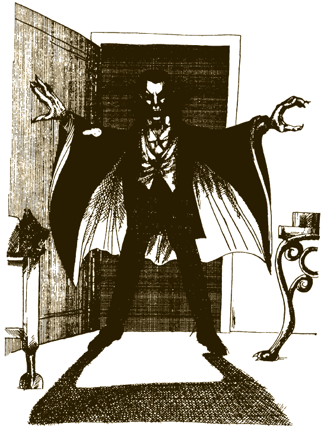

# 0

## Тони Кольтц

# В ПОЕЗДЕ С ВАМПИРАМИ

### Посвящается Дэвиду и Джонатану

Это необычная книга. Не пытайся читать ее по порядку, с начала до конца, переходя от одной страницы к другой, — ничего не получится! Ведь это игра, где тебя ждет множество приключений, — на этот раз ты вступил в борьбу с вампирами. Время от времени тебе придется делать выбор. Что принесет он? Успех или поражение?

Твои приключения — результат твоего выбора. Тебе самому решать, куда пойти, что сделать. А дальше — читай указания в конце страницы, и тогда узнаешь, к чему приведет твой выбор.

И помни: назад пути нет! Поэтому хорошенько подумай, прежде чем действовать. Игра есть игра: ты можешь проиграть, а можешь и выиграть!

### ОБ АВТОРЕ

Тони Кольтц родился и вырос в Далласе, штат Техас. Образование получил в колледже иезуитов и в Колумбийском университете. В течение ряда лет был помощником редактора литературного журнала «Америкен ревью» и редактором издательства «Бентам». Женат, имеет сыновей Дэвида и Джонатана.

### О ХУДОЖНИКЕ

Дуг Джеймисон — художник-иллюстратор, преподаватель, писатель. Живет с женой Пэт и детьми Лесли и Крисом в Нью-Йорке. Окончил Школу изобразительных искусств. С конца 60-х гг. иллюстрирует журналы, книги, детские издания. Соавтор и художник книги «Что такое ГНУ?». Преподает иллюстрацию и рисунок в Школе изобразительных искусств.

#### [Начать приключение](#1)

# 1

Ты едешь в поезде по дороге, идущей через Карпаты, в Румынии, в гости к своему дядюшке, которого зовут Эндрю. Во всем мире нет другого места, столь любимого вампирами, и нет другого человека, который знал бы о них больше, чем твой дядя. Он считает, что ты уже достаточно взрослый, чтобы принять участие в его будущей экспедиции. Ваша задача — научно доказать, что вампиры существуют, и положить тем самым конец всем спорам вокруг них.

С тобой в купе два других участника экспедиции: Нина, светловолосая девочка, твоя ровесница, и ее тетя, миссис Уэст, высокая, представительная дама лет шестидесяти. На шее у нее тяжелая золотая цепочка, а к ней подвешен такой большой драгоценный камень, какого ты в жизни не видел. Он кроваво-красного цвета и вспыхивает, словно догорающий костер.

Поезд не спеша прокладывает свой путь вдоль крутых склонов, то взлетая вверх, то опускаясь вниз, то делая резкие повороты. Ты тем временем достаешь письмо от дяди и перечитываешь заключительный абзац:

«В наших разысканиях нам могут помочь миссис Уэст и ее племянница. Многие поколения их семья владеет картиной и драгоценным камнем, которые, как говорят, обладают некоей страшной силой. Если мы сможем использовать эту силу в своих целях, картина и камень выведут нас на вампиров. Если же они попадут в недобрые руки, мы все можем оказаться в смертельной опасности. Поэтому ты должен сделать все, чтобы защитить их и их владелиц. Но волноваться тебе не надо — у тебя будут помощники. В свое время я сделал много добра цыганам, поэтому, где бы ты их ни встретил, они всегда будут тебе друзьями. Береги себя.

Эндрю».

Идет снег, поезд замедляет ход. В сгущающейся темноте кажется, что костер внутри камня миссис Уэст вспыхивает все ярче.

Внезапно она вскакивает, дрожа и хватаясь за ожерелье.

— Картина призывает меня, — вскрикивает она, — ей угрожает опасность.

— Вы шутите, тетя, — смеется Нина. — Картина же не умеет говорить.

— Я бы не стала утверждать это так решительно, моя дорогая. Я слышала ее так же ясно, как слышу сейчас тебя. Но так или иначе я должна удостовериться, что картине ничего не угрожает.

Она распахивает дверь и бросается к багажному вагону.

Проходит пятнадцать минут, и Нина, похоже, начинает беспокоиться. Через полчаса она уже в сильной тревоге.

— Пойду поищу ее, — говорит Нина. — Тебе, наверное, лучше остаться в купе на случай, если мы с ней разминемся.

Очень скоро Нина возвращается, ее глаза широко раскрыты, она часто и тяжело дышит.

— Я ее не нашла. Тетя исчезла.

— Нужно обыскать весь поезд, я тебе помогу. — С чего начнем?

— Можно вернуться в багажный вагон и поискать там ключи к разгадке. А можно спросить у пассажиров, не видел ли тетю кто-нибудь из них, — отвечает Нина. — Но я так волнуюсь, что не знаю, как лучше поступить. Решай сам.

Если ты хочешь проверить багажный вагон, открой страницу [4](#4).

Если хочешь расспросить пассажиров, открой страницу [31](#31).

# 4

В багажном вагоне полутемно и противно. Светит только одна тусклая лампочка, и такое впечатление, что здесь годами не убирали. Нина опускается на четвереньки и начинает шарить среди старых пыльных корзин, картонок, чемоданов. Тем временем ты стараешься разобраться в следах, отпечатавшихся на грязном полу. Миссис Уэст нигде нет. Она словно испарилась.

Ты уже готов бросить это занятие, но вдруг тебя зовет Нина. Ты протискиваешься среди вещей и видишь, что Нина наклонилась над каким-то необычным деревянным ящиком.

— Картина по крайней мере в целости и сохранности, — говорит Нина, стряхивая пыль со свитера и джинсов. — Она в этом ящике.

Ты тоже наклоняешься над ящиком и видишь, что он весь покрыт резьбой. На нем вырезаны глаза, уши, рты, ладони — и выглядит все это так натурально, что тебе становится неприятно.

— Нина, откуда у вас эта диковина? — спрашиваешь ты. — И что означает резьба и какое она имеет отношение к картине?

— Я знаю только, что мой двоюродный дед дал мне этот ящик незадолго до смерти. А он получил его от какой-то родственницы, жившей в Австралии, и та сказала, что этот ящик был в семье всегда. В ящике лежит картина, а в резьбе скрыты потайные замки. Дедушка объяснил мне, как их открывать, но я никогда не заглядывала внутрь и не видела картину.

— А не посмотреть ли нам сейчас? — предлагаешь ты.

— Не знаю. Может, не стоит?

Ты показываешь Нине письмо дяди.

— А если картина поможет нам отыскать твою тетю?

— Тоже верно, — соглашается Нина. — Но что, если она действительно обладает какой-то злой силой, которая обернется против нас? По-моему, лучше сделать, как советует твой дядя, и обратиться за помощью к цыганам. А потом мы вернемся и откроем ящик.

Если ты считаешь, что лучше заглянуть в ящик сейчас, открой страницу [8](#8).

Если ты предпочитаешь обратиться к цыганам, открой страницу [55](#55).

# 6

В полночь твое дежурство кончается. Ты будишь Наноша и рассказываешь ему о маленьком человечке.

— Возможно, он шпионил за нами, — говорит Нанош. — Или это была ловушка: вампиры пытались разделить нас, увести тебя. А может, этот человечек на самом деле хотел показать нам другой вход в замок.

Нанош продолжает рассуждать, но ты уже крепко спишь.

Смех! Чудовищно громкий смех! Может, он тебе снится?

Кто-то трясет тебя за плечо.

— Оставьте меня в покое! — вскрикиваешь ты.

— Просыпайся! Просыпайся! — говорит дядя Эндрю. — Скоро рассвет. Я нашел способ открыть ворота и достал из ящика картину. Мы должны пронести ее в замок и напасть на чудовищ, едва взойдет солнце — в это время они наиболее уязвимы.

Ты садишься и трешь глаза руками.

— Который час? — спрашиваешь ты.

— Скоро шесть, — отвечает дядя Эндрю. — Надо торопиться.

Эндрю устремляется к замку, держа картину перед собой, как щит, вы с Наношем не отстаете от него. Проникнув во внутренний дворик замка, вы оказываетесь прямо перед высокой башней. Посередине башни дверь, к которой ведет со двора каменная лестница. Неожиданно дверь открывается, и из нее вырывается поток света. В дверном проеме появляются мужчина и женщина, одетые в вечерние платья. На женщине драгоценный камень миссис Уэст, излучающий зловещее красное сияние.

— Граф Золтан и графиня Кармилла, — шепчет Нанош.

— Добро пожаловать, — говорит граф. — Мы предполагали, что вы попытаетесь увидеться с нами именно в этот час. Но разве вам не известно, что картина нам не страшна? Моя жена носит теперь гелиотроп, драгоценный камень, который был в чужих руках в течение многих столетий. Он защищает нас от картины. Считайте, что вас уже нет в живых, смертное дурачье!

Тебе кажется, что дядя Эндрю дрожит от страха. Но потом ты понимаешь, что это сотрясается картина.

— Скорее! — хриплым голосом говорит Эндрю. — Берите картину и держите ее крепче.

Вы с Наношем бросаетесь к нему и вцепляетесь в картину. Такое впечатление, что она живая. Она брыкается, как лошадь. Затем появляется радужная вспышка и картина обволакивается разноцветным облаком. В вампиров летят золотые, серебряные, фиолетовые, зеленые, голубые светящиеся стрелы. Но излучаемое камнем сияние не только защищает вампиров, оно загоняет светящийся поток обратно в картину. Жуткое красное мерцание словно придавливает вас к земле.

— Картине нужна наша помощь, — кричит Эндрю. — Не сомневайся, что победишь! Доверься тем силам, которые исходят от картины!

Ты заставляешь себя поверить в то, что сможешь одолеть вампиров. Полностью сосредоточиваешься на этой мысли. Поток красного сияния постепенно замедляется и наконец останавливается. Кажется, он остановился навсегда.

Вы все — и люди и вампиры — были так поглощены этим сражением, что не заметили, как наступил день. Из-за полуразвалившейся стены замка появляется солнце и заливает весь двор яркими лучами. Картина словно упивается этим светом. Гелиотроп становится тусклым, его красное сияние меркнет.

Теперь видно, что вампиры напуганы. Они пытаются скрыться в башне. Но не успевают, от картины отделяются две блестящих стрелы, словно два белых сгустка энергии. Раздается оглушительный взрыв, вы видите две яркие вспышки… Там, где только что стояли вампиры, вьется пахнущий серой дым.

Вы обыскиваете замок в поисках миссис Уэст и обнаруживаете ее лежащей на каменной плите. С уничтожением вампиров она, похоже, вышла из транса и находится в боевом настроении.

— Эндрю, старый мошенник! Где тебя носило? И где моя племянница? И мой камень? И моя картина?

Эндрю пытается объяснить ей, что Нина потерялась в тумане, но внезапно замолкает. В дверях появляется Нина собственной персоной. Она бросается к тете и целует ее. Потом рассказывает, как ей удалось спастись.

— Прежде чем волки меня заметили, я успела влезть на дерево. Когда они ушли и туман рассеялся, я спустилась вниз, нашла свою лошадь и помчалась разыскивать вас. Но самое интересное, кажется, пропустила.

Нина притворяется, будто расстроена этим, но улыбка выдает ее радость.

Эндрю достает из сумки фотоаппарат.

— Не двигайся, Нина, — просит он. — И остальные тоже. Я хочу сделать несколько снимков для моего архива.

Вспышка магния. Потом еще и еще одна.

Эндрю не нужно просить вас улыбнуться. Ведь вы никогда не были так счастливы!

#### КОНЕЦ

# 8

Как только ты принимаешь решение открыть ящик, Нинин страх проходит. Теперь ей не терпится скорее извлечь картину. Она лихорадочно ощупывает пальцами резьбу на крышке. Ее пальцы касаются глаз, тянут за руки, дергают за уши. Ее движения так быстры, что ты едва успеваешь за ними следить. Внезапно сбоку, где не было до этого никакого шва, появляется щель. Нина вздрагивает и отступает назад.

— Картина… — шепчет она. — Картина хочет, чтобы я открыла ящик. Это она торопила мои пальцы.

— Думаешь, она знает, что нужна нам? — спрашиваешь ты с надеждой.

— Не уверена. Просто она хочет на свободу.

Крышка ящика на невидимых петлях медленно открывается, и ты видишь картину. Это портрет красивого мужчины и прекрасной женщины в старинных одеждах. Свеча, стоящая на массивном деревянном столе, бросает таинственный свет на их лица. Позади них открытое окно, в которое светит полная луна.

Похоже, что картине этой несколько веков, но мужчина и женщина выглядят совсем живыми, их глаза блестят так же, как камень миссис Уэст. Взгляд направлен прямо на тебя, и в нем читается страшный, неутолимый голод.

Усилием воли ты отводишь глаза и обнаруживаешь, что картина движется. Она подалась вперед и напряглась, подобно леопарду, готовому броситься на свою добычу. Тут ты слышишь, как сзади тебя открывается вагонная дверь.

Дверь закрывается, и картина неожиданно замирает. Ты оборачиваешься в надежде увидеть миссис Уэст, но вместо нее видишь молодого человека. На нем ярко-зеленая рубашка с пышными рукавами, его голова повязана платком в сине-зеленую полоску.

— Я Нанош, князь цыган, — говорит молодой человек.

— Тогда вы, должно быть, знаете моего дядю Эндрю, — говоришь ты.

— Не просто знаю — я обязан ему жизнью. Он попросил меня охранять тебя и тех, кто едет с тобой, и охранять их картину. Вам нужна сейчас моя помощь — картина дала знак.

Нина рассказывает Наношу о том, что пропала ее тетя, и о ее камне.

— Дядя говорит, что камень тоже обладает магической силой, — сообщаешь ты.

— О камне я ничего не знаю, а вот о картине могу кое-что рассказать. У нас ходит много легенд о ее волшебной силе, твой дядя считает, что она уничтожает вампиров. Мужчина на картине — это граф Золтан, женщина — его жена Кармилла. Мне известно, что они едут в этом же поезде, в отдельном вагоне. Поэтому вы и ваша картина в смертельной опасности. — Он переходит на шепот: — В моем народе говорят, что они вампиры. Поэтому вы должны немедленно покинуть поезд.

— Но если они вампиры, — говорит Нина, — то как можно оставить тетю в их руках?

— Находясь в поезде, мы ничем не сможем ей помочь, — отвечает Нанош. — Мы не знаем, как привести в действие волшебную силу картины; это известно только Эндрю и Старейшим.

— Старейшим? — переспрашиваешь ты.

— Это духи, которые руководят нами, — объясняет Нанош. — Они говорят устами Любы, нашей прорицательницы. Если отнести картину к нам в табор, там в безопасности можно будет спросить у духов, что нам делать. Есть и другой вариант: связаться на следующей станции с твоим дядей и спросить совета у него. Когда мы будем знать, как нам воспользоваться картиной, мы сможем последовать за вампирами в их замок. Пока что остается только надеяться, что миссис Уэст еще жива.

Если ты решил связаться с дядей Эндрю, открой страницу [22](#22).

Если ты решил отнести картину в цыганский табор, открой страницу [64](#64).

# 11

Вы без труда открываете крышку люка и видите внизу комнату, похожую на спальню — только на месте кровати стоит гроб! Окно закрыто тяжелыми, свисающими до пола занавесками, так что ни единый луч света не проникает в комнату. На низеньком столике стоит керосиновая лампа. В комнате как будто никого нет, поэтому ты спрыгиваешь вниз, за тобой Нина и профессор.

Судя по всему, здесь живет не очень опрятный человек. Хотя в комнате, похоже, есть стенной шкаф, на полу валяется куча каких-то длинных одеяний. Вы заглядываете из любопытства в шкаф и обнаруживаете там миссис Уэст привязанную к стулу и с кляпом во рту.

Вы отвязываете ее и вынимаете кляп. Миссис Уэст поднимается со стула и начинает топать ногами, словно грозный генерал на своих солдат.

Открой страницу [96](#96).

# 12

Может быть, эти двое знают то, что неизвестно проводнику. Вы входите в купе, и тот человек, который одет во что-то яркое, поднимает на вас глаза и улыбается. Он раскладывает на столе пасьянс, однако карты выглядят необычно. Вместо привычных шестерок, тузов, королей на них какие-то странные картинки.

— Меня зовут Фаино, — представляется он. — А это профессор Гарц.

Профессор Гарц не обращает на вас ни малейшего внимания. Он погружен в книгу — старинный, переплетенный в кожу фолиант под названием «Тайны оккультизма. Том VII». Вы рассказываете им об исчезновении миссис Уэст, но и это как будто не вызывает у профессора интереса. Он смотрит в окно и попыхивает трубкой.

Смотри следующую [страницу](#13).

# 13

Фаино, напротив, взволнован тем, что случилось с вами.

Карты внезапно исчезают, и на их месте появляется большой золотой диск с какими-то крошечными знаками: буквами на иностранном языке, фигурками животных, изображением солнца и луны.

— А где же карты? — спрашиваешь ты.

— Не знаю, везде где угодно, — пожимает плечами Фаино. — Я исполняю ваши сны и ваши мечты. Некоторые называют меня волшебником.

У него в руке появляется голубь, он облетает купе и садится Фаино на запястье. Потом исчезает.

— Дешевые трюки, — пренебрежительно заявляет профессор. — Произведут впечатление только на ребенка. Не понимаю, зачем Эндрю навязал мне этого безмозглого фокусника!

— Он хочет сказать — волшебника, — поясняет Фаино, улыбаясь и аплодируя профессору, при этом его ладони высекают мириады разноцветных искр.

Ты спрашиваешь профессора, не имеет ли он в виду твоего дядю Эндрю, специалиста по вампирам.

— Ну конечно, его, кого же еще? — недовольно говорит он. — Другого Эндрю в этих проклятых горах нет. Он пригласил меня и вот этого типа, который сейчас так глупо улыбается, принять участие в экспедиции по изучению вампиров. Этот волшебник хочет убедиться, что они существуют. Я же докажу, что их нет в природе.

Он встает и выходит из купе.

Открой страницу [66](#66).

# 14

Ближайшая к тебе лампа укреплена на кронштейне, вбитом в стену. Как бы невзначай ты придвигаешься к ней. Нина и миссис Уэст открывают ящик. Нина прислоняет картину к стене, граф и графиня с восхищением смотрят на нее. Это и не удивительно, поскольку на картине, написанной очень-очень давно, изображены они сами. Оттолкнув Нину и миссис Уэст, они склоняются над портретом, изучая каждую деталь.

— Как молоды мы были тогда! И ничего необычного в нас не было! — восклицает графиня, вся во власти воспоминаний.

— А я ведь был лихой парень!

— Ты и остался таким, мой любимый!

— Только лихой парень весь в кровавых пятнах, — тихо замечает миссис Уэст.

— Ну-ну, дорогая, не судите так строго, — говорит граф.

Вампиры снова поворачиваются к портрету, а ты в этот момент, набравшись храбрости, срываешь лампу с кронштейна и кидаешь туда, где стоят вампиры. Как ты и предполагал, стеклянный колпак разбивается и керосин выплескивается на пол.

Ты не ждешь, пока он вспыхнет, а начинаешь выламывать следующую лампу.

— Пожар! Пожар! — кричат вампиры.

Керосин вспыхивает! Вторая лампа у тебя в руках. Ты бросаешь ее на пол, и пламя распространяется, с легкостью пожирая все деревянное, что есть в вагоне. Профессор Гарц опрокидывает ногой печку, горящие поленья рассыпаются по полу. Вампиры орут и беснуются — но вас уже разделяет стена огня.

— Бежим отсюда! — кричишь ты, бросаясь к двери, ведущей в пассажирский вагон.

И вот вы снова в пассажирском вагоне. Нина ведет тетю в купе, а вы с профессором отсоединяете муфту сцепления, связывающую вагон графа Золтана с остальным поездом.

Вы успеваете вовремя. Поезд удаляется, а вагон графа остается стоять на путях, охваченный пламенем. Затем раздается взрыв такой силы, что поезд едва не сходит с рельсов.

Когда поезд перестает сотрясаться, вы оглядываетесь. Позади вас яма. Никаких следов вагона — нет даже дыма.

— От них ничего не осталось, — говоришь ты профессору. — Взрыв уничтожил даже вампиров.

— Вампиров? — переспрашивает профессор. — Ты все еще утверждаешь, что эти двое были вампирами.

— Да, — отвечаешь ты убежденно.

Профессор хмыкает. Затем ты видишь на его лице улыбку — впервые за то время, что вы с ним общаетесь.

— Ну что ж, как бы мы их ни называли, они творили зло. Могу сказать, что мир только выиграл, избавившись от них.

#### КОНЕЦ

# 16

— Я не думаю, что нужно ждать до утра, — говоришь ты. — Профессор Гарц, вы поможете нам с Ниной?

— Да, — отвечает профессор, — воров нужно схватить.

— Вампиров, — поправляет его миссис Уэст. — Речь идет о вампирах, дорогой профессор.

— Если вы так думаете, то ради Бога, сударыня, — говорит профессор, — но разрешите мне закончить. Как бы мы их ни называли, они должны предстать перед судом. Поэтому я начну сейчас барабанить в дверь и кричать, что я полицейский инспектор и что мне известно, что в этой комнате насильно удерживают миссис Уэст.

— Превосходная мысль, — восторгается Нинина тетушка.

Итак, вы с Ниной взбираетесь на крышу вагона, а профессор занимает место между пассажирским вагоном и личным вагоном графа Золтана. Вы смотрите на него сверху и машете ему рукой. Затем вы добираетесь по крыше до конца поезда и спускаетесь по лестнице на заднюю площадку. Вас никто не видит. Пока все идет хорошо, считаешь ты.

Открой страницу [98](#98).

# 18

Вы стучите в дверь вагона графа Золтана, но никто не отвечает. Вы стучите сильнее, и через некоторое время дверь отворяется. Вы видите маленького толстого человечка с одутловатым неприятным лицом, очень смахивающего на гнома. Он неприязненно смотрит на вас.

— Убирайтесь отсюда, — рявкает он.

— Мы ищем мою тетю, миссис Уэст, — вежливо говорит Нина. — Вы случайно…

— Убирайтесь! Нечего вам тут делать!

Появляется высокий элегантный мужчина. Он отталкивает карлика и изящно кланяется.

— Входите, пожалуйста, — приглашает он. — Меня зовут Золтан. Простите моего неразумного слугу Белу. Мне никак не удается научить его гостеприимству.

Вагон у графа просто роскошный. Но все выглядит очень старомодным. Граф ведет вас по длинному коридору в гостиную, освещенную свечами и керосиновыми лампами.

— А это моя дорогая жена Кармилла.

Женщина тиха и неподвижна, так что вы в первую минуту даже не заметили ее.

— Бела, принеси молодым людям что-нибудь перекусить, — распоряжается граф.

Нина пытается спросить его о тете.

— Мы поговорим о ней позже, а сейчас вы нас очень обяжете, если немного поедите.

Бела ввозит сервировочный столик. На нем вазы с конфетами и тарелки с домашним печеньем, пирожными, кексами, а также кувшины с фруктовым пуншем и кружки с горячим шоколадом. Все такое аппетитное!

Хотя ты знаешь, что вам надо искать миссис Уэст, ты вдруг вспоминаешь, что уже давно не ел.

Графиня, кажется, ожила.

— Угощайтесь, пожалуйста, — говорит она ласково, но ее взгляд чем-то настораживает тебя.

Если ты соглашаешься поесть, открой страницу [61](#61).

Если ты решил отказаться, открой страницу [81](#81).

# 19

Бела монотонно произносит какие-то слова на непонятном тебе языке: «Гротчик Бела спавиви джои. Боска неер, Лола феер, Андра зеер».

Проходит меньше времени, чем нужно, чтобы переключить телевизор с одной программы на другую, и вы оказываетесь на берегу прекрасного, покрытого буйной тропической растительностью острова.

Нина стоит рядом с тобой и удивленно щурится. Профессор Гарц выглядит изумленным и как будто не верит своим глазам. Неподалеку вы видите миссис Уэст — она привязана к стулу, и во рту у нее кляп. Она изо всех сил старается закричать, и Нина кидается к ней, чтобы освободить ее.

Но больше всего потрясает вас появление из голубых вод лагуны дяди Эндрю. Он отряхивается и отплевывается и чувствует себя очень неуютно в своей зимней одежде.

— Очень рад вас видеть, — говорит он. — Но что, черт побери, происходит?

Ты рассказываешь ему про «перенесение».

— Но как мы очутились здесь, я сказать не могу, — заключаешь ты.

— Хотя все во мне протестует против этого, — говорит профессор, — я все-таки должен признать, что здесь не обошлось без колдовства.

— Ничего другого не может быть, — говорит дядя Эндрю. — Но где бы мы сейчас ни находились, постараемся устроиться получше. Я подозреваю, что мы пробудем здесь довольно долго. — Он поворачивается к вам с Ниной. — Давно ли вы читали «Робинзона Крузо»?

#### КОНЕЦ

# 20

— Кончайте! — кричишь ты. — Я не хочу, чтобы меня гипнотизировали!

Фаино печально качает головой и прячет диск.

— Помилуйте, — говорит он, — я хотел как лучше. Я надеялся, что вы заснете и забудете про все это. Вы бы приехали, куда вам надо, в целости и сохранности.

— А моя тетя? — спрашивает и Нина, проснувшись.

— О ней я и хочу сказать. — Лицо у Фаино очень озабоченное. — Поскольку вы теперь уже не сможете ехать спокойно и видеть сны, вам предстоит совсем другое путешествие.

— Другое? — переспрашиваешь ты.

— Вам будет очень страшно… и это еще мягко сказано! Может быть, вы в конце концов и отыщете вашу тетю, — говорит он Нине, — может быть, она даже будет жива…

Внезапно из-под воротника Фаино высовывается бурундук. Он оглядывает всех, потом исчезает. Фокусник энергично вскакивает.

— А пока мы должны тщательно подготовиться, — говорит он. — Я придумал новое средство — ловушку для вампиров. К сожалению, у меня не было возможности испытать ее.

Из сетки над своей полкой он достает большой металлический ящик с замком. Он открывает его и извлекает два завернутых в бумагу предмета. Вы идете в багажный вагон, и там Фаино достает из бумаги большие зеркала.

Пока Фаино занимается установкой ловушки, он рассказывает вам, на чем основано ее действие. Ловушка состоит из зеркал и красного, зеленого и синего лазеров. При обычном освещении вампиры не отражаются в зеркалах и не отбрасывают тени. Но лазеры создают особое освещение.

— Если я смогу увидеть отражение вампиров в зеркале, — объясняет Фаино, — значит, я смогу их поймать. Я поставил зеркала так, что они смотрят одно в другое, а лазеры будут освещать их сбоку. Если нам удастся затащить вампиров между зеркал, они наши!

Внезапно вы слышите чьи-то быстрые шаги. Вбегает миссис Уэст.

— Помогите! — кричит она. — За мной гонятся вампиры! Мне удалось ускользнуть от них, но они преследуют меня!

Открой страницу [117](#117).

# 22

Когда показывается станция, валит густой снег, но вы оба без сожаления покидаете поезд. На станции вы находите телефон и, хотя и не сразу, дозваниваетесь до твоего дяди. Он велит вам отнести картину в гостиницу, находящуюся в ближайшей деревушке.

На следующее утро снег прекращается и выглядывает солнце. Но мороз не ослабевает. Днем верхом прибывает Эндрю, с ним лошади под седлом для вас с Ниной и Наношем, а также вьючная, на которую погружены припасы, снаряжение и будет еще помещена картина.

Когда ты виделся с дядей последний раз, он был чисто выбрит. Сейчас у него густая седая борода. В остальном он точно такой, как всегда: маленький, толстенький, с красным лицом и венчиком серебристых волос вокруг лысины. Он выглядит веселым и дружелюбным, однако глаза у него жесткие, как сталь.

— Мы сделаем все, что в наших силах, чтобы выручить твою тетю, — обещает он Нине. Затем добавляет, повернувшись к тебе: — Мне кажется, мы скоро убедимся в существовании вампиров.

И вот вы уже сидите в седлах и взбираетесь гуськом по опасно крутой и узкой горной тропе. Вскоре, уже находясь в поросшей лесом долине, вы слышите позади себя вой. Ты поворачиваешься в седле и видишь множество серых теней, петляющих среди деревьев.

— Волки! — кричит Нанош.

Волки приближаются, твоя лошадь храпит от страха.

— Нужно прибавить ходу, — говорит дядя Эндрю.

Вы пришпориваете лошадей, чтобы скорее выехать из леса и оказаться в безопасности. Ты слышишь, как сзади тебя споткнулась лошадь, затем раздается глухой звук, как будто кто-то упал. О том, что произошло, ты догадываешься только тогда, когда тебя догоняет лошадь Нины, но без нее самой.

— Стойте! — кричишь ты. — Нина упала! Вы осаживаете лошадей и поворачиваете назад. Но различить ничего невозможно. Лес окутан таинственным густым туманом.

— Что случилось? — громко спрашиваешь ты. — Что это такое?

— Мы называем это «туманом вампиров», — говорит Нанош, — в нем можно блуждать несколько дней. Боюсь, мы не найдем Нину.

Держась как можно ближе друг к другу, вы пытаетесь отыскать дорогу, по которой ехали. Но туман такой густой, что вы едва различаете голову своей лошади. Вы зовете Нину, но туман словно поглощает все звуки. Вы продолжаете поиски, но не обнаруживаете никаких следов Нины.

Наконец Эндрю приказывает остановиться.

— Вряд ли мы отыщем ее сегодня, — говорит он, — к тому же можем сами заблудиться. А нам просто необходимо доставить картину в замок вампиров. За Ниной мы сможем вернуться, когда туман рассеется.

— Но вы забыли про волков, — говоришь ты. — У Нины нет лошади.

— В таком тумане волки бессильны, — успокаивает тебя Нанош. — Если она заберется на дерево, она будет в безопасности.

— Я не возражаю, чтобы ты остался здесь и продолжил поиски, — говорит Эндрю. — Но если ты хочешь ехать с нами, то надо торопиться.

Если ты остаешься искать Нину, открой страницу [54](#54).

Если ты едешь с Эндрю и Наношем, открой страницу [69](#69).

# 24

Лучи становятся еще ярче, но вампирам это нравится. Они начинают кружиться в вальсе.

Ты не можешь отвести глаз от графа. На мгновение встречаешься с мертвенной черной бездной его взгляда. Глаза графа словно запирают тебя в самом себе, запрещают тебе двигаться. Когда граф отводит взгляд, ты чувствуешь, что парализован.

Открой страницу [118](#118).

# 26

— Надо быстрее выбираться отсюда, — кричишь ты Нине.

— Хорошо, — отвечает Нина. — Но…

— Никаких «но». Бежим скорее, — приказываешь ты, таща ее за руку. — Мы проберемся к машинистам и попросим помочь нам.

Вы торопитесь к двери. Увлеченные танцем, вампиры словно не замечают вас. Но когда ты берешься за ручку двери, Нина отдергивает руку.

— Стой! — говорит она. — Мы не можем бросить картину. Она снова призывает меня.

— Не глупи, Нина, — возражаешь ты. — Все это тебе просто мерещится.

— Вовсе не мерещится, — сердится Нина. — Я слышу этот голос так, как слышу тебя. Ну пожалуйста! Помоги мне с картиной. И отнесись серьезно к моим словам.

Если ты уговорил Нину бежать вместе с тобой к машинистам, открой страницу [88](#88).

Если ты согласился вернуться к картине, открой страницу [114](#114).

# 27

В купе у цыган тепло и уютно. Вы представляетесь, и цыгане тоже называют вам свои имена. Молодого парня зовут Нанош, он князь цыган. На нем ярко-зеленая рубашка с пышными рукавами, вокруг головы у него повязан платок в зелено-голубую полоску. Старую женщину, которая едет с ним, зовут Люба. Она в юбке с синими и золотыми полосками, красном пуховом свитере и черной шали. В ее красивых седых волосах три живых голубых цветка. Похоже, что это добрая и мудрая женщина.

Рассказ Нины об исчезновении ее тети как будто не вызвал у цыган большого интереса. Но стоило тебе упомянуть дядю Эндрю, и глаза их загораются.

— Эндрю не раз спасал мне жизнь, — говорит Нанош. — Что бы мы для вас ни сделали, мы все равно будем в неоплатном долгу перед ним.

— Мы поможем вам, — очень серьезно добавляет Люба. — Но в этом вагоне опасно находиться. Я чувствую что-то нехорошее в воздухе. Где-то рядом вампиры.

Люба поднимает лицо к потолку и закрывает глаза. Некоторое время она сидит неподвижно, прислушиваясь к чему-то, чего никто из вас слышать не может.

— В багажном вагоне в резном деревянном ящике находится картина, — произносит она наконец. — Вам это известно?

— Эта картина принадлежит мне и моей тете, — кивает Нина.

— Картина может уничтожить вампиров, — говорит Люба. — Но оставаться здесь нам нельзя. Мы возьмем картину в наш табор и спросим Старейших. Они скажут нам, что нужно сделать с картиной, и скажут, как выручить миссис Уэст.

Профессор встает.

— Не сомневаюсь, что вы добрые люди, — обращается он к цыганам, — но вы заблуждаетесь, потому что находитесь во власти суеверий. Совершенно очевидно, что миссис Уэст попала в руки грабителей, которые охотятся за ее драгоценным красным камнем. Покинуть поезд сейчас, когда миссис Уэст, а возможно, и эти негодяи где-то рядом, очень неразумно. Нам следует обыскать поезд, и мы найдем разгадку.

Ты не согласен с профессором насчет воров. Но в том, что покидать поезд нельзя, доля правды есть.

Если ты идешь с цыганами в их табор, открой страницу [64](#64).

Если ты остаешься в поезде и ищешь вместе с профессором Гарцем ключ к разгадке, открой страницу [71](#71).

# 31

Вы выходите в коридор и с удивлением озираетесь. Миссис Уэст позаботилась о том, чтобы у вас было очень уютное купе, но весь поезд такой старый и изношенный, что удивительно, как он вообще не разваливается. Нина дрожит.

— Здесь настоящий мороз, — жалуется она.

— Надо двигаться, — говоришь ты, — тогда мы согреемся.

Вы обнаруживаете, что в поезде едет всего несколько пассажиров. В одном купе — двое цыган: статный молодой парень и с ним очень старая женщина. В другом купе сидят друг против друга двое мужчин. Один из них рослый, и у него внушительная внешность. На нем костюм в коричневую клетку, во рту трубка. Его спутник небольшого роста, он одет во что-то странное и яркое и явно озабочен.

Остальные купе пустые. Ваш вагон прицеплен к багажному вагону, впереди которого только паровоз, а к вашему вагону прицеплен еще один, но он заперт.

В коридоре вы встречаете проводника. Вид у него не очень приветливый.

— Вы не видели случайно мою тетю, миссис Уэст? — спрашивает Нина.

— Нет, — отвечает он, отводя глаза.

— Она пошла в багажный вагон, проверить, как там наша картина, — объясняет Нина, — и не вернулась. Я пошла посмотреть, что с ней, но тетя исчезла.

— Такие вещи постоянно случаются в этом поезде, — говорит кондуктор, недовольно качая головой. — Не пойму, зачем люди вообще в нем ездят.

— Где же она может быть? — спрашиваешь ты.

— Смотрите везде, — говорит проводник. Затем продолжает, понизив голос: — Кроме личного вагона графа Золтана и графини Кармиллы. Туда вход воспрещен. — Он отступает назад, словно в испуге. — Мало кто ездит в этих горах. Вы уже, наверное, догадались почему?

— Я не уверен, что догадался, — говоришь ты Нине, — но мне совершенно ясно, что он не хочет помочь нам — или не может.

— Думаю, нам надо спросить у других пассажиров, — говорит Нина, — а может быть, даже попытаться поговорить с графом Золтаном, хотя проводник и сказал, что вход в его вагон воспрещен.

Если ты решил обратиться за помощью к двум мужчинам, открой страницу [12](#12).

Если ты предпочитаешь поговорить с цыганами, открой страницу [55](#55).

Если ты хочешь постучаться к графу Золтану, открой страницу [18](#18).

# 32

Подойдя к воротам, ведущим в разрушенный замок, вы обнаруживаете, что они заперты.

— Ударьте по воротам Звездой Лулуво, — предлагает Нанош.

Ты ударяешь, и от звезды исходит чистое, прекрасное сияние. Ворота распахиваются, и вы видите маленький дворик. На противоположном конце его возвышается башня.

— Ну что же, — говоришь ты, собрав все свое мужество. — Думаю, нам надо войти.

— Постой, — говорит Нина. — По-моему, сперва надо достать из ящика картину.

Она осторожно ставит ящик на землю и отпирает все замки, скрытые в замысловатой резьбе. Извлеченная из ящика, картина словно оживает. Она буквально тащит Нину к входу в башню. За дверью начинается каменная лестница, уводящая куда-то вниз, в темноту.

Вы с цыганами зажигаете карманные фонарики и начинаете осторожно спускаться по древним, стоптанным ступеням. Лестница приводит вас в огромную комнату со сводчатым потолком, прорубленную в основании горы. Комната пуста. Вы проходите ее и попадаете в узкий темный туннель. Зловещие тени мерцают во мраке, нарушаемом только лучами карманных фонариков.

Кажется, что туннель тянется на много миль и уводит вас все дальше в глубь горы. Наконец вы попадаете еще в какую-то комнату… Она выглядит точно так же, как твоя комната у тебя дома!

Ты хватаешь Нину за руку.

— Я просто не верю, — говоришь ты ей.

— Я сама не верю, — отвечает Нина. — Никогда бы не подумала, что моя комната может быть здесь.

— Твоя?! — удивляешься ты. — Но это же моя комната!

Тут входят миссис Уэст и дядя Эндрю.

— Здравствуйте, дорогие, — говорят они в один голос.

Картина с рычанием вырывается у Нины из рук и бросается на них.

— Это не они, — кричишь ты.

Нина, спотыкаясь, идет за картиной, ты кидаешься за ней, и вдруг фальшивые миссис Уэст и дядя Эндрю превращаются в летучих мышей и улетают в туннель. Нине удается схватить картину, но картина тащит ее за собой туда, куда полетели летучие мыши.

Спеши за ними, подсказывает тебе внутренний голос. Эти летучие мыши — вампиры. Их нужно уничтожить.

Ты несешься вслед за Ниной по туннелю. Картина освещает вам дорогу, так что тебе не нужно думать о фонарике. Наконец вы оказываетесь в огромной душной пещере. В ней миллионы летучих мышей, но только у двоих из них глаза похожи на горящие угли. И только у одной ты видишь гелиотроп. Он горит, как глаза вампиров, наводя на тебя ужас.

Картина хрипит.

Ты вспоминаешь о Звезде Лулуво и обеими руками поднимаешь над головой кусочек хрусталя. Гелиотроп меркнет. Звезда поглотила его энергию.

Картина снова хрипит, и от нее отделяется яркий луч света, извивающийся как змея. Вампиры ничего не могут сделать с этим страшным для них лучом. Он превращает их в яркий огненный шар, и им приходит конец.

Немного позже вы находите миссис Уэст. А наутро прибывает дядя Эндрю. Он очень расстроен, что опоздал и не смог принять участия в ваших приключениях. И все-таки он счастлив. Наконец-то у него есть доказательства существования вампиров, которые он так долго искал.

#### КОНЕЦ

# 34

Ты осторожно открываешь вторую дверь. То, что ты видишь, скорее чулан, чем комната… нора животного, а не жилище человека.

На полу в углу стоит старомодный граммофон, он заведен, и из него несутся такие жалобные, душераздирающие голоса животных, каких ты никогда не слышал. Над граммофоном склонился приземистый и очень неприятный человечек, похожий на гнома. Он так внимательно слушает, что даже не замечает вас. В другом углу лежит куча тряпья, служащая, вероятно, гному постелью. На полу валяются обглоданные кости. И везде зеленые гниющие куски чего-то, чего вы определить не можете.

— Послушайте, — обращается к карлику профессор Гарц.

— Тише, — отвечает тот. — Не мешайте.

Когда граммофон наконец умолкает, человечек поворачивается к вам.

— Ну, — говорит он, — полагаю, вы хотите узнать что-нибудь о графе и графине и старой даме, которую они прихватили с собой.

— Миссис Уэст? — спрашиваешь ты. — Значит, она здесь?

— В соседней комнате, и связана, — отвечает карлик. — Граф пошел в багажный вагон, чтобы забрать оттуда картину и драгоценный камень, за которыми они так охотятся. А графиня прилегла в гостиной, думает, наверное, о том, как утолить жажду. Надо, пожалуй, сказать ей, что вы здесь, — уж очень вы все на вид полнокровные.

— Бела! — раздается голос из-за стены, такой холодный, что, кажется, он может заморозить извергающийся вулкан. — С кем это ты там разговариваешь, негодник?

— Сам с собой, — громко отвечает человечек. Затем переходит на шепот. — Это графиня, — говорит он вам. — Она очень подозрительна, все время следит за мной, так что моя жизнь — это сплошное страданье. Надо бы, конечно, сказать ей, что вы здесь. Но пусть-ка помучается от жажды. — Он оглядывает вас всех. — Пожалуй, я лучше перенесу вас.

Вы с Ниной смотрите друг на друга вопросительно. Бела тем временем бежит к своей постели. Он быстро расшвыривает тряпье, приподнимает половицу и вытаскивает большую книгу. Она называется «Колдовство для начинающих».

— Они ничего не знают о перенесении, — говорит он злобно, имея в виду графа и графиню. — Правда, людей я пока еще не переносил. Но на животных я хорошо попрактиковался.

— Перенести! — восклицает профессор Гарц. — Что вы имеете в виду?

— Ш-ш-ш, — шепчет Бела. — Сюда может прийти графиня, и у меня будут неприятности. — Он листает грязные страницы и наконец находит нужное место. — Скажите мне, куда бы вы хотели попасть, и я попробую перенести вас туда. Но не удивляйтесь, если окажетесь где-нибудь еще. Колдовство — вещь ненадежная. Все может кончиться совсем не так, как вы ожидаете.

— Я хочу домой, — говорит Нина, не задумываясь. — И хочу, чтобы с нами была моя тетя. Вы можете перенести ее тоже?

— Попробую, — отвечает Бела. — Какие-нибудь другие идеи у вас есть?

— Может быть, вы перенесете нас всех к моему дяде Эндрю? — предлагаешь ты. — Как вы думаете, профессор Гарц?

— Я думаю, что все это смахивает на фарс, — сердито отвечает профессор. — Давайте лучше займемся делом.

— Решайте, — говорит Бела.

Если ты говоришь Беле «Перенесите нас к дяде Эндрю», открой страницу [19](#19).

Если ты говоришь «Перенесите нас домой», открой страницу [43](#43).

# 36

Вы с Ниной очень беспокоитесь за миссис Уэст. Но Фаино, встретившись наконец с вампирами, весь кипит от радости.

— Такой шанс бывает раз в жизни!

Ты оборачиваешься к Нине, желая с ней поговорить, но видишь, что она стоит в углу и пристально смотрит на деревянный ящик, покрытый замысловатой резьбой.

— Картина в этом ящике, — говорит она. — Мне кажется, она хочет что-то мне сообщить.

Ты глядишь на свою подружку с растущей тревогой. Картина способна что-то сообщить? Не спятила ли Нина часом?

— Вот! — взволнованно шепчет девочка. — Она снова заговорила!

Единственное, что ты слышишь, — это стук колес, да еще звуки, с которыми Фаино устанавливает свою ловушку.

— Не знаю, смогу ли я, — произносит Нина, обращаясь к ящику.

— Ох… я… оно… — Она ловит ртом воздух.

— Прошу вас, — обращается к ней Фаино, оторвавшись от ловушки, — не бойтесь. — Ну же! Нечего сидеть сложа руки и нагонять друг на друга страх. Скоро вампиры попадут в мою ловушку, и все будет в порядке, — бодро говорит он. — Смотрите!

Он взмахивает руками, и неожиданно появляется огнедышащий дракон, держащий в лапах прекрасную девушку.

— Ох, виноват, я забыл, — говорит Фаино, улыбаясь.

Появляется рыцарь в серебряных латах, скачущий на коне за драконом. Потом Фаино вытягивает у тебя из уха длинную конфету и достает у Нины изо рта золотые монеты.

Ты слышишь аплодисменты. Потом раздается женский голос:

— Как забавны ваши человеческие фокусы! Подумаешь, что все это взаправду.

Это графиня. Она тут же превращается в летучую мышь, а еще через секунду снова принимает человеческий облик. Затем она медленно направляется к вам, глядя на вас так, как смотрит акула на особенно аппетитную рыбешку.

Открой страницу [49](#49).

# 42

Скрываться всю ночь за занавесками — это серьезное испытание. Ты слышал, конечно, о том, что лошади спят стоя, но никогда не думал, что на это способны люди, пока не убедился на собственном опыте. Всю ночь вы по очереди бодрствуете, и наконец наступает рассвет.

Пока Нина с профессором отвязывают миссис Уэст, ты заглядываешь в гроб Кармиллы. Все, кроме профессора, удивляются, что он пуст.

— Вероятно, она отдыхает где-нибудь еще, — говорит миссис Уэст. — Надо посмотреть в других помещениях этого дьявольского вагона. Где-то же вампиры должны быть!

Вы проходите по всему вагону, но никого не обнаруживаете. Нет ни графа, ни графини. Слуги тоже нет. Нет и камня с картиной.

— Вампиры скрылись, прихватив то, что им нужно, — тяжело вздыхает миссис Уэст.

— Мадам, это никакие не вампиры, — говорит профессор. — Это воры… Если хотите, грабители… И ничего больше.

Но ты-то знаешь, что это вампиры. А теперь, когда они завладели картиной и камнем, они гораздо более опасны, чем раньше. Может быть, дядя Эндрю придумает, как их уничтожить. Во всяком случае, ты на это надеешься. Но сейчас вы бессильны против них.

#### КОНЕЦ

# 43

Бела бормочет какие-то загадочные слова на непонятном тебе языке: «Гротчик Бела спавиви кслои. Спаша ком, Лаша дом, Маша хом!»

Яркая вспышка… и ты оказываешься в песчаной каменистой пустыне под лучами ослепительного солнца. К тебе приближается высокий мускулистый человек. Он обнажен до пояса, в руках у него длинный черный хлыст. Время от времени он рассекает им воздух.

— Ха-ха-ха, — смеется он. — Новые рабы для копей, для нашего «Домоя». Добро пожаловать! И на колени!

Так «Домой» — это название копей, где работают рабы! Совсем не об этом ты говорил Беле!

— На колени, — рявкает надсмотрщик и ударяет тебя хлыстом по спине.

— Девчонка, на колени!

Нина опускается на колени.

— Мужчина, на колени!

Профессор Гарц опускается на колени.

— Старуха, на колени!

До этого мгновения ты еще не заметил, что несчастная миссис Уэст перенеслась в «Домой» вместе с вами. Она привязана к стулу, и во рту у нее кляп. Но ей каким-то образом удается опрокинуться на землю.

— Слушайте, что от вас требуется, — продолжает гигант, щелкая хлыстом. — Запомнить нетрудно. Вы роетесь в земле и ищете алмазы, находящиеся в ней. Каждый найденный алмаз приносите мне. Если наткнетесь на воду, можете ее пить. Если наткнетесь на червей, можете их есть. Не вздумайте бежать! Сбежать из «Домоя» невозможно!

#### КОНЕЦ

# 45

Вы бросаетесь бежать, но уже поздно. Гном кричит что есть мочи. Затем он догоняет вас и валит на пол. Он гораздо сильнее, чем кажется на вид.

— Великолепно! Великолепно! Еще двое! — говорит входящий в комнату человек.

Это, конечно, граф. На нем дорогой вечерний костюм, за собой он волочит, как мешок, профессора Гарца. За ним следует женщина — это графиня, — которая тащит миссис Уэст.

— Ты все сделал правильно, Бела, — говорит графиня. — Теперь можешь отпустить этих смертных.

Вы с Ниной поднимаетесь с пола, вампиры подталкивают к вам профессора и Нинину тетю. Граф достает ожерелье миссис Уэст и застегивает его на шее графини. Затем отступает с довольным видом.

— Вот теперь гелиотроп на своем месте, — говорит он. — А мы займемся картиной. Кто откроет ящик?

Никто из вас не двигается.

— Не заставляйте меня прибегать к силе. — В голосе графа звучит угроза.

Открой страницу [85](#85).

# 46

Люба швыряет красный камень в огонь. Гремит гром. Над костром поднимаются облака розового дыма и скрывают Любу.

Когда облака рассеиваются, Люба подходит к вам, протягивая руки.

— Старейшие сказали, что вы стали частью нашего народа, у цыган вы теперь всегда будете как дома. Но оставаться в этой стране вам нельзя. Вы должны уехать и никогда сюда не возвращаться. Вампиры завладели гелиотропом, драгоценным камнем, который они отняли у миссис Уэст. Поэтому теперь они еще более опасны для вас.

— Значит, тети уже нет в живых? — дрожащим голосом спрашивает Нина.

— Старейшие считают, что она жива и есть надежда, что ее еще можно спасти, — отвечает Люба. — Больше всего на свете вампиры хотят иметь одновременно и гелиотроп и картину. Если вы согласны обменять картину на вашу тетю, мы можем предложить графу такую сделку.

— Но если у них будут и картина и камень, не значит ли это, что они станут неуязвимы? — спрашиваешь ты.

— Тот, кто должен бояться дневного света, не может считать себя неуязвимым, — говорит Нанош. — Старейшие помогут нам покончить с этими существами.

Нина секунду размышляет, затаив дыхание. Потом кивает головой.

— Да, предложите ему такой обмен. Что значит картина в сравнении с жизнью тети?

— Тогда мы попробуем это устроить. Тем временем Нанош доставит вас в Будапешт. Если ничего не случится, миссис Уэст найдет вас там.

И действительно, через несколько дней после вашего приезда в Будапешт вы встречаете ее в богато убранном вестибюле отеля «Националь». Рядом с ней дядя Эндрю. Вам не терпится поговорить с ним. Конечно, научно подтвердить существование вампиров вы не можете, но можете ли вы теперь отрицать, что они существуют?

#### КОНЕЦ

# 49

Подойдя к ловушке для вампиров, поставленной Фаино, графиня Кармилла останавливается.

— И вы хотите поймать нас с помощью вот этого? — усмехается она.

Продолжая смеяться, графиня подносит ладонь к одному из зеркал. Зеркало не отражает ее ладони.

— Когда же ваша ловушка начнет действовать? Мне некогда ждать.

Фаино словно не слышит ее насмешек. Он бежит к пульту управления и начинает лихорадочно щелкать выключателями и поворачивать какие-то ручки. Но Нина в отличие от него очень рассержена. Ее лицо пылает, кулаки сжаты.

— Где моя тетя? — громко спрашивает она. — Немедленно верните ее!

— Нет, моя дорогая. Боюсь, что это невозможно. Но обещаю тебе, что ты увидишь ее после ужина.

Нина визжит и бросается на вампиршу с кулаками. Причем делает это так стремительно и неожиданно, что ей удается свалить графиню на пол.

— Немедленно останови ее! — кричит тебе Фаино. — Она все испортит!

Что же лучше: оттащить Нину от графини или, наоборот, присоединиться к ней? На принятие решения у тебя есть только доли секунды.

Если ты присоединяешься к Нине, открой страницу [70](#70).

Если ты останавливаешь Нину, поступая в соответствии с планом Фаино, открой страницу [74](#74).

# 50

Крадучись ты идешь за маленьким уродцем, заворачиваешь за угол и, посветив фонариком, видишь, что он открывает дверцу, ведущую в замок. Ты подходишь к этой дверце и обнаруживаешь, что она не заперта. Ты осторожно открываешь ее и попадаешь в узкий коридор.

Дверь захлопывается за тобой, и в этот миг у тебя выхватывают фонарик и с силой ударяют им о стену.

Ты оказываешься в полной тьме. Темнота хуже, чем в могиле!

Ты быстро оборачиваешься и видишь, что на тебя смотрят чьи-то красные глаза. Потом ты замечаешь еще одну пару таких же красных глаз. Затем еще одну. Держась рукой за стену, ты ощупью продвигаешься вперед.

Ты натыкаешься на лестницу и начинаешь взбираться по ней. Это очень крутая винтовая лестница, но ты даже рад этому, потому что на поворотах ты не видишь красных глаз. Ты поднимаешься все выше и наконец обнаруживаешь, что стена исчезла. Твоя рука погружается в пугающую, безграничную пустоту, и такую же бездонную пустоту ты чувствуешь под собой. Откуда-то из глубин слышатся страшные звуки, словно какие-то огромные существа бьются насмерть в бассейне с водой.

Ты продолжаешь подниматься по лестнице. Твоя нога касается очередной ступеньки, и ступенька внезапно накреняется, грозя сбросить тебя в бездонную пропасть.

Тебе удается перенести тяжесть тела на другую ногу, и ступенька возвращается в прежнее положение. Это напоминает качание на доске, только каменной. Ты набираешь в легкие воздуху и продолжаешь подниматься.

В конце лестницы находится дверь, ведущая в богато убранную комнату, залитую сиянием свечей. Граф Золтан и графиня Кармилла сидят за обеденным столом. Но никакой еды перед ними нет, зато напротив них на столе стоит тарелка и лежит прибор. Граф и графиня любезно улыбаются.

— Тебя можно поздравить, — говорит Кармилла. — Ты первый из людей, кому удалось преодолеть Коридор смерти.

— Да, — подтверждает Золтан, — все другие умирали от страха. Присаживайся к столу. Мы хотим угостить тебя ужином.

— Спасибо, но я не хочу есть.

— Жаль, что ты отказываешься, — вздыхает Кармилла. — Ведь у тебя впереди долгое путешествие.

— Ты смелый, — говорит Золтан. — Мы не уничтожаем смелых. Однако мы не можем допустить, чтобы ты нас запомнил.

Граф встает и поднимает руки над головой. Комната погружается во тьму.

…Ты сидишь дома перед телевизором. На экране четыре всадника скачут по узкой дороге, проложенной в мрачных горах. Дорога приводит их к древнему полуразрушенному замку. Ты видел его раньше. Ты точно знаешь, что был в этом замке. Но когда? И как ты туда попал? Ты стараешься припомнить, но тебе это не удается.

#### КОНЕЦ

# 52

— Нина, Нина, проснись! — настойчиво повторяешь ты и трясешь ее за плечи.

Фаино испуганно смотрит на тебя.

— Что такое? Что ты говоришь? — спрашивает Нина. Ее глаза еще затуманены сном, голова не соображает.

— Я говорю, проснись. Нам надо бежать отсюда. Он пытается нас усыпить.

Фаино печально опускает голову, а ты хватаешь Нину за руку и тащишь к двери. Лютый холод в коридоре заставляет вас окончательно проснуться.

— Что же теперь делать? — спрашиваешь ты Нину, глядя на буран за окном вагона.

— Просто не представляю, — отвечает Нина.

— Я не помешаю? — спрашивает профессор, идущий вам навстречу из другого конца вагона.

— Конечно, нет, — говорит Нина. — Даже не знаю, что нам теперь делать.

— Я бы не стал отчаиваться, — успокаивает ее профессор. — Вы правильно поступили, что ушли от этого Фаино. Ему нельзя верить. Если вы будете рассуждать логично и трезво, то нет никаких причин сомневаться, что вы отыщете вашу тетю.

— Тогда не поможете ли вы нам? — спрашивает Нина.

— Попробую, — заверяет ее профессор. — Бесспорно, что исчезновение вашей тети вполне можно объяснить естественными причинами. Первое, что приходит мне в голову, — это воры. Их в этих краях великое множество. На вашей тете были какие-нибудь драгоценности?

— Большой красный камень на цепочке, — отвечает Нина. — Правда, я никогда не думала, что он представляет какую-то ценность.

— И тем не менее он, скорее всего, стоит больших денег. В таком случае ваша тетя может интересовать воров. Воры же всегда оставляют следы — отпечатки пальцев и все прочее. Это неизбежно. Нужно только поискать улики и порасспрашивать людей в вагоне, и мы непременно нападем на след… Кажется, так говорят?

Нина с сомнением качает головой, но ничего другого вы с ней предложить не можете.

— Вот и отлично, — говорит профессор, довольно потирая руки. — С чего начнем?

Если вы хотите для начала расспросить цыган, откройте страницу [27](#27).

Если вы решили посмотреть, нет ли миссис Уэст в багажном вагоне, откройте страницу [56](#56).

Если вы решили поискать ключ к разгадке в пассажирском вагоне, откройте страницу [71](#71).

# 54

— Поезжайте, а мы с Ниной присоединимся к вам, как только я ее разыщу, — говоришь ты, надеясь, что твой голос звучит уверенно.

Эндрю и Нанош удаляются, а ты продолжаешь искать Нину.

Туман стал невероятно густым. Если бы ты не дышал, то подумал бы, что находишься под водой. Ты слышишь, как где-то сбоку от тебя щелкают зубами волки. Ты осторожно идешь на звук. Звуки становятся громче и страшнее, и вот ты уже совсем рядом с волками. Они окружили дерево и с рычанием кидаются на нижние ветки.

В сумке, притороченной к твоему седлу, множество банок с консервами. Ты достаешь одну и кидаешь ее в вожака стаи. Банка попадает ему в загривок.

— Убирайтесь! — кричишь ты и машешь руками.

Ты кидаешь в волков еще одну банку, потом еще одну, и, как ни странно, почти все попадают в цель. Волки, удивленные и напуганные, трусцой удаляются.

— Помогите! — кричат с дерева.

Это Нина.

— С тобой все в порядке? — спрашиваешь ты, помогая ей спуститься на землю.

— Не совсем, — отвечает девочка, — я поранила ногу, когда влезала на дерево.

Ее джинсы порваны, и видна кровоточащая царапина.

— Это мне не нравится, — говоришь ты. — Может быть, нам лучше добраться до ближайшего селения и показать твою ногу врачу?

— Нет! — возражает Нина. — У нас нет на это времени. Нам нужно скорее догнать Эндрю и Наноша. Ведь у них картина, которая поможет найти мою тетю.

— Но с твоей ногой нужно что-то делать, — упорствуешь ты.

— У меня в сумке есть перекись и бинт. А теперь давай скорей найдем мою лошадь и тронемся в путь.

К счастью, Нинина лошадь пасется неподалеку, и ты достаешь из притороченной к седлу сумки бинт и перекись. Ты осторожно и тщательно обрабатываешь рану и перевязываешь ее. Потом вы отправляетесь вслед за Эндрю и Наношем. Из-за Нины вам приходится ехать медленно, тем не менее к вечеру вы их нагоняете.

Утром вы достигаете логова вампиров. Их замок разрушен, цела только одна высокая башня. Однако Эндрю говорит:

— Насколько я знаю, эти руины не просто куча камней, как может показаться. Под ними на много миль тянутся туннели и скрыто множество комнат. И где-то здесь должен быть склеп, в котором вампиры спят днем.

— Смотрите, — говорит Нанош, — ворота открыты.

— Тогда давайте достанем картину и войдем в ворота, — командует Эндрю.

Вы попадаете во двор, откуда широкие каменные ступени ведут наверх, к двери в башню. У основания лестницы находится другая дверь, ведущая, как считает Эндрю, в склеп.

— Итак, — говорит Эндрю, — перед нами две возможности. Мы можем либо разделиться, либо все вместе спуститься в склеп. Картину должны взять мы с Наношем, чтобы постараться уничтожить вампиров. А вы с Ниной, если хотите, можете поискать в башне миссис Уэст.

Если ты хочешь поискать миссис Уэст, открой страницу [62](#62).

Если ты хочешь пойти с Эндрю и Наношем, открой страницу [83](#83).

# 55

Ты стучишь в дверь купе, в котором едут цыгане. Женщина с голубыми цветами в прекрасных седых волосах приглашает вас войти. Она уже немолода, но вы не можете сказать, сколько ей лет. На вид она очень добрая и мудрая. Напротив нее сидит молодой человек, одетый в ярко-зеленую рубашку с пышными рукавами. Его голова повязана платком в голубую и зеленую полоску. Вы знакомитесь и узнаете, что молодого человека зовут Нанош, он князь цыган, а имя женщины Люба.

— Значит, Эндрю твой дядя, — говорит Нанош.

Похоже, это произвело на негр впечатление.

— Он наш близкий друг, и он не раз спасал мне жизнь. — Нанош смотрит на Нину и видит ее расстроенное лицо. — Вы ведь не просто так к нам пришли? Вам нужна наша помощь?

Нина рассказывает ему, что они с тетей везли Эндрю красный камень и картину, которые помогут ему одолеть вампиров. Но тетя неожиданно исчезла.

— Картина хранится в резном деревянном ящике, не так ли? — спрашивает Люба.

— Да, — отвечает Нина. — Но как вы догадались?

— Мой народ уже много веков знает об этой картине, — отвечает Нанош.

Люба сжимает Нинину руку.

— Скорее несите картину сюда, — говорит она. — Нельзя терять ни минуты. Когда вы вернетесь, я вам все объясню. Нанош, ступай с ними — так будет надежней.

Вы бежите в багажный вагон. Вагон плохо освещен, грязен и забит вещами, но вам удается быстро отыскать ящик с картиной. Он бросается в глаза из-за того, что на нем вырезан очень необычный и замысловатый узор из переплетающихся рук, глаз, ушей и ртов. Сопровождаемые Наношем, вы с Ниной приносите ящик в купе.

Увидев вас, Люба вздыхает с облегчением. Она объясняет вам, почему так вас торопила.

— К поезду прицеплен особый вагон, в котором едут граф Золтан и графиня Кармилла. Если вы откроете ящик, вы обнаружите там картину, изображающую их обоих такими, какими они были несколько веков назад, — молодыми и смертными. Теперь они существа без возраста и принадлежат миру тьмы.

— Они вампиры, — говорит Нанош.

— Картина может высвободить силы, способные уничтожить вампиров, — продолжает Люба. — Но мы не можем воспользоваться ею здесь — здесь вампиры сильнее нас. Нам нужно добраться до нашего табора и спросить совета у Старейших.

— А как же моя тетя? — спрашивает Нина.

— А как же камень? — подхватываешь ты. — Дядя Эндрю сказал, что камень тоже опасен для вампиров.

— О камне я ничего не могу сказать, — отвечает Люба. — Теперь давайте готовиться, мы покинем поезд на следующей станции. — Она гладит Нину по щеке своей узловатой старческой ладонью. — Только так мы можем помочь твоей тете, — говорит она ласково.

Открой страницу [64](#64).

# 56

В багажном вагоне почти полная темень. Единственный источник света — тусклая лампочка, свисающая с потолка, да еще что-то вроде маленького красного фонарика, который кто-то несет впереди вас.

— Послушайте! — обращается к нему профессор Гарц, но его голос заглушается сильным порывом ветра, проникшего в вагон.

Тот, кто идет впереди вас, открыл дверь. Он задерживается в дверном проеме, и вы видите, что в руке у него деревянный ящик.

— Тише, профессор, — шепчет Нина. — Похоже, что красный свет исходит от камня моей тети. Этот тип каким-то образом заполучил камень, и картину тоже.

Незнакомец направляется к лестнице, ведущей на крышу вагона, а ты торопливо сообщаешь профессору, что рассказал тебе дядя о картине и о камне.

— Нельзя упускать этого типа из виду, — говоришь ты.

— Он нас заметил? — спрашивает Нина.

— Надеюсь, что нет, — отвечаешь ты, — но скоро мы будем знать это точно.

— Вы понимаете, что нам придется идти по крыше движущегося вагона, да еще в метель? — обращается к вам профессор.

— Этот тип может привести нас к тете, — говорит Нина.

— Выбора у нас нет, — говоришь ты.

Вы открываете дверь, и вас ослепляют колючие хлопья снега. Вы хватаетесь за поручни и поднимаетесь по лестнице, жалея, что у вас нет перчаток. Руки примерзают к металлу. Вытянув шею, ты озираешь крыши вагонов и видишь в хвосте поезда жутковатый отблеск камня. Ты ступаешь с лестницы на крышу, потом наклоняешься и помогаешь подняться профессору и Нине.

На четвереньках вы ползете по крыше в хвост поезда. А человек, которого вы преследуете, — если это действительно человек — идет так уверенно, как будто прогуливается летом по проселочной дороге.

Поезд делает крутой поворот, и ты скатываешься к краю вагона, рискуя упасть вниз. Но Нина вовремя удерживает тебя.

Похититель картины и камня останавливается на крыше последнего вагона — того самого, о котором говорил вам проводник, вагона графа Золтана. Вы видите свет — это поднялась крышка люка. Похититель исчезает в нем, и крышка захлопывается.

Через несколько минут вы оказываетесь на крыше графского вагона. Вы осматриваетесь и видите, что там два люка: один ближе к началу вагона, другой в конце — в него-то и спустился похититель. В самом конце вагона находится лестница, по которой можно спуститься на заднюю площадку.

Вы все согласны, что открывать крышку люка, в котором исчез незнакомец, рискованно. Но на заднюю площадку может выходить дверь комнаты, где он сейчас находится. Можно еще попробовать спуститься в тот люк, который находится в начале вагона.

Если ты хочешь попытаться попасть в вагон через этот люк, открой страницу [11](#11).

Если ты решил спуститься по лестнице на заднюю площадку, открой страницу [97](#97).

# 58

Все втроем вы силой упираетесь плечом в дверь. К вашему удивлению, дверь распахивается, и вы видите перед собой тускло освещенный коридор. Вы идете по нему и слышите какие-то непонятные жуткие звуки, как будто в джунглях кричит больное животное. Только решительное выражение Нининого лица удерживает тебя от того, чтобы уйти из этого вагона.

В коридор выходят две двери. Ты прикладываешь ухо к одной, но за дверью полная тишина. Зловещая тишина. Нет ли там миссис Уэст? Пугающие звуки слышны из-за другой двери. А если она там? — думаешь ты. Это было бы ужасно.

Ты вопросительно смотришь на профессора и Нину. Они пожимают плечами. Решать нужно тебе.

Если ты решил войти в первую дверь, открой страницу [76](#76).

Если решил войти во вторую, открой страницу [34](#34).

# 61

— Печенье на вид такое аппетитное, — говорит Нина.

— А я бы не отказался от пирожного, — признаешься ты.

— Так прошу вас, — говорит граф. — И вам обязательно надо выпить этот красный фруктовый пунш. Жена сама его делает, и уверяю вас, ничего подобного вы не пробовали.

Но пирожное совсем не такое вкусное, каким выглядит. Оно черствое и горьковатое — чем-то напоминает старые засохшие грибы. Проглотив кусок, ты чувствуешь неприятное жжение. Ты выплевываешь то, что осталось во рту, и хватаешь Нину за руку.

— Не ешь этого! — кричишь ты. — Бежим отсюда!

Но граф загораживает дверь. Он смеется, обнажая длинные, кинжально острые зубы.

Перед вами вампиры!

Вы кидаетесь к другой двери и выбегаете в тамбур, откуда ведет на крышу вагона лестница. Вы взбираетесь на крышу в надежде добежать по ней до пассажирского вагона.

Поезд медленно поднимается по крутому склону. Тем временем метель превратилась в снежную бурю, порывы ветра валят вас с ног. Вы хватаетесь за что попало, продолжая то бегом, то ползком пробираться по крыше вагона туда, где вы будете в безопасности. Внезапно открывается люк. Оттуда высовываются руки, которые хотят схватить вас. Но вам удается ускользнуть. Однако теперь вы слышите за собой тяжелые шаги преследующих вас вампиров.

— Нам не спастись! — кричишь ты. — Единственный выход — прыгать вниз!

Вы бросаетесь с крыши вагона в кромешную тьму… и приземляетесь в мягкий сугроб.

Буря не утихает, но это все равно лучше, чем поезд, и вы нисколько не жалеете, слыша, как он удаляется. Вам повезло, что граф не прыгнул за вами, везет вам и дальше: вы видите вдалеке огонек.

Вскоре вы с Ниной оказываетесь, в уютной хижине лесника и его жены, которые охотно пускают вас переночевать. Наутро вы добираетесь по рельсам до города и звоните дяде Эндрю. Может быть, он сумеет найти миссис Уэст. Вы очень на это надеетесь.

#### КОНЕЦ

# 62

Вы с Ниной поднимаетесь по лестнице в логово вампиров. Переходите из коридора в коридор, из комнаты в комнату, но миссис Уэст нигде не находите. Во всех помещениях душно и сыро.

— Просто невероятно! — удивляется Нина. — Снаружи башня кажется совсем небольшой, а внутри она просто бесконечная.

— Ага, — соглашаешься ты. — Мы как будто в лабиринте. Может быть, твоя тетя совсем рядом, но мы все равно ее не заметим. Давай лучше вернемся назад и спустимся к дяде Эндрю. Он придумает, что делать.

Однако вернуться невозможно. Вы заблудились. Вам остается только двигаться по лабиринту.

Вы очутились в пустой комнате без окон — вы уже миновали множество таких комнат. Но эта будет совсем другой…

Дверь за вами захлопывается. Вы пытаетесь открыть ее, но она заперта. Неужели кто-то шел за вами? Это само по себе нехорошо, но вам становится совсем плохо, когда вы смотрите на потолок и вам кажется, что он начинает опускаться. В это время вы чувствуете толчок и пол начинает подниматься. Пол и потолок сближаются со скоростью примерно тридцать сантиметров в минуту. Значит, они соединятся через восемь минут.

#### КОНЕЦ

# 64

Когда поезд подъезжает к станции, валит густой снег, на станции темно и холодно. Но, увидев, что поезд трогается, ты приободряешься.

Нанош дает одному из местных ребят серебряную монетку и просит его отнести записку в цыганский табор.

— К утру у нас будет транспорт, — заверяет он бодро.

Когда ты просыпаешься утром, снег перестал, а вас ждут запряженные повозки, которые отвезут вас и вашу картину в табор. Вечером цыгане пируют, они поют, пляшут, рассказывают всякие истории. Но с наступлением полуночи все затихают, и Люба погружается в транс.

— Что с ней такое? — шепотом спрашиваешь ты у Наноша.

— Она разговаривает со Старейшими.

Спустя какое-то время Люба выходит из транса. Она приближается к вам с Ниной. Из кожаного мешочка, который висит у нее на шее, она достает два камня, имеющие форму яйца и гладко отполированные. Один камень темно-красный, другой изумрудно-зеленый.

— Старейшие сказали свое слово. Вы должны решить, какой из этих камней подвергнуть воздействию огня. Если вы предпочтете красный, ваши поиски будут довольно удачными и с вами все будет в порядке. Если выберете зеленый, вас может ожидать полная неудача с самыми страшными последствиями. Но вы можете и победить, и тогда действительность превзойдет все ваши ожидания.

Если вы выбрали темно-красный, открой страницу [46](#46).

Если вы выбрали изумрудно-зеленый, открой страницу [100](#100).

# 66

Волшебник внезапно становится серьезным.

— Однако вампиры существуют, — говорит он, — и я боюсь, что они где-то рядом. Но все будет хорошо, если вы вглядитесь в этот диск.

Его голос звучит спокойно и умиротворяюще. Диск то вспыхивает, то темнеет в лучах света.

— Мы отыщем миссис Уэст. Она будет в безопасности. Вы тоже будете в безопасности… безопасности… безопасности…

Ты чувствуешь, что засыпаешь, и незаметно толкаешь Нину, но она крепко спит. Фаино загипнотизировал её, и ты боишься, что с тобой произойдет то же самое. Собрав последние силы, ты можешь разбудить Нину и попытаться удрать от Фаино. Или же ты можешь быстрым движением схватить диск, освободиться от его чар и узнать, что задумал этот волшебник.

Если ты решаешь схватить диск и вступить в единоборство с Фаино, открой страницу [20](#20).

Если ты будишь Нину и бежишь вместе с ней, открой страницу [52](#52).

# 67

— Не понимаю, о чем вы говорите, — храбро заявляет Нина.

— Ничего, моя лгунишка. Мы это скоро выясним. Старуха признается, где спрятала камень, будьте уверены. Мы ведь и нажать на нее можем.

С этими словами она исчезает.

— Нужно бежать за ними, — говорит Нина, — мы должны спасти тетю.

— Подождите! Послушайте! — кричит Фаино. — Единственное, что мы должны сделать, чтобы помочь миссис Уэст — и себе самим, — это осуществить мой план. Вампиры попадутся в ловушку, я в этом уверен.

Если ты решил следовать за Золтаном и Кармиллой, открой страницу [106](#106).

Если же ты решил послушаться Фаино, открой страницу [36](#36).

# 69

Ты в последний раз окликаешь Нину, затем печально поворачиваешься и следуешь за Наношем и Эндрю к логову вампиров. Густой туман остался далеко позади, дорога делает поворот, и вы видите перед собой четко вырисовывающийся на фоне вечернего неба силуэт мрачных руин. Зубчатые стены и крепостной вал разрушены, возвышается только одна-единственная башня.

Подойдя к замку, вы видите, что ворота заперты. Эндрю дергает заржавевшую цепочку звонка, но в ответ слышится лишь смех. Вы приглядываетесь к полуразвалившейся стене и замечаете на ней множество трещин и царапин — значит, на нее можно вскарабкаться.

— Если я перелезу через стену и открою ворота изнутри, мы сможем напасть на вампиров, — говоришь ты.

— Но это опасно, — возражает Нанош.

— Давайте подождем до утра: утром вампиры спят, — предлагает Эндрю.

Вероятно, они правы, но ты уже устал ждать.

Если ты следуешь их советам и ждешь до утра, открой страницу [90](#90).

Если ты дожидаешься, когда Нанош и Эндрю уснут, и забираешься на стену, открой страницу [95](#95).

# 70

Ты бросаешься на помощь Нине. Кармилла ошеломлена. Никто никогда не кидался на нее так свирепо. Но того, что она ошеломлена, еще мало. Можно ли сделать так, чтобы вампир потерял сознание? У тебя есть только один способ убедиться в этом. Ты поднимаешь один из тяжелых лазерных светильников — и в это мгновение чувствуешь, как кто-то отшвыривает тебя от графини. Пальцы графа, словно железные тиски, сдавливают твое горло, он приподнимает тебя и трясет до тех пор, пока ты не бросаешь светильник.

— Мерзкие щенки, — злобно шипит графиня.

— А сучка к тому же собирается улизнуть, — замечает граф. — Подержи пока этого, дорогая, а я займусь ею.

Пока граф тряс тебя, Нине удалось ускользнуть. И сейчас она прячется среди беспорядочно нагроможденных тюков и коробок, которыми забит почти весь вагон. Она легко движется в этом хаосе, а вот графу, крупному мужчине, очень трудно преследовать ее. Он с трудом пробирается среди вещей, отодвигая бесконечные корзины и картонки. Уж не собирается ли Нина бросить тебя, думаешь ты, но тут же понимаешь, что она просто пробирается к картине.

А что же Фаино? Почему не включает ловушку? Он парализован страхом. Если картина действительно может помочь, решаешь ты, то сейчас самое время воспользоваться ею.

Нина наконец добралась до ящика с картиной, ее пальцы начинают с невероятной, прямо-таки нечеловеческой, быстротой бегать по его резной поверхности. И вот ящик открыт. Картина как будто сама выпрыгивает из него прямо в руки Нине.

— А-а-а-а-й! — раздается пронзительный вопль.

Это кричит Кармилла. Она хватается руками за горло и поэтому вынуждена отпустить тебя.

Золтан застывает на месте. Он хрипит, хватает ртом воздух и машет руками, как тонущий, который пытается удержаться на поверхности. Он, шатаясь, отступает назад, с ужасом глядя на картину, и грохается на пол.

Кармилла тоже лежит на полу. На глазах ее лицо и руки размягчаются, словно тающее мороженое, и становятся бесформенными. Она и в самом деле тает и испаряется. То же самое происходит и с графом. Вы смотрите на все это с изумлением до тех пор, пока от вампиров не остаются лишь два жирных пятна на полу.

В эту минуту в вагон врывается миссис Уэст.

— Нина! — кричит она. — Я тобой недовольна. Я была в лапах этих отвратительных чудовищ, а ты не пришла мне на помощь.

— Но, тетя, — оправдывается Нина, — их больше нет. Мы победили их.

— Победили? В самом деле?

— Да, — отвечает девочка. — Картина уничтожила их.

— Гм… да… конечно. Но где же картина? И где мой камень?

Нина озадачена, поскольку картина действительно исчезла, а с ней и резной ящик. Камня вы тоже не находите, хотя перерываете весь вагон. Миссис Уэст не перестает повторять, что она спрятала свое колье именно здесь, но колье исчезло.

Сбитые с толку, вы уже готовы вернуться в свое купе, но тут замечаете Фаино.

— Фаино! — обращается к нему Нина. — С вами все в порядке?

Он приоткрывает глаза и украдкой озирает вагон.

— Их здесь нет? — шепотом спрашивает Фаино.

— Нет, — отвечаешь ты. — Их вообще больше нет на свете.

— Хорошо… да нет, просто великолепно! — радуется Фаино. — Значит, моя ловушка все-таки сработала. Вам очень повезло, что я был с вами.

Вы с Ниной переглядываетесь и начинаете хохотать до слез.

#### КОНЕЦ

# 71

В коридоре вагона так холодно и так дует, что вам с Ниной приходится надеть свои пуховики, а профессор влезает в пальто. Он самым тщательным образом осматривает все в поисках улик. Стоя на четвереньках, он изучает каждую ниточку, каждый клочок бумаги. Он сейчас напоминает Шерлока Холмса. Но вся беда в том, что после долгих поисков он ничего не находит.

Время идет, и Нина начинает терять терпение. Наконец она не выдерживает.

— Все это бесполезная трата времени, — недовольно заявляет она, упершись кулаками в бока. — Нужно поискать в другом месте.

Нина быстро идет в конец вагона, к двери, ведущей в вагон графа Золтана.

— Нина, проводник сказал… — начинаешь ты, но она перебивает тебя.

— Иди сюда! — кричит она торжествующе. — Посмотри, что я нашла!

Вы с профессором подходите к ней. Она машет у вас перед глазами белым кружевным носовым платком.

— Это тетин платок. — Нина показывает на большую букву «У», вышитую в уголке. — Теперь ясно, что она в этом вагоне.

— Чтобы в этом убедиться, надо туда попасть, — говоришь ты, дергая медную дверную ручку.

Но дверь заперта.

Если ты будешь пытаться открыть дверь, открой страницу [58](#58).

Если же ты просто постучишь в дверь, открой страницу [104](#104).

# 74

— Нина! Нина! Остановись! — кричит Фаино, а ты оттаскиваешь девочку от Кармиллы. Графиня приподнимается. Она еще не опомнилась от Нининого наскока и очень разгневана. Она поднимает руку, чтобы ударить Нину, но вы успеваете отползти. Ты оборачиваешься и видишь, что граф наклонился над женой, помогая ей подняться.

— Бедная моя Кармилла, — говорит он ласково. — Как неловко ты упала. Надеюсь, ты не очень ушиблась?

— Убей эту маленькую ведьму, — шепчет Кармилла, простирая длинную тонкую руку в сторону Нины.

Открой страницу [113](#113).

# 76

Ты бесшумно поднимаешь щеколду и оказываешься в спальне графини Кармиллы. Только на месте кровати стоит гроб.

По полу раскиданы богатые платья. Любопытства ради ты открываешь дверку стенного шкафа и обнаруживаешь там миссис Уэст. Она привязана к стулу, во рту у нее кляп.

Вы спешите отвязать ее. Миссис Уэст вскакивает со стула и начинает топать ногами, как раскапризничавшийся ребенок.

Открой страницу [96](#96).

# 81

— Большое спасибо, — благодаришь ты, — но нам нужно искать Нинину тетю, миссис Уэст. Она исчезла примерно час назад, мы уже осмотрели весь поезд, но пока не нашли ее.

— Исчезла? — переспрашивает граф. — Вряд ли. Она ведь была у нас. Она показалась нам в высшей степени… приятной женщиной. По-моему, она отдыхает сейчас в спальне моей жены. Не хотите ли повидаться с ней?

— Конечно, — с готовностью соглашается Нина.

— Ну что же, сейчас вы ее увидите, — говорит граф. — Бела, проводи их к миссис Уэст.

Бела, ворча, толкает дверь и выводит вас в коридор. Но как только дверь за вами закрывается, его как будто подменили.

— Бегите, — торопливо шепчет он, — не теряйте ни секунды. Бегите к картине. Граф и графиня — вампиры. Если вы первые не завладеете картиной, они убьют вас. Это ваш единственный шанс. Это и мне дает надежду спастись от моего вечного рабства. Я попробую отвлечь их, а вы спешите… спешите…

Вы с Ниной бежите по поезду. Уже у самого багажного вагона вы слышите позади себя шаги. Но не решаетесь оглянуться.

Когда вы входите в вагон, Нину точно отрывает от пола сверхъестественная сила и стремительно несет к деревянному ящику, покрытому затейливой резьбой. Пальцы девочки бегают по поверхности ящика, отодвигая хитро спрятанные запоры, отпирая невидимые замки.

Через несколько секунд ящик открыт, и Нина достает из него картину. В этот миг дверь вагона распахивается и в него врываются Золтан и Кармилла. При виде картины они издают нечеловеческий вопль.

— А-а-а, — кричат они, — поздно! Поздно! Теперь мы пропали!

Из картины вырываются языки пламени, они обвиваются вокруг вампиров. Их тела сморщиваются, как подожженная бумага. Вскоре от них остается только пепел.

Вы с Ниной молча смотрите друг на друга. То, что вы сейчас видели, слишком невероятно, чтобы это обсуждать. Но вы уверены, что вам найдется что рассказать дяде Эндрю.

#### КОНЕЦ

# 82

— Какие будут предложения? — спрашиваешь ты.

— Может быть, профессор и тетя придумают что-нибудь, чтобы отвлечь вампиров, — говорит Нина, — а мы с тобой тем временем проникнем в тамбур, а оттуда в помещение, где спрятана картина. Если удастся задержать вампиров надолго, мы вернем картину и используем ее против них.

— Это очень опасно, — заявляет миссис Уэст. — Давайте лучше подождем здесь до утра. Вы даже можете снова привязать меня к стулу — только, прошу вас, не очень крепко, — а сами спрятаться за занавесками. Когда рассветет, вампиры лягут в свои гробы, и мы сможем попробовать вернуть картину.

Профессор молчит. Вероятно, у него есть какие-то идеи, но он хранит их про себя. Так что решать, как лучше поступить, нужно тебе.

Если ты думаешь, что лучше попытаться выкрасть картину сейчас, открой страницу [16](#16).

Если ты согласен, что лучше подождать до утра, открой страницу [42](#42).

# 83

Вы по одному спускаетесь в склеп. Сводчатый каменный потолок такой низкий, что дядя Эндрю вынужден пригнуться, а то, что у вас под ногами, трудно назвать полом. Это какая-то мерзкая, хлюпающая грязь.

Но вы продолжаете двигаться вперед. Вы уже теряете надежду, когда неожиданно наталкиваетесь на двух вампиров, спящих в своих гробах, и на миссис Уэст, распростертую рядом с ними на каменной плите.

Нина дотрагивается до ее лица.

— Ой, нет! — вскрикивает она. — Тетя мертва!

Дядя Эндрю разглядывает миссис Уэст.

— Она жива, — заключает он, — но находится в состоянии гипноза. Надеюсь, она придет в себя, как только мы разделаемся с графом и графиней. Нина, вытащи, пожалуйста, картину.

Пока Нина открывает секретные защелки и запоры на ящике, ты изучаешь Золтана и Кармиллу. Он очень представительный мужчина, она просто красавица, но есть в них что-то отталкивающее, даже когда они спят. Их сон не похож на сон обычных людей. Они не дышат и выглядят мертвецами. Кармилла сжимает в руках камень миссис Уэст. Он зловеще поблескивает.

Нина извлекает картину из ящика, и тебе кажется, что взошло солнце — картина излучает яркий свет, который затмевает красный отблеск камня, как солнце затмевает свечу.

Вампиры просыпаются и какое-то мгновение даже дышат. Потом их лица становятся пепельно-серыми и они исторгают жуткий вой из самой глубины своих страшных душ.

Их лица и руки покрываются морщинами, словно они за каждую минуту стареют на десять лет. Потом их тела сморщиваются, становятся все меньше и меньше и наконец исчезают.

Когда от вампиров не остается и следа, миссис Уэст просыпается и садится.

— Наконец-то! — говорит она мрачно. — Я уж думала, вы никогда не придете!

#### КОНЕЦ

# 85

Нина и миссис Уэст неохотно подходят к ящику и начинают искать секретные замки, защищающие картину. Граф и графиня стоят рядом и следят за каждым их движением.

Тем временем ты лихорадочно думаешь, как вам спастись.

Можно устроить пожар. В комнате горят свечи и керосиновые лампы. Внимание вампиров пока отвлечено картиной. Если действовать быстро, можно расплескать керосин и разжечь хорошее пламя. Начнется суматоха, и у вас будет возможность скрыться.

Можно также завладеть камнем. Если от него избавиться, картина вернет свою силу. Нина стоит рядом с Кармиллой, поэтому она может сорвать с нее цепочку с камнем, кинуть тебе, а ты выбросишь ее в окно, которое разбил, чтобы войти в комнату. Но нужно дать Нине знак — например, произнести какое-нибудь слово, которое только она поймет и которое будет означать, что ей надо сорвать с графини цепочку.

Крышка ящика начинает подниматься. Пора принимать решение.

Если ты попытаешься устроить пожар, открой страницу [14](#14).

Если же ты думаешь, что сможешь дать знак Нине, открой страницу [92](#92).

# 88

Из багажного вагона вы попадаете в тендер, где хранится уголь, и с трудом пробираетесь через него. Ты думаешь только о том, как спастись, и даже не замечаешь бьющего в лицо ледяного ветра со снегом. Наконец вы добираетесь до кабины машиниста.

— Помогите! — кричишь ты. — В багажном вагоне вампиры!

Но машинист даже не оборачивается. Он пристально смотрит вперед, словно загипнотизированный, держась обеими руками за рычаги паровой машины.

Дорога круто берет вверх, и, чтобы сохранить давление пара, кочегар лихорадочно подбрасывает в топку уголь. Он не смотрит по сторонам и работает молча. Когда поезд уже почти преодолел подъем, паровоз вдруг словно отрывается. Нет, только не это! Вампиры отцепили паровоз! Вагоны скатываются назад под гору, а паровоз, освобожденный от тяжести поезда, продолжает нестись вперед.

— Тормозите! Тормозите! — кричишь ты машинисту, пытаясь оторвать его руки от рычагов. Но он вцепился в них намертво, а кочегар продолжает тем временем подбрасывать в топку уголь, трудясь как автомат.

Паровоз продолжает набирать скорость. Впереди на железнодорожном полотне виден небольшой выступ, за которым начинается чудовищно обрывистый спуск. Паровоз словно готовится взлететь, подобно самолету.

И он взлетает. Он отрывается от рельсов, делает в воздухе дугу и планирует вниз… вниз… вниз…

#### КОНЕЦ

# 90

Вы разводите костер и готовите сытный ужин из колбасы, фасоли и поджаренного хлеба. Ты вызываешься первым нести вахту, пока остальные будут спать. Ты не боишься бодрствовать один, сейчас гораздо страшнее закрыть глаза.

Около одиннадцати ты слышишь чьи-то шаги, хруст камней и сопение — так сопит собака, когда гложет кость.

Из сумки, которую прихватил с собой Эндрю, ты достаешь карманный фонарик. Затем осторожно крадешься на звук шагов. Ты подошел уже достаточно близко, можно включить фонарик. Луч света скользит по обломкам камней и наконец выхватывает из темноты фигурку маленького человечка — скрюченного и неописуемо безобразного.

Мгновение вы смотрите друг на друга. Затем человечек стремительно поворачивается и убегает. Если ты поспешишь за ним, то можешь найти другой вход в замок. Но можешь и оказаться в ловушке.

Если ты решил вернуться к костру, открой страницу [6](#6).

Если ты решил побежать за маленьким человечком, открой страницу [50](#50).

# 92

Ты придумал! Тебе поможет «Розовая пантера» — фильм про инспектора Клузо, в котором все время крадут какой-то необыкновенный розовый алмаз.

Нина и ее тетя уже открыли ящик, и вампиры склоняются над ним, дрожа от нетерпения. Они не отрывают глаз от Нины, которая достает картину и прислоняет ее к стене. Это портрет Золтана и Кармиллы, нарисованный сотни лет назад. Вампиры отступают на шаг, чтобы полюбоваться собой.

Ты начинаешь тихонько насвистывать мелодию из «Розовой пантеры», а сам осторожно отодвигаешься от картины в сторону разбитого окна.

— Что за противную мелодию ты насвистываешь, смертный? — поворачивается к тебе Кармилла.

Ты замираешь на месте.

— Это из фильма об одном забавном субъекте, который ловит… — тут ты делаешь паузу и кашляешь, чтобы прочистить горло, — ловит похитителей драгоценностей.

— Жуткая дрянь. — Она снова поворачивается к картине. — Противно слушать!

— Вот так так! Тогда прошу меня извинить, я не хотел вас раздражать. Я только пытался немного подбодрить себя. А ты помнишь «Розовую пантеру», Нина?

Нина смотрит на тебя, наморщив лоб.

Она ничего не понимает.

У тебя уже не остается времени, но тут Нина догадывается. Она незаметно подмигивает тебе и шепчет с улыбкой:

— Как же я могу забыть «Розовую пантеру»?!

Вампиры продолжают наслаждаться картиной, а Нина придвигается ближе к Кармилле, как будто хочет получше разглядеть портрет. Потом она хватает камень, висящий на цепочке на шее Кармиллы, и изо всех сил дергает его. Камень у нее в руках!

— Бросай его мне! — кричишь ты.

Нина бросает тебе камень, ты ловишь его и вышвыриваешь в дыру в оконном стекле. Камень исчезает в ночной тьме.

Вампиры вопят и кидаются на тебя. Но они как будто ослепли.

— Взгляни на картину! — кричит тебе профессор.

Глаза у изображенных на портрете вспыхнули! Четыре пламенеющие ленты вырвались из них и обвились вокруг вампиров, так что каждый оказался словно в огненном коконе.

— Бежим отсюда скорее, — говорит профессор, — а то сами загоримся.

Вы бросаетесь к двери, ведущей в пассажирский вагон, и успеваете отцепить горящий вагон, прежде чем вспыхнет весь поезд. Покидая графа и графиню, вы видите, что их вагон остается пламенеть в снежной ночи. Жалко, конечно, что пропали портрет и гелиотроп, но вы уверены, что дядя Эндрю одобрит ваши действия.

— Теперь-то вы поверили в вампиров? — спрашивает миссис Уэст профессора Гарца.

Он едва заметно кивает головой.

#### КОНЕЦ

# 93

Раздается сильный грохот.

Ты открываешь глаза… и обнаруживаешь, что находишься в собственном купе. Что происходит? Может быть, тебе все это приснилось? Нина рядом с тобой, она свернулась клубочком и крепко спит. Напротив тебя спит миссис Уэст. На полу стоит резной деревянный ящик, в котором спрятана картина — Нина везет ее твоему дяде Эндрю. Это та самая картина… та картина…

Как она сюда попала? Как ты сам попал сюда?

Ты бросаешь взгляд на миссис Уэст. Ну да, у нее на шее красный камень. Что тут особенного? Но этот камень почему-то беспокоит тебя. Ты смутно чувствуешь, что с ним связано что-то нехорошее.

Ты вспоминаешь страшный ветер и летящих за вами вампиров. Ты действительно там был? И вампиры тоже были? И они еще там? Может быть, картина заманила Золтана и Кармиллу в те пространства, где бушуют ветры, а вас вернула в ваш мир? Ты хочешь верить, что так оно и есть.

Нина и ее тетя просыпаются, и вы все долго молча смотрите друг на друга. У каждого много вопросов, но лучше их не задавать. Забыть о них. Лучше думать, что все это было просто сном.

#### КОНЕЦ

# 95

Сначала все идет хорошо. В стене достаточно много уступов и трещин, и ты влезаешь по ней без труда. Но чем выше, тем труднее и опаснее становится подъем. Уступы начинают обламываться у тебя под ногами. Камни, за которые ты цепляешься, крошатся под пальцами. Однако ты упорно продолжаешь взбираться.

Ты уже почти забрался на стену. Хватаешься за верхний камень. И вдруг тебя кто-то кусает. Рука горит, словно в огне. Еще и еще укус! Рука болит все сильнее, так что ты с трудом держишься за стену. Собрав последние силы, ты подтягиваешься и видишь на верху стены великое множество мерзких мохнатых черных пауков. Они бросаются на тебя.

Ты падаешь со стены. Для тебя это

#### КОНЕЦ

# 96

— Ну вот, — говорит миссис Уэст, — теперь я чувствую, как кровь побежала по жилам — слава Богу, во мне еще осталась кровь. А то ведь я такое пережила, что вспомнить страшно. Поэтому я так рада видеть вас обоих! — Она поворачивается к профессору: — А вас я что-то не знаю.

— Я профессор Эмиль Гарц, — представляется он. — Занимаюсь изучением явлений, еще не получивших своего объяснения.

— Дядя Эндрю попросил профессора принять участие в экспедиции по изучению вампиров, — объясняешь ты.

— Ты, наверное, хочешь сказать, принять участие в бессмысленной затее.

— Лучше уж молчите! — говорит миссис Уэст. — В нашем поезде два вампира, и едут они как раз в этом самом вагоне. Они схватили меня в багажном вагоне и притащили сюда. Потом привязали к стулу, и у них еще хватило наглости представиться и похвастать своими чудовищными делами. Представляете?

— Если говорить честно, мадам, — нет.

Миссис Уэст продолжает свой рассказ:

— Их зовут граф Золтан и графиня Кармилла. Днем графиня спит здесь, — миссис Уэст показывает на гроб. — Они передвигаются в этом вагоне, останавливаясь на несколько дней то в одном городке, то в другом, — миссис Уэст переходит на зловещий шепот, — пока не напьются всласть человечьей крови. К тому времени, как жители города сообразят, что произошло, их уже и след простыл.

Открой страницу [109](#109).

# 97

Нина и профессор спускаются вслед за тобой на заднюю площадку. Ты оказался прав. Там действительно есть дверь, через которую можно попасть в вагон графа Золтана. По бокам ее два окна. Вы заглядываете в одно из них и видите элегантную, немного старомодную гостиную. Посреди комнаты стоит деревянный ящик с вашей картиной. Рядом с ним мужчина и женщина в вечерних костюмах. Мужчина тот самый, за которым вы ползли по крыше вагона. На шее у женщины цепочка с камнем миссис Уэст.

Мужчина подходит к двери и открывает ее.

— Лучше нам встретиться на нашей территории, — говорит он многозначительно. — Надеюсь, путешествие по крыше вагона не было слишком утомительным для вас, смертных? Для меня это просто забава. Однако я забыл представиться. Мое имя, если оно вам еще не известно, Золтан. Эта дама — моя жена Кармилла.

Кармилла наклоняет голову.

— Не сомневаюсь, что наши гости будут рады увидеть миссис Уэст, — говорит она.

— Да, она такая милая дама, — вторит ей Золтан.

Затем он стремительно поворачивается и властно зовет:

— Бела! Бела! Куда ты подевался, бездельник?

И тут в комнату крадучись входит маленький уродец.

Он маленький, приземистый, и все его тело изогнуто наподобие банана. Выражение его широкого одутловатого лица испуганное. Когда он появился на пороге, граф попытался пнуть его ногой, но уродец ловко увернулся. Он выглядит неуклюжим, однако на самом деле очень проворен.

— Приведи сюда миссис Уэст, Бела, — приказывает граф.

Бела выходит и вскоре возвращается с Нининой тетей. Хотя вид у нее немного растерянный, в целом с ней как будто все в порядке. Золтан пожимает ей руку.

— Хочу еще раз поблагодарить вас, моя дорогая, за картину и за этот драгоценный камень, этот сказочный гелиотроп.

— Граф прав, — широко улыбается Кармилла. — Мы боготворим этот камень! Мы не можем без него жить!

— А теперь позвольте с вами попрощаться, — говорит граф. — Мы в вас больше не нуждаемся.

Пол вагона внезапно опускается, и в следующее мгновение вы все уже лежите на заснеженных путях. Ты смотришь вслед уходящему поезду и видишь стоящих на задней площадке Золтана и Кармиллу, которые машут вам рукой.

Итак, вы оказались где-то в горах, вокруг вас бушует пурга. Но вы все-таки живы, и вампиры больше вам не угрожают. Есть надежда, что дядя Эндрю придумает какую-нибудь новую ловушку для графа и его жены.

#### КОНЕЦ

# 98

На заднюю площадку выходит дверь. По обеим ее сторонам высокие окна, в которые видна богатая, хотя и старомодная гостиная. Она освещается свечами и керосиновыми лампами. В дальнем углу — печка, в ней пылают дрова. Ящик с картиной стоит около дальней стены. Возле него на столике лежит гелиотроп. В комнате никого нет. Значит, вампиров удалось отвлечь!

Вы хотите открыть дверь, но она заперта. Ты надавливаешь локтем на стекло в углу того окна, которое ближе к дверной ручке, но стекло не поддается. Надавливаешь сильнее, и оно раскалывается. Ты просовываешь руку в образовавшееся отверстие и отпираешь дверь изнутри. Вы на цыпочках входите в комнату, и тут в другом ее конце появляется маленький омерзительный человечек. При виде вас он застывает на месте. Потом поднимает крик.

Открой страницу [45](#45).

# 100

Люба бросает изумруд в пламя костра. Раздается удар грома. Вокруг костра образуются клубы зеленого дыма, которые поглощают Любу. Когда дым рассеивается, ты снова видишь Любу, в руках у нее странной формы прозрачный кристалл с палец величиной.

— Это послание от изумруда, — говорит Люба очень серьезно. — Ты возглавишь тех, кто будет сражаться с вампирами. Тебе угрожает смертельная опасность, потому что графиня Кармилла теперь носит гелиотроп, драгоценный камень, который они отняли у миссис Уэст. Но Старейшие не оставят тебя беззащитным в твоем сражении с Золтаном и Кармиллой. Они вручают тебе этот кусочек хрусталя, называемый Звездой Лулуво. Лулуво был самым великим из наших королей и к тому же злейшим врагом вампиров. Мы надеемся, что эта хрустальная звезда защитит тебя от кровавого блеска камня и позволит волшебным силам картины победить вампиров.

Наутро вы с Ниной, Наношем и еще несколькими цыганами отправляетесь верхом к месту, где обитают вампиры. Ближе к вечеру, когда впереди завиднелся их замок, Нанош оборачивается к тебе и показывает рукой на горный пик.

— Эта вершина — одно из наших священных мест, — объясняет он. — Ее называют Цыганская игла. Мы можем забраться туда и подождать, пока картина приманит к себе графа и графиню. В любом случае мы подвергаемся опасности, но решать тебе. Ты наш командир.

Если ты решил двигаться к замку вампиров, открой страницу [32](#32).

Если ты решил ждать на вершине Цыганской иглы, открой страницу [116](#116).

# 104

Через какое-то время скрюченный карлик приоткрывает дверь. Он неописуемо безобразен, взгляд у него невидящий и ничего не выражающий.

— Я профессор Эмиль Гарц, — представляется профессор. — Мы с моими спутниками разыскиваем одну немолодую даму по фамилии Уэст. Вы не видели ее?

— Меня зовут Бела. — Голос у карлика скрипучий, как несмазанная дверная петля. — Входите. — Он приоткрывает дверь.

Вагон Золтана очень старый, но он в хорошем состоянии. Деревянные стены сверкают полировкой, медные ручки начищены до блеска, и там даже тепло — в отличие от того вагона, который вы только что покинули.

Бела ведет вас по коридору, вы проходите мимо трех дверей и через четвертую попадаете в гостиную. Она освещена керосиновыми лампами и свечами, а в углу находится переносная печь, которая топится дровами. Рядом с ней стоит на полу деревянный ящик, покрытый резьбой. Взглянув на Нину, ты убеждаешься, что не ошибся: картина в этом ящике.

Представительный мужчина и красивая женщина сидят на диване. На шее у женщины драгоценный камень миссис Уэст.

— Добрый вечер, — говорит хозяин и поднимается. — Я граф Золтан, а это моя возлюбленная жена Кармилла. Очень приятно видеть гостей в такой скучный вечер.

Вы представляетесь, и профессор объясняет им цель вашего визита.

— Да, миссис Уэст, которую вы ищете, была у нас, — говорит граф. — Мы очень хорошо провели время. — Он поднимает руку. — Бела, приведи эту даму.

Бела приводит миссис Уэст. Она бледна, у нее остановившийся взгляд.

— Тетя, что случилось? — вскрикивает Нина и бросается к ней.

— Я… в… порядке, — отвечает миссис Уэст.

Нина поворачивается к графу.

— Что вы с ней сделали?

— Пожалуйста, не беспокойтесь. Она скоро оправится, обещаю вам. Мы не желаем ей ничего плохого. Ведь это благодаря ей мы наконец вернули наши вещи, которых были лишены долгое время: картину, — он указывает рукой на ящик, — и гелиотроп, — он показывает на камень. — Это волшебный камень, который делает картину безопасной для нас.

Камень начинает сверкать, как будто он понял, что речь идет о нем. Его сияние очень яркое и красное, как кровь. Ты не можешь отвести от него глаз. И не можешь пошевелиться.

— Ага, — говорит Кармилла. — Вы ощутили на себе силу этого камня. И понимаете теперь, почему он делает нашу жизнь более сносной.

— Что касается вас, — продолжает граф, — мы высадим вас в одной прелестной маленькой деревушке.

Через два часа поезд делает остановку, и граф Золтан ведет тебя, Нину, профессора и миссис Уэст в деревушку. На деревенской площади он звонит в колокол, подвешенный к столбу.

В домах открываются двери, и люди выходят на площадь. Шаркая ногами, они приближаются к вам, очень напоминая зомби, каких показывают в кинофильмах. Их лица безжизненны и невыразительны.

— Кто это такие? — еле ворочая языком, произносит Нина, сжимая руку миссис Уэст. — Они выглядят ужасно.

— Много лет назад эти люди осмелились восстать против меня, — говорит граф. — В награду за это я сделал их мертвецами при жизни, которая будет продолжаться у них вечно. Эту награду разделите с ними и вы. — Граф поворачивается и направляется к поезду. — Всего доброго, — говорит он, смеясь, — желаю хорошо провести время.

Вы лихорадочно думаете, как спастись, куда бежать. Но вас начинают окружать жители деревушки. Их бледные лица все ближе и ближе. Их безжизненные руки тянутся к вам…

#### КОНЕЦ

# 106

Золтан большими скачками несется в конец поезда, миссис Уэст лежит у него на плечах наподобие меховой горжетки. Подбежав к двери вагона, который они с Кармиллой занимают вдвоем, он оборачивается и поднимает руку:

— Глупцы! Думают, что могут преследовать меня!

Тьма опускается на тебя, ты ощущаешь отвратительное, удушливое зловоние. Ты падаешь куда-то, как это бывает во сне. Где я? — спрашиваешь ты себя.

Ты просыпаешься в незнакомой комнате с каменным сводчатым потолком и видишь Нину, миссис Уэст и Фаино. Но как же они переменились! Их глаза сверкают, как рубины. Их ногти стали длинными и острыми, как кинжалы, а зубы напоминают клыки.

Ты подносишь к глазам свои ладони. У тебя такие же ногти! А зубы…

— Меня мучит жажда, — говорит миссис Уэст. — Надо ее утолить.

Она встает и направляется к старой каменной лестнице.

— И меня тоже, — говорит Нина и следует за своей тетей.

Вы с Фаино тоже встаете и идете к лестнице.

Друг за другом вы выходите из замка. Ночь. В долине под вами — или в какой-нибудь другой долине — вы найдете людей. Они и помогут вам в эту ночь утолить жажду.

#### КОНЕЦ

# 109

— Что же нам делать? — спрашивает Нина.

— А наша картина в безопасности? — отвечает вопросом на вопрос миссис Уэст.

— К сожалению, они ее похитили, — отвечаешь ты, — и камень тоже у них.

— Какая досада! — восклицает миссис Уэст. — Это, конечно, осложняет дело. Я успела сунуть камень куда-то между корзин, прежде чем они меня схватили. Но они такое со мной проделали, что и сказать невозможно, поэтому я вынуждена была показать им, где лежит камень. Я надеялась, что они хотя бы картину не найдут.

— Почему им так нужны картина с камнем? — спрашивает Нина.

— Как я поняла, им нужен прежде всего камень, который они называют гелиотропом. От картины им может быть очень большой вред. Но если у них будут картина и камень, бояться им нечего. Камень делает картину безопасной для них.

— Значит, дядя Эндрю прав, — говоришь ты. — Картина и камень действительно обладают какой-то непостижимой силой.

— Да, — соглашается миссис Уэст, — поэтому нам нужно их вернуть, иначе с вампирами нам не справиться.

Открой страницу [82](#82).

# 113

— Ну что ж, — шепотом говорит Фаино и нажимает главную кнопку на пульте управления. Лазеры ярко вспыхивают красным, зеленым, синим цветами.

Кармилла ухмыляется. Взявшись за руки, они с Золтаном проскальзывают в самый центр ловушки вампиров — и останавливаются. Лучи лазеров такие яркие, что кажется, их можно потрогать. Они словно обвиваются вокруг графа и графини.

— Вы видите! — радостно кричит Фаино. — Ловушка действует! Действует! Вампиры отражаются в зеркалах! Никогда раньше вампира невозможно было увидеть в зеркале.

Он прав. Зеркала отражают вампиров. Граф и графиня смеются своим зловещим смехом. И продолжают двигаться.

— Это великолепно! — восклицает графиня.

— Да, моя любовь, — соглашается граф. — Я просто счастлив, что ты пригласила меня сюда.

Им нравится все это! Ловушка для вампиров доставляет им удовольствие! Они начинают танцевать танго в лучах лазеров.

— Ловушка не сработала! — кричишь ты и пытаешься отступить назад, подальше от ловушки. Может быть, вам с Ниной удастся спастись.

— Остановитесь, — обращается к вам Фаино. — Она будет работать, я уверен. Нужно только увеличить мощность. — Он поворачивает черную ручку на панели управления.

Если ты останавливаешься, открой страницу [24](#24).

Если пытаешься спастись, открой страницу [26](#26).

# 114

Вы с Ниной прокрадываетесь к ящику, покрытому резьбой. Вокруг него образовалось загадочное пульсирующее сияние. Сам ящик мерцает и кажется каким-то ненастоящим… или, во всяком случае, нетвердым.

Нина дотрагивается до ящика рукой, ее рука проходит сквозь него, как сквозь открытое окно. Она в удивлении отнимает руку и смотрит на ящик, не веря своим глазам. Потом говорит:

— Ты не поверишь, но картина сказала, что она сконцентрировала всю свою энергию и стала выходом в какой-то иной мир. Она хочет, чтобы мы туда попали.

Смотри следующую [страницу](#115).

# 115

Ты собираешься сказать «спасибо, не надо», но, взглянув на вампиров, молчишь. Они перестали танцевать. Золтан смотрит на тебя голодным взглядом победителя, каким кошка смотрит на воробья. Потом оба вампира снова превращаются в летучих мышей и готовы уже спланировать на тебя. И тогда ты решаешься.

— Что мы теряем? — говоришь ты Нине и направляешься к мерцающему ящику.

Внезапно в лицо тебе ударяет порыв колючего ветра, он завывает посильнее, чем ураган. Последнее, что ты помнишь, — это то, что ветер подхватывает вас с Ниной и уносит в черную пугающую пустоту.

Тебе кажется, что ты падаешь. Но сказать точно ты не можешь, потому что ничего не видишь. И ничего не слышишь из-за ураганного воя. Ты только чувствуешь, что ветер несет тебя куда-то, и ощущаешь еще, что чья-то рука сжимает твою руку. Наверное, это Нина? Во всяком случае, ты надеешься на это.

Потом становится светлее, и ты начинаешь различать Нинино лицо. Она действительно держит тебя за руку. Но тут твое сердце обрывается. Ты видишь двух огромных летучих мышей — Золтана и Кармиллу, — догоняющих вас.

Они приближаются. Их острые, как кинжалы, клыки сверкают. Их красные губы влажны и шевелятся. Они протягивают к вам свои когтистые лапы…

Открой страницу [93](#93).

# 116

Вы взбираетесь на вершину Цыганской иглы и наблюдаете на фоне закатного неба руины замка Золтана. Цыгане разводят огромный костер, Нина достает из ящика картину, а ты извлекаешь из своего ранца Звезду Лулуво. Нанош устанавливает картину так, что она смотрит на замок и одновременно освещается костром. Своим кинжалом он рисует глаз на земле, между картиной и костром, и ты помещаешь свой кусок хрусталя на место зрачка.

Взявшись за руки, вы окружаете костер.

— Теперь мы готовы их встретить, — сурово произносит Нанош, — но помните: костер не должен погаснуть. Если это случится, мы погибли.

Воют волки. Стаи летучих мышей кружат над вами, почти задевая ваши головы. Но они не нападают на вас. Поднимается ветер, хлынувший дождь угрожает загасить костер. Но вы все время подбрасываете в него поленья и поддерживаете огонь.

В полночь раздается крик Наноша:

— Поднимайтесь! Мы должны петь и плясать!

Вы движетесь в танце вокруг ярко горящего костра и поете во весь голос.

Снова волчий вой, и теперь вы видите над собой двух чудовищных летучих мышей. Это вампиры! Они кружат над костром, он притягивает их, как солнце притягивает кометы. У одной из летучих мышей на шее гелиотроп. Его страшный ярко-красный отблеск падает на вас свинцовой тяжестью и пьет вашу энергию.

У вас с Ниной уже не осталось сил, но вы продолжаете, спотыкаясь, кружиться вокруг костра.

— Быстрее, быстрее! — кричит Нанош. — Не останавливайтесь! Пойте! Пойте же!

Все кружатся совсем близко от костра — и то же самое делают вампиры. Когда языки пламени почти касаются вас, картина внезапно загорается. Пламя, охватившее ее, взмывает вверх и поглощает вампиров. Одна, другая вспышка — и больше вы ничего не помните.

Утром вы с Ниной просыпаетесь последними. И видите только что прибывшего дядю Эндрю. Посланный цыган добрался до него к тому времени, когда вы уже направлялись в логово вампиров. Широко улыбаясь, дядя Эндрю помогает вам подняться с земли и показывает на замок. В воротах появляется, пошатываясь, миссис Уэст. Нанош спешит подать ей руку, а цыгане тем временем начинают собираться в путь.

— Непростительно, что вы не сфотографировали сцену, происшедшую здесь ночью, — упрекает тебя дядя Эндрю. — Но все равно сомнений в существовании вампиров быть не может — вы с Ниной и цыгане свидетели этому, к тому же мы наверняка найдем кое-какие доказательства в замке.

Он поднимает руки, чтобы привлечь к себе внимание, и произносит громко и с благодарностью в голосе:

— Вы сделали все замечательно! Грандиозная работа! Просто грандиозная!

#### КОНЕЦ

# 117

Ты слышишь хлопанье огромных крыльев и видишь двух гигантских летучих мышей. Они опускаются на пол рядом с вами и превращаются в мужчину и женщину. Мужчина хватает миссис Уэст и перекидывает ее через плечо, как мешок. Та кричит и брыкается, но он не обращает на это внимания.

— Прошу простить мне мои дурные манеры, — извиняется он, — обычно я не появляюсь так неожиданно перед своими… ну скажем, новыми знакомыми. Но эта дама похитила нашу вещь, наш гелиотроп, и должна вернуть его нам.

Он идет к двери.

— Да, совсем забыл. Вы, конечно, хотите знать, кто мы такие. Я граф Золтан, а это моя жена, графиня Кармилла.

Он быстро уходит, унося с собой миссис Уэст.

Кармилла остается. Ее лицо дергается от ярости и напоминает клубок змей.

— Гелиотроп! — визжит она. От ее визга холодеет кровь. — Где он?

Открой страницу [67](#67).

# 118

Из ящика, в котором находится картина, слышится крик боли. Вампиры начинают вальсировать в более быстром темпе.

— А почему вы не включили музыку? — спрашивает Золтан. — Разве нельзя сделать это для друзей?

— Мне очень хорошо и без музыки, — говорит Кармилла. — Лазеры действуют на меня как освежающий душ.

Картина снова издает крик, крик бесконечно печален. В ответ Нина судорожно всхлипывает. Но, как и ты, она не может ни говорить, ни двигаться.

Единственная лампочка, освещающая вагон, лопается. Лазеры тоже отказывают. Но темнота длится всего несколько секунд. Потом появляется свет… Кроваво-красное мерцание исходит откуда-то из-за картонок. Оно бьется и пульсирует, словно человеческое сердце.

— А-а-а, значит, вот где старуха спрятала наш камень, наш драгоценный гелиотроп, — говорит Золтан. — Прошло столько веков, и он наконец вернулся к нам. Мы должны отблагодарить вас, смертные, за этот бесценный подарок. Мы принимаем вас в ряды бессмертных.

#### КОНЕЦ
