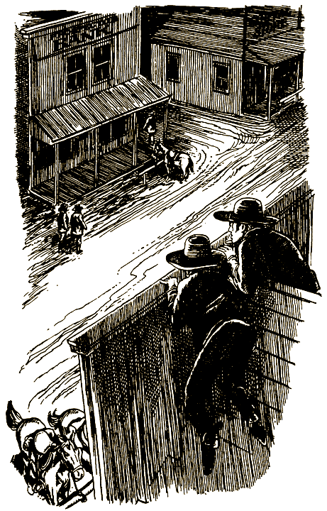
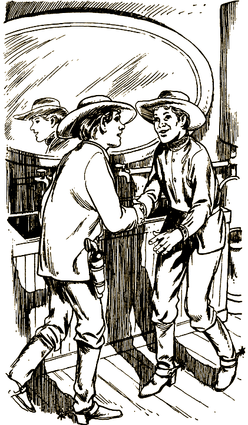

# 0

## Рэмси Монтгомери

# КАНЬОН РАЗБОЙНИКОВ

Это необычная книга. Не пытайся читать ее по порядку с начала до конца, переходя от одной страницы к другой, — ничего не получится! Ведь это игра, где тебя ждет множество приключений. На этот раз ты будешь спасать своего друга от похитителей. Время от времени тебе придется делать выбор. Что принесет он? Успех или поражение?

Твои приключения — результат твоего выбора. Тебе самому решать, куда отправиться, что предпринять. После того как решение принято, следуй указаниям в конце страницы.

Прежде чем что-то решить, хорошенько подумай. Идет 1892 год, и твой друг может оказаться где угодно на бескрайней приграничной территории. Поиски могут увести тебя из шумного портового города Сент-Луиса в безлюдную пустыню под названием Долина Смерти. Спасти друга будет нелегко. На Диком Западе опасностей хватает!

Удачи тебе!

### ОБ АВТОРЕ

Рэмси Монтгомери живет и работает в Аспине, штат Колорадо. Он любит кататься на лыжах и ездить автостопом, еще он обожает читать.

### О ХУДОЖНИКЕ

Рон Уинг — карикатурист и художник, проиллюстрировавший множество книг. Последние несколько лет он делает иллюстрации к юмористической серии Ларри Уайлда «Official», выходящей в издательстве «Бентам». Кроме того, он оформлял многие книги серии «Выбери себе приключение» издательства «Бентам», в том числе: «Horror House», «You Are a Millionaire», «Skateboard Champion», «The Island of Time» и «Vampire Invaders». Сейчас Рон Уинг живет и работает в Бентоне, штат Пенсильвания.

#### [Начать приключение](#1)

# 1

Полночь. Тебя разбудил шум экипажа, въехавшего во двор школы-интерната. Стук конских копыт под окном отдается гулким эхом в увитых плющом стенах школы, которая носит название «Повелитель бурь».

Ты поворачиваешься на другой бочок и снова пытаешься заснуть. Но через минуту слышишь за дверью голос директора, беседующего с кем-то в коридоре. Ну-ка, что он там говорит? «Немедленно… сегодня же ночью… в экипаже…» Только это ты и смог разобрать. Сквозь сон пытаешься понять, с кем он может разговаривать. Каникулы начались еще три дня назад, так что большинство учеников успели разъехаться по домам.

Внезапно раздается громкий стук в дверь.

Ты мигом натягиваешь халат на ночную рубашку и открываешь дверь. В проеме стоит директор школы в полосатой ночной сорочке и шлепанцах из кроличьего меха. В руках зажата свеча, ярко освещающая круглое одутловатое лицо. Густые усы, всегда тщательно ухоженные, обвисли.

— Что случилось? — спрашиваешь ты. — Что-нибудь с дядей?

В 1885 году, когда умерли твои родители, дядя Боб стал твоим опекуном. Он занимается продажей скота, а это требует постоянных разъездов, поэтому два года назад он поместил тебя в школу-интернат. Ты проводишь у него каждое лето, иногда приезжаешь и на каникулы. На этот раз, однако, у дяди Боба оказались неотложные дела в Чикаго, так что тебе пришлось остаться в школе.

Открой страницу [2](#2).

# 2

— С твоим дядей все в порядке, парень. — Из-за спины директора появляется незнакомый мужчина. — Но дело серьезное, и тебе придется поехать со мной.

Заметно, что он говорит с легким акцентом, таким же, как у Нортмонда, твоего соседа по комнате, который уехал в самом начале каникул.

— Но я не могу сейчас связаться с дядей и узнать, можно ли мне покинуть школу, — говоришь ты. Этот незнакомец, кажется, встречался тебе раньше, но ты не можешь вспомнить, кто это такой.

— Я сам переговорю с твоим дядей, — говорит директор. — Считай, что мое разрешение ты получил. А теперь побыстрей собирайся.

Когда ты выходишь во двор, незнакомец уже сидит на козлах.

— Давай же! — поторапливает он. — К утру нам надо быть в Нью-Йорке.

— Но зачем? — спрашиваешь ты.

— Чтобы встретиться с мистером Стоуном, — отвечает он. — Давай, забирайся.

Внутри экипаж выглядит очень элегантно. Залезая, ты замечаешь на дверце герб королевской фамилии Аггар и тут же понимаешь, почему кучер показался тебе знакомым. Именно он привозил Нортмонда в школу в начале семестра.

Открой следующую [страницу](#3).

# 3

Пока экипаж громыхает по булыжной дороге вдоль реки Гудзон, в голове у тебя теснятся тысячи вопросов. За два года, что вы с Нортмондом прожили в одной комнате, вы очень сдружились, и с первых дней знакомства он стал единственным из всех, кто смог понять, насколько ты одинок. И только через несколько месяцев ты узнал, что он принадлежит к королевской фамилии Аггар, его княжество находится в Северной Европе. И тогда-то тебе стало понятно, что, будучи единственным наследником аггарского трона, он тоже чувствует себя в этом мире ужасно одиноко. С того дня вы стали неразлучны.

Эти воспоминания приходят тебе в полудреме. Когда ты просыпаешься, за окном уже светает, экипаж грохочет по широким булыжным мостовым Нью-Йорка. Ты быстро садишься и осматриваешься. Никогда раньше не был ты в этом городе; все вокруг — звуки, запахи, — все для тебя внове, все незнакомо.

Экипаж останавливается у трехэтажного здания из темного камня; на одном из окон золотой краской нарисован какой-то знак. Под ним большими печатными буквами выведено: «СЫСКНОЕ АГЕНТСТВО ПИНКЕРТОНА». Кучер открывает дверь и произносит:

— Прибыли, иди за мной.

Открой страницу [52](#52).

# 4

Если ты решишь последовать за Нортмондом, дружок, ситуация может оказаться достаточно опасной. Куда спокойней обождать, не утихнут ли события. Но ты знаешь, что из-за задержки можно упустить возможность нагнать принца, если его везут на Запад, на неосвоенную территорию.

Если ты решил переждать день-другой, пока восстание утихнет, открой страницу [75](#75).

Если решил пренебречь опасностью и ехать вслед за Нортмондом, перебирайся на страницу [64](#64).

# 5

Вспотевшими от волнения руками ты приставляешь стетоскоп к сейфу и, медленно поворачивая диск, внимательно прислушиваешься к раздающимся щелчкам. Услышав щелчок, отличный от других, ты крутишь диск в обратном направлении. Ты просек, что надо делать; один поворот — и сейф будет открыт. В тот момент, когда ты почти у цели, дверь распахивается и врываются два вооруженных человека.

— Руки вверх! — кричит первый, показывая свой значок. — Вылезай, Бульдог, мы тебя давно ждали.

Еще несколько человек, затаившихся в комнате, вылезают из своих укрытий. Бульдог понимает, что окружен, и поднимает руки, а вслед за ним и Малыш. Все, они сдались.

Ты хлопаешь глазами от изумления и расплываешься в улыбке, когда в комнату входит Нортмонд.

— Но… как… как… — бормочешь ты.

— Считай меня специалистом по побегам, — весело смеясь, говорит он. — Что мне банда какого-то Кэссиди! Подумаешь! Хорошо, что я подоспел вовремя, чтобы спасти тебя!

#### КОНЕЦ

# 7

Ты покупаешь у мальчика газету.

— Сперва надо посмотреть, не вытянем ли мы что-нибудь полезное из этого Таггарта. — Ты указываешь рукой на вывеску, красующуюся на здании на противоположной стороне улицы. — А вот, кажется, и его контора.

В дверях вас встречает человек по имени Дэниэл, объявивший, что он у мистера Таггарта и охранник и секретарь. Вслед за Дэниэлом вы идете в кабинет Таггарта. Эбнер шепотом предлагает притвориться, что вы подумываете купить рудник. Если Таггарт действительно причастен к исчезновению Нортмонда, он не должен ничего заподозрить.

Иди на страницу [68](#68).

# 8

— Что? — Ты потрясен. — Как это — исчез?

— Ходят слухи, что его похитили, — говорит Эбнер. — Его родители, король с королевой, наняли меня искать его. И настаивают, чтобы помогал мне в этом деле именно ты.

— Но как? — спрашиваешь ты. — Я очень хочу помочь, но я ведь не сыщик.

— Вот именно, — говорит Эбнер с улыбкой. — Но они считают, что раз вы близкие друзья и все такое, то ход мыслей у вас примерно одинаковый. Может, они и правы. В любом случае лишняя помощь никогда не повредит.

— С чего же мы начнем? — Ты взволнован, ведь тебе предстоит работать с самым настоящим сыщиком, даже если он и смахивает на библиотекаря.

— Ну, прежде всего я хотел бы задать тебе несколько вопросов, — говорит Эбнер. — Когда ты видел Нортмонда в последний раз?

— Три дня назад, когда начались каникулы.

— Его родители говорят, что он поехал на Запад, — произносит Эбнер.

— Да, он собирался отправиться в Карсон-Сити, — отвечаешь ты. — Нортмонд без ума от Дикого Запада. И хотел увидеть его своими глазами.

— А почему в Карсон-Сити? — интересуется Эбнер.

Переходи на следующую [страницу](#9).

# 9

— Там серебряные рудники. Он собирался встретиться с одним человеком, который занимается рудниками. Кажется, его зовут Таггарт, Корнелиус Таггарт.

Эбнер откидывается на спинку стула.

— Теперь тебе надо отдохнуть. Завтра поедем в Карсон-Сити. А ты не знаешь, Нортмонд переночевал здесь, в городе, или сразу двинулся на Запад?

Ты щелкаешь пальцами.

— Помнится, он говорил мне, что хочет переночевать в гостинице и сесть на первый утренний поезд.

Эбнер подался вперед.

— А он не упоминал название гостиницы?

Открой страницу [36](#36).

# 10

Изабелла пожимает тебе руку и уверяет, что, если вы с Эбнером спуститесь в лагерь бандитов, никакая опасность вам не грозит.

— А как насчет Таггарта? — спрашиваешь ты. — Если он тоже там, то узнает нас и поймет, что мы их обманываем.

Изабелла улыбается.

— Голова у тебя работает. Но Таггарт приезжал, чтобы забрать золото, которое взяли при последнем ограблении банка, и уже уехал. Сейчас он на полдороге к Карсон-Сити.

— А вы знаете что-нибудь о принце Нортмонде? — спрашиваешь ты.

— У Бульдога несколько заложников, но имен их я не знаю. Там есть мальчик примерно твоих лет, — отвечает Изабелла. — Он говорит с легким акцентом. Но сейчас пленников уже нет в ущелье. Он их куда-то перепрятал. Не знаю только, куда.

Вы втроем идете туда, где привязана твоя лошадь, а затем спускаетесь на дно ущелья к большой бревенчатой хижине. Изабелла вводит вас внутрь и представляет Бульдогу Кэссиди как членов банды с Восточного побережья.

— Милости просим. Я всегда рад повидаться с ребятами с Востока, — говорит он, осклабясь.

Открой страницу [84](#84).

# 11

— Вы хотите сказать, что он сейчас на пароходе, следующем в Новый Орлеан? — спрашиваешь ты.

— Похоже на то, — отвечает Эбнер. — С другой стороны, это расписание могло принадлежать кому угодно. Не хочется сломя голову лететь в Новый Орлеан, если Нортмонд на самом деле может быть в Карсон-Сити. — Он глядит на тебя. — Ты знаешь принца лучше, чем кто бы то ни было. Как ты думаешь, куда нам лучше ехать?

Если ты решил искать принца в Новом Орлеане, открой страницу [102](#102).

Если намереваешься ехать в Карсон-Сити, иди на страницу [16](#16).

# 12

Вскоре вы разбиваете лагерь на поляне у ручейка, в тополиной роще. В центре поляны след от костра, угли еще тлеют.

— Готов спорить, прошлой ночью здесь был Таггарт, — замечаешь ты.

— Давай утром первым делом обследуем все вокруг. Если они только что приехали, может быть, они еще не перекрыли все подходы, — говорит Эбнер. Он садится и разворачивает карту. — Мы можем разделиться и направиться к ущелью с разных концов.

Ты киваешь, хотя тебя пугает мысль встретиться с бандитами в одиночку.

На следующее утро, выпив кофе, вы с Эбнером, как и договорились, расходитесь. Он должен заехать с противоположной стороны ущелья, а ты поедешь отсюда.

Через пару часов ты уже почти у цели. Ты останавливаешься за большим валуном и привязываешь лошадь к дереву. Дальше безопаснее двигаться пешком.

Пробираясь по узкой лощине, ты слышишь вдалеке голоса. Замерев на месте, прислушиваешься. Кажется, голоса приближаются. Ты ныряешь в кусты.

Иди на страницу [41](#41).

# 13

Эбнер представляет ей тебя и объясняет, что вы ищете принца. Мадам Загра задумывается.

— Если он и в городе, то я еще ничего о нем не слышала, — говорит она. — Дайте мне время поспрашивать кое-кого. Если зайдете вечером, у меня, возможно, будет для вас что-нибудь новенькое.

— Хорошо, заглянем попозже, — говорит Эбнер, и вы оба выходите на улицу.

— Ну, и что теперь? — спрашиваешь ты.

— Волноваться не стоит. Если кто и может что-нибудь разузнать, так это она.

Эбнер останавливается купить газету у мальчишки-газетчика. Пока мальчишка отсчитывает сдачу, Эбнер добавляет:

— Не так уж и сложно вычислить принца, если он действительно в Новом Орлеане. Со своим произношением он бросается в глаза, как бородавка на носу.

При последних словах Эбнера мальчишка поднимает глаза.

— Вы ищете парня с таким чудным иностранным акцентом? — спрашивает он.

Эбнер кивает, а мальчишка продолжает:

— Мой брат на днях выполнял одно поручение для парня с акцентом; тот сказал, что приехал из страны, про какую мой брат даже не слышал.

— А где сейчас твой брат? — в волнении спрашиваешь ты. Это первый настоящий след!

— Он на пристани, разгружает пароход с Ямайки. Его зовут Уэнтуорт.

Открой страницу [39](#39).

# 14

Ты подкрадываешься к крыльцу, стараясь никому не попасться на глаза. И через несколько минут видишь, что Таггарт выходит из дома. Ты ждешь, пока он скроется из виду, и подбираешься к двери. Дверь заперта, но окно, выходящее на крыльцо, открывается без труда.

Ты пробираешься внутрь и в кухне обнаруживаешь привязанного к стулу Нортмонда. Вид у него несчастный, но едва он замечает тебя, как лицо его расплывается в улыбке.

— Как ты меня нашел? — с изумлением скрашивает он.

— Некогда объяснять. Эти двое могут вернуться в любую минуту.

Ты торопишься отвязать принца.

По дороге он рассказывает тебе:

— Все получилось совершенно не так, как я рассчитывал. Вначале мне казалось, что надо бросить все, к чему я был предназначен по праву рождения, бежать на Дикий Запад и остаться там навсегда. Я думал, что это куда интересней, чем провести всю жизнь в каком-то скучном заплесневелом замке.

Ты вспоминаешь, как ночи напролет вы наперебой убеждали друг друга в прелестях Дикого Запада. Ты киваешь.

— Да, я тебя понимаю.

— Но я и представить не мог, что эти бандиты так безжалостны, — продолжает Нортмонд. — А потом, когда я понял, что надо возвращаться, было уже слишком поздно. Они узнали, что я принц, и решили, что можно хорошо поживиться.

Отправляйся на страницу [34](#34).

# 16

— Если Нортмонд вобьет себе что-нибудь в голову, его уже не остановишь, — говоришь ты. — А ему втемяшилось ехать в Карсон-Сити. Значит, и нам надо туда.

Долгий путь до Карсон-Сити на поезде оказался интересным, хотя и утомительным. Наконец через девять дней путешествие окончено. Все так, как ты и ожидал. Салуны набиты мужчинами — одни празднуют, им повезло с рудником, другие же одеты в лохмотья, потому что их поиски ничего не принесли. Ты наблюдаешь за всем этим, проходя вдоль Главной улицы вместе с Эбнером; вам надо найти контору Корнелиуса Таггарта.

— Бульдога Кэссиди выпустили под залог! Когда его видели в последний раз, он верхом направлялся в Карсон-Сити! — выкрикивает стоящий на углу мальчишка-газетчик главную новость.

— Надо выяснить все про этого Бульдога Кэссиди, — говорит Эбнер, бросая взгляд на заголовок. — Я слышал, в поезде какие-то люди говорили, что его видели по пути сюда с несколькими иностранцами. Возможно, что среди них был и принц.

Открой страницу [7](#7).

# 17

— Именно то, что сказал. Золото Таггарта прибывает с рудников аж из самого Колорадо. Специалист наверняка сможет определить родину любого слитка.

— Вы думаете, он хранит золото, награбленное бандитами вроде шайки Бульдога Кэссиди? — выпаливаешь ты, позабыв, что надо говорить тихо.

— Точно сказать не могу. Посмотрим, что мы сможем выведать у Таггарта завтра утром, когда поедем на рудник. — Эбнер отодвигает стул. — Теперь надо отдохнуть. Завтра наверняка будет тяжелый день.

Едва вы встаете, чтобы уйти, как в салун врывается Дэниэл. Заметив вас, он спешит к вашему столику.

— Очень рад, что застал вас. Мистер Таггарт, к сожалению, не сможет встретиться с вами завтра. Его вызвали из города по каким-то важным делам.

— По каким же, например? — спрашиваешь ты, разозлившись, что Таггарт уехал.

— Понятия не имею. Он редко говорит со мной о своих делах, — отвечает Дэниэл, явно нервничая.

Трудно в это поверить. Ты пытаешься решить, может ли быть какая-нибудь польза от Дэниэла в розысках твоего друга — или по крайней мере в поисках Таггарта.

Если ты решил последовать за Дэниэлом в надежде узнать что-нибудь о принце, открой страницу [32](#32).

Если будешь просить Дэниэла помочь найти Таггарта, открой страницу [35](#35).

# 18

Над городом повисла тишина, все ждут, когда появятся бандиты. Ты опасаешься, что это безмолвие может насторожить Бульдога, поэтому спускаешься в салун и говоришь буфетчику, что надо расшевелить народ. Вернувшись на крышу, ты слышишь, как заиграла фисгармония, зашумели игроки в карты, завязалась драка — вечер в салуне пошел своим чередом.

— Смотрите, — шепчешь ты Эбнеру, — тот человек, который сейчас въезжает в город на лошади, — это один из дозорных, которых мы видели вчера ночью.

Эбнер пригибается и велит тебе сделать то же самое.

— Осторожно. Если спугнем его, нам никогда не найти принца.

Вы наблюдаете за появлением Бульдога Кэссиди. Он привязывает лошадь и заходит в банк с заднего крыльца. Изабелла стоит на страже у главного входа. Внезапно раздается пронзительный свисток шерифа, и на улицу высыпают вооруженные люди, готовые схватить Бульдога и его дружков. Твое внимание привлекает какое-то движение у здания банка.

— Смотрите! Бульдог ускользнул через боковую дверь! — кричишь ты Изабелле.

Бульдог бежит через улицу и карабкается по лестнице на крышу соседнего дома.

Открой страницу [72](#72).

# 20

Жуткая головная боль означает, что к тебе возвращается сознание. Ты открываешь глаза и видишь, что ты накрепко привязан к четырем столбам, вкопанным глубоко в землю. Вокруг расстилается пустынная равнина.

Солнце палит нещадно. Ты пробуешь звать на помощь, но пересохшее горло отказывает тебе. Да и все равно вокруг никого нет. В конце концов, не в силах более переносить слепящее солнце, ты закрываешь глаза — навсегда.

#### КОНЕЦ

# 21

Позже ты едешь верхом следом за Эбнером и задыхаешься от пыли, которую его лошадь вздымает на сухой тропе. Это все равно что глотать комья грязи.

— Если ущелье как следует охраняют, проникнуть в него почти невозможно, — говорит Эбнер. — Нужно что-то придумать.

— Может, они пропустят нас, если будут считать, что мы тоже бандиты, — предполагаешь ты.

Эта мысль тебе нравится. Тебе всегда хотелось испытать, что значит быть жестоким и беспощадным преступником.

— Вообще-то они не склонны сразу верить незнакомцам. Надо сочинить хорошую легенду, — говорит Эбнер с сомнением.

— Тогда давайте заночуем и выспимся, может, утром что-нибудь придет в голову.

Иди на страницу [12](#12).

# 22

Если Уэнтуорт прав и Нортмонд отправился в Сент-Луис, то это единственная возможность перехватить его. Дожидаться же, чтобы переговорить с мадам Загра, — только пустая трата драгоценного времени. Вы с Эбнером отправляетесь в путь на «Королеве Каюн». Плыть по Миссисипи на колесном пароходе — это совершенно не похоже на все то, что тебе приходилось испытывать раньше. Река спокойная, глубокая и широкая, а ход очень плавный.

# 23

Оставив позади болота и топи Луизианы, вы двигаетесь к Сент-Луису.

Путешествие быстро подходит к концу. Когда вы сходите на берег, Эбнер говорит:

— Надо купить кое-какое снаряжение. Скорее всего, придется в ближайшие же дни ехать на Запад.

Открой следующую [страницу](#24).

# 24

— Что вы хотите сказать? — спрашиваешь ты.

— Сент-Луис — один из основных пунктов, откуда начинается путь на Запад, — поясняет Эбнер. — Судя по количеству багажа, которое описал Уэнтуорт, голову даю на отсечение, что именно в этом направлении двинулся Нортмонд со своими новыми приятелями.

Путаясь в лабиринте улиц, вы с Эбнером выходите наконец к большому рынку, где отовариваются фермеры, ковбои и скотоводы. Здесь продается все, что только можно себе представить, начиная со шляп и модных часов и кончая оружием.

— Помни, все, что ты купишь, придется везти твоей лошади. Бери только самое необходимое, — предупреждает Эбнер.

— Мне нужна только пара сапог, шляпа и несколько одеял, — говоришь ты, примеряя широкополую шляпу. А сам думаешь: «Вот ребята подивятся, когда я вернусь в школу!»

Следующий пункт — лошади, ими торгуют в пригороде. Добираться туда не так уж и долго.

— Я беру Аппалуза, — объявляешь ты Эбнеру. — Хозяин говорит, что это сильный и резвый конь.

Иди на страницу [44](#44).

# 25

Нортмонд и человек в шляпе заходят в другую гостиницу. Ты пробуешь проскользнуть следом, но тебя хватает за плечо швейцар.

— Куда это ты лезешь? — грубо спрашивает он.

— Мне надо поговорить с этими людьми! — отвечаешь ты.

— Ты у меня сейчас поговоришь с управляющим, если сию же минуту не уберешься отсюда и не прекратишь приставать к постояльцам, — рявкает он, выпихивая тебя на улицу.

Ты прислоняешься к стене, не зная, что делать дальше. Можно попытаться еще раз пробраться в гостиницу и найти Нортмонда. Но, может быть, лучше разыскать Эбнера? Его удостоверение сыщика может убедить управляющего гостиницы дать вам возможность переговорить с Нортмонд ом.

Если ты, решил пробраться в гостиницу, иди на страницу [46](#46).

Если будешь искать Эбнера, иди на страницу [74](#74).

# 26

Ты, Изабелла, Эбнер и большинство остальных идете в салун напротив банка «Старатель». Вы наблюдаете, как Кэссиди с Малышом вразвалку входят в банк. Несколько минут ровно ничего не происходит. Потом вы видите, что Малыш выходит на улицу. Он спешит в салун.

— Бульдог ждет твоей помощи, — объявляет он, указывая на тебя.

Ты проглатываешь слюну, встаешь и идешь за ним. Ты мучительно думаешь, как бы обвести его вокруг пальца, и надеешься на лучшее.

Малыш ведет тебя через улицу в банк, где дожидается Кэссиди. Поздоровавшись, ты окидываешь взглядом сейф. Он просто огромный — одна дверь чуть не три метра на три.

— Ну, — говорит Бульдог, вручая тебе стетоскоп, — делай свое дело, парень.

Открой страницу [5](#5).

# 28

— Прости, что разбудил, — говорит вождь, когда ты входишь к нему. — Но мне кажется, стоит попытаться выбраться отсюда именно сейчас. Разведчики доложили, что ваши преследователи спустились к каньонам Рио-Гранде и ищут вас там. Дорога на север свободна.

— Прекрасно. Выезжаем сразу, как сможем.

— Желаю удачи. Один из моих лучших разведчиков, Летящий Камень, проводит вас до Колорадо. Если нужно еще что-нибудь, скажи.

— Нужна еще одна лошадь, — отвечаешь ты.

— Ну, это пожалуйста. Берите любую.

Требуется не много времени, чтобы разбудить остальных и подготовиться к отъезду. Летящий Камень выводит вас из деревни через потайной ход, о котором знают всего несколько человек. Лунный свет придает горам какую-то зловещую красоту. Несколько минут спустя вы въезжаете в сосновый бор, расстилающийся по склонам Сангре-де-Кристо.

— Кажется, мы не очень далеко от ранчо Уолкина? — спрашиваешь ты у Летящего Камня.

— Будь мы птицами, было бы недалеко. Ну, а раз летать мы не умеем, то это далековато, ведь нас разделяют горы, — отвечает он.

Иди на страницу [110](#110).

# 29

Высадившись в Канзас-Сити, вы, не тратя времени даром, спрашиваете про местные дилижансы. Газетчик показывает на запыленное окно на втором этаже какого-то дома, где красуется вывеска «ДИЛИЖАНСЫ АБНЕРА». Вы с Эбнером по скрипучей лестнице поднимаетесь в контору. Ты нерешительно стучишься. Женский голос приглашает вас войти.

В помещении тесно, всюду навалены бумаги и карты. За старым деревянным бюро сидит блондинка средних лет. Из-за перегородки доносятся голоса двух спорящих мужчин.

— Клянусь, Абнер, ты обещал мне верхового для почты. Ты подводишь меня уже в третий раз за этот месяц.

— Ну что я могу поделать, Морт, если Джимми опять заболел! Мне самому нелегко разобраться без него с двумя моими дилижансами. В полдень мне надо отправлять рейс в Атчисон. Извини, на этот раз ничем не могу помочь.

Дверь распахивается, и в контору влетает темноволосый небритый коротышка. Он замечает вас с Эбнером и останавливается, буравя вас хмурым взглядом.

— Эй! Умеешь держаться на лошади?

Ты тупо смотришь на него, потом догадываешься, что он обращается к тебе.

— Я… я…

Эбнер делает шаг вперед.

— Мы пришли за билетами в Атчисон, — решительно говорит он.

Иди на страницу [62](#62).

# 31

Уэнтуорт сообщил полезные сведения, но какой смысл бросаться на пароход, если Нортмонд все-таки находится в Новом Орлеане? Весь день вы расспрашиваете всех, кого можете, но никаких других следов не находите. Вечером вы с Эбнером возвращаетесь к мадам Загра.

Предсказательница занята с посетителем, но вот наконец он уходит, и она принимает вас.

— Ваш Нортмонд уехал с какими-то сомнительными личностями, — говорит мадам Загра. — Никто не мог мне сказать, кто они такие. Сели на пароход, плывущий вверх по Миссисипи, но никто не знает, куда они направляются. Это все, что я могу вам сообщить.

Эбнер благодарит ее за помощь, и вы уходите.

— Похоже, Нортмонд впутался в серьезную историю, — говорит Эбнер. — Кое-кто здесь очень подозрительно молчит. Чувствую, что пахнет жареным.

Открой страницу [108](#108).

# 32

Пока Дэниэл идет к выходу, ты посвящаешь в свои планы Эбнера.

— Если я пойду за Дэниэлом, он может навести меня на след Нортмонда, — говоришь ты.

Вы с Эбнером договариваетесь встретиться в салуне перед закрытием.

Ты вовремя подбегаешь к двери и успеваешь заметить, как Дэниэл сворачивает за угол. Следуя за ним на небольшом расстоянии, ты проходишь через весь город до какого-то дома, на котором висит объявление: «СДАЮТСЯ КОМНАТЫ».

Дэниэл заходит внутрь, а ты подкрадываешься к дому и заглядываешь в окно на первом этаже. Перед тобой всего-навсего пустая гостиная. Ты собираешься обогнуть дом, но в этот момент входная дверь отворяется и до тебя доносится голос Дэниэла:

— Если понадоблюсь, то я дома. Я не в восторге от того, что вы затеваете, но все, что могу, сделаю.

Дэниэл, должно быть, стоит перед входом и не виден тебе. С кем он говорит, ты тоже не видишь. Но в ответной реплике ты узнаешь тягучий говор Таггарта:

— Зачем тебе знать, а тем более понимать, в чем тут дело, Дэниэл? Деньги — вот что важно.

Открой страницу [14](#14).

# 33

— Почему почти неприступно? — спрашиваешь ты Эбнера.

— Потому что ущелье — это пропасть с отвесными и гладкими стенами. По ним очень трудно спуститься. А здесь это вообще практически невозможно, поэтому бандиты и устроили там свое логово. Судя по всему, Таггарт действительно задумал недоброе.

Ты поворачиваешься к Дэниэлу, наблюдающему, как вы обыскиваете контору.

— А не мог Таггарт поехать в Скорпионово ущелье?

Дэниэл, который, кажется, все еще нервничает, признается, что Таггарт действительно ездил туда когда-то встречаться со своими нечистыми на руку дружками.

— Эбнер, похоже, мы сделали огромную ошибку: Нортмонд наверняка там. Нам надо двигаться туда.

Но Эбнер уже за дверью, он направляется к конюшне на противоположной стороне улицы.

Иди на страницу [21](#21).

# 34

Эбнер очень рад встретить в салуне вас обоих. Ты знакомишь его с Нортмондом, и вы втроем идете на ближайший телеграф сообщить радостное известие родителям Нортмонда. А затем, решив, что Диким Западом вы сыты по горло, вы с принцем возвращаетесь в школу.

#### КОНЕЦ

# 35

Интересно, почему Дэниэл так нервничает? Может, он не одобряет то, чем занимается его хозяин? Тогда не исключено, что он захочет помочь вам.

Эбнер открывает бумажник и показывает удостоверение сыщика.

— Пойдешь с нами, — твердо говорит он Дэниэлу. — Мы хотим знать, почему Таггарт покинул город.

При виде удостоверения Дэниэл бледнеет.

— Хо-хозяин никогда ничего мне не рассказывает, — заикаясь, говорит он. — Честное слово, я понятия не имею, что он задумал.

— Так подумай теперь, — напирает Эбнер. — Ты проводишь достаточно времени с этим человеком и давно мог догадаться, чем он занимается, даже если он ничего не объясняет. Не встречался ли он в последнее время с юношей по имени Нортмонд?

Дэниэл, похоже, напуган.

— Я не знаю, что там у них происходит. Могу сказать только, что Таггарт связан с какими-то темными личностями. Я стараюсь держаться от них подальше.

Открой страницу [60](#60).

# 36

— Упоминал, — отвечаешь ты. — Она называется «Парк-Отель».

— Судя по названию, место подходящее для принца, — говорит Эбнер. — Идем.

«Парк-Отель» — великолепное шестиэтажное здание из кирпича и мрамора. Главный вход — со стороны Центрального парка. Над входом простер крылья мраморный ангел, и все, кто входит в отель, минуют эту импровизированную арку из крыльев.

— Извините, — говорит служащий у стойки. — Мы не имеем права сообщать что-либо о своих постояльцах.

Эбнер показывает свое удостоверение.

— Королевская семья очень обеспокоена пропажей наследника. А ваша гостиница последнее место, где он останавливался до того, как исчез. Нам очень важно осмотреть его комнату.

Служащий заглядывает в большую регистрационную книгу.

— Он останавливался здесь на ночь три дня назад. Номер после этого, естественно, убирали, но, если хотите, можете взглянуть.

Служащий вызывает портье, тот проводит вас в номер. Эбнер ищет под кроватью и осматривает стенной шкаф, а ты тем временем обшариваешь письменный стол и тумбочку. Ничего подозрительного.

Тебе приходит в голову осмотреть мусорную корзину, и ты замечаешь между прутьями конверт. Ты вытаскиваешь его и открываешь. Внутри расписание пароходов, отправляющихся из Нью-Йорка в Новый Орлеан.

Эбнер берет у тебя находку и говорит:

— Если принца похитили, возможно, что он оставил это как подсказку, где его искать.

Иди на страницу [11](#11).

# 38

— Руки вверх и выходите! — кричит один из бандитов. — Не будете дурить, никому вреда не причиним.

Из дилижанса раздается выстрел, и один из всадников, схватившись за грудь, падает на землю. Ты соскальзываешь с козел и успеваешь забраться под экипаж за секунду до того, как бандиты открывают огонь. Вскоре стрельба из дилижанса прекращается.

— Эй, там, внизу! Вылезай и руки вверх!

Ты выбираешься из своего укрытия. Бандитов осталось только трое — остальные валяются на земле мертвые, рядом с ними лежит кучер. Они открывают дверь дилижанса, а ты от всей души надеешься, что Эбнер не пострадал от пальбы. Но внутри никакого движения.

— Выгружайте золото, — кричит главарь. Потом поворачивается к тебе. — Вы только что уложили четверых моих лучших людей и, кстати, моего брата. Ты за это заплатишь.

Он хватает тебя за руку, ударяет по голове пистолетом, и ты теряешь сознание.

Иди на страницу [20](#20).

# 39

Вы с Эбнером тут же возвращаетесь на пристань. Находите Уэнтуорта, который рассказывает вам, что день назад здесь был какой-то иностранец твоего возраста и с ним какие-то люди. Они собирались подняться на пароходе вверх по реке до Сент-Луиса.

— Честно говоря, эти люди мне не понравились, — добавляет Уэнтуорт. — И непонятно, что там у них в чемоданах — тяжесть жуткая. Хотя заплатили они неплохо.

Как же быть? Может, стоит подождать и поговорить с мадам Загра? Эбнер очень рассчитывает на нее, к тому же вы совсем не уверены, что молодой человек, которого видел Уэнтуорт, действительно Нортмонд. С другой стороны, если это в самом деле был Нортмонд, значит, его уже нет в городе. Тогда нужно спешить за ним, не откладывая.

Если ты решил сесть на следующий пароход, идущий вверх по реке, открой страницу [22](#22).

Если решил обождать и еще раз поговорить с мадам Загра, открой страницу [31](#31).

# 41

Внезапно ты слышишь, как Эбнер окликает тебя. Ты с удивлением выходишь из укрытия и видишь, что он едет по тропинке рядом с симпатичной рыжеволосой женщиной на красивой белой лошади.

— Выходи, все спокойно, — говорит Эбнер, увидев тебя. Он улыбается. — Мы нашли замечательного помощника, дружок.

Ты в недоумении смотришь на него. Эбнер не перестает тебя удивлять.

— Нет сомнений, что бандиты, которых мы преследуем, — члены банды Бульдога Кэссиди. Здесь оказалась Изабелла Чейз, мой старый друг и отличный сыщик. Она тоже следила за бандой, и в конце концов ей удалось добиться, что они приняли ее за свою. Она намерена представить нас Бульдогу, сказав, что мы члены ее прежней шайки.

Иди на страницу [10](#10).

# 42

Место, которое шериф выбрал для засады, — у самого входа в небольшой каньон. Через него проходит дорога из Санта-Фе. Шериф набрал группу добровольцев в двенадцать человек. Они залегли по обоим склонам каньона. Братьям Уолкин теперь не уйти.

— Сюда прибудет ваш гонец и предупредит, что братья выехали из города, так ведь? — спрашиваешь ты шерифа.

— Да. Они должны выехать сейчас, — отвечает шериф, взглянув на карманные часы.

Вы ждете, вас нещадно жжет полуденное солнце. Никакого гонца не видно, и ты начинаешь беспокоиться. Шериф не сомневался, что братья Уолкин поедут из города именно этой дорогой.

— Съезжу в город, узнаю, что там такое, — наконец говорит Эбнер.

Через несколько минут он снова появляется на дороге.

— Почему вы вернулись? Забыли что-нибудь? — спрашиваешь ты, когда он подъезжает к тебе.

— Я встретил гонца. Поехали со мной.

Иди на страницу [86](#86).

# 43

Ты считаешь, что надо заставить Бульдога Кэссиди поверить вам, только так можно спасти Нортмонда.

— Придется выпотрошить этот банк, — мрачно говоришь ты. Все согласно кивают.

В этот же вечер вы со всей бандой отправляетесь в Лас-Вегас. Перед отъездом Бульдог собирает вас и объясняет план действий. В банк зайдут только он и его кореш, известный под кличкой Малыш. Если будут какие-нибудь трудности с сейфом, позовут тебя. Все остальные либо останутся на стреме, либо будут отвлекать внимание.

— Бульдог говорил, куда мы поедем после ограбления? — спрашиваешь ты Изабеллу по дороге.

— Скажет, но только когда все будет сделано. Чтобы, если кого-нибудь схватят, он ничего не мог бы рассказать.

— Может, нам стоит договориться, где встретимся мы трое? — предлагаешь ты.

— За Вегасом есть местечко под названием Рэд-Рокс. Можно встретиться там, — говорит Изабелла и уезжает вперед, чтобы сообщить это Эбнеру.

В нескольких милях от города Бульдог собирает всех и дает последние указания.

— Я послал вперед парочку наших людей, чтобы они там отвлекли внимание. Пожар, который они устроят, займет на некоторое время полицию, так что банк будет для нас практически открыт.

Ты начинаешь здорово нервничать. Что, если Бульдогу потребуется помощь, чтобы вскрыть сейф?

Открой страницу [26](#26).

# 44

— Отлично, — говорит Эбнер, окинув взглядом твою лошадь. Сам он выбрал высокого гнедого жеребца.

Вы с Эбнером уже на полпути к городу, когда ты вспоминаешь, что забыл купить охотничий нож.

— Можешь вернуться на рынок за ножом, а я пока расспрошу, не видел ли кто-нибудь Нортмонда, — предлагает Эбнер. — Еще есть какая-то надежда, что он в городе.

Вы договариваетесь встретиться в гостинице. Эбнер уезжает и уводит с собой вторую лошадь. Ты спешишь на рынок.

Тебе не требуется много времени, чтобы выбрать красивый нож с рукояткой из лосиного рога. Выходя с рынка, ты внезапно замечаешь Нортмонда, который идет с каким-то человеком в черной шляпе!

— Нортмонд! Подожди! — кричишь ты во все горло.

Но он не останавливается. Очевидно, ему не слышно тебя из-за шума толпы.

Ты замечаешь, что человек рядом с Нортмондом крепко держит молодого принца за руку. Похоже, подтверждаются ваши худшие подозрения — Нортмонда похитили и держат в плену! Нужно действовать очень осторожно. Ты должен устроить своему другу побег, причем без риска для его жизни.

Ты решаешь следовать за Нортмондом и его стражем. Ты идешь за ними по шумной центральной улице и оказываешься в двух шагах от гостиницы, где остановились вы с Эбнером.

Открой страницу [25](#25).

# 45

Шериф смотрит на него и говорит:

— Мы допрашивали этих ребят всю ночь и большего ничего не смогли добиться. Последний раз Бульдога Кэссиди видели, когда он выезжал из города в западном направлении. Дорога, по которой он ехал, разветвляется: одна идет на север, в Сан-Франциско, другая на юг, к Лос-Анджелесу. Кто знает, куда он двинулся.

Эбнер поворачивается к тебе.

— А ты что думаешь?

Если ты выбираешь дорогу на Лос-Анджелес, иди на страницу [100](#100).

Если предпочитаешь дорогу на Сан-Франциско, открой страницу [76](#76).

# 46

Ты ищешь способ пробраться в гостиницу, минуя швейцара. Обходишь здание сзади. Вот удача! У задней стены растет высокое дерево. Ты карабкаешься по стволу, заглядывая в окна. Все комнаты на первых трех этажах пустые, и ты начинаешь беспокоиться. Гостиница восьмиэтажная, а дерево достает только до пятого этажа.

Страхи рассеиваются, когда ты добираешься до четвертого этажа и, заглянув в окно, видишь Нортмонда. Кроме него, в комнате никого нет. Он привязан к стулу у кровати, во рту у него кляп. Ты осторожно подползаешь по самой толстой ветке к окну. Какая досада, оно заперто!

Ты вытаскиваешь из-за пояса свой новый нож и пытаешься справиться с запором. Нортмонд следит за тобой с надеждой в глазах. Наконец окно открыто, ты проскальзываешь в комнату и быстро освобождаешь Нортмонда.

— Как ты тут оказался? — выпаливает он, избавившись от кляпа.

— Некогда объяснять. Бежим.

Открой страницу [73](#73).

# 48

Ты бежишь со всех ног, надеясь остановить замеченного тобой человека, прежде чем он поднимет тревогу. Из тумана выступает большой дом. Приблизившись, ты слышишь громкий звон колокола.

— Эбнер, быстрее в кусты.

Но Эбнера нигде не видно. Ты ждешь, затаив дыхание.

Из дома слышится голос:

— Кто-то только что прыгнул в кусты, вон там!

Ты не успеваешь шевельнуться, как тебя окружают трое мужчин с ружьями.

— Пойдешь с нами, — приказывает один, ткнув дулом тебе в живот.

Внезапно из лесу высыпают полицейские и приказывают этим людям бросить оружие.

— Вам не убежать, все пути перекрыты. Ведите нас к Бульдогу Кэссиди, — говоришь ты.

— Вы опоздали, — смеется один из бандитов. — Можете сами убедиться.

Ты заходишь в дом. Он пуст. Тот человек не соврал — Бульдог действительно улизнул. Однако, заглянув в спальню, ты видишь, что в углу сидит Нортмонд, руки и ноги у него связаны, во рту кляп. Вы несказанно рады друг другу. На обратном пути Нортмонд описывает свое ужасное приключение. Он ждет не дождется, когда вернется в школу — Диким Западом он сыт по горло.

#### КОНЕЦ

# 49

— Выстрелы стихли, — говорит Нортмонд. — Наверное, они вернулись за лошадями. Какое-то время у нас есть.

— Хорошо, — слабым голосом отвечаешь ты. — Едем в салун «Сингалонг». Там нас ждет Эбнер. Он считал, что слишком опасно… — У тебя пресекается голос.

Стук копыт и мерный бег лошади укачивают тебя; как в тумане ты ощущаешь, что руки Нортмонда не дают тебе упасть. Ты еще думаешь о том, как вам спастись, но это заботит тебя все меньше и меньше. Ты считаешь, что теперь обо всем должен думать Нортмонд. Голова твоя падает, а душа устремляется куда-то — чтобы никогда больше не вернуться в этот мир.

#### КОНЕЦ

# 50

— Эбнер, нам никогда не догнать этот пароход. Давайте поплывем на барже.

— Ладно, — говорит Эбнер.

Он бы никогда на такое не согласился, но ты понимаешь, что он устал от верховой езды не меньше тебя.

Баржа движется еле-еле, и удобств на ней гораздо меньше, чем на том пароходе, которым вы плыли из Нового Орлеана в Сент-Луис, но все-таки это куда лучше, чем трястись в седле. Через четыре дня вы будете в Бисмарке, штат Северная Дакота. Почти тогда же, когда туда прибудет и Нортмонд, ведь его пароход останавливается в каждом городишке.

— Как вы думаете, что они собираются делать? — спрашиваешь ты Эбнера.

— Голову даю на отсечение, раз уж человек забрался так далеко вверх по реке, единственное, что ему остается, — это ехать верхом на Запад к побережью Тихого океана, если только он не думает вернуться обратно на Восток.

Бисмарк — шумный речной порт. Ваша баржа причаливает позади парохода, собирающегося отплыть с грузом вниз по реке.

Открой страницу [70](#70).

# 51

— Не будем останавливаться до захода солнца, а вечером сделаем привал, — говорит Эбнер, пуская лошадь в галоп.

В сумерках, отмахав Бог знает сколько километров, вы разбиваете лагерь на берегу чистой прохладной речушки. Проглатываете обед, приготовленный на скорую руку, и уже через минуту засыпаете мертвым сном, завернувшись в одеяла.

Иди на страницу [67](#67).

# 52

Следом за кучером ты входишь в просторную контору. Повсюду — на полках, на стульях, на полу — грудами навалены книги. На стенах снимки солдат времен войны между южными и северными штатами.

Кучер снимает шляпу и кивает в сторону человека, сидящего за откидным столиком бюро, и говорит:

— Это мистер Эбнер Стоун. Он тебе все объяснит.

Кучер уходит, и ты слышишь, как отъезжает экипаж.

Человек за столом поворачивается к тебе.

— Так, значит, это ты живешь с Нортмондом в одной комнате, — говорит он и протягивает руку. — Можешь называть меня Эбнер. Будем работать вместе.

Он в очках, высокий и сутулый. И если бы не рваный белый шрам ото лба к щеке, Эбнер Стоун был бы совсем не похож на сыщика. Его, скорее, можно принять за библиотекаря, пострадавшего во время дуэли.

— Не самая приятная ночь, — говоришь ты. — Вы не объясните мне, в чем дело?

— Ну, конечно, садись. — Эбнер сбрасывает книги со стула. — Похоже, что твой друг Нортмонд, принц Аггарский, бесследно исчез.

Иди на страницу [8](#8).

# 54

— Ты и представить себе не можешь, сколько золота награбил Бульдог Кэссиди в их дилижансах за все эти годы. Они жаждут засадить его за решетку ничуть не меньше, чем мы с тобой хотим найти Нортмонда.

Идея Эбнера неплоха. Чем больше у вас будет людей, тем лучше. Наконец вы в Окленде, штат Калифорния. Перебравшись оттуда на пароме в Сан-Франциско, вы направляетесь прямо в контору «Уэллз Фарго». Эбнер когда-то работал на эту компанию, поэтому ему без труда удается добиться встречи с высшим начальством.

— Мы слышали, что вы направляетесь в наши места, — говорит Блейк Картер, начальник службы охраны, пожимая вам руки. — Как я понимаю, вы ищете пропавшего принца.

— Да, сэр. Мы пытаемся найти принца Аггарского, который, по слухам, попал в лапы Бульдога Кэссиди и его дружков, — отвечаешь ты.

— Одна зацепка у нас есть. Прошлой ночью Бульдога видели на пристани. Наш человек шел за ним по пятам, но потом все-таки потерял его, — говорит Блейк. — Сейчас покажу на карте, где это случилось.

Час спустя в поисках Батлера Армстронга, сыщика, который следил за Бульдогом, вы заходите в большой портовый пакгауз. Ночной сторож сообщает, что Батлер сидит в баре «Звезды и парус» за углом.

Открой страницу [79](#79).

# 55

Дилижанс в Атчисон отправляется в полдень. Вместе с вами едут еще два пассажира — бизнесмен с женой. Большой пакет из грубой оберточной бумаги занимает почти все место на полу, и бизнесмен не сводит с него глаз. Ты взбираешься на козлы к кучеру, а Эбнер остается с пассажирами. Кучер говорит, что проехать надо километров шестьдесят. На ночь вы остановитесь в придорожной гостинице, а завтра утром будете в Атчисоне.

Открой следующую [страницу](#56).

# 56

На гостиничный двор въезжаете уже в сумерках. Лошадей отводят на конюшню, а вы наслаждаетесь скромным ужином — супом и хлебом. Ты счастлив, что в первый раз за целую неделю будешь спать на суше. Утром ты просыпаешься полный сил, готовый к новым приключениям.

# 57

Но, отъехав от гостиницы всего несколько километров, кучер вдруг резко натягивает поводья. Лошади останавливаются как вкопанные. Путь вам перегородили семеро всадников. В руках у них револьверы, а лица повязаны платками.

Открой страницу [38](#38).

# 58

На рассвете вы с Эбнером выезжаете из города искать место, где можно укрыться в засаде и ждать, когда на дороге появятся братья Уолкин. Дорога идет вдоль реки, вьющейся по дну каньона. Вы решаете ждать наверху, оттуда легче наблюдать за всадниками.

— Хорошо, если это та дорога, — говорит Эбнер, уставясь в бинокль.

— Нортмонд сказал, что ранчо Уолкинов возле Таоса. Это единственная дорога туда, — отвечаешь ты.

— Вот они, — говорит Эбнер и передает тебе бинокль. — Который из них Нортмонд?

— Второй от конца, — отвечаешь ты.

— Отлично. Это облегчает дело, — говорит Эбнер, вскакивая на лошадь. — Вперед!

Следовать за всадниками не сложно. Последние несколько месяцев почти не было дождей, и лошади поднимают облако пыли, которое видно издалека.

Открой страницу [93](#93).

# 59

— Нет-нет, — торопливо отвечаешь ты. — Может, я чего-то не знаю?

— Опасная публика, — бормочет старик. — Я бы на твоем месте не путался с ними. Странные дела творятся в этой семье.

Ты хочешь расспросить поподробней, но твой собеседник быстро допивает и выходит из-за стола. Ты понимаешь, что от него больше ничего не добьешься.

Ночью тебе не спится. В полночь ты вскакиваешь, оставляешь под подушкой конверт с деньгами за комнату и выводишь лошадь из стойла. Ты гонишь во весь опор и на восходе подъезжаешь к ферме Уолкинов. Спешившись, ты привязываешь лошадь в стороне и крадешься к дому. Изнутри доносятся голоса.

— Поезд из Атчисона уходит сегодня в полдень. Беспокоиться не о чем. Мальчишка больше не будет путаться под ногами — завтра днем он приедет в Санта-Фе, а там его встретит Джонни. Никому и в голову не придет искать его там.

— А все-таки зря ты так рискуешь, — отзывается женский голос. — От этих твоих кузенов с юга одни неприятности.

У тебя нет ни малейших сомнений, о каком «мальчишке» идет речь. Ты быстро крадешься обратно к лошади, мчишься на вокзал в Топеке и телеграфируешь Эбнеру на конечную станцию дилижанса, чтобы он перехватил дневной поезд на Санта-Фе.

Открой страницу [81](#81).

# 60

— Ладно, Дэниэл, веди нас в контору Таггарта. Если ты ничего не знаешь, мы сами посмотрим бумаги, может, найдем что-нибудь, — говорит Эбнер.

Дэниэл, кажется, пугается еще больше, однако кивает в ответ. По дороге, после долгого сопротивления, он наконец признается, что несколько дней назад в контору Таггарта действительно заходил молодой иностранец и что кое-кому из его сомнительных дружков было об этом известно.

— А они не могли его похитить? — спрашиваешь ты.

Дэниэл пожимает плечами. Ты убеждаешься, что вы на верном пути. Надо искать Таггарта.

Вы уже несколько часов роетесь в бумагах Таггарта, но ничего интересного не попадается. Ты с досады топаешь ногой и случайно задеваешь край ковра. Наклонившись поправить его, ты замечаешь маленькую, но подозрительно ровную щель в полу.

— Эбнер, дайте мне нож. Кажется, я что-то нашел.

Приподняв ножом доску, ты обнаруживаешь тайник с бумагами и картами. Хотя в этих бумагах не упоминаются никакие имена, из них явствует, что Таггарт хранит деньги, принадлежащие банде преступников.

— Эй, посмотри-ка сюда! — восклицает Эбнер, указывая на одну из карт. — Это Скорпионово ущелье. Знаменитое бандитское логово — оно почти неприступно.

Открой страницу [33](#33).

# 62

Коротышка не сводит с тебя глаз. По правде сказать, его вопрос тебя заинтересовал. Ты отлично ездишь верхом, а после утомительного путешествия на пароходе совсем не прочь немного размяться.

— Надо доставить кое-что в Топеку к завтрашнему дню. Если берешься, тебе дадут там свежую лошадь, и ты сможешь через день встретиться со своим другом в Атчисоне. Обещаю, что не пожалеешь.

Видно, этот человек в отчаянном положении. Но Эбнеру затея не нравится.

— А что надо везти? — спрашиваешь ты.

— Всего-навсего бумаги, — отвечает коротышка. Похоже, он забеспокоился. — Ничего опасного, никаких тяжестей, клянусь. Их надо передать одному человеку, его зовут Питер Уолкин. У него ферма совсем недалеко от города.

При упоминании имени адресата твои глаза округляются. Теперь и Эбнер, кажется, заинтересовался, хотя не подает виду.

— Решай сам, — говорит он.

То, что Уолкин живет там, где проезжали похитители Нортмонда, не может быть простым совпадением. Вероятно, стоит рискнуть в надежде, что это поручение наведет тебя на след твоего друга. Или лучше поехать с Эбнером и разузнать все как следует в Атчисоне?

Если ты решил взяться за поручение и ехать в Топеку, открой страницу [91](#91).

Если вы с Эбнером едете в Атчисон дилижансом, открой страницу [55](#55).

# 63

— Может, лучше попробовать вытащить тебя ночью? — спрашиваешь ты.

Твой друг пожимает плечами.

— И то и другое опасно. Но что-то надо делать. Я чувствую, меня скоро убьют.

Нужно принимать решение — если Нортмонд слишком задержится в туалете, у охранников могут возникнуть подозрения.

Если ты решил попытаться устроить утром засаду, иди на страницу [92](#92).

Если будешь пробовать вытащить Нортмонда ночью, иди на страницу [104](#104).

# 64

Тебя пугает индейское восстание, но ты считаешь, что найти Нортмонда все равно гораздо важнее.

— Мы ведь поедем в другую сторону, не туда, где индейцы, правда? — в пятый раз переспрашиваешь ты Эбнера.

— Не о чем беспокоиться, — уверяет тебя Эбнер. — Я знаком с вождем. Несколько лет назад мы попали с ним в горах в жуткую снежную бурю. Он не причинит нам вреда.

Ты все-таки немного волнуешься, хотя Эбнеру верить можно.

Вы верхом выезжаете из города по западной дороге. Перед вами на десятки километров расстилается поросшая травой равнина. Лишь немногие поселенцы продвинулись так далеко на Запад.

— Женщина, хозяйка лавки в Бисмарке, сказала мне, что сегодня утром к ней зашли какие-то люди и закупили припасов на несколько месяцев, — говоришь ты Эбнеру. — Готов спорить, это те самые, с которыми уехал Нортмонд.

— Возможно, ты и прав. Должно быть, они поехали в сторону Скалистых гор, может быть, даже в Орегон, — произносит Эбнер. — На наше счастье, на Запад ведет только одна дорога.

— Сейчас-то это, может, и хорошо, а что мы будем делать, когда эта единственная дорога кончится? Даже здесь ее едва видно.

Иди на страницу [78](#78).

# 65

Ты понимаешь, что не сможешь ограбить банк и тогда Бульдог Кэссиди убедится, что ты не умеешь взламывать сейфы.

— Надо предупредить шерифа, — говоришь ты.

Через несколько минут вы уже на дороге в Лас-Вегас. Изабелла решила остаться в банде. Если Бульдог поинтересуется, куда вы делись, она скажет, что ты заболел и Эбнер повез тебя в Карсон-Сити к врачу.

Вы мчитесь галопом и вскоре подъезжаете к конторе шерифа в Лас-Вегасе. Он сидит за письменным столом.

— Шериф, нам нужна ваша помощь. Есть у вас десяток надежных людей, чтобы взять Бульдога Кэссиди? — обращаешься ты к нему.

— Сначала переведи дух, — отвечает он, окидывая тебя недоверчивым взглядом. — Ну а теперь рассказывай, что там такое с Бульдогом Кэссиди?

— Его банда собирается сегодня вечером ограбить банк «Старатель», — объясняешь ты.

Шериф не верит до тех пор, пока Эбнер не показывает ему свое удостоверение. Тогда он вскакивает из-за стола.

— Ладно, пойду собирать отряд.

Вскоре в его конторе уже толпятся люди, горящие желанием схватить знаменитого Бульдога Кэссиди.

Сгущается темнота. Вы с Эбнером сидите на крыше дома напротив банка, ожидая появления Кэссиди с его бандой. Шериф одолжил тебе свой шестизарядный. Ты не привык к такой штуке в руках.

Открой страницу [18](#18).

# 67

Ночью тебе снится, что вокруг бушует гроза. Земля под тобой содрогается, и ты не можешь из-за шума расслышать чей-то голос.

— Вставай скорей и беги к ближайшему дереву! — кричит Эбнер. — Прямо на нас несется стадо бизонов!

Ты просыпаешься и понимаешь, что это не сон. Земля действительно дрожит.

Эбнер лезет на дерево на другом берегу речушки. Ты вскакиваешь и со всех ног несешься туда. Но, перепрыгивая поток, спотыкаешься о корягу и падаешь лицом в воду.

— Скорее! — вопит Эбнер.

Ты пытаешься вскарабкаться на илистый берег. Эбнер продолжает диким голосом орать, чтобы ты торопился. Ты находишь на берегу маленький выступ и забираешься под него. Земля над головой громыхает. На лицо обрушивается глина, и ты понимаешь, что выступа больше нет. Ты наблюдаешь — будто в замедленной съемке, — как на тебя надвигаются бесчисленные копыта. И больше ты уже ничего не видишь.

#### КОНЕЦ

# 68

Корнелиус Таггарт — невысокий плотный мужчина с проницательными черными глазами. Вы поспешно сообщаете ему, что интересуетесь покупкой рудника.

— Так-так, значит, вы намереваетесь вложить денежки в серебро. Что ж, друзья мои, вы пришли именно туда, куда нужно.

Как истинный торговец, Таггарт подробнейшим образом описывает, как благодаря руднику, который вы у него купите, вы оба станете миллионерами.

— Если возможно, мы бы хотели взглянуть на рудник, — говоришь ты. Тебе приходит в голову, что на руднике можно будет разузнать, не заходил ли туда кто-нибудь, похожий по описанию на принца.

— Если подождете до завтра, я сам провожу вас на рудник, — отвечает Таггарт. — Когда будете выходить, Дэниэл даст вам карты и всю необходимую информацию.

— Спасибо, мистер Таггарт. Так, значит, до завтра, — говоришь ты, пожимая его руку.

Эбнер делает то же самое. В вестибюле Дэниэл дает вам целую охапку папок, в которых можно найти ответ на любой вопрос, какой только может возникнуть по поводу рудников.

Остаток дня вы с Эбнером решаете посвятить добыванию сведений о Таггарте и Кэссиди. Вы расходитесь, чтобы расширить круг поиска. Позднее вы встречаетесь в салуне «Старательский». Тебе удалось выяснить только, что весь город, кажется, боится Корнелиуса Таггарта.

Открой следующую [страницу](#69).

# 69

К счастью, Эбнер разузнал кое-что еще.

— Таггарт хранит в местном банке денег больше, чем все остальные старатели, вместе взятые, — говорит он, понизив голос, чтобы его не было слышно за соседним столиком. — Но самое интересное, что золото и серебро стекаются к нему со всего Запада.

— Что вы хотите сказать? — спрашиваешь ты озадаченно.

Открой страницу [17](#17).

# 70

Пароход, должно быть, приплыл уже давно. Теперь найти Нортмонда будет не так легко, как вы рассчитывали. Когда ты пытаешься представить, что делать дальше, тебя охватывает отчаяние.

— Надо пойти в полицию и сообщить о нашем приезде. Они могут что-нибудь посоветовать и оказать помощь, если понадобится, — предлагает Эбнер. С начальником полиции он сдружился еще во время войны между Севером и Югом.

— А может, нам разделиться? Я пойду в город и загляну в гостиницы, рестораны и бары, — говоришь ты.

— Неплохая идея. Встретимся в полицейском участке где-нибудь через час.

В маленьком ресторанчике ты разговорился с охотником, который провел около года в диких лесах, где ставил капканы на зверей, и только что вернулся в город.

— А при въезде в город вы никого не встретили? — спрашиваешь ты.

— Ага. Точно, прямо у самого города мимо меня проехало несколько желторотых новичков, — отвечает охотник. — Этих, что ли, ищешь? У них все снаряжение было с иголочки.

— Вполне возможно! — в волнении вскрикиваешь ты. — Спасибо за помощь.

Ты со всех ног спешишь к Эбнеру рассказать о том, что узнал.

В полицейском участке Эбнер сообщает тебе, что индейцы подняли восстание. В этих местах они обычно вполне миролюбивы, но сейчас вновь прибывшие поселенцы отнимают их землю под свои фермы.

Открой страницу [4](#4).

# 72

— Я за ним! — кричишь ты, перепрыгивая через узкий проем, отделяющий два здания.

Это не ускользает от внимания Кэссиди.

— Так это ты все подстроил, крысеныш, — рычит он, увидев, что ты приземлился на крыше в нескольких шагах от него. — Ты за это заплатишь.

— Ну хватит, — говоришь ты, взводя курок своего шестизарядного. — Будешь сопротивляться, выйдет только хуже.

— Катись к себе на Восточное побережье и не путайся у меня под ногами! — кричит Бульдог, надвигаясь на тебя. Одного его толчка оказалось достаточно, чтобы ты сорвался с крыши и упал в лоток для стока воды.

Подняв голову, ты видишь, что Бульдог спрыгивает с крыши прямо на спину стоящей наготове лошади. И вот уж он проносится вдоль улицы, свободный как птица.

На следующее утро вы с Эбнером допрашиваете четырех дружков Бульдога. Никто из них не знает, где Нортмонд.

— У Кэссиди есть где-то ранчо, он держит его в секрете, — говорит один из них. — Очень может быть, что заложники там.

— Скажи, в каком месте оно находится, и мы попробуем облегчить твою участь, — предлагает Эбнер.

— Бульдог никогда не говорил нам, где оно, — отвечает тот. — Я знаю только, что это где-то в Калифорнии.

Открой страницу [45](#45).

# 73

Ты осторожно приоткрываешь дверь и выглядываешь в коридор.

— Не бойся, — говорит Нортмонд, растирая затекшие запястья. — Эти парни отправились покупать билеты на пароход в Дакоту. Им и в голову не придет, что, пока я сижу здесь один, может что-нибудь случиться.

— Однако они скоро вернутся, — говоришь ты. — Зачем нам болтаться тут дольше, чем нужно?

— Ты прав. Пошли.

Вы с Нортмондом выскакиваете из комнаты и спускаетесь вниз. Швейцар занят с каким-то постояльцем, и вы проскальзываете мимо него на улицу.

По пути к гостинице, где ты должен встретиться с Эбнером, вы делитесь впечатлениями о пережитых приключениях.

— Теперь будет о чем рассказать в школе, — говоришь ты.

Нортмонд улыбается.

— Да. И благодаря тебе у этой истории счастливый конец.

#### КОНЕЦ

# 74

Ты приходишь к выводу, что мимо этого бдительного швейцара тебе не проскользнуть, и спешишь на поиски Эбнера.

Но когда вы вдвоем приходите в гостиницу, то узнаете, что Нортмонд и его похитители уже выехали.

— Как вы думаете, куда они могли поехать? — спрашивает Эбнер у служащего гостиницы.

— Вообще-то я слышал, что они собирались сесть на дневной пароход в Дакоту, — говорит служащий.

Открой страницу [112](#112).

# 75

Несколько лишних дней в Бисмарке пошли вам на пользу. Судя по всему, охотник, с которым ты разговаривал, видел каких-то других людей, а совсем не тех, которые увезли Нортмонда.

Эбнер встречается с местными разведчиками, чтобы выяснить, не попадались ли им какие-нибудь верховые, подходящие под приметы, которые он им дает. Потом рассказывает тебе, что ему удалось узнать.

— Боюсь, новости не слишком хорошие, — говорит Эбнер. — Видели, как принц и его спутники двигались в сторону канадской границы. Если они успеют ее пересечь, нам нужно будет получить разрешение на проезд по Канаде, а на это уйдет время.

— Остается одно, — отвечаешь ты. — Надо догнать их, прежде чем они успеют пересечь границу Канады.

Запасшись картами, вы пакуете седельные сумки и двигаетесь на север по бесконечным округлым холмам, которые отделяют вас от Канады.

Иди на страницу [51](#51).

# 76

— Поехали в сторону Сан-Франциско, — предлагаешь ты.

Эбнер соглашается, и вы сразу же трогаетесь в путь. Вскоре после развилки вам попадается старик, ведущий под уздцы нагруженного всяким хламом мула.

— Никогошеньки не видал, господа мои, ни зверя, ни человека. На Библии могу поклясться. Ну да, кроме одного малого верхом, Кэссиди его кличут. Он во Фриско поехал, да. Если и вам туда, так из Рено поезд ходит, быстрей доберетесь.

Вы с Эбнером решаете воспользоваться его советом. После стольких дней в седле перспектива с удобствами прокатиться на поезде кажется заманчивой.

Однако проходит еще несколько дней, прежде чем вы добираетесь до Рено. Следующий поезд на Сан-Франциско, как вы узнаете, отправляется завтра рано утром.

Спозаранку вы с Эбнером первыми садитесь в вагон. Пока поезд катит к Западному побережью, ты задумываешься над тем, каких усилий потребовала прокладка трансконтинентальной железной дороги. Отъехав от вокзала в Рено, поезд сразу начинает подниматься в горы, петляя и скрываясь в длинных туннелях. Наконец вы достигаете вершины, откуда начинается спуск к реке Сакраменто, которая и приведет вас в Сан-Франциско.

— Первое, что надо сделать, когда приедем, — говорит Эбнер, — это поговорить с моими друзьями из транспортной компании «Уэллз Фарго».

— Зачем? — спрашиваешь ты.

Открой страницу [54](#54).

# 78

— Это будет нам только на руку. Их следы тогда будут выделяться, и я их уже не потеряю.

Уверенный тон Эбнера вселяет в тебя надежду.

Два дня спустя, усталые и измученные длительной скачкой, вы все еще не можете никого догнать. Вы делаете остановку на вершине небольшого холма.

— Видите, там? — спрашиваешь ты Эбнера, указывая на вереницу всадников вдали. — Не с ними ли Нортмонд?

Вы с Эбнером несетесь по склону холма к этим людям. Но внизу вдруг замечаете, что все холмы вокруг усеяны всадниками. Вы окружены.

— Похоже, Эбнер, что ваш друг вождь приготовил для нас торжественную встречу, — говоришь ты.

— Они нас пропустят, не беспокойся, — уверяет Эбнер, а тем временем со всех сторон к вам приближаются индейские воины.

Иди на страницу [99](#99).

# 79

— Армстронг парень беспокойный, — предупреждает вас сторож. — Все тут уже сыты им по горло. Так что будьте осторожны.

— Судя по всему, этот Батлер паршивый сыщик, — замечает Эбнер. — Давай попробуем вытянуть из него все, что можно, а дальше будем действовать самостоятельно.

Вы заходите в бар. Там царит смесь запахов океана, сигарного дыма и прокисшего пива. Бармен показывает на столик в самом углу, за которым в одиночестве сидит человек. Вы подходите, называете себя и спрашиваете про Бульдога Кэссиди.

— Как только мы вышли на пристань, он точно в воздухе растворился, — говорит Батлер. — Я так удивился, что даже глянул вниз с причала, чтобы проверить, не нырнул ли он в воду. Просто понять не могу, куда он подевался.

— Вы проводите нас к тому месту, где он исчез? — спрашивает Эбнер.

— Ну разумеется, — отвечает Батлер. — Только, говорю вам, никого там нет.

Пристань совершенно пуста, если не считать нескольких корзин да кучи рыболовных сетей. Эбнер становится на четвереньки и вглядывается в край настила.

— А Кэссиди был не в кожаной куртке? — спрашивает он, показывая маленький кусочек кожи.

Иди на страницу [88](#88).

# 81

Через пятнадцать минут приходит ответная телеграмма: «Встречаемся в поезде».

Несколько часов спустя ты садишься в поезд. Эбнер уже там.

— Отличная работа, — хвалит он тебя. — А теперь попробуем найти твоего приятеля.

Вы осторожно переходите из вагона в вагон, стараясь не вызвать никаких подозрений. Наконец вам попадается купе с опущенными шторами. Бросив взгляд в дверную щель, ты видишь Нортмонда, который спит, сидя между двумя крепкими мужчинами.

Ты понимаешь, что войти с ним в контакт до того, как вы высадитесь в Санта-Фе, невозможно. Ночи конца не видно. Наконец поезд подъезжает к вокзалу в Санта-Фе. Вы с Эбнером следуете за братьями Уолкин и Нортмондом на безопасном расстоянии.

Когда Нортмонд просит разрешения сходить в туалет, ты быстро проскальзываешь за ним, а охранники остаются снаружи. Увидев тебя, принц остолбенел.

— Что ты здесь делаешь? — шепчет он.

— А ты как думаешь? Тебя приехал выручать.

Ты улыбаешься ему во весь рот. Как здорово снова услышать его знакомый акцент!

— Мои спутники убьют тебя, если только заподозрят, что мы знакомы. Я у них в плену с тех пор, как выехал из Нью-Йорка. Утром мы уезжаем. Надо устроить засаду. Для меня это безопасней всего, — настойчиво просит Нортмонд.

Открой страницу [63](#63).

# 82

— Если у тебя хватит ума понять, что для тебя лучше, то советую вести себя тихо, — предупреждает его Эбнер. Он снимает с Нортмонда шляпу и прячет ее под камни, но так, чтобы край высовывался наружу. — Теперь бандиты подумают, что Нортмонда и их дружка завалило. Пока они будут оттаскивать камни, мы успеем уйти. Давайте скорее!

Он хватает за поводья лошадь молодого бандита и ведет ее за собой.

Поднявшись по склону каньона, ты бросаешь взгляд вниз и видишь, что бандиты разбирают камни, пытаясь отыскать Нортмонда.

— Надо торопиться. Они вот-вот догадаются о нашей уловке и тогда бросятся в погоню, — говорит Эбнер.

Он поворачивает лошадь, ты следуешь его примеру. Однако принц не двигается с места.

— Погодите! — говорит он. — У братьев Уолкин остался еще один пленник, его зовут Винс Клэйборн. Нас вместе привезли в Новый Орлеан, но теперь он на ранчо. Это хороший человек. Нельзя оставлять его в беде.

— Боюсь, мы мало что можем для него сделать. Ехать на ранчо Уолкинов — самоубийство, — мягко возражает Эбнер. — Предоставим спасение мистера Клэйборна шерифу.

— Но ведь я знаю, где находится ранчо, а шериф нет. Если мы не поможем Винсу, никто его не спасет. — Нортмонд умоляюще смотрит на вас с Эбнером.

Иди на страницу [96](#96).

# 83

— Почему же они до сих пор не потребовали выкупа? — спрашиваешь ты.

— Они хотят вытащить из тюрьмы одного из своей шайки и таким образом избавить его от виселицы, — отвечает Нортмонд. — Кажется, они уже пробовали устроить побег, но у них ничего не вышло. Когда им попался я, они решили, что правительство может согласиться на обмен.

В этот момент на ранчо поднимается стрельба, и вы видите, что к вам во весь опор несется Эбнер. Сзади него на лошади сидит какой-то человек.

— Это Винс Клэйборн! — восклицает принц.

— Скорее, их человек десять, не меньше! — кричит Эбнер, пролетая мимо вас.

Вы с Нортмондом вскакиваете на своих лошадей и несетесь вслед за Эбнером по извилистой горной дороге в сторону пустынной равнины. Вскоре Эбнер придерживает коня и останавливается, поджидая вас.

— У нас есть две возможности, — говорит он, тяжело дыша. Вы замечаете, что по бедру у него течет кровь. — Можно укрыться в индейском поселке, а можно двинуться через равнину к Рио-Гранде и попытаться оторваться от братьев Уолкин в каньоне.

Ты глядишь на Нортмонда, но вид у него испуганный и неуверенный, значит, решать тебе. Если вы поедете в поселок, то рискуете подвергнуть опасности ни в чем не повинных людей. Но Эбнер ранен и нуждается в помощи.

Если вы едете к индейцам, открой страницу [101](#101).

Если в Рио-Гранде, открой страницу [113](#113).

# 84

— Помнишь то дельце, которое твои ребята провернули несколько лет назад в банке в Теллурайде, Бульдог? Мы читали о нем в газетах, — говоришь ты.

— Пустяки. — Кэссиди принимается хвастать своими бесчисленными грабежами. Потом смотрит на тебя, прикидывая, чего ты стоишь. — Ну, парень, на чем специализируешься?

Эбнер объясняет ему, что ты взломщик сейфов и на счету у тебя немало ограбленных банков.

— Хороший взломщик нам пригодится, — говорит Бульдог. — Вот только какая у тебя квалификация?

— Высшая, — отвечаешь ты. — Я еще ходить толком не научился, а уже мог вскрыть любой сейф на Востоке.

Бульдог колеблется. Затем, все еще не сводя с тебя глаз, говорит:

— Ночью мы собираемся выпотрошить банк «Старатель» в Лас-Вегасе. Хочешь с нами?

— Конечно, — отвечаешь ты, бросая взгляд на своих друзей.

Эбнер согласно кивает, а Изабелла говорит:

— Все пойдем.

— Хорошо. Встречаемся здесь на закате, — говорит Кэссиди.

Он поворачивается и большими шагами выходит из комнаты. Минуту спустя вы уже слышите, как он верхом уезжает прочь. Ты поворачиваешься к Изабелле и Эбнеру.

— По-моему, надо присоединиться к Кэссиди, ведь так можно узнать, где он прячет Нортмонда, — предлагаешь ты. — Нужно принять участие в ограблении банка, только так можно завоевать его доверие.

Переходи на следующую [страницу](#85).

# 85

Изабелла пожимает плечами.

— Это слишком опасно. Тебе лучше съездить в Вегас и предупредить о готовящемся ограблении.

Эбнер кивает.

— Может быть, с твоей помощью шерифу удастся захватить банду. Как только Бульдог Кэссиди окажется за решеткой, мы сможем заставить его признаться, где он держит заложников.

— Это если его поймают, — уточняет Изабелла. — Кэссиди хитрый и безжалостный человек. Даже если предупредить власти заранее, нет никакой гарантии, что удастся его схватить.

Если ты решил ехать с Бульдогом Кэссиди, иди на страницу [43](#43).

Если отправляешься в Лас-Вегас предупредить шерифа, иди на страницу [65](#65).

# 86

Ты едешь следом за Эбнером, и вдруг — глазам невозможно поверить!

Навстречу, на отличной гнедой лошади, с улыбкой во весь рот, скачет Нортмонд. Он машет рукой.

Ты ошеломленно глядишь на него.

— Как ты выбрался?

— Точь-в-точь как в тех книжках, которые мы читали в школе, — отвечает рн, спрыгивая с лошади и пожимая вам руки.

— Ты про те романы о Диком Западе, которые всегда отбирал директор?

— Именно! — улыбается он. — Вчера ночью братья Уолкин и вся их шайка затеяли играть в покер. Играли часов до четырех и к тому времени так насосались пива, что заснули как убитые. Даже мой охранник.

— И пока они дрыхли, ты улизнул?

— Еще лучше. Я связал их так, что им не уйти. Теперь они сидят и дожидаются, когда их заберет шериф. — Нортмонд просто сияет от гордости, рассказывая эти подробности.

Вы восхищены подвигами Нортмонда.

— Такое дело надо отпраздновать! — объявляешь ты.

#### КОНЕЦ

# 88

Батлер кивает.

— На нем действительно была кожаная куртка. И как раз такого цвета. Но это все равно не объясняет, куда он исчез.

— Возможно, прыгнул с причала в лодку, — предполагаешь ты. — Можно расспросить, не видел ли кто, как прошлой ночью отсюда отчаливала лодка.

— Неплохая мысль, — одобряет Эбнер. — Посмотрим, что из этого выйдет.

Потратив два часа на расспросы, вы узнаете про некий островок, который считается раем для темных личностей.

— Надо это выяснить, — говорит Эбнер. — Может, в полиции что-нибудь знают про этот остров.

Вы спешите в участок.

Как только вы заговариваете про остров, начальник полиции О'Мэллет кивает.

— Я еще не видел, чтобы какие-нибудь частные владения охраняли так, как этот остров, — говорит он. — Нам пока не удавалось найти убедительный предлог и обыскать его как следует. Сдается мне, там что-то вроде тайного бандитского притона.

Не заметно, чтобы О'Мэлли горел желанием помочь вам обследовать остров. Если вы хотите прибегнуть к помощи полиции, надо попытаться как-то его убедить. Хотя, возможно, легче пробраться на остров самим и поискать там Нортмонда.

Если ты решил, что лучше самим пробраться на остров, открой страницу [114](#114).

Если решил уговорить полицию помочь вам, открой страницу [109](#109).

# 89

Добежав да берега, вы замечаете силуэт человека, спешащего к вашей лодке. Собаки уже совсем близко. Человек тоже вас видит и прибавляет ходу. Но тебе удается подбежать к лодке вместе с ним и, схватив его за руку, повернуть лицом к себе.

— Нортмонд! — вскрикиваешь ты.

Твой друг изумлен не меньше тебя.

— Живей, ребята, на дружеские объятия нет времени! — кричит Эбнер. — Надо уносить ноги!

Вы забираетесь в лодку и изо всех сил гребете от берега. Радость, что твой друг жив и здоров, удесятеряет твои силы, и вы благополучно возвращаетесь с острова.

#### КОНЕЦ

# 91

Ты прощаешься с Эбнером, договорившись встретиться с ним через два дня в Атчисоне. На резвой лошади, с набитыми седельными сумками ты мчишься в Топеку. 

Дорога идет вдоль берега реки Канзас; поздно вечером ты останавливаешься в маленьком городке у салуна, где написанная от руки вывеска над дверью обещает «ПОСТЕЛИ». Еще ни разу в жизни ты так не уставал. Твоя лошадь долго, ненасытно пьет из желоба на заднем дворе. Изнутри доносятся веселые голоса и звуки аккордеона.

После обильной трапезы ты чувствуешь себя куда лучше. Тебе улыбается симпатичный старик за соседним столиком.

— Путешествуешь?

— Выполняю поручение, — беспечно роняешь ты и прижимаешь ногой седельные сумки, лежащие рядом на полу.

Старик дружелюбно кивает.

— На Запад едешь?

— Ага. В Топеку.

— Я там вырос. Если плохо знаешь дорогу, могу объяснить.

Твой собеседник внушает доверие. Ты жестом приглашаешь его за свой столик.

— Я еду на ферму неподалеку от города. Она принадлежит парню по фамилии Уолкин.

Выражение лица старика резко меняется.

— Это твой приятель? — подозрительно спрашивает он.

Открой страницу [59](#59).

# 92

Вы с Эбнером со всех ног мчитесь в контору шерифа Санта-Фе и рассказываете ему все, уговаривая устроить засаду и спасти твоего друга.

— Если не остановить их при выезде из города, спасти принца будет почти невозможно, — уверяешь ты.

— Я не против вам помочь, но не так-то легко собрать людей, готовых устраивать засаду на братьев Уолкин. Большинство в городе боится даже разговаривать с ними.

— Уверяю, что аггарская королевская семья достойно вознаградит всех за спасение принца. Он единственный наследник престола.

Иди на страницу [97](#97).

# 93

— Не пора ли действовать? — спрашиваешь ты Эбнера, видя, что двое крайних всадников начинают отставать. Один из отставших — Нортмонд.

— Пора, — решительно говорит Эбнер. — Надо обогнать их и устроить обвал, чтобы отрезать Нортмонда от остальных.

— Что ж, попробуем, — отвечаешь ты.

Но тебя не оставляют сомнения. Устроить обвал не так-то легко, если это вообще возможно.

Несколько километров вы несетесь во весь опор и останавливаетесь на краю обрыва. Далеко внизу вы видите приближающуюся группу всадников. Ты смотришь в бинокль, чтобы убедиться, что с ними нет Нортмонда.

— Помоги мне столкнуть этот камень, — говорит Эбнер, подсовывая толстую палку под огромный валун.

Валун катится вниз по склону каньона, увлекая за собой другие камни. Вскоре на дно каньона летит уже целый поток камней. Некоторые падают в реку, поднимая фонтан брызг.

Иди на следующую [страницу](#94).

# 94

— Надо проверить, что там с Нортмондом, — говоришь ты, направляя лошадь вниз по крутому склону каньона.

Вы с Эбнером держите револьверы наготове. На дно каньона вы спускаетесь как раз вовремя, чтобы встретить Нортмонда и его конвоира.

— Впечатление потрясающее! Мне казалось, что камни падают прямо на нас, — говорит Нортмонд.

# 95

— Вы кто, чего вам надо? — испуганно кричит сопровождающий Нортмонда парень.

Иди на страницу [82](#82).

# 96

Положение серьезное, но Нортмонд прав. Оставлять Клэйборна в руках бандитов слишком жестоко. С другой стороны, тебя не вдохновляет перспектива пробираться на ранчо Уолкинов.

Нортмонд видит, что вы в нерешительности.

— Это ранчо в горах, неподалеку от Таос-Пуэбло.

— Я знаю это место, — говорит Эбнер. — Сотни лет назад индейцы возвели там несколько строений, нечто вроде селения. Они смогут подсказать, где искать ранчо. — Он смотрит на тебя. — Ну что, попробуем?

— Едем, — отвечаешь ты, горя желанием освободить второго пленника и положить конец опасным приключениям Нортмонда — да и вашим тоже.

Открой страницу [107](#107).

# 97

Наконец шериф соглашается. Вы отправляетесь в гостиницу, ты идешь к себе в комнату и сразу засыпаешь как убитый. Просыпаешься ты уже в сумерках. Вскакиваешь, моешь лицо холодной водой и спешишь разделить с Эбнером сытный ужин с жареным мясом.

Наевшись, вы возвращаетесь в контору шерифа узнать, как идут дела.

— Пришлось потрудиться, но, кажется, отряд у нас все-таки есть, — говорит шериф. — Однако вот что я подумал. Может, бросим эту затею с засадой и выследим лучше братьев Уолкин? Тогда у вашего друга будет меньше шансов схватить шальную пулю в перестрелке.

В этом есть смысл. Но тебя беспокоит, что, если вы не воспользуетесь случаем устроить засаду, бандиты могут снова улизнуть и увезти с собой Нортмонда.

Если ты решил преследовать Уолкинов, открой страницу [58](#58).

Если решил устроить засаду, иди на страницу [42](#42).

# 99

Позже, сидя в просторном вигваме напротив вождя, вы узнаете, что вас будут держать в заложниках, пока из тюрьмы не выпустят несколько пленных индейцев.

— Эбнер, помнится, вы говорили, что нас никто не станет задерживать?

— Могу же я иногда ошибаться, — отвечает он, пожав плечами.

Неделя проходит за неделей, а переговорам между вождем и Министерством по делам индейцев конца не видно. С каждым днем надежда найти Нортмонда становится все слабее.

#### КОНЕЦ

# 100

Сменив лошадей, вы трогаетесь в путь по дороге, ведущей в Лос-Анджелес. И почти сразу же Эбнер замечает свежие следы.

— Надо торопиться. С каждой минутой следовать по ним будет все труднее! — кричит Эбнер, вонзая шпоры в бока своего коня.

— Так мы загоним лошадей еще до темноты, — говоришь ты, догоняя его. Твоя лошадь уже проявляет признаки усталости.

— Не бойся. По отпечаткам копыт видно, что он гонит свою лошадь не меньше нашего. Ранчо должно быть недалеко, — отвечает Эбнер.

Земля, по которой вы едете, очень сухая; солнце поднимается все выше, и жара становится почти нестерпимой.

— Впереди Долина Смерти, — говорит Эбнер. — Береги воду. Тот, кто дал имя этому месту, не шутил.

Иди на страницу [116](#116).

# 101

Вы решаете поехать в индейскую деревню. Эбнер по пути отстает — дает себя знать рана, и, кроме того, его лошадь несет двух седоков. Вам приходится сбавить ход, чтобы он мог вас догнать. Наконец вы добираетесь до селения и просите убежища. Молодой индеец бежит передать вашу просьбу вождю. Вскоре он возвращается.

— Вождь сказал, что вы можете рассчитывать на наше гостеприимство. Никто из нас не сочувствует разбойникам, которые гонятся за вами, — говорит он. — Мы спрячем ваших лошадей среди наших, так что никто не заподозрит, что вы здесь.

Вас отводят в каморку, скрытую под полом главного строения деревни. Вы очень благодарны индейцам за помощь, но опасаетесь, что через некоторое время бандиты догадаются, где вы скрываетесь.

— Куда мы поедем отсюда? — спрашиваешь ты Эбнера.

Он лежит на полу с забинтованной ногой, повязку наложил старик индеец.

— Надо выскользнуть потихоньку ночью и попробовать добраться до Колорадо. Пока мы на территории братьев Уолкин, ни о какой безопасности не приходится и мечтать. А пока мы скрываемся здесь, опасность грозит и приютившим нас людям.

Поздно ночью тебя будит один из индейцев. Он говорит, что с тобой хочет немедленно переговорить вождь.

Открой страницу [28](#28).

# 102

Вы решаете, что это расписание наверняка подсказка Нортмонда. На следующий день вы с Эбнером уже на борту шхуны «Бэйли», направляющейся в Новый Орлеан. При входе в шумный порт Нового Орлеана вы стоите на палубе, любуясь видом дельты Миссисипи при впадении ее в Мексиканский залив.

— Первым делом идем во Французский квартал, — предлагает Эбнер, пока команда пришвартовывает корабль к пристани. — Это самая оживленная часть города. Я знаю там одну женщину, которая гадает по руке и предсказывает судьбу. Обычно ей известно обо всех, кто находится в городе.

Ты с любопытством глядишь на Эбнера. Неужели он и вправду думает, что гадалка может помочь найти Нортмонда?

Несмотря на свои сомнения, ты идешь за ним по шумным улицам Французского квартала к прелестному двухэтажному домику, украшенному балконом с изящной металлической решеткой. «МАДАМ ЗАГРА — ПРЕДСКАЗАНИЕ СУДЬБЫ» — гласит вывеска над дверью.

Вы входите, и навстречу Эбнеру поднимается красивая темноволосая женщина.

— Эбнер Стоун, немало воды утекло с тех пор, как вас видели последний раз в наших местах. Что привело вас в Новый Орлеан теперь?

Иди на страницу [13](#13).

# 104

Ты приходишь к заключению, что самое лучшее все-таки вытащить Нортмонда ночью. Он говорит тебе, в какой гостинице они должны остановиться. Потом выходит к своим охранникам. Ты какое-то время остаешься в туалете, чтобы не вызвать подозрений. Открыв дверь, ты видишь, что Нортмонда и его спутников уже нет.

К гостинице Нортмонда ты подходишь уже в темноте. Ты ищешь какой-нибудь знак, чтобы определить, в каком он номере, и замечаешь, что к раме углового окна прикреплен клочок бумаги с буквой «Н». Ты знаешь, что, бросив в окно камешек, ты привлечешь внимание своего друга. У вас с ним немалый опыт подобных проделок после двух лет, проведенных в школе «Повелитель бурь».

Несколько камешков попадают в цель, и в окне появляется лицо Нортмонда. Через несколько секунд из окна свешивается веревка из связанных простыней. Едва Нортмонд начинает спускаться, как из комнаты доносится крик:

— Немедленно лезь обратно!

Нортмонд спрыгивает. Ты хватаешь его за руку и тащишь к конюшне, где привязана твоя лошадь. За спиной раздаются выстрелы. Внезапно твою левую руку обжигает резкая боль. Ты понимаешь, что в тебя попала пуля, но не останавливаешься.

Открой следующую [страницу](#105).

# 105

— Давай, давай, — торопит Нортмонд.

В конюшне Нортмонд помогает тебе взобраться на лошадь и вскакивает позади тебя. Твою руку сводит от боли, из раны хлещет кровь. Нортмонд поддерживает тебя в седле. У тебя начинает кружиться голова.

Открой страницу [49](#49).

# 107

Ночью вы верхом пробираетесь к Таосу. Найти поселок оказалось не так уж сложно. Строения имеют несколько этажей, к ним ведут лестницы с улицы.

Здесь вам удается узнать, где находится ранчо братьев Уолкин. На рассвете вы уже там.

— Вы оставайтесь тут, а я поеду вперед и попробую найти этого Клэйборна, — говорит Эбнер. — Если не вернусь через час, смывайтесь!

Пока в ожидании Эбнера вы прячетесь за скалой, тебе удается наконец расспросить Нортмонда обо всем, что с ним случилось. Он рассказывает, что встретил одного из братьев Уолкин в Нью-Йорке. Мошенник уговорил принца сыграть ночью в карты. А проснувшись на следующее утро, Нортмонд обнаружил, что его уже везут на Запад в качестве заложника, за которого собираются получить выкуп.

Иди на страницу [83](#83).

# 108

— Если мы хотим узнать, куда поплыл Нортмонд со своими спутниками, почему бы не спросить об этом там, где они покупали билеты? — говоришь ты.

— Отличная мысль, — соглашается Эбнер. — Пошли.

Вы идете на пристань. Начальник пристани, едва глянув на удостоверение сыщика, с готовностью показывает вам свою регистрационную книгу. Вы узнаете, что Нортмонд и сопровождающие его трое мужчин по фамилии Уолкин купили билеты до Атчисона в штате Канзас. Потом он объясняет, что Атчисон стоит на берегу Миссури.

— А когда ближайший пароход до Атчисона? — спрашиваете вы у начальника пристани.

— Только на следующей неделе. Но завтра на север отправляется пароход до Канзас-Сити. Оттуда можно добраться до Атчисона в дилижансе.

Вы считаете, что другого выхода нет. На следующее утро вы с Эбнером отплываете вверх по Миссисипи. Поначалу путешествие кажется тебе интересным, но чем дальше, тем больше широкие спокойные воды Миссисипи надоедают тебе. Чтобы хоть чем-нибудь занять себя, вы с Эбнером с утра до ночи дуетесь в карты. Наконец через несколько дней пароход подплывает к Канзас-Сити.

Иди на страницу [29](#29).

# 109

Не без некоторых усилий, но вам удается все-таки убедить начальника полиции О'Мэлли оказать вам помощь. Он соглашается провести рейд на этот остров с отрядом в пятьдесят полицейских.

— Если кто-нибудь жаждет прославить себя поимкой Бульдога Кэссиди, то вполне возможно, что это как раз я, — объявляет он со смехом.

Ночью полицейские собираются на пристани.

— Помните, ни в коем случае не должен пострадать принц, — предупреждаешь ты полицейских. — Бульдога нужно поймать, но главное для нас — выручить принца.

Ваша лодка подходит к острову первой. Ты прыгаешь через борт и шагаешь к берегу по воде, держа револьвер, который дали тебе в полиции, на взводе.

— Эбнер, скорее! Кто-то бежит между деревьями, там, на вершине холма! — кричишь ты и устремляешься в погоню.

Ты выскакиваешь на хорошо протоптанную тропинку, которая, видимо, ведет в глубь острова.

Иди на страницу [48](#48).

# 110

Проскакав несколько часов, вы замечаете, что приближаетесь к маленькому городку. Указатель сообщает, что вы прибыли в Централ-Сити, штат Колорадо.

— Добрались! — кричишь ты.

Централ-Сити всего в нескольких часах езды от Денвера, где вы можете сесть на поезд в сторону Восточного побережья.

Добравшись до Денвера, вы узнаете, что шериф Таоса окружил банду Уолкинов в ту ночь, когда те пожаловали к индейцам. Эбнер готов вернуться в Таос, чтобы выступить с обвинениями против бандитов. С его помощью все они проведут немалый срок за решеткой.

— Ну, я считаю, мы сделали все, что могли, — говоришь ты Нортмонду по дороге на вокзал.

— Я готов вернуться в «Повелителя бурь», — отвечает он.

Вы прощаетесь с друзьями — Эбнером, Винсом, Летящим Камнем — и садитесь в поезд, отправляющийся на восток.

Через несколько дней, благополучно вернувшись в школу, вы с Нортмондом становитесь героями среди своих одноклассников. Ведь вы пережили такие приключения, о которых те могут только мечтать.

#### КОНЕЦ

# 112

Вы с Эбнером идете к реке.

— Когда следующий пароход вверх по реке? — спрашиваешь ты одного из мужчин, работающих на пристани.

— Уже отчалил минут двадцать назад. Если вам надо в верховья, придется ждать до четверга, — отвечает он.

— Что же нам теперь делать? — спрашиваешь ты Эбнера в отчаянии. — Ведь сегодня только понедельник.

Его лицо расплывается в улыбке.

— Приготовься к большим скачкам. Думаю, мы нагоним пароход еще до первой остановки.

Вы скачете по ровной дороге вдоль реки. К ночи твоя лошадь совсем измотана. Да и у тебя едва хватает сил держаться в седле.

— Можно переночевать здесь и выехать с утра пораньше, — говорит Эбнер, останавливая свою лошадь на травянистой полянке.

На следующий день с раннего утра, наскоро позавтракав, вы снова трясетесь в седлах, пытаясь нагнать пароход. Часы летят. Должно быть, это уже Небраска. Вам попадается женщина, прогуливающаяся по берегу.

— Пароход вверх давно прошел? — спрашиваешь ты.

— Рано утром, но через час должна отойти баржа, — отвечает она.

Открой страницу [50](#50).

# 113

Ты переводишь взгляд на Эбнера.

— Ну как, сможете дотянуть до Рио-Гранде? — спрашиваешь ты.

Он кивает. Вид у него решительный.

— Да у меня просто легкая царапина, — говорит он.

— Тогда вперед!

Ты пришпориваешь лошадь. Остальные следуют твоему примеру.

Немного спустя твоя лошадь начинает уставать, и Эбнер обгоняет тебя. Потом и Нортмонд уезжает вперед. Внезапно твой усталый конь спотыкается, ты вылетаешь из седла и со всей силой ударяешься головой об острый камень.

Твои спутники далеко впереди, лошадь убежала. Тебя захлестывает боль. Ты чувствуешь, что теряешь сознание. Пробуешь звать на помощь, но из груди доносится только хрип. Со лба хлещет кровь, заливая глаза. Какая глупость! Как такое могло случиться? Ты нашел Нортмонда. Сбежал от бандитов. А теперь умираешь, и никто об этом не знает. Даже расставаясь с жизнью, ты не перестаешь удивляться иронии случившегося.

#### КОНЕЦ

# 114

Вы благодарите начальника полиции О'Мэлли и уходите. Совершенно ясно, что, если вы хотите обыскать остров, вам с Эбнером надо действовать самостоятельно. Ночью вы берете лодку и под покровом темноты гребете к острову. Причаливаете и сразу же натыкаетесь на высокую ограду из колючей проволоки.

— Дайте мне кусачки, — говоришь ты Эбнеру.

Его рука появляется словно ниоткуда. Темная одежда, которую вы предусмотрительно надели, делает вас почти неразличимыми во мраке. Ты проделываешь в ограде дыру, и вы проскальзываете в нее. В нескольких десятках метров виднеется большой дом. Вы направляетесь туда. В окнах первого этажа горит свет.

— Смотрите, — шепчешь ты Эбнеру, заглянув в окно. — Это же Бульдог.

— Осторожно! Если он нас заметит, считай, что мы покойники, — предостерегает Эбнер.

Вы слышите, что вдалеке вдруг залаяли собаки. Лай приближается.

— Бежим отсюда! — кричишь ты и мчишься к дыре в ограде.

Иди на страницу [89](#89).

# 116

Споткнувшись о камень, твоя лошадь начинает валиться, тщетно пытаясь удержать равновесие.

— Эбнер! — зовешь ты во все горло.

Лошадь падает на землю, подминая под себя твою ногу. Эбнер помогает тебе высвободиться, но ты чувствуешь, что нога сломана. Боль, словно змея, опоясывает тело. И речи быть не может ехать дальше — ты даже пошевельнуться не в состоянии. Единственная надежда на Эбнера: он привезет подмогу. А тебе остается только сидеть на солнце и ожидать его возвращения.

Пока он выжимает последние силы из своей измученной лошади, жара усиливается, и ты понимаешь, что тебе не выдержать. Фляга почти пуста. Закрывая глаза в последний раз, ты задаешь себе вопрос: что же все-таки случилось с Нортмондом?