# 0

## Рэймонд Алмиран Монтгомери

# ЗА РУЛЕМ

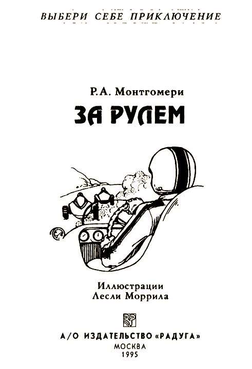

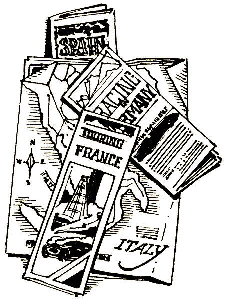

Это необычная книга. Не пытайся читать ее по порядку, с начала до конца, переходя от одной страницы к другой, — ничего не получится. Здесь тебя ждет множество приключений на автомобильных гонках по трассам Европы. Время от времени тебе придется делать выбор. Что принесет он? Успех или поражение?

Твои приключения — результат твоего выбора. Тебе самому решать, куда пойти, что сделать. А дальше — читай указания в конце страницы. Если встретишь несколько вариантов действия, отмечай, который из них ты выбрал. Ведь если тебе не понравится, что из этого выйдет, ты сможешь вернуться к развилке и проиграть другой вариант.

Автомобильные гонки — занятие интересное, но одновременно и опасное. Возможно, какие-нибудь преступники решили провести эти гонки по-своему, а ты стоишь у них на пути. И даже если тебе повезет и ты ускользнешь от них во время гонок, это может не удаться на финишной прямой! Для помощи в твоих приключениях прилагается словарь терминов и выражений, которым пользуются гонщики.

Удачи!

#### ОБ АВТОРЕ

Р. А. Монтгомери, окончив Уильямс-колледж, изучал образовательные программы в Йельском и Нью-Йоркском университетах, занимал ряд административных должностей в Уиллистонской академии и Колумбийском университете. В 1965 г. стал одним из организаторов Уэйтсфилдской летней школы. Продолжая работать в этом направлении, м-р Монтгомери участвовал в организации фирмы, специализирующейся в создании образовательных программ. В качестве консультанта несколько лет он работал в Корпусе Мира в Вашингтоне и в Западной Африке. В настоящее время м-р Монтгомери занимается писательской и издательской деятельностью.

#### О ХУДОЖНИКЕ

Лесли Моррил — известный дизайнер и иллюстратор, его работы отмечены множеством премий. Он проиллюстрировал более тридцати детских книг, в том числе «Ветер в ивах» К. Грэхема в издании «Бантам Классик». М-р Моррил сделал рисунки к большому количеству книг из двух серий «Выбери себе приключение» («Home in Time for Christmas», «You See the Future, Stranded!», «You Can Make a Difference», «The First Olympics», «The Perfect Planet», «Inca Gold», «Stock Car Champion», «Alien, Go Home!», «Grave Robbers», «The Treasure of the Onyx Dragon», «Fight for Freedom», «Smoke Jumper»), а также книги из серии «Супер-приключение» («Journey to the Year 3000», «Danger Zones»).

#### СЛОВАРЬ

Корнеринг — преодоление извилистого участка дороги на максимальной скорости. Иначе, если скорость сбросить, возникнет тормозной эффект.

Тормозной эффект — трение, возникающее во время поворота, когда четыре колеса находятся под углом к своим осям.

Гонки «Гран-при» — состязание в скорости на специальных гоночных машинах на круговой дистанции. Самые знаменитые места проведения гонок «Гран-при» в Европе — это Ле-Ман, Нюрбергринг, Монца и Спа.

Ралли — состязание, включающее показатели времени и расстояния, проходит на специально разработанной сложной многокилометровой трассе. В отличие от гонок «Гран-при» в ралли соревнуются команды, состоящие из пилота и штурмана. Остановки должны происходить через четко определенные промежутки времени, а те, кто прибывает раньше или позже, получают штрафные очки.

Тахометр — прибор, измеряющий число оборотов коленчатого вала в минуту. Водители пользуются им для оценки работы автомобиля, он более надежен, чем спидометр.

Коленчатый вал — деталь внутренней части двигателя, которая вращает автомобильные колеса.

Гонка за лидером — тактика борьбы, когда водитель едет вплотную к впереди идущей машине и поэтому тратит меньше энергии и горючего на сопротивление ветра. Этой техникой пользуются также велосипедисты.

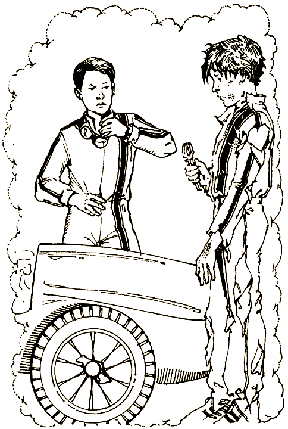

#### [Начать приключение](#1)

# 1

Ты просто поверить не можешь: такой важный для тебя день — и вдруг дождь! Капли бьются об асфальт, превращая пролитый бензин в яркие лужицы. Отблески прожекторов на огромных вышках вдоль дороги сверкают всеми цветами радуги.

Организаторы отложили начало гонок до окончания грозы. Разочарованный, ты идешь туда, где оставил свою машину, и с изумлением видишь какую-то знакомую фигуру, которая, склонившись над мотором, что-то закручивает гаечным ключом.

— Эй! Что ты там делаешь с машиной? — кричишь ты.

— Чиню, для тебя же, — отвечает человек, распрямляясь. Ты видишь его лицо, и сердце у тебя падает. Лицо исцарапано и разбито, на нем проступили все мышцы и сухожилия. — Ты попал в аварию.

— Что ты имеешь в виду? — вскрикиваешь ты в ответ.

— То, что сказал. Мы разбились. Не помнишь? Ты — это я, а я — это ты. Ведь ты смотришь на себя самого.

Ты внезапно просыпаешься, не совсем понимая, где находишься. Затем вспоминаешь: в Женеве, в доме Хуберта, твоего двоюродного брата. Он помешан на автомобильных гонках, и ты разделяешь его страсть. Все три последних лета ты проводил каникулы с ним, изучая вдоль и поперек гоночные машины. Но этого лета вы оба особенно ждали.

На это лето назначены два знаменитых гоночных состязания: Альпийское ралли и первые гонки «Гран-при» в Нюрбергринге. К твоему изумлению, Хуберт предложил тебе участвовать в одном из них на его машине, уже получавшей призы. Наверняка это и вызвало ночной кошмар: ты радуешься и нервничаешь одновременно.

Твой брат Хуберт старше тебя на пятнадцать лет. Он не профессиональный гонщик, он банкир. Но гоночные машины — его гордость и отрада. Он покупает автомобили только пятидесятых-шестидесятых годов и часто говорит: «Таких больше не делают». Ты готов с ним согласиться: это машины со своей индивидуальностью, стилем, а главное — хорошо отлажены.

Хуберту нравится запах бензина и масла, его захватывает дух опасности, которым пропитан мир гоночных машин высшего класса. Его кумиры — гонщики прошлых лет: Нуволари, Фанжио, граф де Портаго и Стирлинг Мосс. Хуберт говорит, что в наше время гонки превратились в большой бизнес. Для него они утратили часть былой славы, и эти летние соревнования наверняка вызовут у него приступ ностальгии.

Круговая дистанция на гонках «Гран-при» в немецком городке Нюрбергринге составляет 14,3 мили. Она очень извилиста — 85 правых и 89 левых крутых поворотов. Всего же на дистанции из двадцати двух кругов получается 3828 поворотов. Трасса проложена по лесам и горным дорогам, вдоль глубоких ущелий и неприступных скал. Она требует постоянного внимания. Эти гонки проходят на Эйфельской возвышенности, неподалеку от бельгийской границы. Показатель только один — время пересечения линии финиша.

На эти гонки Хуберт выставляет переделанный красный «феррари» 1954 года с рабочим объемом цилиндров 2 литра. Эта машина в течение двух сезонов брала призы на гонках «Гран-при», пока в 1963 году в Монте-Карло не потеряла управление и не врезалась в барьер, при этом трижды ударившись. С гоночных соревнований ее сняли, и она была продана как редкость. Хуберт привел ее в порядок, и теперь она готова мчаться, обгоняя ветер и соперников.

Ты знаешь, что успех на «Гран-при» зависит от корнеринга (выполнения машиной поворота самым эффективным из возможных способов), мастерства водителя и конструкции автомобиля. Если шины, тормоз, оцепление, мотор или нервы откажут, гонки проиграны.

Другая гонка — двухтысячемильное Альпийское ралли. Машины должны перебираться через горный массив по дорогам чуть шире козьих тропок, и даже без ограждений, а потом резко спускаться на трассу Монцы. Это самое сложное, изнурительное и опасное из всех соревнований.

Ралли очень отличается от гонок «Гран-при». Ралли — это не скоростные гонки. Это проверка возможностей водителя и машины на заданном маршруте. Главное в ралли — средняя скорость. Чтобы определить ее, жюри заранее устанавливает, сколько точно времени необходимо, чтобы покрыть каждый участок трассы на заданной скорости. Альпийское ралли — это пять дней вверх и вниз по горам. То газуешь, то тормозишь, да еще соблюдаешь поминутный график движения. Словом, это полная проверка возможностей автомобиля и водителя.

В отличие от «Гран-при», где участвуют автомобили, сконструированные специально для гонок, в ралли состязаются машины серийных моделей, хотя они могут быть усовершенствованы. Кроме того, в автомобиле сидит экипаж из двух человек — пилота и штурмана. У штурмана есть планшет, где он отмечает время, расстояние, этапы трассы и контрольные пункты. Основная обязанность штурмана — следить за временем, отмечать трудные участки пути и при необходимости подменять водителя. Ралли — это долгое, изнурительное путешествие, требующее выдержки и выносливости, вот почему в нем участвуют командами.

Для Альпийского ралли Хуберт подготовил маленький серебристый «порше-каррера». Он выпущен в 1962 году, Хуберт забрал его прямо с завода в Штутгарте, в Германии, и с любовью ухаживает за ним. Отличный алюминиевый корпус никогда не портили вмятины, а черная кожа, которой отделан салон, хотя и потрескалась в нескольких местах от солнца, блестит по-прежнему. Однако это не простой «порше», Хуберту пришлось его усовершенствовать, чтобы он мог справиться со всеми трудностями ралли. Подвеска, колеса, сцепление, карбюратор, мотор были доработаны.

Тебе нужно выбрать одну из этих двух замечательных гонок. Вчера вечером ты сказал своему брату Хуберту, что примешь решение утром, за завтраком. Забыв все свои ужасные ночные кошмары, ты встаешь с постели, одеваешься и выходишь на балкон. Увидев там брата, ты здороваешься.

— Доброе утро, — отвечает Хуберт по-английски, с легким акцентом. — Время пришло. Ты решил? Я прямо вижу, как ты в шлеме и защитных очках несешься по треку в Нюрбергринге, со свистом преодолеваешь повороты и вылетаешь на финишную прямую.

Эта картина тебя прельщает. Однако он продолжает:

— И точно так же я могу представить, как ты несешься по краю альпийского ущелья глубиной в тысячу футов и чувствуешь себя уверенно, как горная козочка, а с тобой Мари-Лиз, в качестве штурмана. Как я буду гордиться, если ты выиграешь на моем «порше»!

Все еще трудно поверить, что ты можешь стать участником любого из этих соревнований. Но ты тренировался и готов к состязаниям, ты это знаешь. Выбор труден, однако решить необходимо прямо сейчас, как ты обещал.

Но, до того как принять решение, ты должен узнать, что происходит в одном парижском кафе. Способность твоего сознания перемещаться в пространстве без участия тела дает тебе возможность проделать этот путь и услышать разговор, который может решить твою жизнь… или смерть.

В Париже вечереет. Маленькое кафе на незаметной улочке среди старых домов. Кафе называется «Trois Copains» — «Трое приятелей». Оно кажется странно пустым для этого часа.

Вот подъезжает большой черный седан, из которого выходят три человека. Элегантный седой мужчина с усами, лет шестидесяти. Его сопровождает высокая женщина с каштановыми волосами, чуть за двадцать. Следом идет другой мужчина, тоже лет двадцати. Он низкого роста, темноволосый, широкоплечий. Прежде чем зайти в кафе, они внимательно оглядываются.

Все это видно тебе сверху, благодаря способности твоего сознания перемещаться в пространстве. Хотя ты сознаешь происходящее, все окутано пеленой тумана, как во сне.

Минуту спустя ты видишь, что к кафе подъезжает какой-то человек на мопеде. Он одет хуже остальных и больше смахивает на рабочего. Пока он идет к дверям, ты успеваешь заметить, что один каблук у него на несколько дюймов выше другого.

«А как ты поступишь, если я скажу, что эти люди собираются тебя убить? — спрашивает голос, звучащий у тебя в голове. — Да-да, именно убить. Вот здесь, в этом маленьком кафе, твоя судьба уже почти решена. Прислушайся».

Сперва тебя коробит от этого голоса. Он звучит как-то странно и в то же время знакомо. Затем ты понимаешь, что это твой внутренний голос, и доверяешься ему.

— А водитель молодой? — спрашивает седой человек.

— Молодой, но опытный, во всяком случае, тате говорят, — отвечает женщина.

— Смелый парень? — спрашивает низкорослый;?

— В высшей степени. И ловкий тоже.

Низкорослый снова открывает рот:

— Так вы думаете, он победит?

— Мы это устроим. Можешь ни минуты не беспокоиться, — смеясь, говорит рабочий.

Низкорослый качает головой.

— Говоришь-то ты много, а…

— Его семья живет в Америке и богата до омерзения, — перебивает его пожилой.

— Ну что же, картина проясняется.

Подбегает официант с подносом, на котором стоят бокалы и две бутылки: одна с водой, другая с каким-то вином. Его появление прервало разговор. Им не терпится, когда он уйдет.

Все поднимают головы — к столику подходит мужчина в дорогом костюме в мелкую полоску. Это сильный загорелый человек. На вид ему под сорок. Глаза прикрыты темными очками, которые он не дал себе труда снять, хотя в кафе царит полумрак.

— Как всегда, опаздываешь, Рауль, — говорит седой.

— Твое отношение ко времени почти или даже совсем меня не волнует, Эрик. Заруби это себе на носу. — Тот, кого назвали Раулем, выдвигает стул и усаживается поудобнее.

— Когда-нибудь ты на этом споткнешься. Так всегда бывает, — продолжает Эрик.

Рауль хохочет.

— Угрозы, Эрик, вечные угрозы. Может, перестанешь повторяться? Хватит терять время, перейдем к делу — к деньгам. Что вы надумали?

— Этот молодой американский водитель — ключ к нашему успеху. Отличный ход! Болельщики вкладывают в гонки кучу денег. К счастью, кто выиграет, будем знать только мы. — Эрик обводит собравшихся за столом напряженным взглядом. Он складывает руки на груди и кивает человеку с высоким каблуком. — А может, все решит похищение.

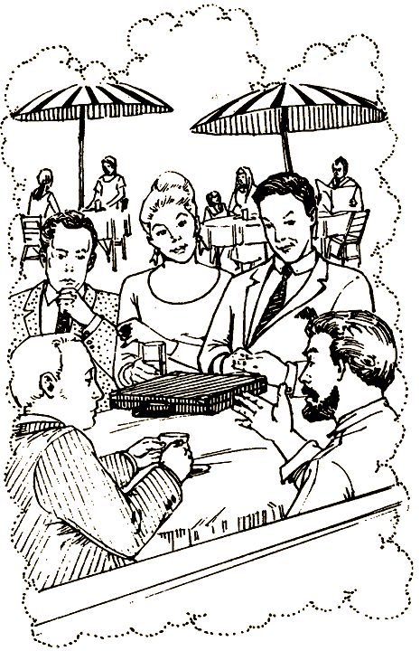

— С большинством машин никаких проблем не будет. У меня есть пропуск механика и на «Гран-при», и на Альпийское ралли, — говорит рабочий, потирая лодыжку.

— Что ты сделаешь? — спрашивает Рауль.

— Тормоза полетят, карбюратор засорится, покрышки лопнут. Я все сделаю, — отвечает рабочий.

— Не сомневаюсь, Генри. Мы знаем твою работу. Надеюсь, ты будешь осторожен и тебя никто не узнает, — говорит Эрик.

— Де беспокойтесь, вот глядите, — Генри открывает саквояж и показывает комплект профессионального актерского грима.

— Ну а как с американцем? Что будем делать с этим гонщиком? — спрашивает Эрик.

— Предоставьте это мне, — говорит Рауль. — Найдем способ. Если американец откажется платить, он станет, как там говорится, историей. Что до меня, то я предпочитаю шантаж.

Ты не веришь своим ушам — эти люди говорят о тебе!

«Идем, пора возвращаться, — приказывает тебе голос. — Хуберт дожидается твоего решения».

И, даже не поняв, как это случилось, ты оказываешься на балконе рядом с Хубертом. Время словно стояло на месте. Надо выбирать, в каком соревновании участвовать, а теперь тебе известно, что игра может быть нечестной.

Вести «феррари» в гонках «[Гран-при](#90)» или «порше» в [Альпийском ралли](#12)?

# 12

— «Альпийское ралли» — звучит очень заманчиво, Хуберт. Пожалуй, я приму участие в этих гонках.

— Отлично, братец. Говоря по правде, мне очень этого хотелось. Во многих отношениях Альпийское ралли — это вершина автомобильных гонок. Так что браво. Я тоже буду участвовать.

Ты чувствуешь легкое сожаление, оставляя большой красный «феррари» в гараже. Но жизнь постоянно заставляет делать выбор, убеждаешь ты себя, переключая внимание на серебристый «порше».

— А как насчет штурмана? Ты будешь моим штурманом, Хуберт?

— Нет, я уже говорил, что твоим штурманом будет дочь моего друга Альбера Дюмона. Последние шесть лет Мари-Лиз провела в Аргентине. Кажется, вы не встречались, но, уверяю, она тебе понравится. Для нее это первое ралли. Она тренируется три года и стала почти профессиональным штурманом у своего отца.

— Отлично! Когда мы с ней встретимся?

— В полдень. Давай собираться. Прежде всего надо взглянуть на трассу. Отправимся на двух машинах. Поехали.

— Я готов, — говоришь ты. Перескакивая через две ступеньки, бежишь в спальню и собираешь вещи. Это не отнимает много времени. Все необходимое уложено в большой рюкзак. Хуберт упаковывает два кожаных чемодана.

— Мы заедем за Мари-Лиз. Она живет в кирпичном доме в старой части Женевы, — говорит Хуберт.

Хуберт — за рулем «ренджровера», а ты ведешь «порше». Он похож на дрессированного циркового кота, ловкого, быстрого и умелого.

Познакомившись, вы с Мари-Лиз быстро становитесь друзьями. У вас много общего.

Мари-Лиз представляет тебя своему дяде — седому человеку лет шестидесяти, он поразительно похож на мужчину, которого ты видел в парижском кафе. Ты стараешься убедить себя, что странное путешествие в Париж тебе просто приснилось, но все-таки побаиваешься этой компании.

В тот же день к вечеру вы с Мари-Лиз едете в «порше», машина катит из Швейцарии во Францию. Хуберт обещал догнать вас по дороге или в гостинице.

После четырех часов езды ты сворачиваешь с шоссе и направляешься к маленькому городку под названием Венаск.

— Мы решили остановиться в «Л'Оберж де ла фонтен». Это в центре городка, — говоришь ты, пока «порше» несется вверх по склону холма. Окруженный стеной средневековый городок навевает мрачное, угрюмое настроение.

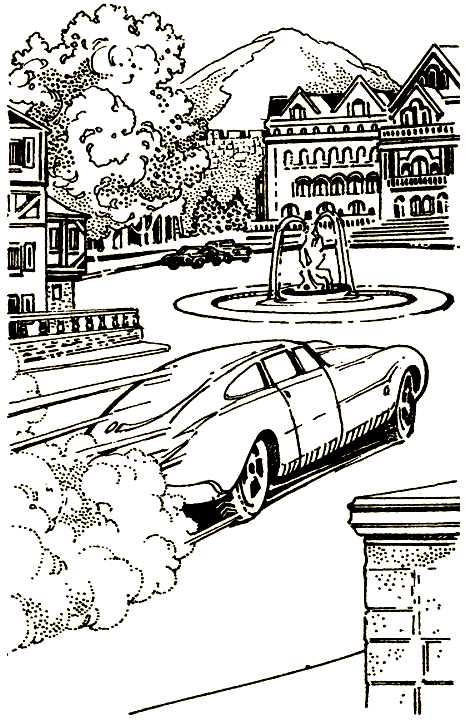

— Здесь, — говорит Мари-Лиз.

«Л'Оберж де ла фонтен» находится в красивом старинном каменном здании, выходящем на маленькую площадь с вычурным фонтаном. Гостиница очаровательна, но в темном вестибюле тебя охватывает страх — у конторки портье стоит человек, которого ты видел в парижском кафе.

— Рауль, вот так встреча! — восклицает Мари-Лиз, но в ее голосе нет сердечности. Рауль оборачивается и одаривает вас улыбкой.

— Мари-Лиз, твой дядя Эрик сказал, что вы должны остановиться здесь. Я решил присоединиться к вам. Надеюсь, не помешаю.

— Ну что ты, Рауль. Разве ты можешь кому-нибудь помешать, — говорит Мари-Лиз с почти откровенным сарказмом.

Рауль протягивает тебе руку.

Тебе хочется как можно скорее убраться отсюда. Этот человек, несмотря на внешнее обаяние, внушает страх. Интуиция подсказывает, что надо сейчас же уезжать, но мешает вежливость.

Ты решил [уехать](#36) или продолжаешь держаться в рамках вежливости и [остаешься](#26)?

# 20

— Не могу отказаться от такого предложения, Рауль. Идем, — говоришь ты под влиянием минуты.

— Я знал, что ты согласишься, мы с тобой очень похожи. Я сразу это понял, — говорит он, смеясь.

Рауль открывает дверцу водителя, и ты садишься за руль этого автомобиля космической эры. Приборный щиток перед тобой напоминает панель управления сверхзвукового истребителя. Ты вставляешь ключ в замок зажигания, поворачиваешь, и мотор взрывается ревом. На щитке вспыхивают огоньки, сообщая немного нужной и огромное количество ненужной информации.

— Поехали. В конце шоссе поворот направо, — говорит Рауль, откинувшись на сиденье. Он выбирает из ящика компакт-диск и вставляет его в плейер. Звуки джаза наполняют машину. Ты чувствуешь, что весь погрузился в музыку.

Медленно отпуская тормоз, ты чувствуешь, как «порше» послушно трогается с места. Вправо от шоссе отходит дорога — узкая, но с хорошим покрытием.

Вторая скорость, ты жмешь на газ.

Третья скорость, ты бросаешь взгляд на тахометр, проверяя число оборотов.

Четвертая скорость, машина мчится по дороге, легко вписываясь в повороты. Ты чувствуешь свободу и мощь, словно музыкальный ритм бьется у тебя в ушах и разливается по всему телу.

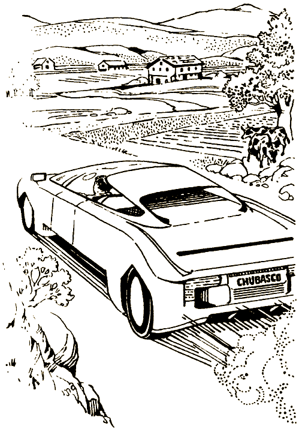

— Следующий поворот налево, — мягко подсказывает Рауль.

Ты подчиняешься. Перед тобой дорога на Нюрбергринг.

Ты въезжаешь на круг. Это очень хороший трек. На какой-то миг перед тобой возникает картина знаменитых гонок прошлых лет. Ты слышишь, как ревут моторы, переключаются скорости, визжат шины, когда прославленные автомобили делают виражи. Ты слышишь запах бензина и рев толпы на трибунах.

Почти так же внезапно ты возвращаешься в настоящее.

— Что теперь, Рауль? — спрашиваешь ты.

— Я хочу познакомить тебя со своей подругой. Ее зовут Челеста. Она обозреватель «Спортивных новостей» и приехала сюда освещать гонки. Она тебе понравится.

— Вот здорово! А где мы ее найдем?

— Она за вагончиками техпомощи, видишь вон тот? — Рауль указывает на вагончик, возле которого никого нет. Большинство остальных окружено «мерседесами», «альфами», «феррари» и «гордини».

Ты едешь к тому месту, которое он показал. Высокая женщина с каштановыми волосами в белом костюме машет вам рукой и улыбается.

— Это Челеста, — говорит Рауль. Он нажимает на кнопку, и музыка смолкает. Ты испытываешь почти облегчение оттого, что тебя не окружают больше никакие звуки.

Подбегает Челеста.

— Должно быть, вы и есть тот самый американский водитель, о котором мы столько слышали, — говорит она.

Тебя удивляет, что она могла о тебе что-нибудь слышать. Ее голос кажется знакомым, но ты никак не можешь вспомнить, где именно слышал его.

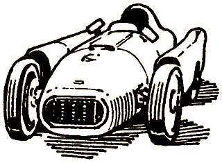

Два часа вы втроем едете по красивой извилистой дороге. Мимо пышных лесов, прелестных овражков и речек. Вот показался знаменитый перевал Каруссель — он, наверно, очень опасен.

В сумочке у Челесты, похоже, неиссякаемый запас компакт-дисков. Она беспрерывно передает их Раулю, и он вставляет их в проигрыватель. Поначалу тебя это утомляет, но через некоторое время музыка начинает даже нравиться. Первый диск с громким джазом, который ставил Рауль, кончился. Сейчас машину наполняют более спокойные звуки немецкой группы, играющей в стиле «фьюжн». Эта музыка тебе по душе, в ней есть что-то почти наркотическое.

Наконец вы останавливаетесь перед рестораном.

— Пора перекусить, — объявляет Рауль.

Ты тоже проголодался. Какой долгий, изнурительный день! Неплохо сделать передышку. В ресторане почти никого, а обслуживают хорошо и быстро. Вскоре, кроме вас троих, вообще никого не остается, только официант присел в уголке и читает газету.

Рауль впился в тебя глазами. Его властный и почти свирепый взгляд буквально пронизывает тебя.

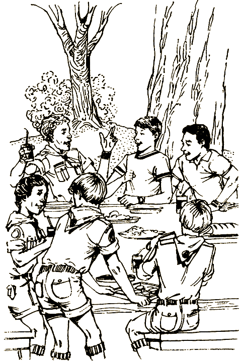

— У нас, дорогой ты наш, есть к тебе предложение, — говорит он. — И такое, от которого ты не сможешь отказаться.

— Рауль прав, — добавляет Челеста. У нее мелодичный, успокаивающий голос.

— Ну и что это за предложение? — спрашиваешь ты, и по спине пробегает дрожь — ты внезапно понимаешь, в чем дело.

Не отвечая, Челеста достает портативный плейер, ставит диск и включает. Ты сразу узнаешь ту музыку, которую поставил Рауль, усадив тебя за руль этой машины. Она сразу же захватывает тебя, и ты чувствуешь, что теряешь власть над собой.

— Нельзя ли выключить? — спрашиваешь ты.

— Одну минуточку, — обрывает Челеста.

— Нам надо, чтобы на гонках ты вел машину как можно лучше, — говорит Рауль.

— Разумеется, — отвечаешь ты, несколько смущенный его словами. Неужели они думают, что ты бы стал вести иначе?

— Вот именно. Но если мы подадим тебе знак, какой-нибудь простой знак, например поднимем фиолетовую карточку размером с журнал, ты должен снизить скорость так, чтобы проиграть гонки. Это если мы покажем фиолетовую карточку. Понятно? Внакладе ты не останешься. Только не ошибись, — втолковывает Рауль.

— Но зачем? — спрашиваешь ты, опешив. Музыка, кажется, проникает тебе прямо в мозг и парализует сознание. Ты борешься с ней, напрягаешь все силы, чтобы преодолеть ее влияние. Дотянувшись, ты выключаешь плейер.

— Не валяй дурака, — нетерпеливо говорит Челеста. — Слушай Рауля.

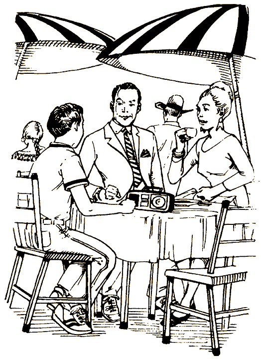

Твой мозг и воля борются друг с другом. Такое ощущение, что сознание находится под тайным влиянием музыки. Воля же постепенно набирает прежнюю силу.

Как выбраться из этого неприятного положения? Прямое сопротивление опасно — они наверняка вооружены. Может быть, стоит на какое-то время притвориться, что согласен. С другой стороны, если как-нибудь отвлечь их внимание, тебе, может быть, удастся удрать.

[Притвориться](#87) или [убежать](#46)?

# 25

Искушение слишком велико. Ты должен узнать, что хранится в кейсе. В конце концов, убеждаешь ты себя, из подслушанного в Париже разговора тебе ясно, что эти люди готовят на этом ралли какую-то махинацию.

Ты осторожно просовываешь пальцы в щель над стеклом. Оно поддается твоим усилиям и опускается дюйм за дюймом. И вот ты наконец можешь просунуть руку и поднять дверную кнопку. Ты надеешься, что в машине нет сигнализации.

— Ай! — вскрикиваешь ты внезапно.

На сиденье появляется кошка и выпрыгивает из машины. Никогда в жизни ты так не пугался. Несколько минут ты приходишь и себя, а потом снова тянешься к ручке двери.

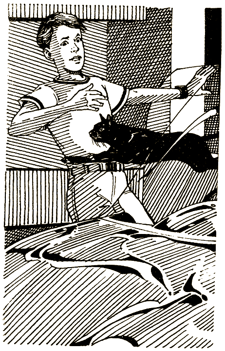

Один миг — и дверца открыта. Ты просовываешь руку внутрь и резким движением выдергиваешь кейс за мягкую кожаную ручку. Захлопываешь дверцу и бежишь прочь. Но вдруг вспоминаешь, что оставил окно открытым.

Ты возвращаешься, открываешь дверцу и в отчаянии обнаруживаешь, что окно — с электроподъемником. Тут уж ничего не поделать, и ты снова захлопываешь дверцу. Утром взлом обнаружится, но теперь уже слишком поздно. Крадучись, ты возвращаешься в гостиницу.

Ступеньки не скрипят. Вскоре ты с облегчением заходишь в свой номер.

Заперев дверь, ты думаешь, как бы открыть кейс. Ведь на нем цифровой замок. Все против тебя! Но тут появляется слабая, очень слабая надежда, что цифровая комбинация не набрана.

Ты пробуешь, и замок щелкает! Портфель открыт!

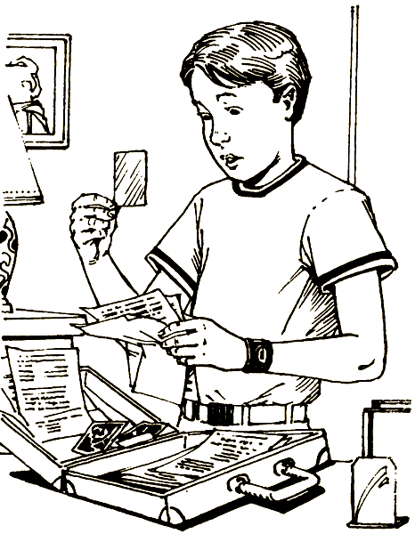

В кейсе несколько твоих фотографий. Кроме них, копии банковских документов, в основном касающихся финансовых дел твоей семьи. И еще несколько листков, излагающих обстоятельства развода твоих родителей и принятых ими соглашений. Один абзац подчеркнут:

«Их единственный ребенок проводит летние каникулы в Европе, поскольку родители не могут прийти к согласию, кому принадлежит право приглашать его к себе на лето. За этого ребенка можно потребовать очень большой выкуп».

Твои подозрения подтвердились. Эти люди хуже чем мошенники — они похитители!

Но прежде чем ты успеваешь придумать, что делать, дверь распахивается, свет гаснет, и ты слышишь злорадный смех Рауля. Это последний звук, который ты слышал в своей жизни.

#### КОНЕЦ

# 26

Ты подавляешь страх и сохраняешь дружелюбие. В какой-то мере ты допускаешь, что страх перед Раулем связан с предстартовой лихорадкой — обычной для всех участников соревнований. Что бы это ни было, интуиция подсказывает тебе держаться настороже.

Твоя комната — на четвертом этаже кирпичного здания гостиницы, резко отличающейся от других здешних построек. Открыв двери, ты внезапно попадаешь в мир современного дизайна. Кресла из нержавеющей стали и кожи, белые стены, две абстрактные картины довершают интерьер. Эффект настолько поразителен, что в первую минуту тебе кажется, что это снова сон. Ты осторожно входишь в свою комнату и трогаешь сталь и кожу на креслах, чтобы убедиться в их реальности.

— Обед в полвосьмого, — ободряюще говорит Рауль, входя следом. — Твой двоюродный брат тоже будет здесь. Уверен, что здешняя кухня вам понравится.

— Отлично. Увидимся позже, — отвечаешь ты.

Минуту спустя ты уже выскальзываешь из комнаты и крадешься вниз по лестнице, не вполне понимая, зачем столько предосторожностей. Интуиция влечет тебя на стоянку рядом с отелем. Там около тридцати машин.

— Какая же из них Рауля? — спрашиваешь ты вслух самого себя.

— Какая — что? — переспрашивает чей-то голос. 

Из тени выходит человек. Он низкого роста, бородатый, коренастый, в синем комбинезоне.

— Нет-нет, ничего, это я сам с собой, — отвечаешь ты. Он кажется тебе смутно знакомым, значит, надо немедленно убираться со стоянки.

Ты поспешно уходишь, но минут через сорок возвращаешься. Оглядевшись, ты начинаешь осматривать машины. Твой «порше» стоит в крайнем ряду. Там множество «пежо», «рено», «BMV» и несколько «вольно». Наконец ты находишь: приткнувшись к стене, стоит темно-зеленый «мазерати» с номерами Монте-Карло. Ты уверен, что это машина Рауля, поскольку от Мари-Лиз знаешь, что он живет там. Осторожно приблизившись, ты обследуешь машину, начиная с колес. Наконец твой взгляд доходит до салона. В вечернем свете ты замечаешь сотовый телефон, доверху набитую дорожную сумку и кейс на заднем сиденье.

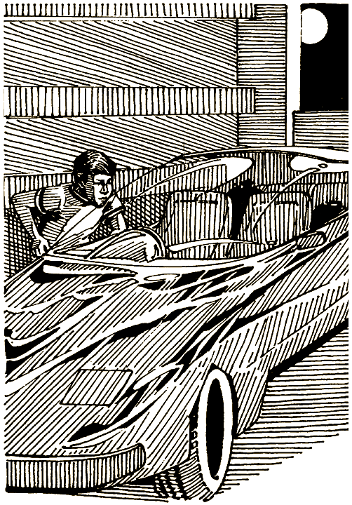

— Чем могу служить? — вдруг раздается рядом. Однако в этом голосе звучит что угодно, кроме услужливости.

— Нет-нет, ничего. Я просто смотрю. Отличная машина. Просто смотрю, — бормочешь ты.

Это тот самый человек в синем комбинезоне. Ты все еще не можешь распознать его, и тебе не по себе оттого, что он за тобой наблюдал.

— Ладно, смотри, но ничего не трогай.

— Хорошо-хорошо, — отвечаешь ты, отходя. — Спокойной ночи.

А ночью под покровом тьмы ты возвращаешься на стоянку. Ты уверен: кейс тот самый, что был у блондина за столиком в парижском кафе. Необходимо выяснить, что там внутри. Ты пробуешь дверь, она заперта. Но, обследуя машину более тщательно, ты обнаруживаешь, что окно с правой стороны закрыто не доверху.

Ты колеблешься, тебя мучает совесть. То, что ты хочешь сделать, — преступление. Но ты уверен: Рауль задумал недоброе. Может, даже хочет тебя убить!

Надо что-то делать, но что?

Первая мысль — следить за машиной всю ночь. Значит, не придется спать, и ты решаешь придумать что-нибудь получше. Может быть, стоит просто взять кейс.

А может, кейс надо оставить, но не спускать глаз с Рауля.

[Взять](#25) кейс или [оставить](#28) и заняться слежкой?

# 28

Ты решаешь не трогать кейс. Осторожность — вот что теперь необходимо. Ты знаешь, что должен быть всегда начеку. А кроме того, тебе надо сконцентрироваться на гонках.

Наступает утро, ты хорошо выспался. Тебя бодро приветствует Мари-Лиз.

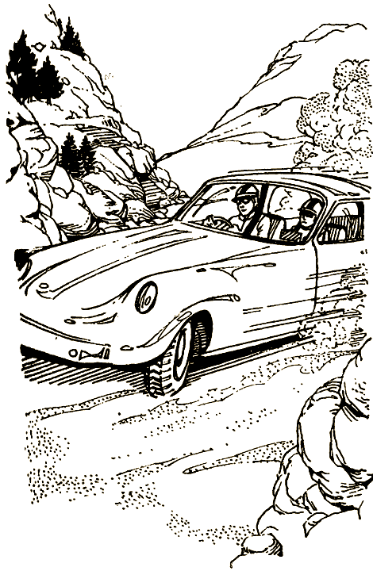

— Наконец-то, соня, — говорит она. — Поедем посмотрим трассу через Венту. Давай скорее.

Хуберт, который приехал вчера поздно вечером, кивает в знак согласия и снова склоняется над чашкой кофе.

Через несколько минут вы с Мари-Лиз въезжаете на первый виток серпантина, проложенного по горе Венту. И вот вы уже на втором, машина несется, лавируя по трассе.

— Средняя скорость! Помни, это самое важное. Тебе не надо ничего доказывать, — говорит Мари-Лиз, глядя на планшет. У нее на шее два секундомера. — Попробуй добраться до вершины — это около одиннадцати миль — за двадцать одну минуту. И не гони как сумасшедший. Ясно?

— Ясно.

Ты успокоился, но в то же время остаешься собранным. Ты держишь руль свободно и уверенно. Выжимаешь тормоз и сцепление одновременно, как учил Хуберт, и «порше» плавно сползает с горы.

— Здорово, правда здорово! — говорит Мари-Лиз, когда мимо проносится дорожный столбик. Тебе приятна и ее похвала, и то ощущение, какое доставляет послушная тебе машина.

— Ух! — вдруг вскрикиваешь ты. Большой черный «мерседес» несется навстречу прямо посередине дороги, почти не оставляя для тебя места.

Ты полагаешься на удачу и быстро крутишь руль, то в одну сторону, то в другую. И чудом проскакиваешь мимо «мерседеса».

— Кто это? — спрашиваешь ты, едва переведя дыхание.

— Идиот! — кричит Мари-Лиз, глядя через черное стекло на исчезающую из глаз машину. — Такое впечатление, что он хотел нас убить.

Ее слова отдаются у тебя в голове. Ты согласен, вас пытались столкнуть с дороги. Но почему?

На следующем трехмильном отрезке никаких происшествий. Мари-Лиз во все глаза следит за любой помехой и присматривается к машинам, от которых может исходить опасность.

Наконец-то вы на вершине, которая отмечена высокой радиовышкой. Вы подъезжаете к стоянке, и ты поворачиваешься к Мари-Лиз, чтобы сверить время и среднюю скорость.

— Ну как?

— Неплохо, совсем неплохо, — с гордостью говорит она. — Всего на три секунды отклонились от контрольного времени. Ну, а ты как?

— Отлично, — отвечаешь ты.

На обратном пути в Венаск никаких происшествий. Мари-Лиз садится за руль. Ралли длится долго, поэтому штурман тоже выполняет обязанности пилота.

Вы подъезжаете к отелю, и Хуберт встречает вас у дверей.

— Надо спешить, друзья. Едем в Авиньон, потом в Марсель. Кстати, этот парень, Рауль, поехал за вами. Он просил передать, что любопытство сгубило кошку. Что бы это значило?

— Кто этот Рауль? — спрашиваешь ты Мари-Лиз.

— Это друг моего дяди. Мой отец считает его шалопаем. Ко мне он всегда относился хорошо, но я ему не доверяю.

— Будем осторожны, — говоришь ты, тебя гложет мысль, что от Рауля добра не жди. Так и подмывает рассказать Хуберту о странном путешествии в Париж. Но тебя кое-что смущает. Ты не знаешь, поверит ли Хуберт. Ты и сам не вполне веришь. Может быть, все это только приснилось?

[Рассказать](#34) Хуберту о разговоре в Париже или ничего [не говорить](#37)?

# 34

Решение рассказать Хуберту о том, что ты слышал в парижском кафе, было правильным. Хуберт и Мари-Лиз слушают затаив дыхание. Едва ты закончил, Хуберт говорит:

— Не важно, как и почему произошло это твое путешествие в Париж. Важно, что мы теперь сделаем. Мы позвоним в Интерпол, международную полицию, и будем надеяться, что нам поверят.

Через пять часов на загородное футбольное поле садится вертолет «Алюэтт», из него выходят три человека в отлично сшитых костюмах. Один из них представляется:

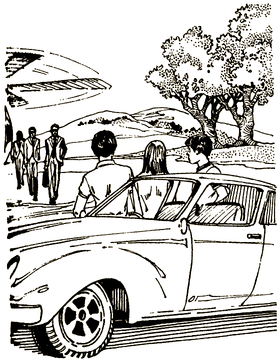

— Я Бернар Россиньоль, руководитель отдела по борьбе с мошенничеством. Не исключено, что, посмотрев этот альбом, вы сможете нам помочь.

Он протягивает толстую папку с тремя закрепками.

Вскоре ты натыкаешься на фотографии Эрика и Рауля.

— Вот они! — вскрикиваешь ты.

— Отлично! — восклицает Бернар. — Эти двое известные мастера. Они специализируются на мошенничестве и вымогательстве. Кроме того, за ними числятся похищения и убийства.

— Не могу поверить, — говорит Мари-Лиз, потрясенная таким поворотом событий.

— Так что же вы их не арестуете? — спрашиваешь ты, изб всех сил желая, чтобы этих людей привлекли к суду.

— Это не так просто, мой юный друг. Нужны доказательства. Ты мог бы послужить нам приманкой. Ясно, что они уже заинтересовались тобой.

— Почему мной? — удивляешься ты.

— Твой брат Хуберт говорил мне, что ты из очень богатой семьи. Может, тебя хотят похитить, кто знает? — Бернар поворачивается к двум своим товарищам и тараторит на парижском наречии так быстро, что ты почти ничего не понимаешь. Потом он снова поворачивается к тебе. — Решено, мы внедрим на ралли нашего тайного агента. Он будет за всем следить. Он это или она, мы не окажем, тебе лучше ничего не знать. Здесь, в Венаске, мы будем вести наблюдение с вертолета, Если Рауль или его подручные подойдут к тебе, ты включишь этот портативный передатчик. Согласен?

Думать некогда.

— Хорошо. Но, может, мне стоит обзавестись оружием? — спрашиваешь ты.

— Нет, это только усложнит дело. Мы установим электронный передатчик в твоей машине, а второй приколем к рубашке. Они куда полезнее любого оружия.

Бернар делает знак одному из своих помощников, и тот прикалывает к твоей рубашке невинный на вид значок. Другой он прячет в багажнике «порше».

— Помни, мы будем все время следить за тобой. Наберись мужества, будь осторожен, и удачи тебе.

— Идем, — говорит Хуберт. У него на лице какое-то мрачное выражение. — Мне не нравится, что ты попал в такую ситуацию. Может быть, тебе лучше бросить все это и вернуться в Штаты?

— Нет, я уже не брошу, — отвечаешь ты.

Хуберт кивает в знак согласия и одобрения. Вы с Мари-Лиз едете в «порше» за Хубертом, который ведет «ренджровер». Ненадолго остановившись в Авиньоне из-за шин, в тот же день вы добираетесь до Марселя — к месту старта Альпийского ралли.

И вот наступил день соревнований. Ты проснулся и вскочил еще до рассвета, проверил карты участков трассы. Вы готовы выезжать, и никаких помех со стороны Рауля и его приятелей до сих пор не было.

Организаторы помечают номер вашей машины и дают сигнал стартовать.

Вы едете! На первом этапе надо забраться на гору Венту за три часа и шесть минут. Выехать из Марселя — дело само по себе нелегкое. Это большой и суетливый город, но тебе это удается без особых трудностей.

— Предупреди меня перед съездом с шоссе. Какой будет город? — спрашиваешь ты Мари-Лиз.

— Карпентрас, — отвечает она. — До него миль пятьдесят. Я предупрежу тебя тысячу раз.

Время летит быстро, и вскоре вы съезжайте со скоростного шоссе на дорогу, ведущую от Карпентраса к горе Венту. Трасса узкая, на ней полно крутых поворотов и виражей.

— Увеличь скорость миль на десять, — советует Мари-Лиз.

— Запросто, — отвечаешь ты, бросая взгляд на спидометр и тахометр.

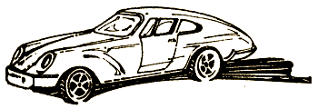

Мгновение спустя ты уже на знакомой дороге, ведущей в гору. Мимо тебя проносятся две «загато-альфы», а еще через миг — зеленый «хейли-3000». По номерам на капотах ты узнаешь в них соперников.

— Давай потише, — говорит Мари-Лиз, — мы опережаем расписание почти на две минуты.

Впереди начинают вырисовываться номера на капоте маленького рыжего «санбим-тальбота». Он стоит поперек дороги, почти совсем загораживая ее. Рядом человек машет белой тряпкой, будто флажком. Тут что-то не так — возможно, это ловушка. Хотя, может быть, ему действительно нужна помощь.

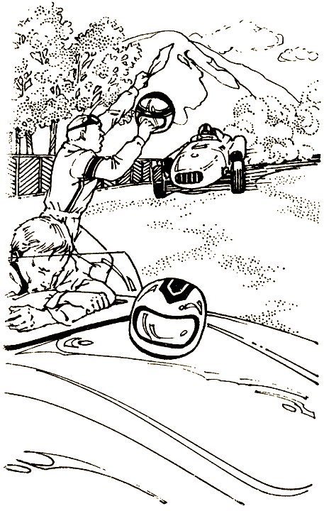

[Остановиться](#41) или не обращать на него внимания и [ехать дальше](#71)?

# 36

— Прости, только что вспомнил: я хотел сегодня забрать запасные покрышки со специальным протектором, — говоришь ты. Это ложь только наполовину — ты действительно собирался их взять, но только завтра.

— А подождать нельзя? — спрашивает Мари-Лиз. На ее лице написано удивление.

— Извини, но я не привык оставлять дела на потом. Передай Хуберту, что я вернусь после обеда. Пока, — говоришь ты, выскакивая за дверь.

Через минуту ты уже выезжаешь из города и мчишься по извилистой дороге в долину. Ты плохо представляешь себе, куда едешь, но тебе нужно время все обдумать и унять страх.

— Что мне известно? — спрашиваешь ты вслух.

И, словно в ответ, внутренний голос подсказывает тебе: «Положись на интуицию. До сих пор ты делал все как надо. Но не заходи слишком далеко. Ты ведь не хочешь, чтобы они что-нибудь заподозрили».

Мысли с трудом ворочаются в голове, а тебе надо решать, что делать. Поняв, что внутренний голос прав и не стоит будить их подозрений, ты резко разворачиваешься и возвращаешься.

Остановившись перед гостиницей, ты поджидаешь, когда подъедет твой брат Хуберт. Ты уже решил для себя: надо рассказать Хуберту все, что услышал в парижском кафе, и убедить его бросить соревнования.

Часы бегут, близится полночь, а Хуберта все нет.

— К черту! К черту эту машину! К черту эту страну! Я хочу домой! — кричишь ты в отчаянии. Затем жмешь на газ, мчишься в ближайший аэропорт и улетаешь домой. Ты чувствуешь себя виноватым в том, что оставил Хуберта, но надеешься, что он поймет тебя, когда ты позвонишь ему и все объяснишь.

#### КОНЕЦ

# 37

Решение ничего не говорить о том, что ты слышал в кафе «Трое приятелей», привело к роковому повороту событий.

Рауль и его правая рука, Генри, начали следить за тобой и Хубертом. Вот что они задумали.

— Путь свободен, дружище, — говорит Рауль. — Хуберт будет занят, и мы возьмем это дельце в свои руки.

— Много болтаешь, подождем — увидим, — отвечает Генри.

— Вечно ты во всем сомневаешься и действуешь мне на нервы, Генри, — говорит Рауль, сверкая глазами. — Мы перехватим американца в Марселе, это я беру на себя.

— Как хочешь, Рауль, как хочешь, — отвечает Генри.

Они уезжают из Венаска и направляются прямо в Марсель.

В этот же вечер банда разрабатывает окончательный план.

— Все очень просто, — говорит Рауль. — Мы сделаем американцу такое заманчивое предложение, от которого он не сможет отказаться, и передадим деньги из рук в руки. Он будет скомпрометирован, и мы тут же поставим свои условия: или семья платит нам, чтобы мы заткнулись, или мы передаем все улики полиции. А сами, конечно же, действуем анонимно. Здорово, а?

— Слишком сложно, Рауль, — говорит Эрик, нахмурившись. — Гораздо легче похитить американца с трассы. Участник ралли исчезает, Семья сходит с ума, никаких доказательств и все такое.

— Давайте проголосуем, — говорит женщина с каштановыми волосами. Генри хмурится.

— Хорошо, все, кто за шантаж, говорят «да», кто против — «нет».

Голосование проходит быстро.

— «Нет» победило, — объявляет Эрик. — Итак, похищение. Отлично, гора с плеч свалилась. Шантаж редко удается.

— Делайте, что хотите, я выхожу из игры, — говорит Рауль и уходит из комнаты.

— Ну и хорошо, — говорит Генри. — Он мне никогда не нравился. Очень уж на руку нечист.

— Если это говоришь ты, Генри, то это комплимент, — смеется Эрик.

Тем временем вы с Мари-Лиз стартуете в Альпийском ралли, почти забыв об Эрике и его банде. Все ваше внимание поглощает ралли.

Первый этап на горе Венту омрачен сердечным приступом у одного из участников. В остальном все идет отлично. Следующий день более трудный. На покрытой гравием горной дороге, ведущей в Италию, спускает колесо. На его замену уходит больше времени, чем ты рассчитывал, и на этом участке трассы вы с Мари-Лиз отстаете на шесть минут.

— Нам это не наверстать, — говорит она.

— Попробуем, — отвечаешь ты, вписывая «порше» в крутой поворот горной дороги.

К счастью, поблизости нет других машин. Внезапно — так что у тебя не остается времени, чтобы предпринять что-либо, на крутом вираже в опасной близости проносится кроваво-красная «загато-альфа». Откуда она взялась?

— Совсем вплотную прошла, — говоришь ты.

— Не столкнулись, это главное, — вздыхает Мари-Лиз с облегчением.

— Давай жми, — говорит Мари-Лиз, — надо наверстать время.

— Хорошо, — бормочешь ты, сосредоточившись на дороге.

Еще три виража, и ты вписываешься в график. Ты жмешь на акселератор, и «порше» глотает милю за милей.

Однако на следующем повороте тебе приходится нажать на тормоз — дорогу перегораживает машина, возле которой стоят три человека.

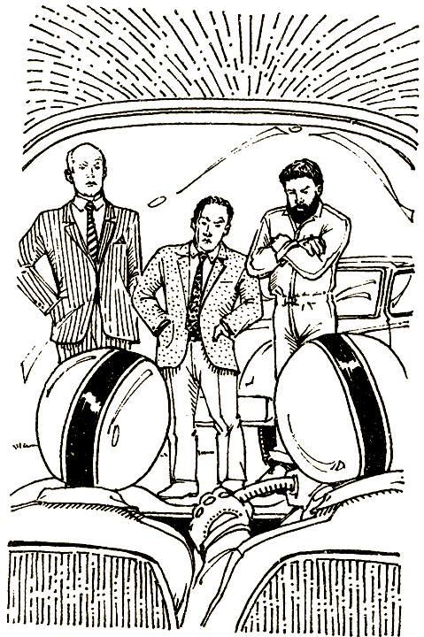

— В чем дело? — кричишь ты, высунувшись в окно.

— Выходи, — приказывает Эрик. — А ты, Мари-Лиз, сиди и не высовывайся.

Тебя застигли врасплох, но ты ощущаешь внезапный прилив храбрости. Ты бросаешь взгляд на Мари-Лиз, думая, выходить ли из машины, как тебе приказали, или лучше удрать? Каково бы ни было твое решение, принимать его надо скорее.

[Выходишь](#100) из машины или остаешься и пробуешь [удрать](#78)?

# 41

— Я не могу оставить здесь этого парня. У нас есть в запасе какое-то время? — спрашиваешь ты, нажимая на тормоз.

— Да. Хотя не слишком много. Минута-две, не больше.

— Хорошо. Я быстро, — говоришь ты, останавливая машину. — Что случилось? — спрашиваешь через окно.

— Спасибо, что остановились, — говорит человек с английским акцентом. — С моим штурманом не все в порядке. — Он показывает на фигуру, лежащую на переднем сиденье машины. — Похоже, у него сердечный приступ.

Еще в Штатах ты прошел курс оказания первой помощи. Ты выскакиваешь из машины и всматриваешься в лицо неподвижно лежащего человека.

— Давно это с ним?

— Началось где-то час назад, но мы старались дотянуть.

— Времени терять нельзя. У него может остановиться сердце. Быстрей вытаскивайте его, — приказываешь ты.

Человека положили у дороги, и ты начинаешь массировать ему сердце. Дело это нелегкое, но уже через три минуты появляется слабый пульс. Мужчина начинает прерывисто дышать, лицо его бледно, а кожа на ощупь холодная.

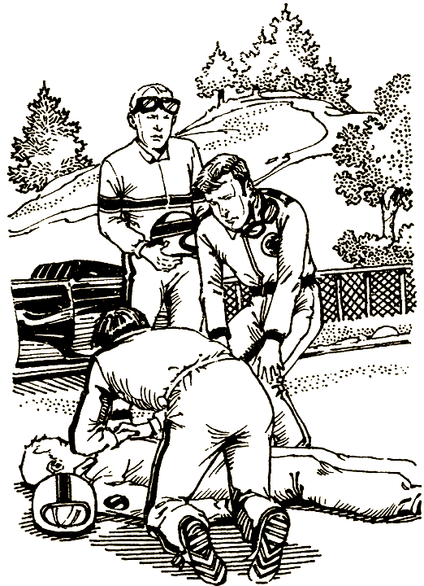

— Гони за «скорой помощью»! — кричишь ты Мари-Лиз.

Мари-Лиз перебирается на водительское сиденье «порше» и дает газ, подняв клубы песка и пыли.

Спустя немного времени появляется «скорая помощь», человека в полубессознательном состоянии забирают и увозят. К тебе подходит один из организаторов гонок с планшетом, секундомерами и хронометром.

— Вы спасли жизнь этому человеку? — спрашивает он. У него немецкий акцент, но по-английски он говорит прекрасно.

— Полагаю, что так.

— Мы решили не засчитывать время, которое вы потеряли на этом участке ралли. Вы можете продолжать без штрафных очков. Желаем успеха, — говорит он, пожимая тебе руку.

Подъезжает машина, полная журналистов и фотографов, которые ведут репортажи с ралли. Они суетливо щелкают фотоаппаратами и расспрашивают водителя «санбим-тальбота». Потом направляются и к тебе, но ты увертываешься от объективов.

Ночью, когда вы с Мари-Лиз уже пересекли границу Италии, ты вспоминаешь прошедший день. Тебе не дает покоя мысль, где теперь Рауль и все остальные. Если им удалось ускользнуть, тебе никогда не почувствовать себя свободным. Ты решаешь снова обратиться в Интерпол и помогать им, пока всех этих преступников не засадят за решетку. Значит, нынешним летом гонок для тебя больше не будет. Но почему-то это не очень тебя огорчает.

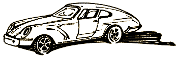

#### КОНЕЦ

# 46

— Вы играете с огнем, — говоришь ты как можно спокойнее, выжидая случая улизнуть.

— Попридержи язык, — огрызается Челеста.

— Ах так? — Ты неожиданно вскакиваешь и дергаешь скатерть. На Рауля и Челесту летит горячий гуляш.

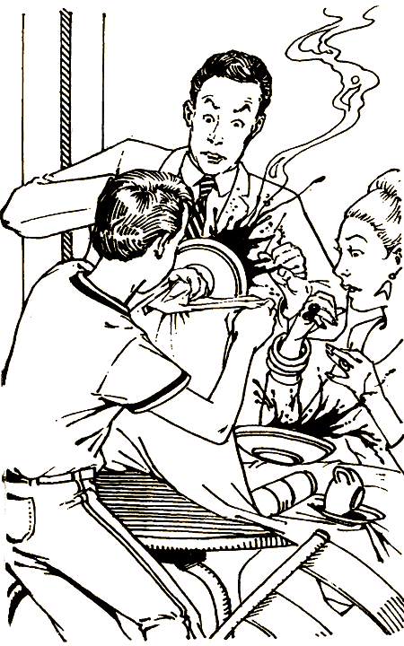

— Вот ты как! — орет Рауль, отпрыгивая от стола.

— Идиот! — визжит Челеста.

Ты на свободе. Нельзя терять ни минуты.

«Мазерати» стоит наготове, но, поколебавшись, ты устремляешься к лесу.

Углубившись в лес ярдов на сто, ты останавливаешься передохнуть. Вокруг огромные дубы, буки, сосны и лиственницы, подлеска же почти никакого. Спрятаться не так-то легко.

Через несколько минут сердце замедляет свой бешеный ритм. Отдышавшись, ты идешь дальше в лес.

— Куда он побежал? — вдруг слышишь ты крик Рауля.

— Я откуда знаю? — сердито отвечает ему Челеста.

— Иди на север, а я — в другую сторону. Этот ублюдок от нас не уйдет!

Ты двигаешься как можно тише, стараясь не попасться им на глаза. И вскоре выходишь на задворки ресторана, но там стоит Эрик и тот низкорослый молодой человек, что был с ним в парижском кафе. Они расспрашивают о чем-то официанта и не замечают тебя.

— Подождем здесь, Эрик, — говорит молодой. — Нет смысла гоняться за ним по лесу. Он не мог уйти далеко.

— Следи за машинами, — предупреждает Эрик.

— Не беспокойся, мимо меня никто не проскочит, — отвечает тот с угрозой в голосе.

И тут ты различаешь голоса большой группы школьников. Ребята кричат, поют и толкаются. Шум перекрывает голос взрослого мужчины, как ты догадываешься, вожатого. Он выкрикивает команды, но никто его не слушает.

Наконец ты их видишь. Это отряд человек в тридцать, все одеты в форму защитного цвета. У них за спиной рюкзаки, а у многих в руках походные палки.

Эта неуправляемая толпа движется без всякого порядка, некоторые ребята твоего роста, так что тебе нетрудно пристроиться к ним и стать почти незаметным. Вожатый — молодой человек со светлыми волосами. Ты подходишь и обращаешься к нему на немецком языке, который учил в школе.

— Здравствуйте, — говоришь ты.

— Привет, — отвечает он.

— Я из Америки, — продолжаешь ты, проходя вместе с толпой мимо ресторана и удаляясь от него по тропинке, огибающей стоянку.

— Ну, и как тебя зовут? — спрашивает он.

Ты отвечаешь.

— А меня зовут Карл, — сообщает он, и вы обмениваетесь рукопожатием.

Вы продолжаете беседовать и доходите до большого старого автобуса. Вся группа забирается в него.

— Хочешь поехать с нами? — спрашивает Карл.

— Конечно, — отвечаешь ты, залезая в автобус.

Карл заводит старый мотор, и лесной ресторан остается позади. Ты едешь в Нюрбергринг, чувствуя себя совершенно измотанным. Там ты, разумеется, найдешь полицейский участок, однако тебя беспокоит, что никто не поверит этой фантастической истории, ведь у тебя ни единого доказательства.

— Карл, вы сможете высадить меня в центре города? — спрашиваешь ты.

— Конечно. А вечером приходи к нам обедать.

— С огромным удовольствием, — отвечаешь ты. — Но сначала мне нужно кое-что сделать.

Немного спустя ты уже рассказываешь свою историю полицейскому, опуская только события в парижском кафе. В конце концов, ты не вполне уверен, было ли это на самом деле.

Вечером вы празднуете твое избавление с Карлом и его скаутами. Хуберт тоже с вами. Он подавлен всем, что тебе довелось пережить, но ты успокаиваешь его.

— Не переживай, Хуберт, получилось даже интересно, — убеждаешь ты. — Такого лета у меня еще не было.

#### КОНЕЦ

# 51

Запинаясь, ты отказываешься от предложения Рауля, говоря, что ты бы хотел добиться чего-нибудь на своем «феррари».

— Ладно, — говорит Рауль. — Мне нравятся люди, которые знают, что им нужно. Генри останется с тобой. Я пойду встречу друга. Еще увидимся.

Весь остаток дня ты поглощен работой и переживаниями. Около трех к тебе подходит Хуберт.

— Ты такой подавленный, что случилось? — спрашивает он.

— Предстартовая лихорадка, полагаю, — отвечаешь ты.

— Нет, это что-то серьезнее, — настаивает он.

— Говоря по правде, эти Рауль и Генри мне не нравятся. Я нутром чувствую: им нельзя доверять.

— Знаешь, я с тобой согласен. Что-то в этом Генри меня пугает. Не могу сказать точно, но…

— Лучше держаться от них подальше, — предлагаешь ты.

— Договорились! Надо доверять интуиции, — говорит Хуберт. — Положись на меня, я все устрою.

Через два часа, когда Генри уже ушел, вы с Хубертом располагаетесь около своей машины и едите бутерброды, запивая их кофе и минеральной водой.

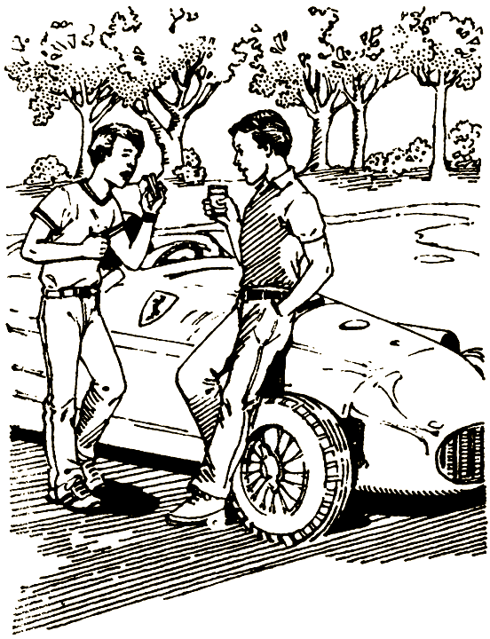

— Давай обсудим стратегию, — говорит Хуберт, допивая кофе.

— Прекрасно, я готов, — отзываешься ты.

— Среди твоих соперников несколько прославленных гонщиков прошлых лет. Они и сейчас в такой же форме, как и тридцать лет назад. Ты не должен ошибиться, это тебе не воскресная прогулка.

— Понятно, — говоришь ты. — Продолжай.

— Я знаю, что тебе это прекрасно известно, но давай повторим еще раз. Стирлинг Мосс, самый лучший гонщик на свете, утверждает, что вождение — это…

Не дав Хуберту докончить, ты выпаливаешь:

— Уравновешенность, спокойствие, невозмутимость, настойчивость, сила, реакция и рассудительность.

— Отлично! — восклицает Хуберт. — И не забывай, что ключ к победе — корнеринг.

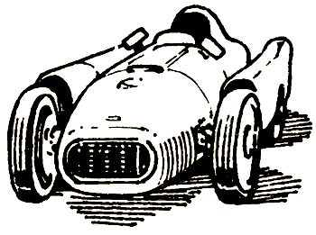

— Хуберт, расскажи мне о гонке за лидером, — просишь ты. Ты слышал о ней много раз, но тебе хочется узнать, что скажет он.

— О, это настоящее искусство! Величайшим мастером в гонке за лидером был Мосс. Он садился на хвост Фанжио, как комар, и, что бы Фанжио ни делал, Мосс не отрывался от него больше чем на десять футов. Десять футов, ты понимаешь? И это при скорости сто двадцать миль в час! Фанжио просто с ума сходил, видя Мосса у себя на хвосте. А Мосс ехал налегке, экономя горючее, торопя Фанжио, заставляя его жечь сцепление. Ах, какое было времечко!

— Велосипедисты тоже так делают, — говоришь ты. Дома ты участвовал в юношеских гонках на велосипедах и знаешь, что даже для велосипедистов это опасная штука. Одна ошибка — и вы оба завалитесь. А для гонщиков — неминуемая катастрофа.

— Это тебе не велосипед. Помни, что гонка за лидером — только развлечение. Не вздумай рисковать жизнью. Она стоит большего, — предупреждает Хуберт.

— А кстати, как там насчет Рауля и Генри? — озабоченно спрашиваешь ты.

— Не знаю. Ну их. Таких типов ты встретишь на любых соревнованиях. Мошенники, — говорит Хуберт беззаботно.

Вернувшись в отель, ты видишь на конторке портье адресованное тебе письмо. Хуберт его не заметил, и ты ничего не говоришь ему. Ты и так причиняешь ему массу хлопот.

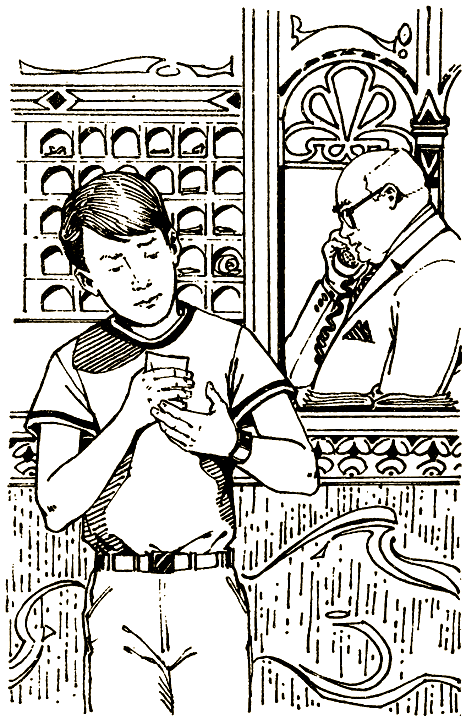

Вскрыв письмо, ты удивляешься тому, что там написано.

«Будь осторожен, мой юный друг. Будь осторожен на гонках. По этой трассе бродит смерть. Держись подальше от других машин. Не доверяй никому и будь все время начеку. Я знаю, о чем говорю.

Твой друг Рауль».

Ты ломаешь голову: что значит эта записка? То ли просто дружеское предостережение, то ли за ней скрывается какой-то зловещий смысл. Может быть, надо найти Рауля, показать ему письмо и серьезно поговорить? Хотя возможно, что он его и не писал. Все начинает слишком усложняться!

Искать [Рауля](#54) или выбросить записку [из головы](#89)?

# 54

После обеда ты просишь у Хуберта извинения и выходишь прогуляться. Садишься в «ренджровер» и мчишься к отелю, где живет Рауль. Его имя записано в регистрационной книге. Ты рассчитываешь, что он в своем номере.

Твой расчет оказался верен, но ты ожидал совсем не такого приема, который тебе оказали. Рауль, Генри, женщина с каштановыми волосами и двое мужчин — один темноволосый, другой седой — приветствуют тебя более чем прохладно.

— Мы не любим, когда на нас плюют, — говорит Рауль, направляясь к тебе. Седой хватает его за руку и останавливает.

— Рауль имеет в виду, мой милый американский дружочек, что ты, похоже, принял неправильное решение. Ты нас не знаешь, зато мы знаем о тебе все.

— Возможно, — отвечаешь ты, отступая к двери.

Генри настигает тебя.

— Никаких «возможно», — продолжает седой. — Или ты с нами заодно, или тебе не пережить этих гонок. Мы ведем себя благородно, мы вовсе не такие уж злодеи. Но бизнес есть бизнес, тебе как американцу это должно быть понятно. Гонки открывают хорошие возможности для бизнеса. Не примешь наши условия — пеняй на себя.

— Не думаю, — отвечаешь ты, собрав все свое мужество и хладнокровие. — Перед тем как прийти сюда, я не поленился позвонить в Интерпол. Если не ошибаюсь, они занимаются как раз тем, что пресекают подобные махинации.

В этот момент дверь распахивается, и в комнату врываются три человека с автоматами.

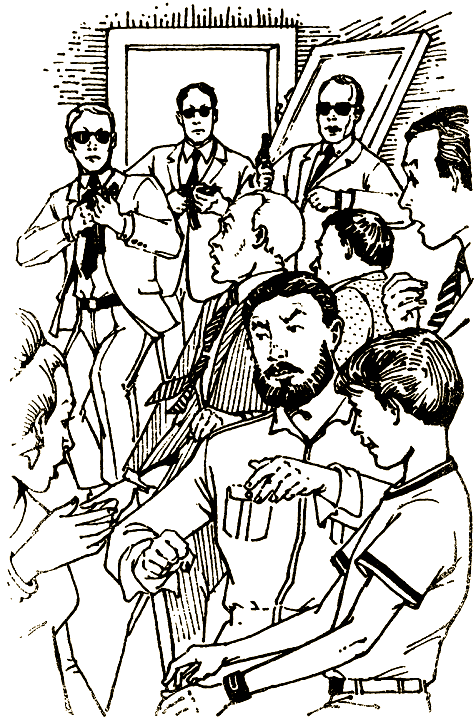

— Встать лицом к стене! Мы записали ваш разговор, и могу добавить, что мы следим за вами, мсье Рауль де Жардан, с того самого случая в Монте-Карло, — говорит руководитель отдела по борьбе с мошенничеством.

Рауля, Генри и всех остальных уводят.

Через шесть дней ты принимаешь участие в соревнованиях и занимаешь почетное четвертое место в своем классе. Ты не выиграл, но все-таки пришел к финишу. И после всего, что тебе пришлось испытать, ты собой доволен.

#### КОНЕЦ

# 71

— Нет времени останавливаться, — говоришь ты, проезжая мимо машины. — Возможно, это ловушка, подстроенная Раулем и его дружками. Как ты думаешь?

— Не знаю, что и думать, — отвечает Мари-Лиз. — Все эти штучки Рауля ужасно неприятны. Дядю Эрика всегда считали в семье паршивой овцой. Но такое!..

Ты легко выполняешь последний вираж на горном участке трассы. Мари-Лиз подсчитывает секунды, пока вы подъезжаете к контрольному пункту на вершине горы.

— Тормози, приехали! — кричит она.

У складного столика стоят три человека с планшетами. Они рассматривают твой номер, а один записывает его.

— На две секунды раньше. Отлично, без штрафных очков. Поезжайте дальше.

Ты выжимаешь сцепление, и «порше» летит с горы той же дорогой, какой только что поднялся. Следующий контрольный пункт в Италии, за французской границей. Путь туда долгий и трудный. Несмотря на усталость, вам приходится быть все время начеку.

Когда вы снова проезжаете мимо «санбим-тальбота», рядом стоят еще три машины, водитель наклонился над неподвижным телом, лежащим на обочине, несколько человек опустились на колени перед ним. Похоже, что делают массаж сердца.

— Надо было остановиться, — говоришь ты, поняв, что этому человеку действительно нужна была помощь.

— А мы не остановились. Не вини себя, — говорит Мари-Лиз. — Что сделано, то сделано. Откуда было знать? Не суди себя слишком строго.

Ты согласен с тем, что она говорит, но чувство вины не оставляет тебя. Теперь уже ничего не исправишь, и вы едете дальше.

Пять дней вы с Мари-Лиз путешествуете: по горным дорогам, по узкой извилистой трассе, по скоростному треку, в потоке транспорта по людным городам. И в конце концов заканчиваете гонки в Марселе.

Ты не победил в своем классе и, честно говоря, вообще далек от призового места. Но ты выложился как мог и дошел до финиша, так что есть чем гордиться.

Рауль и его дружки больше не показывались. То ли они затеяли какую-то более крупную игру, то ли испугались. Скорее всего, ты никогда этого не узнаешь.

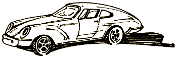

#### КОНЕЦ

# 78

Ты считаешь, что дело зашло слишком далеко, и ты не позволишь этим негодяям остановить тебя.

— Отойдите! — кричишь ты, нажимая на акселератор «порше» и ударяя в бок стоящей перед тобой машине.

Она отодвигается как раз настолько, чтобы тебе протиснуться. Ты прибавляешь газу. Но следующий поворот возникает слишком быстро. И хотя падать отсюда всего двести футов, этого хватит, чтобы положить конец твоей карьере гонщика.

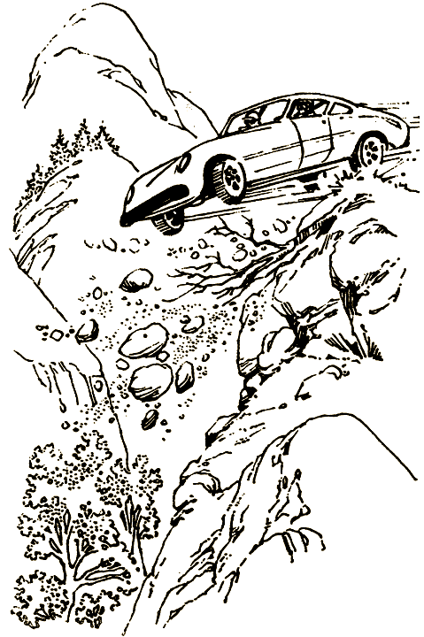

#### КОНЕЦ

# 87

— Хорошо. Какова моя доля? — спрашиваешь ты.

Рауль улыбается и отпивает глоток кофе.

— Ты схватываешь на лету. Ну что ж, меня это не удивляет. Америкой правят деньги. Твоя доля? Скажем так, мы дадим тебе столько, что ты будешь раскатывать на новых спортивных машинах всю свою жизнь, и даже дольше.

— То, что я должен сделать, касается только этих гонок? — спрашиваешь ты.

— Если мы посчитаем нужным, чтобы ты это сделал. Может быть, все будет совсем по-другому.

— А как вы проконтролируете остальные машины? — спрашиваешь ты.

— На все свои способы. Об этом не беспокойся, — вступает в разговор Челеста.

— Вы это придумали в парижском кафе «Три приятеля», так ведь? — внезапно выпаливаешь ты. На тебя наплывают воспоминания о том, что ты видел в Париже. Но, погоди, не было ли это сном?

— Этот проныра все знает! Нас выдали! — Челеста задыхается. На лице у нее изумление и страх.

— Успокойся, я все устрою, — говорит Рауль. — Сколько ты хочешь? — спрашивает он, сверкая глазами.

— Больше, чем вы сможете мне предложить, — отвечаешь ты.

Лицо Рауля багровеет.

— А ты жадный парень, — говорит он.

Ты напряженно думаешь, как быть, и тут тебе приходит идея. Конечно, рискованная, но сейчас ничего больше не остается.

— Я не один. Хуберт — представитель Интерпола, — говоришь ты как можно спокойнее. — Сейчас он наблюдает за нашей встречей. Если не верите мне, спросите у своего дружка Эрика.

— Откуда ты про него знаешь? — спрашивает Рауль, теряя самообладание. Его красивое лицо искажено страхом.

— Он информатор. Двое других парней из кафе тоже под колпаком. Так что будем делать? Или вы пойдете со мной, или мне придется дать знак полиции.

Ты надеешься, что блеф удался.

— Все ты врешь, — говорит Челеста, к пей возвращается самообладание.

— Вовсе нет. Хотите еще доказательств? Пожалуйста. Генри, ваш механик, приехал тогда в кафе на мопеде, правильно?

Рауль и Челеста переглядываются испуганно и удивленно.

— Не отрицайте. Кончайте это, и пойдем.

Ты делаешь знак официанту.

Он проворно подбегает к тебе.

— Следите, чтобы эти люди не ушли, не заплатив. А мне надо позвонить, — говоришь ты тихо.

Ты вскакиваешь и бежишь. Рауль и Челеста так поражены, что несколько секунд сидят неподвижно. Этого тебе как раз хватает, чтобы добежать до «мазерати». Ключ все еще в замке зажигания.

— Давай, черт тебя побери! Давай! — уговариваешь ты машину. Она подчиняется. Отпустив сцепление, ты рванулся с места. Машина будто стала частью твоего тела. Она словно предчувствует повороты и появление других машин на узких участках.

— Полиция, вот что мне нужно, — говоришь ты вслух. — В Нюрбергринге, готов поспорить, есть полицейский участок.

Километров шесть по шоссе — и ты въезжаешь в город Нюрбергринг. Рядом с ратушей полицейский участок. Но ты ожидал совсем не такого приема. Тебя сразу же арестовывают за угон машины и за то, что ты сбежал из ресторана, не заплатив по счету. Все твои объяснения вызывают смех и недоверие.

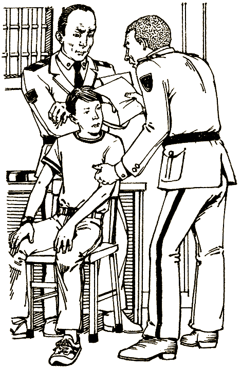

Тебя держат целый день, Рауль и его шайка, конечно, успевают удрать. Пока тебя допрашивают, приезжает Рауль, спокойно забирает свой «мазерати» и уезжает.

— Итак, мой юный друг, почему вы угнали машину? — спрашивает полицейский. — Вот, пожалуйста, заявление! — Он трясет перед тобой документом.

— Но я не крал… — возражаешь ты. Офицер улыбается, и улыбка его отнюдь не дружеская. Время тянется еле-еле, ты изо всех сил мечтаешь, чтобы появился твой двоюродный брат. Хуберт наверняка все поймет. А вот объясняться с полицией — совсем другое дело.

#### КОНЕЦ

# 89

Ты решаешь, что о некоторых вещах лучше совсем не думать. Комкаешь записку Рауля и выбрасываешь ее в мусорную корзину в своей комнате. С этого момента ты сосредоточиваешься только на гонках, стараясь не думать о тех пятерых из кафе и о своем странном путешествии в Париж.

По утрам ты изучаешь трассу на «ренджровере», а днем тренируешься на «феррари», гоняя его по треку. Машина отлично слушается, несмотря на ее огромную мощность и скорость.

Напряжение растет по мере того, как толпы болельщиков наполняют город. Поля превращаются в разноцветные палаточные городки. Красные, синие, зеленые, желтые и оранжевые палатки похожи издали на цветы. Самые экзотические спортивные машины — начиная от «мерседеса» с цепным приводом до «тальбота-лаго» и «испано-суисы» — раскатывают по переполненным дорогам вокруг Нюрбергринга.

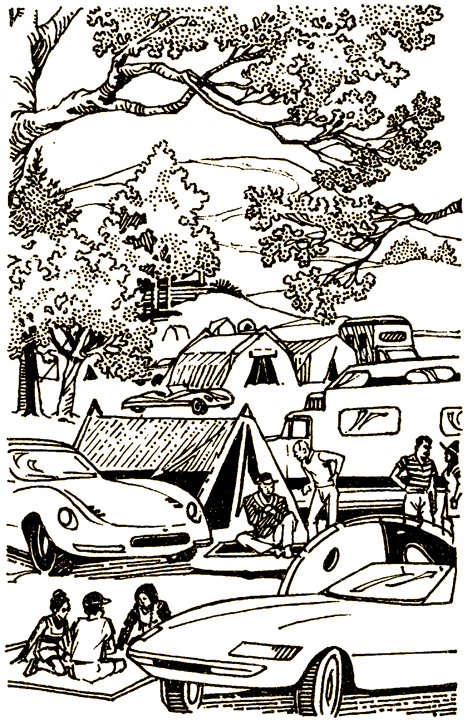

— Полюбуйся на них, — говоришь ты Хуберту.

— Глупость, ничего не скажешь, — отвечает тот серьезно. — Полмира голодает, а мы тратим время и деньги на такие вот игрушки. Давно пора проснуться!

Ты поражен внезапной переменой в настроении Хуберта.

— Хуберт, но ведь тебе все это нравилось. Что случилось? — говоришь ты, сбитый с толку его словами.

— В таких случаях это всегда приходит мне в голову. Работа в банке связана только с деньгами. Кажется, они одни интересуют людей. По крайней мере тех, которых я знаю. Но когда я бываю в Африке, чтобы проверить, как идут дела на фабрике, которую мы финансируем, или в Индии, то вижу совсем другую картину. Люди умирают с голоду целыми семьями, пока мы развлекаемся этими дорогими игрушками. Бессмысленное занятие! — Он смотрит на тебя, и до тебя внезапно доходит суть его слов.

— Надо что-то делать, — говоришь ты, готовый изменить свою жизнь.

— Но что? — спрашивает Хуберт, в голосе его звучит безнадежность.

— Давай бросим эти гонки. Продадим машину. И займемся осуществлением какого-нибудь проекта ООН. Ты ведь знаком с ребятами из Женевы. Поедем к ним. У меня еще почти целое лето впереди.

Хуберт глядит на тебя с любопытством.

— И ты готов все бросить? Эти гонки, эти переживания?

— А почему бы и нет, Хуберт? В конце концов, разве так важно, обгонит ли одна машина другую? Разве это так важно? — спрашиваешь ты, удивляясь самому себе.

— Ты рассуждаешь очень разумно для своих лет, братишка. За оставшуюся часть лета многого нам не сделать, но начать можно. Уже несколько лет я чувствую какое-то неудовлетворение, тратя время и деньги на машины. Этим летом я просто не хотел расстраивать тебя.

— Хуберт, ты не только мой брат, ты мой друг и учитель, — говоришь ты.

— Нет, ты тоже кое-чему меня учишь. Твое желание бросить гонки ради трудного дела придает мне сил. Спасибо, братишка.

— Давай собираться, — говоришь ты и представляешь себе область Сихель в Африке: там из года в год наступает пустыня Сахара, выгоняя с родной земли пастухов и крестьян. Нужда преследует их повсюду, куда бы они ни двинулись.

— Давай прямо сейчас пойдем в представительство ООН. Наверное, мы сможем принять участие в осуществлении какого-нибудь проекта орошения. Знаешь, можно бурить колодцы и отводить воду на поля.

— С этого можно начать. А давай останемся еще на один день и посмотрим гонки?

— Нет, надо ехать, — говоришь ты с печалью и сожалением, которые смягчаются ожиданием новых волнующих приключений. Кто знает, что уготовила тебе судьба?

#### КОНЕЦ

# 90

— Я выбираю «феррари» и гонки «Гран-при», — наконец говоришь ты. — А теперь что? — добавляешь ты, немного растерянный оттого, что мечта осуществляется.

— Ну, дружок, нам надо подготовить машину, переправить ее в Германию и проверить трассу.

— А сколько я смогу потренироваться? — интересуешься ты. В Нюрбергринге, как известно, один из самых сложных треков в мире.

— Целую неделю. Там не больше нашего хотят аварий. Но помни, тренировка — это только тренировка. На гонках все по-другому.

— Я буду тренироваться на «феррари»? — спрашиваешь ты.

— Нет. Будем тренироваться на обычной машине, — отвечает Хуберт.

— На обычной машине? Да какая же это тренировка? — Предстартовая лихорадка усиливается.

— Знакомство с трассой — это ключ к успеху или, я бы сказал, один из ключей.

Вы с Хубертом грузите «феррари» на платформу, цепляете ее к новенькому «ренджроверу» и отправляете в Германию Тебя охватывает волнение, все еще не верится, что Хуберт оказывает тебе столько доверия и полагается на тебя. Ты рад, что он будет с тобой во время гонок.

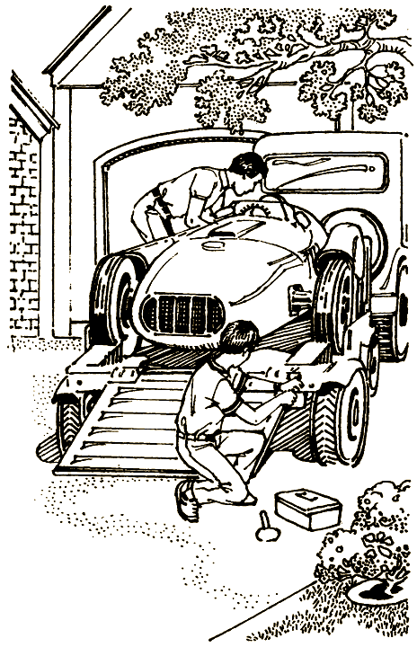

Миновал полдень. Ты тешишь себя мечтами о победе и не хочешь думать о том, что можешь и погибнуть. В конце концов, авария — это часть автогонок. Не упуская этого из виду, ты стараешься не пугаться, держать себя в руках и быть всегда начеку.

Наконец вы добрались до знаменитого Нюрбергринга в Германии. Трек очень хорош, но сейчас он пуст.

Взглянув ка трассу, вы едете в городок Квиддельбах, что в четырнадцати милях от Нюрбергринга, и снимаете номера в маленьком отелё.

— Вы Хуберт д'Альбер? — спрашивает хорошо одетый загорелый человек, поднимаясь вам навстречу в вестибюле отеля.

— Да, — отвечает твой двоюродный брат. — А вы, сэр?

Рауль де Жардан, к вашим услугам. Я восхищен вашей карьерой — и в банковском деле, и в спорте, — продолжает он. Ты видишь, что ему далеко за тридцать, но он красив и в хорошей форме. — Я здесь с механиком. К сожалению, моя машина сейчас в ремонте, так что позвольте предложить наши услуги, бесплатно, разумеется. Это доставит мне огромное удовольствие.

Рауль поворачивается к тебе и ободряюще улыбается. У тебя смутное ощущение, что ты уже видел этого человека. Ты не помнишь, когда и где, все это очень туманно и неопределенно.

— Благодарю за чудесное предложение, Рауль, — говорит Хуберт и поворачивается к тебе. — Как ты думаешь, можем мы принять их помощь? Включим их в нашу команду?

Тебе не очень улыбается брать в команду совершенно незнакомых людей, тебя трясет от этого Рауля. Но всякая помощь хороша. Возможно, твои страхи связаны с предстартовой лихорадкой.

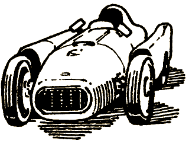

[Повременить](#109) и получше узнать Рауля и его механика или [согласиться](#101), чтобы Рауль тебе помогал?

# 100

Ты медленно открываешь дверцу машины и удрученно выходишь на дорогу. Предстоит серьезная схватка. Ты решаешь не торопиться и посмотреть, что будет.

— Что вам нужно?

— Нужен только ты. А тебе, Мари-Лиз, лучше не высовываться. Иначе твоему бедному папочке придется выложить кучу денег. Мы знаем кое-что о его делишках в Латинской Америке.

— У тебя ничего не получится, дядя Эрик! — кричит Мари-Лиз.

— Ошибаешься, получится. Ты скажешь, что американец струсил и бросил это ралли. А ты доедешь до финиша. Ясно? И помни, на карту поставлена репутация твоего отца. Не будь дурой и слушай меня.

— Получи, скотина! — кричишь ты и прыскаешь в лицо Эрику из баллончика.

Прежде чем они успевают прийти в себя, ты хватаешь Мари-Лиз за руку, вы перескакиваете через ограждение и летите вниз по склону холма. Вы катитесь через валуны, кусты, кучи мелких камней до следующего витка дороги, где как раз появляется вереница машин.

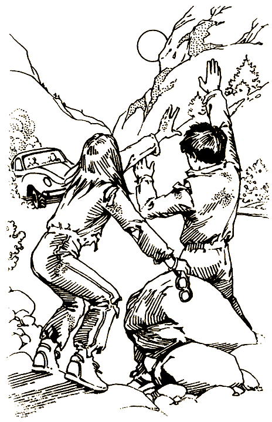

— Помогите! — кричишь ты.

Третья машина в потоке тормозит и останавливается у обочины, вы с Мари-Лиз забираетесь в нее.

— В полицию! — кричишь ты.

Водитель не дожидается никаких объяснений. Он кивает и несется по извилистой дороге.

— Самое жуткое ралли из всех, где я участвовал, — спокойно говорит штурман, не поднимая головы от своих карт и часов. — Полицейский участок, кажется, на следующем контрольном пункте.

Первое в твоей жизни ралли, похоже, окончено, но вы теперь спасены, а судьба непременно еще подарит тебе успех.

#### КОНЕЦ

# 101

Рауль, не сомневаясь в успехе, терпеливо ждет ответа. Несмотря на неприязнь к нему, ты киваешь в знак согласия.

— Хорошо, договорились, — говорит Рауль, ласково похлопывая тебя по плечу. — Сейчас подойдет мой механик, отличный парень, он из Марселя. Давайте поглядим на вашу красавицу.

— Конечно, — говорит Хуберт. — Идемте.

Ты подходишь к прицепу, на котором стоит укрытый брезентом «феррари». У прицепа околачивается человек в синей спецодежде. Он маленького роста, коренастый, с мускулистыми плечами. Во рту у него крепкая французская сигарета. Он вынимает окурок, бросает на землю и растирает ботинком. Ты замечаешь, что левый каблук у него выше, чем правый.

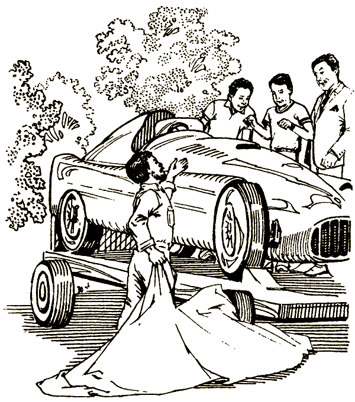

— А это мой механик Генри, — наконец произносит Рауль.

Генри молча кивает. Не дожидаясь указаний, он стаскивает с «феррари» брезент, словно выставляя шедевр живописи на всеобщее обозрение. Машина сверкает в ярких лучах солнца, тебя пронизывает волнение и гордость. Даже не верится, что ты поведешь эту машину. Но в ту же минуту тебе становится стыдно за свое тщеславие.

— Хороша! Эта машина должна выиграть. Нутром чую, — говорит Генри.

— Давайте спустим ее и сделаем кружок, — весело предлагает Хуберт.

— С удовольствием, — отзывается Рауль.

«Феррари» осторожно скатывают с платформы, ее шины скрипят по гравию.

— Мы в самом деле можем прямо отсюда поехать на трек? — спрашиваешь ты.

— Да, конечно. Получите номер — и поезжайте себе на здоровье. — Рауль, похоже, хорошо осведомлен. — А пока Генри и твой брат будут проходить формальности, почему бы нам с тобой не съездить на моей машине и не осмотреть как следует трассу?

Рауль поворачивается к Генри и быстро говорит что-то на непонятном языке. Тебе кажется, что Генри вздрогнул, услышав приказание Рауля.

— Я велел ему позаботиться о бензине, масле и обо всем прочем, что может нам понадобиться. Ну, вы знаете, свечи зажигания, фильтры для топлива…

— Но у нас своих полно, — возражаешь ты.

— Я люблю быть уверенным в таких вещах. Мы поставим свои.

Тебя беспокоит, что этот человек так легко и быстро взял власть над Хубертом. А Хуберт так поглощен машинами и гонками, что порой не замечает происходящего вокруг.

Однако от Рауля, похоже, гложет быть польза. Он излучает уверенность, и это приятно. Он, как тебе кажется, сильный и решительный человек.

— Вот моя машина. Садись за руль, — говорит он, у него в руках кожаный кейс с цифровым замком. Его машина — новехонькая «чубаско-мазерати», узкий капот и задний стабилизатор которой напоминают акулу. Двери — точно жабры. В ней нет ни капли изящества старых автомобилей. Но ее хищный вид почти привлекателен.

Хуберт весь поглощен «феррари». Одна половина тебя рвется поехать с Раулем, сделать пробный круг на треке, а другая требует быть осторожным и остаться с Хубертом.

[Принимаешь](#20) предложение Рауля или [отвергаешь](#51) его и остаешься с Хубертом?

# 109

— Хуберт, я только отнесу вещи наверх и сразу вернусь, — говоришь ты.

«Что делать?» — спрашиваешь ты себя, вбегая в комнату. Ты чувствуешь, что этот человек опасен. Ты отчаянно напрягаешь память.

В твоем сознании всплывает картина узенькой улочки в жаркий день, но все как-то размыто. Врываются обрывки разговора, но они настолько искажены, что ничего нельзя понять.

И вдруг вспышка, ты вспоминаешь все.

«Парижское кафе! Мошенники! Он был там! Они хотят меня убить!» И так же внезапно все исчезает. Остается только страх.

— Нужно сейчас же бежать и предупредить полицию! Я должен спасти Хуберта от этого парня! Я знаю, что делать. Я свяжусь с Интерполом. Нам помогут. — Ты так напуган, что говоришь все это вслух.

За несколько секунд ты сбегаешь по старой крутой лестнице на первый этаж. Направо какая-то дверь. Ты распахиваешь ее.

Оглянувшись по сторонам, ты выходишь на яркое июньское солнце.

— Куда собрался, дружочек? — раздается голос. Это говорит человек со взлохмаченными светлыми волосами. Они напоминают парик, но ты не до конца уверен. Твой взгляд прикован к его ногам. Каблук на одном ботинке выше другого.

— Просто хочу прогуляться, — отвечаешь ты.

— Пойдем-ка лучше со мной, — говорит он, и ты замечаешь у него в руке маленький черный револьвер. Он не шутит.

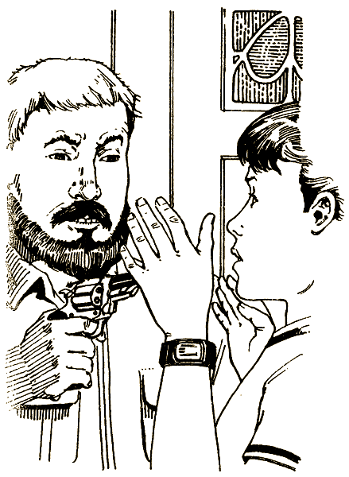

Пелена вдруг спадает с глаз. Это тот самый человек на мопеде, которого ты видел в Париже! Но было ли это на самом деле? Или только приснилось? Револьвер, однако, вполне реальный.

Ты идешь за ним. Вскоре объявляют твой розыск, а через некоторое время за пределами города обнаруживают твое тело. Твоя смерть кажется совершенно необъяснимой и ее объявляют очередной трагедией в мире гонок.

#### КОНЕЦ