# 0

## Рэймонд Алмиран Монтгомери

# ПУТЕШЕСТВИЕ НА ДНО МОРЯ

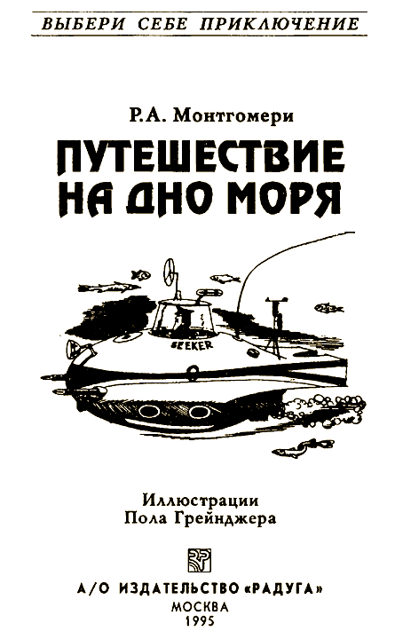

#### Моим друзьям Рэмси и Энсон

Это необычная книга. Не пытайся читать ее по порядку с начала до конца, переходя от одной страницы к другой, — ничего не получится! Ведь это игра, где тебя ждет множество приключений, на этот раз — на дне моря. Время от времени тебе придется делать выбор. Что принесет он? Успех или поражение?

Твои приключения — результат твоего выбора. Тебе самому решать, куда пойти, что сделать. А дальше — читай указания в конце страницы, и тогда узнаешь, к чему приведет твой выбор.

И помни: назад пути нет! Поэтому хорошенько подумай, прежде чем действовать. Игра есть игра: ты можешь проиграть, а можешь и выиграть!

### ОБ АВТОРЕ

Р. А. Монтгомери окончил Уильямс-колледж, он также изучал образовательные программы в Йельском и Нью-Йоркском университетах, занимал ряд административных должностей в Уиллистонской Академии и Колумбийском университете. В 1965 г. стал одним из организаторов Уэйт сфилдской летней школы. Продолжая работать в этом направлении, м-р Монтгомери участвовал в организации фирмы, специализирующейся на создании общеобразовательных программ. В качестве консультанта несколько лет он работал в Корпусе Мир в Вашингтоне и в Западной Африке. В настоящее время м-р Монтгомери занимается писательской и издательской деятельностью.

### О ХУДОЖНИКЕ

Пол Грейнджер — выпускник института Пратта, лауреат многих премий, известный художник и иллюстратор.

#### [Начать приключение](#2)

# 2

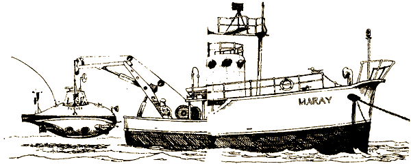

Ты подводный исследователь. Ты отправляешься на разведку морских глубин. Твоя задача — найти Атлантиду. Это самое трудное из твоих заданий.

Утро, солнце только показалось на горизонте. Море спокойно. Ты забираешься в тесную кабину подводной лодки «Искатель». Экипаж исследовательского судна «Мэрей» задраивает люк. И вот начинается погружение в морскую пучину. «Искатель» опускается на тонком, но прочном тросе. Всего несколько минут — и ты уже на такой глубине, что к тебе едва пробивается свет, а «Искатель» скользит все глубже и глубже. Ты глядишь в толстое стекло иллюминатора по левому борту и видишь проплывающих мимо рыб, временами они останавливаются поглазеть на тебя — пришельца из иного мира.

И вот уже трос, соединяющий тебя с «Мэрей», почти на исходе. Тебе придется остановиться у края впадины на морском дне, которая, возможно, ведет к пропавшему городу атлантов.

У тебя есть специальный гидрокостюм, который защитит тебя от огромного давления на глубине, если ты решишь прогуляться по морскому дну. Если хочешь, трос можно отцепить, у «Искателя» есть собственные двигатели. Теперь ты в другом мире.

Исследовать [морское дно](#6) или отцепить трос и нырнуть на «Искателе» [во впадину](#5) на дне океана?

# 5

Ты, как положено, передаешь по радио отчет на «Мэрей» и сообщаешь, что собираешься отцепить трос и погружаться по собственному усмотрению. Твой план одобрен. Теперь ты предоставлен самому себе. «Искатель» бесшумно скользит вниз.

Опускаясь во впадину, ты включаешь мощный прожектор. Прямо перед тобой темная стена, вся покрытая чем-то вроде морских рачков. Слева по борту ты видишь что-то похожее на грот. Вход совершенно круглый, будто сделан человеческими руками.

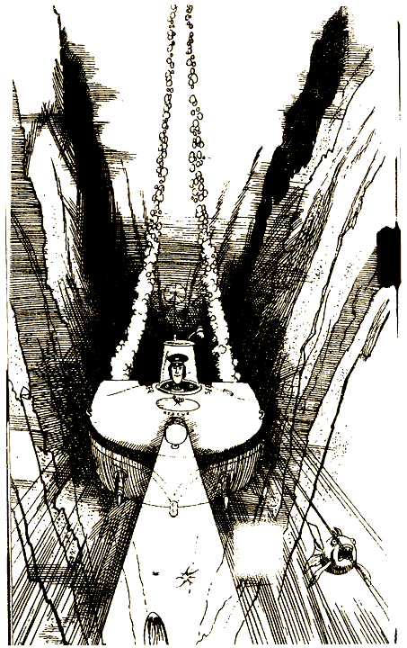

От проплывающей мимо рыбы исходит бледный зеленоватый свет. Справа по борту «Искателя» ты видишь пузыри, которые поднимаются со дна впадины.

Определить, [что это за пузыри](#8) или [обследовать грот](#9) с круглым входом?

# 6

Гидрокостюм защитит тебя от огромного давления на глубине. Ты проскальзываешь через воздушный шлюз «Искателя» — и вот ты на дне океана. Мир этот странен и удивителен, все движения в нем замедленны. Ты начинаешь разведку со специальным фонарем. Обследуешь уступ над впадиной.

Вдруг мимо, едва не задевая тебя, проносится стайка ярко-желтых рыб-ангелов. Что обратило их в паническое бегство? Кто-то за ними гонится?

А вот и он, ты его видишь. «Искатель» в объятиях гигантского морского чудовища! Оно похоже на кальмара, только очень-очень большого. «Искатель» все равно что игрушка в его длинных мощных щупальцах. Ты пытаешься укрыться за грудой камней. У тебя есть подводное ружье, но ты понимаешь, что против этого чудовища оно не поможет. Похоже, он сейчас разломает «Искатель». Вокруг носятся всевозможные рыбы, они тоже пытаются спастись.

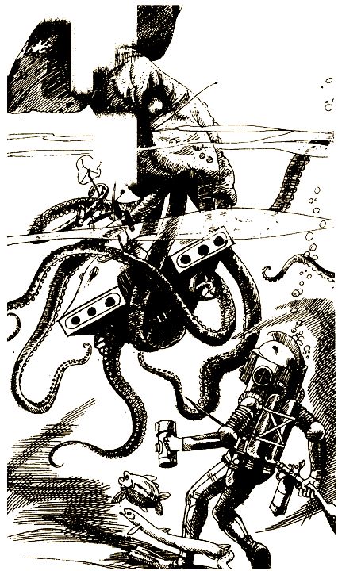

Продолжаешь [прятаться](#10) неподалеку от «Искателя» или постараешься [ускользнуть](#12) в надежде, что тебя заметят спасатели?

# 8

Ты осторожно ведешь «Искатель» вниз.

На дне впадины ты обнаруживаешь круглое отверстие, из которого выходят большие пузыри. «Искатель» оснащен специальным оборудованием, с помощью которого можно исследовать их состав. Есть и радиолокатор, которым можно измерить глубину любой скважины.

Определить [состав пузырей](#11) или узнать [результаты локации](#15)?

# 9

Ты направляешь «Искатель» в грот. Прожектор сразу же высвечивает какие-то проходы и проемы в стенах грота. Прожектор «Искателя» недостаточно мощный. Но у тебя есть еще специальный лазерный прожектор, который мог бы осветить грот как днем. К сожалению, пользоваться им можно только два раза, и то очень недолго, после чего его необходимо перезарядить на борту «Мэрей», которое теперь в двух тысячах футов над тобой.

Воспользоваться [лазерным прожектором](#16) или двигаться дальше [к гроту](#14)?

# 10

Гигантскому кальмару, который швырял и крутил «Искатель», надоела наконец его новая игра, и, выпустив огромную струю воды, он скрылся. Теперь ты можешь оставить свое убежище и проверить, насколько поврежден «Искатель».

К твоему ужасу, вход через воздушный шлюз заклинило. На «Искатель» тебе не попасть. Однако экипаж «Мэрей» заподозрил неладное, когда ты не отозвался на радиосигнал, и уже опускает для тебя спасательную платформу. Стоя на платформе, ты даешь сигнал начинать постепенный подъем на поверхность. Чтобы ты не заболел кессонной болезнью, когда кровь мгновенно наполняется пузырьками азота, тебя будут поднимать очень медленно.

Едва платформа приходит в движение, откуда ни возьмись снова появляется гигантский кальмар. Он плывет прямо на тебя.

Защищаться своим подводным ружьем, рассчитывая [отпугнуть чудовище](#17) или подать сигнал на «Мэрей», чтобы тебя подняли как можно быстрее, хотя знаешь, что тебя при этом ждет [кессонная болезнь](#18)?

# 11

Ты натягиваешь водолазный костюм и специальным оборудованием начинаешь исследовать пузыри. Во время работы ты неловким движением сбиваешь клапан, который удерживает сжатый воздух, необходимый для того, чтобы «Искатель» мог всплыть. Тут уж ничего не поделать, поэтому ты продолжаешь изучать состав пузырей. Они содержат высокий процент кислорода, ядовитых газов нет. Возможно, они поднимаются оттуда, где могут жить и дышать человекоподобные существа. Возможно, они поднимаются из Атлантиды.

Ты обдумываешь, не попробовать ли буровым устройством на «Искателе» расширить скважину, из которой выходят пузыри, и обследовать ее. Но тебя беспокоит то, что «Искатель» лишился возможности всплыть. Ты можешь попытаться собрать пузыри и с их помощью поднять «Искатель».

[Собрать пузыри](#24), выходящие из скважины, чтобы наполнить резервуар «Искателя» или [бурить](#22)?

# 12

Двигаясь с осторожностью, ты отплываешь как можно дальше. «Искатель» ты оставил в щупальцах гигантского кальмара. Ты собираешься подать сигнал о помощи красящим веществом, которое, всплывая, растекается на поверхности воды ярким желтым пятном. Члены экипажа корабля знают — им надо следить за возможным появлением такого сигнала бедствия, чтобы сразу послать помощь.

Едва ты избавился от чудовища и немного успокоился, как заметил самого страшного из морских обитателей — громадную акулу.

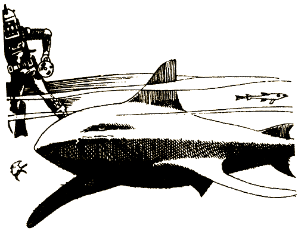

Она начинает плавать вокруг тебя, и ты знаешь, что ты для нее подходящая добыча. Ты решаешь, включать или нет спасательное устройство, которое выбросит тебя на поверхность. Акула движется быстро, она в любом случае поймает тебя. К тому же ты знаешь, что при быстром всплытии кессонная болезнь неизбежна.

Включить особое [спасательное устройство](#21), чтобы быстро выбраться на поверхность или тихонько [подождать](#19) в надежде, что акула уплывет?

# 14

Ты бесшумно плывешь в глубь грота. Тоннель постепенно расширяется. Перед то бой неожиданно возникает совершенно круглая дверь; такого металла, из которого она сделана, ты никогда не видел. Механическим щупом «Искателя» ты пытаешься открыть дверь.

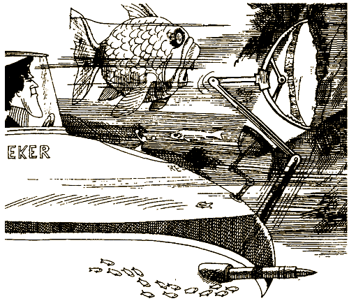

Она не поддается. Ты начинаешь передачу радиосигналов через дверь, надеясь установить контакт с теми, кто находится по другую ее сторону.

Проникнуть внутрь, [раздробив дверь](#26) при помощи взрывного устройства или продолжать [передачу радиосигналов](#28) через дверь?

# 15

Ты подвел «Искатель» к скважине и начал измерять локатором ее глубину. К твоему изумлению, локатор показывает, что скважина глубока невероятно — чуть ли не до центра Земли!

Что там внизу? Откуда идут пузыри? Неужели под тобой Атлантида?

И тут ты замечаешь тревожные показания своих приборов — произошло слабое землетрясение. «Искатель» не поврежден, но наверху землетрясение могло поднять цунами и вынудить «Мэрей» отплыть в более спокойное место. То, что ты не поднялся на поверхность и не отплыл на «Мэрей», может иметь опасные последствия. С другой стороны, возможно, ты стоишь на пороге одного из величайших открытий.

Спуститься [в скважину](#23) или решил [всплыть](#27)?

# 23

Пришло время принимать решение. Ты проверил все приборы на «Искателе», сжал зубы и задал рычагом управления курс на погружение. Ты опускаешься все ниже и ниже. «Искатель» построен в расчете на самые глубокие погружения, и ты стремительно скользишь вниз миля за милей. Давление становится все выше и выше, темнота полная, показатель глубины фиксирует — невероятно! — 15 миль. Ты быстро поворачиваешь рычаг, не желая погружаться дальше, На контрольной панели тут же вспыхивают аварийные лампочки, они показывают, что сила гравитации уже превысила мощность двигателей «Искателя». Ты уже пересек черту, за которой нет возврата, и твое путешествие вниз в кромешной тьме будет продолжаться, покуда давление воды не станет слишком большим для «Искателя». Это твое последнее путешествие.

#### КОНЕЦ

# 16

Луч лазерного прожектора освещает грот. Далеко внизу лежит подводная лодка! Ты осторожно подводишь «Искатель» поближе. И узнаешь в ней ту самую подводную лодку, которая почти год назад таинственно исчезла в Бермудском треугольнике. До Бермудского треугольника отсюда больше двух тысяч миль.

Подводная лодка, кажется, не повреждена, но вся покрыта склизкими водорослями. Вокруг плавают красивые рыбы. И тут ты замечаешь, что основной люк, через который можно попасть внутрь, свободен от водорослей!

Проникнуть в [подводную лодку](#29) или двигаться [дальше](#31)?

# 17

Взметнув струю воды, гигантский кальмар бросается на тебя. Два щупальца длиной почти в двадцать футов, покрытых пульсирующими присосками, тянутся к тебе, готовые схватить. Ты прыгаешь с платформы и быстро выпускаешь два гарпуна. Они вонзаются в кальмара совсем рядом от его ужасных глаз. Но он продолжает атаку.

Обхватив одним из щупалец твой водолазный шлем, он прорывает его. Ты выпускаешь свой последний гарпун, надеясь на этот раз поразить чудовище. В костюм начинает проникать вода. Ты подаешь на «Мэрей» сигнал «Аварийное всплытие». Должно быть, тебе все же удалось поразить кальмара. Ты чувствуешь, что близок к обмороку.

Ты приходишь в себя уже на борту «Мэрей», и тебя поспешно относят в лечебный шлюз, чтобы уменьшить эффект кессонной болезни. Через несколько дней ты чувствуешь себя гораздо лучше и начинаешь подумывать о новом погружении.

[Закончить](#32) экспедицию или [продолжить](#33) свои исследования?

# 18

Как только начинается быстрый подъем, тебе становится плохо: кружится голова, слабеют руки и ноги. Ты не можешь удержаться на платформе, и тебя, обессиленного, смывает водой. Тут ты замечаешь плывущего к тебе дельфина. Тебе известно, что эти замечательные млекопитающие порой помогают людям, попавшим в беду. Поможет ли он тебе?

[Узнать](#34), поможет ли дельфин или продолжать выбираться на поверхность [самостоятельно](#37)?

# 19

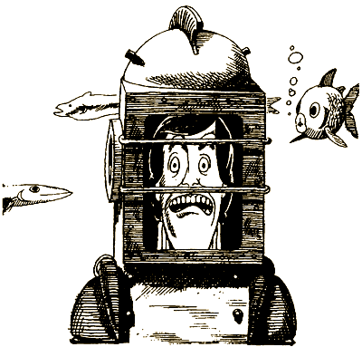

Ты ждешь, когда же наконец уплывет акула. Но затем замечаешь других акул, которые тоже, похоже, не прочь полакомиться. Они кружат неподалеку, каждый раз подплывая все ближе и ближе. Слишком поздно! Спасения нет!

#### КОНЕЦ

# 21

Ты включаешь особое спасательное устройство и взмываешь вверх, распугивая стаи рыб. 

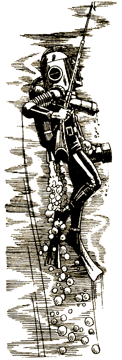

У тебя кружится голова, ты теряешь представление о том, где находишься. Кажется, весь мир перевернулся вверх тормашками. Ты надеешься, что акулы поблизости нет. Наконец ты на поверхности, примерно в полумиле от «Мэрей».

Вахтенные замечают тебя в воде и быстро поднимают на борт. К несчастью, из-за быстрого всплытия у тебя тяжелая форма кессонной болезни. Понадобится много времени, чтобы прийти в норму. А когда ты наконец совсем поправился, судовой врач сообщает тебе, что с погружениями покончено. Найти Атлантиду предстоит кому-то другому.

#### КОНЕЦ

# 22

Как только ты начал бурить, поток пузырей усилился.

Теперь ты можешь попробовать всплыть точно заметив место, откуда идут пузыри. Тогда можно было бы на борту «Мэрей» обсудить с учеными, как действовать дальше. Но ты мог бы и сам сейчас нырнуть в скважину на «Искателе» и определить, откуда поднимаются пузыри. Забираться в эту скважину очень опасно, но вдруг это приведет тебя к Атлантиде?

[Обследовать](#38) скважину или [подняться](#35)?

# 24

У тебя есть возможность собрать газ, который находится в пузыря х, и наполнить им резервуар «Искателя», тогда ты сможешь всплыть на поверхность. «Искатель» медленно поднимается вверх, распугивая стайки ярких рыбок и задевая подводные растения, которые колышутся, словно пальмы на ветру. Внезапно ты замечаешь нечто, напоминающее древнюю дорогу! Камни вдоль нее по обеим сторонам похожи на предохранительные столбики. Не этот ли путь ведет к потерянному городу атлантов?

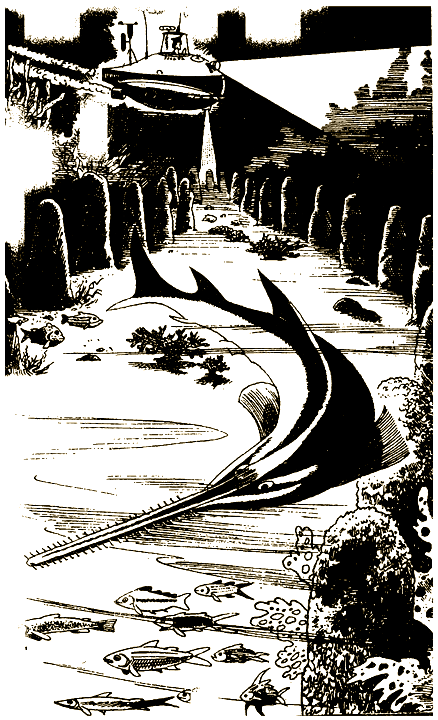

Ты ставишь «Искатель» на якорь и готовишься к более [тщательному осмотру](#6).

# 26

Единственный способ проникнуть за дверь — это взорвать ее, так тебе по крайней мере кажется. На «Искателе» есть мощная лазерная пушка, и ты переводишь ее в боевое положение. Нажав на кнопку «Огонь!», ты посылаешь луч в сторону двери. Ничего не происходит. Ты переводишь регулятор пушки на полную мощность. Снова нажимаешь на кнопку, и луч сразу же пробивает дверь. Потоки морской воды обрушиваются в пространство за дверью. Ты видишь, как несколько человек бросаются к спасательным люкам. Слишком поздно! Ты совершил ошибку.

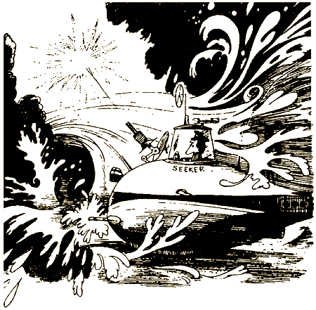

#### КОНЕЦ

# 27

Решив всплывать, ты осторожно направляешь «Искатель» обратно вдоль края впадины на дне океана. Неожиданно «Искатель» подхватывает сильное течение, которое увлекает его в грот. Ты оказываешься перед большой металлической дверью. Она отворяется, и ты попадаешь в помещение, сделанное, как ты полагаешь, человеческими руками.

В стене открывается дверь, и к тебе направляются два человека в простой одежде. Один из них говорит:

— Добро пожаловать в Атлантиду. Мы тебя ждали.

Вот это да! Ты нашел пропавший континент и его обитателей. Эти два человека говорят тебе, что, хотя жители Атлантиды и посещают иногда надводный мир, гостю из надводного мира никогда не позволят покинуть Атлантиду. Атланты не отличаются жестокостью, просто боятся, что их мир обнаружат.

Они хотят, чтобы ты пошел с ними, и ты соглашаешься. Но у тебя есть и другие планы. Может быть, тебе удастся выбраться из этого места при помощи лазерной пушки, которая есть на «Искателе».

Пойти с этими людьми и [остаться с атлантами](#39) или улизнуть на «Искатель» и попробовать [прорваться](#40) через закрытую дверь с помощью лазерной пушки?

# 28

Радиосигналы, похоже, ничего не дают. Как раз когда ты готов оставить это занятие, дверь внезапно распахивается, открывая расположенную за ней пещеру с еще одной дверью. Ты осторожно заплываешь внутрь и получаешь радиосообщение на английском языке. Тебе говорят, что приглашают тебя внутрь, но, если зайдешь, возможности вернуться в надводный мир не будет.

[Идти дальше](#41) и увидеть, что же такое Атлантида или [отступить](#42)?

# 29

Эта подводная лодка совершенно необычна. Ты надеваешь гидрокостюм, открываешь люк и попадаешь внутрь. Там царит чистота и порядок. Нет никаких признаков жизни, но нет и следов борьбы или разрушения. В главной рубке ты видишь какой-то таинственный прибор.

Некий голос сообщает тебе, что тысячи лет назад вожди Атлантиды обнаружили, что их континент погружается в море. Они нашли огромное пустое подземное пространство и построили для своего народа жилища совершенно нового типа. Позднее, когда Атлантида была уже глубоко под водой, несколько ее ученых открыли и разработали систему, позволяющую людям дышать в воде.

Голос, который звучит вполне дружелюбно, также сообщает тебе, что в Атлантиде живут два племени. Одно доброе, другое злое. Голос приглашает тебя в мир Атлантиды и говорит, где найти и как пользоваться потайным ходом в город.

Следуя указанному направлению, ты неожиданно замечаешь какое-то подводное судно с несколькими людьми на борту. Наверняка это корабль атлантов, но какие там люди, добрые или злые? Знают ли они про потайной ход?

Поспешить к [потайному ходу](#43), пока тебя не заметили или броситься к «Искателю», чтобы [уйти от опасности](#44)?

# 31

Ты плывешь по гроту вдоль корпуса подводной лодки и тут замечаешь еще один корабль. Потом еще один. Они тоже покрыты водорослями, но повреждений не заметно. Может быть, атланты ловят суда в Бермудском треугольнике и перетаскивают их сюда. Ты видишь еще один корабль, на этот раз трехмачтовую шхуну, из тех, что делали в начале XIX века. Ее снасти попорчены водорослями, рыбы лениво кружат у мачты.

Тебя охватывает любопытство, и ты натягиваешь гидрокостюм. Выйдя из «Искателя», ты направляешься к старинному кораблю. Внезапно из-за передней рубки на тебя бросается смертельно ядовитый морской змей тринадцати футов длиной и кусает в руку. Противоядия от его укуса не существует.

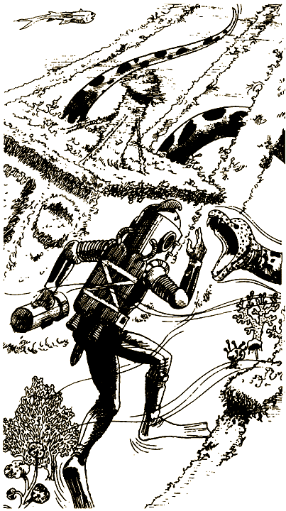

#### КОНЕЦ

# 32

С огромным сожалением ты приходишь к выводу, что самое разумное — оставить экспедицию. Не стоит снова рисковать опускаться на такую глубину. И вот ты с неохотой возвращаешься в Соединенные Штаты.

Несколько известных телевизионных программ приглашают тебя рассказать о твоих приключениях. Во время одной из передач в специальном выпуске новостей всему миру объявляют об открытии Атлантиды. Ты жалеешь о своем решении, но у тебя действительно не было выбора. Не так ли?

#### КОНЕЦ

# 33

Ты не можешь отказаться от приключений в морских глубинах. Тебе надо погрузиться еще раз, и после нескольких недель отдыха ты снова забираешься в «Искатель» и опускаешься на дно. Ты оставляешь «Искатель» у огромной впадины на дне океана и, надев специальный костюм, погружаешься еще глубже. Гигантского кальмара не видно, и ты чувствуешь себя в безопасности.

Обогнув груду камней, ты натыкаешься на остов древнегреческого судна. Как странно найти этот корабль нетронутым на такой глубине. Как он сюда попал? Может быть, он плавал в Атлантиду еще до того, как этот континент скрылся под водой?

Ты делаешь снимки и записи в специальном журнале. Возможно, этот древний корабль хранит тайну Атлантиды.

Подняться на [греческий корабль](#45) или вернуться [на поверхность](#46) и дать отчет о своих находках?

# 34

Дельфин смотрит на тебя, такое ощущение, что он тебе улыбается. Ты хватаешься за один из его плавников, и дельфин мощными рывками плывет вверх. Вскоре ты уже на поверхности. Ты жмуришься от яркого солнца. «Мэрей» нигде не видно.

Дельфин снова ныряет в воду, ты его не отпускаешь. Он плывет быстро, и через двадцать минут ты уже рядом с «Мэрей». Должно быть, дельфин услышал под водой шум моторов корабля.

Уже на борту все поздравляют тебя со спасением. Ты хочешь нырять еще раз, но тебя мучит сомнение: что, если удача от тебя отвернулась?

[Нырять снова](#48) на следующий день или пора [закончить экспедицию](#47)?

# 35

Ты видишь наконец, что поток пузырей достаточно силен, чтобы поднять «Искатель». Ты вводишь «Искатель» в центр потока, и он устремляется к поверхности. Вращаясь, ты поднимаешься вверх и замечаешь невероятное количество бурых водорослей вокруг тебя — это ламинарии. У самой поверхности ты совсем запутываешься в водорослях. Приборы «Искателя» показывают, что винты и рулевой механизм отказали.

Ты надеваешь гидрокостюм и выходишь посмотреть, что можно сделать. Оказавшись снаружи, ты понимаешь, что «Искатель» не освободить. Ты плывешь наверх, но вскоре замечаешь, что и сам совсем запутался в цепких водорослях. Ты в западне и не можешь двинуться ни вперед, ни назад.

Продолжать [пробиваться наверх](#50) или [спокойно отдохнуть](#53), набраться сил и выработать план действий?

# 37

Кто знает, придет дельфин на помощь или нет. Ты решаешь выбираться сам. Какое-то время дельфин следует за тобой, потом уплывает. Ты останавливаешься немного передохнуть перед последним рывком на поверхность.

И тут появляется отвратительная, надутая рыбина — вся в пупырышках и черно-белых пятнах. Она не отрывает от тебя своих выпуклых глаз. Это большеротый окунь — рыба, которая не утруждает себя тем, чтобы есть жертву по кусочкам, а попросту заглатывает ее всю целиком.

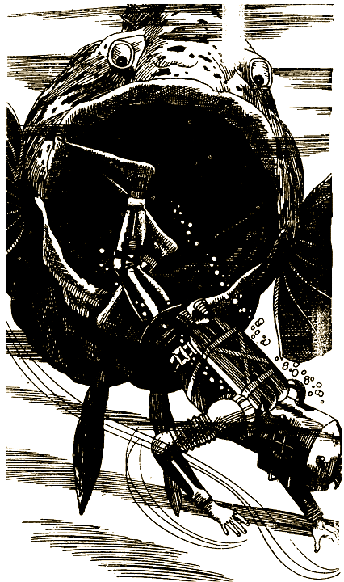

Похоже, ты — ее следующее блюдо.

#### КОНЕЦ

# 38

Ты решаешь отправиться на «Искателе» найти источник пузырей. Внезапно «Искатель» резко устремляется вниз, словно его притягивает гигантский магнит. Ты теряешь сознание. В себя ты приходишь уже в светлой уютной комнате. Рядом с тобой стоят три человека. Они выглядят как обычные люди и, кажется, настроены дружелюбно.

Средний говорит:

— Ты находишься в нижнем ярусе Атлантиды. Это комната для приема посетите лей. Если хочешь попасть в город, следуй за нами, но в свой мир ты уже не вернешься. Если хочешь уйти, мы доставим тебя на поверхность целым и невредимым. Выбор за тобой. Мы не желаем тебе зла.

Последовать за ними [в город](#55) или вернуться [на поверхность](#51)?

# 39

Тебя приводят в комнату. Пол покрыт мрамором. Стены и потолок светятся. Женщина, которая сразу внушает уважение, твердо, но приветливо делает тебе знак приблизиться.

— Добро пожаловать в Атлантиду. Несколько тысяч лет назад мы обнаружили, что континент вот-вот уйдет под воду. Наш народ подготовился к этому бедствию заранее, выстроив новый город в кратере потухшего вулкана. С тех пор мы живем здесь в мире и согласии. Мы не можем любоваться ни звездами, ни солнечным светом, но для наших грез есть иные пространства.

Она рассказывает тебе о племени людей, называемых нодорцами. Если хочешь, можешь жить с ними, но покинуть Атлантиду тебе в любом случае нельзя.

Судя по всему, жить здесь приятно, но все же быть пленником ты не хочешь. А вдруг сбежать будет легче, если ты вступишь в племя нодорцев? Ты расспрашиваешь о них своего проводника.

— Возможно, они опасны, мы не знаем. Они живут в самом центре старого вулкана. Если хочешь, я могу отвести тебя туда.

Если ты решил присоединиться к нодорцам, открой страницу [56](#56).

Если ты решил остаться с атлантами и найти какой-нибудь другой способ улизнуть, открой страницу [57](#57).

# 40

Многие тысячи лет атланты живут в мире. Они не любят сражаться. Их цивилизация достигла очень высокого уровня. Машина, читающая мысли, подсказывает им, что ты готов воспользоваться своей лазерной пушкой. Они быстро направляют на «Искатель» особый луч, и все его оборудование выходит из строя. Теперь у тебя нет возможности бежать. Они спокойно приближаются к «Искателю» и предлагают тебе отправиться с ними в Атлантиду.

— Теперь ты гражданин Атлантиды. Нам понятен твой страх, но не бойся. Ни тебе, ни твоей, жизни не будет причинено никакого вреда. Идем с нами.

По дороге в новый мир ты спрашиваешь себя, увидишь ли ты небо еще хоть раз.

#### КОНЕЦ

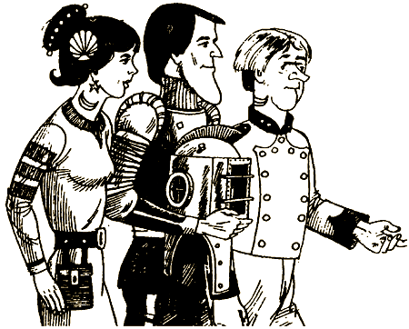

# 41

Тебя встречает несколько человек, похожих на обычных людей, только на шее каждого из них щель, напоминающая жабры. На босых ногах между пальцами видны перепонки. Эти люди приказывают тебе надеть гидрокостюм, быстро вытаскивают тебя из «Искателя» и ведут в свой город. По дороге они показывают тебе зоопарк, где держат животных из надводного мира, которые сидят в клетках типа стеклянных.

Начальник этой группы объясняет, что ты можешь, по желанию, либо согласиться на операцию и вставить жабры, которые позволят тебе дышать под водой, либо присоединиться к животным в зоопарке и жить в такой же клетке.

Соглашаешься [на операцию](#58) или предпочитаешь [жить в зоопарке](#59)?

# 42

Вернувшись на борт «Искателя», ты передаешь по радио на «Мэрей», что всплываешь, чтобы разработать дальнейший план действий. Во время подъема из гигантской, похожей на пропасть, расселины ты замечаешь нечто, напоминающее дорогу. Что это? Ученые, которые находятся на «Мэрей», упоминали о возможности обнаружить такие следы древней цивилизации, как дорога. 
Нужно [взглянуть на нее](#6) поближе.

# 43

С подводной лодки тебя не заметили. Пользуясь инструкцией, ты проникаешь в потайной ход. В конце коридора — дверь воздушного шлюза, а за ней — огромная, заполненная воздухом пещера. Возможно, она находится внутри потухшего вулкана.

Здесь все так странно. Землю покрывает что-то мягкое. Оно кажется живым. Ты точно не знаешь, что это такое. Со стен громадной пещеры льется мягкий свет.

К тебе подходит несколько человек, делая приветственные знаки. На них простая одежда, очень похожая на ту, что носили в Древней Греции. Ты снимаешь водолазный костюм — здесь можно дышать и без него.

Эти люди говорят на неизвестном тебе языке, но среди них есть переводчик. Они сообщают, что их правитель — жадный и эгоистичный человек. Весь народ живет на положении рабов. За исключением нескольких приближенных к правителю, все несчастны. Новые друзья просят тебя о помощи. Возможно, в твоих силах помочь им устроить побег.

Расстаться с новыми друзьями и [отыскать правителя](#60) или [помочь им](#61) бежать?

# 44

Ты бросаешься к «Искателю», стараясь ускользнуть от странной подлодки. Ты замечаешь, что подлодка преследует тебя, поэтому включаешь моторы на полную мощность. Чтобы поразить подлодку, ты можешь воспользоваться своей лазерной пушкой, но ты не хочешь никому причинять вреда.

Ты быстро плывешь вверх, но в нескольких морских саженях от поверхности все системы «Искателя» выходят из строя. Кажется, на тебя воздействовали какой-то таинственной силой.

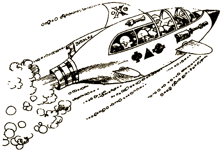

[Подождать помощи](#64) от «Мэрей» или выскользнуть из «Искателя» и выбраться [на поверхность](#63)?

# 45

Ты осторожно забираешься в каюту корабля. Повсюду разбросаны глиняные сосуды — древнегреческие амфоры, некогда наполненные маслом и вином.

Одна дверь ведет в небольшую каюту. В ней на столике у задней стены золотая шкатулка. Ты открываешь ее и находишь клочки карты. Атлантиды на ней нет. Но она показывает, что этот корабль искал отверстие, которое ведет к центру земли.

Ты возвращаешься на «Искатель» и, сверяясь с картой, стараешься найти эту поразительную скважину, идущую к центру земли. Наконец ты находишь вход в тоннель — круглое отверстие 100 футов в диаметре. Показания локатора свидетельствуют, что скважина не имеет дна.

Спускаться [в скважину](#65) или подняться [на поверхность](#66)?

# 46

Ты спокойно всплываешь, «Искатель» поднимают на борт «Мэрей». Тебя встречают ученые и команда. «Искатель» готов к второму погружению, но внезапно поднимается ураган, волны обрушиваются на палубу «Мэрей». Все силы брошены на борьбу с стихией. Нет никакой возможности начать новое погружение. Целые сутки «Мэрей» носит по бушующему морю.

К утру ветер стихает, небо проясняется. Теперь ты готов к [новому погружению](#48).

# 47

Чтобы вернуть тебя на авиабазу и отправить в Соединенные Штаты, выслали вертолет. Газеты объявляют, что поиски Атлантиды прекращены. Однако несколько месяцев спустя с тобой связывается группа ученых, которые считают, что найти Атлантиду можно. Они организуют новую экспедицию и хотят, чтобы ты присоединился к ним. Ты находишь это заманчивым. Тебя влекут приключения.

#### КОНЕЦ

# 48

«Искатель» снова опускается на дно океана. Мимо проплывают рыбы, разглядывая тебя в твоей металлической клетке. Солнечный свет меркнет по мере того, как ты погружаешься все глубже и глубже. Ты направляешься к огромной впадине на дне, которая, возможно, ведет к Атлантиде.

Добравшись до впадины, ты включаешь прожектор «Искателя» и видишь круглое отверстие, которое, похоже, сделано разумными существами. Может быть, оно ведет к Атлантиде.

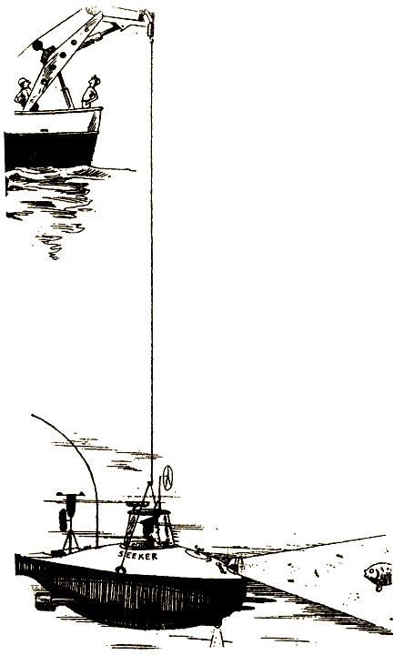

# 50

От усталости и нехватки кислорода у тебя кружится голова. Ножом ты рубишь заросли ламинарии. Мало-помалу ты пробиваешься на свободу. И вот, оторвав последние цепляющиеся отростки водорослей, ты взмываешь на поверхность. Ты выпускаешь специальную сигнальную ракету, и команда «Мэрей» быстро обнаруживает тебя. Через несколько минут ты уже на борту в безопасности, окруженный друзьями. Какое облегчение вырваться из этого кошмарного мира!

Будешь погружаться на следующий день [ещё раз](#67) или ты хочешь несколько дней отдохнуть и разработать [план действий](#68) на случай не предвиденных обстоятельств?

# 51

Трое жителей Атлантиды угадывают твое желание вернуться на поверхность. Моментально появляется шарообразная капсула, чем-то напоминающая мыльный пузырь, и тебя сажают внутрь.

— Прощай, землянин. Пусть жизнь твоя будет долгой и благополучной.

Ты взмываешь вверх и всплываешь рядом с «Мэрей». Достигнув поверхности, капсула растворяется. На борту «Мэрей» ты рассказываешь команде и ученым о своих приключениях. Они все очень добры к тебе, но ни один тебе не верит. Они считают, что Атлантида тебе привиделась — ты ведь слишком долго пробыл на такой глубине.

Уже в Соединенных Штатах ты начинаешь турне по стране, которое показывают по телевидению, и рассказываешь об Атлантиде. Ты пишешь статьи, потом книгу. Зарабатываешь на этом кучу денег. Тебя манит идея потратить эти деньги на новую экспедицию.

Потратить деньги на [новую экспедицию](#72) или [отойти от дел](#74) и жить в свое удовольствие?

# 53

Нет ничего хуже паники. Ты стараешься успокоиться и плывешь по течению, которое выносит тебя наверх. С помощью ножа ты пробиваешься через водоросли на свободу. Какое облегчение!

Но, едва выпутавшись из водорослей, ты попадаешь в воронку гигантского водоворота.

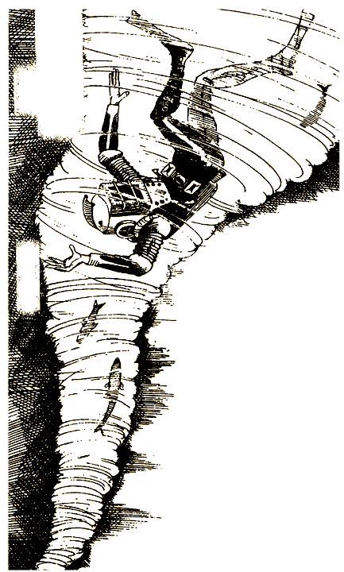

Выплыть [из водоворота](#69) или нырнуть вниз в надежде [достичь дна](#70) и таким образом выбраться?

# 55

Три человека приводят тебя в огромную пещеру, в центре которой стоит громадный серебристый корабль.

Тебя заводят внутрь. Это самый совершенный центр управления из всех, какие ты видел. Компьютеры, датчики, записывающие приборы, мониторы, множество циферблатов и панелей. Тебя встречает странный человечек с огромной головой и совершенно бесцветными глазами.

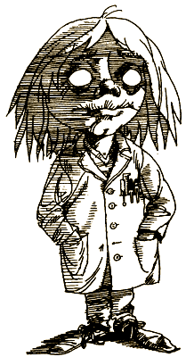

— Итак, ты в центре управления Атлантиды. Теперь ты знаешь нашу тайну. Мы приземлились на эту планету 3000 лет назад. Мы использовали наши знания в области антиматерии и опустили этот континент на дно моря, чтобы спрятаться от людей. Если хочешь, здесь у нас ты можешь вести приятную и полезную жизнь. Нужно только сделать инъекцию особой сыворотки, чтобы ты мог жить под водой. Это все. В противном случае, если ты не захочешь быть одним из нас, мы будем держать тебя как пленника.

[Соглашаешься](#71) на инъекцию или [отказываешься](#73)?

# 56

— Я хочу присоединиться к нодорцам, — говоришь ты своему спутнику.

Он выводит тебя за пределы города.

— Здесь я должен тебя оставить. Желаю удачи.

Нодорцы высылают навстречу группу вооруженных до зубов людей. Они думают, что ты — подосланный атлантами шпион. Они очень похожи на атлантов, но улыбаются куда реже.

— Идем. Тебя надо допросить. Возможно, ты будешь работать на нас.

Тебя допрашивают целых три дня и держат в каморке без окон. Это скверные люди, и ты понимаешь, что совершил ошибку. Они предлагают тебе помогать им шпионить за атлантами. По их мнению, ты, как шпион, сможешь беспрепятственно переходить от одного племени к другому.

[Сбежать](#75) или принять их [предложение](#76)?

# 57

Ты решил остаться с атлантами. Тебе нравится, как они живут — они посвящают все свое время созиданию, а не разрушению и ненавидят войны.

Ты очарован этим, по всей видимости, идеальным миром. Ты не прочь остаться и изучить историю Атлантиды и узнать, что породило раздор между атлантами и нодорцами. И все-таки ты еще лелеешь надежду сбежать и вернуться в надводный мир.

[Остаться](#77) и посвятить жизнь изучению истории Атлантиды или [бежать](#79)?

# 58

Ты лежишь на операционном столе, над тобой сверкает огромная лампа. Потом ты теряешь сознание. У тебя в голове крутятся приятные мысли, звуки, картины. Придя в себя, ты не чувствуешь каких-либо изменений, хотя теперь ты можешь дышать под водой.

Несколько недель ты обследуешь подводный мир. Без тяжелого акваланга на спине ты ощущаешь себя совершенно иначе и с восторгом познаешь новый прекрасный мир. Два твоих спутника становятся твоими самыми близкими друзьями и увлекают тебя к новым приключениям в глубинах. Это действительно восхитительная жизнь! Она тебе нравится, но ты все-таки жалеешь о том, что никогда больше не увидишь надводного мира.

#### КОНЕЦ

# 59

— Нет, я отказываюсь от операции. У меня нет желания превращаться в рыбу!

Атланты пробуют убедить тебя, что с ними твоя жизнь будет долгой, счастливой и полезной. Ты все-таки отказываешься. Они с грустью вздыхают и прыскают на тебя особой жидкостью, отчего ты сразу падаешь в обморок. Несколько часов спустя ты приходишь в чувство и обнаруживаешь, что находишься в резервуаре, наполненном воздухом, где можешь нормально дышать. Ближайший сосед твой — лошадь, которая смотрит на тебя с жалостью и сочувствием.

Наверное, ты сделал большую ошибку — отверг предложение атлантов. И потому они заперли тебя в клетку в зоопарке.

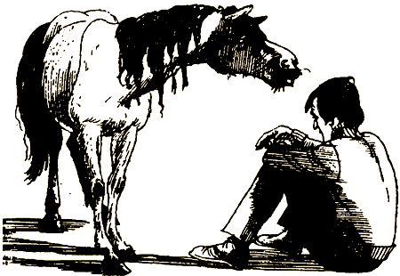

#### КОНЕЦ

# 60

Найти короля оказалось не так уж трудно. Один из его бесчисленных прислужников приводит тебя к нему. Он сидит в маленькой, просто обставленной комнате, где с круглого потолка льется необычный свет.

— Тебе, значит, удалось-таки найти дорогу сюда. Да не волнуйся. Я не причиню тебе вреда.

Глухой голос короля тебя пугает. Он предлагает тебе сесть. Однако, проведя с ним несколько часов, ты находишь его умным, интересным и дружелюбным. Возможно, атланты заблуждаются на его счет.

Он предлагает тебе войти в правительство. Он уверяет, что люди по большей части ленивы и самолюбивы и ничего, кроме крутых мер и принуждения, не заслуживают. Уже почти тысячу лет он носит корону, и это удается ему только потому, что он не боится показаться жестоким. Он хочет, чтобы ты стал советником при его дворе.

Принять предложение короля и поступить к нему [на службу](#80) или [отказаться](#82) и разделить судьбу остальных людей?

# 61

Вопрос в том, куда бежать. Король все держит под надзором. Он правит всем подводным миром, его люди повсюду. Остается одно — разработать план, как захватить короля и упрятать его в тюрьму.

Но люди боятся. Когда-то несколько жителей уже пытались поднять восстание, они до сих пор в тюрьме. Король хитер и подозрителен.

Тебе приходит в голову устроить праздничное представление. По сигналу актеры и часть зрителей бросятся и схватят короля. У актеров будет настоящее оружие, но это никому и в голову не придет.

Твой план одобряют. Тебе предлагают возглавить восстание.

Принять предложение [возглавить восстание](#81) или помочь им только разработать план, а самому [бежать](#86) из этого мира?

# 63

Тебе кажется, что из этого положения можно выйти только одним способом — покинуть «Искатель» и попытаться своими силами выбраться на поверхность. Ты выходишь через воздушный шлюз в океан. Резкий толчок, и ты плывешь вверх от «Искателя». В твое спасательное снаряжение входит маленький желтый плот. Поверхность моря спокойна, но «Мэрей» нигде не видно.

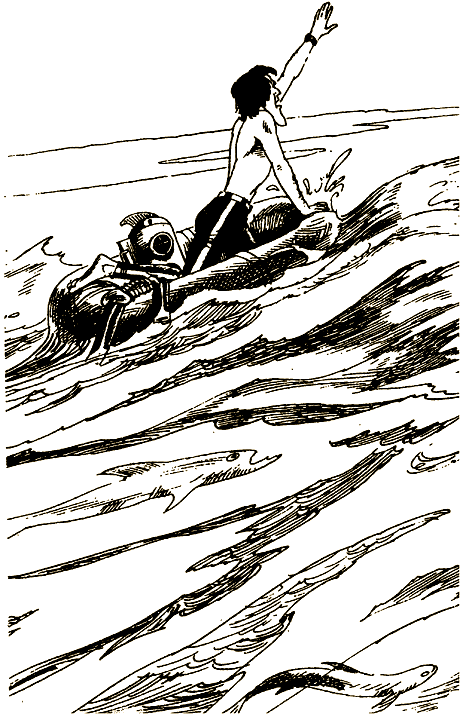

Двое суток тебя носит на спасательном плоту то под палящим солнцем, то под яркими звездами. В конце концов тебя обнаруживает поисковый вертолет. Наконец ты в безопасности.

Продолжить поиски Атлантиды ты, к сожалению, не можешь — твое зрение пострадало от той непонятной силы, которая остановила «Искатель». Твоя карьера подводного исследователя окончена.

#### КОНЕЦ

# 64

Лучше всего подождать, пока «Мэрей» не обнаружит тебя. Ты сам не можешь подать им сигнал, поскольку вся аппаратура «Искателя» вышла из строя. Никаких следов таинственной подводной лодки. Вероятно, она скрылась, поскольку сделала свое дело — не дала тебе продолжить поиски Атлантиды.

Глянув в толстое стекло иллюминатора по левому борту, ты видишь, что прямо на тебя движется громадный синий кит. Он, кажется, хочет тебя протаранить. Возможно, его потревожила та подводная лодка, и теперь он готов отвести душу на любом судне.

Кит бьет изо всех сил. «Искатель» сильно поврежден. Сквозь изоляционный слой начинает просачиваться вода. «Искатель» придется оставить. Кит поблизости, он выжидает.

Попытаться выбраться [на поверхность](#63) или взобраться [на кита](#85) и плыть на нем?

Или ты не знаешь, [что делать](#87)?

# 65

Почему бы не спуститься? Кто этому поверит? Центр земли! Рычагом управления ты задаешь курс на глубокое погружение. Перед тобой открывается мир цвета и движущихся форм. Мимо тебя проплывают слои песка и камней. Внезапно ты попадаешь в какую-то вязкую массу, которая полностью засоряет двигатели «Искателя». Тебя тянет вниз какая-то сила — что-то вроде гравитации. Ты прорываешься сквозь тонкую эластичную мембрану и попадаешь в область гигантских атомов. Вокруг тебя с бешеной скоростью крутятся электроны, но между несущимися частицами остается еще много места, в котором можно двигаться. Электроны вращаются вокруг маленьких частичек, которые, как тебе известно, называются ядрами. У тебя есть возможность избежать столкновения с электронами. Какой мир! Но возможно, это всего лишь галлюцинации.

Продолжать путешествие к [центру земли](#88) или [вернуться](#89)?

# 66

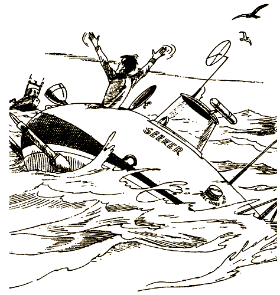

Ты считаешь, что нырять в эту глубокую скважину, которая, возможно, ведет к центру земли, слишком опасно. Гораздо лучше всплыть на поверхность и разработать подробный план действий.

Ты бросаешь последний взгляд на отверстие, проверяешь приборы «Искателя» и плывешь вверх.
Теперь тебе остается только [подождать](#31), пока тебя подберет «Мэрей».

# 67

Ты настаиваешь, что чувствуешь себя хорошо и будешь снова погружаться на следующий день. Ученые пытаются убедить тебя, что это безрассудство. Капитан «Мэрей» предупреждает, что надвигается полоса сильных штормов, так что завтрашний день будет, вероятно, возможным лишь для недолгого погружения.

Не слушая советов, ты залезаешь в «Искатель», машешь рукой своим друзьям и ныряешь в пучину. Ты чувствуешь себя немного усталым, но с нетерпением ожидаешь новой встречи с подводным миром.

Опустившись на дно, ты решаешь [обследовать обрыв](#6) над глубокой впадиной.

# 68

Вам сообщают, что надвигается сильнейший шторм. Капитан решает для безопасности отвести «Мэрей» в ближайшую гавань на острове. Оставаться там, где вы находитесь, слишком опасно. Матросы надежно закрепляют «Искатель» на палубе «Мэрей», и вы отправляетесь в путь.

Но шторм разражается прежде, чем вы успеваете добраться до гавани. Тросы, удерживающие «Искатель», рвутся, и его смывает за борт. Мониторы на «Мэрей» выведены из строя страшными электрическими разрядами во время грозы. Все живы, но никакой возможности исправить испорченные приборы нет. Поиски Атлантиды на этот раз закончены.

#### КОНЕЦ

# 69

Бесполезно. Водоворот держит тебя как в тисках. Ты чувствуешь, что твои руки и ноги рвутся в разные стороны. Отсюда не выбраться. Тебя все крутит и крутит.

Воспользуешься [лазерным пистолетом](#97), чтобы проделать дыру в стенке водоворота или будешь [продолжать борьбу](#98)?

# 70

Ты видишь, что из водоворота тебе не выплыть. Остается одно: глубоко нырнуть вниз.

Несколько бросков — и ты в середине водоворота. Перед глазами пляшут яркие цветовые пятна. Ты теряешь всякое представление о том, где находишься. И вдруг ты видишь небо. Оно кажется крошечным голубым пятнышком.

Выбраться [на поверхность](#99) или [исследовать](#100) это странное место?

# 71

Возможно, это глупо, но ты решаешь остаться с ними. Инъекция совершенно безболезненна, и никаких изменений в себе ты не чувствуешь. Тебя приводят в уютную комнату, где все принимают участие в особой чайной церемонии по случаю твоего решения.

— Понимаешь, все живые существа в основе своей схожи. Все в жизни взаимосвязано. Мы прилетели с другой планеты в поисках живых существ. Нам приходится очень осмотрительно брать новых людей на нашу планету. Некоторым из землян, как и тебе, уже удавалось нас обнаружить.

Ты поражен их словами. Выбор за тобой. Ты можешь либо, преодолевая пространство и время, отправиться к ним на планету, либо остаться в подводной Атлантиде, чтобы передать жителям подводного мира сведения о жизни на Земле.

[Путешествовать](#90) с ними в пространстве и времени или [остаться](#91) работать в Атлантиде?

# 72

Единственный способ доказать, что ты не сумасшедший, — это организовать еще одну экспедицию в Атлантиду. Ты берешь все деньги, полученные за статьи и телевизионные выступления, снаряжаешь корабль, набираешь команду и берешь напрокат «Искатель». Большинство людей считает, что ты не в своем уме.

Остановившись над тем местом, которое ты так тщательно отметил на картах, ты на «Искателе» погружаешься в море. Снова находишь скрытый грот и круглую металлическую пластину.

Эта пластина наверняка загораживает какой-то проход. Она заблокирована. Ты пробуешь открыть ее о помощью бурового устройства «Искателя», но она не поддается. Ужасно обидно, ведь ключ к разгадке почти у тебя в руках!

Ты будешь [обстреливать](#93) эту пластину из лазерной пушки или [спокойно ждать](#94), пока тебя не заметят и не пригласят войти внутрь?

# 73

Предложение сделать инъекцию сыворотки и остаться с ними на всю жизнь ужасно. Ты должен устроить побег.

Стоило твоим охранникам отвернуться, как ты ускользаешь от них и бросаешься к люку космического корабля. Лазерного луча, который охраняет выход, ты и не заметил. Ступив на его полоску, ты застываешь на пол шаге. К тебе подходят атланты и говорят, что тебе придется остаться в таком положении на срок, который равен 23 земным годам и 61 дню. Когда истечет этот срок, тебе дадут еще один шанс.

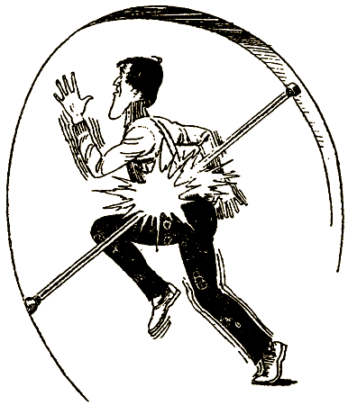

#### КОНЕЦ

# 74

Несколько недель ты обдумываешь, стоит ли затевать новую экспедицию. Дело не в деньгах. Ты опасаешься, что, если Атлантиду обнаружат, это обернется трагедией для атлантов. Ты понимаешь, что существование их цивилизации надо сохранить в тайне. И ты решаешь потратить деньги на организацию космических исследований и поисков жизни в других галактиках. Возможно, когда-нибудь ты встретишь атлантов в космосе.

#### КОНЕЦ

Или тебе [не нравится](#107) такой конец?

# 75

Убежать будет нелегко, но ты решаешь, что оставаться с этими людьми не стоит. Лучше всего сказать, что ты принимаешь их предложение быть шпионом. Они, разумеется, радуются, когда ты сообщаешь, что готов работать на них.

— Понимаешь, атланты нам завидуют. Мы должны быть всегда начеку, иначе они завоюют нас и нашу землю.

Тебе не верится, что атланты могут завидовать нодорцам, но ты им не перечишь. Тебя провожают за пределы страны, и ты уходишь к атлантам. Вернувшись в Атлантиду, ты просишь, чтобы тебе разрешили остаться с ними. Ты знаешь, что тебе никогда не позволят покинуть подводный мир, но надежда на побег еще остается. А может быть, жить здесь не так уж и плохо.

#### КОНЕЦ

# 76

— Хорошо, я готов, — говоришь ты. — Я остаюсь и буду шпионить для вас в Атлантиде. Кто знает, может, на самом деле они гораздо лучше, чем вам кажется.

Нодорцы в восторге от того, что ты будешь им помогать. Они дают тебе комнату в огромнейшем доме, где живет большинство из них. Серая и противная, она очень напоминает тюремную камеру. Ночью, когда все легли спать, ты сидишь без сна и думаешь о том, что сам себя загнал в ловушку. Тебе приходит в голову, что нодорцы — инопланетяне и потому несчастные изгнанники. Атланты ничего не замышляют против них. Ты сделал неправильный выбор.

#### КОНЕЦ

Или тебе [не нравится](#108) такой конец?

# 77

Возможно, тебе удастся узнать у атлантов, как им удалось сделать свою жизнь такой счастливой. Ты будешь изучать их историю.

Когда ты объявляешь о своем решении остаться, тебя окружают вниманием и заботой. Ты говоришь, что хотел бы помочь им в производстве продуктов питания.

Цивилизация Атлантиды достигла совершенства уже несколько тысяч лет назад. Ее жители выращивают добрые мысли и выпалывают дурные, словно ухаживают за садом. Их разум свободен и ясен.

У тебя столько дел — и уход за морскими растениями, и исторические изыскания, — что очень скоро ты совсем забываешь про «Искатель».

#### КОНЕЦ

# 79

Ты улучаешь минуту, когда все заняты своими делами, бросаешься к выходу из тоннеля и выбираешься в море. Никаких признаков тревоги. Никто за тобой не гонится. Странно, они говорили, что не разрешат тебе вернуться в наземный мир. Почему же тебе позволили убежать?

Ты плывешь вверх, потом теряешь сознание. Никому не выдержать такого давления и отсутствия кислорода. Но тут происходит чудо, ты вдруг чувствуешь, как тебя тащат куда-то окружившие тебя со всех сторон бурые водоросли,
и вот ты уже совсем недалеко [от поверхности](#50).

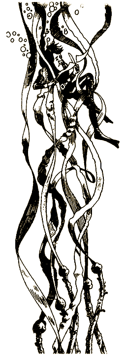

# 80

Советник короля! Вот это шанс. Возможно, король правит так долго, что потерял связь с народом. Может, тебе, как советнику, удастся помочь людям достичь того, чего они добиваются. Ты не веришь, что жители Атлантиды ленивы и самолюбивы. Просто королю нужно по-новому взглянуть на вещи.

Тебя утвердили в должности особого советника короля по проблемам жилья и продовольствия. Ты немедленно созываешь собрание, чтобы обсудить продовольственную программу и определить нормы работы. Король так рад, что еще кто-то занялся этими проблемами, что оставляет все на твое усмотрение. Он дает тебе землю и назначает большое жалованье. Люди включаются в планирование и работу. Ты выслушиваешь их жалобы и предложения. Жизнь на дне моря становится прекрасной. Народ здесь хороший и трудолюбивый. Остаться было мудрым решением.

#### КОНЕЦ

# 81

Тебе не хочется возглавлять восстание, но ты нужен народу. Ты начинаешь подготовку спектакля, и король доволен, что его народ занят делом. Люди ждут не дождутся дня, когда им удастся посадить короля в тюрьму и получить возможность принимать решения самим.

В ночь представления театр набит битком. Все ожидают появления короля. Его все нет. В толпе растет волнение. И тут в театр вбегает королевский гонец и объявляет, что у короля началось воспаление мозга. Он при смерти.

Ты не знаешь, действительно ли король болен, или же он узнал о заговоре. Люди смущены и не знают, что делать. Они обращаются к тебе, ты приказываешь начинать спектакль. И тут в театр врываются королевские солдаты. Они приближаются к тебе.

Позволишь им [схватить тебя](#116) или попробуешь [скрыться](#117)?

# 82

Советник злого короля? Ни за что!

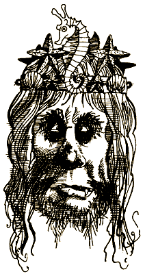

Ты говоришь, что не желаешь иметь ничего общего с тираном, который не верит в свой народ. Ты говоришь ему прямо в глаза, что его народ несчастен. Он хохочет и говорит, что ты можешь убираться к своему народу, если тебе так хочется. Он предупреждает тебя, что эти люди слишком много жалуются и мало работают.

Вернувшись к своим новым друзьям, ты обсуждаешь с ними, как победить короля и его приспешников. Вы устраиваете тайные собрания и вырабатываете план. Но в день восстания обнаруживается, что в вулканической стене, окружающей подводный мир, возникла течь. В опасности вся страна. Мысль о восстании придется оставить. Атланты должны не дать стихии разрушить их мир. Каждый работает на общее дело. Сейчас главное — спастись.

Во время катастрофы [работать](#112) вместе со всеми или воспользоваться случаем и [бежать](#114)?

# 85

Люди ездят верхом на дельфинах, и тебе приходилось встречать аквалангистов, которые уверяли, что им удавалось схватить кита за плавник и прокатиться на нем. Это звучит безумно, но, возможно, это единственный путь к спасению. Ты вылезаешь из «Искателя», подплываешь к киту и хватаешься за плавник. Мягким, но мощным движением гигантское млекопитающее взмывает вверх. Удержаться не легко. Наконец кит всплывает и замирает на поверхности, наполняя легкие воздухом, а ты потихоньку уплываешь.

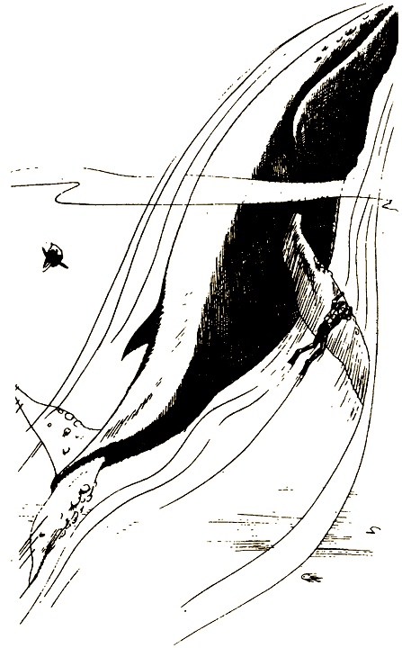

Тебя носит по морю два или три дня. Тебе тепло в водонепроницаемом костюме, а специальные надувные подушки поддерживают тебя на плаву. Когда тебя, качающегося на волнах, находит поисковый вертолет, тебя мучают голод и жажда, а в остальном ты в полном порядке.

#### КОНЕЦ

# 86

Это их страна, но ты готов помочь им придумать, как победить короля. Однако сам принимать участие в восстании ты не хочешь.

Нужно избрать новых вождей и объяснить народу его задачу. Ты бы и сам принял участие в восстании, но тебе нужно вернуться в надводный мир. Пока восстание готовится, ты надеешься ускользнуть, пробраться на «Искатель» и быстро подняться на поверхность.

В день восстания тебе передается возбуждение смелого напора атлантов, и ты решаешь остаться и помочь им, чем сможешь. Тщательная подготовка дала свои плоды. Отряд специально отобранных мужчин и женщин легко захватывает короля и его гвардейцев без единой капли крови, и народ празднует победу много дней.

Атланты относятся к тебе так, будто ты один из них, да и сам ты начинаешь чувствовать, что это так.

#### КОНЕЦ

# 87

Ты вынужден признать, что не знаешь, как поступить. У кита пугающий вид; как спастись, ты не представляешь и потому ждешь.

Сколько времени проходит, ты не знаешь — может, час, а может, всего несколько минут, — когда возвращается таинственная подводная лодка. Она зацепляет «Искатель» тросом и вытаскивает на поверхность. Потом подлодка исчезает в волнах, оставляя тебя поджидать «Мэрей».

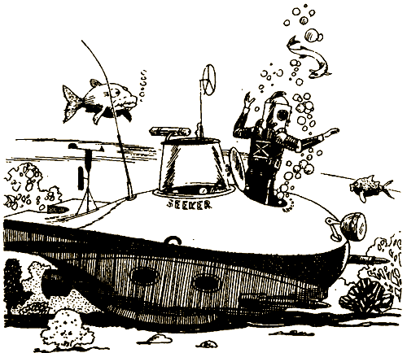

#### КОНЕЦ

# 88

Вокруг тебя с бешеной скоростью вращаются электроны, а ты движешься все дальше и наконец попадаешь туда, где приборы фиксируют, что времени больше не существует. Часы останавливаются, останавливается спидометр, останавливается твое сердце, и все же ты жив. Ты слышишь прекрасную музыку и видишь свет, который можно пощупать и даже попробовать на вкус. Тебя наполняют покой и благодать.

Ты чувствуешь, что рядом с тобой кто-то есть, но знаешь, что люк, через который можно войти, все время был закрыт. Оглянувшись, ты видишь трех атлантов и понимаешь, что «Искатель» стал просто мыслью. Как мысли атланты попали на борт «Искателя» и пытаются установить контакт с тобой. Ты хочешь узнать, о чем они думают, но они говорят тебе, что ты зашел пока не слишком далеко, чтобы стать настоящим путешественником по мыслям.

[Вернуться](#95) из этого странного мира или мысленно [путешествовать](#96) во времени и пространстве?

# 89

Нет, ты не будешь нырять к центру земли. Как известно, сразу под тонкой земной корой располагается слой, в котором твердые породы постепенно переходят в жидкое состояние, еще глубже находится твердое ядро. По крайней мере так считают ученые. Тебе не выдержать такого путешествия. С другой стороны, не исключено, что радиолокатор неисправен. Скважина глубока, но тебе не верится, что она на самом деле тянется до самого центра земли. Лучше действовать осторожно. Ты поднимаешься на поверхность, чтобы посоветоваться с учеными на борту «Мэрей».

Ученые говорят, что их приборы вышли из строя, возможно, из-за надвигающегося шторма, и они не хотят рисковать. Решено отвести «Мэрей» подальше от этой таинственной скважины. Экспедицию придется завершить, и ты понимаешь, что упустил шанс открыть Атлантиду.

#### КОНЕЦ

# 90

— Я иду с вами. Я хочу увидеть вселенную.

— Отлично, ты не пожалеешь. Мы уже готовы к полету.

Тебя приводят в маленькую комнатку, и трое атлантов становятся вместе с тобой под какой-то яркий луч. Ты словно летишь куда-то и в то же время стоишь на месте. Ощущение такое, что ты уже пролетел сотни тысяч миль в космосе. Мимо промелькнуло Солнце, пронесся Млечный Путь, и вот ты уже в другой галактике.

Ты оказался на планете Эйгр, откуда и прибыли атланты. Это совершенно необычный мир. Город сияет, как тысяча огней. Ты видишь вокруг лишь сгустки яркого пульсирующего света, которые проносятся мимо тебя. Ничего твердого — лишь свет. И вдруг на твоих глазах эти сгустки света превращаются в людей.

— Тело для нас не важно. Важна наша энергия. Если хочешь, можешь видеть нас в телесных формах, но мы пользуемся ими, только чтобы общаться с людьми, вроде тебя. Выбирай: остаться как есть или пройти трансформацию.

[Остаться](#101) таким, как есть, или [трансформироваться](#102) в энергию?

# 91

На сегодня с тебя хватит приключений. Путешествие на планету в другой галактике слишком рискованно. Кроме того, ты сможешь побывать там и потом.

Ты говоришь, что хочешь остаться с ними. Возможно, твои знания о море могут им пригодиться. Несколько дней они серьезно обсуждают твое решение. По окончании переговоров тебе предлагают на выбор работу в Атлантиде. Ты можешь стать либо фермером, либо музыкантом.

Стать подводным [фермером](#103) или [музыкантом](#104)?

# 93

Ты решил попробовать пробить дверь с помощью лазерной пушки. Ты жмешь на кнопку — следует вспышка ослепительного света. Но дверь стоит, как стояла. Ты палишь снова и снова. Каждый выстрел лазерной пушки сотрясает «Искатель». Отражения энергия разрушает твое собственное судно. Не снимая пальца с кнопки, ты все продолжаешь палить.

И вдруг слепящая вспышка внутри самого «Искателя». Это взорвалась лазерная ушка. И ты, и «Искатель» погибли в одно мгновение. А дверь по-прежнему закрыта.

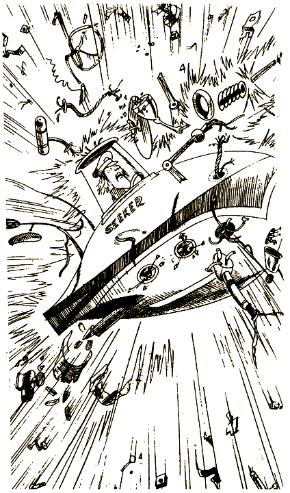

#### КОНЕЦ

# 94

Нехорошо использовать силу, если на тебя никто не нападает и нет нужды защищаться. Ты отметаешь саму мысль воспользоваться лазерной пушкой — от этого кто-то может пострадать, и ты никогда уже не сможешь установить контакт, Ты решаешь подождать в надежде, что тебя заметят.

Шесть часов ты сидишь и терпеливо ждешь. Перед тобой возникает зеленоватое сияние. Мягкий свет окутывает «Искатель». Дверь люка открывается. Появляются три человека и делают тебе знак следовать за ними.

[Последуешь](#105) за ними или [откажешься](#106)?

# 95

Это похоже на кошмар, и ты решаешь вернуться. Но оказывается, вернуться гораздо труднее, чем ты думал. Электроны кружатся, словно охранники, не давая тебе уйти. Внезапно тебя задерживает эластичная мембрана, которая уже пыталась остановить тебя в прошлый раз. Она тянет «Искатель» назад. Ты хочешь избавиться от этого кошмара и вернуться в свой мир.

Ты теряешь сознание. Придя в себя, ты обнаруживаешь, что плаваешь в гидрокостюме над впадиной на дне океана. «Искатель» исчез. Ты в недоумении — уж не приснилось ли тебе все это? Ты медленно всплываешь на поверхность. «Мэрей» нигде нет. Ты не знаешь, сколько прошло времени. Экипаж, должно быть, решил, что ты пропал навсегда, и ты понимаешь, что они правы. Твое измученное тело носит по безбрежному океану. Ты чувствуешь, что силы покидают тебя.

#### КОНЕЦ

# 96

Путешественник по мыслям! Ты понимаешь, что люди всегда мечтали об этом. Ну конечно, ты хочешь стать путешественником по мыслям, только как?

Атланты произносят слова очень тихо, они говорят, что между прошлым, настоящим и будущим нет никакой разницы. Нужно только сосредоточиться и направить мысли туда, куда хочешь.

Ты делаешь попытку и поразительным образом прорываешься сквозь время в тот день, когда ты появился на свет, затем в тот, когда произошло твое первое глубоководное погружение. Сознание перелетает от одного момента жизни к другому. Но когда ты пытаешься заглянуть в будущее, у тебя ничего не выходит.

— Почему я не могу увидеть будущее? — спрашиваешь ты атлантов.

— Потерпи, — отвечают они. — Всему свое время.

И вдруг ты проносишься сквозь время за пределы вселенной, ты чувствуешь, как сквозь твое тело проходит свет. Ты не отбрасываешь тени. Тебя пронизывает ощущение покоя.

[Прекратить](#110) путешествие во времени и вернуться к земной жизни, или [нет](#111)?

# 97

У тебя при себе лазерный пистолет, который ты взял на случай опасности. Ты пробиваешь отверстие в стенке водоворота и ныряешь в него. Перед тобой стая рыб, которая озадачена появлением странного гостя. За ними маячит акула. Ты медленно плывешь наверх, а акула ныряет в глубину.

«Мэрей» нигде не видно. Сколько тебе придется ждать? Неожиданно ты слышишь громкий всплеск — это огромный кит плавает неподалеку, пуская фонтаны и с громким шумом втягивая в себя воздух. Чтобы доплыть до этого громадного существа, тебе понадобилось добрых полчаса. Он не обращает на тебя никакого внимания. Ты взбираешься ему на хвост и ползешь на четвереньках по его спине. Это все равно что ползти по гигантскому скользкому камню.

И вот ты уже можешь достаточно ясно разглядеть «Мэрей». С «Мэрей» наблюдают за китом. Ты машешь рукой до тех пор, пока не убеждаешься, что тебя заметили. Скоро тебя подберут.

#### КОНЕЦ

# 98

Ты теряешь сознание, а в себя приходишь, уже плавая на поверхности океана. По воде идет крупная зыбь, на тебя светит солнце. Водоворот, должно быть, исчез так же внезапно, как и появился. Ты измучен, у тебя кружится голова, ты осторожно поворачиваешься, чтобы проверить, все ли у тебя в порядке. Слегка повернув голову внутри водолазного шлема, ты чувствуешь сильную боль у правого виска. Тебе нужно лежать очень спокойно. Мало-помалу ты начинаешь различать шум поискового вертолета. Ты не решаешься повернуться и взглянуть на него, но минуты бегут, шум нарастает, потом медленно затихает. Вертолет пролетел мимо, не заметив тебя. Боль в виске нарастает. Ты снова теряешь сознание.

#### КОНЕЦ

# 99

Вода крутит тебя со страшной скоростью. Ты пытаешься попасть в самый центр водоворота, и тут тебя выбрасывает в воздух. Ты падаешь в воду совсем рядом с «Мэрей». Падение оглушило тебя, но ты быстро приходишь в чувство, и вскоре тебя подбирают. Никто не верит в твои рассказы, да и тебе самому через некоторое время все это начинает казаться слишком невероятным, чтобы могло произойти на самом деле.

#### КОНЕЦ

# 100

На дне океана маленький металлический люк. Ты тянешь крышку изо всех сил, но она не поддается. Ты останавливаешься передохнуть. Проплывающие мимо рыбы с изумлением разглядывают тебя.

Ты и не заметил, как люк открылся. Какой-то голос приказывает тебе войти.
Осторожно, с опаской идешь ты по коридору, который ведет в [маленькую комнатку](#55), где тебя встречают три человека.

# 101

Ты просто не можешь расстаться со своим телом. Для атлантов, может быть, вполне естественно существовать в виде чистой энергии, но ты еще не готов стать похожим на них.

Довольно странно бродить в окружении ярких мерцающих сгустков энергии. Тебя просят рассказать о жизни на Земле, ты соглашаешься. Два года ты общаешься с атлантами, принявшими форму чистой энергии, и рассказываешь о Земле, о жизни и делах людей. Атлантов интересуют все стороны земной жизни. Технология, политика, войны и религия.

Ты спрашиваешь, зачем им это, но они всегда уклоняются от прямого ответа. И вот в один прекрасный день ты смотришь на себя и не видишь ничего, кроме яркой светящейся энергии. С ужасом ты понимаешь, что стал одним из них.

#### КОНЕЦ

# 102

Ты живешь в мире атлантов, почему бы тебе не стать таким, как они? Глядя на свои руки, ты замечаешь, что они постепенно начинают светиться теплым желтоватым светом. Мало-помалу свечение поднимается по рукам и ногам, покуда не исчезает все тело. Ты превратился в сгусток энергии. Тебя наполняет ощущение свободы и счастья, какого ты никогда не знал раньше. Можно летать, паря и кружась, где тебе заблагорассудится. Стены тебе не помеха, ты свободно проникаешь через них. Тебе не нужно ни пищи, ни отдыха. Ты можешь путешествовать во времени; в форме энергии ты можешь мгновенно перенестись на Землю.

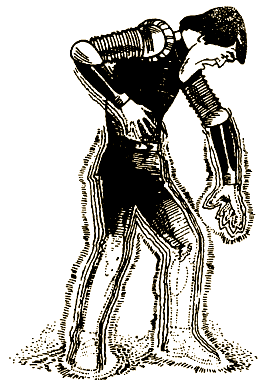

Ты чувствуешь, что именно таким тебе и хотелось быть.

#### КОНЕЦ

# 103

Ты доволен, что выбрал работу подводного фермера. Вокруг Атлантиды раскинулись поля морских растений, за которыми ухаживают так же, как за садами на земле. Каждый день атланты выходят собирать урожай, обрабатывать поля и отгонять рыб, которые любят обгрызать ростки. Еще есть работа на рыбных фермах. Ты кормишь рыб и ухаживаешь за ними. Заниматься подводным фермерством очень приятно и совсем не трудно. Есть, однако, опасность наткнуться на электрического ската, морскую змею и иногда на акулу. Приходится все время быть начеку.

#### КОНЕЦ

# 104

Музыкант в Атлантиде! Кто может в это поверить? Тебе предлагают выбрать инструмент. Ты пробуешь водяные лютни, морские барабаны, флейты из акульей кости и бесчисленное множество электронных инструментов. Ты выбираешь один из электронных инструментов, но не можешь извлечь из него ни звука. Тебе говорят, что на нем исполняют музыку, которую не слышат, а чувствуют. В какой мир ты попал! Кто может представить себе музыку, которую нельзя услышать? Постепенно ты учишься различать эту музыку частями своего тела: бедрами, грудью, висками и кончиками пальцев. Интерес к новому восприятию музыки растет день ото дня. Ты совершенствуешься в этом искусстве и становишься их величайшим музыкантом.

#### КОНЕЦ

# 105

Эти люди приводят тебя в центр управления. Тебя встречает начальник подводного научного центра, который руководит секретными исследованиями в море. Тебе говорят, что, на свое счастье, ты не воспользовался лазерной пушкой, потому что у них есть антилазерное устройство, которое разнесло бы и тебя и «Искатель» на куски.

После вкусного обеда и прогулки по глубоководной лаборатории тебя отправляют на «Искатель», чтобы ты мог подняться на поверхность. Тебя предупреждают — ты не должен возвращаться. В противном случае ты до конца жизни останешься пленником.

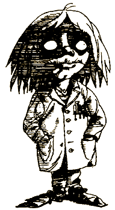

#### КОНЕЦ

# 106

Когда ты отказываешься последовать за ними, они достают прибор, с помощью которого гипнотизируют тебя. По длинному тоннелю тебя приводят в большую подводную лабораторию. К тебе подходят трое военных и выводят из транса.

— Ты попал на территорию секретной военной базы. Мы разрабатываем слишком много секретных планов, поэтому ты останешься нашим пленником.

Спасения нет.

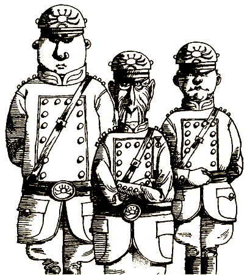

#### КОНЕЦ

# 107

Ты колеблешься несколько недель и наконец решаешь вернуться в Атлантиду. Ты так торопишься, что нанимаешь маленькое быстроходное судно, которое доставляет тебя к тому месту в океане, где находится Атлантида. Ты собираешься погружаться с одним аквалангом, хотя и понимаешь, что нырнуть на две тысячи футов — безумная затея. Но тебе уже все равно: ты чувствуешь, что это сделать необходимо.

Шесть дней море штормит, а когда погода устанавливается, ты готовишься к погружению. Скользнув в воду, ты в последний миг бросаешь взгляд на небо и высоко в облаках видишь сияющий город атлантов. Теперь погружаться бессмысленно.

#### КОНЕЦ

# 108

Ночью ты просыпаешься, слышишь какие-то голоса, оказывается несколько нодорцев готовятся к побегу. Они стремятся к атлантам. Им кажется, что жить с ними гораздо лучше. Ты подходишь к ним, и они рассказывают тебе, как плохо им живется. Им хочется радости, доброжелательности — это ведь так естественно!

И тут распахивается дверь. Врываются три охранника — они открывают огонь, и ты, и все, кто стоит рядом с тобой, исчезаете во вспышках ослепительного сияния.

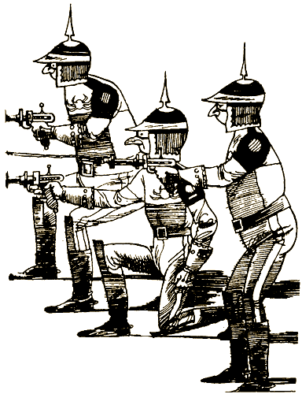

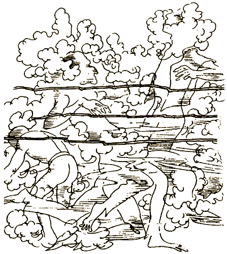

#### КОНЕЦ

# 110

Через тысячу лет мысленных путешествий тебя приглашают в главную совещательную комнату. Тебе говорят, что теперь ты можешь вернуться на Землю. Ты не уверен, стоит ли возвращаться, но тебе интересно посмотреть, как изменилась жизнь на Земле за это время.

Какой вид открывается тебе, когда ты паришь над землей на высоте тысячи футов! Величайшие города мира — Нью-Йорк, Лондон, Париж и Гонконг — не видны за покрывшими их зарослями. Дороги, ведущие к этим городам, едва различимы. Но ты видишь признаки новых поселений. Дома небольшими группками рассыпаны по сельской местности. Дымящих труб не видно. Дорог мало, а машин нет совсем. Люди ведут простую жизнь, сами обеспечивая себя едой, жильем и одеждой. Ты хотел бы жить с ними.

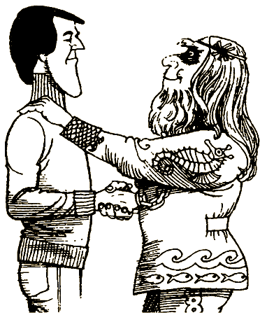

#### КОНЕЦ

# 111

В один прекрасный день друзья говорят тебе, что, если хочешь, можешь вернуться на Землю. Ты тщательно обдумываешь это предложение и приходишь к выводу, что возможность путешествовать по мыслям — это как раз то, что тебе всегда хотелось. Ты решаешь остаться в этом мире навсегда.

#### КОНЕЦ

# 112

Много лет назад атланты разработали особую систему защиты, но большинство о ней просто забыли. Только один-единственный старик помнит, где хранится оборудование и инструкции по его применению.

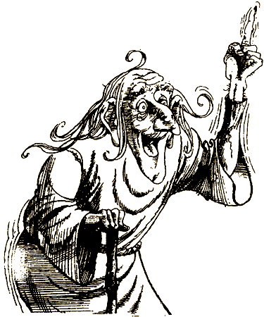

Целых трое суток ты работаешь с атлантами не покладая рук, откачивая прибывающую воду и возводя особое укрепление вокруг трещины в вулкане. 

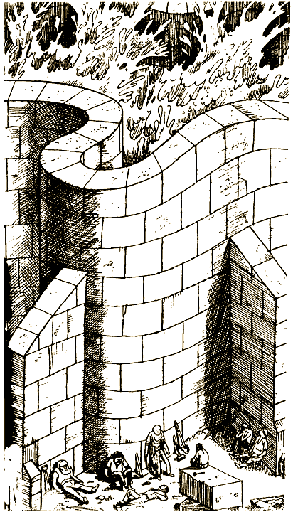

Наконец насос остановлен. Все страшно устали, но одержали победу в битве с океаном.

#### КОНЕЦ

# 114

Пока все заняты прибывающей из моря водой, никто не заметит твоего побега. Ты мчишься по длинному коридору, ведущему в море, которым почти никто не пользуется. В конце — тяжелая, заржавевшая дверь. Ты толкаешь ее изо всех сил, и она в конце концов поддается, освобождая путь через воздушный шлюз в открытое море. «Искатель» стоит там, где ты его оставил, ты бросаешься к нему и поднимаешься на поверхность, где тебя ожидает «Мэрей».

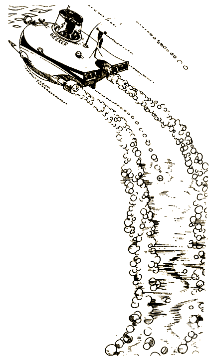

#### КОНЕЦ

# 116

Пытаться скрыться от солдат бессмысленно. Ты окружен. Они ведут тебя к королю, тот печально говорит, что ты ничем не отличаешься от других. Он еще решит, что с тобой делать, а пока отправляет тебя в темницу.

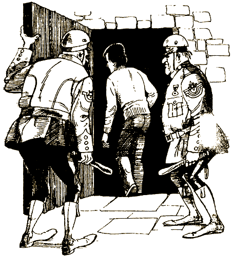

#### КОНЕЦ

# 117

Как тут убежишь? Солдаты явились за тобой. Ты кричишь как можно громче, и вокруг тебя собирается весь театр, не подпуская к тебе солдат. Солдаты изумленно взирают на окружающую толпу, колеблются, а потом быстро уходят. Они понимают, что силы слишком неравны, чтобы надеяться на успех схватки.

Люди кричат, что надо начинать восстание. Толпа выходит из театра и направляется к королевскому дворцу. По пути к вам присоединяются все новые и новые люди, даже королевские солдаты начинают присоединяться к толпе. И ты и весь народ свободны, короля сажают в тюрьму. Восстание победило.

#### КОНЕЦ
