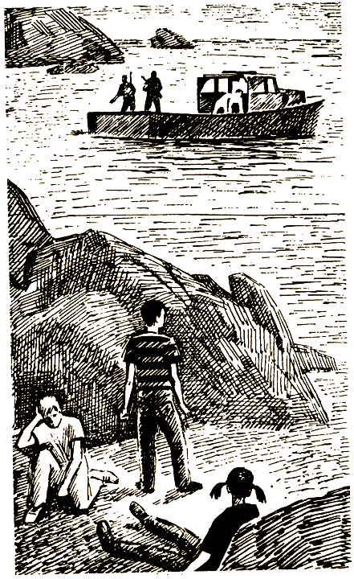

# 0

## Эдвард Паккард

# ОСТРОВ ДИНОЗАВРОВ

Это необычная книга. Не пытайся читать ее с начала до конца, перелистывая одну страницу за другой. Ведь тебя ждет масса удивительных приключений, как только ты окажешься на острове посреди Тихого океана.

Во время чтения тебе постоянно придется делать выбор. И приключения, которые тебя ждут, — результат твоего собственного решения, от этого зависит твоя судьба. Ну а как только ты что-нибудь выберешь, читай указания в конце страницы, и тогда узнаешь, что случится дальше.

На Острове динозавров выживает тот, кто лучше и быстрее остальных приспосабливается к ситуации. Главное твое преимущество перед этими громадными существами — смекалка и сообразительность. С первой же минуты надо быть очень внимательным. Иначе можешь погибнуть.

Удачи тебе!

### ОБ АВТОРЕ

Эдвард Паккард окончил Принстонский университет и Колумбийский юридический колледж. Сочиняя увлекательные истории для своих детей: Каролины, Андреа и Уэллса, — он придумал особый тип книги-игры для серии «Выбери себе приключение».

### О ХУДОЖНИКЕ

Раиль Давлетбаев окончил Казанское художественное училище, а затем Московский художественный институт им. В. И. Сурикова. Художник необычайно разносторонний: занимается живописью, графикой и книжной иллюстрацией, а также преподавательской деятельностью.

#### [Начать приключение](#1)

# 1

Тебе посчастливилось попасть в Австралию по обмену школьников. Ты очень хорошо провел здесь время. И вот уже пора возвращаться домой. Тебя и еще нескольких ребят из твоей школы ждет последняя экскурсия — к знаменитым коралловым островам. Там вас научат нырять в водолазных костюмах. Исследование причудливого мира кораллов в глубинах моря немного напоминает путешествие на другую планету.

После прекрасно проведенного дня на море Нанси Вильсон, инструктор по прыжкам в море, и еще несколько ребят стоят возле перил катера, который возвращается на материк. Ты замечаешь струйку дыма на горизонте и обращаешь на нее внимание остальных.

— Это из вулкана на острове Кирин, — говорит Нанси.

— А ты была там когда-нибудь?

— Нет. Хотя там, должно быть, очень красиво, много редких растений и экзотических животных. Они сохранились потому, что остров труднодоступен. У него нет удобной гавани, вокруг лишь коралловые рифы да песчаные отмели.

— А кто там живет?

Переходи на страницу [2](#2).

# 2

— Практически никто. Последние жители покинули этот остров несколько лет назад, понятно почему. — Нанси бросила взгляд на дым над горизонтом. — Говорят, что в любой момент может начаться извержение вулкана.

— Эх, хотелось бы побывать там, — мечтательно говоришь ты. — Здорово, наверно, посмотреть на настоящий вулкан!

— Это невозможно, — решительно возражает Нанси. — Остров целиком куплен институтом Лебо и теперь закрыт для всех, кроме сотрудников института. Они проводят там эксперименты по генетике или что-то в этом роде.

Загадочная струйка дыма скрылась из виду, и вскоре ты забываешь об острове Кирин. Но через неделю, когда ты собираешь вещи и готовишься к отъезду домой, вдруг слышишь, как по телевизору в вечерних новостях диктор говорит:

— К нам поступило сообщение, что ученые института Лебо, работающие на острове Кирин, сделали потрясающее открытие о свойствах живой клетки. Дальнейшая работа может занять многие годы, но тот, кто запасется терпением, в один прекрасный день сможет своими собственными глазами увидеть настоящего живого динозавра.

Диктор улыбнулся и с сомнением покачал головой. И ты тоже не знаешь, верить ли во все это. На следующий день ты решаешь спросить у своей учительницы биологии, правда ли, что можно создать настоящего динозавра.

— А, ты тоже услышал об этом вчера в новостях, — улыбается миссис Гласс. — Ну что же, чисто теоретически это возможно. Необходимо лишь найти молекулы ДНК из крови динозавра.

— Но как же это сделать?

— Разумеется, в окаменелых останках нет ни капли крови. Молекулы ДНК можно добыть из крови, сохранившейся в янтаре.

— В янтаре?! Откуда же она там возьмется?

Миссис Гласс усмехается:

— А комары?! Миллионы лет назад они кусали динозавров и сосали их кровь. Потом комар садился на липкую смолу, сочившуюся из какого-нибудь дерева. Он прилипал намертво, и со временем его целиком покрывало смолой. Окаменевшая смола называется янтарем. Таким своеобразным способом могли сохраниться молекулы ДНК из крови динозавров.

— А что было дальше? — с любопытством спрашиваешь ты.

— Прошли миллионы лет, Земля изменила свой вид. Теперь мы находим янтарь в горах и на побережьях.

— Неужели вправду кто-то может создать живого динозавра?

— Практически это маловероятно, но теоретически возможно, — отвечает учительница.

— Это похоже на сказку! Мне верится с трудом.

— Вообще-то мне тоже, — замечает миссис Гласс и, хитро улыбнувшись, добавляет: — Но кто знает… В свое время в компьютеры тоже не очень-то верили.

Открой страницу [11](#11).

# 5

Ты съедаешь все, что принес охранник, но кофе кажется таким горьким, что его просто невозможно пить. Ты отставляешь чашку в сторону и опять подходишь к окну. На этот раз ты замечаешь, что возле окна, цепляясь за выступы в стене, растет дикий виноград. И тут тебе в голову приходит замечательная мысль! Если вылезти из окна, то дальше путь к свободе открыт: по виноградной лозе можно спуститься вниз и скрыться в густом лесу. Это смелый план. Тонкий ствол может не выдержать и обломиться. Но даже если этого не случится, то никто не знает, сколько опасностей поджидает тебя, когда ты спустишься на землю. Да к тому же Лебо до сих пор не сделал тебе ничего плохого. Пока не сделал.

Если ты решаешь остаться, открой страницу [58](#58).

Если ты хочешь выбраться отсюда, открой страницу [32](#32).

# 6

Самолет начинает терять высоту. В течение нескольких минут из кабины не раздается ни звука. Потом опять доносится голос пилота:

— Пристегните ремни, займите устойчивое положение, спасательные жилеты можете не надевать.

Ты смотришь в окно. Земля приближается.

Самолет касается гребня океанской волны, потом вдруг резко взлетает и опять стремительно падает.

Ты слышишь страшный треск, сиденье напротив тебя разлетается на мелкие кусочки. Крыло самолета погружается в воду, и волны начинают с шумом захлестывать салон. Передняя часть самолета уже под водой, а хвост, где сидите Кира, Тодд и ты, поднялся вверх. Потоки воды вокруг напоминают Ниагарский водопад. Весь самолет затоплен водой, скоро она подступит и к вашим креслам.

Ты отстегиваешь ремень, который прижимал тебя к сиденью, и пытаешься освободиться. Водоворот подхватывает тебя и выносит наверх. Ты выныриваешь и видишь, что уже и хвостовая часть самолета, где ты только что находился, во власти воды. Кто-то кричит и зовет тебя. Да это же Тодд! Ты подплываешь и видишь рядом с ним Киру. Им тоже удалось спастись. Они даже нашли где-то спасательную лодку, и ты забираешься в нее.

К твоему удивлению и радости, ты вдруг замечаешь, что водонепроницаемый фотоаппарат до сих пор болтается у тебя на запястье.

Открой страницу [78](#78).

# 7

Ты решаешь идти вдоль ограды в сторону побережья и тут замечаешь небольшую группу аллозавров, пересекающих равнину. Это сильные животные метров шесть высотой, с огромной пастью и острыми зубами. Выглядят они в тысячу раз свирепее, чем кажутся на картинке.

Они охотятся на стегозавров, которые пасутся на краю леса. Похоже, хищники не замечают тебя. Только один детеныш отстал от стада и направляется в твою сторону.

Тебя охватывает ужас и восхищение одновременно. Малыш аллозавр размером не больше медведя-гризли, но зубки его пострашнее, чем у знаменитой белой акулы.

Во время бега динозаврика заносит в разные стороны. Судя по всему, ему не больше двух недель от роду. Что его бояться? В конце концов, ты можешь дать ему отпор.

Ты оглядываешься вокруг и находишь крепкую палку, размахиваешь ею над головой и громко кричишь. Малыш останавливается в замешательстве, он явно смущен. Глядя на него, ты начинаешь улыбаться.

Через несколько минут он опять топает к тебе, но теперь его шатает из стороны в сторону еще сильнее, чем прежде. У него такой вид, как будто он совершенно не знает, что будет делать, когда наконец добежит до тебя.

Но это тебе только кажется. Он прекрасно знает, как поступить.

#### КОНЕЦ

# 8

— Я согласен с Кирой, — откликаешься ты. — До материка не больше ста миль, за день мы сможем проплыть это расстояние, если, конечно, ветер будет попутным.

— Как всегда, меня никто не поддержал, — заметил Тодд, пожимая плечами.

Ты поднимаешь парус, и лодка быстро скользит по волнам. Ты оборачиваешься назад, чтобы в последний раз бросить взгляд на место крушения самолета, но все уже исчезло под водой. О трагедии напоминают только бензиновые разводы на волнах да обломки, плавающие на поверхности.

Остаток дня прошел спокойно. На борту лодки еды и пресной воды хватит на целую неделю. Но ты уверен, что вы доберетесь до берега значительно раньше. После наступления темноты вы решаете по очереди дежурить у руля, чтобы не потерять выбранного направления.

Утром тебя будит Тодд.

— Слушай, плохие новости, — говорит он упавшим голосом.

Ты садишься и оглядываешься. Вокруг густой туман. Ветер стих, и парус безжизненно болтается на мачте, а лодка мирно покачивается на волнах.

Напрягая зрение, ты всматриваешься в серую мглу, пытаясь что-нибудь увидеть, но безрезультатно. Ты опускаешь руку в воду. Она очень теплая!

Открой страницу [95](#95).

# 11

Вскоре ты забываешь обо всяких динозаврах. Время твоего пребывания в Австралии подходит к концу. Здесь было очень весело, но уже хочется домой. Ты выбрал билет в хвостовой части самолета, чтобы сидеть рядом со своими друзьями из Америки — Кирой Болен и Тоддом Харрисом.

Ты немножко волнуешься, поскольку уже несколько рейсов задерживаются из-за высокой активности солнца. Большинство ученых считают, что подобные солнечные бури — естественное явление, время от времени дающее о себе знать. Но этот год обещает быть самым опасным за последнее столетие. Солнечные бури приводят к мощным вспышкам космических излучений, из-за этого восходы солнца становятся необычайно красивыми, а телевизионные антенны и электронные системы навигации не работают.

Открой страницу [50](#50).

# 12

Пятнадцать минут спустя катер аккуратно проплывает между утесами и направляется к пристани. Он причаливает между моторной лодкой и большим катером.

Вас проводят в странное с виду здание — нечто среднее между крепостью и гостиницей. Первый этаж совсем без окон, но зато вдоль второго идет широкая веранда. Вьющийся виноградник покрывает большинство стен и придает этому мрачному сооружению более живой вид. Около входа стоит вооруженная охрана.

— Похоже на остров, захваченный каким-то диктатором, — шепчет тебе Тодд.

— Может, так и есть на самом деле, — киваешь ты в ответ.

Когда вы приближаетесь к двери, невысокий человек лет шестидесяти с копной седых волос выходит вам навстречу. В своей веселой цветастой рубашке он похож скорее на туриста, чем на жестокого диктатора.

— Меня зовут Клод Лебо, — произносит он с сильным французским акцентом.

Вы в ответ по очереди называете свои имена.

— Мне уже доложили о вас с патрульной лодки. Как я рад, что вам удалось спастись! — восклицает этот странный человек. — Зайдите на минуту в мой кабинет. Потом я распоряжусь, чтобы вас как следует накормили, вы помоетесь, и вам дадут все необходимое.

Открой страницу [96](#96).

# 14

Артуро указывает на рычаг на пульте управления.

— Все очень просто. Смотри: вверх, посередине и вниз. Когда я уйду, жми вниз. А этот рычаг сейчас стоит на средней скорости. Держи его так же, иначе могут быть неполадки или просто много шума. Когда отойдешь на расстояние примерно четверть мили, можешь прибавить скорость. Но не слишком, а то захлестнет волна — и пойдешь ко дну. Ну как, понял?

— Понял. А куда мне плыть?

Артуро протягивает руку к круглому циферблату:

— Это твой компас. Просто держи курс на запад. Когда доплывешь до суши, вытащи лодку на берег. Вряд ли у тебя хватит горючего, чтобы добраться до порта. Ну, вперед! — Он выпрыгивает обратно на пристань и отвязывает канаты.

Ты нажимаешь на рычаг. И в этот момент раздается пронзительный вой сирены.

Открой страницу [23](#23).

# 15

Ты решаешь вернуться к Артуро. И почти уже дошел до него, как вдруг почувствовал, что земля под тобой содрогнулась. Ты пытаешься бежать, но почва ускользает у тебя из-под ног.

Ты падаешь и катишься в какой-то ров, ногу внезапно пронзает острая боль. Наверно, ты ее сильно поранил. Боль не дает покоя. Вот если бы тут был лед, сразу стало бы легче!

Но мгновение спустя ты забываешь об этом. Внезапно вершина горы взрывается прямо на твоих глазах! Огненный смерч обжигает тебя и несется дальше, опаляя деревья. За какие-то считанные минуты возрожденный мир далекого прошлого превращается в пустыню, где нет ничего живого.

#### КОНЕЦ

# 16

Солнце поднимается из-за горизонта и заливает берег золотым светом. Острова не видно из-за отвесной скалы, возвышающейся над побережьем.

— Надеюсь, это обитаемый остров! — восклицает Кира.

— Ну, вообще-то на таких островах обычно живут люди, — с умным видом заявляет Тодд.

— Может, обычно и живут, — с сомнением отзываешься ты, глядя на подозрительную струйку дыма в небе. — Посмотри вон туда, видишь? Спорим, это остров Кирин?

— Остров Кирин? Но ведь здесь опасно: здесь вулкан, и вообще… — Тодд от ужаса широко раскрывает глаза.

— Ага, верно, но ты не паникуй. Ученые ведь здесь живут, ставят опыты, занимаются спокойненько своими делами. Наверняка у них есть вертолет на всякий случай, — пытаешься ты его успокоить.

— Да, да… К тому же, если этот вулкан дремал несколько лет, не станет же он извергаться в честь нашего прибытия! — Тодд вновь повеселел.

— Смотрите! — вдруг восклицает Кира.

Ты поворачиваешься туда, куда она указывает, и застываешь от неожиданности. Совсем неподалеку виден катер, в котором стоят в полный рост три человека. Двое из них держат винтовки, а у третьего в руках гранатомет.

Если ты пытаешься спрятаться, открой страницу [34](#34).

Если ты хочешь привлечь их внимание, открой страницу [91](#91).

# 18

Вы проскальзываете в ворота и прячетесь за кустами. Вдруг один из охранников показывается в дверях караульной и достает бинокль. Вы с Розанной забираетесь поглубже в кусты и прижимаетесь к земле. Стражник стоит еще несколько минут и, не заметив ничего подозрительного, исчезает. Через несколько секунд откуда-то сверху опускается тяжелая стальная дверь, и ворота оказываются закрытыми. Вы в ловушке!

Розанна вздыхает и качает головой.

— Ну что ж, давай подумаем, что теперь делать.

Открой страницу [56](#56).

# 19

Ты бы мог еще о многом порасспросить, но Пьер с такой скоростью выталкивает вас из комнаты, что ты и рта раскрыть не успеваешь.

— Да, странное местечко, — замечает Тодд, усаживаясь рядом с тобой в буфете.

— Неужели ты вправду думаешь, что тут есть динозавры? — усмехается Кира.

Ты пожимаешь плечами.

— Может, и есть. Но я весьма сомневаюсь, что радио совсем не работает, как сказал Лебо.

После того как вы немного подкрепились, Пьер провожает вас обратно в штаб. Там вы спускаетесь по туннелю, который уходит глубоко вниз. Пьер объясняет, что таким образом вы миновали забор, который находится под высоким напряжением и ограждает вольер с динозаврами. Через несколько минут вы выходите к странному дому с маленькими оконцами. Пьер отворяет тяжелую железную дверь.

Открой страницу [24](#24).

# 21

Все вместе вы поднимаетесь на холм, откуда открывается прекрасный вид на равнину, поросшую одинокими деревьями. 

Отсюда виден вулкан, возвышающийся вдалеке. Струйка дыма клубится из его кратера. Ты оборачиваешься к незнакомцам:

— А вы кто такие? И что это были за люди в патрульном катере?

— Меня зовут Артуро Скарлатти, а это моя коллега, Розанна Галло. Она прекрасный геолог, а я по специальности зоолог. Мы причалили здесь неподалеку, наша моторка спрятана в полумиле отсюда.

— А почему вы прячетесь? — спрашиваешь ты.

— Видишь ли, хоть мы и ученые, но иначе нам не удастся исследовать то, что нас интересует.

— Но почему? И что вы здесь ищете?

— Вы, наверное, слышали, что институт Лебо выращивает на этом острове динозавров.

— И вы верите в эти сказки? — удивляешься ты. Кира и Тодд тоже переглядываются.

— Это вовсе не сказки, мы сами их видели.

Ты бросаешь подозрительный взгляд на равнину. Неужели правда?

Открой страницу [79](#79).

# 22

— Мы насчитали двенадцать завроподов, — отвечает Артуро. — Не знаю точно, сколько их здесь еще. Лебо пытался создать и другие виды.

— А завроподы — это травоядные или хищники? — интересуется Кира.

— Конечно, травоядные! — улыбается Артуро. — Не стоит выращивать хищника, если ему некого есть, верно?

— Но не подумайте, что эти милые травоядные абсолютно безобидны! — замечает Розанна. — Они метров десять высотой. И вряд ли любят непрошеных гостей.

— К тому же, может, здесь наверняка уже есть и хищники, — задумчиво произносит Артуро. — Неизвестно, как далеко зашел Лебо в своих экспериментах.

— Что же нам делать? — беспокоишься ты.

— Мы поможем вам раздобыть какой-нибудь катер из флота Лебо, — отвечает Розанна. — Море сейчас спокойное, так что часов за двадцать доберетесь до материка.

— А что будет с вами?

— Ну, о нас не беспокойтесь, мы не пропадем! — смеется Розанна. — Мы во что бы то ни стало хотим узнать все тайны этого острова и снять о нем фильм. Мы готовы рискнуть жизнью ради этого. Если хотите к нам присоединиться, будем рады и постараемся сделать все возможное, чтобы с вами ничего не случилось. Но, конечно, разумнее вернуться на материк.

Открой страницу [97](#97).

# 23

Но уже поздно что-то менять. Артуро быстро скрывается в чаще леса. Ты нажимаешь на рычаг, и лодка, делая плавный поворот, устремляется в открытое море.

Раздаются выстрелы, пули свистят у тебя над головой. Однако ты мужественно сохраняешь спокойствие и твердой рукой включаешь самую высокую скорость.

Лодка подпрыгивает вверх и взлетает над водой. Она похожа на дикого мустанга — невозможно угадать, что вдруг выкинет в следующую секунду.

Твой «мустанг» несется на дикой скорости по водной глади, взрывая ее брызгами, которые разлетаются в разные стороны. Это было бы даже приятно, если бы вместе с брызгами в воздухе не летали еще и пули. Вот одна угодила прямо в пульт управления и вдребезги разбила радию и компас.

Открой страницу [35](#35).

# 24

Вы проходите его насквозь и выбираетесь наружу. Солнце тускло светит сквозь желтый туман, окутывающий остров.

— Вот уж теперь вы налюбуетесь на динозавров! — злорадно бурчит Пьер, возвращается в дом и захлопывает дверь. Ты пробуешь ее отворить, но безрезультатно.

— Слушай, мы находимся внутри ограды, а она ведь под напряжением! — ужасается Кира.

— Это значит, что нас ничто не отделяет от динозавров, — заключает Тодд и оглядывается по сторонам.

Вдруг земля под вашими ногами начинает колебаться.

— Это землетрясение! — восклицает Кира.

Как только она произнесла эти слова, все сразу стихло, но вы чувствуете, что этим дело не кончится. Из кратера вулкана вылетают языки пламени вместе с желтым дымом.

Кира указывает на равнину, и ты замечаешь, что по ней бредут несколько зеленых пятнистых динозавров с невероятно длинными шеями и хвостами.

— Завроподы… — рассеянно произносит Кира. — Интересно какие: растительноядные или хищники?

— Не знаю, — отзывается Тодд. — Я видел их на картинках в учебнике, но никогда не думал, что они такие зеленые!

— Похоже, это травоядные, — замечаешь ты. — Не думаю, что они нападут на нас.

— Может, и не нападут, а может, как раз наоборот, — испуганно шепчет Кира. — Откуда мы знаем, что им взбредет в голову? К тому же вулкан что-то разыгрался не на шутку. Нам надо во что бы то ни стало выбраться отсюда!

Открой страницу [101](#101).

# 26

— Я был снайпером, — говорит Артуро. — Я просто выведу их из строя, чтобы раздобыть лодку. Конечно, катер надежнее, но из-за него могут поднять тревогу. Не знаю даже, что лучше. Ну, вам решать, последнее слово за вами.

Только ты задумался, как услышал шепот Киры:

— Мне надо поговорить с тобой наедине.

— Одну минутку, мы должны все обсудить, — говоришь ты, и Кира отводит тебя в сторону.

— Откуда мы знаем, можно ли доверять этому Артуро? — горячо шепчет она тебе прямо в ухо. — В конце концов, у нас нет доказательств, что Лебо нам враг! То, что у него есть личная охрана, вовсе не означает, что он преступник. А вот мы станем преступниками, если согласимся украсть лодку. Тогда мы кончим в тюрьме, вот увидишь!

— Решайте скорее, уже темнеет, — говорит Артуро. — Нельзя терять ни минуты.

Кира смотрит на пристань, потом на тебя и выпаливает:

— Я не собираюсь воровать лодки, и у меня нет ни малейшего желания знакомиться с динозаврами!

— Ну и что же ты собираешься делать? — интересуется Артуро.

— Вряд ли ученые могут убить меня. Я просто пойду в штаб Лебо, вот и все!

— И расскажешь обо всех нас? — спрашиваешь ты.

Открой страницу [47](#47).

# 27

— Я хочу выбраться отсюда, — говоришь ты.

— Я тоже, — подхватывает Кира.

— А мне хочется остаться на острове, — вдруг заявляет Тодд. — Только подумайте: может, это единственный шанс увидеть настоящего динозавра!

— Будь по-вашему, — заключает Артуро. — Тодд, подожди здесь с Розанной, а я отведу ребят к лодкам и вернусь примерно через час.

Вы с Кирой поднимаетесь вслед за Артуро на гребень холма, откуда открывается прекрасный вид на море с одной стороны и на равнину — с другой. Вы прошли уже около мили, как вдруг Артуро делает знак остановиться.

— Подождите здесь, — приказывает он.

Артуро подходит к краю холма, достает бинокль и рассматривает что-то. Потом делает вам знак приблизиться.

Солнце уже село, вокруг царит полумрак. Но вам удается рассмотреть вдалеке здание, напоминающее крепость. Артуро дает тебе бинокль и указывает на огромную клетку рядом с домом. Ты видишь в ней двух животных размером с коров, но это вовсе не коровы.

— Это детеныши брахиозавра, — объясняет Артуро.

— Представляешь, они только что вылупились. Через неделю их можно будет выпустить на свободу.

— Вот это да! Глазам своим не верю! — восклицаешь ты.

Открой страницу [54](#54).

# 30

Лебо самодовольно улыбается.

— Пойми, мой юный друг, динозавры принадлежат мне, они мои. Я не хочу, чтобы их кто-нибудь видел, это мое право.

— Но мне кажется, каждый должен иметь право на них посмотреть! — возражаешь ты.

— Такие важные открытия делаются для всего мира, а не только ради причуды одного человека!

— Это ты так думаешь, — спокойно замечает Лебо. — Остров принадлежит мне, и здесь все будет так, как захочу я.

На это нечего возразить. К тому же тебе не терпится еще кое о чем спросить.

— А можно я позвоню? Я хочу сказать своим родителям, что жив.

— К сожалению, телефонная линия сломана. Но ты сможешь позвонить, как только доберешься до материка. Ты улетишь отсюда первым же вертолетом, это будет завтра утром. Кстати, не хочешь ли взглянуть на динозавров?

— Еще бы! Конечно, хочу! А что с моими друзьями? Нельзя ли…

— Их найдут и приведут сюда. Не волнуйся, они будут в целости и сохранности, поверь мне. Сейчас Андре даст тебе перекусить, а потом ты сможешь посмотреть на зверей.

Он кивает охраннику, и тот ведет тебя в небольшой буфет. Тебе приносят бутерброды и газировку. Но не успеваешь ты съесть первый бутерброд, как тебя начинает одолевать сон. Веки тяжелеют, глаза слипаются, и ты погружаешься в глубокое забытье.

Открой страницу [71](#71).

# 32

После нескольких попыток тебе удается открыть окно. Стиснув зубы, ты вылезаешь и хватаешься за виноградную лозу. Спускаешься по ней, как по канату, на землю. Ты радостно подбегаешь к ограде, но останавливаешься, вовремя вспомнив: напряжение здесь такое, что даже динозавра может заставить изменить свой путь.

Ничего не остается, как идти вдоль ограды в надежде найти выход или увидеть своих друзей. Ты уже прошел около мили, как вдруг по другую сторону ограды видишь огромного аллозавра. Это чудовище метров пять высотой может напугать кого угодно.

Аллозавр замечает тебя и издает такой рев, что у тебя звенит в ушах. Похоже, тот факт, что ты находишься по другую сторону ограды, ничуть не смущает его. Чудовище делает прыжок и обрушивается всем своим весом на ограду. Она с грохотом валится на землю, раздается треск электрического заряда, и вспыхивает пламя, мгновенно превращающееся в высоченный костер.

Чудовище сильно обожглось, но не погибло. Взревев от ярости, оно продолжает двигаться на тебя. Ты бежишь, пытаясь увернуться от его когтей.

Бросив взгляд через плечо, ты видишь динозавра в последний раз — слишком близко от себя.

#### КОНЕЦ

# 34

Ты мгновенно прячешься за выступ скалы.

— Скорей сюда! — зовешь ты остальных. Они присоединяются к тебе. Катер проплывает мимо.

Тодд сердито смотрит на тебя.

— Ну зачем ты это сделал? Если бы не ты, они бы спасли нас!

— Конечно! Или арестовали бы, или еще чего похуже… — возражаешь ты. — Видел у них в руках оружие?

Тодд пожимает плечами.

— Ну и что из этого? Мы находимся на пустынном тропическом острове, где одному невозможно найти себе ни еды, ни питья. А если мы не хотим иметь дело с теми, кто охраняет этот остров, то как же мы, по-твоему, отсюда выберемся? Лучше бы я тебя не слушал!

— Ладно, хватит ссориться, — прерывает спор Кира. — Надо наконец решить, что делать.

Открой страницу [46](#46).

# 35

Ты пытаешься удержать штурвал, лодку бросает из стороны в сторону, качает на волнах, наклоняет к самой воде. Ты пробуешь поменять курс, но на такой скорости лодкой почти невозможно управлять.

И вот ты наконец отплываешь на безопасное расстояние и снижаешь скорость. Теперь можно передохнуть. Ты несколько раз глубоко вздыхаешь и пытаешься расслабиться. Через какое-то время остров скрывается из виду. Быстро темнеет. Самая большая неприятность — это то, что вышел из строя компас. Что ж, придется ориентироваться по звездам. Ты смотришь на небо, пытаясь отыскать там Полярную звезду, но безрезультатно. Ты вспоминаешь, что находишься на экваторе, а здесь ее увидеть невозможно.

Ты не унываешь, ведь у моряков есть еще одна путеводная звезда. И хотя ты находишь ее возле самого горизонта, ты уверен, что это именно Венера. Она такая яркая, что ее невозможно спутать ни с какой другой звездой. Наверно, она только что взошла. А может, наоборот, совсем скоро зайдет? Значит, она либо на востоке, либо на западе.

Артуро велел держать курс на запад…

Если ты решаешь плыть по направлению к Венере, открой страницу [110](#110).

Если хочешь повернуть в противоположную сторону, открой страницу [45](#45).

# 36

— Мне бы хотелось раздобыть лодку, — говоришь ты, Артуро. — Кира, может, все-таки пойдешь со мной?

— Я лучше останусь, — отвечает она недовольным голосом.

— Ну хорошо, жди здесь, — весело говорит Артуро. Он берет свою винтовку с холостыми патронами и, махнув тебе рукой, чтобы не отставал, направляется к причалу.

Не успели вы пройти и половины пути, как собаки начинают лаять. Охранник вскакивает, и Артуро тут же вскидывает винтовку на плечо. Все происходит без всякого шума, раздается только глухой хлопок глушителя. Охранник падает на землю. Собаки, ничего не понимая, крутятся вокруг него. Артуро стреляет и в собак.

— А ты уверен… — начинаешь ты.

— Все в порядке, они живы, — отзывается Артуро. — Вперед!

Вы мчитесь к причалу. Артуро подбегает к одной из лодок и вы вспрыгиваете на борт. Через секунду мотор уже работает.

Открой страницу [14](#14).

# 38

Ты бежишь, пытаясь уклониться от динозавра. Со стороны ваши движения похожи на игру футболистов, один из которых хочет отнять мяч у другого. Но эта тактика годится для борьбы с кем угодно, только не с таким огромным животным. Тираннозавр толкает тебя своей огромной головой и опрокидывает на землю. Последнее, что ты видишь, — это гигантские челюсти, смыкающиеся над твоей головой.

#### КОНЕЦ

# 39

— Лучше, наверно, раздобыть катер, — говоришь ты Артуро и бросаешь на Киру вопросительный взгляд: — Ты точно не пойдешь?

Она кивает. Артуро просит Киру ждать его здесь и никуда не уходить. Вы благополучно добираетесь до пристани. Встретившихся вам на пути охранника и собак Артуро обезвреживает пулями со снотворным. Вы залезаете на борт катера. Артуро объясняет, как им управлять, желает тебе удачи и отвязывает канат.

Ты отходишь от берега и прибавляешь скорость. Через полчаса ты заглядываешь в бак с горючим. Оказывается, что он наполнен только на четверть, а этого явно не хватит, чтобы благополучно добраться до материка. Ты сбавляешь скорость, чтобы хоть немного сэкономить топливо.

Вскоре ты слышишь шум мотора. Через пару минут вдалеке показывается большой катер, он идет прямо на тебя. Да это же катер Лебо!

Он приближается, и ты видишь двух людей, одетых в военную форму и вооруженных автоматами.

— Быстро вернуть катер на пристань! — приказывает один из них.

— Вовсе не обязательно тыкать в меня своими пушками, — отвечаешь ты сердито и поворачиваешь штурвал.

— Для чего же они еще нужны?! — отвечает тот же охранник, а второй смеется удачной шутке. Ты понимаешь, что надо делать все так, как они говорят.

Открой страницу [89](#89).

# 40

Ты крепко обнимаешь Киру и обещаешь привести помощь побыстрее. Ты залезаешь на пальму, раскачиваешь ее и, когда она перегибается через ограду, прыгаешь вниз. Ты больно ударился и вывихнул ногу. Жуткая боль мешает пошевелиться.

Тодд подбегает к тебе. Он помогает встать, но боль слишком невыносима, ты не можешь даже опереться на ногу.

— Если бы я мог, то взвалил бы тебя на плечи, но ты слишком тяжелый, — расстроенно произносит он.

— Ладно, иди один, оставь меня здесь, — стонешь ты. — Надеюсь, у тебя все получится и ты сможешь раздобыть лодку и добраться до материка.

Тодд хлопает тебя по плечу.

— Я пришлю помощь, как только смогу. — Он машет Кире и тебе и скрывается из виду.

— Как все неудачно получилось! — восклицает Кира.

— Даже не знаю, кому из нас хуже: тебе торчать там вместе с динозаврами или мне сидеть здесь с вывихнутой ногой.

Через мгновение ответ находится сам собой: ядовитая гадюка, длиной всего около метра, но опаснее любого динозавра, ползет прямо к тебе. Надо бы вскочить и убежать, но ты не можешь.

#### КОНЕЦ

# 42

Вскоре ты видишь огромную волну, которая надвигается на вас. Лодку поднимает высоко в небо, а потом швыряет вниз со всей силой разбушевавшейся стихии.

Ты слышишь крик Тодда, которого прижало к борту. Ты с большим трудом хватаешься за штурвал, и в этот момент Киру отбрасывает в сторону.

— Как твоя рука? — спрашиваешь ты Тодда, когда лодку наконец удается укротить.

— Да пустяки, просто синяк, а так все в полном порядке, — широко улыбается он.

— Ура! Мы победили! — восклицает Кира. — Нам удалось пережить извержение вулкана!

— Нам не страшны динозавры! — подхватываешь ты.

— Мы сильнее Клода Лебо! — во все горло орет Тодд.

Ты направляешь лодку в сторону материка. Скоро вы сможете наконец улететь домой. Рот у тебя растягивается до ушей: в фотоаппарате находится пленка со снимками настоящих динозавров!

#### КОНЕЦ

# 43

Розанна стоит, ломая руки. Она очень взволнованна.

— Надо все-таки взять Артуро с собой, — говорит она.

— Что ж, давайте в последний раз попробуем его вернуть, — предлагаешь ты.

— Знаешь, у меня есть ключи от лодки, но, если Артуро узнает об этом, сразу же отберет, — вздыхает Розанна.

— Ну, тогда пошли отсюда, надо спешить! — нетерпеливо восклицает Тодд.

Однако Розанна все еще не уверена, правильно ли поступает. Вдруг ты чувствуешь, что земля сотрясается под твоими ногами. Какой-то непонятный гул наполняет воздух, он отдается где-то внутри тебя. Каждая частичка в твоем теле дрожит и вибрирует.

— Бежим скорее с этого проклятого острова! Хоть вплавь через океан, подальше бы отсюда! — в отчаянии кричит Кира.

Ты согласен с ней, но все-таки тебе не по душе, что вы бросили Артуро одного. Что же делать? Скорее убираться отсюда подобру-поздорову или попробовать переубедить Артуро? Надо решиться на что-то, дорога каждая секунда.

Если ты намерен, скорее покинуть остров, открой страницу [66](#66).

Если ты бежишь за Артуро, открой страницу [76](#76).

# 45

Ты поворачиваешь лодку, ориентируясь на звезду, которая сияет на небе в противоположной стороне от Венеры. На море стоит густой туман, лодка быстро скользит по воде, рассекая белую мглу.

Через какое-то время ты замечаешь на горизонте свет. Постепенно вырисовываются очертания берега, ты радостно всматриваешься в них. Но что это? Опять остров Кирин! Ты все-таки ошибся, выбрал неправильное направление! Как можно быстрее разворачиваешь лодку, надеясь, что тебя еще не успели заметить с берега.

Проплыв около мили, ты слышишь странный звук, идущий откуда-то сверху. Он настолько громкий, что ты понимаешь: это, конечно, не катер. Ты задираешь голову и видишь вертолет. Прожектора находят твою лодку, и тебя ослепляет их яркий свет. Ты решаешь маневрировать, чтобы ускользнуть от вертолета.

Слишком поздно. Летящие сверху пули настигают тебя.

#### КОНЕЦ

# 46

Остаток дня вы проводите недалеко от берега в надежде, что мимо проплывет какая-нибудь лодка, настроенная более дружелюбно. Вам удается отыскать родник с пресной водой и подкрепиться какими-то фруктами. Правда, они весьма странные на вид. Наступает вечер. И вдруг до вас доносятся еле слышные голоса. Вы осматриваетесь и замечаете двоих людей, стоящих на вершине скалы. Они о чем-то спорят. Это молодой человек с многодневной щетиной на лице и спортивного вида девушка. Они примерно одного возраста, одеты в шорты цвета хаки, за спинами у них рюкзаки. Первым вашим порывом было спрятаться, но потом вы замечаете, что эти люди вооружены только биноклями и фотоаппаратами.

Вскоре незнакомцы спускаются к берегу. Здесь земля еще не очень топкая и можно идти, не опасаясь увязнуть в прибрежном иле. Вы выходите из укрытия им навстречу.

— Откуда это вы взялись, детки? — удивленно восклицает мужчина.

— Наш самолет разбился, — отвечает Тодд. — И, похоже, только нам удалось спастись.

— Вот это да! — поражается девушка. — Но сейчас не время разговаривать, скорее идите за нами. Лодки все время патрулируют остров. Если вас обнаружат, вам несдобровать!

Открой страницу [21](#21).

# 47

— Ну зачем ты так говоришь, она вовсе не собирается выдавать нас, — заступается за Киру Артуро и кладет руку ей на плечо. — Кира, я не могу разрешить тебе сделать так, как ты хочешь. Если тебе не нравится идея с лодкой, оставайся вместе с Тоддом, Розанной и мной.

— Да ты просто боишься, как бы Лебо не узнал, что ты здесь шпионишь! — возмущается Кира.

— Может, в этом и есть доля правды, но очень небольшая, — спокойно отвечает Артуро на ее выпад. — Я стараюсь уберечь вас от опасности, ребята.

— Слушай, я боюсь оставаться одна. Пожалуйста, не ходи за этой проклятой лодкой! — шепчет тебе Кира.

Тебя очень смущает такой поворот событий, ты совершенно не знаешь, как поступить. Кира и Артуро смотрят на тебя, ожидая ответа.

Если ты решаешь достать моторную лодку, открой страницу [36](#36).

Если ты решаешь раздобыть катер, открой страницу [39](#39).

Если ты решаешь отправиться в институт Лебо, открой страницу [73](#73).

Если ты решаешь остаться с Артуро и Розанной, открой страницу [59](#59).

# 48

— Почему ты решил, что имеешь право взять мой катер? — спрашивает Лебо, после того как ты закончил свой рассказ.

— Я испугался, — оправдываешься ты. — Артуро говорил, что вы убьете нас, если поймаете. И мне хотелось побыстрее вернуться домой.

— Он говорил, что я вас убью? — усмехается Лебо и качает головой. — Какой бред! Почему же вы поверили людям, которые говорят такие ужасные вещи?

— Потому что Розанна и Артуро все-таки ученые…

— Ученые? С чего это вы так решили?

— Ну, у них не было оружия, только кинокамеры и фотоаппараты.

— Как мило! — усмехается Лебо с издевкой. — А что же он делал с винтовкой?

— Да ведь она стреляла холостыми патронами!

— Почему же тогда один из моих солдат и две собаки убиты?

Ты потрясен. Неужели Артуро лгал? Неужели он действительно стрелял боевыми патронами?

— Ну ладно, хватит об этом. — Лебо поднимает телефонную трубку и говорит что-то по-французски. После этого он обращается к одному из стражников: — Жак, отведи этого паренька в двенадцатую комнату.

— Но мне надо позвонить домой! — напоминаешь ты.

— Всему свое время, — качает головой Лебо и делает знак охраннику. Тот выводит тебя из кабинета, вы проходите по коридору и поднимаетесь по лестнице. Он указывает на одну из дверей, и ты входишь в комнату.

— Я запру дверь на ключ, постучи, если захочешь в туалет, — говорит охранник.

— Подождите…

Открой страницу [100](#100).

# 50

До последней минуты вы гадали, полетит ваш самолет или этот рейс тоже отменят. Но вот уже Кира, Тодд и ты сидите в самолете в самом последнем ряду и смотрите, как земля быстро убегает куда-то вниз, становится далекой и совсем игрушечной.

Тебя немного укачивает. Только ты задремал, как вдруг в салоне раздается голос пилота:

— Прямо по курсу видны грозовые облака. Мы хотим сделать ваше путешествие приятным, поэтому попытаемся их обогнуть. Пожалуйста, пристегните ремни безопасности.

Через секунду самолет падает в воздушную яму, его трясет и подбрасывает. Твой маленький водонепроницаемый фотоаппарат выпал из рук. Ты надеваешь ремешок на запястье.

— Просим прощения за причиненные неудобства, скоро мы выйдем из опасной зоны, — вновь раздается голос пилота. — Но, к сожалению, появились новые неприятности: навигационные приборы вышли из строя, связь с материком прервана. Мы вынуждены вернуться в аэропорт. У нас достаточно горючего, так что для беспокойства повода нет.

Какое-то время все идет нормально. Но вот самолет снова захвачен сильным воздушным потоком, тебя резко откидывает в сторону, и ремень безопасности больно врезается в живот.

В самолете становится тяжело дышать. Кто-то испуганно вскрикивает.

Открой страницу [6](#6).

# 52

— Очень странно, что о таком грандиозном открытии ничего не известно, телевидение и газеты молчат, — подхватывает Кира. — Наверняка многие корреспонденты жаждут поскорее попасть сюда и разузнать все подробности. Ведь это действительно потрясающе!

— Как раз поэтому я и держу все в тайне, — объясняет Лебо. — Я провожу небывалый эксперимент, я возвращаю Земле тот вид, какой она имела сотни миллионов лет назад. Все будет испорчено, если над островом начнут летать вертолеты, а по берегам толпами ходить репортеры и всякие любопытные.

— А когда вы собираетесь поведать миру о своих открытиях? — интересуешься ты.

— В свое время. — Лебо поднимается со стула и делает знак человеку, стоящему в дверях. — А сейчас Пьер отведет вас позавтракать. Потом он покажет вам пост наблюдения за динозаврами. Обещаю, вы увидите кое-что интересное!

Открой страницу [19](#19).

# 53

Благодаря всеобщим усилиям вам удается за несколько минут вычерпать из лодки воду.

— Ура, мы спасены! — кричит Тодд.

— Да, спасены. — Голос Розанны дрогнул.

— Только Артуро нет. Мы не смогли спасти его.

— Да, конечно, жаль. — Ты чувствуешь себя немного виноватым.

— Мне тоже его жалко, — вмешивается в разговор Кира. — Но за какие-то десять минут мы бы все равно ничего не успели сделать.

— Он сам так решил, — заявляет Тодд. — Почему мы должны чувствовать себя виноватыми?

— Да, ты прав, — откликается Розанна. — Жалко его, но мы ни в чем не виноваты.

Больше об этом никто не заговаривает. Вдруг Розанна вскрикивает:

— Не может быть! Я только сейчас заметила! Волны смыли за борт наше продовольствие, мои пленки, камеры, записи — все!

Открой страницу [68](#68).

# 54

— Я тоже, — отвечает Артуро. — Но сейчас есть более срочные проблемы. — Он показывает на коралловый риф, который, выступая из воды, образует естественную гавань. В нее заплывают две лодки. Одна из них — открытая моторная лодка, другая — небольшой закрытый катер. На берегу дежурит вооруженный охранник, он сидит на скамье, а у его ног лежат две собаки, похожие на доберманов.

— У них есть еще две лодки, — продолжает Артуро. — На большой сегодня поплыли на материк за продовольствием, а маленькую вы уже видели.

— Но как пройти мимо охраны и собак? — размышляешь ты вслух.

Артуро достает из рюкзака винтовку.

— Неужели ты хочешь застрелить их? — с ужасом восклицает Кира.

Артуро качает головой.

— Я не из тех, кто убивает. Никогда не подниму руку ни на людей, ни на животных. Винтовка заряжена холостыми патронами. Этот охранник и собаки уснут раньше, чем успеют понять, что в них кто-то стрелял.

Но Киру не покидают сомнения.

— А как ты определяешь необходимую дозу снотворного?

— Я долго экспериментировал на диких животных, — пояснил Артуро. — Для охранника хватит дозы, которой усыпляют самца шимпанзе, они примерно одинаково весят. Ну а для собаки достаточно двух третей этого количества.

— Так ведь надо еще попасть в мышцы, а не в голову или живот… — беспокоишься ты.

Открой страницу [26](#26).

# 56

Ограда тянется вверх по склону холма. Вы идете мимо соснового бора. Природа вокруг напоминает о доисторических временах. Желтоватый туман окутывает остров, и ядовитый воздух буквально дерет горло, дышать тяжело. Тебе очень хочется увидеть динозавров, но еще больше ты мечтаешь побыстрее выбраться из этого проклятого места.

После тяжелого подъема болят ноги, одежда насквозь пропитана потом. Наконец вы добираетесь до вершины. Перед вами открывается потрясающая картина: внизу раскинулось озеро, окруженное высокими папоротниками. Два завропода стоят по брюхо в воде и пьют.

В полумиле от водоема бродят несколько анкилозавров, длина их тела метров десять, не меньше, они объедают ветви деревьев. По берегу гуляет одинокий стегозавр.

Вдруг по лугу проносится тень. Ты поднимаешь голову и видишь птерозавра — летающую рептилию, размах крыльев которой достигает восьми метров.

Открой страницу [87](#87).

# 58

Ты решаешь остаться и довериться Лебо. В конце концов, тебя хорошо накормили, да и кровать, похоже, мягкая и удобная. Ты совершенно уверен в том, что Лебо отправит какую-нибудь лодку или вертолет на материк и скоро ты будешь далеко от этого острова.

Через несколько минут до тебя доносится какой-то шум. Ты встаешь и подходишь к окну. Дым, который валил из кратера вулкана, почти исчез, в воздухе чувствуется ядовитый запах серы.

На рассвете внезапно раздается страшный гул. Это проснулся вулкан. Сквозь деревья ты видишь поднимающийся в воздух вертолет! Через секунду вершина горы взлетает на воздух, все вокруг освещается яркой вспышкой света.

Вертолет отбрасывает в сторону и швыряет о скалы. В одно мгновенье огненный вихрь шквалом проносится по острову, уничтожая все вокруг, в том числе и тебя.

#### КОНЕЦ

# 59

— Мне кажется, вся эта затея довольно опасна. Я, наверно, останусь с вами, — решаешь ты наконец.

— Ну что же, тогда пошли. Мы и так потеряли слишком много времени.

Артуро начинает взбираться на холм. Вы с Кирой следуете за ним и на вершине видите Розанну и Тодда — на том самом месте, где вы их оставили. Артуро хочет им крикнуть, но Розанна подносит палец к губам. Она указывает на долину. В сумрачном свете вы видите детеныша завропода. Он размером с индийского слона. Это милейшее создание, самое симпатичное из всех, кого тебе довелось здесь увидеть, — правда, если можно назвать существо такого роста «милейшим». Интересно, где бродит его мамаша?!

Розанна снимает завроподика кинокамерой. Ты тоже достаешь свой фотоаппарат. Но вот малыш замечает тебя и неуклюже пробирается среди густых кустов прямо к тебе. Ты быстро соображаешь, что если животное будет двигаться в эту сторону, то в конце концов наткнется на электрическую ограду. Артуро что есть мочи бежит навстречу ему, что-то крича во все горло. Тот останавливается и удивленно смотрит. В этот момент тебе удается заснять несколько замечательных кадров.

И тут, словно огромная двигающаяся гора, из-за холма появляется его мамаша. Когда-то ты видел скелет завропода в музее, но тебе и в голову не приходило, что они такие огромные.

Открой страницу [92](#92).

# 60

— Ну что, какой прогноз? — спрашивает Артуро.

— Пора убираться с этого острова, — отвечает Розанна, складывая инструменты.

— Но сначала мы должны снять фильм о динозаврах, — убеждает Артуро, оглядываясь по сторонам.

— Что для тебя важнее, в конце концов, наши жизни и жизни этих детей или какие-то доисторические твари? — с гневом восклицает Розанна. Похоже, она не шутит.

— Мы же договаривались. Ты что, забыла? — теряя самообладание, кричит Артуро. — Надо довести дело до конца!

— Да, но мы же не знали, что эта проклятая гора так скоро взорвется!

Они спорят, яростно жестикулируя. Наконец Артуро предлагает:

— Ладно, давай пройдемся вдоль ограды, а там разберемся.

— Но это целых восемь миль! — пытается возразить Розанна.

Артуро молча взваливает на плечи рюкзак и шагает вверх по склону. Низкий вибрирующий звук наполняет воздух. Артуро останавливается и пристально смотрит на вулкан. Из кратера валит густой желтый дым. То и дело вырываются языки пламени.

— Этого тебе мало, ты все еще не веришь? — кричит Розанна ему вслед.

Артуро оборачивается и бросает через плечо:

— У нас есть работа, и мы должны ее сделать.

Розанна в отчаянии поворачивается к тебе и твоим друзьям:

— Он с ума сошел! Это же просто безумие — оставаться здесь!

— Надо поскорее выбираться, — кивает Тодд.

Открой страницу [75](#75).

# 62

Ты сбрасываешь рюкзак на землю и мчишься в штаб Лебо. Если все будет хорошо, то скоро ты будешь дома. Ну а если нет, то рюкзак все равно уже не пригодится.

Ты бежишь все дальше и дальше. Раньше тебе казалось, что штаб довольно близко. Несколько раз ты останавливаешься перевести дыхание. Вот впереди послышался какой-то шум. Ты собираешь все силы, мчишься что есть мочи, наконец выбегаешь на открытое место и — о ужас! — видишь взлетающий вертолет. На твоих глазах он поднимается и поворачивает на восток.

Через секунду небо пронзает яркая вспышка. Вулкан извергает огонь и раскаленную лаву. Сквозь густой туман тебе удается рассмотреть вертолет — огненный смерч крутит его, подбрасывает и наконец швыряет вниз, на скалы, и он разлетается вдребезги. В тот же миг свирепый вихрь огня, несущийся из вулкана, настигает и тебя.

#### КОНЕЦ

# 66

— Надо как можно скорее отсюда выбираться, — говоришь ты. — Тем, что мы стоим здесь, Артуро не помочь, а мы запросто можем погибнуть.

Розанна все еще медлит, не отрывая взгляда от Артуро, силуэт которого виден на вершине холма.

— У меня такое чувство, что я делаю что-то не так, — тихо бормочет она.

— Розанна, ты же сама говорила, что оставаться здесь — самоубийство, так чего же мы ждем? Пошли, пока не поздно, — убеждаешь ты.

Минуту она молчит, потом взваливает свой рюкзак на спину и, в последний раз взглянув на Артуро, идет вперед. Кира, Тодд и ты следуете за ней по узкой тропинке.

Вскоре вы достигаете бухты, в которой спрятана моторная лодка Артуро и Розанны. Вытаскиваете ее из кустов и спускаете на воду. Розанна заводит мотор, и лодка выплывает из бухты в открытое море.

К счастью, море спокойно, и вы плывете очень быстро. Через час вы уже за 20 миль от острова, который теперь кажется туманной полоской земли.

Вдруг небо над островом становится бордовым.

— Это вулкан! Он извергается! — кричит Розанна. — Скорее пригнитесь!

Вы падаете на дно лодки, Розанна крепко сжимает в руках штурвал.

Открой страницу [115](#115).

# 68

— Эх, если бы хоть одна пленка уцелела! Не осталось ничего — ни единой записи, ни единого кадра, — чтобы подтвердить наши рассказы об этом острове! — сокрушается Розанна.

— Да, но ведь у нас осталась голова на плечах, и мы все помним, — пытается утешить ее Кира. — Ведь мы никогда этого не забудем и сможем все подробно описать…

— Ну, у меня есть кое-что получше, — весело заявляешь ты и указываешь на свой водонепроницаемый фотоаппарат, который до сих пор висит у тебя на запястье.

— Сколько же ты снял?

— Целую пленку! — гордо возвещаешь ты.

И тут вдруг замечаешь огромный водяной столб, движущийся прямо на вас. Это гигантская волна, возникшая из-за землетрясения после извержения вулкана. Лодка взлетает вверх и несется вниз по краю волны, целая и невредимая.

Через 10 часов вы благополучно достигаете материка.

Едва добравшись до дому, ты сразу начинаешь печатать фотографии. Получились абсолютно все кадры: один с акулой, три с твоими школьными друзьями, один с миссис Гласс, два с Тоддом и Кирой, по одному с Розанной и Артуро. Получились даже три кадра с извержением вулкана и, конечно же, целых 11 фотографий с динозаврами!

#### КОНЕЦ

# 69

Ты понимаешь, что обогнать тираннозавра, пусть и детеныша, тебе не по силам. Неподалеку растут высокие деревья. Но динозавр настигнет тебя раньше, чем ты успеешь долезть до середины дерева.

Ты мчишься изо всех сил.

Тодд и Кира кидают камни в тираннозавра, но он их даже не замечает. Он догоняет тебя. Что же делать?

Если ты резко сворачиваешь в сторону, открой страницу [38](#38).

Если ты поворачиваешь назад и стараешься проскользнуть между его лапами, открой страницу [102](#102).

# 71

Ты не понял, что тебя разбудило: то ли серный дым, то ли укус какого-то насекомого. Ты вдруг видишь, что лежишь посередине долины. Рука ужасно чешется. Оглядываешься по сторонам, пытаясь понять, как ты оказался здесь. Последнее, что припоминаешь, — это как ты откусил бутерброд…

Понятно! Тебе подсыпали снотворного. Охранники усыпили тебя, а потом отнесли сюда вчера ночью.

По равнине что-то движется, и это отвлекает тебя от мрачных мыслей. Ты вглядываешься в утренний туман, и тебе удается разглядеть голову на длинной шее. Это завропод. Через мгновенье ты уже видишь его целиком.

Лебо интересовался, не хочешь ли ты посмотреть на его зверушек, и вот теперь бросил тебя на съедение им! Ты наконец понимаешь, какой же это коварный и жестокий человек, как прав был Артуро, когда советовал бояться его.

Ты вспоминаешь о своих друзьях. Где они сейчас? Может, еще не конец и тебе удастся выбраться из этой громадной клетки? Артуро говорил, что по ограде пропущен сильный электрический ток…

Вдруг земля под тобой вздрагивает, языки пламени вырываются из кратера вулкана. Наверное, скоро начнется извержение. Этого еще не хватало! А может, такое время от времени случается с вулканом и ничего страшного в этом нет? Кто его знает…

Открой страницу [7](#7).

# 72

— Но ведь ты можешь остаться на этом острове навсегда! — потрясенно восклицаешь ты.

Артуро качает головой.

— Пока что здесь тихо и никакого землетрясения нет. Розанна может связаться с вертолетом, и он заберет меня отсюда. Передай, что я буду ждать ее каждый день ровно в полдень в бухте.

— Ну ладно, удачи тебе! — Ты пожимаешь Артуро руку и бежишь назад, где тебя должны ждать остальные. Но когда, запыхавшись, останавливаешься, то с удивлением видишь, что все уже ушли. Наверно, они подумали, что ты решил остаться с Артуро.

Ты спешишь к бухте. Раньше тебе казалось, что она совсем близко. Наконец ты выбегаешь к воде. Никого нет. Не может быть! Ты ошибся дорогой! Поднимаешься и находишь другую тропинку. Опять никого! Сердце твое лихорадочно стучит. Ты несешься наверх, из последних сил карабкаешься на скалу, откуда видно море. И видишь моторную лодку Розанны и Артуро в полумиле от берега — на бешеной скорости она летит прочь от острова.

Открой страницу [15](#15).

# 73

— Ладно, пошли к мистеру Лебо, — отвечаешь ты Кире. — Думаю, ты права, он не причинит нам вреда.

Вы направляетесь к штабу Лебо. Но тут Артуро догоняет и останавливает вас. Он хватает Киру за руки, тебе же удается увернуться. Ты видишь, что не сможешь освободить Киру, и, не долго думая, бежишь прочь.

Здание штаба похоже на крепость с высокими стенами, вдоль них растут цветы. Со второго этажа наверняка открывается прекрасный вид на море.

Только ты приблизился к воротам, как откуда ни возьмись появились два охранника.

— Ты кто такой? — сурово вопрошает один из них с сильным французским акцентом.

— Я летел на самолете, а он разбился. Мне и моим друзьям удалось спастись.

Охранник разрешает тебе войти. Внутри тебя встречают еще два человека, разговаривающие между собой по-французски. Они велят тебе сесть и ждать.

Проходит минут двадцать. Наконец тебя вводят в кабинет. Пожилой седовласый человек сидит за столом.

— Я — Клод Лебо, — говорит он. — Садись.

Ты усаживаешься на стул. На стене замечаешь фотографию острова: вулкан, здание штаба и равнина, поросшая редкими деревьями.

Открой страницу [106](#106).

# 75

Розанна смотрит вслед удаляющемуся Артуро. Он уже почти поднялся на вершину холма.

— Нет, я не могу его здесь оставить! — восклицает она.

— У нас нет другого выбора, — хладнокровно замечаешь ты. — Артуро не имеет никакого права обрекать нас всех на смерть.

— Может, вулкан и не проснется, — упавшим голосом произносит Розанна. — Может, мне это только кажется…

— Ладно, хватит с меня! — Кира потеряла терпение. — Ребята, пошли отсюда!

Но тут сверху до вас доносится голос Артуро:

— Это потрясающе! Целое стадо трицератопсов! Я хочу скорее сфотографировать их! Идите все сюда!

Открой страницу [43](#43).

# 76

— Давайте еще раз попытаемся его образумить! — восклицаешь ты и бежишь за Артуро. В одно мгновенье ты взбираешься на вершину холма. Он тебя не замечает, ведь он снимает кинокамерой стадо трицератопсов. Это тяжеловесные животные размером с большого слона и длинными острыми рогами. Среди взрослых динозавров два детеныша. Один из них, не больше коровы, так смешно ковыляет, как будто только что научился ходить.

Ты хочешь заговорить с Артуро, но вдруг твое внимание привлекает другой динозавр, появившийся на равнине. Это тираннозавр, восемнадцати метров в высоту, самый страшный из всех хищников, когда-либо живших на Земле.

Тираннозавр направляется к детенышу трицератопса, который чуть отстал от остальных. Если бы взрослые выстроились в ряд, то их острые рога смогли бы отразить любое нападение. Но они не замечают врага.

Маленький трицератопсик тоже не догадывается об опасности. В два прыжка чудовище настигает малыша, хватает его передними лапами и вонзает в него смертоносные зубы.

Детеныш испускает оглушительный вопль. Взрослые динозавры останавливаются и поворачивают назад. Впереди быстрее остальных двигается не очень крупный трицератопс — наверно, несчастная мамаша.

Открой страницу [104](#104).

# 78

Ты потрясен тем, что происходит, и не можешь спокойно говорить. Среди бензинового пятна на воде плавают обломки самолета. Похоже, никому, кроме вас, спастись не удалось.

Собравшись с мыслями и немного успокоившись, вы решили осмотреть спасательную лодку и узнать, каким снаряжением вы располагаете. Здесь есть питьевая вода, немного еды, весло, парус и мачта. Ты начинаешь поднимать парус, но вдруг Тодд окликает тебя:

— Погоди, нам же нельзя никуда уплывать. Ведь спасательные самолеты будут нас разыскивать, так что надо остаться здесь, на месте катастрофы.

— Вовсе не обязательно, — возражает Кира. — Ведь самолет изменил курс, а радиосвязь не работала, так что спасателям не известно, где нас искать. Наверно, мы находимся не очень далеко от земли. Давайте плыть на запад. Это в любом случае лучше, чем сидеть здесь сложа руки и ждать.

— Ты ничего не понимаешь, надо остаться здесь, на месте крушения, — возражает Тодд. — Только так нам удастся спастись.

Кира оборачивается к тебе:

— Похоже, тебе решать. Как ты думаешь, что нам делать?

Если ты считаешь, что надо остаться на месте аварии, открой страницу [109](#109).

Если ты хочешь плыть к материку на лодке, открой страницу [8](#8).

# 79

— Если вам хочется посмотреть на динозавров, бояться нечего, — говорит Артуро. — Они находятся в огромном вольере, а по ограде пропущен электрический ток.

— Ой, как хочется их увидеть! — воскликнула Кира. — Но еще больше я хочу домой…

— А вот это не так просто, — отзывается Артуро. — Клод Лебо, владелец острова, собирается снять фильм о динозаврах. Он рассчитывает получить за него бешеные деньги, если никто не опередит его. Вот почему он держит свое открытие в тайне и военные лодки постоянно патрулируют остров. Именно по этой причине он убьет вас, если вы попадетесь ему в руки. Преступление очень легко скрыть: все решат, что вы погибли во время катастрофы.

— Неужели он действительно может так сделать?

— Это самый коварный человек, какого мне доводилось встречать в жизни! — убежденно восклицает Артуро.

— А что с вулканом? — интересуется Кира. — Нам говорили, он скоро может проснуться.

— Да, извержение вулкана неизбежно, — отвечает Артуро. — На это и рассчитывает Лебо. Ведь после извержения все динозавры погибнут. Зато останется фильм и фотографии, сделанные Лебо и его служащими. У него не будет соперников, и он станет сказочно богат.

— Похоже, он сумасшедший, — замечаешь ты. — Интересно, а много здесь динозавров?

Открой страницу [22](#22).

# 80

Ты набираешь в легкие побольше воздуху.

— Я остаюсь, — выпаливаешь ты. — Мне хочется посмотреть на динозавров.

Кира недовольно пожимает плечами.

— Ну, если вы все так решили, я тоже остаюсь.

Солнце уже село, пора подумать о ночлеге. Розанна достает из рюкзака спальники, Артуро натягивает тент от комаров. Конечно, не слишком уютно, но вы так устали, что сразу же засыпаете.

Рано утром Артуро будит вас.

— Дел у нас по горло. План действий следующий. Кира и Тодд идут со мной налево вдоль ограды. — Он поворачивается к тебе:

— А ты и Розанна пойдете направо. Помните, наша задача — составить точную перепись динозавров.

— Но если вдруг начнется извержение вулкана, то сразу бросайте все и бегите сюда, на место встречи, — предупреждает Розанна.

— Договорились! Пошли. — Артуро вскидывает на спину рюкзак и ведет Тодда и Киру вдоль ограды на восток.

Вы с Розанной поворачиваете на запад.

Первую четверть мили за оградой виден только густой тропический лес. Наконец вы выходите на открытое пространство. Смотрите во все глаза, но никаких динозавров поблизости не видно. Розанна достает бинокль.

— Ну, будь тут динозавры, ты бы их увидела и без бинокля, — смеешься ты.

— Не скажи, — серьезно отзывается Розанна. — Бывают динозавры размером не больше цыпленка.

Открой страницу [114](#114).

# 85

Тысячи мыслей проносятся в твоей голове. Тебе во что бы то ни стало надо побыстрее покинуть остров. Но как это сделать?

Если ты прямо сейчас побежишь к штабу Лебо, то, может, успеешь сесть на вертолет. Может, Лебо смилостивится и разрешит тебе улететь на нем.

Или лучше добраться до берега и попытаться разыскать там Артуро? Тогда уплыть с острова на его лодке не составит большого труда. Надо на что-то решиться. И как можно скорее!

Если ты решаешь бежать к штабу Лебо, открой страницу [62](#62).

Если ты поворачиваешь к берегу, открой страницу [90](#90).

# 86

Ты знаешь, что акулы могут перевернуть лодку. Единственная надежда на то, что они этого не знают. Еще одна акула качнула лодку, и этот толчок сильнее, чем в прошлый раз. Ты осторожно пробираешься к носу лодки и с помощью весла меняешь направление.

— Бесполезно. — Кира показывает на волны, которые идут от акул, кружащих вокруг лодки. — Они сильнее.

— Попробую еще раз, — отзываешься ты.

Тодд помогает тебе грести. Вы готовитесь к новому нападению, но акулы уплыли. Похоже, им наскучила эта игра.

На следующее утро, проснувшись, вы сразу замечаете, что все вокруг окутано густым туманом, а в воздухе стоит странный запах. Ветер дует с запада.

— Чем это пахнет? — интересуется Тодд.

— Наверное, извергается вулкан на острове Кирин, — предполагаешь ты.

— Ой, неужели он проснулся? — пугается Кира.

— Смотрите, тут еще акулы! — Тодд показывает на бурлящую вокруг лодки воду.

Открой страницу [98](#98).

# 87

— Только один динозавр сможет покинуть остров, — говоришь ты Розанне и показываешь на летящего ящера.

— Это совсем не динозавр, — отвечает она. — Птерозавры относятся к другому классу. Бедняжка, ему так трудно летать! Боюсь, он сможет продержаться над океаном всего лишь несколько миль.

— Смотри! — Ты показываешь на маленьких аллозавров, которые подкрадываются к одинокому стегозавру.

— Точно так же волки охотятся на лосей, — прокомментировала эту сцену Розанна. — Волк выжидает удобного момента, чтобы подкрасться сзади или сбоку, подальше от рогов. — Она достает камеру и начинает снимать.

Вдруг земля вздрагивает. Ты падаешь на колени, Розанна летит куда-то в траву, не выпуская камеры из рук.

Вулкан изрыгает клубы белого дыма. Розанна поднимается и стряхивает пыль с одежды.

— Ворота, через которые мы сюда попали, закрыты. Но нет времени искать другие. — Она снимает с плеч рюкзак и достает оттуда какой-то цилиндрический сверток. Ты догадываешься, что это огромный воздушный шар. Потом Розанна достает и баллон со сжатым гелием.

Открой страницу [113](#113).

# 89

Когда катер пристает к берегу, охранники ведут тебя в штаб Лебо. Ты входишь в кабинет.

За столом сидит человек лет шестидесяти. У него голубые глаза, отливающие сталью, и седые волосы. В углу комнаты ты замечаешь двух доберманов. Они не шевелятся и поэтому кажутся похожими на статуи. Точно таких же ты видел на пристани. Лебо указывает тебе на стул.

— Как ты попал на этот остров и каким образом тебе удалось завладеть моим катером? — спрашивает он тебя с сильным французским акцентом.

Ты рассказываешь о крушении самолета. Вначале ты ничего не говоришь об Артуро, но потом понимаешь, что Лебо ни за что не поверит, что ты один справился с охранником и двумя собаками. Ты решаешь упомянуть, что какой-то человек помогал тебе.

— Кто это был?

— Не знаю, он не назвал своего имени.

— Говори правду! — Лебо поднимается, глаза его сверкают. — Ведь ты не хочешь, чтобы тебя пытали?

Доберманы вскакивают, грозно рыча. И ты решаешь рассказать Лебо все, как было на самом деле.

Открой страницу [48](#48).

# 90

Ты сбегаешь вниз, к заливу. Кира и Тодд уже ждут.

— Мы так боялись, что придется плыть без тебя! — признается Тодд.

Ты не знаешь, что ответить, и только киваешь. Ты помогаешь спустить лодку на воду. До извержения вулкана остались считанные минуты.

Вы запрыгиваете в лодку. Кира включает мотор, и вы плывете к выходу из залива.

— А где Артуро? — интересуешься ты.

Тодд отвечает не сразу:

— Это было ужасно. Он подошел слишком близко к ограде, мы видели из-за деревьев.

— Один из охранников выстрелил в него, — закончила Кира.

В этот момент лодка выплывает в открытое море. Кира выбирает нужное направление. Через минуту вы уже далеко от берега и несетесь на самой высокой скорости.

Проходит минут двадцать. Небо над островом становится алым. Поток горячего огненного воздуха настигает вас и обдает удушливой волной. Не отплыви вы так далеко, сгорели бы заживо.

Открой страницу [42](#42).

# 91

Вы кричите и машете руками, пытаясь привлечь внимание этих людей. Наконец они вас замечают, катер сбавляет скорость и поворачивает в вашу сторону.

Винтовки направлены на вас. Человек, который заметил вас первым, выпрыгивает на берег и командует:

— Рюкзаки на землю, сами отойдите!

Вы подчиняетесь.

— Откуда вы взялись? — спрашивает он.

— Наш самолет разбился, — отвечаешь ты.

— Еще кто-нибудь спасся?

— Похоже, больше никто, — отвечает Кира.

Военные обшаривают берег вокруг, как будто не верят.

— Вы видели еще кого-нибудь на острове?

— Нет, мы сами здесь всего несколько минут, — отвечает Тодд.

— Живо берите свои рюкзаки и залезайте на борт. Мы отправим вас в институт.

Катер опять идет вдоль побережья, разрезая волны. Тебе нравится мчаться по морю и следить за брызгами, летящими в разные стороны. Тебе очень хочется скорее добраться до места, откуда можно позвонить домой и сказать, что ты жив.

Открой страницу [12](#12).

# 92

Завроподиха такая огромная, что деревья, кусты, скалы и все вокруг кажется крохотным. Она подошла к малышу и своей длинной шеей, точно нежными руками, отодвинула его от ограды. Ты был так очарован этой сценой, что поспешил заснять ее.

— Поразительно! — воскликнул Артуро.

— Мы и понятия не имели, как динозавры воспитывают своих детенышей. Мне кажется, в этом они больше похожи на млекопитающих, чем на простых рептилий.

Вы смотрите на динозавров, пока они не скрываются из виду.

Только сейчас вы замечаете, что стемнело. Артуро и Розанна решают разбить лагерь на ночь.

Вы так устали, что сразу же засыпаете. Когда утром вы открываете глаза, Артуро уже на ногах. Он наблюдает за вулканом. Из кратера валит желтый дым. В воздухе носятся ядовитые пары.

Розанна свертывает самодельный тент. Потом она подходит к Артуро и тоже смотрит в сторону вулкана. И вдруг начинает торопливо рыться в своем рюкзаке. Она извлекает оттуда черную коробочку — сверху видны всякие кнопки, рычажки и циферблат, — выдергивает из нее стержень, напоминающий антенну, и втыкает его в землю. Стрелка циферблата качается из стороны в сторону.

— Она измеряет сейсмические волны, — поясняет Артуро. — Надо понять, что происходит с вулканом. Но я в этом не разбираюсь.

Розанна внимательно следит за движениями стрелки.

Открой страницу [60](#60).

# 95

— Может, туман из-за того, что мы находимся недалеко от берега? — предполагаешь ты. — Слышно что-нибудь?

— Не-а, — откликается Тодд. — Знаешь, пока нечего делать, я лучше посплю, ладно?

— Я тоже! — подхватываешь ты. Кира дежурит, а вы устраиваетесь на дне лодки и быстро погружаетесь в сон.

Просыпаетесь вы от ощущения, что летите высоко-высоко над морем. Лодка несется на гребне волны, и сверху вам удается заметить, что вы совсем недалеко от берега. Море вокруг ревет, волны швыряют вас вниз, потом опять подбрасывают вверх, но вы постепенно приближаетесь к берегу.

Когда вы достигаете земли, ты помогаешь Кире выбраться на мокрый песок.

— А где же наша лодка? — удивляется Тодд.

Ты бросаешь взгляд на море и видишь, что она уже далеко.

Открой страницу [16](#16).

# 96

Лебо проводит вас в кабинет, весь заставленный новейшими компьютерами, видеомагнитофонами и прочими достижениями техники. Твое внимание привлекает чучело динозавра на столе. Оно совсем как живое.

— Садитесь, — приглашает Лебо.

Ты замечаешь на столе два телефона.

— Сэр, — вежливо обращаешься ты к Лебо, — нам надо позвонить домой и сказать родителям, что мы живы. Можно?

— Боюсь, что нет, — прерывает тебя Лебо. — Связь с материком нарушена из-за чересчур высокой солнечной активности. Я сообщу вам, когда можно будет позвонить.

— Пожалуйста! А можно это сделать как-нибудь побыстрее? — спрашивает Кира.

— Как только — так сразу, — улыбается Лебо.

— А когда мы сможем добраться до материка? — задаешь ты следующий вопрос.

Лебо поднимает телефонную трубку и говорит что-то по-французски.

— Вертолет улетает завтра рано утром. У вас еще полно времени. Может, хотите взглянуть на динозавров?

Ты переглядываешься со своими друзьями.

— А что, здесь и в самом деле есть динозавры?

— Скоро вы сами убедитесь, — смеется Лебо.

— Но почему же вы держите все это в таком секрете? — поражаешься ты.

Открой страницу [52](#52).

# 97

— Да, но украсть катер — это тоже опасно, — возражает Тодд. — Если нас поймают, мы погибнем точно так же, как если бы попали в лапы динозавров.

— Можно ведь попробовать, — не отступает Кира.

Похитить лодку и доплыть на ней до материка — этот план нравится тебе все больше и больше. Тебе не терпится позвонить родителям.

С другой стороны, так хочется посмотреть на настоящих динозавров!

Если ты решил остаться на острове, открой страницу [80](#80).

Если ты хочешь попытаться уплыть отсюда, открой страницу [27](#27).

# 98

Ты гребешь и внимательно смотришь по сторонам. Вдруг что-то всплывает над водой. Но это вовсе не акула! Это существо с длинной шеей и маленькой головой, отчетливо виднеются острые зубы. Оно замерло недалеко от лодки и уставилось на вас стеклянными глазами. Ты прикидываешь, что тело животного метров 10 в длину. С каждого бока видно по два мощных плавника. Если бы не длинная шея и змеиная голова, то чудище напоминало бы гигантского морского льва.

Странное существо исчезает так же внезапно, как и появилось.

— Мне не померещилось? — первой заговорила Кира. — Что это было?

— Такие вещи часто случаются с людьми в открытом море, — серьезно отзывается Тодд. — Они начинают…

Он не закончил фразы. Ослепительная вспышка света показалась на горизонте к западу от вас.

— Это же вулкан! — восклицаешь ты.

Над островом появляются языки пламени, все вокруг окутывает дым лимонного цвета. Вода становится какой-то белесой, точно в ней растворили краску. Внезапно ты понимаешь, что происходит.

— Это цунами от вулкана, оно движется к нам!

Вы быстро сворачиваете парус и накрываетесь им, а сами прижимаетесь к дну лодки. Через полминуты цунами настигает вас. Оно обрушивается со всей силы на лодку, вертит и кружит ее.

Открой страницу [105](#105).

# 100

Дверь захлопывается прямо перед твоим носом. Ты слышишь, как поворачивается ключ в замке. Откуда-то доносятся странные звуки, как будто за окном действительно бродят динозавры.

Ты подбегаешь к окну — оно заперто. Вглядываешься в темноту, но различаешь только кусты и деревья.

Ты садишься на кровать. Тебя обуревают сомнения. Неужели Артуро обманывал? Или Лебо говорил неправду? А может, они оба врали? Постепенно тебя одолевает усталость, и ты сам не замечаешь, как засыпаешь.

Когда ты просыпаешься, за окном уже день. Сквозь деревья ты видишь струйку дыма, которая клубится из кратера вулкана. Дым кажется гуще, чем вчера.

Вдруг до твоего слуха доносится низкий вибрирующий звук. Что это?

Ты отходишь от окна и пытаешься открыть дверь, но она заперта. Ты стучишь, входит охранник и ведет тебя в ванную. Потом он опять запирает тебя в комнате, но вскоре возвращается. В руках у него два плода манго, бутерброды и кофе. Уходя, он опять закрывает дверь на ключ.

Открой страницу [5](#5).

# 101

— Конечно, — говоришь ты. — Надо найти какое-нибудь место, где можно перебраться через ограду.

— Но как? — удивляется Тодд. — Если уж динозавры не могут выбраться отсюда, то и мы наверняка не сможем.

— Вот еще, мы же умнее динозавров, — возражает Кира.

— Но вначале надо найти ограду, — напоминаешь ты.

— Давайте искать, — соглашается Тодд. — Я могу забраться на вершину холма и посмотреть сверху. Кира, сбегай посмотри: нет ли ограды за той рощицей?

— А я погляжу, что вон за теми кустами, — показываешь ты в противоположную сторону. — Но чур — не теряться. Давайте все соберемся через десять минут на этом месте.

Вы расходитесь в разные стороны. Ты с трудом пробираешься сквозь заросли и вдруг слышишь странный свист. Ты останавливаешься и замираешь. А вдруг это маленький динозаврик? Но потом решаешь, что это просто птица.

Внезапно звук повторился. Из-за деревьев отвечают таким же свистом. Сквозь ветки ты замечаешь обезьяну, прыгающую по деревьям, и вздыхаешь с облегчением. Если тут есть животные, которые могут выжить среди динозавров, то вы тоже не пропадете.

Открой страницу [116](#116).

# 102

Ты резко разворачиваешься, бежишь прямо к динозавру и быстро проскакиваешь у него между ногами. Нагнувшись, ты проползаешь под хвостом и мчишься прочь.

Сбитое с толку чудовище останавливается и медленно поворачивается, размахивая в воздухе короткими лапами.

Ты оглядываешься. Кира и Тодд бегут к груде огромных валунов. Ты что есть мочи летишь за ними, тираннозавр следует за вами по пятам.

Твои друзья проскользнули в щель между двумя большими камнями. Ты протискиваешься за ними, и через секунду появляется тираннозавр. Чудище старается просунуть в щель свою лапу. Она небольшая, с длинными крючкообразными когтями. Тодд, Кира и ты прижимаетесь друг к другу, чтобы не попасть под ужасные когти.

Сердца ваши учащенно бьются, лица покрывает пот. Вдруг раздается какой-то грохот. Этот звук совсем не похож на тот, который издает юный динозавр.

Когти мгновенно исчезают из щели, и ты выглядываешь наружу, но сразу же прячешься обратно. Неподалеку от вашего убежища стоит живая гора метров двадцать высотой, которая запросто может всех вас проглотить.

Это мамаша тираннозавра. Вы наблюдаете, как она подходит к своему детенышу и сердито его отталкивает, как будто он сделал что-то плохое. Наверное, ей не понравилось, что он сует лапки в какую-то щель, ведь так можно их прищемить! Она уводит малыша, сердито бурча.

Вы вылезаете из укрытия.

— Тодд, а как ты придумал выбраться отсюда? — спрашиваешь ты, когда динозавры скрылись из виду.

— Сейчас расскажу, пошли за мной.

И он ведет вас вверх, на холм. Оттуда вы видите ограду из проволочной сетки. Она высотой метров семь. Совсем неподалеку растут кокосовые пальмы.

— Видите вон ту пальму, справа? — говорит Тодд. — Мой план такой. Я забираюсь на нее — и оказываюсь выше ограды. Потом я хорошенько раскачиваю пальму и, как только ее верхушка наклоняется над оградой, спрыгиваю вниз, по другую сторону.

Тебе кажется, что это стоящий план, но Кира почему-то огорчилась.

— Залезть я, наверное, смогу, — говорит она. — Но вдруг не смогу раскачать пальму как следует или не успею прыгнуть в нужный момент? Тогда я упаду прямо на ограду…

— Да, это рискованно, — соглашается Тодд. — Но у нас нет другого выхода.

В конце концов Кира соглашается попробовать. Вы договариваетесь, что вначале лезет Тодд, потом Кира, а последним — ты.

Тодд быстро влезает на пальму и начинает ее раскачивать. На тебя чуть не валится сверху кокосовый орех, но тебе удается его поймать. Тодд раскачивается на дереве до тех пор, пока оно не перевешивается за ограду. Тогда он разжимает руки и спрыгивает на землю.

Теперь подходит очередь Киры. Она забирается на пальму и раскачивает ее туда-сюда. Но Кира слишком легкая и слабая, чтобы наклонить пальму над оградой. В конце концов она спускается вниз.

— Ничего не получается! — вздыхает она. — Ребята, идите без меня. Что толку, если мы все втроем будем здесь торчать?

— Как же я могу оставить тебя одну, да еще с динозаврами! — восклицаешь ты.

— Послушай, если вы с Тоддом доберетесь до материка, то наверняка сможете прислать за мной вертолет. А то нас всех просто слопают динозавры, если, конечно, еще раньше не погибнем от извержения вулкана.

Ты смотришь на высокую гору вдалеке, из которой то и дело вырываются языки пламени.

— Я не могу вернуться назад, — кричит Тодд через ограду. — Может, мне удастся раздобыть какой-нибудь трактор или что-то в этом роде, чтобы разрушить ограду.

— Нет, лучше постарайся уплыть отсюда и привести помощь, — предлагает Кира.

— Верно, так будет лучше, — соглашается Тодд. Он ловит твой взгляд. — А ты как? Идешь со мной или остаешься с Кирой?

Ты понимаешь, что Киру не оставишь здесь ни за что.

— Знаешь, я останусь, — решаешь ты.

— Жаль, вместе мы бы мигом раздобыли лодку. — Тодд, похоже, расстроен. — Вряд ли мне одному удастся добраться до материка.

Если ты решаешь пойти с Тоддом, открой страницу [40](#40).

Если ты остаешься с Кирой, открой страницу [111](#111).

# 104

Держа добычу в зубах, тираннозавр отворачивается и начинает есть. Ему неохота продолжать битву. Единственное, чего ему хочется, — это спокойно пообедать.

Но трицератопсы приближаются к хищнику. Один из них подбегает и протыкает рогом ногу тираннозавра. Чудовище бросает свое занятие, поворачивается и, схватив неуклюжего соперника, вонзает в него смертоносные зубы.

Но тут подбегает второй рогач. Тираннозавр мгновенно поворачивается к нему с поразительной для такого огромного тела быстротой и отражает атаку сильным ударом ноги. Еще два трицератопса спешат на подмогу. Но, заметив двух своих собратьев, лежащих неподвижно на земле, поворачивают обратно.

Тираннозавр с видом победителя гордо удаляется, неся в зубах свою добычу. Он понятия не имеет, что, если в рану на его задней лапе попала инфекция, он может умереть.

Все эти события так завораживают тебя, что ты на время совсем забываешь, для чего прибежал сюда. Ты дергаешь Артуро за рукав:

— Пойдем с нами! Просто безумие здесь оставаться.

Артуро оглядывается вокруг, на его лице написана решимость.

— Да, тут очень опасно. Беги отсюда вместе с остальными, и как можно скорее. А я останусь здесь и закончу свою работу.

Открой страницу [72](#72).

# 105

Постепенно волнение прекращается, и лодка плавно скользит по водной поверхности. Вы отделались несколькими синяками и царапинами.

Ты приподнимаешь парус и выглядываешь наружу. Море совсем мутное, вокруг стоит густой дым. Больше ничто не напоминает о вулкане. Морского чудовища тоже не видно.

Только через три дня вас подбирает пассажирский корабль. Вы расспрашиваете капитана о случившемся. Он рассказывает вам, что извержение вулкана уничтожило весь остров, остался только утес, который возвышается над водой.

Он с улыбкой смотрит на вас, когда вы рассказываете про морское чудовище.

Позже, когда вы уже добрались до дома, ты выяснил, что виденное вами животное было плезиозавром — рептилией, которая обитала на Земле сотни миллионов лет назад.

#### КОНЕЦ

# 106

— Так, значит, ты спасся после крушения самолета, — произносит Лебо с сильным французским акцентом. — А кому еще из пассажиров удалось доплыть до острова?

— Насколько я знаю, только еще двум моим товарищам.

— И где же они?

— Внизу, на берегу. — На мгновенье ты задумался, рассказывать ли об Артуро и Розанне. Потом решаешь говорить все как есть, только не упоминать о том, что Артуро хотел помочь вам украсть лодку.

Когда ты закончил свой рассказ, Лебо спрашивает:

— Теперь ты понимаешь, почему я стараюсь держать все в строжайшем секрете? — Он отдает какие-то распоряжения по-французски одному из охранников, и тот сразу же удаляется. — Я приказал моим людям найти их и арестовать.

— Но ведь они ученые! — протестуешь ты.

— Ученые? Да они просто воры! — восклицает Лебо, глаза его гневно горят. — Я занимаюсь секретной работой, у меня есть на это разрешение, а они явились сюда шпионить! Я потратил сто миллионов долларов, чтобы купить этот остров и оборудовать его! Потратил еще несколько миллионов на эксперименты, а они хотят воспользоваться моими достижениями! Они хотят наделать фотографий и продавать их, получая за это бешеные деньги, которые по праву должны принадлежать мне!

— Но они сказали, что вы не позволяете никому увидеть динозавров. Что вы собираетесь их сфотографировать, а потом, когда начнется извержение вулкана, бросите их здесь и они погибнут!

Открой страницу [30](#30).

# 109

— Думаю, Тодд прав, — решаешь ты. — Надо постараться быть как можно ближе к месту крушения.

Постепенно ветер отгоняет лодку в сторону, и вам приходится грести обратно. Когда удается немного передохнуть, вы лежите в лодке и смотрите в небо в надежде увидеть спасательный самолет.

Но помощь все не приходит, а когда наступает ночь, уже не понять, где было место катастрофы. Так что вам ничего не остается, как дожидаться рассвета. В конце концов все вы засыпаете крепким сном.

Ты просыпаешься, потому что солнце светит тебе прямо в глаза. Твои друзья еще спят. Дует легкий ветерок, по волнам пробегают белые барашки. Ты садишься и оглядываешься. Вдруг огромная волна обрушивается на лодку, и все вскакивают от холодных брызг.

Еды и питьевой воды вам хватит, чтобы продержаться неделю, но вы все равно решаете быть экономными. Ведь прошел еще один день, а вы ни разу не видели ни самолета, ни корабля.

После заката появилась новая опасность: откуда ни возьмись приплыла целая стая акул и стала кружить вокруг лодки. Одна акула даже толкнула ее носом. Остальные держатся вблизи, словно ожидая удобного момента для нападения.

Открой страницу [86](#86).

# 110

Ты поворачиваешь лодку по направлению к Венере, в полной уверенности, что скоро достигнешь материка. Ветра почти нет, море туманно, и лодка движется медленно.

Венера уже совсем рядом с горизонтом. Похоже, она скоро зайдет. Ты спешишь выбрать для ориентации другую звезду, которая видна над Венерой.

Ты очень устал, но понимаешь, что спать нельзя: лодка должна идти строго по курсу.

Открой страницу [119](#119).

# 111

Вы с Кирой смотрите вслед удаляющемуся Тодду.

— Мы не можем просто так торчать здесь и ждать его возвращения, — говоришь ты после долгого молчания. — Надо попытаться выбраться отсюда самим.

— Пошли туда, — Кира показывает на восток. — В другую сторону от института.

Почти час вы бредете вдоль ограды, иногда описывая большие круги, чтобы обойти заросли кустарника. На протяжении всего пути вам не встретилось больше ни одного динозавра. Только однажды вы замечаете пасущееся вдали стадо трицератопсов. Трудно пройти мимо и не остановиться, но дым и вырывающиеся из кратера языки пламени все время подгоняют вас.

Через полчаса вы выходите к речке, которая пересекает электрическую ограду и, видимо, впадает в море.

— Ура! Мы спасены! — радостно вопишь ты и со всех ног бросаешься к воде. — Я так и думал! Мы сможем проплыть под оградой.

— Боже мой, да нас просто убьет током! — ужасается Кира.

— Не думаю, — возражаешь ты. — Ограда не может быть под напряжением в тех участках, где соприкасается с водой. Так что наверняка здесь ток не идет.

Кира взволнованна:

— Ты уверен?

— Абсолютно, — отвечаешь ты. — Хочешь, пойду первым?

— Давай иди, — соглашается она.

Ты заходишь в воду, нагибаешься и ныряешь. Ограда не достает до дна совсем немного, но голова явно пройдет. На всякий случай стараясь не коснуться сетки, ты пробираешься по дну на другую сторону. Увидев, что все в порядке, Кира следует твоему примеру.

Очутившись на свободе, вы решаете идти в сторону моря. Сквозь деревья виднеется побережье.

Вдруг вы замечаете катер, быстро плывущий в вашу сторону. Вы прячетесь: а вдруг это патруль Лебо? Но потом замечаете австралийский флаг. Вы с Кирой вскакиваете и радостно машете руками.

В катере сидят два человека. Они замечают вас и, повернув, пристают к берегу.

На борту надпись:

*УНИВЕРСИТЕТ МЕЛЬБУРНА геологический факультет*

Человек на катере кричит вам:

— Скорее залезайте! Больше здесь никого нет?

— Нет, — отвечаешь ты. — У нас был еще один друг, но он, похоже, уплыл в другой лодке.

Один из них помогает вам с Кирой взойти на борт. Рулевой крутит штурвал, и вы мчитесь прочь от острова.

— А нельзя вернуться на остров? — спрашиваешь ты. — Нам надо разыскать нашего друга.

Один из геологов показывает в сторону дымящегося вулкана и многозначительно произносит:

— Будем надеяться, что ваш друг нашел другую лодку. Если мы сейчас повернем назад, то нам уже никогда не вернуться. Скоро начнется извержение вулкана. Это точно, мы ведь давно наблюдаем за ним.

— А что вы здесь делали? Изучали динозавров?

— Динозавров? — удивленно переспрашивает он. — Да это все чепуха, пустые слухи. Всякое болтают об этом острове. Мы специалисты по вулканам. Изучаем сейсмические признаки землетрясения и извержения вулканов.

— Это очень интересно. Но ведь здесь действительно есть динозавры, мы сами видели! — уверяешь ты.

Рулевой хлопает тебя по плечу и заговорщицки подмигивает.

— Конечно, ребятки, конечно, есть.

#### КОНЕЦ

# 113

Розанна наполняет шар гелием, так что диаметр шара становится около двух метров. Торопливо достает из камеры отснятую пленку, упаковывает ее в пластмассовую коробку и привязывает к шару. Она отпускает веревку, и шар моментально взлетает в небо, уносимый ветром на запад, в сторону материка.

— Теперь, даже если мы погибнем, мир сможет узнать о том, что на этом острове действительно были динозавры, — бодро заявляет Розанна. Она присаживается на край огромного камня, устремив задумчивый взгляд на равнину.

— Ты что, не собираешься больше ничего фотографировать? — удивляешься ты.

Она качает головой.

— Скажу тебе по секрету: вулкан вот-вот проснется, теперь уже совсем недолго осталось.

— И ты собираешься просто сидеть здесь и ждать?

— Именно так. — Розанна даже не глядит на тебя.

— Ну а я не собираюсь! — Ты срываешься с места и спешишь назад. К счастью, ворота открыты. Сторожевой пост покинут, хотя внутри работают компьютер и радио. Ты включаешь звук и слышишь разговор служащих. Они в панике:

— Скорее! Скорее! Осталось всего пять минут!

— Найдите же наконец пилота!

На этом разговор прерывается.

Открой страницу [85](#85).

# 114

Вы проходите еще три мили вдоль ограды. Вдруг Розанна останавливается и прикладывает палец к губам. Ты раздвигаешь кусты и видишь маленькое металлическое строение возле ограды.

— Это, наверное, сторожевая будка, — предполагает Розанна. — Там должен быть часовой.

Вы осторожно крадетесь к странному домику и заглядываете в окно. Охранник сидит у телевизора.

— Интересно, чем это он там занимается? — шепчешь ты.

Розанна достает бинокль.

— Играет в компьютерные игры. Его не очень-то интересуют живые динозавры.

Вы проходите мимо будки и видите открытые ворота.

— Смотри! — шепчешь ты.

— Отлично! — восклицает Розанна. — Мы можем прокрасться внутрь. Охранник нас не заметит из-за кустов. А если мы попадем внутрь, то сможем добраться до вершины холма… Вот это да! Мы узнаем так много нового и интересного! — Розанна в восторге.

Открой страницу [18](#18).

# 115

Несколько секунд все спокойно. Потом ты замечаешь белые круги на воде, приближающиеся со стороны острова.

— Да это же взрывная волна! Она сокрушает все на своем пути! — в ужасе кричит Розанна. — Сейчас она доберется до нас. Ложитесь на дно! Держитесь за руки!

Тут огромная волна накатывает на лодку и подбрасывает ее вверх.

Вдруг море так же внезапно стихает. Вам повезло — отделались несколькими синяками и царапинами.

Открой страницу [53](#53).

# 116

Ты продолжаешь свой путь и впереди замечаешь странный пригорок. Ты забираешься на него и видишь, что в центре вершины выдолблена и выложена ветками яма. В ней лежат три яйца, каждое величиной с футбольный мяч.

Ты оглядываешься вокруг, гадая, что за птица может снести такие яйца и почему она их не высиживает. Наверно, это какой-нибудь динозавр, но почему все-таки гнездо брошено? Ведь любой хищник может слопать яйца!

Тут ты видишь бегущего к тебе Тодда.

— Я нашел ограду! Теперь мы сможем выбраться отсюда! — кричит он.

— А как? — спрашиваешь ты.

— Увидишь! — Тодд просто сияет. — У меня есть план. Но вначале надо найти Киру. Она должна быть где-то поблизости.

Тут вы замечаете ее — она во весь дух бежит к вам, а за ней следует молодой тираннозавр метров семь высотой.

Ты хватаешь камень и целишься чудовищу в морду.

Тираннозавр скорее удивляется, чем пугается твоего нападения. Он останавливается и смотрит на тебя. Ты чувствуешь, как в его тупой голове шевелятся мысли. Он пытается решить, что делать.

И вдруг кидается прямо на тебя.

Открой страницу [69](#69).

# 119

Начинает светать. Ты видишь вдалеке туманную полоску земли. Твоей радости нет границ! Скоро ты будешь дома!

Ты высматриваешь на берегу удобную бухточку, чтобы пристать и вытащить лодку из воды. Недалеко от побережья виднеется рыбацкое судно. Рыбаки соглашаются взять тебя на буксир и приводят в порт.

Через четверть часа ты находишь телефон и с замиранием сердца набираешь номер.

— Ты жив?! — кричит твой отец. — Это просто чудо! Мне даже не верится!

— Вот во что ты действительно не поверишь, так это что вчера я видел настоящего живого динозавра! — хвастаешь ты.

И тут, почти одновременно с этими словами, издалека доносится грохот гигантского взрыва. С моря налетает мощный порыв ветра, истошно кричат чайки. Высокий столб дыма поднимается над горизонтом. Далекий вулкан неистовствует. Остров динозавров и всех, кто на нем находится, поглощает морская пучина.

#### КОНЕЦ
