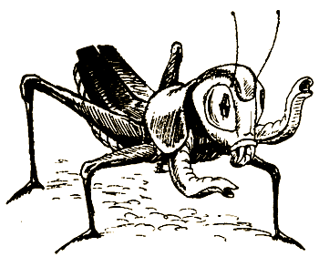

# 0

## Эдвард Паккард

# ПРИШЕЛЬЦЫ ИЗ КОСМОСА

Не пытайся читать эту книгу по порядку, от начала до конца! На этих страницах тебя ждет множество разных приключений, в том числе встречи со странными существами с иных планет. Во время чтения тебе не раз понадобится сделать выбор. Твое решение может привести либо к успеху, либо к катастрофе!

Твои приключения — следствие твоих решений. Ты сам отвечаешь за то, что с тобой случится, поскольку выбор делаешь ты! Приняв решение, следуй указаниям в конце страницы — и выяснишь, что произойдет с тобой дальше.

Как следует подумай, прежде чем принять решение. Взбираясь на Соколиную гору, ты можешь временно потерять память. Кто знает, вдруг в этом и вправду виноваты инопланетяне? Помни, приключения, которые ждут тебя, не только увлекательны, но и опасны. Даже сумев разгадать тайну Соколиной горы, ты можешь не найти того, что искал.

Удачи тебе!

### ОБ АВТОРЕ

Эдвард Паккард — выпускник Принстонского университета и Колумбийского юридического колледжа. Сочиняя увлекательные истории для своих детей, Каролины, Андреа и Уэллса, он разработал особый тип занимательных книг, использованный потом в серии «Выбери себе приключение», — книга-игра.

### О ХУДОЖНИКЕ

Давлетбаев Раиль Рашитович окончил Казанское художественное училище, а затем Московский художественный институт им. В. И. Сурикова. Художник чрезвычайно разносторонний: занимается живописью, станковой графикой и иллюстрацией, а также преподавательской деятельностью.

#### [Начать приключение](#1)

# 1

Ты стоишь на Соколиной горе. Это заповедное место считается одним из самых живописных на свете, но еще нигде ты не ощущал такой тревоги, как здесь. Казалось, всего минуту назад солнце ярко сияло в вышине, а теперь вдруг оно скрылось за горным хребтом.

Время пролетело незаметно — так, словно ты заснул. Целый день прошел как один миг. Но ведь ты точно помнишь, что не спал!

Две недели назад ты приехал погостить к дяде Говарду и тете Нэн на север Калифорнии, а заодно поработать у них на ранчо. Ты отлично отдохнул. Но лето уже на исходе. Через неделю начинаются занятия в школе, и тебе предстоит вернуться домой.

Сегодня утром ты отправился на Соколиную гору вместе с Дасти, собакой твоих дяди и тети. Там из родника ты напился чистой воды. А что было дальше, никак не можешь вспомнить!

Должно быть, дядя и тетя уже волнуются. Пора возвращаться домой. Небо затянули тучи, искать дорогу придется в темноте. Ты берешь рюкзак и кричишь:

— Дасти! Где же ты, глупая дворняга?

Дасти нигде не видно, и это очень странно: обычно он не отходит от тебя ни на шаг. Дасти — крупный, сильный пес, помесь ньюфаундленда и немецкой овчарки. Он вовсе не глупая дворняга. Много лет подряд ты гостил на ранчо во время летних каникул, и вы с Дасти стали неразлучными друзьями.

Уже поздно, надо поскорее найти пса. Ты вешаешь рюкзак на плечо и начинаешь спускаться по тропе.

Пройдя несколько шагов, ты видишь Дасти. Он обнюхивает землю и роет ее передними лапами.

— Дасти! — зовешь ты.

Он вскидывает голову и удивленно смотрит на тебя, а затем встряхивается, словно только что вышел из воды.

— Идем, дружище, тратить время некогда. Надо вернуться домой, пока не поздно. — Ты дважды хлопаешь себя по бедру, приказывая псу следовать за тобой. Не оглядываясь, ты устремляешься вниз по тропе.

Спустя несколько минут вы вдвоем приближаетесь к узкому каменному карнизу, по которому вьется тропа, огибающая выступ скалы. Это самый опасный участок пути — одного неверного шага достаточно, чтобы свалиться с высоты восьмисот футов.

Ты осторожно ступаешь по карнизу. Не найди ты Дасти, пришлось бы провести на горе всю ночь. Несмотря на кромешную темноту, пес уверенно бежит по тропе. Наконец часов в девять вечера вы с Дасти приближаетесь к дому на ранчо и входите в кухню через дверь черного хода.

Оказывается, дядя Говард и тетя Нэн пьют чай за кухонным столом и ждут тебя. Здесь же сидит Джеб — он работает на ранчо. После твоего рассказа о том, что непонятно, как несколько часов для тебя пролетели словно один миг, дядя Говард окидывает тебя скептическим взглядом. Тетя Нэн поднимается и прикладывает ладонь к твоему лбу.

— Боюсь, ты простудился, — говорит она. — Должно быть, поэтому и спал так долго.

— Я не спал! — восклицаешь ты. — День сменился вечером в одно мгновение, а я и не понял, как это произошло!

— Никогда еще не слышал такой чепухи, — говорит дядя. — А я-то считал тебя взрослым человеком.

Ты собираешься возразить ему, но тут вмешивается Джеб:

— Напрасно ты не веришь, Говард. Помню, несколько месяцев назад я слышал о молодой паре, которая во вторник днем отправилась на Соколиную гору на пикник. Так вот, они вернулись обратно в среду вечером и были уверены, что вторник еще не кончился! Говорили, что они чем-то отравились, но сдается мне, дело не в этом. Похоже, тут не обошлось без пришельцев из космоса.

— Мне показалось, что во всем виновата родниковая вода, — говоришь ты. — Перед тем как потерять счет времени, мы с Дасти напились из родника.

Тетя Нэн озадаченно смотрит на тебя.

— Что за чепуха! Во всей Калифорнии не сыщешь воды чище, чем в здешнем роднике. Недавно поговаривали, что ее надо разливать по бутылкам и продавать в супермаркетах.

— Тогда я не понимаю, как… — начинаешь ты.

— Всего лишь слова, — перебивает дядя Говард, качая головой. — В наши времена от загрязнения нигде не спрячешься. Должно быть, в этом все и дело.

— Ты думаешь? Но от загрязнения еще никто не терял память и не засыпал на целый день. Похоже, у него все-таки температура, — возражает тетя Нэн и вновь щупает твой лоб.

— Ума не приложу, что с ним стряслось, — говорит дядя Говард. — Уже поздно, пора спать.

Ночью ты долго лежишь в постели без сна. Как вышло, что ты провел на Соколиной горе шесть часов, даже не заметив этого? Неужели Джеб прав? Может, во всем и вправду виноваты инопланетяне? У тебя возникает жгучее желание вновь подняться на гору. Если как следует поискать, возможно, ты найдешь что-нибудь интересное.

Завтра твой последний день на ранчо. Ты так поглощен делами, что тебе некогда вспомнить о том, что случилось вчера.

Вечером, после того как все укладываются спать, ты слышишь, как за дверью кто-то скулит.

Ты открываешь дверь, и навстречу тебе прыгает Дасти, приглашая поиграть.

В доме темно. Тетя и дядя легли спать. Ты выходишь на веранду.

Воздух чист и свеж, только немного прохладен. Высоко в ночном небе висит луна. Дасти возбужденно скачет вокруг тебя. Он думает, что ты возьмешь его на прогулку. Неужели ему тоже хочется вернуться на Соколиную гору.

В ярком свете луны найти тропу, ведущую вверх по склону горы, будет несложно. У тебя достаточно времени, чтобы взойти на гору и вернуться домой до рассвета. Если тебе повезет, дядя и тетя ничего не узнают о ночной прогулке.

Ты кладешь в рюкзак несколько печений, апельсин и фляжку с водой. Дасти носится вокруг, словно обезумев от радости, едва не сбивая тебя с ног.

Пожалуй, Дасти следует оставить на ранчо: залаяв, он может спугнуть инопланетян. Но с другой стороны, с собакой тебе будет безопаснее.

Оставить Дасти [на ранчо](#18) или взять собаку [с собой](#8)?

# 8

Ты решаешь взять Дасти с собой. Взбираясь по горной тропе, ты вдруг начинаешь нервничать. Дасти тоже волнуется. Луна то и дело ныряет за большие, быстро несущиеся тучи, и вокруг становится так темно, что ты не видишь, куда ступаешь. К часу ночи ты добираешься до опасного участка, где тропа вьется по узкому карнизу на самом крутом склоне горы.

Ты медленно продвигаешься вперед по карнизу. Дасти следует за тобой по пятам, но ты велишь ему отстать, чтобы он не наткнулся на тебя. Вскоре ты благополучно преодолеваешь трудный участок пути, облегченно вздыхаешь, а затем продолжаешь путь и, пройдя сотню футов, достигаешь поворота тропы. В призрачном лунном свете ты видишь смутные очертания вершины горы. У подножия горы журчит вода в роднике, тонкие струйки стекают в расположенный чуть ниже водоем.

Ты приближаешься к роднику по сочной влажной траве. Тем временем Дасти старательно обнюхивает что-то впереди. Внезапно он начинает рыть землю.

Ты наблюдаешь за ним. Наконец пес устает и прекращает свое занятие. Ты подходишь ближе и осматриваешь место, где Дасти рыл землю. Ты не замечаешь ничего необычного, но вдруг прямо у тебя из-под ног раздается странный звук. Ты поспешно отпрыгиваешь, уверенный, что начинается землетрясение. На расстоянии нескольких шагов от тебя в земле образуется круглая десятифутовая яма.

Дасти громко лает. У тебя начинает кружиться голова. Ты вдруг замечаешь, что щуришься от яркого солнца. Ты не веришь собственным глазам: сейчас уже день, а всего несколько секунд назад была ночь! Ты твердо знаешь, что не спал: ты стоишь на прежнем месте. Что же произошло?

Ты осматриваешь землю, но она выглядит как вчера. Нигде не видно никаких ям. Ты чешешь в затылке, пытаясь выяснить, что случилось ночью. Почему время пролетело так незаметно?

— Ладно, Дасти, — говоришь ты, — я не прочь задержаться здесь и осмотреться, но нас наверняка ищут на ранчо. Должно быть, нас хватились еще утром.

Ты быстро спускаешься с горы.

Дядя и тетя ждут тебя на веранде дома. Дядя Говард встает, издалека заметив тебя.

— Неужели ты до сих пор не образумился? Ночные прогулки по горам — опасная привычка. Удивительно, как ты до сих пор не свалился со скалы.

— Верно, — кивает тетя Нэн. — Если ты захочешь навестить нас следующим летом, тебе придется пообещать больше так не делать.

Ты пытаешься оправдаться, но дядя прерывает тебя.

— Скоро полдень, — говорит он. — Через двадцать минут мы уезжаем в аэропорт.

— Чуть не забыл! Ведь я сегодня еду домой! — восклицаешь ты.

— Надеюсь, до начала школьных занятий к тебе вернется память, — замечает тетя, качая головой.

Этим вечером, приехав домой, ты ни словом не упоминаешь о том, что случилось с тобой на Соколиной горе. Ты понимаешь: тебе все равно никто не поверит. Или, хуже того, все решат, что ты не в своем уме.

Проходит несколько месяцев, и ты постепенно забываешь о случившемся. Но следующей весной ты видишь интересную телепередачу. Это интервью с людьми, которые утверждают, что видели НЛО. Показано несколько фотографий, и после каждой ученый, доктор Груэн, объясняет, что фотографии — всего лишь ловкая подделка. Спустя некоторое время ты окончательно убеждаешься, что Землю никогда не посещали инопланетяне.

Ты теряешь интерес к передаче и уже собираешься переключиться на другой канал, как вдруг на экране появляется худощавая седовласая женщина. Она пылает таким энтузиазмом, что ты решаешь выслушать ее рассказ.

— Меня зовут Хетти Клеменс, — говорит женщина. — Я живу в Эврика-Спрингс, в штате Арканзас. Я не видела НЛО и не фотографировала его, но уверена, что встретилась с инопланетянами. Однажды днем я гуляла по лесу. Решив отдохнуть, я устроилась у родника, выбивающегося из-под камней. Внезапно у меня закружилась голова, а потом вдруг наступил вечер. Прошло несколько часов, а я этого даже не заметила! Но я твердо знаю, что не спала.

— Хорошо, — говорит ведущий, — если вы не спали, что же тогда с вами случилось?

— Трудно сказать, — отвечает женщина, — но мне кажется, где-то поблизости находились инопланетяне. По какой-то причине они хотели, чтобы я забыла все, что видела. За эти несколько часов со мной что-то произошло, только я не помню, что именно.

— Спасибо, миссис Клеменс, — говорит ведущий и обращается к ученому: — Как бы вы прокомментировали этот рассказ, доктор Груэн?

Некоторое время ученый молчит, поглаживая короткую бородку.

— Объяснения могут быть различными, — говорит он. — Миссис Клеменс могла просто потерять сознание. Или же с ней случился легкий сердечный приступ, от которого она оправилась через несколько часов. По сути дела, ее рассказ ничем не отличается от других, которые мы слышали сегодня. Ему можно найти логическое объяснение. Все эти необычные явления еще не означают, что их вызвали НЛО. В результате исследований мы выяснили, что доказательств посещения инопланетянами нашей планеты не существует.

— Благодарю вас за участие в программе, доктор Груэн, — говорит ведущий. — Смотрите нашу передачу на следующей неделе; в ней мы…

В этот момент ты выключаешь телевизор.

Ты выключаешь свет и ложишься в постель, не переставая размышлять о Хетти Клеменс и о том, что случилось с ней в Эврика-Спрингс, штат Арканзас. Слишком много подробностей ее рассказа тебе знакомы: прогулка в лесу, отдых у родника, а затем — потеря памяти. У тебя возникает желание выяснить, что случилось с тобой на Соколиной горе…

На следующее лето дядя Говард и тетя Нэн вновь приглашают тебя провести на ранчо пару недель, но с одним условием: ты должен пообещать больше не бродить по горам ночью. Ты уверен, что сумеешь узнать что-нибудь новое о Соколиной горе. Прежде всего тебе хотелось бы отправиться туда, где в земле сама собой образовалась яма. Возможно, ты найдешь там что-нибудь важное.

Ты уже собираешься написать тете и дяде и сообщить, что принимаешь их приглашение, как вдруг тебе случайно попадается статья в газете о некоем профессоре Бернсе из Института исследований НЛО при Университете Колорадо. В статье говорится о том, что профессор собирается в экспедицию, чтобы проверить информацию группы отдыхающих из Стимбоут-Спрингс, которые на несколько часов потеряли память. Стимбоут-Спрингс находится на расстоянии сотни миль к западу отсюда. Профессор ищет добровольцев.

Ты звонишь профессору Бернсу и рассказываешь о том, что случилось с тобой возле источника на Соколиной горе. Профессор заинтересовался твоим рассказом. Он просит тебя присоединиться к экспедиции в Стимбоут-Спрингс, которую он запланировал в июле.

Ты спрашиваешь у родителей разрешения отправиться в поездку вместе с профессором Бернсом. Тебе отвечают, что ты можешь поехать либо в экспедицию, либо в гости к дяде Говарду и тете Нэн. Тебе придется сделать выбор.

Навестив тетю и дядю, ты сможешь вновь подняться на Соколиную гору и обследовать округу. Присоединившись к профессору, ты отправишься в незнакомый Стимбоут-Спрингс — кто знает, что ты там найдешь? Обе поездки обещают быть захватывающими.

Отправиться [в Стимбоут-Спрингс](#43) или в гости [к дяде и тете](#22)?

# 18

Дасти ты оставил дома, а теперь жалеешь об этом. Лучше бы ты взял собаку с собой. Взбираясь на гору, ты чувствуешь, что второй раз тебе может не повезти.

Но что-то гонит тебя вперед — возможно, дух авантюризма, как у знаменитых исследователей и путешественников. А может, это просто глупость.

Добравшись до карниза, ты прижимаешься к стене, стараясь не сделать неверного шага. 

Ты успеваешь пройти по карнизу полпути, когда луна вдруг скрывается за тучей. Тебя обступает кромешная темнота. Ты застываешь как вкопанный, боясь оступиться.

Ты ждешь, когда выйдет луна, но небо становится все темнее. Поднимается ветер. Похоже, в твою сторону движется гроза.

Ты понимаешь, что простоять на карнизе всю ночь нельзя. Надо возвращаться обратно. Ты осторожно делаешь шаг, затем другой. Поскользнувшись на камне, ты летишь вниз, пытаешься за что-нибудь уцепиться, но тщетно — ты продолжаешь скользить вниз по крутому склону, ударяясь о выступающие камни. Ты уже ни на что не надеешься, как вдруг на пути попадается деревце. Ты хватаешься за него, однако непреодолимая сила тянет тебя вниз. Ты падаешь на бедро, ощущая резкую боль в правой ноге.

Луна по-прежнему скрыта за тучами. С того места, где ты находишься, даже не видно, откуда ты упал. Ты ощупываешь ногу. Малейшее прикосновение к ней причиняет тебе боль. Ты уверен, что нога сломана.

Ты начинаешь звать на помощь, но понимаешь, что пользы от этого не будет: на много миль в округе нет ни одной живой души. Дядя и тетя хватятся тебя только завтра утром. Кто знает, что случится с тобой к тому времени, как тебя найдут? Ты стараешься не думать об этом, боль отвлекает тебя. Голова кружится, вскоре ты теряешь сознание.

Ты медленно приходишь в себя. Понадобилось несколько минут, чтобы вспомнить, что с тобой случилось и где ты оказался. Вокруг царит кромешная тьма, ты понятия не имеешь, сколько сейчас времени. Но по крайней мере ты жив.

Ты слышишь лай, хотя он вполне мог тебе почудиться. Ты смотришь в ту сторону, откуда раздается звук. Затем лай повторяется. Ты догадываешься, что это Дасти. Должно быть, он понял, что ты поднялся на гору, и пошел по твоему следу. Ты пытаешься позвать его, но твой голос слишком слаб. Боль невыносима. Спустя несколько минут ты вновь лишаешься чувств.

Очнувшись, ты обнаруживаешь, что оказался в больничной палате. У постели сидят дядя Говард и тетя Нэн, рядом стоит медсестра.

— Слава Богу, ты очнулся! — восклицает дядя Говард. — Как ты нас перепугал! Мы уже думали, что ты не выживешь.

— Врач говорит, что с твоей ногой все будет в порядке, — подхватывает тетя Нэн. — Через три-четыре недели ты вновь начнешь ходить.

Ты пытаешься улыбнуться.

— Спасибо за все, — с трудом выговариваешь ты. — Извините за то, что я доставил вам столько неприятностей.

— Не беспокойся, — останавливает тебя дядя Говард.

— Благодарить надо не нас, а Дасти, — добавляет тетя Нэн. — Он разбудил нас в два часа ночи и лаял до тех пор, пока мы не поняли, что ты исчез. Это Дасти привел спасательную команду к Соколиной горе.

#### КОНЕЦ

# 21

Ты решаешь не рисковать и остаешься внутри. Критиане заделывают брешь. Поток свежего воздуха прекращается, и дым наполняет твои легкие с каждым вдохом. После нескольких глотков чистого воздуха дышать в загрязненной атмосфере становится еще труднее. У тебя першит в горле, душит кашель, глаза чешутся и слетятся.

Возле заделанной дыры лежит один из критиан. Несколько других критиан хлопочут вокруг, окуривая его густым дымом.

Внезапно ты понимаешь, что происходит: критиане оказывают первую помощь пострадавшему. Должно быть, тот критианин вдохнул свежего воздуха, ворвавшегося сквозь брешь. Теперь ты понимаешь, почему критиане живут там, где воздух загрязнен. Должно быть, благодаря мутациям эти существа приспособились дышать загрязненным воздухом. А вот свежий, насыщенный кислородом воздух для них смертелен!

Через мгновение критианин вскакивает. Дым оживил его, но тебе от загрязненного воздуха становится все хуже. Слезятся глаза, болит голова — появляются все симптомы отравления угарным газом. Нужна срочная помощь. Ты должен немедленно вдохнуть свежего воздуха!

Ты направляешься к заделанной бреши, надеясь, что критиане сжалятся и выпустят тебя. Но, не успев сделать двух шагов, оступаешься и падаешь.

К тебе бежит критианин. Одним хоботком он осторожно приподнимает твою голову, пытаясь утешить тебя. Сквозь слезы ты видишь, как остальные критиане несут шланг, с помощью которого оказывали первую помощь пострадавшему товарищу. Они подносят шланг к твоему лицу, из шланга клубами валит дым.

Ты закрываешь глаза и задерживаешь дыхание, но долго тебе так не вытерпеть. Газ, который критиане считают полезным, ядовит для тебя. Ты медленно испускаешь дух.

#### КОНЕЦ

# 22

Ты решаешь навестить тетю и дядю, а заодно еще раз побывать на Соколиной горе. Как только ты прибываешь на ранчо, тетя Нэн напоминает о твоем обещании больше не бродить по горам ночью. Ты уверяешь ее, что сдержишь слово, и в самом деле не собираешься его нарушать. В конце концов, со стороны дяди и тети было очень любезно вновь пригласить тебя в гости — после всех хлопот, которые ты доставил им прошлым летом.

Первую неделю ты настолько занят, что у тебя нет ни малейшей возможности отправиться в горы. Ты помогаешь дяде Говарду ремонтировать ограду. Твой первый свободный день выдается дождливым. Работники с ранчо приглашают тебя в город, в кино, но ты отказываешься. Ты целый год ждал возможности вновь побывать в горах и теперь не собираешься упускать свой шанс.

Тетя Нэн наблюдает, как ты собираешься в путь.

— Напрасно ты идешь в горы, — говорит она. — Во время дождя узкие тропы становятся скользкими.

— Я буду осторожен, — обещаешь ты, — и возьму с собой Дасти. А если задержусь, значит, вновь что-то случилось со временем, и это не моя вина.

Тетя Нэн улыбается.

— Такое вряд ли повторится, — говорит она. — После того как Джеб разболтал в округе о том, что случилось с тобой, кое-кто из местных жителей всерьез заинтересовался этим. Многие поднимались на Соколиную гору, но никто не терял счет времени и не замечал ничего необычного.

— Может быть, мне повезет больше, чем им, — говоришь ты.

Ты берешь у Джеба лопату, зовешь Дасти и отправляешься в горы.

Дождь заставляет тебя сбавить шаг. Добравшись до источника на Соколиной горе, ты чувствуешь сильную усталость. Ты испытываешь разочарование: места вокруг кажутся пустынными и унылыми. Ты оглядываешься и вдруг слышишь, как фыркает Дасти. Он посматривает на тропу, словно хочет вернуться обратно. Секунду ты размышляешь о том, что собака, может быть, предчувствует опасность, а потом понимаешь: Дасти просто промок и прогулка ему надоела.

Ты идешь туда, где видел в земле яму. Копать мокрую землю нетрудно. Прежде чем отбросить землю в сторону, ты внимательно разглядываешь ее, надеясь что-нибудь найти.

Вырыв яму глубиной фута в два, ты вдруг натыкаешься на круглый камень. Быстро окапываешь землю вокруг него, ощущая прилив возбуждения. Вскоре ты понимаешь, что твоя находка слишком гладкая и имеет слишком правильную форму, — это наверняка не камень. Загадочный предмет серого цвета формой и размерами напоминает мяч для регби, сделанный из металла или керамики, — скорее всего, это какая-то капсула, а может, и яйцо!

Через несколько минут тебе удается извлечь капсулу из земли. Ты боишься, что она окажется чересчур тяжелой, но вскоре выясняешь, что без труда можешь поднять и нести ее. Ты осматриваешь капсулу, разыскивая швы или отверстия, но ее поверхность выглядит идеально ровной. Ты встряхиваешь капсулу, но шума изнутри не слышишь. Что же это такое?

Дасти подходит поближе и обнюхивает твою находку. Внезапно он начинает яростно лаять, затем отпрыгивает и смотрит на тебя, вдруг успокоившись и замолчав.

— Мы нашли ключ к разгадке, Дасти, — говоришь ты. — Теперь остается только выяснить, что это такое.

Некоторое время ты копаешь землю вокруг ямы, чтобы посмотреть, не найдется ли еще что-нибудь, но больше ничего не замечаешь. Ты вновь закапываешь яму, укладываешь капсулу в рюкзак и начинаешь спускаться с горы. Дасти бежит впереди.

Ты возвращаешься на ранчо около двух часов дня, на кухонном столе находишь записку: в ней говорится, что все уехали в город, в кино.

Ты принимаешь горячий душ и переодеваешься в сухую одежду я затем кладешь капсулу на кухонный стол и рассматриваешь ее.

Ты обстукиваешь капсулу ложкой. Судя по звуку, внутри что-то есть. Ты проводишь по поверхности капсулы кухонным ножом. Материал довольно прочен, но тебе удается поцарапать его. Возможно, его удастся распилить ножовкой — это единственный способ вскрыть капсулу и посмотреть, что находится внутри.

Ты уносишь капсулу в мастерскую и уже собираешься распилить ее, как вдруг задумываешься. Может быть, следует спросить у кого-нибудь совета? Пожалуй, тебе поможет профессор Бернс из Института исследований НЛО.

[Распилить](#84) капсулу или обратиться [за советом](#110) к профессору Бернсу?

# 34

Ты объясняешь бальянам, что тебе пора возвращаться на Землю. Хотя бальяне опечалены предстоящим расставанием, они все понимают. Созвав друзей из соседних пещер, они устраивают в твою честь прощальный праздник.

Рано утром ты уходишь. Путь твой лежит через лес, мимо зеленого озера, к строению, напоминающему то, из которого ты сбежал.

В огромном яйцеобразном строении, похоже, нет никаких отверстий. Ты обходишь вокруг него, разыскивая что-нибудь вроде окна или двери. Сделано оно из вещества, похожего на пластмассу, и кажется идеально гладким.

Вскоре, ты замечаешь нечто необычное: тонкую секцию стены, которая светится так же, как и стена купола, который ты видел на Земле. Эта стена надежно преграждает путь воздуху, однако и люди, и критиане способны с легкостью проходить сквозь нее.

Ты проходишь прямо сквозь стену. Ты не чувствуешь ни сопротивления, ни боли — ничего, кроме легкого пощипывания, которое ощущал и прежде, когда проходил сквозь силовой купол на Земле. Дым вновь окутывает тебя, и ты начинаешь кашлять. Ты уже забыл, как загрязнен воздух внутри таких строений. После свежего воздуха планеты он кажется особенно зловонным.

Ты впадаешь в панику: в такой атмосфере тебе не выжить! Затем ты замечаешь то, что надеялся найти, — силовой купол. Он возвышается на огромной светящейся платформе, как купол на Земле. Три робота тащат его к той части стены, сквозь которую ты только что прошел. Возможно, предстоит запуск купола!

У тебя возникает желание войти в купол — может быть, это твой шанс на спасение. Но беда в том, что ты понятия не имеешь, куда полетит купол. Что, если он попадет на какую-нибудь планету, не пригодную для жизни человека? Тогда последние дни ты проведешь в муках! И все-таки есть шанс, что купол отправится на Землю.

Должно быть, надо просто обратиться к критианам и попросить их о помощи. Но каким бы ни было твое решение, принимать его следует немедленно.

Входишь [в силовой купол](#68) или [просишь помощи](#80)?

# 38

Похоже, лучше всего будет оставить существо в капсуле. Если оно действительно попало на Землю из космоса, то во многом отличается от человеческих детей или детенышей животных. Должно быть, слизь внутри капсулы обеспечивает это существо питательными веществами, необходимыми для жизни и развития.

Ты внимательно разглядываешь странное маленькое существо. Оно производит на тебя отталкивающее впечатление. Пожалуй, надо назвать его Уродцем, думаешь ты.

Чтобы не лишиться своей находки, ты помещаешь капсулу в пустую проволочную клетку для цыплят и переносишь ее в амбар, поближе к мастерской. Если Уродец ухитрится выбраться из капсулы, то далеко не убежит.

Все на ранчо изумлены твоей находкой. Никто не знает, что делать, и на тебя градом сыплются самые разные предложения. Один из работников ранчо советует убить неизвестное существо.

— Такие твари могут быть опасны, — предостерегает он.

Ты решаешь подождать и посмотреть, что будет дальше.

Тем временем ты навещаешь Уродца каждый день. Он быстро растет, а зловонная маслянистая слизь в капсуле понемногу убывает. Наконец ты понимаешь: существо питается этой отвратительной массой. Беда в том, что она заканчивается. Придется придумать, как быть дальше, когда запасы питательной смеси в капсуле иссякнут.

После нескольких неудачных экспериментов тебе удается изготовить смесь из использованного машинного масла, мусора, кусочков пластмассы и кислоты из аккумулятора. Она выглядит и пахнет, как слизь, которой питается Уродец.

Ты ставишь миску со смесью в клетку. На следующий день выясняется, что Уродец не только выбрался из капсулы, но и опустошил миску.

Уродец постепенно растет. Каждый день ты отправляешься на бензозаправочную станцию за отработанным машинным маслом и кислотой от аккумуляторов — единственной пищей, пригодной для Уродца. Через неделю он вырастает до размеров небольшой собаки.

Однажды Дасти входит следом за тобой в амбар. Едва увидев Уродца, он начинает рычать. Ты с ужасом представляешь себе, что случится, если Дасти сломает клетку, поэтому накрываешь ее проволочной сеткой и закрываешь дверь амбара на засов.

Пока инопланетянин растет, твои дядя Говард и тетя Нэн часто посматривают на него с изумлением и тревогой.

Однажды они вместе с тобой приходят проведать странное существо. Ты с удивлением обнаруживаешь, что Уродец сумел проделать в сетке отверстие — достаточно большое, чтобы высунуть в него один из хоботков-антенн. Обхватив конечностью засов на дверце клетки, Уродец поднимает его!

Ты бросаешься к клетке.

— Закрой ее понадежнее, — велит дядя Говард. Он приносит с верстака прочную доску, молоток и гвозди. Через несколько минут дверца надежно заколочена.

Уродец съеживается в глубине клетки, не сводя с тебя выпуклых глаз.

— Прежде всего, нам известно, что это разумное существо, — говорит дядя Говард.

— Судя по всему, оно еще ребенок, — добавляет тетя Нэн. — Но похоже, оно гораздо разумнее нас.

— И все-таки держать его здесь нельзя, — возражает дядя Говард. — Надо сообщить о нем властям.

Тетя Нэн кладет руку тебе на плечо.

— Так будет лучше, — говорит она. — Кроме того, через два дня ты уезжаешь домой. Ты не сможешь взять Уродца с собой. А мы не сумеем позаботиться о нем до твоего следующего приезда.

— Ты сам сообщишь о находке или это сделаю я? — спрашивает дядя. Судя по его тону, продолжать спор бессмысленно.

— Я сам, — отвечаешь ты.

Осталось только решить, кому сообщить об Уродце. Первое, что приходит тебе в голову, — связаться с профессором Бернсом. Но затем тебя вдруг осеняет: если после твоего отъезда что-нибудь случится и выяснится, что Уродец опасен, тебе придется ответить за все. Пожалуй, стоит позвонить в полицию и попросить совета.

[Связаться с профессором](#88) Бернсом или [позвонить в полицию](#74)?

# 43

Ты звонишь профессору Бернсу, говоришь, что принимаешь его приглашение, и 15 июля прибываешь в Колорадо. Профессор встречает тебя в аэропорту и везет в отель «Боулдерадо», где тебе предстоит провести ночь.

Вечером ты встречаешься с профессором и его сыном Дереком, который на два года старше тебя. Профессор Бернс заказывает столик на четверых; ты оглядываешься, поджидая четвертого. В этот момент к вам подходит кареглазая женщина средних лет. Ее лицо кажется тебе знакомым — ты вспоминаешь, что однажды видел ее по телевизору. Это доктор Нера Вивальди, известный специалист по межвидовому общению.

После того как профессор Бернс знакомит тебя с доктором Вивальди, вы заказываете пиццу и напитки. Доктор Вивальди говорит, что согласна с твоей гипотезой о том, что потеря памяти была вызвана воздействием инопланетян.

— Но я никак не могу понять, зачем инопланетянам понадобилось стирать воспоминания людей, — замечаешь ты.

Доктор бросает быстрый взгляд в сторону профессора Бернса.

— Чтобы люди не обнаружили их. Вы согласны, профессор?

— Можно сказать и по-другому, — отвечает он, — чтобы земляне забыли о том, что видели их.

Приносят пиццу, и ты кладешь себе на тарелку большой кусок.

— Мне не хотелось говорить тебе об этом по телефону, — начинает профессор Бернс, — но перед тем, как отдыхающие из Стимбоут-Спрингс потеряли память, один из них успел сделать цветную фотографию.

Он кладет на стол снимок. На нем изображено необычное строение высотой около восьми футов. Оно светится розовато-зеленым сиянием.

— По-моему, это приспособление, с помощью которого инопланетяне исследуют Землю. Я назвал его «силовой купол», — объясняет профессор.

— Он может также служить прибором для сбора информации, — добавляет доктор Вивальди, — хотя в таком случае на нем имелись бы антенны.

— Если техника инопланетян настолько развита, им не нужны антенны, — вмешивается Дерек.

— Вполне возможно, — кивает доктор Вивальди. — Но я склонна считать, что техника инопланетян подобна нашей, разве что они немного опередили нас в развитии. Однако не следует забывать, что их мировоззрение может быть совсем непохожим на наше.

— Я долго думал об этом, — говоришь ты. — Возможно, силовой купол — колония инопланетян. Каждый силовой купол — это база для отдельного сообщества, если только моя догадка верна.

— Правдоподобное объяснение, — кивает доктор Вивальди. — А может, каждый силовой купол — это ловушка, обеспечивающая пищей отложенные в нее яйца.

— Вы имеете в виду яйца, из которых вылупляются инопланетяне? — спрашивает Дерек.

— Вот именно, — подтверждает доктор. — Но пока в нашем распоряжении нет фактов, это всего лишь догадки.

На некоторое время разговор прекращается, вы вчетвером молча доедаете пиццу. Профессор Бернс платит по счету. Выходя из ресторана, он предупреждает вас:

— Сегодня всем нам надо пораньше лечь спать. Завтра рано утром мы отправляемся в Стимбоут-Спрингс.

На следующее утро вы все вместе завтракаете и в семь часов отправляетесь в путь. Профессор Бернс ведет джип, а доктор Вивальди сидит рядом с ним. Вы с Дереком занимаете заднее сиденье.

Город Боулдер находится у восточного подножия Скалистых гор. Едва вы выезжаете из города, как машина начинает подниматься в гору. По мере увеличения высоты над уровнем моря ты несколько раз сглатываешь слюну, пытаясь ослабить давление на барабанные перепонки. Вскоре вы оказываетесь в совсем ином мире: со всех сторон вас окружают горные пики высотой в четырнадцать тысяч футов, увенчанные снеговыми шапками.

По пути к Стимбоут-Спрингс профессор посвящает тебя в подробности своих исследований.

— Когда-то неподалеку от Стимбоут-Спрингс существовал естественный источник или гейзер. Он издавал звуки, напоминающие шум парохода, — по крайней мере так мне говорили. Во всяком случае, в округе и сейчас немало источников. К тому источнику, к которому едем мы, часто приезжают купаться люди, знающие о его существовании. Вода в нем настолько теплая, что не замерзнешь даже зимой.

— Похоже, это подходящее место для размножения инопланетян, — говоришь ты.

— Пожалуй, да, — отвечает профессор. — Когда-то здешняя вода считалась самой чистой в мире. Правда, какова она теперь, не знаю. Стимбоут-Спрингс стал большим лыжным курортом, здесь понастроили столько отелей, что обойтись без загрязнения никак не могло.

— Меня тревожит одна мысль, — говоришь ты, — каким образом нам удастся сохранить память? Если мы разыщем купол, как мы запомним, что видели его?

— Об этом позаботилась доктор Вивальди, — отвечает профессор Бернс.

— Да, — кивает доктор Вивальди. — Как вам известно, человеческий мозг вырабатывает электрические импульсы. По-моему, инопланетяне направляют на человека сконцентрированные пучки электрических волн, которые стирают воспоминания нескольких последних часов. Думаю, мы сможем избежать воздействия этих волн, надев созданные мною шлемы. В них предусмотрено изоляционное покрытие. Я прихватила с собой по шлему для каждого из нас.

После четырех часов езды вы добираетесь до перевала Кроличьи Уши и начинаете спускаться в долину. Горы у восточного края долины буквально изрезаны лыжнями. Ниже виднеется деревушка, где отдыхают лыжники.

Профессор Бернс проезжает мимо небольшого городка и сворачивает на старую дорогу. По пути вам попадается несколько развилок, и профессор останавливается, чтобы свериться с картой. Проехав еще некоторое время, он тормозит на усыпанном мелкой галькой берегу узкого ручья. Вы вчетвером надеваете шлемы и выходите из джипа.

Сверяясь с картой, профессор Бернс ведет вас туда, где ручей впадает в довольно большой пруд.

— Видите эти пузырьки на поверхности? — говорит он. — Это горячий источник. — Повернувшись к тебе, он продолжает: — Пожалуй, мы поступим так: ты останешься с доктором Вивальди и вы осмотрите этот берег, а мы с Дереком отправимся к другому. Мы потеряем друг друга из виду, но будем слышать голоса. Если мы задержимся, значит, обнаружили что-то интересное.

Вы с доктором Вивальди садитесь на поваленное дерево и начинаете наблюдение. Через час доктор Вивальди отправляется на поиски остальных. Проходит несколько минут, и ты видишь, как на лужайке у берега пруда возникает силовой купол!

Формой и размерами купол напоминает эскимосскую хижину. Он светится мерцающим розоватым сиянием. Ты не можешь отвести от него глаз!

Ты оглядываешься в поисках доктора Вивальди, но ее нигде не видно. Ты вновь устремляешь взгляд на силовой купол, гадая, уходит он под землю или расположен только над поверхностью. Ты медленно идешь к куполу, надеясь, что даже вблизи от него шлем защитит тебя.

Ты подкрадываешься все ближе и ближе, как кот, преследующий птицу. На расстоянии нескольких футов от купола ты вдруг слышишь звон в ушах, но любопытство влечет тебя вперед. Вскоре тебе остается лишь протянуть руку, чтобы коснуться светящейся стены.

Вблизи силовой купол выглядит еще необычнее, чем издалека. Ты размышляешь о том, что находится внутри. У тебя возникает ощущение, что твоя ладонь беспрепятственно пройдет сквозь стену купола!

Ты медленно подносишь ладонь к странной светящейся поверхности. Тепла ты не чувствуешь, но что-то пощипывает кончики пальцев.

Коснувшись силового купола, ты можешь заработать радиационный ожог или что-нибудь еще похуже. Тебе не терпится узнать об этом странном предмете все, что только можно, но, вероятно, разумнее будет отступить и разыскать остальных.

[Дотрагиваешься](#58) до светящегося купола или [уходишь](#103)?

# 58

Ты подносишь ладонь все ближе к куполу и наконец касаешься его пальцами. Затаив дыхание, ты быстро погружаешь пальцы в светящуюся стену.

Странно, но ты не почувствовал ни боли, ни жара, только сильное пощипывание, пока ладонь исчезала за стеной.

Ты быстро отдергиваешь руку и с тревогой осматриваешь ее. С ладонью ничего не случилось, словно она прошла сквозь солнечный луч. Твое любопытство усиливается. Одним быстрым движением ты погружаешь в светящуюся стену всю руку до плеча, а затем и сам шагаешь сквозь стену!

В этот момент у тебя пощипывает все тело, но, едва ты оказываешься внутри, это ощущение пропадает. Поморгав, ты пытаешься понять, что перед тобой. Пространство выглядит огромным, намного больше, чем казалось снаружи. В нем не заметно никаких силуэтов или теней — только свет. Похоже, он образует все, что тебя окружает, поддерживает тебя — так, что тело кажется почти невесомым. Несмотря на огромные размеры купола, ты чувствуешь себя словно в клетке — свет преграждает тебе обратный путь.

Ты делаешь несколько шагов вперед, протягиваешь руки, уверенный, что найдешь зеркала, создающие иллюзию пространства. Но вокруг нет никаких зеркал, только сияние.

Ты понимаешь, что это не обычный свет — он не имеет ничего общего с земным. Это не только свет, но и вещество.

Поначалу ты так увлечен, что забываешь об испуге. Внезапно тебя окатывает волна паники. Надо поскорее выбраться отсюда!

Ты поворачиваешься и устремляешься в ту сторону, откуда пришел. Оказывается, ты ушел дальше, чем предполагал. С места, где ты стоишь, расстояние до стен купола кажется почти бесконечным.

Ты мечешься из стороны в сторону. Через пару минут понимаешь: куда бы ты ни повернул, как бы быстро ни бежал — никуда не придешь! Ты попал в ловушку!

Внезапно до тебя доходит, что произошло. В ярости ты стаскиваешь шлем и швыряешь его на пол, с удивлением замечая, что он тоже светится.

Ты закрываешь глаза, надеясь, что видишь сон, но понимаешь, что на самом деле это не так. Те, кто построил силовой купол, добились более значительного прогресса в технике, чем жители Земли. Тебе остается лишь надеяться, что создатели купола — дружелюбные существа.

Внезапно ты чувствуешь, что движешься: силовой купол куда-то уносит тебя! Ты понимаешь, что остальные бросятся на поиски, но не найдут никаких следов.

Конечно, о твоем исчезновении сообщат родителям и в полицию, но, если полиция пришлет водолазов, чтобы обыскать дно пруда, полагая, что ты утонул, на дне ничего не найдут. Только профессор Бернс, доктор Вивальди и Дерек могут догадаться, что ты очутился внутри силового купола — может, на Земле, а может, и в другом измерении, на другой планете.

Ты с трудом сдерживаешь слезы, не зная, увидишь ли еще когда-нибудь родных и друзей.

Проходит немало времени — ты не можешь определить, сколько именно. Воздух становится спертым и дымным, словно где-то поблизости работает дизельный двигатель. От вони у тебя разболелась голова.

Ты обнаруживаешь, что лежишь на мягкой пластиковой полке, приподнятой над полом. Окружающее тебя пространство по-прежнему кажется бесконечным. Несмотря на то что оно хорошо освещено, из-за дыма ты почти ничего не видишь.

Ты понятия не имеешь, где находишься — на Земле, в космосе или на какой-нибудь далекой планете. По правде говоря, до этого тебе нет, дела. Главное сейчас — выбраться отсюда.

Ты с трудом приподнимаешься. К тебе сразу подходят два насекомообразных существа. На их головах выделяются огромные выпуклые глаза. Каждое существо в длину достигает четырех футов, у них по четыре ноги и еще по две конечности, напоминающие миниатюрные слоновьи хоботы.

Ты инстинктивно отшатываешься — существа останавливаются. Появляется третье существо, которое держит в одном из хоботков миску. Похоже, тебе предлагают поесть. Ты улыбаешься и берешь миску, наполненную чем-то вроде крохотных маслянистых печений. Другое существо подает тебе кружку с коричневой жидкостью. К твоему изумлению, это существо заговаривает на твоем родном языке.

— Не бойся, — говорит существо. — Мы — критиане. Мы не причиним тебе вреда.

Ты берешь кружку из присосок на концах вытянутых хоботков критианина.

— Где я? — спрашиваешь ты. — И откуда вы знаете наш язык?

— Ты на планете Балья, — отвечает существо. — Мы освоили ваш язык, когда высаживались на вашу планету. А тебя привезли сюда, чтобы как следует изучить.

От духоты и дыма тебе становится плохо. У тебя першит в горле, ты кашляешь и чихаешь. Наклонившись, ты ставишь миску и кружку на пол, боясь потерять сознание. В этот момент один из критиан бросается к тебе, держа в хоботках цилиндрический сосуд. Он направляет на тебя трубку, идущую от сосуда, и твою голову окутывает плотное облако дыма. Ты падаешь на пол, судорожно хватая ртом воздух.

Ты слышишь, как критиане переговариваются на странном языке. Похоже, они спорят. Критианин с сосудом отступает.

Ты смотришь на двух критиан, которые принесли тебе еду и питье.

— Мне нужен свежий воздух, — умоляюще говоришь ты.

Один критианин подходит ближе, уставившись на тебя огромными выпуклыми глазами.

— Это и был свежий воздух, — добродушно объясняет он, — но он тебе не помог.

Твои глаза слезятся от дыма, слезы струятся по щекам.

— Как я сюда попал? — спрашиваешь ты. — Зачем вы прилетели на Землю?

Один из критиан подходит поближе.

— Наружный воздух на этой планете вреден для живых существ, — объясняет он. — Мы вынуждены постоянно находиться вот в таких жилищах. На Земле они вскоре тоже появятся. Такой образ жизни нас вполне устраивает. Вот почему мы высадились на эту планету. Как только Земля будет готова к переселению, мы переберемся на нее.

— Как только Земля будет готова? — переспрашиваешь ты. — Что вы имеете в виду?

— Как только с твоей планеты исчезнут все вредные примеси. Когда условия будут подходящими.

У тебя возникло еще больше вопросов, но тебе трудно сосредоточиться. От духоты у тебя кружится голова.

Ты пытаешься собраться с мыслями и решить, что же теперь делать, как вдруг раздается сигнал тревоги. Сквозь дымку ты видишь критиан, бегущих во все стороны. Некоторые несут лестницы и доски, другие — различные инструменты. Стоящий рядом с тобой критианин кричит, перекрывая общий шум:

— В стене образовалась брешь! Надо помочь заделать ее! — Он мгновенно убегает.

Ты медленно ковыляешь за ним. Сквозь дым тебе удается разглядеть изогнутую стену строения. Она покрыта копотью и изъедена ядовитыми парами. В одном месте она стала особенно тонкой и прорвалась. Пока ты смотришь, как критиане заделывают брешь, поток свежего воздуха ударяет тебе в лицо.

Это свежий воздух — такой же, как на Земле! Воздух поступает сквозь брешь в стене. Ты бросаешься к отверстию и делаешь глубокий вдох. Тебе сразу становится легче. Только бы выбраться отсюда!

— Не подходи к отверстию! — кричат критиане. — Ты погибнешь: этот воздух смертелен.

Раздумывать некогда: через несколько секунд брешь будет заделана. Инстинкт подсказывает тебе, что надо бежать, но рисковать ты боишься. Однако без свежего воздуха ты вскоре умрешь.

[Выбраться](#70) через отверстие в стене или предпочитаешь [не рисковать](#21)?

# 68

Ты решаешь войти в силовой купол, проникнув сквозь светящуюся стену так, как сделал это на Земле. Ты ощущаешь знакомое пощипывание и теряешь ориентацию. Спустя некоторое время ты чувствуешь движение с медленным ускорением и понимаешь, что тебя куда-то везут.

Затем ты засыпаешь — сколько продолжается этот сон, тебе неизвестно. Проснувшись, ты обнаруживаешь, что по-прежнему находишься среди светящихся стен, только теперь купол стоит на месте. Должно быть, он уже совершил посадку.

К твоему изумлению, стены купола вдруг исчезают, и ты оказываешься на свободе. Ты видишь желтовато-оранжевый солнечный свет. В воздухе сильно пахнет серой и дымом.

Тебя высадили посреди болота, заваленного мусором. Ты осторожно пробираешься между кучами пластика и металла, направляясь к холму, который заметил впереди.

Сквозь смог ты с трудом различаешь очертания холма и сухие деревья на нем. По пути попадается мертвая чайка. Теперь тебе все ясно — вряд ли такие же чайки водятся на других планетах. Ты вернулся домой, попал в будущее Земли!

Ты начинаешь кашлять и чихать, как в жилище у критиан, понимая, что в этой зловонной атмосфере долго не протянешь. Затем направляешься к вершине холма, надеясь отыскать убежище там.

Достигнув вершины холма, ты видишь огромное куполообразное строение, возвышающееся на голой равнине. Ты сразу понимаешь, что это — убежище, которое построили люди, чтобы выжить в загрязненной окружающей среде.

Ты уверен, что сумеешь быстро добраться до строения и что люди, живущие в нем, впустят тебя внутрь. Вот только вопрос: какая жизнь ждет тебя там?

#### КОНЕЦ

# 70

Ты бросаешься к отверстию. Один из критиан бежит следом и обхватывает твою ногу хоботком, пытаясь удержать тебя.

Сделав пол-оборота, ты вырываешься и падаешь, но скоро снова вскакиваешь и мчишься к отверстию, набираясь сил по мере того, как легкие наполняет свежий воздух. Оказавшись на свободе, ты оглядываешься и обнаруживаешь, что критиане даже не думают преследовать тебя, они усердно заделывают брешь в стене, спеша прекратить приток кислорода.

Воздух пахнет свежестью и сосновой смолой. Ты свободен, но не представляешь себе, какие опасности могут подстерегать тебя. Хотя в жилище критиан воздух был загрязненным, там тебя по крайней мере могли защитить. На секунду у тебя возникает желание вернуться, но затем ты понимаешь, что не выживешь в душной, загазованной атмосфере.

Ты осматриваешься. Перед тобой расстилается луг, поросший высокой сочной травой. Поодаль громоздятся скалы, словно серые островки в зеленом море. За лугом, примерно на расстоянии мили, виднеется искрящееся зеленое озеро. Его берега усыпаны пестрыми цветами. На утесах и холмах растут сосны с голубоватой хвоей. Огромное, но не такое яркое, как на Земле, солнце висит над холмами. Его лучи имеют чудесный красноватый оттенок, на него можно смотреть не жмурясь.

При виде живописного пейзажа ты задумываешься: должно быть, так выглядела Земля до того, как ее атмосфера была загрязнена. От этой мысли тебе становится грустно.

Ты не знаешь, удастся ли тебе здесь выжить. Быть может, какой-нибудь хищный зверь выследит тебя и съест. Но выбора нет. Поскольку вернуться обратно нельзя, надо идти вперед — через луг к озеру, где ты надеешься найти пищу и пригодную для питья воду.

Шагая через луг, ты оглядываешься, опасаясь животных и насекомых, которые могут прятаться в траве, доходящей тебе до колена. Несколько причудливых бабочек пролетают мимо, на берег озера спускается стайка птиц. Эта планета во многом напоминает Землю.

У берега озера ты обнаруживаешь множество разных видов насекомых, в том числе и пчел размером с небольших птичек. Ты наблюдаешь, как стремительно они перелетают с цветка на цветок. Похоже, жал у них нет, но на всякий случай ты стараешься держаться от них подальше.

Вода в озере оказывается кристально чистой. Зачерпнув ее ладонями, ты с удовольствием пьешь.

На другом берегу озера ты видишь поляну, сплошь заросшую кустарником с темно-синими ягодами, и решаешь направиться туда. Если эти ягоды съедобны, тебе больше не придется беспокоиться о пище.

Только ты протянул руку к ягодам, как из ближайших кустов слышится шорох. Ты застываешь на месте, пристально вглядываясь в листву.

Тебе удается различить несколько фигур: с виду они напоминают человеческие, только покрыты длинной спутанной шерстью. Рост их не более четырех футов. Эти гуманоиды собирают ягоды и складывают их в полотняные сумки.

Наблюдая за ними, ты вдруг чувствуешь, что страшно проголодался. Ты срываешь ягоду и отправляешь в рот. Ее вкус восхитителен. Ты начинаешь собирать ягоды, но тут два существа направляются к тебе.

Неужели собираются напасть на тебя? Но нет, существа предлагают тебе еще ягод. Они заговаривают с тобой на своем языке — его составляют щелкающие и свистящие звуки, непривычные для человеческого уха.

Ты принимаешь ягоды и благодаришь незнакомцев, хотя знаешь, что они не понимают тебя. Впрочем, они настроены дружелюбно, а все остальное неважно.

По-видимому, в отличие от критиан эти существа недостаточно развиты, чтобы путешествовать в космосе. Ты сомневаешься, что они когда-либо слышали земные языки. Вряд ли они выучат твой язык, поэтому ты решаешь научиться говорить на их языке. Возможно, это твой единственный шанс выжить.

Ты медленно начинаешь изучать странный язык, состоящий из свиста и щелканья. Инопланетяне дают тебе понять, что будут рады, если ты поселишься среди них. Ты благодаришь их и перебираешься в одну из пещер.

Ты выясняешь, что эти существа называют себя бальянами, а свою планету — Балья. Их жизнь во многом напоминает жизнь пещерных людей, которые существовали на Земле пятьдесят тысяч лет назад. Бальяне собирают съедобные коренья и ягоды, охотятся с копьями и ставят силки. Они даже умеют разводить огонь и готовить на нем пищу. Ты наблюдаешь, как они изготавливают наконечники для стрел и утварь из металлов, найденных в горах.

Время идет. Ты веселишься вместе с детьми, качаясь на лианах, и вместе со взрослыми охотишься на крупную дичь. С одним бальянином ты особенно подружился. На твоем языке его имя можно передать только приблизительно: Хрк.

Ты живешь у Хрка и его семьи много месяцев подряд, занимаясь охотой и рыбной ловлей, а иногда даже танцуя вокруг костра. Ты уже хорошо владеешь языком бальян, и Хрк рассказывает тебе много интересного о жизни планеты.

Однажды вечером, когда вся семья сидит у костра, Хрк рассказывает тебе историю племени.

— Испокон веков, с тех пор как растет трава и текут реки, бальяне жили под двумя голубыми Лунами на земле своих предков, — начинает он. — Они смотрели в небо и видели, как коричневая планета Крития плывет среди звезд.

Однажды, много лун назад, в ночном небе появилась новая звезда — она летела, приближаясь к нашему дому. Она была такой яркой, что затмевала дневной свет.

— Это была не звезда, — продолжает Хрк. — Она пронеслась по небу, как гигантский метеор, и упала возле моря. Отправившись туда, мы обнаружили не камень из космоса, а корабль с существами, каких мы раньше никогда не видели. Они построили большие жилища — как то, из которого вышел ты. Закончив работу, они больше не выходили из жилищ. А мы, бальяне, никогда не приближались к ним. В легендах говорится о том, что из этих жилищ дует зловонный ветер, который губит нас.

Ты с интересом слушаешь его рассказ.

— Никак не могу понять одно, Хрк, — говоришь ты. — Много ночей подряд я смотрел на небо. Я видел все звезды и две голубых луны, но ни разу не замечал Критию, планету, о которой ты говоришь.

Бальянин кивает.

— Критии больше нет, — говорит он. — Ее уничтожила звезда.

— Когда это случилось?

— За несколько месяцев до того, как неизвестные существа высадились на нашу планету.

Ты киваешь.

— Кажется, я понял, что произошло, — говоришь ты. — Существа, которые живут в больших жилищах, называют себя критианами. Должно быть, они прилетели с планеты Крития. Наверное, на протяжении всей истории своего существования они загрязняли родную планету. Со временем они настолько приспособились к загрязнению, что теперь оно необходимо им, чтобы выжить.

— Должно быть, они заранее знали, какая катастрофа грозит их планете, — говоришь ты. — Звезда, которая уничтожила ее, была, наверное, кометой или метеоритом. Они спаслись бегством, перебравшись на другую планету. Ваша планета оказалась поблизости, вот они и прилетели сюда, но вскоре обнаружили, что здешний воздух и вода слишком чисты для них. Чтобы выжить, они были вынуждены построить большие герметичные жилища и создать в них загрязненную атмосферу.

— Зачем же критиане привезли на эту планету тебя? — спрашивает Хрк. — Они разрешат тебе когда-нибудь вернуться домой?

— На эти вопросы могут ответить только сами критиане, — говоришь ты. — Похоже, пришло время расспросить их.

О критианах тебе теперь стало известно гораздо больше. Бальяне — разумные существа, но их техника примитивна. С точки зрения землянина, они живут в каменном веке. Только критиане способны помочь тебе вернуться домой.

Ты размышляешь над тем, стоит ли попробовать вернуться в жилище критиан. Это рискованно: они могут подумать, что ты нападаешь на них, и убить тебя. А если они впустят тебя внутрь, ты не выживешь в загрязненном воздухе. Но без помощи критиан тебе никогда не вернуться на Землю.

Отправиться [к критианам](#34) или остаться [у бальян](#83)?

# 72

Ты решаешь вынуть существо из капсулы, чтобы было удобнее заботиться о нем. Ты вынимаешь существо и несешь его к раковине, чтобы отмыть в чистой воде с мылом.

Вымытое существо выглядит гораздо лучше, чем-то напоминая тебе кузнечика. Только после мытья ты впервые прикасаешься к нему голыми руками. Чешуйчатое тельце на ощупь оказывается гладким и мягким. Существу надо дать имя, и ты называешь его Уродцем, поскольку привлекательным оно тебе не кажется.

Ты находишь одеяло и устраиваешь гнездо для Уродца в пустой клетке для цыплят, перенесенной в мастерскую. Рядом с клеткой ты ставишь блюдце с молоком, миску с консервированным тунцом, немного салата и маленький гамбургер, найденный в доме. Ты надеешься, что неизвестному существу должна понравиться хоть какая-нибудь еда.

К сожалению, инопланетянин отказывается есть и пить. Он только съеживается, поводя туда-сюда двумя похожими на антенны хоботками. Выглянув в окно, ты видишь подъезжающий к дому фургон — тетя и дядя возвращаются из кино. Ты бежишь навстречу им, чтобы рассказать про Уродца.

Что и говорить, твоя находка ошеломила их. Дядя и тетя наперебой подсказывают тебе, как поступить с неизвестным существом, но ты уверен, что самостоятельно найдешь выход. Ты решаешь некоторое время понаблюдать за Уродцем, предлагая ему различную еду, пока наконец не выяснится, что ему по вкусу.

По-видимому, ты был недостаточно внимателен к неизвестному существу: через несколько дней Уродец погибает. Он так и не прикоснулся к еде, которую ты предлагал ему. Ты с грустью похоронил маленького инопланетянина среди елей за амбаром.

До конца каникул ты успеваешь еще раз побывать на Соколиной горе, но больше ничего не находишь.

Вернувшись домой, ты пишешь профессору Бернсу, сообщая ему об Уродце и о том, что случилось с тобой. Ты спрашиваешь, удалось ли ему найти что-нибудь в Стимбоут-Спрингс и можешь ли ты чем-нибудь помочь.

Спустя несколько недель ты получаешь ответное письмо — но не от профессора Бернса, а от его сестры, миссис Крафт. В письме говорится следующее:

«Отвечаю на Ваше письмо, адресованное моему брату, Хендрику. Несколько недель назад, во время экспедиции в Стимбоут-Спрингс, Колорадо, он таинственным образом исчез. Никто не знает, что с ним случилось и где он. Если он вернется, я передам ему Ваше письмо».

Профессора Бернса так и не находят, и больше ты не получаешь никаких вестей ни от него, ни от его сестры. У тебя остается множество неразрешенных вопросов. Что делало на Земле найденное тобой существо? Почему оно так быстро погибло? И самое главное: что случилось с профессором Бернсом?

#### КОНЕЦ

# 74

Ты принимаешь решение позвонить в полицию. Дядя Говард смотрит, как ты набираешь номер.

Офицер из полиции и не думает тебе верить.

— Телефон в полиции существует не для того, чтобы мы выслушивали нелепые бредни, — выпаливает он и вешает трубку.

После этого дядя Говард сам звонит в полицию. Выясняется, что вместе с этим полицейским они часто ходят на рыбалку. Офицер по-прежнему не верит тебе, но обещает прислать команду примерно через час.

Прибывает полиция, а вместе с ней — фургон из приюта для бездомных животных. Спустя несколько минут ты показываешь прибывшим клетку Уродца. Все ошеломлены. Очевидно, никто не знает, чего ждать от такого существа. Винить в этом людей нельзя.

— Мы бы забрали его, — говорит офицер, — но у нас не хватает места даже для бездомных собак и кошек, не то что для инопланетян. В приюте позаботятся о нем, пока мы не решим, как быть дальше. Дождемся дальнейших распоряжений, а потом сообщим решение тебе.

Служащие приюта грузят клетку в фургон, а ты объясняешь им, что Уродцу нужно особое питание.

— Позаботьтесь о нем, — просишь ты и печально смотришь вслед уезжающему фургону.

Через несколько дней ты возвращаешься домой и сразу звонишь в приют, чтобы выяснить, как поживает Уродец. От ответа у тебя замирает сердце: вчера Уродец умер. Его пытались кормить рыбой, овощами, фруктами и детским питанием. Никто не поверил, что он любит только использованное машинное масло и кислоту.

#### КОНЕЦ

# 80

Ты не рискуешь вновь проникнуть в силовой купол. Напрягая глаза, ты всматриваешься в дым, надеясь найти критианина, который поможет тебе.

Ты замечаешь несколько силуэтов странных, насекомообразных существ: они приближаются к тебе на тележке с мотором. Из выхлопной трубы этого странного средства передвижения вылетают клубы желтого дыма.

Критиане спрыгивают с тележки. Поначалу ты отступаешь, опасаясь их длинных сильных хоботков, но затем замечаешь, что критиане рады видеть тебя.

— Человек вернулся! — кричит один критианин остальным на твоем языке.

Остальные подхватывают:

— Человек вернулся! Человек вернулся!

Тебя похлопывают хоботками и приглашают сесть в тележку. Ты рад присесть — при таком головокружении тебе не до ходьбы.

Критиане привозят тебя в помещение, украшенное кружевными полотнищами, напоминающими паутину в пыльном амбаре. Одного взгляда на них тебе хватает, чтобы испытать отвращение.

У тебя чешутся глаза, ты не перестаешь тереть их. Одновременно ты начинаешь чихать и кашлять, словно во время сильной простуды.

Один за другим критиане подходят и тепло приветствуют тебя. Они дружелюбно настроены по отношению к землянам. Тебе объясняют, что твоя планета почти полностью готова к колонизации!

Ты пытаешься представить себе, что это означает для землян, но никак не можешь собраться с мыслями: у тебя гудит в голове, в горле першит, все тело ноет.

Критиане понимают, что тебе плохо, и спешат на помощь. Один из них подносит к твоим губам кружку. В ней самый целебный из известных критианам напитков — вода, насыщенная токсичными отходами. Первый же глоток из кружки становится для тебя последним.

#### КОНЕЦ

# 83

Проходят годы. Ты доволен жизнью у бальян: у тебя появляются новые друзья, ты охотишься, ловишь рыбу и путешествуешь по прекрасной планете.

Время от времени ты возвращаешься к жилищу критиан, из которого сбежал. Ты обнаруживаешь, что это только одно из множества жилищ, в которых критиане обитают, создав внутри привычную загрязненную атмосферу.

Иногда ты видишь, как в небо поднимаются столбы света, и размышляешь: неужели это критиане перебираются на Землю?

Спустя много лет однажды вечером ты видишь над землей светящийся предмет. Почти всю ночь ты лежишь без сна, размышляя, что бы это могло быть. Незадолго до рассвета тебя будят бальяне.

— Пойдем с нами! Прилетели существа, очень похожие на тебя! — говорят они.

Ты вскакиваешь, умываешься родниковой водой и спешишь вслед за бальянами по извилистой тропе. Ты выходишь на поляну, где водопад, обрушивающийся со скал, образует чистый пруд. Из пруда вода утекает в пещеру.

Ты издаешь крик восторга, заметив на поляне людей — молодого мужчину и женщину. Они одеты в скафандры. Их окружает стайка возбужденных бальян.

Ты бежишь навстречу людям. Выясняется, что молодой мужчина — Артуро Вивальди, внук знаменитой ученой, доктора Неры Вивальди! Ты вдруг осознаешь, насколько долго прожил на этой планете. Когда ты покинул Землю, Артуро еще не родился!

Артуро объясняет, что он вместе со своей женой Марией отправился на поиски планеты, которая могла бы стать убежищем для людей.

— Что вы имеете в виду? — спрашиваешь ты.

— Боюсь, это наш последний шанс, — отвечает Артуро. — Земля безнадежно загрязнена, климат стремительно теплеет. Уровень воды в океанах повысился настолько, что прибрежные районы оказались затоплены. Планету захватили насекомообразные существа, которым загрязнение идет только на пользу. Людей осталось совсем немного. Если мы не найдем себе другой дом, вскоре нам грозит вымирание. Астрономы обнаружили эту планету, предположив, что она — наша единственная надежда. Нас с Марией послали исследовать ее. Мы совершили посадку вчера ночью и обнаружили, что эта планета прекрасна — наверное, такой некогда была Земля. Мы уже передали домой сообщение, предупредив немногих уцелевших землян о том, что сюда можно переселяться.

Пока Артуро объясняет тебе все это, бальяне терпеливо ждут, не понимая чужого языка. Как только ты рассказываешь им, кто такие Артуро и Мария и зачем прилетели сюда, бальяне радостно приветствуют их.

Ты переводишь слова бальян для Артуро и Марии, добавляя, что здесь им будет хорошо, как дома, лучше, чем на любой другой планете галактики.

— Подумать только! — восклицает Мария. — Критиане, которые привыкли к загрязнению, перебрались на Землю, а мы, люди, которым нужны чистые воздух и вода, сможем переселиться на эту планету! Она станет нашей новой Землей!

— Это замечательно, — говорит Артуро. — Мы, земляне, погубили родную планету, а теперь нам дан второй шанс!

Тебе остается только надеяться, что планета Балья будет и впредь такой же прекрасной и мирной, как сейчас.

#### КОНЕЦ

# 84

Ты решаешь самостоятельно вскрыть капсулу. Ты старательно зажимаешь ее в тисках и начинаешь пилить.

Работа продвигается медленно. Ты и не предполагал, что капсула сделана из такого прочного материала. После десяти минут упорной работы тебе удалось пропилить всего четверть дюйма.

На миг у тебя возникает желание бросить это занятие. Если капсула внутри не полая, ты будешь пилить ее целый день — и добьешься только того, что натрешь себе мозоли. Однако любопытство оказывается сильнее усталости, и ты вновь берешься за дело.

Тебе удается углубиться в капсулу на полдюйма, когда вдруг на лезвии ножовки появляется вонючая маслянистая жидкость. Ты радуешься успеху, но содержимое капсулы пока не производит на тебя приятного впечатления.

Ты продолжаешь пилить, не обращая внимания на черную вязкую жидкость, льющуюся из капсулы. Ты уже перепачкал руки, жидкость пролилась на цементный пол мастерской. Она омерзительно пахнет. Ты вынужден вымыть руки и надеть рабочие перчатки.

Ты расстилаешь возле верстака старые газеты, чтобы не испачкать пол, а затем вынимаешь капсулу из тисков и кладешь ее на газеты. Ты осторожно делаешь еще один надрез, перпендикулярно первому, чтобы вынуть часть стенки капсулы и посмотреть, что находится внутри, не распиливая капсулу пополам.

Ты заглядываешь в выпиленное отверстие.

Капсула заполнена такой же маслянистой жидкостью и слизью с отвратительным запахом. Но затем ты замечаешь еще кое-что: существо размером с крольчонка, напоминающее личинку насекомого. Его шесть конечностей сформировались только наполовину. Четыре из них выглядят как ноги, а две передние — как хоботки или антенны. Голова неизвестного существа кажется слишком крупной для тела, а рот занимает всю нижнюю половину лица. Верхнюю половину составляют два огромных выпуклых глаза.

Существо шевелится. Оно живое!

Ты стоишь как загипнотизированный, понимая, что видишь перед собой инопланетную форму жизни. Неизвестное существо выглядит неопасным — это просто детеныш, барахтающийся в слизи, которая наполняет капсулу. Ты гадаешь, каким он будет, когда вырастет. Судя по виду — уродцем, а может, ты ошибаешься. В конце концов, гусеницы превращаются в бабочек.

Ты разглядываешь существо, не зная, как за ним ухаживать. Вряд ли об этом знает хоть кто-нибудь на Земле. Ты не представляешь, выживет ли детеныш.

Существо продолжает барахтаться в своей скорлупе. Ты размышляешь над тем, надо ли вынуть его оттуда. Возможно, так тебе удастся о нем позаботиться. Но с другой стороны, может быть, стоит оставить его на месте, пока ты не решишь, как поступить дальше.

[Вынимаешь](#72) существо из капсулы или [оставляешь](#38) его на прежнем месте?

# 88

Твоя новость приводит профессора Бернса в восторг.

— Не спускай с него глаз, — просит он, — лучше не рисковать — мы не можем позволить ему сбежать. Я вылетаю первым же самолетом. На ранчо твоего дяди буду завтра еще до полудня.

Когда ты рассказываешь дяде Говарду и тете Нэн о том, что скоро приедет профессор Бернс, они сначала выражают недовольство, понимая, что Уродцу придется провести на ранчо еще одну ночь. Но тебе удается убедить их потерпеть: профессор Бернс знает, как поступить с загадочным существом, лучше, чем полицейские.

Профессор приезжает на следующий день до полудня, как и обещал. Он привозит клетку для перевозки животных, рюкзак и чемодан, набитый исследовательской аппаратурой.

Ты ведешь его в амбар. Долгое время профессор молча стоит перед клеткой, разглядывая инопланетянина.

— С виду он некрасив, — объясняешь ты, — я назвал его Уродцем.

Профессор достает фотоаппарат и фотографирует инопланетянина. Затем вынимает из чемодана канистру и открывает ее. В воздухе расплывается вонь тухлых яиц и паров дизельного двигателя. Профессор ставит канистру в привезенную клетку и придвигает ее вплотную к клетке, где живет Уродец. Затем он быстро открывает дверцы — так, чтобы Уродец мог попасть из одной клетки в другую.

Уродец спешит попасть в новое жилье и тут же начинает глотать тошнотворно пахнущую жидкость из канистры.

Вместе с дядей Говардом и тетей Нэн ты наблюдаешь за существом со смесью любопытства и отвращения.

— Не могу больше видеть эту мерзость, — бормочет тетя Нэн и тянет дядю прочь. Они выходят, оставив тебя и профессора Бернса одних со странным существом.

— Хорошо, что мы поняли, чем они питаются, — говорит профессор. — Теперь Уродец не умрет с голоду. У него хороший аппетит, он легко двигается — значит, благополучно перенесет поездку. Я заберу его в лабораторию института для дальнейшего изучения. Его будут исследовать самые известные ученые страны. Я благодарен тебе за помощь.

— Я бы хотел побывать в вашей лаборатории и поговорить с этими учеными, — замечаешь ты.

— Ты будешь желанным гостем, — отвечает профессор. — В сущности, мы могли бы включить тебя в группу — исследователей. Тебе уже сейчас известно об инопланетянах больше, чем нам. Ты станешь одним из видных экспертов!

— Правда, у меня не хватит денег, чтобы добраться до Боулдера, — вспоминаешь ты. — И потом, мне пора домой — вскоре начинаются занятия в школе.

— Об этом можешь не беспокоиться, — говорит профессор Бернс. — Фонд исследований института оплатит все твои расходы. А что касается школьных занятий, то, работая с нами, за месяц ты узнаешь больше, чем в школе за целый год.

Узнав, что по ходу научных исследований ты будешь продолжать образование, родители дают тебе разрешение провести месяц в Университете Колорадо, где находится лаборатория профессора Бернса.

Через неделю после возвращения домой ты отправляешься в лабораторию, желая узнать, как поживает Уродец. Лимузин привозит тебя в отель «Боулдерадо», где ты будешь жить. Спустя час профессор Бернс заезжает за тобой и везет в лабораторию.

— К исследованиям подключилось правительство, — говорит Бернс. — Там весьма заинтересовались видом инопланетянина и тем, как он попал на Землю. Национальное управление по аэронавтике и исследованию космического пространства прислало ведущих ученых, а мне позвонил сам президент США.

— Пока я был дома, я слышал сообщения по телевидению, — отвечаешь ты. — Большинство людей считают, что это еще одна выдумка про НЛО.

— Это к лучшему, — кивает профессор Бернс. — Если бы общественность знала, что именно мы обнаружили, началась бы паника. Ничто не пугает людей сильнее мысли о нашествии инопланетян.

— Нашествии инопланетян?! — восклицаешь ты. — Значит, вот что это такое?

Профессор смеется.

— В каком-то смысле — да.

Вы подходите к толстой стальной двери лаборатории.

— Надеюсь, ты будешь рад узнать, что Уродец весьма доволен жилищем, которое мы устроили для него, — замечает профессор Бернс, показывает охраннику свою карточку и распахивает перед тобой дверь.

Ты входишь в дверь вслед за профессором Бернсом и застываешь, увидев, что происходит внутри. По крайней мере половину лаборатории занимает гигантский аквариум из толстых стеклянных панелей. Аквариум наполнен негустым дымом. Внутри на куче замасленных тряпок и мусора сидит Уродец. Его хоботообразные конечности сложены на груди — так человек мог бы сложить руки.

Ты не веришь собственным глазам: Уродец смотрит телевизор, держа пульт дистанционного управления в одном из хоботков! Несколько ученых наблюдают за ним, стоя за стеной аквариума. Некоторые заносят пометки в маленькие компьютеры. Видеокамера ведет запись.

— Согласно нашим наблюдениям, это существо так же разумно, как и мы, — говорит профессор Бернс.

— Поразительно! — восклицаешь ты. — Но что вы имели в виду, говоря о нашествии инопланетян?

Лицо профессора Бернса мрачнеет.

— За последние несколько недель мы получили от множества людей со всей территории США сообщения о случаях потери памяти. Сообщения поступали из Эврика-Спрингс, штат Арканзас, а сегодня утром пришло еще одно — из Флориды, из национального парка Эверглейдс. Это всего лишь гипотеза, но мы считаем, что силовые купола — своего рода яйца или инкубаторы, из которых когда-нибудь вылупятся инопланетяне вроде Уродца. Точно нам ничего не известно, но по планете рассеяны уже целые сотни таких куполов.

— Мы предположили, что образ жизни инопланетян во многом напоминает наш, — продолжает профессор Бернс. — То, что происходит, я не стал бы называть нашествием или вторжением, но это, несомненно, представляет собой угрозу, и нам необходимо точно выяснить, с чем мы имеем дело.

— Нет ли способа выследить, где приземляются силовые купола? — спрашиваешь ты. — Мы могли бы обыскать эти места и узнать, сколько там капсул.

Ученый кивает.

— До сих пор все, кто оказывался вблизи мест посадки куполов, терял память. Каким-то образом купола чувствуют присутствие человека и выпускают направленные потоки электроэнергии, которая стирает наши кратковременные воспоминания. С такой проблемой земляне еще никогда не сталкивались. Сейчас мы работаем над ее разрешением.

Закончив объяснение, профессор Бернс подводит тебя к аквариуму. Увидев тебя, инопланетянин выключает телевизор и идет навстречу. Он прижимается к стеклу, таращась на тебя огромными выпуклыми глазами.

— Кажется, Уродец узнал меня, — говоришь ты и машешь рукой. Неожиданно Уродец машет тебе в ответ хоботком.

— Ты прав, — соглашается профессор Бернс. — По-моему, он рад тебя видеть.

— У меня есть идея, — говоришь ты. — Мы возьмем Уродца с собой туда, где я нашел его. Может, силовой купол узнает его и не станет вырабатывать электрические волны?

Профессор Бернс кивает.

— Интересная мысль. Почему бы не попробовать? — Некоторое время он смотрит на инопланетянина, а затем переводит взгляд на тебя. — Но вместо того, чтобы возвращаться в Калифорнию, на ранчо твоего дяди, думаю, мы можем посетить Арканзас и Флориду. Меня устраивает и то и другое. Выбор за тобой.

Выбираешь поездку в [Эврика-Спрингс](#95), штат Арканзас или Флориду, парк [Эверглейдс](#92)?

# 92

Два дня спустя ты с профессором Бернсом и его сыном Дереком летишь во Флориду особым рейсом. Уродец сидит рядом с тобой в плексигласовом ящике, свернувшись в гнезде из тряпок, пропитанных аккумуляторной кислотой и машинным маслом. Когда самолет начинает снижаться над аэропортом Майами, ты видишь внизу густые заросли.

— Эверглейдс — одно из самых удивительных мест мира, — объясняет профессор Бернс. — В сущности, это река шириной пятьдесят миль и глубиной шесть дюймов, текущая на юг, к Флоридскому проливу. На возвышенностях растет множество великолепных деревьев, хотя часть из них уничтожает ураган, проносящийся над южной Флоридой каждые несколько десятилетий. А иногда деревья погибают во время продолжительных засух. Здешняя фауна разнообразна: это пеликаны, голубые цапли, фламинго, не говоря уже об аллигаторах и пантерах.

— Должно быть, больше в Америке не найдется такого живописного уголка, — говоришь ты.

— Ты прав, — соглашается профессор Бернс. — Но со временем его все сильнее загрязняют промышленные, городские и сельские сточные воды. В последние годы Эверглейдс сильно пострадал от засух и пожаров.

Самолет болтает в воздушных ямах, но уже спустя несколько минут вы оказываетесь на земле, готовые приступить к исследованиям.

Вас с профессором Бернсом и Дереком встречает в аэропорту коллега профессора, доктор Нера Вивальди, известный специалист по межвидовому общению. Она приезжает в фургоне, набитом аппаратурой и припасами, в котором места хватает всем вам — после того, как вы поудобнее устраиваете Уродца.

Вы едете по шоссе, затем сворачиваете к национальному парку Эверглейдс. Мрачные тучи низко нависают над головами. Ты надеешься, что солнце выглянет прежде, чем вы достигнете места своего назначения.

Для проезда по территории парка требуется особое разрешение, поэтому вы заезжаете в исследовательский центр и берете с собой Салли Уделл, женщину-лесничего, которой поручено сопровождать вашу экспедицию.

Через десять минут вы подъезжаете к одному из районов парка, Пайнглейдс. Профессор Бернс укладывает плексигласовую клетку Уродца в рюкзак. Вы запираете машину, раскладываете припасы и оборудование по рюкзакам и отправляетесь в путь пешком, пробираясь сквозь заросли осоки.

В центре парка у тебя возникает ощущение, будто ты оказался посреди океана. Равнина тянется до самого горизонта во все стороны. Но в этом зеленом море пестреют островки деревьев.

Салли ведет вас к одному из таких островков.

Вы идете по заросшей тропе через рощу королевских пальм и деревьев гумбо. По обе стороны от тропы видны заросли кустарников кофе, папоротников и орхидей.

Профессор Бернс выпускает Уродца из клетки и сажает на поводок, заметив, что впереди виднеется розовато-зеленое сияние. Сияние поднимается над землей по изящной дуге, а затем исчезает в облаках.

— Это был силовой купол! — кричит Дерек.

— Нам предстоит большая работа, — объявляет профессор Бернс. — За дело!

Он спешит вперед, остальные следуют за ним.

— Смотрите, — говорит профессор, — трава еще не распрямилась — ее согнул ветер, который поднялся при отлете силового купола.

— Но ни одна травинка не обуглилась, — замечает доктор Вивальди. — Очевидно, купол работает на неизвестном нам топливе.

— Неудивительно, — отзывается профессор.

— Смотрите! — восклицаешь ты. — Уродец обнюхивает землю там, где стоял купол!

Вы вчетвером наблюдаете, как инопланетянин ходит вокруг места, где находился купол. К вашему разочарованию, спустя несколько минут он отступает, не издав ни звука.

— Доктор Вивальди, пора воспользоваться оборудованием, которое мы принесли с собой, — говорит профессор Бернс.

Помогая доктору Вивальди распаковать это «оборудование», ты с удивлением видишь банки с промышленными отходами и маленький бензиновый двигатель с прикрепленным к нему шлангом.

— Зачем вам все это? — спрашиваешь ты.

— Мы выльем на это место машинное масло и направим в землю поток угарного газа, — отвечает доктор Вивальди на твои вопросы.

— Это не запрещено? — спрашиваешь ты у Салли.

— Обычно такое не разрешается, — отвечает она, — но профессор Бернс получил особое разрешение министерства внутренних дел.

Ее голос тонет в пронзительном визге бензинового насоса, запущенного профессором Бернсом. Ты смотришь, как Дерек роет в земле яму для шланга. Через минуту поток угарного газа устремляется в мягкую сырую почву, почти наверняка убивая насекомых и других мелких ее обитателей.

Уродец некоторое время с любопытством наблюдает за вами, а затем прыжками передвигается поближе. Он начинает усердно рыть землю двумя сильными хоботками.

— Получилось! — восклицает с усмешкой профессор Бернс, выливая в яму еще немного отработанного масла.

— Что происходит? — спрашивает Салли, но все слишком заняты, чтобы ответить ей. На дне ямы лежат небольшие капсулы из материала, напоминающего керамику. На их поверхности видна маслянистая пленка. Пленка пузырится, словно кипит. Секунду спустя капсулы лопаются, и из них выползают существа, похожие на Уродца.

— Пора вызывать особую команду, — говорит профессор Бернс. — Она увезет инопланетян туда, где мы сможем наблюдать за ними.

Салли начинает передавать сообщение.

— Что такое особая команда? Что случилось? — спрашивает Дерек. Как и ты, он постепенно мрачнеет.

— Я все объясню, не беспокойся. Этот день станет великим в истории науки, — произносит профессор Бернс, обнимая сына за плечи. — Подожди пару минут. Как только Салли отправит сообщение, мне понадобится радиопередатчик. Я пообещал докладывать о новостях самому президенту!

На обратном пути в Майами профессор Бернс посвящает вас в смысл случившегося.

— Конечно, это всего лишь теория, — говорит он, — но мы считаем, что эти инопланетяне стали нашими спасителями — разумеется, сами того не желая. Разумеется, они не пытались захватить нашу планету — в этом мы уверены. Нам известно далеко не все, но важно одно: для выживания инопланетянам необходимо то, от чего мы должны избавиться, — загрязненные воздух и вода, отходы и мусор!

— Но если инопланетянам нравится загрязненная среда, почему же они зарывают свои капсулы в таких прекрасных уголках природы, как Эверглейдс? Почему они не выбирают свалки токсичных отходов, загрязненные гавани и тому подобные места? — спрашивает Дерек.

— Меня это тоже озадачило, — признается профессор Бернс, — пока наконец не появилась гипотеза. Эти яйца, или капсулы, — нечто вроде семян, которые попадают в почву осенью, а прорастают весной. Вероятно, инопланетяне понимают: стоит им выдать свое присутствие слишком рано, как их уничтожат. Они не хотят заселять Землю, пока она не будет готова к заселению — то есть пока даже самые прекрасные, чистые источники и леса не будут загрязнены. Вот почему эти капсулы оставлены именно здесь. Они не откроются до тех пор, пока атмосфера вокруг не станет загрязненной. Судя по темпам загрязнения, ждать осталось уже недолго!

— Значит, такие же капсулы могут быть рассеяны по всему миру? — спрашиваешь ты.

— Вполне возможно, — отвечает профессор.

— Тогда почему же ты назвал этот день «великим днем в истории науки»? — спрашивает Дерек.

— Вот почему: вместо того чтобы погибнуть от загрязнения окружающей среды, мы воспользуемся помощью инопланетян и избавимся от загрязнения!

— Ясно, — киваешь ты, — это замечательно. Мы нужны им, а они — нам.

— Вот именно, — подхватывает доктор Вивальди. — Это явление называется «симбиоз», оно часто встречается в природе. Возьмем, к примеру, цапель, которые постоянно сопровождают стада коров. Они поедают вьющихся над коровами мух и слепней, одновременно принося пользу и себе, и коровам.

— Да, симбиоз — замечательное явление, — подтверждает профессор Бернс. — А теперь пришло время создать его между разумными жителями двух разных планет.

#### КОНЕЦ

# 95

Два дня спустя ты с профессором Бернсом и его сыном Дереком отправляешься на самолете в Эврика-Спрингс, штат Арканзас. Уродец сидит в клетке на заднем сиденье. Внутри клетки находится запас угарного газа и гнездо из промасленных тряпок.

Пока самолет приземляется, ты смотришь в окно. Под тобой расстилается своеобразный пейзаж: здесь нет высоких гор, хребтов, скал, ущелий, но эту местность все-таки не назовешь равниной.

— Это плато Озарк, — поясняет профессор Бернс. — В округе есть реки и источники — в основном еще довольно чистые, не загрязненные человеком, хотя, боюсь, в ближайшие десять лет ситуация изменится к худшему.

Этим вечером ты, профессор Бернс и Дерек разбиваете лагерь возле чистого журчащего источника, где прежде останавливалось несколько отдыхающих, которые потом потеряли память. Вы ночуете в лагере и все утро проводите в напряжении, по очереди прогуливая Уродца на поводке. Вы надеетесь, что вскоре произойдет что-то необычное.

Незадолго до полудня начинается моросящий дождь. Внезапно сноп ярких лучей обрушивается с неба на землю на расстоянии сорока футов от вашей палатки! Вскоре лучи приобретают форму розовато-зеленого светящегося купола. Стайка птиц, потревоженных сиянием, вспархивает с соседних деревьев. Уродец натягивает поводок.

Ты во все глаза смотришь на сверкающий купол. Похоже, он стоит на земле, но вполне может быть, что он уходит на некоторую глубину под землю. Неожиданно Уродец бросается вперед и рвет поводок. Спустя секунду он проходит сквозь стену купола — так, словно тот сделан из света!

— Уродец сбежал! — кричит Дерек.

— Боюсь, мы его упустили, — кивает профессор Бернс. — Похоже, купол начинает вырабатывать электрические волны. Через мгновение мы потеряем память. Предлагаю всем поскорее отступить подальше.

Ты хочешь спасти Уродца — правда, для этого потребуется войти в купол. Но стоит ли рисковать? Пожалуй, лучше всего будет наблюдать за происходящим из палатки.

Пытаешься войти [в силовой купол](#99) или прячешься [в палатку](#114)?

# 99

Ты бросаешься к силовому куполу, но, прежде чем успеваешь дотронуться до светящейся стены, вспышка боли пронзает твое тело.

Ты приходишь в себя в больнице. Два врача и сестра стоят у постели, рядом с мужчиной, который почему-то кажется тебе знакомым, хотя ты не можешь припомнить, кто он такой. По правде говоря, ты вообще ничего не помнишь!

Один из врачей говорит что-то мягким голосом. Ты напрягаешь слух, разбирая слова:

— Боюсь, у пациента полная потеря памяти.

— У нас с Дереком память исчезла лишь на время, — отвечает ему мужчина, который кажется тебе знакомым.

— Да, — кивает врач, — но вы говорите, что пациент стоял всего в нескольких дюймах от купола, когда произошел выброс электроэнергии.

— Должно быть, купол послал более сильный импульс, чем раньше. Наверное, он предназначен для защиты таких существ, как Уродец.

— Как бы то ни было, — замечает врач, — боюсь, ваш друг ничего не вспомнит.

Впрочем, тебя это не тревожит. Ты уже забыл, о чем идет речь.

#### КОНЕЦ

# 103

Ты решаешь, что безопаснее будет отступить, и не рискуешь прикоснуться к странному светящемуся куполу. Обернувшись, ты вдруг ощущаешь приступ головокружения. Внезапно вокруг темнеет, на небе появляются звезды. Ты озираешься в поисках доктора Вивальди и остальных, зовешь их, но никто не отвечает.

В тусклом свете угасающей луны ты находишь дорогу к машине профессора Бернса и с облегчением видишь, что она стоит на прежнем месте, однако поблизости нет никаких следов самого профессора, Дерека или доктора Вивальди.

Тебе удается немного вздремнуть на заднем сиденье до восхода солнца. Утром ты продолжаешь поиски, бродишь вокруг машины и зовешь друзей, но все напрасно. Ты пешком возвращаешься в город и сообщаешь в полицию Стимбоут-Спрингс о случившемся, а затем отправляешься домой.

Доктор Вивальди, профессор Бернс и Дерек исчезли бесследно. Ты до сих пор уверен, что они попали к инопланетянам.

#### КОНЕЦ

# 110

Ты решаешь спросить совета у профессора Бернса, но связаться с ним тебе не удается. Его секретарь говорит, что профессор вернется только через неделю. К сожалению, к тому времени твое пребывание на ранчо завершится. Значит, остается лишь забрать капсулу домой.

В следующую субботу дядя Говард и тетя Нэн отвозят тебя в аэропорт. Ты обещаешь написать им о том, что будет дальше с капсулой.

Начинается посадка, и ты с удивлением видишь в аэропорту множество полицейских и представителей службы безопасности. Один из них говорит тебе о поступившем в полицию сообщении, что в аэропорту готовится взрыв бомбы. Придется осмотреть весь багаж пассажиров.

Ты снимаешь с плеча рюкзак и открываешь его, готовясь к досмотру. Охранник вынимает капсулу и с любопытством разглядывает ее, а затем зовет полицейского:

— Посмотри-ка, что здесь за штука.

Офицер берет капсулу, смотрит ее на свет, а затем прикладывает к уху.

— Однажды я видел точь-в-точь такую же бомбу, — говорит он. — Что там внутри?

— Точно не знаю, — отвечаешь ты, — но думаю, это какая-то инопланетная форма жизни.

Охранник вытаскивает складной нож и открывает его.

— Сейчас выясним, что это такое, — говорит он.

— Не надо! — восклицаешь ты, пытаясь отобрать у него капсулу.

Полицейский останавливает тебя:

— Послушай, парень, либо мы вскроем эту штуковину здесь, либо передадим саперам — откуда нам знать, что это не бомба?

Ты нехотя разрешаешь полицейским осмотреть капсулу. Охранник пытается разрезать ее. Капсула не поддается. Ты смотришь, как охранник с силой ударяет в нее ножом, чтобы расколоть надвое.

Ко всеобщему изумлению, из капсулы вырывается поток зловонной слизи и жижи, а внутри оказывается заляпанное грязью существо размером с небольшого кролика. От его безобразной головы отходят две конечности, похожие на хоботки. Ты морщишься при виде его чешуйчатого, перепачканного туловища и выпуклых глаз.

Охранник от неожиданности выпускает капсулу из рук. Она соскальзывает со стола и ударяется о твердый пол, разбиваясь вдребезги. Маленькое существо съеживается на полу скользким, безжизненным комочком.

— Вы убили его! — возмущенно кричишь ты. — Оно представляло огромную ценность для науки!

— Успокойся, — говорит полицейский. — На что тебе сдался такой уродец?

Пассажиры в очереди начинают возмущаться и спрашивать, почему их не пропускают. Охранник вызывает служащих аэропорта и просит убрать мусор, а полицейский принимается осматривать багаж других пассажиров.

— Нельзя просто взять и выбросить его! — говоришь ты охраннику. — Надо сохранить его для научных исследований.

Охранник смотрит на крохотный труп инопланетянина и качает головой.

— С собой в самолет ты его не возьмешь, — говорит он. — Может, он разносчик болезни. По закону трупы животных необходимо немедленно уничтожать. Посадка на твой рейс уже началась, так что поторопись. Извини, что нам пришлось задержать тебя.

Просто удивительно, до чего глупы и бесчувственны некоторые люди! Ты садишься в самолет. По пути домой ты не раз борешься со слезами. Пропала находка, имеющая огромное научное значение. Смерть маленького инопланетянина была бессмысленной и досадной.

#### КОНЕЦ

# 114

Ты пятишься к палатке, не сводя глаз с сияющего купола.

— Пожалуй, нам следует отойти подальше, — замечает Дерек.

Ты уже готов согласиться с ним, как вдруг ощущаешь головокружение. Через секунду у тебя темнеет в глазах. В небе вспыхивают тысячи звезд.

— Все в порядке? — спрашивает профессор Бернс.

— Со мной — да, папа, — отвечает Дерек.

— И со мной тоже, — добавляешь ты.

— Теперь нам известно, в чем дело, — говорит профессор Бернс. — Мы начисто забыли о том, что произошло за последние шесть часов. Судя по всему, уже наступила ночь.

— А еще мы потеряли Уродца, — добавляешь ты. — Его нигде не видно, как и силового купола.

— Боюсь, больше мы никогда не увидим нашего друга с другой планеты, — произносит профессор. — А без него нам никогда не разгадать тайну силового купола.

#### КОНЕЦ