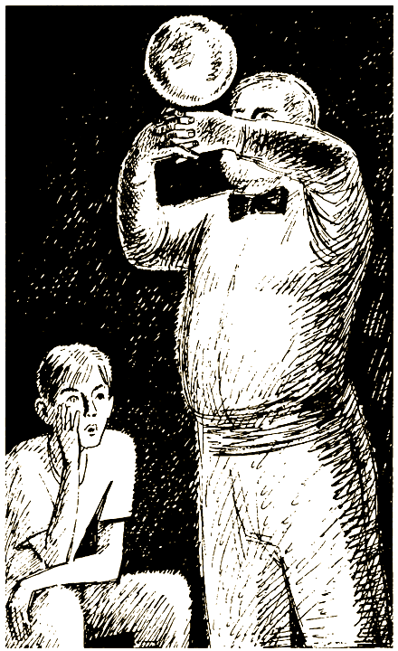

# 0

## Эдвард Паккард

# ВЕЛИКИЙ ВОЛШЕБНИК

В этой книге тебя ждет множество приключений — ведь в твой родной город приехал великий маг и волшебник Бонза.

Не читай по порядку, с первой страницы до последней, — ничего не выйдет. Когда тебе придется принимать важное решение, сделай выбор из нескольких вариантов и прочти указание в низу страницы. Вот тогда и узнаешь, что будет дальше.

Знаменитый иллюзионист показывает такие чудеса, какие тебе и не снились. Если ты будешь поступать правильно, то научишься его искусству и получишь массу удовольствия. Но каждый раз все тщательно взвесь, прежде чем действовать. Иначе следующий фокус Бонза проделает с тобой.

Удачи!

### ОБ АВТОРЕ

Эдвард Паккард окончил Принстонский университет и Колумбийский юридический колледж. Сочиняя увлекательные истории для своих детей: Каролины, Андреа и Уэллса, — он придумал особый тип книги для серии «Выбери себе приключение».

### О ХУДОЖНИКЕ

Бугославская Надежда Владимировна родилась и живет в Москве. Окончила Московский художественный институт им. В. И. Сурикова. Член Московского союза художников. Работает в области иллюстрации художественной литературы — как для взрослых, так и для детей.

#### [Начать приключение](#1)

# 1

Ты давно мечтал увидеть представление несравненного Бонзы, всемирно известного мага, которого называют Великим Волшебником. И вот твой друг Джеф Латем звонит тебе и сообщает, что Бонза приехал в Лейквилл, твой родной городок.

— А ты точно знаешь? Что-то мне не верится! — сомневаешься ты.

— Да говорю же тебе, так оно и есть, — возражает Джеф. — Он еще купил тот большой старый дом с высокой оградой, ну тот, что на Честнат-стрит. Мои родители достали билеты на его представление в следующем месяце. Хочешь пойти с нами?

— Ты еще спрашиваешь! Конечно, хочу, — радуешься ты. — Просто дождаться не могу!

Прошло три недели. И вот ты сидишь в театре в Парк-Сити с Джефом и его родителями. Огни погасли; и ты, как и все зрители, с нетерпением ждешь начала представления. Вдруг из-за занавеса выглядывает собака, это далматин, и медленно выходит на сцену. Из-за кулис раздается сердитый голос: «Спот, ко мне!» Собака останавливается на секунду, оглядывается, но потом продолжает свой путь. Тут на сцене появляется сам Бонза — на вид совершенно безобидный человек, с седой бородой и в цилиндре. Он направляется к собаке, держа поводок в руках и крича: «Спот, назад! Представление еще не началось!»

Все зрители смеются. Ты знаешь, что им на ум пришла та же мысль, что и тебе: разве похож этот чудак на знаменитого Бонзу, на Великого Волшебника?

Но вдруг ослепительная вспышка — и собака исчезла! Публика онемела от изумления.

Бонза, как и все вокруг, кажется удивленным. Он всплескивает руками и грустно смотрит на зрителей.

— Как же я начну представление, если моя собака исчезла? — восклицает он.

Зрители аплодируют. Они понимают, что это и был первый номер знаменитого волшебника.

Но Бонза все стоит на месте с тем же выражением грусти на лице.

— Я не шучу, мне так нужна эта собака, а она исчезла!

Он произносит эти слова настолько убедительно, что ты уже не знаешь, чему верить.

— Если б Спот вернулся! Я был бы так счастлив! — говорит волшебник. — Ведь это была моя лучшая собака.

Вдруг с галерки раздается громкий лай. Собака несется по проходу между рядами. Через секунду она уже запрыгивает на сцену и оказывается рядом с Бонзой.

Зрители хлопают в ладоши, качают головами от удивления. Бонза дает Споту кусочек печенья, хлопает его по загривку, и пес убегает за кулисы.

После этого Бонза показывает одно чудо за другим, заканчивая выступление самым удивительным трюком. Занавес поднимается, и все видят Бонзу, сидящего на лошади. 

Лошадь стоит на огромной деревянной платформе, которая подвешена к потолку на четырех толстых цепях. С помощью какого-то устройства платформа поднимается над сценой на два метра. Бонза машет зрителям рукой. Занавес опускается так, что зрители не видят ни лошади, ни всадника. Внезапно занавес и платформа падают вниз. А лошадь и всадник исчезли!

Зрители открывают рты от удивления и ждут, что будет дальше. Но Бонза не возвращается, и все начинают беспокоиться и шуметь.

На сцену выходит администратор, и публика стихает.

— Прошу извинить, — говорит он, — но Великий Бонза и его лошадь действительно исчезли. Мы вызвали полицию, и будем надеяться, что его найдут. Теперь же я вынужден попросить вас разойтись по домам.

Ты понуро идешь за Джефом и его родителями к выходу. Но когда входишь в фойе, то видишь, что Великий Бонза восседает на своем коне и как ни в чем не бывало расписывается на программках, которые ему протягивают зрители.

— Неудивительно, что его называют Великим Волшебником! — говорит мистер Латем.

По пути домой вы с Джефом решаете во что бы то ни стало узнать, как Великий Бонза творит такие удивительные вещи.

Мистер Латем, который ведет машину, вмешивается в ваш разговор:

— Пока еще не поздно, не мешало бы вам узнать, что он уже успел настроить против себя множество людей. Его дом находится рядом с жилыми домами, и на улице обычно тихо, но он перевез в дом, и в сарай тоже, кучу аппаратуры и инструментов. Его соседи уже организовали Союз Озабоченных Горожан. Они утверждают, что ваш Бонза всем только мешает. Говорят, что из его сарая доносится странный шум, да и соседские собаки из-за него начинают выть. Сказать по правде, некоторые уже всерьез поговаривают о том, что пора вашему Бонзе убираться из Лейквилла, потому что он дурно влияет на молодежь.

— Да? Я не слыхал об этом, — говорит Джеф. — Но все-таки хотелось бы узнать, как это он делает все свои фокусы.

— И мне тоже, — подхватываешь ты. — Может, он возьмет нас к себе в ученики.

— Может, и возьмет. Но бьюсь об заклад, вряд ли он откроет нам все свои секреты. — Тут Джеф наклоняется к тебе и шепчет: — А что, если нам просто последить за ним?

Ты улыбаешься.

— Давай лучше встретимся завтра после школы и тогда решим, — предлагаешь ты.

На следующий день вы с Джефом встречаетесь в магазинчике Сэма, чтобы все обсудить.

Если ты говоришь: «Давай попросим Бонзу взять нас к себе в ученики», открой страницу [8](#8).

Если ты считаешь, что лучше будет последить за Бонзой и узнать, как он творит свои чудеса, открой страницу [78](#78).

# 8

Джеф соглашается с твоим предложением попросить Бонзу взять вас себе в помощники. Вы едете на велосипедах по Честнат-стрит. На этой улице живет Бонза. Когда вы подъезжаете ближе, ты заглядываешь в узкую щель в высокой ограде старого дома в викторианском стиле. Это внушительное сооружение с чересчур высокими скатами крыши, балкончиками, увитыми диким виноградом, и высокой башней, подобной тем, что бывают в замках. А за домом, там, где обычно находится гараж, ты видишь большой амбар.

— Забавно было бы посмотреть на улицу с той башни, — говорит Джеф.

— Это точно! Да и сам дом такой смешной! — восклицаешь ты. — Пойдем посмотрим!

Вы ставите свои велосипеды около ограды и идете к двери.

Джеф несколько раз нажимает на кнопку звонка, но никто не отвечает.

Ты берешься за дверную ручку и, не долго думая, поворачиваешь ее.

— Да ведь тут не заперто! — Ты толкаешь дверь и кричишь: — Эй, есть здесь кто-нибудь?

Никто не отвечает.

— Думаю, что его здесь нет, — говоришь ты. — Вот удивительно: уйти — и даже не закрыть дверь! У него наверняка полно дома всяких ценностей.

Ты выходишь и прикрываешь дверь. Но Джеф берет тебя за руку.

— А вдруг это наш шанс? — шепчет он. — Давай войдем и посмотрим, что там такое. Я просто умираю от любопытства, так хочется заглянуть туда!

Согласиться или нет на предложение Джефа? Безумно хочется узнать, что там такое, в доме Бонзы, но ты боишься, что вас могут поймать.

— Даже не знаю, — отвечаешь ты, — у нас ведь могут быть неприятности.

— Ну какие еще неприятности? — набрасывается на тебя Джеф. — Мы же ничего не возьмем. Мы только посмотрим. Возможно, об этом вообще никто не узнает. Но даже если Бонза и поймает нас, он просто-напросто выставит нас на улицу и в другой раз будет закрывать двери, когда уходит.

— Но ведь он может вызвать полицию, — возражаешь ты.

Джеф пожимает плечами.

— Конечно, он может вызвать полицейских, ну и что? Они же не арестовывают людей только за любопытство!

Тебе не терпится узнать, что же там внутри. Но, с другой стороны, тебе как-то не по душе идея Джефа.

Если ты решил войти в дом и осмотреть его, открой страницу [13](#13).

Если ты решил не входить в дом, открой страницу [32](#32).

# 13

Вы с Джефом входите в дом и идете по темному коридору в гостиную. Шторы опущены, и, несмотря на солнечный день, комната кажется темной и мрачноватой.

— Очень похоже на обыкновенную гостиную, — говорит Джеф.

Но ты его не слышишь. Ты вглядываешься в картину на стене. Это портрет мужчины. Глаза настолько живые, что кажется — они следят за тобой. Наверно, Бонза вполне может наблюдать за вами, стоя за картиной.

Ты слегка толкаешь Джефа и шепчешь:

— Может, лучше уйдем отсюда?

— Шшш, — он прикладывает палец к губам, — лучше давай говорить шепотом, кто знает, может, там, наверху, кто-то есть. Давай заглянем в следующую комнату?

Вы с Джефом крадетесь к открытой двери в дальнем конце комнаты. Теперь твои глаза уже привыкли к полумраку, и ты замечаешь книжные шкафы. Там много книг, некоторые такие старые, что переплеты совсем истерлись. Одна сразу привлекла твое внимание. Это толстая книга в темно-красном кожаном переплете. На корешке золотыми буквами напечатано название: «Секреты Великих Магов».

— Эй, Джеф, — окликаешь ты друга. — Иди-ка сюда!

— Вот это да! Бьюсь об заклад, это то, что нам надо! Может, откроем? — радуется Джеф.

Ты оглядываешься, ведь Бонза может вернуться в любую минуту. Тебе очень хочется заглянуть в книгу, но хочется осмотреть и другие комнаты. Вернуться сюда можно и позже.

Если ты решаешь заглянуть в книгу, открой страницу [37](#37).

Если ты все же думаешь, что вначале лучше заглянуть в следующую комнату, открой страницу [15](#15).

# 15

— Да брось ты думать о книге! Давай лучше заглянем в следующую комнату, — шепчешь ты.

Вы с Джефом видите в открытую дверь что-то ироде склада или мастерской. Везде полно всякого хлама: обломки дерева, козлы для пилки дров, сверла, шкафчики и деревянные коробочки, черные бархатные шторы, стеклянные шарики, бутылки, какие-то провода, кинопроекторы и разные другие вещи. Луч света падает через окно в потолке, и видно, что в воздухе висят тысячи пылинок.

— Давай посмотрим, что там внутри, — говоришь ты, указывая на огромный шкаф в центре комнаты. — Небось там полно всяких потайных ящиков и волшебных вещиц.

Джеф направился было к шкафу, но вдруг остановился, уставившись на открытую дверь в противоположном углу.

Ты подходишь к нему и заглядываешь в эту комнату. Там темно, лишь тусклый свет люстры освещает высокий стол посередине комнаты. На столё сидит огромная кошка, такой кошки ты никогда в жизни не видел. Она очень большая — размером со средней величины собаку. Шерсть кошки, черная как смоль, встала на спине дыбом. Ее яркие зеленые глаза, кажется, сами излучают свет.

— Ой, — восклицает Джеф, — ну и кошечка!

Животное медленно поворачивает голову.

Светящиеся глаза, словно два прожектора, выжидающе смотрят на вас.

Вы делаете несколько шагов назад.

— Что-то мне не хочется, чтобы это чудовище на меня прыгнуло! — говоришь ты.

Джеф хватает тебя за руку.

— Она не настоящая! — восклицает он. — Кошки не могут быть такими огромными!

— Может, это какая-нибудь голограмма? — говоришь ты, вглядываясь в полутьму.

— Давай подойдем ближе — и увидим.

Джеф уже переступает порог, но вдруг останавливается. Из комнаты раздается голос:

— Берегитесь! Вернитесь! Немедленно покиньте этот дом!

— Это Бонза, — шепчет Джеф. — Я узнал его голос.

— Не могу понять, откуда это он говорит, — озираясь по сторонам, отвечаешь ты.

Вы вглядываетесь в углы комнаты, полагая, что Бонза прячется где-то в темноте.

— Может, это просто запись? — предполагает Джеф. — Но что-то мне не по себе. Может, лучше убраться отсюда побыстрее?

Если ты соглашаешься с Джефом, открой страницу [46](#46).

Если ты решаешь остаться и убедиться, что эта кошка и в самом деле настоящая, открой страницу [29](#29).

# 20

— Все дело в том, — говоришь ты, — что Ральф действительно экстрасенс.

Бонза, сидящий в кресле, подался вперед.

— Вы не угадали, — отвечает он. — У Ральфа нет никакого сверхчувственного восприятия. Я, честно говоря, вообще сомневаюсь в существовании этого феномена, хотя доказать его отсутствие не могу.

— Неужели вы хотите сказать, что это всего лишь трюк? — восклицает Джеф.

Великий Бонза кивает.

— Да, так оно и есть, и я все же надеюсь, что вам было интересно. Но, прошу извинить, я очень занят, вам пора идти. — Он встает и провожает вас до двери.

— И все же спасибо вам за фокусы, — говорите вы.

— Да не за что, — отвечает Бонза; внезапно в его руках оказываются четыре билета. Он дает каждому по два билетика. — Милости прошу на мое следующее представление, — приглашает он, улыбаясь. — Приходите со своими друзьями.

#### КОНЕЦ

# 29

— Мне хочется поближе рассмотреть эту кошку, — говоришь ты Джефу. Ты решительно шагаешь вперед и входишь в комнату. — Хорошая кошечка, славная киска, — приговариваешь ты.

Если кошка и в самом деле настоящая, тебе хочется, чтоб у нее было хорошее настроение.

Кошка с любопытством смотрит на тебя своими зелеными глазами, а через секунду уже мурлычет, да так громко, как положено кошке ее размеров.

— Да она настоящая, — говорит Джеф.

Вы делаете шаг вперед, и вдруг пол под ногами проваливается. Вы падаете вниз на кучу соломы. Люк сверху захлопывается прямо у вас над головой.

Где вы? Кругом кромешная тьма.

— Ты как, Джеф?

— Да ничего, здесь глубина всего какой-нибудь метр. Что же теперь делать? — Он пытается толкнуть люк, но ничего не выходит — он заперт крепко-накрепко. — Похоже, мы попали в ловушку.

— Постой, может, есть и другой выход, подождем, пока глаза привыкнут к темноте, — успокаиваешь ты друга.

Вы молча сидите и ждете. Тянутся минуты… Неприятные мысли так и лезут в голову. А что, если Бонза уехал куда-нибудь? Ведь так можно и умереть в этом подземелье!

— Я все еще ничего не вижу, — шепчет Джеф.

— Я тоже, — вздыхаешь ты. — Знаешь, давай поползаем вокруг, может, где есть выход.

— Ладно, — бурчит Джеф. — Только поосторожнее. Мало ли во что мы можем еще влипнуть.

Потолок такой низкий, что невозможно выпрямиться. Ты осторожно ползешь на четвереньках по неровному полу. И почти сразу натыкаешься на цементную стену.

— Слушай, я ударился о стену! — восклицает Джеф из темноты.

— И я тоже, — отвечаешь ты. — Давай ты будешь двигаться вдоль своей стены, а я — вдоль своей.

— Ладно.

Ты ползешь вдоль стены, ощупывая каждый сантиметр. Ты прополз всего метра два и вдруг почувствовал дерево вместо цемента. Да это же маленькая дверца! Ты толкаешь ее — и она со скрипом открывается. Яркий дневной свет, льющийся снаружи, ослепляет тебя.

Ты глубоко вздыхаешь и улыбаешься. Это лучи солнца. Дверца выходит во двор.

Ты вылезаешь наружу и придерживаешь дверь, пока твой друг проползает в нее. А потом вы бежите сломя голову к дыре в заборе. Наконец-то вы в безопасности!

Джеф останавливается и смотрит на тебя.

— Знаешь, с меня вполне хватит этого Великого Бонзы, — говорит он, дрожа всем телом.

— Да и с меня тоже, — отвечаешь ты. — Лучше смотреть все его фокусы с безопасного расстояния.

#### КОНЕЦ

# 32

— Пойдем-ка лучше отсюда, — шепчешь ты, но Джеф уже далеко впереди.

Вы подходите к ограде, как вдруг вас кто-то окликает:

— Эй! Что вам нужно?

Вы с Джефом мгновенно останавливаетесь и, оглянувшись, видите, что на балконе второго этажа стоит сам Великий Бонза!

— Мы хотели поговорить с вами.

— Хорошо, сейчас спущусь, — отвечает он.

Вы возвращаетесь к парадной двери. Каково же ваше удивление, когда вы видите, что Великий Бонза уже встречает вас у дверей, словно спрыгнул со второго этажа!

Джеф только разводит руками.

— Глазам своим не верю! — бормочет он.

Да и тебе тоже не верится. Похоже, Бонза еще более могущественный, чем ты думал.

Вы бы наверняка немного струсили, но у Бонзы такая приветливая улыбка, да и сам он похож на Санта-Клауса. Правда, одет он в черный, а не в ярко-красный костюм.

— Ну что ж, очень мило с вашей стороны, что вы не залезли ко мне без спросу. Чего вы от меня хотите? Рад буду оказать вам услугу.

— Спасибо, — говорит Джеф.

Ты называешь себя и Джефа и добавляешь:

— Мы с Джефом видели ваше представление в Парк-Сити, это было так здорово!

Открой страницу [47](#47).

# 37

— Давай все же заглянем в книгу, — предлагаешь ты.

Джеф потянулся, чтобы снять ее с полки.

— Эй, поаккуратней, — беспокоишься ты, — старайся не задеть другие книги. Вид у них такой, будто они рассыпаются от одного дуновения.

Джеф садится на пол и открывает книгу на первой странице. 

Ты подсаживаешься к нему и читаешь через его плечо:

«ГЛАВА ПЕРВАЯ

ВСЕ ВЕЛИКИЕ МАГИ ОБЛАДАЮТ ТРЕМЯ

ГЛАВНЫМИ ТАЙНАМИ,

КОТОРЫЕ ДАЮТ ИМ СИЛУ И МОГУЩЕСТВО.

ПЕРВАЯ…»

Джеф ахает и шепчет:

— Слушай, что такое? Буквы исчезают!

— Какой ужас! — восклицаешь ты, совсем позабыв о том, что тут можно говорить только шепотом.

— Ну вот, теперь у нас будут неприятности, — огорчается Джеф, — я вовсе не хотел испортить книгу.

— Подожди секунду, гляди, надпись опять появляется!

Буквы медленно проступают, становятся яснее и отчетливее, пока вы не видите всю страницу. Но как странно: слова совсем другие!

На странице сияет новая надпись:

«ВЫ ПРОНИКЛИ В ЭТОТ ДОМ,

ПОСЯГНУЛИ НА ЧУЖУЮ СОБСТВЕННОСТЬ,

НАНЕСЛИ ЕЙ ВРЕД. НЕМЕДЛЕННО ПОКИНЬТЕ

ЭТО МЕСТО И НИКОГДА НЕ ВОЗВРАЩАЙТЕСЬ СЮДА,

В ПРОТИВНОМ СЛУЧАЕ ВЫ БУДЕТЕ АРЕСТОВАНЫ».

Ты аккуратно ставишь книгу на место. Вы идете к выходу. Никто не говорит ни слова. Вот позади высокая ограда, и вы уже на улице. Что толку говорить о том, что произошло? Вам не повезло, вы не узнали секретов Великого Бонзы, Повелителя Магии.

На следующий день в школе ты попытался описать загадочную книгу учителю естественных наук.

— Как же такое могло произойти? — спрашиваешь ты.

— Да это все химические соединения, — отвечает он, — правда, не знаю какие. Чернила в первой записи, должно быть, были сделаны из вещества, которое постепенно исчезает, попадая на свет. Вторая же запись, наверное, была сделана чернилами, которые становятся видны только на свету.

Ну ладно, думаешь ты, в конце концов, ты узнал хоть один секрет Великого Бонзы.

#### КОНЕЦ

# 41

— Мне кажется, — говоришь ты, — что ваш телефон каким-то образом связан с комнатой за портретом Гудини, где, судя по всему, и находится Ральф. Он просто прячется там и наблюдает за всем происходящим через дырки в глазах портрета.

— Ну что ж, интересная мысль, — кивает Бонза, — конечно, у меня может быть комната прямо за портретом Гудини, да и телефон можно провести прямо туда, но только не пойму, зачем ты набирал единицу перед кодом Парк-Сити.

— А вдруг у вас особая договоренность с телефонным узлом? — вставляет Джеф.

Бонза усмехается.

— Если вы мне не верите, то подойдите и посмотрите на глаза Гудини вблизи.

У вас мелькнула эта же мысль. Встав на цыпочки, вы проводите пальцами по глазам на портрете. Глаза нарисованы, и никаких отверстий в холсте нет.

— А как же тогда? — спрашиваешь ты.

Бонза загадочно улыбается:

— А это секрет.

Он встает и показывает жестом, чтоб вы следовали за ним. У дверей он останавливается.

— Спасибо, что зашли. Если кто-нибудь из вас все же поймет, как Ральф угадывает карты, пусть придет. И если он захочет попасть ко мне в ученики, я возьму его.

На обратном пути вы задумываетесь: а есть ли у вас способности, чтобы идти по стопам Великого Мага?

#### КОНЕЦ

# 44

— Когда я позвонил ему, Ральф уже знал, что я вытянул именно шестерку треф, — убежденно говоришь ты.

— Но как же он мог это знать? — усмехается Бонза.

— Ну, возможно, я просто сообщил ему пароль.

— Но ведь ты не говорил никакого пароля!

— В том-то и дело! — оживляешься ты. — Вы дали мне номер и сказали, чтоб я позвал Ральфа. Это и был пароль, именно это имя и означало, что я вытянул шестерку треф.

Бонза выглядит удивленным.

— Но я ведь не велел тебе звать Ральфа, я просто сказал, что его зовут Ральф.

— Конечно, но, если б я вытянул другую карту, вы бы сказали, что его зовут Билл или, к примеру, Джек.

Великий Бонза поднимается из своего кресла, подходит и пожимает тебе руку.

— Очень хорошо, мой юный друг. Ты угадал. Ведь человека, которому ты звонил, зовут вовсе не Ральф. Его настоящее имя — Скотт.

— Но если в колоде пятьдесят две карты, значит, у Скотта пятьдесят два имени? — удивляешься ты.

— Так оно и есть, — кивает Бонза. — Если ты еще не передумал, можешь стать моим учеником. Извини, но я не могу взять и тебя, — обращается он к Джефу, — не расстраивайся, но мне нужен человек, который быстро соображает.

— Все в порядке, — говорит Джеф.

Но на обратном пути ты видишь, что Джеф здорово расстроился. Тебе хочется утешить его, и ты обещаешь, что обязательно будешь рассказывать ему все, что узнаешь.

Через неделю ровно к девяти часам ты снова приходишь в дом Бонзы. По договору ты должен работать у Бонзы по три часа каждую субботу.

Он ведет тебя в мастерскую, которая находится в другом конце дома. Там полно всяких приборов, станков, проводов, батареек и каких-то странных электронных аппаратов.

— Ну прямо как на заводе!

— Это еще что, в сарае у меня тоже мастерская, но она в два раза больше этой, — хвастается Бонза. — Ведь, чтобы стать настоящим магом, нужно иметь много оборудования. Ты должен быть и плотником, и портным, и электриком, и слесарем. Ты все должен уметь.

Твое первое задание — помочь Бонзе смастерить шкаф с фальшивым дном.

Ты работаешь уже два часа и очень устал. Отложив молоток, идешь глянуть, как там Бонза. Подойдя поближе, ты видишь, что Великий Бонза укладывает в аквариум огромный коралл.

— Это для моего фокуса «исчезающие рыбки», — объясняет он. — Коралл, который я положил в аквариум, внутри пустой. Там я установил небольшой проектор, который показывает голограмму рыбок, и всем кажется, что они настоящие. Я же всегда могу сделать так, что рыбки исчезнут, стоит лишь выключить проектор с помощью дистанционного управления. Конечно же, для этого свет должен падать под определенным углом, иначе ничего не получится.

— Надо же! Но, может, пока вы не вернулись к своей работе, вы научите меня какому-нибудь простому фокусу, который я мог бы сам показать? — просишь ты.

Бонза улыбается.

— А почему бы и нет? — Он снимает фартук, подходит к платяному шкафу и вынимает оттуда пиджак. Потом показывает тебе крошечный стеклянный стаканчик. Он наполняет его водой из-под крана и снова показывает тебе. — А теперь эта вода исчезнет прямо у тебя на глазах!

— Я весь внимание.

— Да, но сперва я достану щепотку волшебного порошка из заднего кармана, а то вода не исчезнет.

Он держит стаканчик в одной руке, а другой шарит позади себя. Вот он кладет что-то в стакан. Что именно он положил, ты не успел рассмотреть, но в одно мгновение не только вода, но и сам стаканчик исчез!

— А, будь оно неладно, сколько стаканчиков у меня уже пропало! — восклицает Бонза.

— Что случилось? Куда он делся? — Ты очень удивлен, ведь ты старался смотреть как можно внимательнее. Тебе кажется, что стаканчик действительно растворился в воздухе. Но ведь ты знаешь, что это всего лишь фокус.

Бонза осматривает пол и даже потолок, как будто стакан может быть там.

— Всегда у меня что-то не то с этим фокусом! — говорит он. — Я ведь хотел, чтобы исчезла только вода, а она пропала вместе со стаканом!

— Но ведь это же здорово! Это не просто фокус, а настоящее чудо! — радуешься ты. И в то же время пытаешься сообразить, что произошло на самом деле. — Мне почему-то кажется, что стакан у вас в рукаве! — догадываешься ты.

Бонза приподнимает брови.

— Ты так думаешь? — Он трясет рукавами, но напрасно. — Хотел бы я сам знать, в чем дело! — говорит он. — Тогда бы я получил свой стакан обратно.

Ты с сомнением глядишь на Бонзу.

— А вы уверены, что он все-таки не у вас в рукаве?

Бонза смеется.

— Ну сам посуди, ведь если я опущу стакан в рукав, то вода расплещется и манжета будет мокрой, верно?

— Ну да, — соглашаешься ты.

— Потрогай-ка, — предлагает Бонза.

Ты щупаешь обе манжеты. Удивительно, но они абсолютно сухие.

— Надо же!

— Благодарю. — Бонза кланяется. — А теперь я покажу тебе, как все происходит, ведь ты все-таки мой помощник.

Бонза снимает пиджак и держит его так, чтоб ты мог видеть изнанку. На спинке пиджака висит стакан. В стакан вставлен маленький резиновый шарик, который, видимо, служит пробкой. Сверху у шарика есть небольшой металлический крючок, от него тянется резинка, которая крепится с помощью безопасной английской булавки к вешалке пиджака.

Бонза тянет к себе стакан, а резинка настолько эластичная, что он спокойно ставит его на стол. Затем он вытаскивает шарик, и оказывается, что в стакане вода.

— Всегда перед тем, как показать этот фокус, — объясняет Бонза, — я протягиваю резинку через рукав и вынимаю шарик. А потом, когда начинаю показывать фокус, я просто вставляю шарик обратно, отпускаю резинку, и стакан возвращается на свое место — на спинку пиджака. Таким образом, шарик — самая обыкновенная пробка, вот вода и не выплескивается. Теперь понял, отчего у меня манжеты всегда сухие?

— Вот здорово! — говоришь ты. — Не дождусь, когда я сам научусь показывать этот фокус.

— Это не так уж сложно, — отвечает Бонза, — просто все требует практики.

Вы с Бонзой возвращаетесь к своей работе. Когда кончается твое рабочее время, шкаф почти готов.

— Хорошо сделано, — хвалит Бонза. — На следующей неделе покажу тебе еще один фокус.

— Я все жду, когда вы научите меня тому фокусу с исчезающим всадником! — отвечаешь ты.

Бонза смеется.

— Я не могу сразу открыть тебе самые секретные фокусы — во всяком случае, пока, ведь ты только начинаешь учиться.

— А когда? — спрашиваешь ты.

Бонза разглаживает свою пушистую белую бороду.

— Вначале ты должен будешь пройти посвящение.

— Посвящение? А что это такое?

— Ну, ты должен доказать, что действительно хочешь стать магом.

Попрощавшись, ты выходишь на улицу. И вдруг видишь десять или двенадцать человек около дома Бонзы. Они размахивают плакатами и кричат. На плакатах написано:

ЗАПРЕТИТЬ ПРЕДСТАВЛЕНИЯ БОНЗЫ!

НЕ ХОТИМ, ЧТОБ БОНЗА ЖИЛ У НАС В ГОРОДЕ!

МАГИЯ БОНЗЫ ОПАСНА!

Как только ты выходишь на улицу, какая-то разъяренная женщина бросается к тебе.

— Не смей иметь дело с этим человеком! — кричит она.

— Смотри, у тебя еще будут неприятности из-за этого Бонзы! — выкрикивает кто-то из толпы.

В понедельник ты рассказываешь своей учительнице по труду, миссис Джиллет, о работе у Бонзы и о людях, которых ты встретил на улице.

— Да, я читала в газете, — кивает она.

— Но почему они так злятся на него?

— Трудно сказать! Возможно, он просто не такой, как они.

— Это уж точно! — соглашаешься ты. — Знаете, он научил меня нескольким своим трюкам. Хотите, я покажу вам?

— Спасибо, не стоит, я тебе верю. Но только не вздумай показывать какие-нибудь фокусы этим людям, — предупреждает она. — Ведь они могут подумать, что ты тоже для них опасен.

Проходят недели. Каждый день ты узнаешь что-то новое. Бонза научил тебя еще нескольким фокусам. Но тебе все время кажется, что у Бонзы не лежит душа к тому, что он делает. Ты подозреваешь, что все это из-за пикетчиков, ведь они каждый день собираются около дома Бонзы и кричат все громче и громче.

В один субботний день, когда ты уже закончил свою работу, Бонза говорит:

— Знаешь, я думаю, тебе лучше сюда не приходить. Ведь эти люди будут считать, что ты со мной заодно.

— Но это же просто смешно! — возражаешь ты.

— Ничего не поделаешь, на свете происходит много смешных вещей, — улыбается Бонза. — Спасибо, что ты поддерживаешь меня, но я не хочу впутывать ребенка в свои неприятности.

— Но может, через недельку-другую все как-то уладится? — успокаиваешь ты своего учителя.

Лицо Бонзы светлеет.

— Может, и уладится. Если так случится, ты поможешь мне готовить следующее представление.

Проходит несколько дней. Ты спешишь на школьный автобус. Тут тебя останавливает какой-то человек. На нем костюм в узенькую полоску и галстук, в руках — дипломат.

— Здравствуй, — говорит он дружелюбно. — Меня зовут Говард Стаффорд. Я адвокат Союза Озабоченных Горожан.

— А что это за союз? — спрашиваешь ты.

— Это люди, которые считают, что Великий Бонза плохо влияет на наше общество. Я защищаю их интересы и буду выступать с требованием, чтобы Бонза покинул наш город.

— Но почему Бонза должен уехать? — недоумеваешь ты.

— Разве ты не видишь — от него слишком много шума, да и вреда он может причинить немало!

— Но почему? Что-то я не вижу, чтоб он кому-нибудь навредил!

Стаффорд грозит пальцем.

— Зря ты так уверен! Все эти его фокусы слишком уж странные. Да и сам он тоже.

— Но я же видел некоторые его трюки, я даже знаю, как он это делает!

Стаффорд качает головой.

— Так я и думал! Бонза сумел заморочить тебе голову своими чудесами. Теперь ты на его стороне. Ты уже не замечаешь, какой опасности он подвергает нормы поведения и образ жизни горожан! Стыдись! Послушай меня, будь хорошим мальчуганом, порви всякие отношения с Бонзой и избавься от влияния этого неприятного человека!

— Извините, я должен идти, — говоришь ты. — Иначе я опоздаю на автобус.

Стаффорд смотрит на школьный автобус, ожидающий тебя на остановке.

— Ну иди, только помни: если не хочешь неприятностей, держись от Бонзы подальше.

Придя домой, ты рассказываешь родителям про мистера Стаффорда и его предостережение.

— Я слышал об этом Стаффорде, — говорит папа. — Он адвокат Союза Горожан, которые затевают судебный процесс, чтобы выдворить Великого Бонзу из города. Он якобы производит очень много шума, наносит вред обществу и плохо влияет на детей вроде тебя.

— Какие глупости, — говоришь ты. — Но ведь у них это не получится, верно?

— Может, и не получится, — говорит папа. — Но если они сумеют доказать, что он мешает соседям, они могут заставить его прекратить свою деятельность. Ведь он и правда устроил мастерскую и держит животных — это нечто вроде его бизнеса, а в этой части города заниматься бизнесом не разрешается.

Мама говорит:

— Мы с папой всегда считали, что ты можешь учиться всему, чему захочешь, если только это не безнравственно и не противозаконно. Судя по тому, что ты нам рассказываешь, в твоих занятиях с Бонзой нет ничего ни безнравственного, ни противозаконного. Ты научился плотничать, много узнал об электричестве и других вещах, у тебя хорошо получаются фокусы. И все-таки я начинаю беспокоиться: а вдруг какие-то трюки, которые делает Бонза, опасны? И еще мне неприятно, что ты впутался в склоку с этими «озабоченными горожанами». Я бы на твоем месте была поосторожнее.

Ты плохо спал эту ночь — в голову лезли мысли о Бонзе. Ты, конечно, рад, что он взял тебя в ученики, и тебе не терпится узнать новые фокусы. Но тебя беспокоит, что к Бонзе многие плохо относятся и, если ты будешь работать у него, к тебе будут относиться так же.

Если ты решаешь остаться у Бонзы, открой страницу [66](#66).

Если хочешь бросить его, открой страницу [45](#45).

# 45

Ты звонишь Бонзе и хочешь сказать ему, что решил бросить свою работу. Ты немножко побаиваешься, что он рассердится, но он только говорит:

— Что ж, мне жаль, но я тебя понижаю. Конечно, не так уж много людей хотят стать настоящими магами. Но я уверен, что у тебя все будет получаться, за что бы ты ни взялся в жизни.

— Спасибо на добром слове, — вот и все, что ты можешь сказать.

Тебе как-то не по себе оттого, что ты не будешь больше приходить к Бонзе, но продолжается это недолго. У тебя куча дел, так что огорчаться просто некогда.

Через несколько дней отец рассказывает тебе, что Союз Озабоченных Горожан подал в суд на Великого Мага.

— Так я и думал, — говорит отец, — они хотят выжить его из города.

Прошло еще несколько дней. Ты сидишь с родителями за обедом. Твой отец говорит:

— Вчера нам с мамой позвонил один человек, его зовут мистер Крамер. Он адвокат Великого Бонзы.

— Значит, он наверняка против мистера Стаффорда, — догадываешься ты.

— Ты прав, — кивает отец. — Мистер Крамер хотел узнать, согласен ли ты давать показания в суде. Ему хочется, чтобы ты помог ему добиться оправдания Великого Бонзы: ведь тот, по словам Крамера, не делает ничего дурного и незаконного в своем доме и у его соседей нет причин утверждать, что он им мешает.

— Надо же! — вырывается у тебя. — Ну и как; мне, соглашаться?! — Ты смотришь на отца с матерью.

Тут мать произносит:

— Знаешь, я уверена, что это будет хороший поступок и многому тебя научит, но вообще такие вещи всегда связаны с большой склокой. Неприятно, что ты окажешься втянут во все это. Слишком уж многие в городе поддерживают Союз Озабоченных Горожан. Мы с отцом считаем, что ты должен сам решить, что делать. Но прошу тебя, подумай хорошенько.

Принять решение намного труднее, чем ты предполагал.

Если ты решаешь давать показания в суде, открой страницу [57](#57).

Если ты отказываешься, открой страницу [68](#68).

# 46

— Наверное, ты прав, — говоришь ты, выходя из мастерской.

Проходя гостиную, ты опять очутился рядом с книгой «Секреты Великих Магов». Может, это твой последний шанс заглянуть в нее?

Если ты останавливаешься и решаешь заглянуть в книгу, открой страницу [37](#37).

Если ты говоришь: «Пойдем-ка лучше отсюда», открой страницу [32](#32).

# 47

— Очень приятно, — кивает Бонза, он еще больше веселеет.

Джеф подталкивает тебя локтем.

— Знаете, нам так хочется понять, как вы показываете свои фокусы.

Бонза вскидывает брови от удивления.

— Вы полагаете, что это просто фокусы? Разве вы не верите в существование волшебства и магии? Напрасно! К тому же, если бы я рассказал вам, как я это делаю, вам было бы скучно смотреть мои выступления.

— Ну и пусть, все равно расскажите, — просишь ты.

Бонза качает головой.

— Волшебники не выдают так просто своих секретов. И единственный способ узнать что-нибудь — это стать магом самому.

— Да мы этого и хотим! — радуешься ты. — Мы, когда шли сюда, думали: вдруг вы возьмете нас в помощники!

— А-а, вот оно что. Тогда заходите. — Он вводит вас в темную гостиную и усаживает на диван. — Я возьму вас в ученики, если вы окажетесь лучше моего теперешнего помощника. Но предупреждаю, это будет трудно. Видите ли, мой помощник — экстрасенс. У него есть…

— Сверхчувственное восприятие, — догадываешься ты.

— Совершенно верно. Так вот, ты можешь вытянуть карту, а потом позвонить ему, и он прямо по телефону легко угадает, что у тебя за карта.

— Что-то не верится… — говорит Джеф.

Внезапно в руке Бонзы появляется колода карт.

Джеф шепчет:

— Наверняка они были у него в рукаве.

Бонза, услышав его, начинает отчаянно трясти рукавами.

— Никогда я ничего не прятал в рукавах! — Он чопорно складывает руки перед собой, и в тот же ми£ из его рукава выпархивает небольшая желтенькая канарейка. — Прошу прощения! Видимо, я ошибся. — Он берет канарейку и идет в другой конец комнаты, чтобы посадить ее в клетку. Возвращается с колодой карт. — Возьмите, убедитесь, что это самые обыкновенные карты, — говорит он, протягивая вам колоду.

Ты начинаешь просматривать карты, а Джеф, заглядывая через твое плечо, шепчет:

— И все-таки я уверен, они меченые.

— Никакие они не меченые, — обижается Бонза, — но это даже не важно, ведь мой помощник угадывает любую карту по телефону.

Ты вытягиваешь шестерку треф.

— Отлично, — радуется Бонза, — теперь давайте позвоним Ральфу, и вы сами убедитесь, что он действительно экстрасенс.

— Нет, подождите. А где же находится ваш ассистент? — спрашивает Джеф. — Вдруг он прячется вон там, за портретом, что висит на стене?

Бонза поворачивается и смотрит на портрет.

— Вам он нравится? Это Гарри Гудини, самый замечательный маг и волшебник, какой только был на свете!

— Да, конечно, но только глаза у него странные, совсем не похожи на нарисованные, — говорит Джеф.

Бонза все еще смотрит на портрет, посмеиваясь.

— Да, глаза у него и в самом деле странноватые. Но это и неудивительно, ведь Гудини — не обычный человек. — Он опять повертывается к вам. — Вот было бы забавно, если б Ральф целыми днями торчал здесь, за портретом, на случай если кто-нибудь вдруг решит вытянуть карту! — Он покосился на Джефа. — Нет, молодой человек, вы ошиблись. Ральф никогда не жил в этом городе, а уж тем более в этом доме. Он живет где-то недалеко от Парк-Сити.

Джеф выглядит озадаченным.

— Ладно, давайте тогда ему позвоним.

— Нет, подождите, — вмешиваешься ты. — А вдруг вы шепотом подскажете ему правильный ответ?! Лучше уж я сам позвоню.

— Прекрасно, — отвечает Бонза. Он записывает телефон Ральфа на клочке бумаги и протягивает тебе. — Телефон вон там, на столе. Кстати, не забудь набрать единицу перед кодом города.

— Ладно, — киваешь ты. — Но вы сидите здесь, пока я не дозвонюсь ему, ладно?

— И отвернитесь от портрета, — добавляет Джеф.

Бонза смеется:

— Конечно, конечно. Все, что вам угодно!

Он всплескивает руками, и из его рукава опять вылетает маленькая желтенькая канарейка. Она мечется по комнате, а Бонза бегает из угла в угол, пытаясь поймать ее. Наконец птичка садится на пианино, и Бонзе удается схватить ее и посадить в клетку.

Вы с Джефом не можете сдержать смеха. Очень уж забавно наблюдать за этим. Но как только дверца клетки захлопнулась, Джеф прошептал:

— Слушай, он просто пытается нас отвлечь.

— Может, и так, — шепчешь ты в ответ. — Но что толку? Все равно у него нет второго телефона под рукой, он не сможет ничего сделать.

Бонза возвращается к своему креслу.

— Теперь я обещаю не вставать до тех пор, пока ты не позвонишь Ральфу.

Ты набираешь номер. После нескольких гудков кто-то поднимает трубку. Ты все время глядишь на Бонзу, чтобы убедиться, не разыгрывает ли он тебя.

— Можно попросить Ральфа? — спрашиваешь ты.

— Это я.

Бонза сидит не шелохнувшись; губы его плотно сжаты.

— Привет, — говоришь ты, — мы с приятелем звоним от Великого Бонзы, а он говорит, что ты экстрасенс.

— Да, он прав, — отвечает Ральф. — Вот, правда, я сам не знаю, как мои способности срабатывают, но то, что они у меня есть, — это точно.

— Ну, а ты можешь сказать, что за карту я держу сейчас в руке? — На всякий случай ты прикрыл трубку рукой, ведь тогда Ральф не сможет разобрать того, что прошепчет Бонза.

— Пока не знаю, — говорит Ральф. — Ты должен получше сосредоточиться на этой карте.

— Ладно, — отвечаешь ты, стараясь думать только о карте.

— Ну, теперь я знаю, — отвечает Ральф, — это шестерка треф.

— Верно, — удивляешься ты, — вот это да!

— Ничего особенного. Ладно, прости, но мне надо уходить, было приятно поговорить с тобой.

Телефон щелкнул — это Ральф повесил трубку.

— Ну что, он угадал? — спрашивает Бонза.

— Да, угадал, — отвечаешь ты, — но не пойму как!

Ты глядишь на Джефа, но тот ошеломлен не меньше, чем ты.

— Ну вот, что я вам говорил! — радуется Бонза. — Ральф действительно экстрасенс.

— Мне все же как-то не очень верится, что экстрасенсы на самом деле существуют, — с сомнением говоришь ты.

Бонза вскидывает брови.

— Неужели? Впрочем, кто знает, может, ты и прав, — соглашается он. — Подумайте хорошенько, прежде чем верить мне на слово.

— Так, значит, я все же прав? — радуешься ты. — Это всего-навсего трюк?!

— Если вы на самом деле хотите стать моими помощниками, — говорит Бонза, — то вы и должны мне ответить на этот вопрос. А я пока схожу в сарай, проверю, как там моя лошадка. Я скоро вернусь, тогда и посмотрим, что вы ответите.

Бонза вышел из комнаты, оставив вас вдвоем.

— Ну что, у тебя есть идеи? — спрашивает Джеф. — У меня в голове пусто.

— Дай-ка подумать. — Ты закрываешь глаза и пытаешься сосредоточиться.

Когда Бонза вернулся, у тебя уже было три варианта ответа на вопрос. Во-первых, Ральф просто мог знать, что если ему звонят, значит, выпала шестерка треф. Во-вторых, телефон, который ты набирал, мог находиться в самом доме — возможно, за портретом Великого Гудини. А в-третьих, Бонза мог говорить правду и Ральф действительно экстрасенс.

— Ну что? — спросил Бонза, входя в комнату и глядя прямо на тебя. — Вы нашли ответ?

Если ты говоришь, что Ральфу звонят только тогда, когда выпадает именно шестерка треф, открой страницу [44](#44).

Если ты отвечаешь, что Ральф просто находится здесь, в доме, и, возможно, прячется за портретом Гудини, открой страницу [41](#41).

Если ты соглашаешься, что Ральф в самом деле экстрасенс, открой страницу [20](#20).

# 56

— Покажите мне, как вы распиливаете женщину на части, — просишь ты.

Бонза ведет тебя в другой конец мастерской.

— Этот ящик ставится на платформу, которую ты только что сделал. Ты ведь заметил, что ящик этот длиной больше метра, высотой около полуметра, почти метр шириной. Обрати внимание на верх — крышку можно открыть. Женщина ложится в ящик, но так, чтоб ее голова торчала с одного конца ящика, а ноги — с другого. Заметь, что в той стороне, которая обращена к зрителям, есть две небольшие дверцы. Я их открываю, и зрители видят руку женщины через первую дверцу, а ногу — через вторую. А потом я закрываю боковые дверцы и крышку, распиливаю ящик точно посередине и разъединяю две половинки. И все думают, что женщина распилена на части.

— Но ведь вы не распиливаете ее на самом деле? — спрашиваешь ты.

— Ну конечно, нет. Как и в большинстве фокусов, на самом деле все очень просто, — говорит Бонза. — Видишь ли, когда женщина залезает в ящик, она просовывает через отверстия на другом конце ящика две искусственных ноги, точь-в-точь похожих на ее собственные. Свои же ноги она подбирает. Когда я открываю дверцы, публика видит руки женщины, ее бок и ноги — искусственные. Когда я перепиливаю ящик, я всего лишь отделяю женщину от ее искусственных ног.

— Классно, — говоришь ты. — А потом вы соединяете две части ящика. Женщина за веревочки втягивает искусственные ноги, а когда вы открываете верхнюю часть ящика, она вылезает и раскланивается перед публикой.

— Совершенно верно. И каждый раз публика принимает все за чистую монету. Но это только потому, что мы с моей постоянной ассистенткой Джильдой Россини очень много тренируемся, чтобы не допустить в этом трюке какой-нибудь ошибки.

В ближайшую субботу у Бонзы представление. Ты помогаешь ему за кулисами разобраться с подставками и освещением, и все думают, что женщина действительно распилена на части. После этого фокуса публика аплодирует стоя.

Джеф и твои школьные друзья тоже приходят на это представление. Ты приглашаешь их за кулисы, чтобы познакомить с Бонзой. После того как ты представляешь их, а они берут автографы, Бонза отводит тебя в сторону:

— Это мое последнее выступление. Я возвращаюсь во Флориду.

— Ой, как жалко! А я-то думал, что научусь и другим фокусам.

Бонза смеется.

— Ну конечно, научишься, если твердо решил стать волшебником. Ты научишься всему из книг или от других магов. А потом придумаешь и свои собственные фокусы.

Он пожимает тебе руку, но тут из его ладони вылетает канарейка.

Все смеются.

— Ох уж этот Бонза! — восклицаешь ты. — Он не может обойтись без чудес!

#### КОНЕЦ

# 57

— Ладно, папа, передай мистеру Крамеру, что я дам показания в суде, — говоришь ты отцу.

Прошло две недели. В школе тебя отпустили, чтобы ты мог выступить в суде по делу Союза Озабоченных Горожан против Великого Бонзы.

Ты, конечно, не раз видел заседание суда по телевизору, но никогда не думал, что сам будешь присутствовать на суде, да еще давать показания.

Судья выглядит весьма внушительно. На нем черная мантия. Он пристально смотрит на тебя со своего места. Двенадцать присяжных заседателей тоже внимательно изучают тебя. Мистер Стаффорд, адвокат Союза Озабоченных Горожан, глядит на тебя из-за своего стола.

Мистер Стаффорд начинает вызывать свидетелей. Первым выступает какой-то маг. Он заявляет, что Бонза показывает такие чудеса, которые ни один маг не может повторить, значит, скорее всего, здесь дело нечисто. Затем мистер Стаффорд опрашивает нескольких соседей Бонзы. Все они утверждают, что не могут спать ночью из-за какого-то странного шума, который доносится из дома Бонзы. Они также заявляют, что все время волнуются из-за того, что происходит в этом странном доме.

Наконец называют твое имя. Все лица поворачиваются в твою сторону.

Мистер Крамер встает, чтобы задать тебе несколько вопросов. Вначале он просит тебя рассказать, чем ты занимался, когда работал у Бонзы.

Ты рассказываешь, что Бонза научил тебя некоторым фокусам и объяснил, как он готовит свои представления. Ты уверяешь, что в его трюках нет никакой черной магии и ничего, что может помешать покою его соседей. Конечно, у Бонзы достаточно много живности: там и канарейки, и собаки, и лошади. Но ведь шума от них не больше, чем от любой соседской собаки. Ты также добавляешь, что Бонза обожает своих питомцев и очень заботится о них.

Но это было только начало. Мистер Крамер занимает свое место, и тут выходит адвокат Союза Озабоченных Горожан мистер Стаффорд.

— А теперь, — объявляет судья, — можете начинать перекрестный допрос.

Стаффорд внимательно изучает тебя. Наконец он спрашивает:

— Итак, вы утверждаете, что Великий Бонза научил вас некоторым трюкам?

— Да, сэр.

— Он также объяснил вам, как готовит свои представления?

— Да, сэр.

Мистер Стаффорд недоуменно смотрит на тебя, а потом, немного откинувшись назад, говорит:

— Если так, то вы теперь сами можете творить чудеса?

— Я думаю, что смогу, но только не скоро, ведь мне надо еще многому научиться, — отвечаешь ты.

— Должно быть, вы способный юноша, — серьезно говорит мистер Стаффорд. — Видимо, вы уже самый настоящий юный маг!

Ты расплываешься в довольной улыбке. Ведь ты думал, что мистер Стаффорд будет стараться подловить тебя и придираться к каждому слову, а он, наоборот, даже отпускает тебе комплименты.

Мистер Стаффорд вновь улыбается тебе.

— Значит, я прав?

— Протестую! — вскакивает мистер Крамер. — Свидетель не имеет нужных знаний, чтобы решить, маг он или нет!

— Ваша честь! — не унимается мистер Стаффорд. — Здесь важно, что свидетель сам думает о себе.

— Протест отклонен, — заявляет судья. — Отвечайте на вопрос.

— Надеюсь, я стану хорошим магом, — смущенно лепечешь ты.

— Далее, юноша, а знаете ли вы разницу между тем, что законно, а что нет? — сурово спрашивает мистер Стаффорд.

— Да, — отвечаешь ты.

— Значит, вы бы отдавали себе отчет, если бы делали что-то незаконное?

— Да, сэр.

— Хорошо. Отвечайте теперь: в этих трюках — я имею в виду те, которые вы знаете, — есть что-то противозаконное?

— Да нет же, — уверяешь ты.

— Хорошо, очень хорошо, — говорит Стаффорд. Он идет по залу, останавливается перед судьей. — Так, значит, нет? Но я уверен, этого нет лишь тогда, когда волшебство весьма незначительное! — Он торжествующе поворачивается к тебе: — Но скажите-ка нам, юный волшебник, можете ли вы найти разумное объяснение фокусу с исчезающим всадником?

— Я протестую! — восклицает мистер Крамер. Судья собирается что-то сказать, но мистер Стаффорд поспешно соглашается:

— Снимаю свой вопрос! Больше вопросов не имею.

Судья говорит, что ты свободен.

Вдруг в зале поднимается шум.

Бум! Бум! Бум! — ударяет судья молоточком по столу.

— Требую тишины!

Люди притихли. Ты занимаешь свое место. Начинаются выступления адвокатов.

Мистер Стаффорд настойчиво повторяет, что Бонза — колдун и от него одни неприятности. Свою речь он заканчивает фразой:

— Великий Бонза нарушает покой не только соседей, но и всех жителей Лейквилла!

Потом поднимается мистер Крамер. Он говорит спокойно и неторопливо.

— Конечно, нарушать покой мирных жителей нехорошо, — начинает он. — Но, скажите мне, разве хоть один фокус Великого Бонзы причинил вред жителям Лейквилла? Правда, многие из-за него почувствовали себя неуверенно, они не понимают, хотя постоянно ломают себе голову, как Великий Волшебник творит свои чудеса!

Мистер Крамер подходит поближе к присяжным, а потом указывает рукой на мистера Стаффорда и представителей Союза Озабоченных Горожан.

— Вы видите, как эти люди расстроены. А почему, спросите вы? Вовсе не из-за того, что Великий Бонза сделал им что-то дурное, просто они до того упрямы и самоуверенны, что, если кто-то делает то, что они не в состоянии понять, это приводит их в бешенство. Вот они и обвиняют невинного человека!

Мистер Крамер останавливается, а потом продолжает мягким голосом:

— Вы, присяжные заседатели, люди ответственные и знаете, что если мы не можем понять, как что-нибудь происходит, то это вовсе не означает, что в мире нет объяснения подобному явлению. Союз Озабоченных Горожан предлагает осудить Бонзу только на оснований того, что из его дома доносится шум, однако не представил никаких доказательств, что Бонза кому-то мешает или делает что-то противозаконное.

Суд фактически завершен. Судья в окружении присяжных покидает зал заседания. Через несколько минут они возвращаются и судья выносит вердикт:

— Суд признал обвиняемого Бонзу невиновным.

Все лица оборачиваются к тому месту, где только что сидел Бонза. Все думают, что он встанет и поклонится суду… Но, ко всеобщему изумлению, Бонза исчез! На скамье остались только его мантия, брюки, пиджак, ремень, носки да ботинки.

Мистер Стаффорд вскакивает с криком:

— Ваша честь, подобное поведение лишний раз доказывает его виновность!

Но судья решительно ударяет молоточком по столу:

— Я требую тишины! Мистер Стаффорд, суд закрыл дело.

#### КОНЕЦ

# 66

Утром ты звонишь Бонзе, чтобы успокоить его и сказать, что не хочешь бросать работу даже из-за Союза Озабоченных Горожан.

— Рад это слышать, — отвечает он. — Ты лишний раз доказал, что действительно хочешь стать магом. Теперь ты можешь участвовать в подготовке следующего представления.

— Значит, вы откроете мне самые важные тайны?

— Ну конечно, — смеется Бонза. — Ты поможешь мне в подготовке реквизита. На этот раз ты узнаешь один из моих важных секретов, а когда-нибудь, когда еще подучишься, ты узнаешь все.

Как обычно в субботу, ты отправляешься к Бонзе, но на улице около его дома тебя поджидает целая толпа пикетчиков. Ты хочешь прошмыгнуть в калитку, но какой-то толстяк преграждает тебе путь.

— Ты что, идешь в этот дом? — грозно спрашивает он, схватив тебя за руку.

— Да, иду. А в чем дело?

— Хорошо, — рычит он. — Вот и передай Бонзе, чтоб он не вздумал устраивать новое представление, а не то будет иметь дело с нами.

Ты вырываешь руку и проскакиваешь в открытую калитку. Толстяк кричит тебе вслед:

— Предупреди его! Ему же лучше будет, да и тебе тоже!

Ты пулей влетаешь в дом. Бонза улыбается, увидев тебя.

— Как хорошо, что ты пришел, — говорит он. — Давай начнем, у нас много работы.

Ты рассказываешь Бонзе о предупреждении того человека.

Бонза смеется.

— А, эти сумасшедшие. Ну и что же они со мной сделают, повесят, что ли?

Бонза улыбнулся, и у тебя от сердца отлегло. Вместо того чтоб переживать из-за угроз этого Союза Озабоченных Горожан, ты хочешь посмеяться над ними.

В этот день ты делаешь платформу для одного из фокусов. Бонза работает над каким-то сложным приспособлением с множеством веревок.

К девяти часам ты наконец заканчиваешь платформу. Бонза обходит ее, внимательно осматривая. Потом встает на доски и прыгает.

— Сделано аккуратно, а главное — прочно! — хвалит он тебя. — Это я люблю.

— Как я рад, — говоришь ты. — Может, мне еще что-нибудь сделать?

— Нет, не нужно, — останавливает тебя Бонза. — Пришло время обсудить будущее представление. Ты мне поможешь в одном из двух главных номеров. Я научу тебя одному из них, ты сам выберешь — какому. Первый — я распиливаю женщину на части, а она остается целой и невредимой. Второй номер — с исчезающим всадником.

— Ой, мне так хочется узнать оба!

Бонза поднимает вверх палец.

— Ты должен выбрать один.

Если ты выбираешь фокус с распиленной женщиной, открой страницу [56](#56).

Если ты выбираешь фокус с исчезающим всадником, открой страницу [73](#73).

# 68

Ты решаешь, что не будешь давать показания в суде, и твой отец сообщает об этом мистеру Крамеру по телефону.

Проходит неделя. В одной из газет ты видишь заголовок:

«СУД ПРОТИВ МАГА ОТМЕНЕН».

На минуту тебя охватывает радость: ах, как хорошо, что все кончилось! Но, вчитываясь в статью, ты вдруг задумываешься. Оказывается, суд отменили только из-за того, что Бонза решил уехать. В своем интервью Бонза сказал: «Я думал, что люди в Лейквилле будут рады, если я поселюсь в этом городе, но, видимо, ошибался. Увидев мое выступление, они сразу стали искать всему объяснение, а не найдя его, решили, что я делаю что-то противозаконное».

Потом репортер спросил Бонзу, куда тот собирается ехать. И Бонза ответил: «Да куда угодно, в любое место, где люди не такие ограниченные!»

#### КОНЕЦ

# 72

Ты смотришь на машинку звуковых эффектов и нажимаешь на кнопку с надписью «Львиный рев». Ты слышал, как рычат львы в зоопарке, но то, что ты слышишь сейчас, превосходит все твои ожидания. Незваные гости подпрыгивают от страха. Они бросаются к двери, в которую только что вошли. Собака вскакивает и бежит за ними, но они успевают захлопнуть дверь прямо перед ее носом. Она продолжает лаять и рычать, бросаясь на дверь. Вы не можете сдержать смеха, наблюдая за этой картиной, но тут же умолкаете, когда собака, принюхавшись, перебегает к подножию лестницы и заливается пронзительным лаем.

— Она так лает, будто мы самые настоящие воры! — восклицает Джеф и, подумав, добавляет: — А ведь если Бонза найдет нас здесь, то он ни за что не поверит, что мы спасли его от бандитов.

— Нет, поверит.

Да это же сам Бонза! Он стоит около двери, закутавшись в свою мантию. Собака, едва завидев хозяина, бросается к нему, виляя хвостом.

— А теперь слезайте вниз, — приказывает Бонза.

— Мы все объясним, — начинаете вы.

— Не стоит, — прерывает Бонза. — Я все слышал, к тому же то, что вы здесь говорили, записано на пленке.

Он треплет собаку за ухом:

— Ведь так, Рекс?

Собака взвизгивает и вдруг падает на землю и начинает кататься. Ты думаешь, что она взбесилась. Но Бонза лукаво смотрит на вас и говорит:

— А теперь объясните мне, как вы посмели прийти сюда без разрешения.

— Простите нас, что мы шпионили, — начинает Джеф. — Но мы все-таки спугнули этих бандитов.

— Нам очень стыдно, — говоришь ты, стараясь придумать, как бы поменять тему разговора. — Но у вас так много интересного! А эти мыши тоже участвуют в ваших представлениях?

— Мыши? Какие мыши? — удивляется Бонза.

Вы поворачиваетесь к клетке с мышами. Но клетки нет! Она исчезла! Ты не веришь своим глазам.

— Что случилось? Они ведь только что были здесь! — восклицает Джеф.

— Ах да, мыши… Наверное, их забрали те двое… — говорит Бонза.

— Да нет же, — возражает Джеф. — Они так испугались льва, что им было не до мышей.

— Клетка исчезла, — говоришь ты. — Наверное, это вы сделали так, чтоб она исчезла.

Бонза выглядит удивленным.

— Но как я мог сделать это? Вы ведь сами говорите, что клетка с мышами исчезла, ведь так?

Но тут собака опять начинает кататься по земле.

Бонза сердится:

— Рекс, прекрати! — Потом он снова поворачивается к вам и говорит: — А с чего вы взяли, что мыши исчезли?

Вы опять поворачиваетесь к тому углу, где были мыши, — клетка на месте!

Вы просто ошарашены.

— Не может быть! — говорит Джеф.

— Ладно, а теперь вам пора идти, — начал Бонза. — Я знаю, вы больше не станете залезать сюда без моего разрешения…

— Да, сэр, — говоришь ты. — Но, прежде чем мы уйдем, может, вы нам расскажете, как вышло, что клетка с мышами исчезла, а потом вдруг опять появилась?

Бонза делает вам знак рукой, и вы выходите из сарая.

— Ну хорошо, это был фокус, — начинает он. — Клетка с мышками устанавливается на специальную платформу, к ней крепится бесшумный моторчик. Стоит мне нажать кнопку дистанционного управления, как платформа опускается вниз. Вам не пришло бы в голову, что в сарае есть еще и подвал, да и ступенек вниз вы не найдете. Но все это есть, и в подвале много аппаратуры. Так вот, эта платформа опускается вниз, а пол сдвигается так, что никто и не замечает.

Джеф смотрит на Бонзу с недоверием.

— Но ведь все это происходило у нас на глазах, а мы ничего не видели!

Бонза улыбается.

— Да что ж тут удивительного! Ведь вы смотрели на Рекса, пытаясь понять, отчего он катается по земле.

— Ну и почему? — недоумеваешь ты. — Вы же не велели ему кататься.

— Ты так думаешь? — улыбается Бонза. — Заметьте, стоит мне сказать: «Ведь так», и Рекс начнет вертеться. Вот, взгляните на него! — (Вы смотрите на собаку, она опять валяется в траве).

— А потом я говорю: «Рекс, довольно», и он перестает.

Вы с Джефом качаете головой, улыбаетесь.

— Рекс — мой лучший помощник, — продолжает Бонза. — Пусть даже он ест бифштексы, а не охраняет дом.

#### КОНЕЦ

# 73

— После вашего представления в Парк-Сити я только и думал, как же у вас получился тот фокус с исчезающим всадником, который потом появляется в фойе, — говоришь ты. — Мне так хочется понять, как это вышло!

— А, это действительно великолепный фокус, — говорит Бонза. — Ты видел, как я сидел верхом, а лошадь моя стояла на платформе, подвешенной к потолку цепями. Специальное устройство подняло платформу на несколько футов. Занавес опустился, прикрыв и всадника, и платформу. А когда поднялся, платформа упала на сцену, а я растворился в воздухе.

А теперь послушай, как все происходило на самом деле. Занавес опустился, и платформа с всадником незаметно въехала в глубину сцены, за дальний занавес, а вместо нее на сцене появилась другая платформа. Занавес и платформа упали вниз. Вот, собственно, и все. А зрители так и не догадались, что всадник цел и невредим и наблюдает за всем происходящим. Чтобы у них не было времени понять, в чем же дело, на сцену выходит администратор и говорит, что выступление Бонзы закончено. А через несколько минут зрители удивляются, увидев меня в фойе.

— Но как же вы смогли попасть в фойе так быстро? Мне показалось, что прошла всего пара минут!

— Ответ, мой юный друг, очень прост: дело в том, что есть два всадника и две лошади. На сцене ты в течение нескольких секунд видишь только одного всадника. Этот всадник одет так же, как и я, а борода у него приклеена. Да и лошади похожи как две капли воды. К тому же в полумраке никто не сможет различить, я это или нет. Так что все это время я спокойно ожидаю зрителей в фойе.

Ты улыбаешься во весь рот. Тебе не терпится поскорее рассказать все Джефу.

После представления Бонза говорит тебе, что собирается уезжать во Флориду.

— А когда вы уезжаете? — Ты страшно огорчился.

— Прямо сейчас, — вздыхает он. — Я уже продал всех своих животных. Какая-то женщина купила лошадей, и ей не терпится их забрать. А грузчики вечером заберут все мои вещи.

— Но в чем дело? Что стряслось?

Бонза широко улыбается.

— Когда завтра утром люди из Союза Озабоченных Горожан начнут собираться под моими окнами, они вдруг обнаружат, что я исчез.

— Но ведь они могут подумать, что вы исчезли потому, что сделали что-то плохое, — говоришь ты.

— Знаю, — подмигивает тебе Бонза. — И это даст им новый повод для разговоров еще на долгое время.

#### КОНЕЦ

# 78

Вы решаете следить за Бонзой и таким способом узнать, как же он творит свои чудеса. На следующее утро, в субботу, ты и Джеф подходите к высокой ограде перед домом Бонзы. В ограде — небольшая щель, через нее виден дом викторианской эпохи с башенкой.

С трех сторон участок обнесен высокой оградой, которая скрывает дом Бонзы от соседей. Небольшая тропинка в конце сада ведет прямо к сараю. Дальше виднеется лес.

— Если мы пойдем по дорожке, нас могут заметить, — соображает Джеф. — Давай-ка лучше пройдем лесом.

— Здорово придумано! — радуешься ты. — Мы ведь и впрямь можем подойти к дому со стороны сарая. Помнишь, твой отец говорил, что, судя по звукам, там находится мастерская.

Вы долго кружите по лесу и наконец выходите к владениям Бонзы, как раз к сараю.

— Ой, гляди-ка, здесь окошко, — радуется Джеф, — но оно слишком высоко…

— Ну-ка, поддержи меня, попробую заглянуть внутрь, — просишь ты.

— Ладно уж. — Джеф сгибается так, чтоб ты мог взобраться ему на спину.

Ты всматриваешься в грязное окошко.

— Там лошадиные стойла, — шепчешь ты. — Больше мне ничего не видно.

— Наверное, здесь он держит лошадей, которые участвуют в его представлениях, — догадывается Джеф. — Давай попробуем найти другой вход. Тут ведь должно быть что-нибудь поинтереснее обычных лошадей!

Вы крадетесь вдоль стены сарая, видите пару лошадей, пасущихся на небольшой лужайке недалеко от дома. Оттуда, где вы стоите, видно, что стойла лошадей выходят прямо на лужайку.

— Мне кажется, можно попасть внутрь через эти стойла, — говоришь ты. — Но тогда нам придется пройти мимо дома, а оттуда нас могут заметить.

— Давай рискнем, — говорит Джеф.

— Ладно.

В одно мгновение вы оказываетесь около ближайшего стойла и входите в него. Вы аккуратно прикрываете дверь, стараясь не шуметь. Открыв другую дверь, вы оказываетесь в просторной комнате. Через два огромных окна в крыше льются потоки солнечного света. Вы видите множество животных; некоторых вы уже встречали во время представлений Бонзы. В углу стоит большая стеклянная коробка с белыми мышами, аквариум с разными рыбками, рядом — вольер с птицами, такой большой, что чуть не достает до стропил. Канарейки, попугаи и всякие другие птицы сидят на ветках нескольких деревьев, которые растут прямо в вольере.

Вы делаете шаг вперед. Вдруг чей-то громкий голос произносит:

— Вы нарушили покой этого дома. Немедленно уйдите отсюда и никогда не возвращайтесь!

Вы озираетесь. Вокруг никого нет. Вы осторожно делаете еще один шаг вперед.

— Это последнее предупреждение, — повторяет голос.

Вы несетесь к двери, ты чуть не сбиваешь с ног Джефа, но он вырывается вперед и бежит сломя голову впереди тебя.

— Слушай, ты понял, откуда этот голос?

— Нет. Может, из воздуха…

— Да брось ты, это просто запись. Мы, наверное, включили магнитофон, когда открывали дверь.

Ты осматриваешь стойло. И вдруг замечаешь какой-то небольшой предмет, вделанный в стену. Он напоминает маленький карманный фонарик.

— Наверно, это электронный глазок! — говоришь ты.

— Послушай! — сердится Джеф. — Давай лучше все хорошенько осмотрим, пока никого нет. Мне не терпится узнать, что там, на сеновале. — Он смотрит на лестницу, которая ведет на сеновал.

Вы входите, прикрыв за собой дверь. Ты думал, что магнитофон опять включится, но ничего не слышно, кроме щебетания птиц в клетке.

Джеф забирается по лестнице на сеновал.

— Ой, ты только взгляни, здесь полно всяких штуковин, — зовет он тебя.

Одно мгновение — и ты уже рядом. Перед твоими глазами полки с какими-то необычными вещами. На одной из полок лежит небольшая жестянка с красной кнопкой, на ней написано: «Осторожно — ДЫМОВАЯ ШАШКА». Рядом с полкой стоит что-то напоминающее пианино, на нем надпись: «ЗВУКОВЫЕ ЭФФЕКТЫ». Рядом с каждой клавишей надпись с обозначением звука.

Джеф говорит:

— Я хочу нажать «ЛЬВИНЫЙ РЕВ».

Ты хватаешь его за руку.

— Прекрати! Бонза может услышать!

Джеф виновато смотрит на тебя:

— Может, все же попробовать?

— Не надо!

Вдруг снизу доносится шум.

Ты подползаешь к краю сеновала и замечаешь огромную немецкую овчарку, на вид свирепую. Неизвестно, как она попала сюда. Она ходит взад-вперед, как будто сторожит. Ты видишь, что она подходит к приставной лестнице, по которой вы забрались наверх. Вдруг собака поднимает голову вверх и лает, всего один раз, как будто дает знать, что заметила вас.

Джеф недоуменно глядит на собаку.

— Послушай, как же она попала сюда?

Вы смотрите на ту небольшую дверцу, через которую зашли. Удивительно! Ведь еще несколько минут назад дверца эта была закрыта.

— Наверно, после того как мы вошли сюда и включился магнитофон, тот же электронный глазок и открыл дверь, впустив собаку. Мы здорово влипли! Знаешь, мы, наверно, зря надеялись перехитрить Бонзу.

— Так что, может, мне испробовать «Львиный рев»? — спрашивает Джеф.

— Нет, ты что! Это не поможет, — повторяешь ты, смерив его сердитым взглядом. Ты понимаешь, что у Джефа просто руки чешутся — ему очень хочется попробовать, как работает эта машинка звуковых эффектов.

Внезапно дверь конюшни распахивается. Ты делаешь знак Джефу пригнуть голову. Снова включается запись. Собака, сторожившая лестницу, вскакивает и бежит к открывшейся двери. Оттуда ей бросают какой-то предмет, и дверь снова захлопывается. Вы видите, что собаке бросили огромный бифштекс.

Собака осторожно обнюхивает его, потом хватает и тащит в угол; там она останавливается и начинает есть. Дверца снова отворяется. Вы думаете, что перед вами предстанет сам Бонза, но вместо него видите двух мужчин в камуфляжных охотничьим костюмах и с ружьями. Собака сморит на них, но ясно, что ее интересует только бифштекс и ей нет дела до грабителей.

Мужчины осматривают сарай, и один из них говорит:

— Так это и есть те сокровища, о которых ты мне рассказывал? Что-то я ничего не вижу, кроме кучи хлама.

— Думаешь, я привел тебя сюда, чтоб показать мышек и рыбок? — сердится второй. — Вот подожди, заберемся на сеновал, и ты увидишь, что у этого волшебника намного больше всякой аппаратуры, чем в том месте, которое мы недавно ограбили.

Первый вор смеется:

— Да, все мыши от страха передохнут! Ладно, пошли!

Собака наблюдает за ними из своего угла. Она глухо рычит, но потом опять принимается за бифштекс.

Ты поворачиваешься к Джефу и шепчешь:

— Мы должны остановить этих грабителей.

Он с ужасом смотрит на тебя.

— Но что мы можем сделать?

Ты оглядываешься на машинку звуковых эффектов.

— По-моему, я знаю, что делать, — говоришь ты.

Если ты нажимаешь кнопку с надписью «Львиный рев», открой страницу [72](#72).

Если ты нажимаешь кнопку с надписью «Землетрясение», открой страницу [92](#92).

Если ты кричишь: «Стоять!», открой страницу [97](#97).

# 92

Ты нажимаешь кнопку с надписью «Землетрясение». Потом обеими руками закрываешь уши. Хорошо, что ты вовремя сделал это! Шум просто ужасный. Все столы, стулья, клетки качаются. Грабители бросаются к двери, немецкая овчарка бежит за ними по пятам.

Постепенно шум смолкает, но вещи еще качаются.

— Пойдем, — говоришь ты Джефу. — Лучше поскорее уйти отсюда. Бонза или полицейские появятся в любую минуту.

Вы слезаете с сеновала и через секунду оказываетесь за дверью. Однако там вас ждет Бонза.

— Не стоит ничего объяснять. Я все слышал. Спасибо, что прогнали их, большое спасибо, несмотря на то что вы устроили ради этого землетрясение.

Тут вы слышите вой сирены. Подъезжает полиция. Машина, взвизгнув тормозами, останавливается, из нее выскакивают два офицера.

— Что тут происходит? — кричит один из них. — Поступило сообщение, что здесь произошел взрыв. Нам сказали, что шум был такой, словно началось землетрясение.

Бонза улыбается.

— Это доказывает только, что мой приборчик работает, а я-то думал, что он с техническим дефектом.

— Итак, вы тот волшебник, о котором все говорят? — спрашивает полицейский, обращаясь к Бонзе. — Знайте, это не место для ваших фокусов! Это жилой район, а не парк с аттракционами! Я вынужден вручить вам повестку. — Он заполняет и протягивает листок Бонзе.

Бонза берет повестку, но внезапно листок исчезает из его рук.

— Мне показалось, вы хотели дать мне повестку? — улыбается Бонза.

Полицейский делает шаг вперед.

— Я вас в тюрьму отправлю, если вы не перестанете. — Он выписал другую повестку и протянул ее Бонзе. — Смотрите, чтоб и эта не исчезла, а то у вас будут большие неприятности.

Бонза протягивает руку за бумажкой, и тут первый, пропавший, листок оказывается у него в руке!

Офицер тупо смотрит на него.

Бонза улыбается:

— Повестка никуда не делась, вот же она!

Полицейские смеются, но все же советуют Бонзе приберечь свои фокусы до суда. Потом они кричат на вас с Джефом:

— Марш по домам, а то мы и вам вручим повестки!

Вы быстро прощаетесь с Бонзой.

— Спасибо за представление!

— Всегда к вашим услугам! — радуется тот.

На следующей неделе на первой полосе газеты появилась статья о Великом Бонзе. Суд запретил Бонзе использовать свой дом и участок как мастерскую. «Вы слишком шумите и пугаете соседей», — заявил судья.

Окружной прокурор требовал, чтобы Бонза заплатил штраф, но судья не позволил этого, сославшись на то, что для Бонзы и так достаточно тяжело переезжать со своим бизнесом в другое место.

Прошло несколько недель, и ты узнаешь, что Великий Бонза уехал из города, но ты никогда не забудешь Великого Волшебника и его фокусы.

#### КОНЕЦ

# 94

Ты потихоньку достаешь дымовую шашку из кармана.

— Эй, а это еще что такое? — кричит человек, держащий тебя.

Но ты уже протягиваешь руку с жестянкой в проход между передними сиденьями. Потом набираешь воздуха в легкие, закрываешь глаза и нажимаешь красную кнопку на банке. Мгновенно машина наполняется дымом. Бандиты ругаются. Машина съезжает с дороги. Тебя ударяет о сиденье. Человек, держащий тебя, отчаянно кашляет.

Ты слышишь скрип шин, потом скрежет металла, будто машина врезалась во что-то. Фургон переворачивается набок и теперь катится к канаве.

Задние дверцы распахиваются. Ты открываешь глаза и мигом выскакиваешь из машины, но, поскользнувшись, кубарем катишься в канаву. Краем глаза ты видишь, что один бандит вскочил и достал пистолет. Ты пригибаешься к земле и бежишь что есть сил.

«Ресторанчик Боба» всего лишь в сотне шагов, а неподалеку стоит полицейская машина. Пуля просвистела у тебя над головой. Раздается выстрел с противоположной стороны — полиция открыла ответный огонь!

Ты притаился за большим деревом. Бандиты несутся обратно к машине, они хотят уехать, но правое переднее колесо застряло в канаве.

Полицейские вскакивают в машину. Воет сирена. Машина медленно приближается к преступникам. Один из полицейских целится из окна в бандитов.

Другой полицейский говорит через громкоговоритель:

— Руки вверх! Выходите по одному!

Вдалеке воет еще одна сирена. Преступники наверняка тоже слышат ее. Дверцы машины распахиваются, и бандиты выходят, подняв руки вверх.

Потом тебя отвозят домой. Ты рассказываешь все, что произошло, даже то, как вы попали в сарай. Офицер качает головой.

— А ведь Бонза мог бы подать на вас в суд, — говорит он. — Но он, я уверен, не сделает этого. Вы спасли его от ограбления, а нам помогли поймать двоих самых опасных преступников в штате.

На следующий день тебе звонит Великий Бонза.

— Мне, конечно, надо бы вас отругать за то, что вы проникли в мой дом, — начинает он, — но мне гораздо приятнее вас поблагодарить: ведь вы прогнали грабителей.

— Хорошо, что шашка сработала, ведь без нее это было бы пропащее дело, — скромно говоришь ты.

— Я хочу дать вам в награду по двести пятьдесят долларов, — заявляет вдруг Бонза.

— Правда?.. Спасибо!

Бонза замолчал на минуту, видно собираясь с мыслями.

— Вы очень помогли мне. Вообще-то как хотите, можете взять деньги, а хотите, я открою вам свою самую большую тайну.

Ты задумываешься, стоит ли эта тайна таких денег… В конце концов, он все-таки Великий Волшебник.

Если ты говоришь, что берешь деньги, открой страницу [104](#104).

Если ты говоришь, что хочешь узнать тайну, открой страницу [110](#110).

# 97

Ты свешиваешься с сеновала и кричишь:

— Стоять! — Потом, подумав, ты добавляешь: — Полиция уже едет сюда!

Услышав голос, грабители вздрагивают. Но потом один из них выхватывает пистолет.

— Ну-ка слезай оттуда, детка, это ведь просто! — кричит он.

Джеф сидит на карточках, так что его не видно снизу. Ты поднимаешься на ноги, но нажимаешь на его плечо, чтобы он не вставал. Сам же ты крадешься к полке, на которой стоит жестянка с надписью «ДЫМОВАЯ ШАШКА». Хватаешь ее и прячешь в карман. Только после этого ты спускаешься вниз.

— Если мы столкнемся с полицейскими, тебе тоже не поздоровится! — шипит человек с пистолетом. Он толкает тебя к двери.

Они ведут тебя по тропинке к лесу. Вы быстро идете по направлению к заброшенной дороге, именно там они оставили свой фургон. Один бандит садится за руль и начинает заводить машину. Второй забирается на заднее сиденье и держит тебя на полу.

Он пытается обмотать тебе голову полотенцем, но ты крутишь головой и кричишь что есть сил:

— Куда вы меня везете?

— Еще слово — и я сверну тебе шею! — грозит он.

— Мы везем тебя туда, где твой труп долго придется искать, — добавляет водитель.

Ты опять освобождаешься от полотенца:

— Отпустите меня! Я ничего никому не скажу!

Водитель сердито бурчит:

— Похоже, от тебя жди неприятностей, ведь ты видел наши лица.

Ты понимаешь, что за это время Джеф наверняка вызвал местную полицию и тебя уже ищут. Они известили и полицию штата. Но от этого тебе не легче, ведь они не знают, как выглядит машина, да и ты лежишь на полу и тебя никто не видит.

— Эй, Джейк, помедленней! — завопил человек с заднего сиденья. — Тебе что, хочется, чтоб нас задержали за превышение скорости?

— Меня бесит это шоссе — уж очень много машин. Не помнишь, где тут есть река?

— Озеро. Миль пять вправо. Но дорога туда плохая. Да ты не бойся, мы ее не пропустим, она всего в полумиле от «Ресторанчика Боба».

Что же тебе делать дальше? Ты замечаешь, что между передними сиденьями есть небольшой проход. Можно резко перевернуться и бросить дымовую шашку прямо под нос водителю. Фургон все еще превышает скорость, так что аварии не избежать… Но, может, это твоя единственная возможность спастись.

С другой стороны, ты можешь погибнуть в аварии, а если нет, так тебя пристрелят разъяренные бандиты. Может, лучше оставить дымовую шашку до того времени, как вы доберетесь до реки? Ты ведь быстро бегаешь и, пока они будут ослеплены дымом, убежишь в лес… Ты понимаешь, что оба плана рискованные, но у тебя нет другого выхода.

— Да это же «Ресторанчик Боба»! Вперед, — обрадовался один из грабителей.

Если ты решаешь использовать дымовую шашку прямо сейчас, открой страницу [94](#94).

Если ты решаешь подождать, открой страницу [114](#114).

# 104

— Я бы предпочел двести пятьдесят долларов, — говоришь ты.

— Хорошо, — отвечает Бонза, — я сегодня же пришлю тебе чек. Завтра ты сможешь получить деньги. Скажи своему другу, чтоб он тоже выбрал, а я ему позвоню.

— Большое спасибо!

— Кстати, дам тебе совет насчет денег. Положи их в банк. К тому времени, как ты решишь поступить в колледж, твой вклад вырастет. А обучение стоит дорого, так что сохрани их.

— Хорошо. Спасибо еще раз, — говоришь ты. В эту минуту ты думаешь о чем угодно, только не о колледже!

Вечером Джеф звонит тебе, он говорит, что хочет взять деньги и купить горный велосипед.

После того как Бонза уехал, ты вдруг понимаешь, что очень хочешь узнать побольше разных фокусов. Половину денег ты тратишь на реквизит и книги о фокусах. А остаток денег кладешь в банк, как и советовал Бонза.

Тебе очень нравится делать фокусы, но не все дается. Наверное, я никогда не смогу стать таким, как Бонза! — думаешь ты. Эх, если б я только знал его величайшую тайну!

Однажды ты решился и позвонил Бонзе с просьбой научить тебя еще какому-нибудь фокусу.

— Боюсь, что теперь ничего не выйдет, — отвечает он. — Но я открою тебе маленький секрет. Некоторым очень нравится узнавать именно маленькие секреты, они не хотят становиться настоящими волшебниками. Похоже, что ты как раз такой. Что ж, в этом нет ничего плохого. Когда-нибудь ты захочешь овладеть знанием, которое действительно будет важным для тебя. Так что ищи, и ты обязательно найдешь.

Ты немного расстроен, ведь Бонза не хочет открыть тебе своих тайн, но понимаешь, что он прав. Тебе нравятся фокусы, но не настолько, чтобы посвятить им жизнь.

— Спасибо вам за все, — говоришь ты. — До встречи!

— До встречи, — отвечает Бонза, — и, кстати, дам тебе совет. Старайся отличать настоящее от фальшивого. Это умение всегда поможет тебе в жизни.

#### КОНЕЦ

# 109

Ты плывешь к другому берегу озера, работая руками как можно быстрее: ведь ты думаешь, что так скорее согреешься. Вода ледяная. Ты хорошо плаваешь, но от холода у тебя сводит ноги. Ты проплыл ровно половину — и тут понимаешь, что у тебя больше нет сил, а возвращаться уже поздно…

Если б произошло чудо и ты бы выбрался на берег! Это твоя последняя мысль. Еще секунда — и холодная вода смыкается над твоей головой.

#### КОНЕЦ

# 110

— Мне бы очень хотелось узнать вашу тайну, — говоришь ты. И в самом деле, ведь его тайны не купишь ни за какие деньги!

— Ну хорошо, — отвечает Бонза. — Приходи в следующую субботу в десять часов.

Джеф решил взять деньги, и потому в субботу ты приходишь к Бонзе один. Он проводит тебя в комнату, которая напоминает небольшой театр. В одном ее конце — несколько рядов стульев. Правда, здесь нет занавеса, зато есть черные драпированные декорации.

— Усаживайся, где тебе больше нравится, — говорит Бонза.

Ты садишься в середину второго ряда. Бонза вскакивает на сцену и уходит за кулисы. Через минуту он возвращается с большим серебряным шаром размером с баскетбольный мяч. Похоже, что он сделан из стали. И выглядит довольно тяжелым.

— Теперь я покажу тебе фокус, — говорит он и поднимает палец вверх, словно подчеркивая свои слова.

— Я готов, — радуешься ты.

— Тогда представление начинается! Будем все делать по правилам — притушим свет… — Сказав это, он опускает руки, но шарик остается висеть в воздухе. Бонза уходит со сцены.

Ты не веришь своим глазам: такой тяжелый шар и — парит в воздухе! Ты пытаешься сосредоточиться и разгадать фокус. Пока ты думаешь, свет тускнеет и приобретает красноватый оттенок.

Ты все еще смотришь на шар, когда Бонза возвращается на сцену.

— А теперь шарик поднимется выше, так тебе будет лучше видно! — Сказав это, он поднимает шар примерно на полметра и снова отпускает, а тот висит в воздухе.

Тогда тебе в голову приходит одна мысль. А что, если шарик всего-навсего держится на тоненькой черной нитке и она совершенно не видна на фоне этих черных декораций? Но если так, то почему же нитка не рвется? Правда, может, шар только кажется таким тяжелым?

— Ты небось думаешь, что шар держится на нитке? — спрашивает Бонза.

— Ну да! — радуешься ты.

— Но, видишь ли, шар слишком тяжелый, — возражает Бонза. — Да что тут говорить, лучше смотри.

Он подходит к шару и обвивает его руками, сцепив пальцы так, что шар словно в обруче. А потом начинает двигаться вместе с шаром, но не касается его руками!

Ты прищуриваешься. Если б шар держался на нитке, он колебался бы при каждом движении руки.

— Ну, вот и хорошо, — говорит Бонза. — Пора шарику отправиться на свое место, в шкаф.

Он подходит к шарику, но тот вдруг отскакивает от него. Бонза подходит еще ближе, но шарик опять ускользнул. Наконец резким движением руки Бонза ловит его и уносит.

Через минуту Бонза возвращается, но уже без шара. Он садится на край сцены, свесив ноги.

— Это было замечательно! Но как вы сделали все это? — спрашиваешь ты.

— Ты наверняка думал, что шарик подвешен на нитке.

— Да, но ведь вы доказали, что это не так.

— Ты, как и большинство, — поясняет Бонза, — решил, что шарик тяжелый, только потому, что он выглядит таким. На самом деле он очень легкий. Он пустой внутри, да и сделан не из стали, а из алюминия. Ты можешь проткнуть его мизинцем. Во-вторых, ты думал, что если шарик висит на нитке, то она наверняка где-то сверху. Но посмотри: у этого шара ниточки сбоку, с двух сторон. — Он проводит тебя на сцену и показывает тонкие нитки, протянутые из одного конца зала в другой. — Вот почему я мог обвить шарик руками и свободно двигаться с ним; а если б нитка была сверху, то я бы задевал ее.

— Да, но как же он двигался?

— Еще одно твое предположение — что я здесь один, но подожди минутку… — Он смотрит на другой конец сцены, откуда появляются женщина и мужчина. — Вот, познакомься с моими помощниками. Это Джильда и мой кузен Луис.

Бонза продолжает:

— Этот фокус не самый сложный, но зато он лучше всего открывает мою величайшую тайну.

— А что это за тайна? — Ты сгораешь от любопытства.

— Чтобы понять это, ты должен разобраться в следующем, — говорит Бонза. — Вещи обычно не совсем то, чем они кажутся. Понимаешь, не все происходит так, как мы думаем. Ты думаешь, что шар слишком тяжелый, чтобы держаться на нитке. Ты думаешь, что у меня нет помощников. Почти все подумали бы так же. Поэтому они считают, что я использую магию.

— Надо же!

— На этой простой мысли построен почти каждый фокус, — закончил Бонза. — Но теперь, когда ты это знаешь, я тебе кое-что подарю, если ты пообещаешь, что никому не расскажешь мой секрет.

— Конечно! А что вы хотите мне подарить?

— Двести пятьдесят долларов, — говорит Бонза, улыбаясь.

#### КОНЕЦ

# 111

Ты быстро вылезаешь из воды и карабкаешься на берег, цепляясь за траву. У одного из бандитов уже нет оружия, но второй достает револьвер и целится прямо в тебя. Ты стремглав бросаешься в лес. Пуля просвистела над твоей головой. Ты пробираешься среди деревьев. Уклоняешься от выстрелов, мечешься то вправо, то влево. Одна пуля пролетает так близко, что откалывает кусочек коры, и та больно царапает тебе щеку. Но все это пустяки! Зато у бандита осталось меньше пуль.

Раздаются другие выстрелы. Теперь они слышатся дальше. Ты внимательно смотришь под ноги, чтоб не споткнуться. Наконец ты останавливаешься и прислушиваешься. Ничего не слышно, кроме шелеста листвы.

Ты бредешь по лесу, и тебе здорово не по себе: ведь ты можешь заблудиться, да и грабители могут опять выследить тебя. Но вот ты замечаешь, что впереди что-то светится. Да это же «Ресторанчик Боба»! Ты добираешься до кухонной двери и колотишь в нее что есть сил с криком:

— Вызовите полицию!

Прошел месяц. Ты счастлив. Полиция поймала преступников; выяснилось, что они ограбили банк. В награду за помощь Великий Бонза берет тебя в ученики. Ты узнаешь много интересного. В школе ты стал героем. Другие ребята просят у тебя автограф. А почему бы и нет? Не многие из них могут похвастаться, что помогли задержать особо опасных преступников.

#### КОНЕЦ

# 114

Тебе кажется глупым действовать прямо сейчас, ведь так можно и погибнуть в аварии. Ты решаешь сохранять спокойствие и ждать.

Через некоторое время машину подбросило, она быстро развернулась и вновь ускорила ход. Ты догадываешься, что водитель свернул на проселочную дорогу. Через минуту машина останавливается.

Бандит, державший тебя, говорит:

— Оставайся-ка пока здесь.

Ты наблюдаешь за ними одним глазом. Водитель выходит из машины, они о чем-то шепчутся. У тебя такое чувство, будто они говорят о том, как побыстрее разделаться с тобой.

— Ну, живо вылезай! — кричит один из них.

Ты ставишь локти на сиденье, ведь все это время ты лежал на полу, и с трудом вылезаешь из машины. Пока стоишь к ним спиной, ты успеваешь нащупать в кармане красную кнопку на крышке дымовой шашки.

У тебя лишь одна секунда, чтоб оглядеться кругом. Машина стоит в самом конце дороги. За машиной виднеется озеро, окруженное лесом. Никаких домов поблизости нет, разве что на том берегу.

Наконец-то ты на твердой земле. Но один из бандитов держит наготове охотничье ружье. До тебя доносится щелчок взводимого курка.

— Повернись спиной к воде, — приказывает тот, у которого ружье. — Пусть все выглядит просто как несчастный случай на охоте.

Тебе кажется, что это происходит во сне. Машинально ты исполняешь то, что тебе говорят, но в то же время прикидываешь, куда бежать после того, как бросишь дымовую шашку. Ты уверен, что им тебя не догнать, но кто знает — вдруг они пристрелят тебя раньше, чем ты успеешь достичь леса? Тут тебе на ум приходит другая мысль. Ты еще не умеешь водить машину, но знаешь, как она работает. Вот если б завести ее… Ты смог бы улизнуть до того, как дым рассеется.

Времени на раздумья нет. В одно мгновенье ты нажимаешь кнопку и бросаешь дымовую шашку.

Через секунду густой дым окутывает все вокруг. Ты бросаешься к машине. У тебя нет времени даже захлопнуть дверцу. Ты заводишь машину, но забываешь развернуть ее. Она едет прямо к озеру. Ты резко поворачиваешь руль вправо. Открытая дверца ударяет одного из бандитов, и пистолет вылетает из его руки и падает в озеро. Но тут и ты, и машина тоже оказываетесь в холодной воде.

Вода заполняет салон машины, но ты успеваешь выбраться через окно. Ты хорошо плаваешь и, конечно, смог бы переплыть озеро, но вода просто ледяная. Ты бросаешь взгляд на бандитов. Дым рассеивается, но они все еще кашляют и трут глаза. Слава Богу, дымовая шашка сработала! Что же делать дальше?

Если ты пытаешься переплыть озеро, открой страницу [109](#109).

Если ты выбираешься на берег и бежишь к лесу, открой страницу [111](#111).