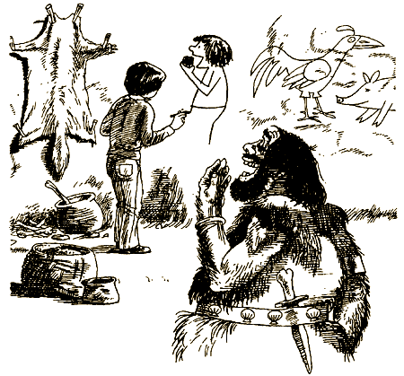
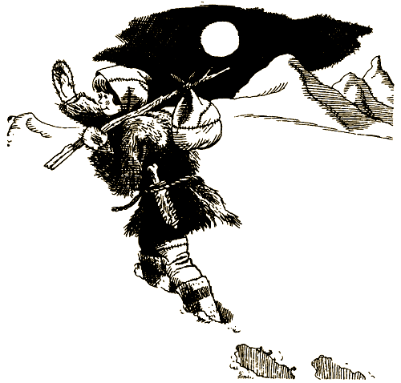

# 0

## Эдвард Паккард

# ПЕЩЕРА ВРЕМЕНИ

#### Идею книги и ее название придумала Андреа Паккард

Это необычная книга! Не пытайся читать ее по порядку, с начала до конца, переходя от одной страницы к другой, — ничего не получится! Ведь это игра, где тебя ждет масса приключений, на этот раз — в Пещере Времени. Тебе постоянно придется делать выбор. Что принесет он? Успех или поражение? Твои приключения — результат твоего выбора. Тебе самому решать, куда пойти, что сделать. Ну а когда решишь, читай указания в конце страницы, и тогда узнаешь, что будет дальше.

И помни: назад пути нет! Поэтому хорошенько подумай, прежде чем действовать. Игра есть игра: ты можешь и проиграть, и выиграть!

### ОБ АВТОРЕ

Эдвард Паккард — выпускник Принстонского университета и Колумбийского юридического колледжа. Сочиняя увлекательные истории для своих детей — Каролины, Андреа и Уэллса, — он разработал особый тип занимательных книг, использованный потом в серии «Выбери себе приключение».

### О ХУДОЖНИКЕ

Пол Грейнджер — выпускник Института Пратта, лауреат многих премий, известный художник и иллюстратор.

#### [Начать приключение](#2)

# 2

Ты уже бывал в Каньоне Змей, когда в прошлый раз гостил у дядюшки Ховарда на ранчо «Красный ручей». Но тогда ты не заметил никакой пещеры. Должно быть, она открылась после обвала.

Хотя полуденное солнце так и бьет лучами в пролом, внутри пещеры кромешная тьма. Пытаясь определить ее размер, ты делаешь несколько шагов. Постепенно глаза привыкают к темноте. Впереди ты различаешь нечто похожее на тоннель. Он слабо освещен фосфорическим светом. Его излучает какой-то минерал в стенах пещеры.

Стены совершенно гладкие, будто отшлифованные водой.

Почти двадцать шагов тоннель идет прямо, затем поворачивает. Интересно куда? Еще немного продвигаешься вперед, но тебе очень страшно одному в совсем незнакомом месте. Ты поворачиваешь назад и бежишь к выходу.

Наверно, будет гроза, потому что вдруг стало очень темно. Неожиданно ты понимаешь, что солнце давно село и только бледный свет полной луны освещает окрестности. Очевидно, ты заснул и проспал много часов. Странная деталь сбивает тебя с толку: ты совершенно убежден, что еще вчера на небе был тонкий месяц.

Тогда сколько же времени ты провел в пещере? Ты не голоден. Ты не чувствуешь себя так, будто только что проснулся. Что же теперь делать: попытаться добраться до дому, не потеряв ориентацию в этом мутном свете луны, или дождаться рассвета?

Возвращаешься [домой](#4) или хочешь [подождать](#5)?

# 4

Ты направляешься в сторону ранчо. Но тропинка совершенно не похожа на ту, по которой ты шел сюда. Хотя, конечно, этот бледный свет луны может сбить тебя с толку. Внезапно ты понимаешь, что идешь вообще не по тропинке, а по высохшему руслу реки. Бежишь обратно к входу в пещеру. Озираешься вокруг и видишь, что пейзаж совершенно изменился. Пока ты был в пещере, потоки воды размыли тропинку; однако еще остался какой-то грязный след. Ты дрожишь. Очень холодно, гораздо холоднее, чем обычно в это время года. Достаешь из сумки куртку и надеваешь ее, но все равно чувствуешь себя неуютно.

Наконец начинает светать. Небо на востоке розовеет. Скоро взойдет солнце. Ты смотришь на часы. Они остановились, хотя ты заводил их совсем недавно. Ясно, что происходит что-то не то.

Нужно как можно скорее добраться до ранчо. Однако ты чувствуешь, что единственный способ вернуть все на свои места — это снова войти в пещеру.

Идешь по направлению [к ранчо](#8) или возвращаешься [в пещеру](#10)?

# 5

Ты ждешь до утра. Наконец небо на востоке рассекают розовые лучи рассвета. Одновременно начинает дуть холодный, пронизывающий ветер.

Ищешь [укрытие](#6) или несмотря на пронизывающий ветер, ты идешь прочь от пещеры, чтобы изучить [мир вокруг](#16)?

# 6

Ты прячешься в нише между скал от безжалостного ветра и прислоняешься к каменной стене. Неожиданно она обрушивается под тяжестью твоего тела. Ты катишься вниз по грязному склону и падаешь в какой-то водоем.

Яркое солнце смотрит на тебя, когда ты выбираешься, совершенно мокрый, из воды и бредешь на берег, заросший травой. Рассматриваешь скалу, которая возвышается над водоемом. Невозможно установить, откуда именно ты упал.

Ты пытаешься собраться с мыслями, а к тебе тем временем, гарцуя, приближается конь. Всадник в железных доспехах — ну чистый рыцарь из книжки по истории. Он вызывает у тебя смех. Человек на коне снимает шлем и тоже смеется.

— Хорошее местечко для купания! — восклицает он. — Ты отлично выглядишь — свинья, пожалуй, грязнее тебя! — От смеха он едва не вываливается из седла. — Забирайся на коня, и я отвезу тебя назад в замок, — говорит он. — Посмотрим, удастся ли вернуть тебе человеческий вид.

[Соглашаешься](#22) ехать с ним в замок или [отклоняешь предложение](#114), так как тебе необходимо вернуться в Пещеру Времени?

# 8

Светает. Ясно, что ты идешь не туда. Каньон уже не такой глубокий. Дно реки покрыто валунами, которых раньше там не было. Холодный ветер пронизывает тебя до костей — но ведь сейчас середина лета! Ты взбираешься на какое-то возвышение, чтобы получше разглядеть окрестности, и обнаруживаешь снежные заносы. С высоты ты видишь бесплодную равнину, озера, покрытые льдом, и, вдалеке, цепь заснеженных гор. Очевидно, ты не просто потерялся, но потеря лея во времени. Загадочным образом ты отброшен в ледниковый период, то есть на миллионы лет назад.

В поисках укрытия от ветра ты бредешь к одному из утесов, ограничивающих каньон. Прямо перед тобой вход в другую пещеру. С одной стороны, тебе хочется войти. С другой — нужно двигаться дальше, не теряя надежды оказаться в знакомой местности.

[Входишь](#17) в новую пещеру или [продолжаешь идти](#18)?

# 10

Ты входишь обратно в пещеру. Некоторое время ждешь, пока глаза привыкнут к тусклому желтому свету. Постепенно ты различаешь очертания двух тоннелей. Один ведет вниз и направо, другой — вверх и налево. Тебе приходит в голову, что первый может вести в прошлое, а второй — в будущее.

Идешь по [левому](#20) или [правому](#61) тоннелю?

Иди [выходишь](#21) из пещеры?

# 11

— В башню его! — кричит король.

Вперед выходят два рыцаря и выводят тебя из залы. Ткнув пиками в спину, они ведут тебя по каменной лестнице в башню-тюрьму: 48 ступеней вверх. Тюрьма — это круглая комнатка с маленьким окном, откуда виден ров с водой, а за ним пастбища. Соломенная подстилка — единственная «мебель».

Очевидно, ты отброшен назад, во времена раннефеодальной Европы. Здесь единственным законом является каприз короля. Ты не представляешь себе, как долго он собирается продержать тебя в башне. Есть только одна возможность бежать. Ров находится почти под твоим окном — до него около 8 метров. Если удастся допрыгнуть, ты упадешь прямо в воду и останешься жив.

[Прыгаешь](#12) или [нет](#13)?

# 12

Ты прыгаешь из окна и падаешь вниз. Проходишь сквозь слой воды и достигаешь дна, но скользкий ил смягчает приземление. Через несколько секунд ты всплываешь на поверхность. Испуганный, но невредимый, ты плывешь к противоположному берегу рва. Выбираешься из воды и бежишь под прикрытие леса.

Ты идешь вдоль кромки леса, пока замок не скрывается из виду. Затем выходишь на открытую местность. Желая узнать, где можно переночевать, ты останавливаешь крестьянина.

— Поднимешься на холм и увидишь прямо перед собой озеро Лох-Несс, — говорит он. — На берегу ты найдешь пристанище.

Именно так ты и поступаешь. Завидев маленькие домики на берегу озера, ты направляешься к ним. Темнеет. К своей радости, ты встречаешь рыбака, который готов предоставить тебе кров на ночь. Он и его жена — хорошие люди. Они предлагают тебе остаться и, в уплату за содержание, помогать им рыбачить.

Соглашаешься [остаться](#66) или хочешь [идти дальше](#78)?

# 13

Ты решаешь подождать, но вскоре начинаешь жалеть об этом. Два раза в день приходит стражник и приносит тебе черный хлеб и воду. Через несколько дней ты настолько ослабеешь, что не сможешь бежать, даже если представится такой случай.

Но когда ты уже начинаешь терять надежду на избавление, опять входит стражник. Он улыбается.

— Король приказал выпустить тебя отсюда, — говорит он. — У нас есть более серьезный преступник — человек, оскорбивший королевского коня.

Он смеется тебе в лицо. Неизвестно, правду ли он говорит. Однако стражник открывает дверь и выводит тебя. Вы спускаетесь по каменной лестнице в главный королевский двор. Ты опять на свободе — по крайней мере в данный момент. Подъемный мост опущен. Кажется, уже ничто не сможет помешать тебе покинуть замок. Невдалеке привязан великолепный вороной конь. Должно быть, он принадлежит одному из рыцарей. Ты смог бы далеко ускакать на этом коне, прежде чем кто-нибудь обнаружит пропажу.

Садишься на коня и [несешься прочь](#14) или [просишь короля](#15) об убежище?

# 14

Через мгновение ты уже галопом скачешь по мосту и дальше, радуясь, что перехитрил короля и его рыцарей. Ты проносишься мимо пастухов и машешь им рукой. Они машут в ответ. Ты останавливаешься отдохнуть в домике пастуха, пасущего коз. Он угощает тебя вкусным обедом.

— Не бойся короля, — говорит он, — это просто дурак, с утра до вечера пьющий грог. Его единственная забота — решить, кого посадить в башню. Даже рыцари смеются над ним, и он раньше упадет с трона, чем ты с седла. Поезжай в старую добрую Англию, тебя ждут великие дела. Успехов тебе и удачи!

Хорошая еда прибавила тебе сил, и твой конь тоже торопится в путь. Ты от всего сердца благодаришь пастуха и отправляешься навстречу новым приключениям в новой жизни — почти за тысячу лет до своего рождения.

#### КОНЕЦ

# 15

Ты добиваешься приема у короля и благодаришь его за освобождение.

— Не бери в голову, — отвечает король. — Мы сделали бы столько же для любого преступника. Нам по душе твоя храбрость, и, хотя твой рассказ бессмыслен, как танцующий мул, он насмешил нас. Сам того не подозревая, ты сослужил хорошую службу своему королю. Мы благодарим тебя. Мы позаботимся о том, чтобы тебе дали коня и несколько золотых монет, — продолжает король. — Отправляйся вершить свою судьбу. Но мы приказываем тебе являться сюда раз в год и рассказывать не менее занимательные истории, чем та, что мы слышали.

— Слушаюсь, мой повелитель! — говоришь ты.

— В путь, мой верный слуга! — отвечает он.

Ты скачешь прочь, размахивая знаменем, готовый совершить столько подвигов, сколько возможно в 982 году.

#### КОНЕЦ

# 16

Ты устало бредешь по горному хребту. Свирепый ветер смел с него последний снег. Он кусается и пронизывает тебя до костей.

Мир изменился, и, что очевидно, к худшему. Ты должен найти какой-нибудь дом, хижину и людей, которые могли бы тебе помочь, иначе ты погиб.

Проклиная свою судьбу, ты спотыкаешься и падаешь в глубокую трещину. Теряешь сознание. Позже приходишь в себя, все еще дрожа. Однако ты уже в более теплом месте. Судя по тусклому желтому свету, ты опять попал в Пещеру Времени. Один тоннель ведет направо, другой — налево. Может быть, один в будущее, а другой — в прошлое?

Идешь [налево](#24) или [направо](#25)?

# 17

Войдя в пещеру, ты видишь мерцающий огонек и чувствуешь запах дыма. Проходишь по извилистому тоннелю и попадаешь в просторный отсек. Из глиняных сосудов рвутся вверх языки пламени.

Несколько коренастых, приземистых людей с прямыми черными волосами и примитивными лицами что-то рисуют на стенах пещеры. Они одеты в звериные шкуры. Постель им заменяет солома, постланная в углу.

Ты стоишь слегка испуганный. Пещерные люди бросают свою работу и подбегают к тебе. Они рассматривают тебя с недоверием. Самый внушительный из них приносит длинный стебель какого-то стелющегося растения. Он делает шаг вперед, намереваясь схватить и связать тебя.

[Остаешься](#26), чтобы познакомиться поближе с пещерными людьми или [бежишь прочь](#28)?

# 18

Ты карабкаешься на утес, а он заканчивается нависающим над землей выступом. Раздается громкий трубный звук. Это какое-то большое животное. Ты подползаешь к краю и видишь внизу крупнейшего из существовавших на земле млекопитающих — мамонта. Это огромное животное кажется еще более громадным благодаря своему толстому шерстяному покрову. Ты доведен до отчаяния, промерз до костей и ужасно устал. Уступ, на котором ты лежишь, находится в нескольких метрах от мамонта. Оттуда ты легко можешь прыгнуть ему на спину, зарыться в теплую шерсть и отправиться путешествовать, куда ему будет угодно!

[Прыгаешь](#29) на спину мамонта или [продолжаешь путь](#30) на своих двоих?

# 20

Левый тоннель изгибается по спирали, пересекая несколько других тоннелей. Ты сворачиваешь в один из них — он идет вверх. Через несколько минут ты уже у выхода. Перед тобой пустыня. Нестерпимо жарко — явно больше 50 градусов, но солнце садится, так что скоро станет прохладнее. Вдалеке цепь очень высоких гор. Однако их вершины не покрыты снегом. Ты не имеешь ни малейшего понятия о том, попал ли ты в прошлое или в будущее или находишься в настоящем. Затем ты замечаешь нечто, что зачаровывает и пугает тебя одновременно. Песок плавится, превращаясь в желтоватое стекло, будто его нагревают в печи. Внимательно рассматривая песок, ты чувствуешь, что становится жарче. И вдруг понимаешь, что солнце не садится, а, напротив, встает! Значит, к полудню температура будет совершенно невыносимой. А солнце все поднимается, жара волнами накатывает на тебя. Что, если тебе предстоит стать свидетелем конца света?

Ты ныряешь обратно в тоннель, в надежде вернуться в более ранние времена. С наслаждением ощущаешь прохладный влажный воздух пещеры. Любопытно было бы заглянуть в соседний тоннель. Должно быть, он покажет тебе мир таким, каким он был до того, как его выжгло солнце. А может быть, таким, каким он стал после! С другой стороны, у тебя есть предчувствие, что тоннель, начинающийся подальше, ведет в твое время.

Идешь в [соседний тоннель](#31) или в тот, [который подальше](#32)?

# 21

Ты поворачиваешь назад и движешься к выходу. По твоим предположениям, сейчас должен быть рассвет. Однако снаружи в пещеру не проникает ни лучика света. Ты пробираешься к выходу ощупью, опираясь на стены. Руки натыкаются на что-то холодное, мокрое и твердое. Лед! Выход завален. Куски льда попали и внутрь пещеры.

Ты отступаешь, растерянный и беспомощный. Хотелось бы, чтобы этот кошмар оказался сном. Возвращаешься туда, где начинаются тоннели, и стараешься хорошенько обдумать свое положение. Очевидно, единственный способ выбраться из пещеры — это пойти по одному из этих тоннелей.

Идешь по [правому](#33) тоннелю или по [левому](#35)?

# 22

Смеясь, рыцарь помогает тебе взобраться на своего коня. Тот принимается скакать легким галопом. Тебя изрядно укачивает. Преодолев около мили, вы наконец подъезжаете к огромному каменному замку. Конь пускается рысью по мосту и направляется в конюшню.

— Прыгай! — кричит тебе рыцарь, и ты соскальзываешь со спины коня.

Рыцарь провожает тебя в самую большую залу дворца. Собирается королевская свита и рыцари. Через несколько минут ты преклоняешь колена перед самим королем.

Выслушав твой рассказ, король мрачно смотрит на своих советников, рыцарей и слуг.

— Кто-нибудь верит этим сказкам? — спрашивает он.

Все хором отвечают: «Нет, Ваше Величество», «Конечно, нет, Ваше Величество».

— А теперь скажи нам правду, — приказывает король.

[Настаиваешь](#36) на том, что сказал правду или [пытаешься придумать](#37) какую-нибудь правдоподобную историю?

# 24

Ты идешь по левому тоннелю. Он выводит тебя на поверхность. Перед тобой зеленая равнина, окаймленная журчащим прозрачным ручьем. Вдалеке покрытые хвойным лесом предгорья, а за ними снежные вершины гор. Возможно, это штат Вайоминг, а время то самое, в которое ты живешь. Но даже если время другое, главное — мир вокруг кажется гостеприимным.

Ты видишь пасущееся стадо бизонов. Но нигде нет ни домика, ни забора, ни дорожки — никаких следов присутствия человека. Должно быть, ты отброшен во времени на сотни, а то и тысячи лет назад.

Ты смотришь вверх. Одно из больших белых кучевых облаков движется очень странно. Оно опускается на землю! Космический корабль приземляется всего в нескольких метрах от тебя.

[Прячешься](#38) или идешь [к кораблю](#40)?

# 25

Ты идешь по правому тоннелю довольно долго, надеясь найти проход, ведущий в твое время. Выбираешь одно из многочисленных ответвлений и сворачиваешь в него. Но вместо того, чтобы выбраться из пещеры на поверхность, ты попадаешь в ярко освещенную комнату, в центре которой в кресле сидит бородатый старик.

— Добро пожаловать, — говорит он, как будто давно тебя поджидал.

— Спасибо, — отвечаешь ты. — Не могли бы вы помочь мне найти дорогу в мое время?

Старик улыбается.

— Прежде всего, — говорит он, — ответь мне: почему ты хочешь вернуться в свое время, а не желаешь попасть в какое-нибудь другое?

[— Потому что я хочу вернуться к своей семье и друзьям](#43)

[— Потому что я боюсь попасть в какое-нибудь плохое время](#41)

[— Я не возражаю попасть в другое время, но только если вы гарантируете, что в конце концов я вернусь в свое](#44)

[— Кто вы?](#45)

# 26

Языком жестов ты выражаешь свое доброжелательное отношение. Человек со стеблем отступает и улыбается. Люди дружелюбно заговаривают с тобой, но ты не понимаешь их. Они тоже не понимают тебя. Положение довольно неловкое, но по крайней мере ты в безопасности и больше не мерзнешь.

Пещерные люди возвращаются к своему занятию. Тебе приходит в голову объясниться с помощью рисунков. Ты рисуешь самого себя с куском чего-то съедобного в руке. Люди смеются, но один из них приносит тебе кусок недожаренного мяса. Он не слишком-то вкусен, но ты так проголодался, что это не важно.

Через некоторое время ты уже знакомишься со всеми и выучиваешь основные слова их языка. Часть из них ходит на охоту и приносит добычу. Другая — шьет одежду из звериных шкур. Ты помогаешь убирать в пещере и готовить и каждый день рисуешь что-нибудь на стене. Пещерные люди зачарованы твоими изображениями самолетов, кораблей и машин. Эти предметы кажутся им выдумками, потому что они понятия не имеют о том, как те действуют.

Однажды приходят люди из другого племени. Ты их никогда раньше не видел. Однако встречают их очень тепло. В их честь устраивается настоящий пир. Когда с едой покончено, завязывается оживленный разговор. Кажется, они обсуждают какие-то серьезные проблемы. Но постепенно пещерные люди засыпают. Ты выходишь на свежий воздух. Земля покрыта глубоким снегом. Пронизывающий холодный ветер поднимает и кружит снежные облака.

На следующее утро люди начинают собирать свои пожитки и знаками показывают тебе: делай как мы. Очевидно, они намереваются совершить переход в более теплую местность. Ты понимаешь, что тоже должен идти, но желание вернуться домой очень велико. Единственный выход — найти дорогу обратно в Пещеру Времени.

Идешь вместе с [пещерными людьми](#46) или отправляешься [искать дорогу](#47) в Пещеру Времени?

# 28

Ты не видишь для себя будущего в обществе первобытных людей, поэтому отправляешься искать дорогу обратно в Пещеру Времени. К счастью, они не преследуют тебя, и ты можешь идти, куда пожелаешь.

Усталый и голодный, ты наконец входишь в пещеру. Свет стал еще более тусклым, и ты идешь ощупью в поисках нужного коридора. Внезапно ты оступаешься и падаешь на какую-то насыпь, сильно ударившись головой. Осматриваешься. Из отверстия вверху поступает дневной свет. Через минуту ты выходишь из пещеры, воздух вокруг тебя теплый и влажный. Прямо перед тобой лиственный лес. Мимо пролетает птица. Ты не знаешь, в каком ты времени, но выглядит оно довольно привлекательно.

Неожиданно раздаются громкие крики. Ты прячешься в зарослях. Сквозь кусты продирается какой-то зверь. Несколько человек с дубинками и копьями преследуют его. Должно быть, ты попал во времена, когда на земле еще не было цивилизации. Идешь по следу зверя. Вскоре он выводит тебя на опушку, и ты ложишься на траву отдохнуть. На небе ты замечаешь длинную тонкую белую полосу. Протираешь глаза и смотришь снова. Это ужасно похоже на след от реактивного самолета! Может быть, ты все-таки находишься в своем времени?

Несколько дней ты блуждаешь в джунглях и наконец выходишь к селению на берегу большой реки. Рядом находится аэродром. Через несколько недель ты прилетаешь домой на самолете. Прошел месяц с тех пор, как ты вошел в Пещеру Времени. Ты рад, что вернулся, но не можешь понять, почему все вокруг тебя так постарели. Они же ужасно удивлены, что спустя одиннадцать лет ты совершенно не изменился!

#### КОНЕЦ

# 29

Ты приземляешься: на спину мамонта. Он встряхивается, словно конь, отгоняющий мух. Затем, тяжело ступая, идет по равнине, не подозревая, судя по всему, о том, что ты прячешься в его шерсти.

Мамонт останавливается у небольшого холма, сдирает с дерева кусок коры и идет дальше. Может быть, он доставит тебя к пещерным людям, а они дадут тебе пищу и кров?

Вдруг мамонт поворачивает голову, прислушиваясь. Ты выглядываешь и видишь, что с двух сторон к вам приближаются люди. В руках у них дубинки и копья. Мамонт в страхе бежит. Ты прижимаешься к его спине. Охотники с криками и гоготом преследуют вас. Тебе не видно, куда направляется мамонт, но ты боишься, что, преследуемый охотниками, он может свалиться с обрыва. Однако если ты попытаешься спрыгнуть на полном ходу, то, скорее всего, расшибешься.

Рискуешь [спрыгнуть](#52) или [нет](#53)?

# 30

Прокатиться на мамонте было бы неплохо, если бы ты не потерялся, не замерз, не хотел есть. Но куда он тебя привезет? Упав духом, ты бредешь дальше. Ты уже готов сесть и заплакать, как вдруг замечаешь отверстие в земле. Вползаешь внутрь на четвереньках. С одной стороны, здесь можно согреться, с другой — этот ход может вести в Пещеру Времени.

Он ведет в более просторный тоннель. От основного тоннеля в разные стороны отходят ответвления. Ты совершенно уверен в том, что снова попал в Пещеру Времени. Ты бы рад выбраться поскорее на поверхность, но хочешь как можно дальше продвинуться во времени. Возможно, тебе не надо сворачивать в ближайший тоннель.

Сворачиваешь в [ближайший тоннель](#54) или идешь [до следующего](#92)?

# 31

Ты сворачиваешь в ближайший тоннель и ползешь по нему довольно долго. Такое ощущение, будто ты движешься по кругу. Что бы это значило? Может быть, само время замедлило свой ход? У тебя уже не осталось сил, и, кроме того, ты ужасно замерз. Вдруг ты обнаруживаешь прямо над собой отверстие, через которое видны звезды. Ты выбираешься наверх и ступаешь на голую землю. Жуткий холод. Ветра нет, но ты все равно рискуешь превратиться в ледышку через несколько минут, а то и раньше. Воздух такой разреженный, как будто ты находишься высоко в горах. Дышать становится все трудней. Чистое и холодное ночное небо усыпано мириадами звезд. Среди них ты видишь диск размером с солнце, от которого исходит слабый красноватый свет — свет тлеющего уголька.

#### КОНЕЦ

# 32

Преодолев значительное расстояние, ты попадаешь в длинный тоннель. Он очень похож на тот, что ведет в твое время. Ты идешь по нему и вдруг замечаешь, что под ногами у тебя песок. Возможно, ты подходишь к пляжу. В следующее мгновение песок словно проваливается под тобой. Ты летишь куда-то, не в силах остановиться, и наконец падаешь в глубокий водоем. Всплываешь на поверхность, судорожно глотая воздух. Ты в подводном гроте. Он почти изолирован от внешнего мира, только в верхней его части есть отверстие, в которое видно голубое небо. Ты подплываешь к большому гладкому камню, виднеющемуся из воды.

Песок белый, вода прозрачная. Камни вокруг состоят из кристаллов нежно-голубого цвета. На мгновение ты забываешь обо всем на свете, любуясь этой красотой. Но почти сразу же задаешься вопросом: как отсюда выбраться? Совершенно очевидно, что тебе не достать до отверстия в крыше.

Ты ныряешь в надежде обнаружить подводный ход, который выведет тебя отсюда. И ты находишь его! Но хватит ли тебе воздуха, чтобы проплыть по нему и добраться до поверхности?

Выбраться из грота через [подводный тоннель](#58) или найти [другой выход](#64)?

# 33

Ты идешь по полутемному тоннелю. Впереди — лестница. Ты хватаешься за перила и начинаешь взбираться по ней. Раздается ужасный скрип и хруст. Лестница шатается. Потом шум затихает, но ты еще несколько минут стоишь, вцепившись в перила. Затем продолжаешь взбираться и вскоре оказываешься на поверхности. Холодный и бодрящий ночной воздух. Вокруг огоньки. Впереди виднеется огромная глыба льда. Такое ощущение, будто почва под ногами колеблется. Но, потрогав руками, ты убеждаешься, что стоишь на деревянном полу. Неподалеку от тебя — поручни, внизу — море, над головой — звезды. Таких ярких звезд и в таком количестве ты еще не видел. Судя по всему, ты находишься на борту очень большого корабля.

Рядом, на крюке, висит огромный спасательный круг. На нем черными буквами написано «Титаник». Ты знаешь, что был только один корабль, носивший такое имя. Он только однажды вышел в море, столкнулся с громадным айсбергом и через три часа уже лежал на дне Атлантического океана.

Ты идешь вдоль палубы «Титаника», зная, что в нижней его части есть пробоина, через которую ежеминутно галлоны воды вливаются в нижние отсеки. Люди и не подозревают о том, что происходит.

На море полный штиль. С нижней палубы доносятся звуки вальса. Тебе навстречу идут несколько мужчин в длинных черных пальто и женщины в меховых жакетах.

— Боже мой! — восклицает одна из них. — Хотела бы я знать, почему капитан остановил корабль. Если мы не прибудем в Нью-Йорк вовремя, я подам жалобу на пароходную компанию.

[Ищешь капитана](#68), чтобы предупредить его о надвигающейся катастрофе или спускаешься [по лестнице](#79), чтобы вернуться в Пещеру Времени?

# 35

Ты идешь по левому тоннелю, время от времени пересекая какие-то коридоры, но ни один из них не привлекает тебя. Интересно, можно ли дойти до конца этого тоннеля?

Ты идешь все дальше вперед. Проходит час, другой. Наконец ты замечаешь вдалеке чей-то силуэт, движущийся тебе навстречу. Это девочка, одетая в синие джинсы и красный свитер, с рюкзаком за плечами. Она говорит, что ее зовут Луиза. Она хотела осмотреть пещеру и заблудилась. Девочка не догадывается, что находится в Пещере Времени.

Пытаешься [помочь Луизе](#76) найти вход, через который она попала в пещеру или предлагаешь ей выбраться из пещеры [через тоннель](#80) вместе с тобой?

# 36

— Это может показаться странным, Ваше Величество, — говоришь ты, — но у меня нет причин испытывать Ваше терпение лживыми россказнями.

Король оглядывается на своих придворных. Их лица выражают осуждение, как будто ты совершил [непростительный поступок](#11).

# 37

— Сожалею, что вторгся во владения Вашего Величества, — смиренно произносишь ты, стараясь поскорее сочинить правдоподобную историю. — Но если говорить правду, злой отчим жестоко обращался со мной, поэтому я бежал из дома, ища Вашей защиты и покровительства.

— Кто этот злой отчим и где он живет? — спрашивает король. — Если он действительно такой злобный, мы можем сделать его одним из наших рыцарей, — добавляет он, смеясь. Смеются и все придворные.

— Он живет у подножья этого холма, — говоришь ты, указывая на гряду высоких, поросших лесом холмов. — А зовут его Смит.

Король снова хохочет.

— Твой отчим, вероятно, рыба, — говорит он, — так как у подножия того холма находится [озеро Лох-Несс](#11).

# 38

Должно быть, ты попал в далекое будущее. Неужели это действительно космический корабль с другой планеты? Если так, то лучше держаться от него на расстоянии. Ты быстро взбираешься на холм. Удивительно, как тебя угораздило попасть в это странное время?

Прямо перед тобой каменная ниша, и ты вступаешь в нее. Ты обнаруживаешь, что находишься на дне того самого ущелья, в которое упал в ледниковом периоде. Даже если бы ты хотел вернуться в эти времена, то не смог бы этого сделать. Продвигаешься вперед. В конце концов ты выходишь на открытое пространство с другой стороны холма.

Бесплодная земля, холмы и камни. Тысячи людей строят огромную стену. Тут и там видны повозки с запряженными в них волами. Повозки наполнены камнями. Стена поднимается уже по крайней мере метров на шесть и тянется до самого горизонта.

К стене приставлены деревянные лестницы, и на каждой ступеньке стоит мужчина или женщина. Они передают друг другу камни.

Это зрелище столь же достойно удивления и восхищения, как и космический корабль. На этот раз ты стал свидетелем строительства Великой Китайской стены.

Идешь к [строителям стены](#82) или возвращаешься [в ущелье](#87)?

# 40

Ты осторожно приближаешься к космическому кораблю и, к своему удивлению, обнаруживаешь, что он завис сантиметрах в тридцати от земли. Никакой опорный механизм его не поддерживает. У него нет двигателей, ракет, иллюминаторов, посадочного устройства, антенны и многого другого, что, по твоим представлениям, нужно космическому кораблю. Совершенно очевидно, что он создан цивилизацией, стоящей на высочайшей ступени развития.

Уверенный в том, что такие умные люди должны дружелюбно относиться к чужестранцам, подходишь к кораблю. Откидывается люк, но единственное, что ты видишь внутри, — это мерцающий голубоватый свет. Из люка на землю спускается большой куб, поддерживаемый механическими «руками». Крышка куба откинута. Видна соломенная подстилка, на которой спят трое мужчин и три женщины. Они одеты в звериные шкуры. Их тела и черты лица напоминают тебе изображения древних людей, которые ты видел на картинках. Тебе ужасно хочется забраться в корабль, пока люк не закрылся.

Ты так и [поступаешь](#115) или [нет](#83)?

# 41

— Я могу понять, — говорит старик, — почему ты не хочешь в другое время. Ты боишься рисковать, потому что считаешь, что в другие времена на земле жили дурные люди, совершавшие дурные поступки.

Ты мудро решил не встречаться с ними, и я с удовольствием укажу тебе путь в твое время, которое, должен тебя уверить, не лучше и не хуже любого другого.

#### КОНЕЦ

# 43

— А почему ты хочешь вернуться к своей семье и друзьям? — спрашивает старик.

— Потому, что я буду скучать по ним и не вынесу, если больше никогда их не увижу. И они тоже будут очень огорчены тем, что я не возвращаюсь.

— Ты заботишься о других, но не забываешь и о себе, — отвечает он. — Этого достаточно, чтобы я захотел помочь тебе вернуться домой. Сворачивай в первый же тоннель направо — он ведет в твое время. Ты ведь хочешь жить только в одном времени, не правда ли?

— Правда, — отвечаешь ты.

— Желаю тебе использовать его наилучшим образом, — говорит старик и машет рукой на прощание.

#### КОНЕЦ

# 44

— А ты неглупый парень, — говорит старик. — Хочешь получить сразу и синицу, и журавля, а не выбирать между ними. Ну хорошо, я покажу тебе другое время, а если оно будет тебе не по вкусу, только скажи, и я верну тебя домой, если успею. Иди по левому тоннелю.

Ты проходишь тоннель насквозь и выбираешься на городскую улицу. Ты сразу понимаешь, что идет война. Вокруг тебя взрываются бомбы и ракеты. Ты кричишь старику, чтобы он вернул тебя в Пещеру Времени, но уже поздно.

#### КОНЕЦ

# 45

— Я философ, — говорит старик. — Когда мне предложили выбрать себе время, я выбрал безвременье, так что, хотя в моей жизни никогда ничего не происходит, зато у меня в распоряжении сколько угодно времени, чтобы думать.

— Вы счастливы, что сделали такой выбор?

— Нет, потому что и философия ничто вне времени. Иди по правому тоннелю. Ты вернешься в свое время, и пусть твоя жизнь станет твоей философией.

#### КОНЕЦ

# 46

Одевшись как можно теплее, то есть надев грубые башмаки и завернувшись в звериную шкуру, с восходом солнца ты вместе со всеми покидаешь пещеру. Вас около 30 человек: косматые мужчины, женщины и дети. К счастью, нет младенцев, они бы не вынесли этого перехода. Солнце иногда проглядывает сквозь тучи, ветер слабеет, и вам удается продвинуться довольно далеко на юг.

Проходит несколько дней, и вы совершенно измождены. Охотникам не удается добывать достаточное количество пищи. Нечем развести костер на ночь. Единственный способ уберечься от холода — сбиваться в кучу на время сна.

Но уже через неделю солнце начинает сильнее пригревать в полдень, а снег становится не таким глубоким. Кажется, тебе удастся выжить, но ты должен распрощаться с надеждой когда-нибудь вернуться в свое время.

#### КОНЕЦ

# 47

Ты собираешь пожитки. Одной вещицей ты особенно дорожишь — это нож, сделанный из бивня мамонта. Ты прощаешься с друзьями и бредешь по снегу, стараясь найти свои следы, ведущие в Пещеру Времени. Хотя ветер холоднее, чем обычно, яркое солнце поддерживает в тебе надежду.

Жизнь с пещерными людьми закалила тебя, и теперь тебе очень тепло в одежде из звериных шкур. Ты находишь дорогу в каньон и через несколько часов уже стоишь у входа в пещеру. Он почти занесен снегом.

Ты устал от долгой дороги, глаза слезятся от холодного ветра. Поэтому ты не замечаешь в нескольких метрах от пещеры большую серую тень. Вдруг раздается протяжный, гортанный вой волка. Его холодные, кровожадные глаза смотрят прямо на тебя. Ты чувствуешь, что стоит тебе пошевелиться — и он прыгнет. Нужно что-то придумать. Может быть, ты успеешь скрыться от волка в пещере. Если он не сразу кинется за тобой, тебе хватит времени, чтобы спрятаться. Или ты можешь загнать волку нож в горло, когда он на тебя бросится.

Бежишь [в пещеру](#49) или готовишься [к битве](#50)?

# 49

Ты осторожно вытаскиваешь нож и бежишь к входу в пещеру. Волк мгновенно бросается к тебе. Он прыгает на тебя и рвет медвежью шкуру, в которую ты одет. Пока он занят шкурой, ты вбегаешь в пещеру и сворачиваешь в левый тоннель. Волк преследует тебя. Ты оборачиваешься и теряешь равновесие. Однако ты не падаешь на землю, а соскальзываешь вниз по длинному крутому склону. Наверху разочарованно завывает волк. Ты приземляешься на дно ямы, потрясенный, но невредимый. Налево вниз уходит темный тоннель. Ты бросаешь туда камень, и через довольно долгий промежуток времени слышишь всплеск воды.
К счастью, еще один ход ведет [направо](#25). Он слабо освещен голубовато-зеленоватым светом.

# 50

Держа нож длинным костяным лезвием вперед, ты медленно приближаешься к волку. Он тихо рычит, явно сбитый с толку твоей дерзостью.

Затем он прыгает. Ты наносишь удар ножом, встав при этом так, чтобы волк не мог вцепиться в тебя своими страшными клыками. Нож только рассекает воздух, но и волку удается только сорвать медвежью шкуру, в которую ты завернут. На мгновение он застывает над шкурой, обнюхивая ее. Ты поворачиваешься и вонзаешь нож ему в загривок. Волк странно скрючивается, смотрит на тебя с ненавистью и падает замертво.

Теперь ты настоящий охотник каменного века. Ты сдираешь с волка шкуру и входишь в пещеру.

Ты идешь по правому тоннелю, надеясь найти дорогу в свое время, но вдруг падаешь, все быстрее и быстрее, в какую-то бездонную пропасть.

Сознание медленно возвращается к тебе. Ты лежишь в собственной постели на ранчо «Красный ручей». Над тобой склонился дядя Ховард. Рядом — его друг, врач.

— Очевидно, ты сорвался, взбираясь по крутому склону каньона, и очень больно ушибся, — говорит, дядя Ховард. — Доктор Парсон удивлен, что кости целы. Мы ужасно беспокоились — думали, что ты потерялся в какой-нибудь пещере.

Ты чувствуешь головокружение и слабость, поэтому только молча улыбаешься. Тебе все равно никто не поверит. Но проходят годы, и ты пишешь книгу о своих приключениях в Пещере Времени.

#### КОНЕЦ

# 52

Ты передвигаешься к хвосту мамонта и соскальзываешь вниз, на обледенелую землю. Ты сильно ушибся и корчишься от боли, а мамонт, спасаясь от погони, бежит и падает с обрыва. Охотники кричат и веселятся. Некоторые из них подходят к тебе. Они приземистые и мускулистые, с выдающейся вперед челюстью и горящими раскосыми глазами. Черные волосы падают на плечи. Тела прикрыты звериными шкурами.

Ты беспомощно смотришь на них, не зная, что они собираются с тобой сделать. Однако быстро понимаешь, что настроены они дружелюбно. Они помогают тебе подняться и дойти до пещеры. Там они угощают тебя горячей похлебкой. На вкус она ужасна, но, поев, ты чувствуешь себя гораздо лучше. Вскоре ты догадываешься, что эти люди считают тебя своим. Оказывается, ты, сам о том не подозревая, совершил их священный ритуал — смело прокатился на спине мамонта.

Ты ведешь простую и суровую жизнь среди пещерных людей. Иногда ты скучаешь по своей семье, по друзьям, по времени, в котором жил. Но тебе нравится эта новая жизнь, и ты не можешь сказать, что несчастен.

#### КОНЕЦ

# 53

Ты вцепился в шерсть мамонта, надеясь, что он замедлит ход и ты сможешь незаметно соскользнуть с его спины. Страшно взревев, мамонт неожиданно делает рывок вперед. В тот же момент ты осознаешь, что летишь вниз. Ты беспомощно кричишь, понимая, что тебе не за что ухватиться, и с ужасающей скоростью приближаешься к земле.

Тысячи лет спустя доктор Карлетон Фрисби, известный палеонтолог, находит твои кости рядом с костями мамонта на раскопках у Красного Ручья. Он страшно удивлен сходством твоего скелета со строением современного человека.

#### КОНЕЦ

# 54

Ты входишь в первый же тоннель. Он постепенно становится таким низким, что приходится ползти. Таким способом ты передвигаешься в течение часа. Наконец твои страдания вознаграждены: ты чувствуешь струю воздуха, которая приносит запах свежескошенной травы.

Через минуту ты жмуришься на ярком солнце, любуясь прекрасной равниной, раскинувшейся между невысокими холмами. У журчащего ручья пасется с десяток коров. Поблизости видна проселочная дорога. На телеге с сеном сидит фермер. Серый в яблоках конь везет телегу к красному сенному сараю, расположенному неподалеку. С другой стороны доносится гудок несущегося на всех парах паровоза.

Оглядываешься и видишь, что ты находишься в сотне шагов от железнодорожного полотна. Паровоз пыхтит на повороте, выпуская из трубы клубы черного дыма. Все-таки ты выбрался из ледникового периода, но опять попал не в свое время.

Подъехав ближе, поезд замедляет ход, и по очень смешной причине — посреди путей стоит корова с таким видом, будто она не сдвинется ни за что на свете. Поезд останавливается, оттуда выскакивает человек и замахивается на корову угольной лопатой. Она подпускает человека совсем близко — и уносится на пастбище.
Тебе приходит в голову мысль забраться [в вагон](#94).

Идешь [на ферму](#98) или возвращаешься [в тоннель](#101) в надежде найти дорогу в свое время?

# 57

Тебе предоставляют прекрасную спальню с большим окном, выходящим в парк. На стене висит замечательная картина с изображением калифорнийского побережья. Но стоит только нажать кнопку, и картина поднимается к потолку, открывая большой экран. В твоей комнате находится компьютер, с помощью которого можно выбрать любой фильм или другую программу из более чем 10 000 возможных. Есть даже такие, где ты являешься главным героем и от тебя зависит, что произойдет дальше. А если тебе не нравится, как развивается сюжет, ты можешь вернуться назад и все изменить.

На компьютере можно также играть в игры и перелистывать на экране страницы книг и журналов. Словом, можно жить очень неплохо, даже не вставая с постели.

Но все-таки тебе хочется познакомиться с этим обществом. Ты встречаешься с разными людьми, но ни один из них не кажется тебе интересным. Кончается тем, что ты целыми днями смотришь шедевры мирового кинематографа. Постепенно ты привыкаешь к новой жизни. Только один факт заставляет тебя задуматься. Последние 300 лет никто здесь не снимает кино.

#### КОНЕЦ

# 58

Ты делаешь глубокий вдох, ныряешь и плывешь вдоль тоннеля. Впереди свет. Через пару секунд ты выныриваешь в красивом заливе. Крытые соломой хижины гнездятся между пальмами, окаймляющими песчаный берег. Теплый, ласковый ветер приносит аромат жасмина и необычайные, мелодичные звуки барабана. Рассматривая с моря залив, ты видишь несколько парусных лодок. Ветер гонит лодки в залив, а люди в лодках пытаются удержать паруса.

Ты выбираешься на берег и направляешься к хижинам. Несколько красивых загорелых людей замечают тебя. Некоторые убегают, другие подходят ближе, поднимая руки в знак приветствия. С гирляндами цветов подбегают двое ребятишек. Кто-то кричит: «Алоа!»

Вскоре ты уже сидишь на пляже у огромного костра, печешь крабов и жуешь пирог с фруктовой начинкой. Никогда раньше не встречавшие чужестранцев, твои хозяева очень тебе рады. Они приглашают тебя жить с ними. Через некоторое время ты выучиваешь их язык. Мальчики называют себя твоими братьями, девочки — сестрами.

Тебе нравится жить в этом новом раю, но ты все еще думаешь о том, как найти дорогу в Пещеру Времени.

Однако новые друзья ничем не могут помочь. Возможно, во внутренних районах удастся найти кого-нибудь, кто поможет тебе. Однако друзья отговаривают тебя: там нет ничего, кроме диких джунглей, а реки кишат крокодилами.

[Остаешься](#62) жить с новыми друзьями или [уходишь](#63)?

# 60

Есть что-то мертвящее в этом совершенном обществе будущего, поэтому тебя не покидает желание вернуться в свое время, и чем скорее — тем лучше. Коротко попрощавшись, ты спешишь обратно в пещеру. Спускаешься вниз и находишь справа тоннель, который должен привести тебя домой. Вскоре ты выбираешься на поверхность, с беспокойством думая о том, что тебя ждет.

Вокруг кромешная тьма. Дует холодный ветер. Ты садишься на землю. Лучше дождаться рассвета и посмотреть, что за мир тебя окружает. Пока что ты не можешь определить время суток ни по часам, ни по звездам.

Вокруг то и дело раздаются какие-то щелчки, одни дальше, другие ближе. Когда же розово-оранжевый свет встающего солнца наконец окрашивает небо на востоке, ты видишь перед собой существо размером с овцу, но с совершенно необыкновенной внешностью.

#### КОНЕЦ

# 61

Некоторое время ты идешь по тоннелю направо. Внезапно ты оступаешься, ударяешься обо что-то головой и теряешь сознание.

Приходишь в себя на берегу озера, окруженного лесом. Невдалеке мальчик лет двенадцати удит рыбу. Больше никого не видно. Ты подходишь к нему и представляешься, надеясь узнать, какой сейчас год, но не показаться при этом полным дураком.

К счастью, мальчик, кажется, хороший и настроен дружелюбно. Он говорит, что его зовут Ник Тилер, а живет он на Березовой улице. Он работает у своего отца — на производстве свечей и мыла, лучшем в колониях, по его словам.

Говоришь ему, что [пришел из будущего](#104) или стараешься придумать какую-нибудь [правдоподобную историю](#106)?

# 62

Друзья прекрасно понимают твое желание найти дорогу обратно в свое время, но говорят, что могут показать тебе нечто такое, о чем ты и не мечтал. Так как это общество находится на ранней стадии развития, тебе особенно любопытно, что же они имеют в виду.

На следующий день тебя приводят в бухту, где живописно плещутся волны, разбиваясь о скалу и откатываясь в море. Иногда они сталкиваются друг с другом, выпуская пенящийся фонтанчик воды высоко в воздух. Несколько молодых людей на маленьких плотиках — не больше доски для виндсерфинга — катаются на гребнях волн. Через несколько часов ты овладеваешь этим видом спорта и можешь до бесконечности с удовольствием кататься по волнам.

За этим развлечением нетрудно и о родном доме позабыть. Ты иногда задумываешься, но никак не можешь понять, чему принадлежит этот рай — будущему или прошлому?

#### КОНЕЦ

# 63

Ты прощаешься со своими друзьями и взбираешься на гору, за которой лежат джунгли. Вскоре ты находишь звериную тропу, ведущую сквозь густые заросли в тропический лес. Зеленый свод листьев смыкается высоко над головой, и только случайный луч света падает на болотистую, темную почву. Ты упорно идешь вперед в надежде добраться до гор, где может находиться еще один вход в Пещеру Времени.

Наступает ночь. Ты мастеришь себе нехитрое ложе. Матрас — мягкий мох. Вместо простыни — листья папоротника. Рано утром, разбуженный пением птиц, ты обнаруживаешь, что вокруг твоей шеи обвился удав.

#### КОНЕЦ

# 64

Очевидно, единственный способ выбраться из грота — это проплыть через подводный тоннель. Однако риск слишком велик — можно утонуть. Ты исследуешь камни и задумываешься: нельзя ли как-нибудь добраться до отверстия вверху?

Вдруг ты слышишь голос: «Привет!» Оборачиваешься и впервые замечаешь, что в углу сидит женщина со сверкающими голубыми глазами и загадочной улыбкой. Ее ноги скрещены, спиной она прислонилась к камню — в нем специальное углубление, так что сидеть очень удобно. В руках у женщины флейта. Пока ты смотришь на нее в изумлении, она начинает наигрывать незнакомую мелодию, одновременно простую и изысканную.

— Привет, — отвечаешь ты. — Скажи мне, кто ты и как мы можем выбраться отсюда?

— Сядь, — говорит она, — и расслабься. В твоем распоряжении сколько угодно времени.

— Что ты имеешь в виду? — спрашиваешь ты. — Это ловушка. Я соскользнул в этот грот из Пещеры Времени. Я хочу выбраться отсюда.

— Поверь мне, выбраться отсюда невозможно. Но ты не расстраивайся, — говорит она. — Здесь так прекрасно, что ты вполне можешь быть счастлив.

— Мы же умрем от голода. Сколько времени вы здесь находитесь? — спрашиваешь ты.

— Всегда и никогда, — отвечает она, — потому что в этой части пещеры не бывает ни прошлого, ни будущего. Здесь нет времени, и потому ты никогда не проголодаешься и не соскучишься. И, несмотря на то что отсюда нельзя выбраться, здесь нельзя провести хоть сколько-нибудь времени.

Ты сидишь, подперев руками подбородок, не в силах поверить, что тебя постигло такое несчастье. Жить вечно в мире безвременья — еще хуже, чем умереть.

— Ладно, если уж говорить правду, ты можешь выбраться отсюда и вернуться в свое время, — произносит наконец женщина, — но тогда ты уже не будешь жить вечно.

— Это меня не волнует, — отвечаешь ты. — Покажите мне дорогу.

— Прекрасно, — говорит она, недоверчиво покачивая головой. — Ныряй под камень, на котором я сижу, и плыви вдоль тоннеля, в который попадешь. Ты вынырнешь в своем времени. Не бойся, плыть всего несколько метров. У тебя хватит сил.

Последний раз ты оглядываешься вокруг, машешь женщине рукой и ныряешь. Через несколько секунд ты выныриваешь в озере посреди Пещеры Времени, прямо напротив входа. Ты выбираешься на берег и бежишь прочь из пещеры на свежий воздух. И вдруг натыкаешься на дядю Ховарда, который пришел искать тебя.

— Ты опаздываешь к обеду, — говорит он. — Мы уже беспокоимся. Тебе нужно учиться рассчитывать время.

#### КОНЕЦ

# 66

Ты принимаешь предложение, так как не можешь представить себе лучшей жизни в данных обстоятельствах. Вскоре ты привыкаешь отплывать от берега в утренней мгле и раскидывать сети вместе с соседями-рыбаками.

Однажды вечером, когда все уже привязывают лодки на ночь, твой друг Ангус Макфи поднимает крик, указывая на озеро. Ты оборачиваешься и видишь огромную голову и шею лох-несского чудовища. Рядом с ним плавают какие-то обломки.

— Это все, что осталось от лодки Сазерленда, — кричит Ангус. — Последний раз чудовище видели сто лет назад, теперь оно снова здесь.

Чудовище уплывает и вскоре исчезает во мгле.

— Как это может быть, что оно не появлялось сто лет, а потом вдруг вернулось? — спрашиваешь ты.

— Где-то около Битти-Пойнта есть подводная пещера, где это чудище может скрываться столько, сколько пожелает, потому что это Пещера Времени.

Если бы только ты смог найти дорогу обратно в Пещеру Времени! Но шансы очень малы, а риск слишком велик.

[Рискуешь](#70) или [нет](#74)?

# 68

Можешь ли ты изменить ход истории и спасти сотни жизней, предупредив капитана о том, что «нетонущий» «Титаник» уже устремился на дно Атлантики? Ты видишь ступеньки, ведущие на верхнюю палубу, и поднимаешься по ним.

Наверху ты встречаешь матроса. «Сюда нельзя», — кричит он. Но ты проскальзываешь мимо него и бежишь к носовой части корабля. Снова взбегаешь по каким-то ступенькам и оказываешься на капитанском мостике. В нескольких шагах от тебя стоит седобородый капитан и смотрит в бинокль на корабль, виднеющийся на горизонте.

— Капитан, — громко окликаешь ты. — Может, вы еще не знаете, но в ближайшие 2–3 часа корабль пойдет ко дну.

Он оборачивается и смотрит на тебя очень серьезно.

— Я знаю, — мягко говорит он. — Но мы собираемся послать сигнальные ракеты. Вон тот корабль — «Калифорниец» — окажет нам помощь.

— Вы ошибаетесь, капитан, — говоришь ты. — Они не поверят, что «Титаник» может быть в беде, хотя и заметят сигнальные ракеты. Единственное, что вы можете сделать, — это посадить самых сильных людей в спасательную шлюпку, и пусть они гребут к «Калифорнийцу» как можно быстрее, по пути выпуская сигнальные ракеты.

— Боже праведный, ты говоришь с такой уверенностью, — замечает капитан. — Спустить шлюпку с матросами и одновременно поддерживать порядок на корабле — для этого мне понадобятся все мои люди. Но я не могу поверить, что «Калифорниец» не подойдет, заметив наши сигналы. — А теперь спускайся на нижнюю палубу. Мистер Лайтоллер проследит, чтобы для тебя нашлось место в шлюпке.

С этими словами капитан поворачивается и быстро уходит, отдавая распоряжения идущему рядом помощнику. Ты грустно спускаешься вниз и становишься в очередь, чтобы сесть в шлюпку.

Два часа спустя ты сидишь, зажатый со всех сторон, в переполненной шлюпке и дрожишь на холодном ветру. Великий «Титаник» погружается у тебя на глазах в воды океана. На борту еще осталось полторы тысячи человек. Вместе с ними тонет твоя надежда вернуться в Пещеру Времени.

#### КОНЕЦ

# 70

В один прекрасный день, когда светит яркое солнце и вода наконец прогревается, ты садишься в старый ялик и гребешь к Битти-Пойнту. Ты причаливаешь к выступающей из воды скале, по которой запомнил, где находится пещера. Снова и снова ты ныряешь возле скалы, пока не обнаруживаешь вход. Ты проплываешь пару метров по тоннелю и выныриваешь на поверхность в огромной пещере, большую часть которой занимает озеро.

Ты выбираешься на берег озера и идешь в глубь пещеры, откуда льется таинственный голубой свет. Наконец впереди ты видишь тоннель. Он наверняка ведет в Пещеру Времени. Около входа в песке лежат три яйца величиной с футбольный мяч. Ты поднимаешь одно из них и вместе с ним входишь в тоннель. Проходишь какое-то расстояние, и тебе вдруг становится трудно дышать. Кружится голова, и ты без сознания падаешь на землю, сжимая в руках огромное яйцо.

Тебя оживляет дующий прямо в лицо свежий ветер. Пошатываясь, ты поднимаешься на ноги, подхватываешь яйцо и бежишь из пещеры на воздух. Ты снова в Каньоне Змей! Ничего не изменилось с тех пор, как ты был здесь. Вскоре ты уже приближаешься к ранчо, где тебя встречает дядя. Он удивлен, что ты вернулся так быстро.

Ты рассказываешь обо всем, что с тобой приключилось, но никто не верит тебе. Однако все зачарованы появлением огромного яйца.

— Возможно, мы поверили бы в то, что яйцо настоящее, и поверили бы твоим рассказам, если бы из него вылупилось какое-нибудь чудовище, — говорит дядя. — Или если бы ты разбил его и показал, что там внутри.

Ты готов [разбить яйцо](#72) или [спрячешь](#103) его в шкафу до тех пор, пока не сможешь посоветоваться со специалистами?

# 72

Тетя, дядя и несколько работников с ранчо наблюдают за тобой. Ты осторожно ударяешь топором по яйцу, надеясь, что оно не расколется на мелкие кусочки.

— Минуточку! — вдруг кричит дядя. — Я готов тебе поверить, но давай сначала вызовем натуралиста из университета, чтобы он посмотрел.

Ты рад дядиному предложению, потому что боишься брать на себя такую ответственность — разбивать яйцо. Можно ведь случайно убить еще не вылупившееся редкое животное.

Дядя Ховард вызывает натуралиста, известного профессора палеонтологии, который обещает приехать в следующую субботу. Ты кладешь яйцо в большое блюдо и ставишь его на середину обеденного стола.

Следующий день — пятница, и вечером вся семья идет в кино. Вернувшись, вы обнаруживаете, что кто-то взломал дверь и яйцо пропало.

Ни ты, ни тетя с дядей, ни кто-либо из работников ранчо, ни полиция — никто не может найти яйцо. Большинство людей, которым ты о нем рассказываешь, просто улыбаются и говорят: «Ну и дела». Но дядя Ховард, хотя он и скептик, признается тебе, что верит всему, что ты рассказал.

#### КОНЕЦ

# 74

Мысль о том, что лох-несское чудовище прячется в Пещере Времени сотни лет, а затем снова появляется, кажется абсурдной. Но если это и так, очень сомнительно, что ты сможешь нырнуть настолько глубоко, чтобы добраться до подводного входа в пещеру. Поэтому ты смиряешься с тем, что придется всю жизнь рыбачить в водах озера Лох-Несс.

Это вполне сносная, хотя и не слишком интересная жизнь. Особенно тебе нравится плыть на лодке в утреннем тумане и встречать тусклое солнце, с трудом пробивающееся сквозь мглу. Вот так ты сидишь однажды утром и неожиданно чувствуешь сильный толчок в дно лодки. Суденышко взлетает высоко в воздух, ты падаешь за борт и попадаешь прямо в пасть чудовищу.

Твои друзья находят обломки лодки, и по всей деревне люди говорят друг другу: «Чудовище снова вернулось».

#### КОНЕЦ

# 76

Услышав об ужасах того мира, который тебе довелось увидеть в Пещере Времени, Луиза готова принять твою помощь. Вместе вы ищете, откуда вошла в пещеру Луиза.

— Расскажи мне о том мире, из которого ты пришла в Пещеру Времени. Это Америка? И какой там год? — спрашиваешь ты по дороге.

— Год 2022, — отвечает Луиза.

— И люди все еще носят синие джинсы? — удивляешься ты.

— Они вернулись к этой моде недавно, — смеется она.

— Должно быть, появились какие-то новшества, которых не было в мое время. Расскажи мне о последних нововведениях.

— Лучшие из них — велосипедные дорожки. С 1997 года запрещено строительство автомобильных дорог — только велосипедные дорожки. И теперь этих дорожек не меньше, чем автомобильных дорог.

— Так что можно по всей стране путешествовать на велосипеде?

— Конечно! И не только вдоль шоссе, где полно автобусов и грузовиков с их сумасшедшими водителями, но и по лесам, и по равнинам, и по пустыням, и вдоль больших и маленьких рек. Иногда мне кажется, что я могла бы всю жизнь провести в этих путешествиях. К тому же есть еще специальные гостиницы для велосипедистов, где можно с удобством переночевать. И почти задаром. Все оплачивается за счет налогов на бензин.

Вдруг земля начинает уходить у вас из-под ног. Вы падаете. И приземляетесь, оба испуганные, но невредимые, у подножия крутого утеса, недалеко от дороги. Интересно, какой сейчас год? Рядом вы видите рекламный щит с надписью: «„Кадиллак“ — машина года, и это бывает каждый год!»

— Что такое «кадиллак»? — спрашивает Луиза.

#### КОНЕЦ

# 78

Лучше уж провести всю жизнь в поисках входа в Пещеру Времени, чем остаться в этой забытой Богом рыбацкой деревушке. Поэтому ты прощаешься со своими новыми друзьями и держишь путь на юг, в сторону Лондона. Твоя цель — найти корабль, который доставил бы тебя в Америку. Тебе известно, что Америка еще не открыта. Тем не менее ты должен попасть обратно в Каньон Змей и найти Пещеру Времени. Пару часов спустя, когда ты шагаешь по дороге вдоль опушки леса, несколько внушительного вида всадников выезжают из-за деревьев.

— Мы поймали тебя, — кричит один из них. — Это ведь ты убежал из башни, не так ли?

Они силой сажают тебя на коня, и быстрее ветра вы мчитесь к замку.

— В наказание за побег ты будешь повешен, — говорит тебе стражник.

Это оказывается правдой.

#### КОНЕЦ

# 79

Ты не испытываешь желания пойти ко дну вместе с «Титаником». Поэтому ты спускаешься в трюм корабля, надеясь, что тебе удастся найти дорогу обратно в пещеру. В спешке ты теряешь равновесие и падаешь. Пытаешься схватиться за перила, но безрезультатно; при падении ты так ударяешься, что теряешь сознание. Приходишь в себя в одном из тоннелей пещеры.

Исследуешь [тоннель](#86) или хочешь снова осмотреть [вход в пещеру](#88)?

# 80

— Раз ты не можешь найти дорогу к себе домой, — говоришь ты, — давай попробуем найти дорогу ко мне.

Вы идете назад и вскоре оказываетесь у входа в необычайна широкий тоннель. Ты останавливаешься, Луиза смотрит на тебя вопросительно.

— Давай попробуем этот, — предлагаешь ты.

В течение часа вы шагаете по тоннелю и наконец видите свет. Радостно улыбаясь друг другу, вы выходите из пещеры. Под ногами у вас красноватая песчаная почва. Вы оглядываете окружающую вас местность, которая имеет форму блюдца. Воздух свеж и прозрачен, как в ясный осенний день. Возможно, вы находитесь на дне кратера потухшего вулкана. Неожиданно вы слышите позади себя оглушительный шум. Вы с Луизой бежите, спасаясь от оползня. Он засыпает тоннель, ведущий обратно в Пещеру Времени.

— Интересно, какой же сейчас год? — спрашивает Луиза, когда вы приходите в себя.

В первый раз вы смотрите вверх — на солнце. Оно в четыре раза больше того, которое ты знал, но совсем не такое яркое. Солнце стоит прямо над головой, оно ржаво-красного цвета.

— Я не уверен, — отвечаешь ты, — но, судя по тому, что я читал в книгах по астрономии, я сказал бы, что это 2000 год — плюс еще около 4 миллиардов лет.

#### КОНЕЦ

# 82

Ты подходишь к основанию стены, где работают люди. Однако они принимают тебя за шпиона какого-то неизвестного племени. Стражники скручивают тебе руки, заставляют сесть на груду камней и ждать.

Через некоторое время они возвращаются и показывают на лестницу. Двое других силой принуждают тебя передавать камни. Ты понимаешь, что тебя хотят использовать как рабочую силу для строительства стены 6 метров в высоту, 3,5 метра в ширину и 4 тысячи километров в длину. Ты подсчитываешь, что на это уйдет примерно 10 миллиардов камней. Интересно, сколько из них ты подержишь в руках до того, как сможешь сбежать — если, конечно, сможешь.

#### КОНЕЦ

# 83

Ужасно интересно посмотреть, как выглядит космический корабль изнутри, но ты боишься, что тебя могут забрать в космос. Ты отступаешь на безопасное расстояние и продолжаешь наблюдать. Через минуту люк захлопывается, и корабль тут же бесшумно стартует. Несколько мгновений спустя он скрывается из виду. Ты подходишь ближе, чтобы рассмотреть людей с грубоватыми лицами, которые спят на соломенной подстилке. Они начинают шевелиться, потягиваться и тереть глаза, словно просыпаются после долгого сна.

[Остаешься](#85), чтобы познакомиться с ними поближе или возвращаешься [к холму](#84), чтобы найти дорогу обратно в Пещеру Времени?

# 84

Ты взбираешься на холм и, прежде чем первобытные люди окончательно просыпаются, оказываешься вне их досягаемости. Нужно найти вход в Пещеру Времени. Ты ищешь отверстие среди многочисленных камней. Проходит несколько часов, быстро приближаются сумерки. Ты уже готов сдаться, но тут наконец замечаешь вход в пещеру и устремляешься туда. У тебя есть только минута, чтобы осознать, что ты попал в логово саблезубого тигра.

#### КОНЕЦ

# 85

Люди с удивлением озираются. Они едва ли замечают твое присутствие. Один за другим они поднимаются на ноги и начинают ходить. Кто-то пьет из ручья. Они щелкают языками и мычат, но не похоже, что они разговаривают. Самый крупный из них поднимает с земли палку и начинает выкапывать корни растений у ручья. От каждого он откусывает кусочек. Наконец на его лице появляется улыбка, и он передает корешок всем остальным. Одна из женщин хлопает в ладоши. Другие бросаются искать палки. Человек дает и тебе кусочек корня. Откусываешь: на вкус напоминает грязную морковку. Женщина улыбается тебе. Тебя считают своим.

На следующее утро ты просыпаешься на мягком, покрытом мхом склоне Каньона Змей, всего в нескольких метрах от входа в пещеру. Ты не можешь понять, что из происшедшего с тобой было на самом деле, а что можно считать сном. Но у тебя нет ни малейшего желания заглянуть еще раз в Пещеру Времени.

#### КОНЕЦ

# 86

Ты идешь все дальше в надежде, что тоннель приведет тебя в твое время. Вскоре ты попадаешь в темный, отсыревший подвал большого дома. В нем много людей, разделившихся на группы. Они сидят на одеялах в полной темноте, если не считать нескольких то и дело гаснущих свечек. Ты слышишь унылый вой сирены. В центре стоит на столе радиоприемник, из него доносятся звуки классических мелодий. Вой сирены обрывается, пол под тобой вздрагивает, и ты слышишь где-то рядом оглушительный взрыв. Потом еще один, подальше, и еще — так близко, что стена и часть потолка рушатся. Проход в тоннель завален. Вместе с другими ты перебираешься к противоположной стене. Ты кашляешь и задыхаешься от пыли.

Кажется, ты начинаешь новую жизнь. Время — 1940 год, место — Лондон.

#### КОНЕЦ

# 87

У тебя нет ни малейшего желания участвовать в строительстве Великой Китайской стены. Так же как тебе не хочется быть увезенным на другую планету. Ты идешь обратно в ущелье, надеясь найти тоннель, который выведет тебя в какое-нибудь другое время. Шагаешь по дну ущелья и выходишь с другой стороны горного кряжа, ожидая увидеть холмистую местность, ручей и космический корабль, который только что был там.

Вместо этого ты видишь вокруг себя океан! Как в страшном сне, когда одно место действия внезапно сменяется другим, ты обнаруживаешь, что холмы превратились в волны. Они окружают тебя со всех сторон. Ты стоишь на верхушке подводной скалы, выступающей на несколько метров из воды. Судя по всему, это единственный клочок суши на всей земле.

#### КОНЕЦ

# 88

Ты идешь назад по тоннелю, чтобы проверить, загорожен ли по-прежнему вход глыбой льда. На этот раз, однако, тебя встречает теплый ветер. Луч солнца играет на траве рядом с пещерой, и ты выходишь на воздух.

Жмурясь на ярком солнце, ты осматриваешь раскинувшийся перед тобой новый мир. Ты стоишь на склоне холма. Впереди до самого горизонта простирается равнина. То тут, то там поблескивает гладь озера. Невдалеке видны заросли гигантского папоротника, колышущегося на ветру. Этот мир кажется удивительно спокойным, если не принимать во внимание далекие раскаты грома. Но они приближаются и становятся громче. Теперь они доносятся уже из зарослей папоротника. Ты поднимаешься по склону, ища убежища. Огромная тень падает на землю. Над тобой, рассекая крыльями воздух, проносится странное существо, размером много больше любой из известных тебе птиц.

Наконец тебе стало ясно, что происходит. Пещера — трещина во вселенной, место вне времени и пространства. Бродя по ее тоннелям, ты можешь оказаться в любом месте, в любом времени. Если ты войдешь в пещеру снова, то можешь попасть туда, откуда тебе не выбраться. Но у тебя нет другой возможности вернуться домой, вернуться в свое время.

Входишь [в пещеру](#90) или [нет](#91)?

# 90

Ты снова в пещере. Тебе плохо и неуютно. Глаза никак не привыкнут к тусклому свету. Ты не можешь найти ни одного тоннеля, ведущего в другое время. Засыпаешь на ходу. Наконец ты падаешь на холодный глиняный пол и погружаешься в сон.

Спустя какое-то время ты просыпаешься. В пещере темно, но яркий свет, льющийся из отверстия, через которое ты вошел, говорит тебе, что день солнечный. Ты выходишь на воздух и, к своему удивлению и восторгу, обнаруживаешь, что находишься в Каньоне Змей. Тропинка, сосны невдалеке — все так, как было до твоего входа в пещеру. Даже солнце на том же месте, сейчас оно зайдет за край каньона. Каким-то образом ты вернулся в свое время. А точнее, в то время, какое было, когда ты впервые вошел в пещеру.

Ты протираешь глаза и начинаешь спускаться по тропинке обратно, на ранчо «Красный ручей». Ты знаешь, что никто не поверит твоим рассказам, но сам ты никогда не забудешь об этом удивительном приключении.

#### КОНЕЦ

# 91

Рассудив, что ты всегда сможешь вернуться обратно в пещеру, ты решаешь познакомиться с новым для тебя миром.

Ты идешь по каменистой тропинке, обозревая равнину и озера и тщательно запоминая дорогу, чтобы в любой момент можно было вернуться назад.

Чувствуешь, что очень проголодался. Ты знаешь, что попал в эпоху рептилий — не меньше ста миллионов лет назад — и что млекопитающие, должно быть, еще не появились на земле. Поэтому нет никакой возможности поохотиться на кроликов или оленя. Зато в озере вполне может оказаться рыба. Интересно: можно ли есть яйца динозавров?

Теперь ты шагаешь через заросли папоротников. Тропинка поворачивает, и ты сталкиваешься нос к носу с ужасным трикератопсом — огромным серым чудовищем, покрытым панцирем и с рогом на носу. Он с любопытством рассматривает тебя мутными коричневыми глазками. Ты разворачиваешься, бежишь назад и натыкаешься на ствол дерева — раньше его здесь не было!

На ощупь кора напоминает кожу. Какой же высоты это дерево? Ты задираешь голову. Перед тобой мощные челюсти тиранозавра.

#### КОНЕЦ

# 92

Ты продолжаешь идти, пока наконец не обнаруживаешь новый тоннель. По нему ты быстро выходишь на поверхность. Перед тобой открывается потрясающий вид.

До самого горизонта тянется огромный прекрасный парк с мягкой, шелковистой травой и громадами деревьев. Тут и там группами рассыпаны строения в форме купола, раскрашенные во все цвета радуги. Они соединены террасами, навесными мостиками и переходами. Люди, одетые в брюки и рубашки цвета хаки и коричневые теннисные туфли, подходят к тебе. Они не понимают твоего языка, а ты не понимаешь их. Они очень похожи на твоих современников, но только все как на подбор стройные, мускулистые, цветущие, хотя ростом намного меньше.

Они ведут тебя в одно из строений и знакомят с электронным механизмом, похожим на компьютер. Перед тобой клавиатура. Ты садишься и печатаешь сообщение.

Компьютер выдает ответ. Безусловно, он имеет выход в банк данных, где заложен язык, на котором ты говоришь. Оказывается, ты живешь теперь в 3742 году.

Следуя указаниям компьютера, ты выучиваешь новый язык. Он очень похож на английский, и вскоре ты уже можешь общаться со своими гостеприимными хозяевами.

Они не слишком удивлены, узнав, что ты попал к ним через Пещеру Времени.

— Ты не первый, — говорит их главный, — но гости из других времен посещают нас не так уж часто. Когда кто-нибудь в очередной раз появляется, мы очень рады. Нам любопытно узнать, как жили в другие времена, потому что здесь, у себя, мы создали нечто вроде рая — никто не работает и не воюет. Это совершенное общество. Вот почему примитивные эпохи, вроде твоей, нас особенно интересуют.

[Остаешься](#57) в «совершенном обществе» или хочешь [вернуться](#60) в Пещеру Времени?

# 94

Ты взбираешься по ступенькам между последним и тормозным вагонами, а поезд снова набирает ход. Открываешь дверь вагона — и обнаруживаешь солдат в синих мундирах, вооруженных старинными ружьями. Они подходят к тебе. Один из них смотрит, нет ли кого за твоей спиной.

— Откуда ты узнал, что это вагон президента? — спрашивает солдат.

— Какого президента? — удивляешься ты.

И вдруг самым неожиданным образом получаешь ответ на свой вопрос, так как очень высокий человек с бородой, идущий по проходу, не кто иной, как Авраам Линкольн.

— Все в порядке, — говорит президент солдатам. — Сейчас я не откажусь от компании. Ты можешь остаться, пока мы не прибудем в Геттисберг, — говорит он тебе. — Но лучше тебе выйти в Паркерсвилле. Я знаю там хороших людей, они не откажутся тебе помочь.

Остаешься с президентом до [Геттисберга](#96) или выходишь в [Паркерсвилле](#100)?

# 96

— Я хотел бы остаться с вами до Геттисберга, — говоришь ты.

— Ну что ж, отлично, — отвечает президент. — Присаживайся вот здесь, напротив меня. Я должен набросать небольшую речь, которую собираюсь произнести в Геттисберге. Ты же, пока я этим занимаюсь, подумай о том, что собираешься делать со своей жизнью, ведь нельзя же веки вечные кататься на поездах.

Ты согласно киваешь и сидишь тихо, рассматривая президента. Он что-то пишет на конверте. Через некоторое время Линкольн поднимает голову, и вы смотрите друг другу в глаза.

— Тебя ждет великое будущее, — внезапно произносит он.

— Почему вы так думаете? — спрашиваешь ты.

— Я сужу по твоему лицу.

— Только и всего?

— Да.

Пока вы разговариваете, к президенту подходят два строго одетых джентльмена. Они говорят ему что-то на ухо. Линкольн приносит извинения, жмет тебе руку и приказывает солдату проследить, чтобы о тебе позаботились в Геттисберге.

Поезд приходит в Геттисберг, и солдат знакомит тебя с семьей, где тебя встречают очень тепло. Они согласны, чтобы ты пожил у них и помог вести хозяйство на ферме.

Тебе ужасно нравится жить в это время — без машин, радио, телевидения, магнитофонов и даже без телефонов. Время мирное, по крайней мере пока, но ты скучаешь по дому. Ты чувствуешь, что великое будущее, которое предсказал тебе президент, ждет тебя именно в твои времена. В конце концов ты опять отправляешься искать Пещеру Времени.

#### КОНЕЦ

# 98

Если сесть на поезд, он умчит тебя далеко от Пещеры Времени. Лучше держаться поближе к входу в тоннель. И конечно, нельзя думать на голодный желудок. Ты идешь в фермерский домик.

Жена фермера наливает тебе тарелку супа. С помощью разных небылиц ты пытаешься объяснить свое появление на ферме, но она не верит ни одному твоему слову. Скоро ты понимаешь, что тебе не слишком-то рады. Приходится тащиться в город, где владелец гостиницы пускает тебя на одну ночь.

На следующее утро ты уезжаешь в Филадельфию. Семья квакеров берет тебя к себе и помогает получить работу подмастерья у плотника. Тебе не нравится плотницкое дело, поэтому вскоре ты уезжаешь из Филадельфии в Нью-Йорк.

Там тебе удается найти работу в редакции газеты. В конце концов ты объезжаешь весь свет. Прожив долгую, прекрасную жизнь, ты умираешь всего за несколько лет до своего рождения.

#### КОНЕЦ

# 100

До Паркерсвилля остается меньше двух километров. Президент жмет тебе руку и желает счастья. Один из солдат договаривается со станционным смотрителем о том, чтобы тот доставил тебя на ферму его старого приятеля.

Вскоре ты становишься членом этой семьи. Очень милые люди, ты чувствуешь себя у них как дома. Однако через некоторое время выясняется, что они собираются продать ферму и уехать в Калифорнию. Новая жизнь на Западе кажется, по их рассказам, такой привлекательной, что ты согласен поехать с ними.

Ты не жалеешь об этом, хотя иногда тебе хочется снова увидеть свое время.

#### КОНЕЦ

# 101

В большой тревоге ты скользишь по тоннелю вниз. Тебе хочется свернуть в какой-нибудь боковой коридор, который, возможно, приведет тебя в твое время, но ты слишком устал, чтобы искать вход туда. Ты то скользишь, то карабкаешься, продвигаясь вдоль тоннеля, то есть продвигаясь в более отдаленные времена. В конце концов ты теряешь равновесие, долго летишь куда-то вниз, падаешь в какой-то водоем и погружаешься на значительную глубину.

Тебе с трудом удается всплыть на поверхность. Все окутано густым туманом. Вода теплая, но туман такой плотный, что трудно дышать. В воздухе чувствуется запах серы. Задыхаясь, ты успеваешь подумать, что, вероятно, отброшен назад во времени на несколько миллиардов лет и в воздухе еще слишком мало кислорода.

#### КОНЕЦ

# 103

На следующий день ты звонишь на зоологический факультет расположенного рядом университета. Трубку передают доктору Генри Карну, специалисту по крупным рептилиям. Доктор Карн не очень-то верит, что яйцо настоящее, но соглашается приехать на ранчо «Красный ручей», чтобы на него посмотреть.

Ко времени его приезда ты уже как на иголках. А что, если яйцо из пластмассы? Твое беспокойство усиливается, когда ты видишь, какое строгое у доктора Карна лицо. Он коротко жмет руки тебе и твоему дяде и просит немедленно показать ему яйцо.

Он пристально смотрит на него, не произнося ни слова, поднимает его к свету, скребет перочинным ножичком и слегка постукивает по нему. Затем подносит яйцо к уху.

Наконец, улыбнувшись тебе, доктор осторожно кладет яйцо.

— Вполне возможно, что это яйцо плезиозавра, водного динозавра юрского периода. Почти невероятно, что он когда-нибудь вылупится. Однако я хотел бы все-таки подержать его в университетском инкубаторе с годик, а уж потом разбить. Если что-нибудь интересное все же произойдет, я обязательно вам позвоню.

С тех пор прошло несколько недель, и каждый раз, когда раздается телефонный звонок, ты думаешь, что это доктор Карн.

#### КОНЕЦ

# 104

Когда ты говоришь ему, что пришел из XX века через Пещеру Времени, Ник недоверчиво улыбается. Тогда ты рассказываешь кое-что о своем времени: о машинах и самолетах, телефонах и телевидении. Он слушает внимательно, широко улыбаясь, как будто ты рассказываешь презабавнейшую историю.

— Я очень рад познакомиться с тобой, — говорит Ник. — Я всегда хотел узнать, какая будет жизнь в XX веке. — Он старается выглядеть серьезным, но не выдерживает и начинает смеяться. Ник уверен, что ты разыгрываешь его.

— Мне не до шуток, — говоришь ты, не зная, как заставить его поверить тебе, — мне действительно негде жить. Не знаешь ли ты, где здесь можно остановиться?

— Я думаю, ты мог бы остановиться у нас, — дружелюбно говорит Ник. — У нас такая большая семья, что еще один человек никому не помешает. Но только если ты согласен работать в магазине со всеми вместе.

Наверняка у тебя не будет лучшего выбора, и ты соглашаешься. Ты очень благодарен родителям Ника: они вкусно накормили тебя и уложили на удобную кровать. Ник говорит тебе вполне серьезно, что ты находишься в Бостоне, столице английской колонии Массачусетс, и что сейчас 1718 год.

Вскоре ты уже чувствуешь себя членом семьи. Вокруг тебя очень милые люди, и они прекрасно к тебе относятся. Но каждый день ты вынужден работать помногу часов — варить мыло и разливать его в формы, рекламировать его и выполнять поручения отца Ника, которого ты зовешь дядя Тед.

Ваш сосед, мистер Нельсон, — печатник. Он недавно вернулся из Англии, где приобрел типографский пресс и буквенный шрифт. Его дело интересует тебя гораздо больше, ты хотел бы работать у него подмастерьем. Но для этого ты должен подписать бумагу о том, что будешь служить ему верой и правдой в течение шести лет.

Остаешься [в семье Ника](#107) и продолжаешь работать на дядю Теда или становишься подмастерьем [у мистера Нельсона](#109)?

# 106

Ты стараешься, чтобы рассказ о том, как ты сбежал из дому, звучал правдоподобно, но Ник понимает, что верить тебе нельзя. Пока ты рассказываешь, он складывает рыболовные снасти, говорит тебе: «До свидания» — и уходит.

Как только он скрывается из виду, ты отправляешься в путь и, пройдя около двух километров, попадаешь в какой-то населенный пункт. Пока ты стоишь около церкви, размышляя над тем, что делать дальше, подходит констебль и спрашивает, откуда ты. На этот раз ты ничего не сочиняешь. Послушав несколько минут, он арестовывает тебя за нарушение общественного порядка и отправляет в местную кутузку.

Ближе к вечеру огромный стражник с глуповатой физиономией приносит тебе миску с похлебкой и кусок хлеба. Он совершенно заворожен твоей странной одеждой и тем, что он о тебе слышал. Стражник открывает дверь в твою камеру, протягивает еду и, отступив, рассматривает тебя с любопытством.

— Говорят, ты связался с дьяволом? Это правда? — спрашивает он.

Пытаешься проскользнуть мимо стражника и [убежать](#111) или же [говоришь ему](#113), что ни в чем не виноват?

# 107

Хотя печатное дело интересует тебя гораздо больше карьеры мыловара, ты предпочиташь остаться свободным: а вдруг подвернется еще какая-нибудь возможность?

Работать у дяди Теда очень скучно. Ты понимаешь, что варка мыла и изготовление свечей не могут стать для тебя смыслом жизни. Все свободное время ты посвящаешь чтению книг, которые удается достать, но тебе хотелось бы путешествовать, посмотреть мир. Через некоторое время ты нанимаешься матросом на бригантину «Нина». Корабль, принадлежащий богатому купцу, отправляется на остров Барбадос в Вест-Индии с грузом бревен. Затем он отплывает в Англию.

Служить матросом оказывается гораздо труднее, чем ты думал. Особенно трудно управляться со снастями, когда бушует шторм.

Но в конце концов ты становишься капитаном собственного корабля. В каждом порту, где останавливается твой корабль, ты спрашиваешь, не слышал ли кто-нибудь о Пещере Времени.

#### КОНЕЦ

# 109

Ты поступаешь на работу к мистеру Нельсону и вскоре становишься профессионалом в типографском деле. Но проходит немного времени, и ты уже не чувствуешь себя счастливым. Мистер Нельсон отказывается повышать тебе зарплату, и нет никакой возможности стать совладельцем его предприятия. В Бостоне больше нет для тебя работы, и ты решаешь уехать в Филадельфию. Говорят, там требуются специалисты, сведущие в печатном деле.

К счастью, мистер Нельсон освобождает тебя от принятых обязательств, и, распродав почти все свое имущество, ты собираешь достаточно денег, чтобы купить билет на корабль, курсирующий вдоль побережья. Путешествие долгое и утомительное: всю дорогу штормит. Наконец корабль швартуется к причалу Филадельфии. Раннее воскресное утро, перед тобой — рыночная площадь.

Ты устал и проголодался. На последние деньги покупаешь булку. Совершенно машинально ты плетешься за какими-то хорошо одетыми людьми и попадаешь в молельный дом квакеров. Все усаживаются, но разговаривать не разрешается. В этой благостной тишине ты засыпаешь. Проснувшись, ты ощущаешь на себе все радушие новых знакомых. Одна семья предлагает тебе жить у них. И кроме того, тебе удается найти работу у одного из двух типографов, ведущих дело в Филадельфии.

Ты много трудишься, чтобы повысить свое мастерство. Через несколько лет, скопив с помощью друзей достаточную сумму, ты открываешь собственное дело.

Твоя типография процветает, и через некоторое время ты начинаешь печатать собственную газету. Восемнадцатый век оказался очень удачным временем для тебя.

#### КОНЕЦ

# 111

Стражник слишком потрясен, а может быть, слишком испуган, чтобы остановить тебя. Ты проскальзываешь мимо него и выбегаешь из здания тюрьмы. Со всех ног ты бежишь по улице, наконец останавливаешься, чтобы отдышаться. Мимо тебя проезжает экипаж. Сидящий на козлах худой бородатый человек останавливает лошадей.

— Кажется, с вами что-то случилось, — кричит он, — могу я быть полезен?

Ты очень устал и не хочешь выдумывать небылицы, а потому начинаешь рассказывать ему все как было. Увлеченный твоей историей, он приглашает тебя в местный трактир, где тебе впервые за долгое время удается нормально поесть. Твой спутник почти не притрагивается к еде. Он бледен, и у него нехороший кашель.

Наконец ты заканчиваешь свое повествование.

— Удивительно, что мы встретились, — говорит он. — Я болен туберкулезом, и ни один доктор в Бостоне не может помочь мне. Моя единственная надежда — попасть в те времена, когда медицина не будет бессильна перед этой болезнью.

— Попасть в будущее — и моя единственная надежда, — говоришь ты.

— Так давай поможем друг другу. Я думаю, вместе нам удастся найти дорогу обратно в твое время — и в мое новое время.

Вы жмете друг другу руки и наутро отправляетесь в путь.

Вместе вы действительно находите дорогу в наше время. Твой друг из прошлого вылечивается благодаря современным препаратам и позже становится учителем истории. Обширные познания в области истории колониальной Америки приносят ему известность.

#### КОНЕЦ

# 113

Ты говоришь стражнику, что невиновен, но он только хмурится и захлопывает дверь камеры.

— Я не отправлюсь за тобой к дьяволу! — кричит он.

На следующий день тебя приводят в зал суда. Перед тобой — строгий судья. Выслушав обвинение и дав слово тебе, он качает головой и сердито хмурится. Затем он переводит взгляд на обвинителя и, обращаясь к нему, говорит:

— Вы обвиняете этого человека в нарушении общественного порядка на основании того, что он «носит странную одежду и рассказывает истории, внушенные самим дьяволом». В действительности вы обвиняете его в колдовстве, только не говорите этого. Я, как судья, не допущу подобного безобразия. Надеюсь, больше такое не повторится. Считаю дело закрытым.

Судья не только освобождает тебя, но и поселяет у себя и заботится о том, чтобы тебе хорошо жилось в восемнадцатом веке.

#### КОНЕЦ

# 114

В смехе рыцаря есть что-то, что не вызывает у тебя доверия. Ты вежливо благодаришь его и объясняешь, что должен вернуться к своим делам.

— Ну хорошо, — отвечает рыцарь, — только позаботься о том, чтобы твои дела не были такими же, как твоя внешность!

Он быстро скачет прочь. Ты рад, что наконец избавился от него.

В поисках входа в Пещеру Времени ты взбираешься на ту скалу, что спускается к самому водоему.
Потратив на поиски около часа, ты находишь тоннель, ведущий [в подземелье](#61).

# 115

Ты залезаешь внутрь корабля и оказываешься в какой-то комнате. Стены напоминают тебе ванную. Приходит в голову мысль, что люди, управляющие этим кораблем, могут каким-то образом управлять и временем. Может быть, и Пещера Времени их творение? Пока ты обдумываешь это, тебя начинает клонить в сон. Через минуту ты уже крепко спишь.

Наконец просыпаешься. Вокруг — темнота. Неужели ты летишь сквозь космическое пространство на корабле пришельцев? Откуда-то сбоку проникает свет. Ты встаешь и идешь туда. Оказывается, это не что иное, как выход из пещеры. Ты спешишь на воздух и, к своей радости, обнаруживаешь Каньон Змей в точности таким, каким видел его в последний раз. Ты вернулся!

Проходит много времени, прежде чем ты снова испытываешь желание побывать в каньоне. Находишь вход в пещеру, но он оказывается завален массивным обломком скалы. Возможно, это и к лучшему.

#### КОНЕЦ