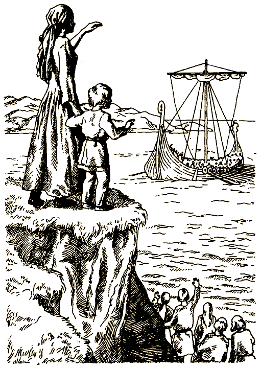

# 0

## Эдвард Паккард

# ВИКИНГИ-ЗАВОЕВАТЕЛИ

Не пытайся читать эту книгу по порядку от начала до конца! Тебя ждет множество разных приключений, если ты готов отправиться в путешествие с викингами по Скандинавским странам.

Во время чтения у тебя не раз появится возможность сделать выбор. Приняв решение, следуй указаниям внизу страницы, чтобы выяснить, что случится с тобой дальше.

Как раб викингов, ты будешь вынужден трудиться, не зная отдыха. Но ты поставил перед собой цель — сбежать и обрести свободу. Тщательно спланируй побег. На суше и на море тебя подстерегает много опасных неожиданностей. Если ты сумеешь избежать их, тебя ждет слава и почет. В приключениях тебе поможет список корабельных терминов, приведенный на следующей странице.

Счастливого пути!

### ОБ АВТОРЕ

Эдвард Паккард — выпускник Принстонского университета и Колумбийского юридического колледжа. Сочиняя увлекательные истории для своих детей: Каролины, Андреа и Уэллса, — он разработал особый тип занимательных книг, использованный потом в серии «Выбери себе приключение», — книгу-игру.

### О ХУДОЖНИКАХ

Комракова Екатерина окончила Московский академический художественный лицей при институте им. В. И. Сурикова. В настоящее время учится в Московском государственном художественном институте им. В. И. Сурикова в мастерской книжной графики. Сотрудничает с издательством «Московский учебник», участница молодежных выставок.

Белоусов Игорь — выпускник Московского академического художественного лицея при институте им. В. И. Сурикова, сейчас учится в Московском государственном художественном институте им В. И. Сурикова на факультете графики. Принимал участие в международных и студенческих выставках.

### КОРАБЕЛЬНЫЕ ТЕРМИНЫ

Викинги были опытными мореплавателями. Общаясь с ними, полезно знать кое-что о кораблях:

Борт — боковая стенка корабля или лодки.

Днище — нижняя поверхность судна.

Корма — задняя часть корабля или лодки.

Мачта — высокий столб для парусов на судне.

Наветренный — обращенный в ту сторону, откуда дует ветер.

Нок-рея — круглый брус, прикрепленный горизонтально за середину к мачте для крепления прямых парусов и управления ими.

Нос — передняя часть корабля или лодки.

Планшир — деревянное или металлическое ограждение вдоль бортов судна.

Подветренный — обращенный в ту сторону, откуда не дует ветер, укрытый от ветра.

Руль — плоская доска, выступающая в воду, с помощью которой управляют кораблем.

Румпель — рукоятка, с помощью которой рулевой поворачивает руль.

Такелаж — канаты и цепи для крепления мачты и управления парусами.

Форштевень — брус по контуру носового заострения судна; в нижней части соединен с килем.

#### [Начать приключение](#1)

# 1

Ты живешь в Норвегии в эпоху викингов, почти тысячу лет назад. Тебе живется несладко. Когда ты был совсем маленьким, тебя увез из родной деревни Калф Жестокий, свирепый вождь викингов. Ты стал рабом, и с тех пор на тебя взваливали самую трудную работу. С раннего утра до ночи тебе приходилось перетаскивать камни, собирать хворост, месить тесто, стричь овец, подметать полы, чистить горшки и выполнять множество других тяжелых и утомительных дел. Ты часто мечтал сбежать от бессердечного хозяина, но понимал — если тебя поймают, наказанием станет мучительная смерть. Поэтому ты не рисковал и держал при себе мечты о вольной жизни.

Однажды Калф приказал тебе и еще нескольким рабам собираться на охоту вместе с ним и его воинами. Услышав это распоряжение, ты холодеешь от страха, ведь для тебя и других рабов это вовсе не развлечение. Вам придется тащить тяжелую ношу и спать на жесткой земле, а из еды вам будут перепадать только объедки вечернего пиршества воинов у костра. Мало того, Калф известен суровым и вспыльчивым нравом. В прошлый раз на охоте он разгневался на раба и сбросил его со скалы.

За день до похода ты навещаешь другого раба, мудрого старца по имени Ингвар, который всегда относился к тебе как к родному внуку. Ты находишь Ингвара в его хижине, он сидит на скамье и плетет рыбачью сеть. Услышав твои шаги, Ингвар оглядывается.

— Калф берет меня с собой на охоту, — говоришь ты Ингвару. — Мы отправляемся завтра с восходом солнца. Я пришел попрощаться — на случай, если не вернусь.

— Когда ты вернешься, меня здесь уже не будет, — отвечает Ингвар. — Жить мне осталось недолго. Свои последние дни я хочу провести на свободе. Как только Калф отправится на охоту, я убегу из деревни туда, где меня никто не найдет.

— А что это за место, Ингвар?

— Эту тайну я не могу открыть даже тебе, — говорит он.

Мгновение ты медлишь, не зная, стоит ли признаваться доброму старику в том, что ты и сам мечтаешь о свободе.

— Я тоже хотел бы убежать отсюда, — наконец робко бормочешь ты. — Может быть, это к лучшему, что Калф решил взять меня на охоту. Наверное, у меня появится шанс вырваться на свободу.

Эта мысль осеняет тебя внезапно. Ты пугливо смотришь на Ингвара, размышляя, не сказал ли лишнего.

Ингвар придвигается поближе, и в его усталых голубых глазах мелькает одобрение.

— Ты смелый мальчик, — говорит он. — Если отвага станет твоим проводником в пути, боги помогут тебе. Пожалуй, я тоже тебе помогу. Калф едет охотиться на лося. Мне известно, по какой тропе он направится. В первую ночь отряд разобьет лагерь возле водопада. Когда все заснут, ты сможешь улизнуть. Шум падающей воды заглушит твои шаги. Иди по тропе вдоль ручья, начинающегося у подножия водопада. Эта тропа приведет тебя к рыбачьей деревне — там ты найдешь убежище.

— Как думаешь, что будет, если Калф поймает меня? — спрашиваешь ты, холодея при одной мысли об этом.

— Лучше пойти на риск, чем всю жизнь страдать в рабстве, — говорит Ингвар. — Жаль, что этот урок я усвоил слишком поздно. Смелее, малыш! Если побег удастся, тебя ждет щедрая награда.

Ты благодаришь Ингвара за помощь и прощаешься с ним.

На следующее утро на рассвете охотники отправляются в путь. Час за часом вы бредете по лесной тропе, нагруженные меховыми одеялами, копьями, мешками с вяленым мясом, флягами с водой.

С наступлением темноты Калф приказывает разбить лагерь у водопада, как и предсказывал Ингвар. В небе появляется луна. Ты решаешь сбежать, как только все заснут, но от усталости сам погружаешься в сон.

Через несколько часов ты просыпаешься, как от резкого толчка. Калф, его воины и остальные рабы безмятежно спят. Ты берешь суму со своими немногочисленными пожитками и припасами, на цыпочках удаляешься от лагеря и начинаешь искать тропу, о которой рассказал Ингвар.

Ты не успеваешь сделать и нескольких шагов, как луна скрывается за тучей. В темноте ты неосторожно наступаешь на сухую ветку, которая с громким треском ломается. С перепугу решив, что со стороны лагеря доносятся голоса, ты убегаешь в лес.

Спустя некоторое время ты останавливаешься и прислушиваешься. Вокруг все тихо. Тебе удалось улизнуть от Калфа, но в панике ты не замечал, куда бежишь, и безнадежно заблудился.

Пока ты размышляешь, как быть дальше, луна снова выходит из-за туч, и ты видишь справа нечто вроде большой поляны среди деревьев. Ты спешишь туда и через несколько минут выходишь из леса на каменистую равнину.

Тучи рассеиваются, но луна висит в небе так низко, что ты понимаешь: вскоре вокруг вновь станет темно. Ты решаешь, что до наступления дня идти дальше не стоит. Ты сгребаешь кучу еловой хвои, устраиваешься под прикрытием больших камней, укладываешься и почти мгновенно засыпаешь.

Проспав много часов подряд, ты вдруг пробуждаешься и садишься, растерянно моргая. Ладонью ты прикрываешь глаза от солнца, висящего над самым горизонтом. Воздух вокруг кристально чист, без малейших следов дыма или тумана. Ты видишь впереди холмистую местность, поросшую травой. Вдалеке пасутся северные олени.

Напившись из ближайшего родника, ты взбираешься на вершину самого высокого холма в окрестностях. Ты замечаешь вдали отряд охотников в простых одеждах из шкур. Они убили нескольких лосей и теперь грузят туши в грубые деревянные повозки. Ты понимаешь, что в одиночку тебе не выжить в этой глуши, поэтому спешишь к охотникам.

Лица охотников удивленно вытягиваются, когда ты объясняешь, что сбежал от Калфа Жестокого. Вожак охотников мрачно кивает.

— Калф нам не друг, — говорит он. — Пойдем с нами, только поживее!

Прежде чем ты успеваешь ответить, вожак начинает хриплым голосом отдавать приказы товарищам. Ты идешь следом за охотниками через холмистую равнину, помогая тащить повозку.

Охотники приводят тебя в крохотную деревушку — горстку хижин, выстроенных из прутьев, дерна и торфа. В деревне живет всего несколько десятков человек, одна из семей принимает тебя как родного. Жители деревни бедны, они заняты тяжелым трудом, и тебе поручают собирать топливо для костра, ягоды и травы, носить воду из ручья, поддерживать пламя в очаге, заниматься ремонтом хижин, точить ножи и другие орудия. Тебе живется нелегко, но ты радуешься, поскольку все жители деревни трудятся сообща, к тому же впервые после похищения у тебя появляется время для развлечений. По сравнению с большинством викингов люди, окружающие тебя, добры и приветливы.

Ты быстро привыкаешь к новому дому. Ты любишь семью, которая приняла тебя, и ладишь с деревенской молодежью. Ты не успеваешь опомниться, как дни становятся все короче, а солнце больше не поднимается высоко над холмами. Через несколько месяцев землю укроет толстый слой снега, а тьма будет сменяться светом всего на несколько часов в день.

Жители деревни готовятся к путешествию к месту зимовки — уединенной долине, расположенной у моря, где зимы не так суровы. Ты помогаешь своей семье в сборах.

Путешествие к месту зимовки проходит без приключений. Ты помогаешь остальным разбить лагерь в лощине, откуда открывается вид на фьорд. Но через несколько дней на деревню с воинственными криками налетает отряд викингов-завоевателей. Они берут в плен несколько человек, в том числе и тебя, и увозят вас к месту своей стоянки на вершине холма. Ты падаешь духом, понимая, что вновь стал рабом.

Лагерь викингов находится неподалеку от океана. Ты видишь, как его воды искрятся под полуденным солнцем. С другой стороны от лагеря видны высокие горы с ледниками в расщелинах и долинами близ вершин.

Викинги взяли тебя в плен не для себя. Они продают тебя и других пленников работорговцу из рыбачьей деревни. У тебя опять начинается новая жизнь — на этот раз в качестве помощника кораблестроителя на верфи в бухте возле одного из самых больших фьордов в Норвегии.

Хотя ты снова попал в рабство, тебе живется лучше, чем на службе у Калфа. Строительство кораблей и мореплавание — величайшие из достижений викингов. Тебе поручают работать под надзором лучшего корабельщика среди викингов, Сигурда Белого.

Ты усердно работаешь и за короткое время успеваешь многому научиться. Вскоре ты становишься таким опытным строителем кораблей, что за тобой начинают охотиться самые богатые и могущественные викинги из окрестных деревень.

Сигурд, который получил свое прозвище за белокурые, почти белые волосы, — строгий учитель, но в душе он добр. Однажды он подходит к тебе и говорит:

— Ты хорошо поработал и во многом помог мне. Ты заработал свободу и теперь можешь отправляться куда захочешь.

Весть о том, что тебя отпустили на свободу, быстро облетает деревни. Позднее в тот же день коренастый рыжебородый мужчина по имени Хорик приходит к Сигурду, о чем-то беседует с ним, а потом отводит тебя в сторонку.

— Сигурд утверждает, что за несколько месяцев ты успел многому научиться, — говорит Хорик. — Пойдем ко мне в деревню — она находится в ста милях к югу отсюда. Ты получишь лучший дом и будешь главным кораблестроителем моего клана.

Ты говоришь Хорику, что обдумаешь его предложение и вскоре сообщишь свое решение. Ты настолько ошеломлен неожиданной свободой, что никак не можешь прийти в себя и решить, как быть дальше.

Позднее вечером к тебе приходит другой человек, столь же богатый и влиятельный, как Хорик. Его зовут Эгил, ему принадлежит целый флот из двенадцати рыболовных судов в деревне, расположенной на расстоянии пятидесяти миль к югу отсюда.

— Ты много знаешь о судах, на которых плавают мои люди, — говорит Эгил. — До нас доходили слухи об изобилии рыбы близ одного из островов. Мы собираемся отправиться на поиски рыбных мест, и ты можешь присоединиться к нам, если захочешь. Тебе не придется грести — ты будешь только управлять парусом и следить, чтобы судно не сбилось с пути.

— Не знаю, что и сказать… — бормочешь ты, вспоминая о предложении Хорика.

— Мой юный друг, пойми — для нашего народа рыба дороже золота, — убеждает Эгил. — Если нам повезет, ты будешь щедро вознагражден.

Ты благодаришь Эгила за предложение и обещаешь на следующий день сообщить, согласен ли ты сопровождать его в плавании к островам, воды вокруг которых богаты рыбой.

Всю ночь ты ворочаешься без сна, не зная, как быть.

Присоединишься [к Эгилу](#103) или соглашаешься поработать кораблестроителем [у Хорика](#46)?

# 28

Ты решаешь высадиться на остров. Испуг Свейна передается и тебе: ты вовсе не хочешь попадать в мощное течение, не зная, куда оно вынесет тебя. Ты гребешь изо всех сил, пытаясь добраться до острова прежде, чем течение пронесет тебя мимо.

Через несколько минут тебе удается вырваться в спокойные воды. Набегающие на берег острова волны выносят за собой лодку. Вы со Свейном выпрыгиваете на землю и тащите суденышко по каменистому берегу.

Свейн оглядывает камни вдоль берега.

— Здесь много мидий, — говорит он тебе. — Они годятся в пищу.

Тем временем ты взбираешься на громадный валун. Со своего наблюдательного пункта ты видишь, что остров невелик — всего несколько десятков футов в ширину. Если не считать поросших редкой травой полян и нескольких приземистых кустиков, на острове одни только камни и песок.

Ты забираешься на самый высокий камень. Отсюда открывается вид во всех направлениях. Сначала ты смотришь на запад. Тебе кажется, что море кипит — но не от ветра или прилива, а от рыбы! Ты видишь, как сотни больших рыбин каждую минуту выпрыгивают из воды.

— Рыбные места! — кричишь ты, поворачиваясь к Свейну. — Они здесь, прямо возле острова!

Свейн карабкается по камням и наконец оказывается рядом с тобой. Приставив козырьком ладонь ко лбу, он смотрит на запад.

— Верно, — дрожащим от волнения голосом подтверждает он. — Всю жизнь я слышал рассказы о богатых рыбой водах. А теперь вижу их собственными глазами!

— Надеюсь, мы выживем и расскажем остальным, где находятся рыбные места, — говоришь ты.

Свейн кивает, и вы оба поворачиваетесь на восток, к материку.

Вы отчетливо видите прибрежные горы со сверкающими на солнце снеговыми шапками. Побережье находится на расстоянии всего десяти-пятнадцати миль от острова.

Ты поворачиваешься на север и пытаешься представить себе, куда могло затянуть вас течение. Судя по бурунам на поверхности моря, течение поворачивает влево и образует гигантское кольцо.

— Слушай! — восклицает Свейн.

Издалека доносится невнятный рев.

— Что это? — спрашиваешь ты.

— Водоворот, — отвечает Свейн. — Любой корабль, попавший в него, обречен на гибель.

— Значит, попади мы туда на своей лодке, у нас не оказалось бы ни единого шанса на спасение, — заключаешь ты, радуясь, что сделал верный выбор. — Нам повезло, что мы решили пристать к острову. Но как же отсюда выбраться?

— Плавание по этим водам не всегда бывает опасным, — объясняет Свейн. — Когда начинается отлив, водоворот пропадает часа на три. Надо отплыть от берега как можно быстрее, чтобы успеть выбраться в безопасные воды прежде, чем вновь образуется водоворот.

Ты возвращаешься следом за Свейном на берег. Вдвоем вы собираете мидии и едите их сырыми. Свейн находит лужицу пресной дождевой воды. Насытившись и утолив жажду, вы засыпаете на песчаном пятачке между двумя валунами.

Тебя будит Свейн. На севере небо еще светлое, но на юге, низко над горизонтом, видна полная луна.

— Начинается отлив, — говорит он. — Надо спешить.

Ты помогаешь ему столкнуть лодку в воду и отплыть от берега. Ты гребешь, а Свейн сидит на носу.

Несмотря на то, что течение движется медленнее, чем раньше, вскоре оно проносит лодку мимо северной оконечности острова. Теперь поверхность воды вокруг вас выглядит ровной, лодка быстро скользит по ней. Гигантский водоворот, который ты видел с каменистого островка, исчез. Ты даже не в состоянии определить, в каком месте увидел его, но знаешь, что там, на дне, покоятся обломки бесчисленных кораблей и лодок.

Ты гребешь из последних сил, стремясь проплыть мимо водоворота прежде, чем он образуется вновь. Примерно через милю тебя сменяет Свейн, а ты растягиваешься на дне лодки и закрываешь глаза. Ты хочешь набраться сил за время краткого отдыха.

От усталости ты засыпаешь. Тебя будит порывистый ветер и дождь. Свейн по-прежнему гребет, стараясь направить лодку по ветру. Начинается короткая летняя ночь. Небо становится черным как смоль, ветер свирепеет, дождевые капли покалывают твое лицо, точно иглы.

Лодка подскакивает на волнах и качается из стороны в сторону. Волны плещут через борта.

— Теперь твоя очередь! — кричит Свейн, перекрывая ветер. — А я буду вычерпывать воду.

Ты хватаешься за весла и начинаешь грести, хотя и не видишь, куда плывешь. Ты размышляешь, в каком месте образуется водоворот. Что, если к началу прилива ты окажешься прямо в середине воронки?

— Держи курс прямо по ветру, — кричит Свейн, — иначе волны перевернут лодку.

Через борт перехлестывает огромная волна. Свейн быстро вычерпывает воду. Ты налегаешь на весла, стараясь направить лодку по ветру. Ты забываешь о водовороте: сейчас главное — выжить!

Проходит час, а может, и два.

— Я совсем выбился из сил, — говоришь ты Свейну.

— Сейчас пересаживаться слишком опасно, — кричит в ответ Свейн. — Продолжай грести, не останавливайся!

Ревет ветер. Дождь льет сплошной стеной. Волна подхватывает одно весло, чуть не вырвав его из твоих пальцев. У тебя ноют руки, ладони покрылись волдырями, ты весь дрожишь от холода и усталости.

И все-таки продолжаешь грести.

Небо на северо-востоке начинает светлеть, а затем, словно по мановению волшебной палочки, ветер утихает, дождь прекращается, и море успокаивается. Шторм прошел. Ты испускаешь вздох облегчения.

Вы со Свейном оглядываетесь и в сером утреннем свете замечаете остров, размерами превосходящий каменистый островок, на который вы высаживались прежде.

— Давай пристанем здесь, — устало предлагает Свейн.

Ты уже повернул лодку к берегу и теперь работаешь веслами, преодолевая боль и усталость. Из последних сил вы вытаскиваете лодку на берег, за черту прибоя. Покончив с этим делом, вы оба в изнеможении падаете на песок.

Около полудня ты просыпаешься и будишь Свейна. Вдвоем вы осматриваете остров. Ты взбираешься на скалистый хребет. На полпути к вершине тебе попадается вход в пещеру. Почему-то тебя тянет туда. Ты подходишь ближе и заглядываешь внутрь.

Свейн продолжает взбираться на скалы и вскоре достигает вершины.

— Поднимайся сюда! — зовет он тебя. — На противоположном берегу острова, в бухте, видна рыбачья лодка. Если поспешим, то успеем добраться до бухты прежде, чем она уплывет. Можно считать, мы спасены!

Ты делаешь несколько шагов к нему, но затем вновь оборачиваешься и заглядываешь в пещеру.

[Просишь Свейна](#54) подождать, пока ты осмотришь пещеру или [следуешь за Свейном](#44)?

# 42

Ты решаешь повернуть налево и направиться на восток. Вы со Свейном гребете по очереди. Туман слегка рассеялся, но видимость не превышает половины мили. Сквозь тучи едва проглядывает солнце, однако его света достаточно, чтобы ты не сбился с курса.

Несколько часов спустя, когда вновь приходит очередь Свейна грести, поднимается свежий ветер, который быстро разгоняет туман. Внезапно перед тобой появляется величественный берег Норвегии. До склона горы, спускающегося прямо в море, не больше мили! Тонкая струйка дыма поднимается из-за холма у подножия горы — вероятно, там кто-то развел костер.

Ты испускаешь радостный крик, но с лица Свейна не исчезает тревога. Он перестает грести и внимательно вглядывается в сторону земли.

— Однажды я уже проплывал здесь вместе с отцом, — вспоминает он. — Справа от горы есть тихий залив. Но эти земли принадлежат Торфинну Грозному — самому свирепому из викингов. Он отнимет у нас лодку и убьет нас, даже глазом не моргнув.

Ветер тем временем усиливается. Поднимаются волны. Ты вздрагиваешь, когда одна из них ударяет в борт лодки.

— Давай поплывем к берегу, — предлагаешь ты.

— Говорю тебе, высаживаться здесь на берег не стоит, — убеждает Свейн. — Ты не представляешь себе, как жесток Торфинн.

Он берет черпак и начинает вычерпывать воду из лодки. Волны с каждой минутой поднимаются все выше.

— Начинается шторм, — возражаешь ты. — Нам не остается ничего другого, кроме как плыть к берегу.

— Любой выход будет лучше этого.

— Если мы не пристанем к берегу, то окажемся на дне моря, — заявляешь ты. — Поэтому давай поскорее доберемся до суши.

Спор продолжается еще несколько минут. Наконец Свейн говорит:

— Эта лодка принадлежит моему отцу, значит, капитан здесь я. А я не хочу приставать к берегу.

Свейн продолжает настаивать на своем. Он прав, лодка действительно принадлежит его отцу. Ты понимаешь, что на этот раз у тебя нет выбора.

— Куда же мы поплывем? — спрашиваешь ты.

— Вдоль берега, туда, где живет наш народ, — твердо заявляет Свейн.

— Он налегает на весла и гребет изо всех сил. Некоторое время он успешно борется с волнами, но вскоре прибой и ветер начинают уносить лодку все дальше от берега.

Тем временем шторм усиливается, и вскоре волны начинают хлестать через борта лодки. Ты лихорадочно вычерпываешь воду, но она прибывает быстрее, чем ты успеваешь выливать ее за борт. Вскоре лодка наполняется водой. Вам со Свейном остается лишь цепляться за обломки, пока ледяная вода не отнимает у вас последнее тепло.

#### КОНЕЦ

# 44

Ты поспешно догоняешь Свейна и следуешь за ним вниз по склону холма, к бухте. Несколько мужчин сталкивают с берега в воду лодку, готовясь вернуться к стоящему на якоре большому кораблю.

Незнакомцы в удивлении застывают, услышав крик Свейна. Они бросают лодку и бегут навстречу вам.

— Я тебя знаю! — говорит один из них Свейну. — Ты — сын Эгила. Он думает, что ты погиб в море.

Оказывается, эти люди — рыбаки из деревни Свейна. Они берут тебя и Свейна на корабль, а на обратном пути прихватывают лодку, на которой вы приплыли на остров. Погрузив лодку на корабль, они поднимают парус и плывут к рыбачьей деревне, которая стала твоим домом.

Едва корабль входит в залив у деревни, капитан поднимает желто-голубой флаг, означающий хорошие вести. Увидев флаг, жители деревни бегут к берегу. Среди них Эгил и его жена Ительга, мать Свейна.

Пока корабль причаливает к берегу, жители деревни издают приветственные крики.

— А мы боялись, что вы попали к морским богам, — говорит Эгил тебе и Свейну после того, как вы высаживаетесь на берег.

— Морские боги были добры к нам, — отвечает Свейн. — Они спасли нам жизнь. Мы разыскали место, где полным-полно рыбы, прошли мимо гигантского водоворота и остались невредимыми!

Эгил изумляется, слушая ваши рассказы. Он подробно расспрашивает вас о недавних приключениях, а затем кладет одну ладонь на плечо Свейна, а другую — на твое плечо.

— За несколько дней вам удалось узнать больше, чем другим людям — за всю жизнь. Вы оба — истинные и благородные викинги.

#### КОНЕЦ

# 46

Ты поселяешься в деревне Готстад. Хорик учит тебя всем премудростям искусства судостроения. Ты узнаешь, как с помощью простых орудий рубить дерево, как пилить и шлифовать доски, пока они не станут прямыми и гладкими, как скреплять доски между собой так, чтобы они перекрывали друг друга, как выбирать в лесу прямые, крепкие, не изъеденные короедом и гнилью дубы, из которых получатся хорошие мачты.

Ты узнаешь, как с помощью скоб установить мачту так, чтобы она прочно держалась на месте, как изготавливать такелаж, как делать блоки и вороты, чтобы поднимать, опускать и поворачивать парус на нок-рее.

Ты учишься конопатить стыки в днище так, чтобы судно не давало течь; узнаешь, какую форму надо придать рулю, чтобы он не мешал ходу судна, но был достаточно крепким и выдерживал натиск волн.

Спустя некоторое время ты выходишь в море на судне, чтобы проверить его. Ты узнаешь, как надо придавать судам обтекаемую форму, чтобы они рассекали воду, как располагать по бортам весла и как устанавливать парус.

Проработав у Хорика два года, ты становишься опытным кораблестроителем. Построенные тобой корабли и лодки высоко ценят все вожди Скандинавии.

Однажды Хорик отводит тебя в сторону.

— Мои люди вернулись с охоты и принесли плохие вести, — говорит он. — Торфинн Грозный, самый свирепый из викингов-завоевателей, завтра прибудет в Готстад, чтобы потребовать дань.

Услышав об этом, ты вздрагиваешь. Тебе известно, что Торфинн жестокостью превосходит твоего прежнего хозяина, Калфа. Его воины забирают в деревнях все, что им понравится, и поступают, как им заблагорассудится.

— Ручаюсь, он отнимет у нас новый корабль! — гневно выпаливаешь ты.

Хорик кивает и кладет руку на твое плечо.

— Он явится не только за нашим кораблем — он придет за тобой.

— За мной?

— Да. Тебя считают лучшим кораблестроителем в округе. Торфинн хочет, чтобы ты работал на него, как раб. Он прикажет тебе построить превосходный корабль, чтобы он сумел покорить не только всю Норвегию, но и новые земли, лежащие к западу отсюда.

— Довольно с меня рабства! Лучше убежать и жить в тундре с северным народом, чем служить Торфинну, — говоришь ты.

— Торфинн достанет тебя даже из-под земли, — говорит Хорик. — Его воины сейчас обыскивают деревню. Он убивает каждого, кто осмелится пробудить в нем гнев. Лучше бы ты остался при нем и попытался заслужить его благосклонность. Может, когда-нибудь тебе представится шанс сбежать, но сейчас лучше не пробуй. Время льда и тьмы не за горами, а голодных волков в этом году развелось видимо-невидимо.

Хорик прав — попытка бегства была бы рискованной затеей. Но ты помнишь слова старого друга Ингвара: «Лучше пойти на риск, чем всю жизнь страдать в рабстве».

Решаешь [остаться](#62) или пытаешься [сбежать](#51) до появления Торфинна?

# 51

Ингвар был прав. Надо бежать от Торфинна, чего бы это ни стоило. Ты гордо вскидываешь голову, уставясь на Хорика в упор, и заявляешь:

— Я никогда не стану рабом тирана. Лучше умереть с голоду в лесу!

Но в глубине души ты надеешься, что до голодной смерти дело не дойдет.

Ты решаешь обсудить свой план с друзьями из деревни и расспросить, знают ли они, где можно спрятаться от Торфинна и его воинов. День сегодня выдался холодный, промозглый. Черные тучи над головой усиливают твою тревогу. Первым делом ты навещаешь дядю Хорика, Ауна, которого считают самым умным в деревне.

— Если ты хочешь сбежать от Торфинна, тебе предстоит долгий путь, — говорит Аун. — За горами есть страна рыжебородых людей. Там воины Торфинна не станут тебя искать. Но и тебе туда ни за что не добраться.

Он указывает сквозь открытую дверь своей хижины на кружащиеся в воздухе хлопья первого за эту зиму снега. 

Если снег пошел даже здесь, в тихой долине, значит, в горах бушуют свирепые ветры, а тропы завалены глубокими сугробами. Однако ты не отказываешься от своего замысла.

— Пожалуй, я справлюсь, — говоришь ты Ауну. — Я молод и силен. У меня есть сапоги из оленьих шкур и меха рыси и медвежья шкура, теплая и толстая. Если понадобится, я смогу переночевать в сугробе, завернувшись в шкуру.

— Да, ты прав, — соглашается Аун. — Но боюсь, волки, вышедшие на охоту, помешают тебе выспаться.

Про волков ты совсем забыл. Тебе, как и всем викингам, с детства известно, что в горах властвуют волки, а не люди.

Твоя решимость ослабевает. Ты знаешь, что больше не вынесешь ни дня рабской жизни, но, похоже, у тебя есть только два выхода — рабство или смерть. Однако, несмотря на обескураживающие слова Ауна, в глубине души ты уверен, что сумеешь добраться до страны рыжебородых людей. В этом случае тебе не грозит опасность вновь стать рабом.

Ты благодаришь Ауна за совет и направляешься к выходу из хижины, но тут жена Ауна, Астрид, останавливает тебя.

— Подожди минуту, — говорит она. — Есть одно место, где ты сможешь спрятаться. Отправившись туда, ты познаешь тайны богов.

— Куда? — с жаром спрашиваешь ты.

Астрид обменивается взглядом с Ауном. Тот кивает.

— К северу от деревни есть тропа, ведущая к гранитной скале, — объясняет Астрид. — Возле самой вершины, в пещере, живет один старик — святой человек, отшельник. Если ты понравишься ему, он защитит тебя и окажет помощь.

— Но чтобы взобраться на гранитную скалу, нужны смелость и сила, — предупреждает Аун, — а еще — мудрость.

Взобраться [на гранитную скалу](#57) или перейти через горы и отыскать [страну рыжебородых людей](#64)?

# 54

— Подожди! — окликаешь ты Свейна. — Давай сначала заглянем сюда.

Ты входишь в пещеру и некоторое время ждешь, пока глаза привыкнут к полутьме. Тебе не хочется заставлять Свейна слишком долго ждать, поэтому ты делаешь несколько шагов вперед.

Ты протягиваешь руку к стене, придерживаясь за нее, но внезапно оступаешься. Земля уходит из-под ног, и ты все быстрее катишься вниз. Тебя обступает темнота.

Ты лежишь неподвижно. Спустя несколько минут что-то обрушивается на тебя. Ты с трудом садишься и отталкиваешь то, что упало на тебя сверху. Раздается стон, и ты понимаешь, что это Свейн — должно быть, он последовал за тобой в пещеру и тоже упал!

Твой друг вновь стонет. Из раны на его ноге течет кровь, у тебя гудит в голове, но, к счастью, у вас обоих целы все кости. Ты поднимаешь голову и видишь на расстоянии десяти футов над собой вход в пещеру. Подъем ко входу очень крут — вам его ни за что не одолеть!

Ты помогаешь Свейну подняться и оглядываешься, постепенно привыкая к полутьме. Вы оказались в пещере шириной футов пятьдесят. Вода, скопившаяся на дне пещеры, образует своего рода пруд, а у берега этого пруда стоит судно, красивее которого тебе еще не доводилось видеть. Мачта, нок-рея и парус сложены на палубе. Корабль нагружен сундуками и бочонками, словно ему предстоит дальнее плавание. Но самое странное — посреди палубы стоит миниатюрный дом.

Вместе со Свейном ты перелезаешь через планшир и оказываешься на палубе корабля. Подойдя к крохотному дому, ты видишь, что в нем нет двери. Ты заглядываешь внутрь, и тебя пробирает мороз. Внутри на полу лежит человеческий скелет. Вокруг костей разбросаны золотые монеты.

Свейн ахает и вцепляется в твое плечо.

— Это погребальная лодка, — шепчет он. — Должно быть, это скелет могущественного вождя.

— Как же судно попало сюда? — спрашиваешь ты.

Свейн указывает в дальний конец пещеры.

— Смотри, там есть туннель. Наверное, подземная река соединяет этот пруд с морем.

Вы выпрыгиваете за борт корабля и идете вдоль берега пруда к туннелю. Свейн шагает в воду. Она доходит ему только до коленей.

— Туннель достаточно велик для корабля, но подземная река неглубока, — говоришь ты.

— Должно быть, во время прилива вода поднимается, — размышляет Свейн. — А сейчас отлив.

Ты радостно подхватываешь:

— Вот и выход! Мы сможем сами вывести судно из туннеля.

— Помощи ждать неоткуда, — говорит Свейн. — Это наш единственный путь к спасению.

Вы снова поднимаетесь на борт пустого судна, забираетесь через окно в дом и решаете перенести скелет на берег пруда. Кости высохли от времени и стали ломкими, некоторые рассыпаются в пыль от одного прикосновения. Вы боязливо собираете обломки и складываете их на сухом берегу, а затем вновь садитесь на корабль и ждете, когда начнется прилив.

— Как думаешь, нам удастся выбраться отсюда? — спрашиваешь ты.

Свейн бросает взгляд в сторону скелета, лежащего на берегу.

— Если дух этого вождя будет благосклонен к нам, — говорит он, — мы вернемся в Норвегию, нас ждут слава, почет и богатство. А если дух разгневался, мы погибнем.

Поднимающаяся вода плещется о борта лодки. Через несколько часов по туннелю удастся проплыть, а до тех пор вам остается лишь ждать — и надеяться.

#### КОНЕЦ

# 57

Ты благодаришь Ауна и Астрид за совет и отправляешься в путь по тропе, ведущей к гранитной скале.

Вскоре снегопад прекращается. Снег успел слегка припорошить землю, но заметно похолодало. Ты кутаешься в медвежью шкуру. Пройдя несколько миль, ты сворачиваешь с тропы и взбираешься на высокий каменистый хребет, на котором не растет ни единого кустика. Хребет тянется на несколько миль, круто поднимаясь к вершине самой высокой в округе скалы.

Солнце село. Сумерки будут продолжаться всего несколько часов, но небо уже затянули тучи. Тебе удается пройти всего милю, прежде чем темнота скрывает из виду путь между камней.

Ты находишь убежище в тесной пещере под скальным навесом, подкатываешь ко входу в пещеру большой камень и ложишься спать, не выпуская из рук копье. Если в отверстие протиснется волк, ты будешь готов к схватке.

К счастью, волки так и не появились. Ты выходишь в путь с первыми лучами солнца, решив до темноты добраться до вершины гранитной скалы.

Ты бредешь, преодолевая милю за милей. Воздух чист и прохладен, ветер почти утих. Ты питаешься вяленой олениной, которую захватил с собой, и ягодами, найденными в лесу, и утоляешь жажду водой из родников.

Наконец ты достигаешь подножия гранитной скалы. Поначалу она выглядит неприступной, но вскоре ты обнаруживаешь, что на нее можно взобраться, цепляясь за выступы и ставя ноги во впадины между камнями.

Проходят часы, ты мало-помалу карабкаешься все выше. Ты знаешь, что должен до наступления темноты достичь вершины, поскольку на почти отвесном склоне переночевать негде. С другой стороны, торопиться опасно. Любое неверное движение означает смерть. Ты продолжаешь взбираться на скалу, не осмеливаясь взглянуть вниз.

К тому времени, как ты хватаешься за край ровной площадки и выбираешься на нее, солнце уходит за горизонт. Ты в изнеможении падаешь на жесткую северную траву, вытягиваешь ноющие руки и ноги, но вскоре встаешь и начинаешь осматриваться.

Снизу вершина гранитной скалы выглядит острой, как игла, но на самом деле наверху есть небольшая площадка, о которой упоминала Астрид. В центре этой площадки поднимается на сотню футов похожая на шпиль гладкая отвесная скала, слишком крутая, чтобы взобраться на нее.

На землю спускается ночь. Изнемогая от усталости, ты несколько раз обходишь вокруг скалы, разыскивая пещеру отшельника. Тебе попадаются птичьи гнезда и ягоды, растущие здесь в изобилии. Мимо пробегают кролики. Как они сюда попали, для тебя остается загадкой, но теперь тебе понятно, как отшельник умудряется выжить на горе.

Наконец ты находишь вход в пещеру на северном склоне скалы. Войдя в пещеру, ты осматриваешься. Ничто вокруг не указывает, что пещера обитаема.

Обескураженный, ты покидаешь сырую пещеру и быстро осматриваешь остальную территорию. Ты находишь ручей с чистой водой. У тебя еще осталось немного еды, но похоже, весь этот путь ты проделал зря.

Налетает промозглый ветер. Утомленный и замерзший, ты съеживаешься под медвежьей шкурой и засыпаешь.

Тебе снится, что ты встретил святого, который уводит тебя в царство Одина, верховного бога викингов. Владения Одина напоминают Норвегию своими горами, поросшими соснами, сияющими ледниками, стремительными реками и искрящимися озерами.

Ты видишь, как могущественный Тор, сын Одина, бросает из своего дворца молнию. Молния рассекает небо и с силой ударяет в тебя, но ты не погибаешь — вместо этого ты вскакиваешь! Все небо озаряют мечущиеся, пляшущие огни — голубые, розовые, оранжевые, — от них небо словно оживает.

Внезапно ты понимаешь, что это не сон. Ты уже проснулся. Но небо продолжает полыхать призрачным огнем.

Если это не сон, тогда ты, наверное, умер, поскольку еще никогда не видывал такого великолепия. Многоцветные сполохи так прекрасны, что ты не в силах отвести от них взгляд. Должно быть, ты и вправду оказался во владениях Одина. Ты среди богов!

Ты встаешь и делаешь шаг вперед, затем еще один. Впереди виднеется вход в пещеру, таинственный и манящий в свете разноцветных вспышек. Только теперь ты понимаешь, что не умер и не перенесся в царство Одина, а по-прежнему находишься на вершине гранитной скалы. Изумительное зрелище, свидетелем которому ты оказался, — не что иное, как северное сияние. Тебе и прежде доводилось его видеть, но никогда еще оно не было таким потрясающим, как здесь. Сияние величественно, как сама земля богов.

Еще одна яркая вспышка озаряет пещеру, и ты вдруг обнаруживаешь, что смотришь прямо в голубые глаза на морщинистом лице старого отшельника. Ты мгновенно узнаешь его: это же Ингвар, мудрый старик, с которым ты подружился в деревне Калфа Жестокого. Ты нашел его тайное убежище!

— Ингвар! А я думал, что оказался во владениях Одина! — восклицаешь ты.

— Нет, ты не в стране богов, но совсем рядом с ней, — говорит Ингвар. — Вот почему я пришел сюда, чтобы дождаться смерти.

— Здесь так красиво! Но как ты добываешь себе еду?

— На горе есть источник богов, — объясняет Ингвар. — Из него льется не вода, а нектар, утоляющий голод лучше всякой пищи.

— Здесь очень красиво, — задумчиво повторяешь ты, вновь оглядывая горную долину. — Но я бы не хотел остаться здесь навсегда и жить, как ты.

— И не надо, — соглашается Ингвар. — Я пришел сюда, чтобы дождаться смерти, а ты еще молод и полон сил. Тебе предстоит много сделать в мире. — Он сует руку за пазуху и вытаскивает драгоценный камень рубинового цвета, прикрепленный к тонкой золотой цепочке. Камень Ингвар вручает тебе.

— Я не возьму его, — возражаешь ты. — Должно быть, он очень дорог тебе.

— Возьми, — настаивает Ингвар. — На этой горе много таких камней. Только никому не рассказывай, откуда он у тебя.

— Спасибо тебе, Ингвар, — говоришь ты, принимая подарок и вешая его на шею. — Я никогда не расстанусь с ним и всегда буду помнить тебя.

Ингвар кивает.

— Переночуй здесь. Уйти ты сможешь и завтра.

— Но куда же мне идти?

— Куда подскажет сердце, — отвечает Ингвар. — Этот амулет будет приносить тебе удачу до конца жизни.

В эту ночь ты спишь крепко и сладко. Утром Ингвар поит тебя бодрящим нектаром, а затем провожает в дорогу. Ты чувствуешь небывалый прилив сил. С этой минуты ты понимаешь, что Ингвар действительно оказался у границы владений Одина, что боги проявили благосклонность к тебе и что теперь тебе обеспечены крепкое здоровье и удача во всех делах.

#### КОНЕЦ

# 61

— Давай поплывем по течению, — предлагаешь ты Свейну. Ты перестаешь грести, лишь слегка шевеля веслами, чтобы лодка двигалась к берегу.

Течение тащит лодку мимо северной оконечности острова и несет прочь, прямо к материку. Ты приходишь в радостное возбуждение, видя, как быстро вы плывете. Через пятнадцать минут берег становится гораздо ближе.

— Приготовься грести изо всех сил, — говорит Свейн. — Течение вскоре должно повернуть в другую сторону.

Он прав: через пару миль течение начинает поворачивать вас влево. Тебе приходится налечь на весла, чтобы не удалиться от берега.

Тем временем вода вокруг лодки начинает бурлить. Несмотря на то что ветра почти нет, волны сталкиваются друг с другом, взметая в воздух тучи брызг. Вода хлещет через борт лодки. Свейн держит наготове деревянный черпак, готовясь вычерпывать воду, если понадобится.

Теперь течение влечет вас вперед еще быстрее, но, несмотря на твои усилия, лодка все сильнее отклоняется влево. Материк еще близок, но тебе становится ясно, что пристать к берегу там, где вы наметили, не удастся. Придется проплыть дальше на север.

— Прислушайся! — вдруг восклицает Свейн. Повернувшись к нему, ты застываешь, заметив выражение ужаса на его лице.

На минуту ты перестаешь грести и слышишь откуда-то слева низкий звук, похожий на сдавленный рев. Течение несет вас в ту сторону, откуда доносится звук. Ты гребешь изо всех сил, борясь с течением, но оно настолько сильное, что все твои усилия напрасны.

Волны немного утихают, однако та часть моря, по которой движется ваша лодка, кажется наклонной — похоже, вода здесь движется кругами по внутренней поверхности гигантской воронки.

Свейн осторожно приподнимается в лодке и смотрит вперед.

— Что там? — встревоженно спрашиваешь ты.

Свейн садится, белый как полотно.

— О таком я тоже слышал, — бормочет он, — но никогда не думал, что увижу собственными глазами…

— Что увидишь?

— Водоворот, самый большой водоворот в мире! Он образуется дважды в день, когда прилив достигает наибольшей силы.

Ты приподнимаешься, вглядываясь в даль. Несмотря на легкий крен, лодка движется устойчиво, как по ровному желобу.

Рев усиливается. Ты быстро садишься. Лодка еще быстрее начинает двигаться кругами, приближаясь к центру водоворота.

Теперь весла бесполезны. Вы со Свейном хватаетесь за борта лодки, уставившись на ужасную черную дыру посреди моря. Лодку несет прямо к этой дыре.

— Свейн, неужели нам не на что надеяться?

Ты уверен, что он скажет «да», но молодой викинг отвечает:

— В легенде об этом водовороте говорится, что моряки, попавшие в него, не тонут, а попадают в подземное королевство, где их ждет счастливая и достойная жизнь.

Бурные воды стремительно несут вас прямо к черной воронке. Ты зажмуриваешься, надеясь, что легенда говорит правду.

#### КОНЕЦ

# 62

Ты решаешь остаться с Хориком. Если тебе суждено стать рабом Торфинна Грозного, ты найдешь способ сбежать. Но попытка перейти через заваленные снегом, кишащие волками горы — безрассудство.

Вскоре до вас доносится шум: воины Торфинна вошли в деревню. Ты стоишь рядом с Хориком у входа в хижину, поджидая их.

— Лучше не сопротивляться, — говорит Хорик. — Обычно Торфинн без колебаний убивает тех, кто не подчиняется ему. Если нам повезет, он пройдет по деревне, заберет дань и уедет.

Не прошло и часа, как воины Торфинна появились у твоей хижины. На них одежда из медвежьих шкур, каждый держит в одной руке утыканную шипами палицу, а в другой — меч. Позади идет отряд воинов, вооруженных копьями, топорами и камнями.

Торфинн едет сквозь расступающуюся толпу на гнедом жеребце. Вождь викингов — широкоплечий мужчина с шапкой спутанных и растрепанных волос соломенного цвета. Он резко осаживает жеребца, спешивается и осматривается, прищурив холодные голубые глаза. Наконец он подзывает к себе Хорика.

Ты опасался резни, но Хорик оказался прав. Торфинн заявляет, что пришел только за данью — десятком больших медвежьих шкур, лучшими орудиями, тремя умелыми ремесленниками — и за тобой! Он подходит ближе и кладет руку на твое плечо.

— Я слышал, ты умеешь строить корабли, — говорит он. — Отныне ты — мой слуга. Будешь хорошо работать — получишь награду.

Торфинн собирает своих людей и велит погрузить добычу в повозки. Двое воинов тащат тебя прочь. Ты даже не успеваешь попрощаться с Хориком.

После пяти дней пути вы добираетесь до деревни Торфинна, которая расположена у берега фьорда дальше по побережью Норвегии. Жители деревни выглядят печальными и изможденными. Вскоре ты узнаешь, что Торфинн настоящий тиран. При малейшем неповиновении его подданных ждет наказание — десять ударов плетью.

Торфинн отдает тебе крохотную хижину размером не больше собачьей конуры. Во время бурь ветер задувает в трещины в стенах хижины, дождь льет сквозь дыры в крыше. Воины забирают себе лучшую еду. Тебе приходится питаться вяленой медвежатиной и рыбьими потрохами.

Торфинну принадлежит отличная верфь со всевозможными орудиями, привезенными из соседних деревень. Ты утешаешься мыслью о том, что по крайней мере тебя не лишили любимой работы.

Проходит несколько месяцев. Весной и летом ты целыми днями строишь лодки и корабли. Зимой, во время коротких дней и жестоких ветров, ты коротаешь дни, греясь в хижине, или охотишься на кроликов и птиц.

Когда Торфинн и его приближенные воины отправляются грабить соседние деревни, для тебя наступает спокойное время. Каждый раз ты мечтаешь о том, что они не вернутся, но они всегда возвращаются с добычей и рабами.

Иногда ты заводишь с другими рабами разговоры о побеге. Но воины Торфинна неотступно следят за вами, не давая ни малейшего шанса осуществить побег.

Однажды Торфинн приказывает тебе и другим ремесленникам построить самый крепкий и быстроходный корабль в Норвегии. Он должен достигать в длину восьмидесяти футов, нести восемнадцать гребцов и огромный парус. На борту должно быть две запасные шлюпки. Под настилом палубы должно хватать места для запасов пищи, оружия и награбленной добычи. В каюте разместятся сам Торфинн и его приближенные.

Чтобы построить такой корабль, понадобилось два года. В тот день, когда вы спускаете корабль на воду, Торфинн расплывается в улыбке. Корабль, получивший имя «Оспрей», — действительно красивое судно с отшлифованной обшивкой и форштевнем в виде резной головы дракона.

После спуска «Оспрея» на воду ты забираешься в трюм и проверяешь, не просочилась ли вода сквозь швы в днище. Дождавшись, когда ты поднимешься на палубу, Торфинн сам обращается к тебе.

— Есть течи? — спрашивает он.

Ты качаешь головой.

— В трюме совершенно сухо.

Торфинн довольно улыбается.

— Я слышал легенды о богатой стране, которая находится к западу отсюда и называется Исландией, — говорит Торфинн. — Там много пастбищ с сочной травой, а рыбы такое количество, что она сама прыгает в лодку. А еще дальше, за Исландией, есть другая, безымянная страна, которая больше и богаче, чем все остальные, вместе взятые.

По-видимому, на миг Торфинн забывает о твоем присутствии. Внезапно он поворачивается и смотрит на тебя в упор.

— А еще я слышал, — продолжает он, — что у берегов Исландии дуют свирепые ветры и в море плавают горы из льда. Я хочу доплыть на «Оспрее» до Исландии, но еще больше мечтаю попасть в страну, которая находится за ней. Ты знаешь этот корабль лучше, чем кто-либо другой. Как думаешь, стоит ли рискнуть и попытаться переплыть на нем великий океан, или же лучше будет добраться только до Исландии?

Ты уверен, что «Оспрей» крепок и надежен, но кто знает, что может случиться в шторм в незнакомых водах? Однако мысль о плавании через океан привлекает тебя. Возможно, в другой стране тебе удастся сбежать от Торфинна и начать новую жизнь.

Советуешь Торфинну [переплыть океан](#80) или отправиться [в Исландию](#69)?

# 64

Ты решаешь, что у тебя больше шансов добраться до страны рыжебородых людей, чем до вершины гранитной скалы. Ты укладываешь съестные припасы в сумку из козьей шкуры, набрасываешь медвежью шкуру на плечи, берешь копье и направляешься в сторону гор.

Два дня и две ночи ты шагаешь по каменистым горным хребтам и дремучим лесам, переходишь вброд незамерзающие ручьи и взбираешься на вершины холмов.

Первую ночь ты проводишь в дупле огромного дерева, вторую — в тесной пещере. Каждую ночь ты слышишь неподалеку вой волков и хватаешься за копье. Но волки еще ни разу не подходили слишком близко.

Утром на третий день ты достигаешь подножий поросших соснами гор. Здесь земля укрыта слоем снега толщиной не более дюйма, но ты знаешь, что на перевалах сугробы будут гораздо больше. На горизонте сгущаются серые грозные тучи — похоже, ближе к вечеру вновь начнется снегопад. Перейти через горы в такую погоду трудно, почти невозможно. Но, проделав такой длинный путь, обидно поворачивать обратно.

Оглядевшись, ты замечаешь оленью тропу, ведущую вверх по склону горы. Тебе повезло: если верить следам, здесь прошло несколько оленей, утоптавших снег. Ты поднимаешься вверх по тропе к перевалу между двумя вершинами.

Ты упорно шагаешь вперед по утоптанной оленями тропе. Высокие сосны защищают тебя от ветра, в воздухе чувствуется запах смолы. К полудню ты добираешься до перевала. По обе стороны от тебя здесь возвышаются сугробы высотой не меньше двух футов, но идти по примятому снегу тропы довольно легко.

Вскоре ты слышишь цокот копыт и сворачиваешь с тропы в глубокий снег. Вдалеке появляется стадо оленей — должно быть, то самое, которое ты преследовал, но теперь животные почему-то возвращаются по собственным следам. Они проносятся мимо, не обратив на тебя внимания. Их влажные черные глаза широко раскрыты от ужаса.

Ты недоумеваешь. Что происходит? Ответом на твой вопрос становится волчий вой. Секунду спустя ты видишь волков на вершине соседнего холма.

Волки преследовали оленей, но, увидев тебя, остановились. Ты понимаешь, о чем они думают: «Нам досталась легкая добыча!»

#### КОНЕЦ

# 69

— Разумнее будет поплыть к берегам Исландии, — говоришь ты. — После этого плавания мы решим, сумеем ли пересечь великий океан.

Торфинн бросает в твою сторону гневный взгляд, но затем кивает.

— Ты рассудил мудро. Мы поплывем в Исландию.

Команда собрана, на борт «Оспрея» погружены запасы для долгого путешествия. На носу и на корме приготовлены две шлюпки. Ты тщательно осматриваешь парус, проверяя, хорошо ли он сшит, а затем убеждаешься, что все тросы крепки и надежны. Двое матросов поднимают якорь и закрепляют его на палубе на носу судна.

В начале июня, свежим, ветреным днем, корабль отчаливает от пристани. Гребцы взмахивают веслами, выводя судно из бухты на середину фьорда. Дует попутный ветер, ты помогаешь поднять парус. Жители деревни, собравшиеся на вершине холма у берега бухты, машут руками, провожая в дальний путь «Оспрей», горделиво выплывающий в открытое море.

Попутный ветер надувает парус, судно плавно скользит по волнам. Через несколько часов земля скрывается из виду.

На «Оспрее» есть примитивный компас, но на высоких широтах показания магнитных компасов часто бывают неточными. Ориентироваться по Полярной звезде тоже невозможно, поскольку в такое время года в этих краях никогда не темнеет полностью. Значит, тебе придется ориентироваться только по солнцу.

Южное побережье Исландии находится почти на линии Северного полярного круга, и тебе известно, что, в каком бы месте полярного круга ты ни находился 21 июня, в полночь солнце будет только касаться линии горизонта. Значит, следует понаблюдать за солнцем несколько ночей. Если в полночь оно опускается ниже линии горизонта, ты поймешь, что корабль зашел слишком далеко на юг, а если солнце будет оставаться над горизонтом — значит, ты оказался слишком далеко на севере.

Пользуясь этим способом, ты указываешь рулевому, в какую сторону следует повернуть, направляясь на запад через море. Пять дней спустя у тебя появляются помощники — стаи птиц у горизонта. Ты советуешь рулевому следовать за птицами. Через несколько часов впередсмотрящий кричит: «Земля!»

Наконец вдалеке появляются прибрежные скалы, и Торфинн восклицает:

— Исландия! — Он хлопает тебя по спине. — Славная работа, мой юный друг! «Оспрей» выдержал испытание, ты направил его верным курсом.

В эту минуту ты испытываешь почти дружеские чувства к Торфинну, но затем вспоминаешь, что через несколько секунд он может стать свирепым и безжалостным. Ты решаешь улучить подходящую минуту и сбежать.

«Оспрей» плывет вдоль южного побережья Исландии. Даже в полночь здесь почти светло. Половина членов команды отдыхает, а вторая половина гребет и несет вахту.

Когда приходит твоя очередь нести вахту, ты вглядываешься в береговую линию, разыскивая подходящую бухту, и вдруг замечаешь, что над берегом в небо поднимается струйка дыма. Торфинн и его приближенные воины спят. Еще немного, и ты закричал бы, чтобы разбудить их. Но ты вовремя спохватываешься: узнав о том, что на берегу есть селение, Торфинн непременно нападет на него, отнимет у жителей все, что ему понравится, перебьет много людей, а остальных обратит в рабство. Вспомнив об этом, ты молчишь.

Через пару часов, когда Торфинн просыпается, ты замечаешь подходящую гавань. Торфинн приказывает рулевому направить судно в нее. Над кораблем снуют морские птицы. Моржи, разлегшиеся на плоских камнях у мыса, удивленно смотрят на корабль.

Оказавшись на берегу, викинги начинают разбивать лагерь. Торфинн приказывает тебе взобраться на вершину холма, который возвышается неподалеку, к северу от бухты, а потом рассказать обо всем, что ты увидишь.

Ты с радостью повинуешься приказу. Возможно, у тебя появился шанс сбежать! С вершины холма наверняка удастся разглядеть место, откуда поднимается струйка дыма, — до него не должно быть больше десяти миль. Ты можешь предупредить неизвестных людей о том, что поблизости высадился на берег Торфинн Грозный. Почему-то ты уверен, что жители этой земли с радостью примут тебя.

После длительного плавания у тебя трясутся ноги, но ты собираешься с силами и спешишь на вершину холма. Ты видишь лишь пологие холмы. Ты идешь дальше и вскоре достигаешь гребня, с которого надеешься разглядеть поселение.

Но единственное, что ты видишь, — это широкое открытое поле, поросшее низким лиловым кустарником, и множество прудов, над которыми поднимается туман. Затем ты замечаешь струйку дыма на расстоянии мили. Ты спешишь в ту сторону, но вскоре понимаешь, что это вовсе не дым, а пар, выходящий из-под земли.

Ты падаешь духом. Значит, деревни поблизости нет. Жить в одиночестве в пустынной местности нельзя, а возвращаться обратно слишком поздно. Ты отсутствовал так долго, что Торфинн наверняка понял, что ты сбежал. Ты идешь вперед, решая лучше умереть от голода или стать добычей хищных зверей, чем попасть в лапы безжалостных воинов Торфинна.

Солнце склоняется к горизонту. С горных ледников налетает морозный ветер. Ты упрямо шагаешь вперед, решив идти, пока не упадешь от усталости.

Впереди виднеется один из прудов, над которым поднимается туман. Ты умираешь от жажды, поэтому спускаешься к берегу, дрожа от холода. Ты приближаешься к берегу пруда, наклоняешься и окунаешь ладонь в воду. Вода теплая, даже горячая, словно в бане! Некоторое время ты держишь в ней руку, убеждаясь, что вода не слишком горяча, а затем раздеваешься и входишь в нее. Горячая бурлящая вода согревает и бодрит тебя.

Ты улыбаешься, хотя положение кажется тебе безнадежным. Внезапно ты видишь то, что поначалу принимаешь за мираж. Но это не мираж, а отряд охотников. Они идут к пруду, в котором ты греешься. Ты выскакиваешь из воды, одеваешься и с криком мчишься навстречу охотникам.

Охотники останавливаются и изумленно смотрят на тебя, а затем подходят поближе. Ты узнаешь, что они — жители Дании. Некоторые из них говорят на твоем языке, и, услышав твои рассказы о Торфинне, они сердечно благодарят тебя. Они говорят, что и раньше слышали об этом тиране. Поблизости живет много людей, которые возьмут тебя под свою защиту.

Ты не веришь своим ушам. Никогда еще ты не был так счастлив. Наконец-то ты свободен!

#### КОНЕЦ

# 72

Ты решаешь повернуть лодку вправо. Вы со Свейном гребете по очереди. Море по-прежнему спокойное, лодка ходко движется вперед. Час спустя, когда Свейн сидит на веслах, а ты выполняешь работу впередсмотрящего, впереди появляются смутные очертания.

— Впереди земля! — кричишь ты.

Свейн смотрит туда, куда указываешь ты.

— Надеюсь, это материк, а не остров, — говорит он.

Пока лодка приближается к земле, налетает ветер и разгоняет остатки тумана. Земля оказывается каменистым островком, достигающим в длину не более нескольких сотен футов. Ты встаешь в лодке. Остров почти плоский, поэтому ты видишь, что находится за ним. По другую сторону острова нет ничего, кроме открытого океана. У тебя замирает сердце. Вы направляетесь на запад, а материк, наверное, находится на востоке.

Приставать к берегу крохотного островка бессмысленно. Вы сумеете прожить здесь несколько недель, питаясь мидиями и дождевой водой из луж, но только чудо поможет кому-нибудь найти вас. У побережья Норвегии рассеяны тысячи таких островков, большинство из которых необитаемы и непригодны для жизни.

— Смотри! — восклицает Свейн. — Туман над материком тоже рассеялся!

Ты оглядываешься и видишь на востоке, у самого горизонта, горные вершины. Крупинки льда — на самом деле это громадные ледники — отражают солнечные лучи, сверкая, как драгоценные камни.

Свейн уже развернул лодку и теперь гребет прямо к материку.

— Когда устанешь, скажи, и я сменю тебя, — говоришь ты и ложишься на дно лодки. Вскоре тебя одолевает дремота.

Спустя некоторое время Свейн будит тебя.

— Теперь твоя очередь грести, — говорит он. — Мы снова попали в течение, и оно уносит нас от берега.

Ты садишься и оглядываешься. Материковые горы еще видны вдалеке, и тебе удается разглядеть мыс, выдающийся в море на расстоянии десяти миль от вас.

Впереди показываются еще два крохотных, немногим больше рифов, островка. Течение несет лодку мимо первого из них.

— Прилив очень силен, — говорит Свейн, растирая затекшие руки, — и с каждой минутой становится все мощнее.

Ты сам понимаешь это, едва берешься за весла. Течение несет лодку вдвое быстрее, чем ты способен грести, и усиливается по мере того, как лодка приближается к северной оконечности второго островка.

Свейн встает в лодке и приставляет ладонь ко лбу над глазами.

— Похоже, воды у берегов этого острова коварны, — говорит он. — Повсюду видны буруны. Должно быть, в прилив вода поднимается здесь еще быстрее.

Ваша лодка быстро приближается к острову. Тебе незачем грести — течение выполняет работу за тебя. Через пару минут вы проходите мимо северной оконечности острова.

— Замечательно! — говоришь ты Свейну. — Это течение несет нас к материку быстрее, чем мы способны грести.

Но твой друг выглядит встревоженным.

— Пожалуй, мы плывем чересчур быстро. Я много слышал об этих северных течениях и приливах. Может, высадимся на остров и дождемся, когда прилив замедлится?

Ты не знаешь, что делать. Течение несет лодку с пугающей быстротой, впереди вода выглядит как-то странно. Ты не знаешь, что доводилось слышать Свейну, но похоже, ему многое известно. Однако с помощью течения вам удастся достигнуть материка через пару часов. А если высадиться на берег острова и подождать, кто знает, сколько времени понадобится — особенно если начнется шторм.

Но размышлять некогда. Если вы хотите высадиться на остров, действовать надо немедленно, иначе течение пронесет вас мимо.

Плыть [по течению](#61) или решаешь высадиться [на остров](#28)?

# 77

— Давайте попробуем договориться с ними, — предлагаешь ты.

Лейф и Харальд кивают.

— Значит, остаемся, — заключает Лейф. Вы втроем садитесь в шлюпку и гребете к берегу.

Навстречу вам несется дюжина ирландцев, вооруженных дубинками и копьями. Вы с Харальдом и Лейфом поднимаете руки, показывая, что не собираетесь драться.

Ирландцы застывают на месте, очевидно удивленные тем, что вы не нападаете на них и не пытаетесь сбежать. Один из них говорит на вашем языке. Выступив вперед, он объясняет вам, что Торфинн со своими воинами напал на деревню. Много ирландцев погибло, но в конце концов они перебили завоевателей, всех до единого.

— Почему же вас мы должны оставить в живых? — спрашивает ирландец.

— Мы не воины Торфинна, а его рабы, — объясняешь ты. — Нас увезли в плавание силой. Избавиться от жестокого тирана Торфинна — это счастье.

Ирландцы беседуют между собой на языке, которого ты не понимаешь. Затем тот, который знает ваш язык, говорит:

— Хорошо, оставайтесь с нами — вы будете пасти наших овец. Но отныне ваш корабль принадлежит нам.

Ты, Лейф и Харальд посланы в разные деревни, находящиеся далеко друг от друга. Тебя поселили в ветхой хижине. С этого дня ты больше не кораблестроитель, а пастух. Ты трудишься день-деньской, а держат тебя впроголодь.

Дальнейшая судьба Харальда тебе неизвестна, но через несколько месяцев до тебя доходит слух, что Лейф сбежал в Норвегию в лодке. Ты долго размышляешь о том, осуществил ли он свою мечту — переплыть великий океан.

#### КОНЕЦ

# 80

— «Оспрей» — самый лучший корабль во всей Норвегии. Он переплывет любой океан, — говоришь ты Торфинну.

Тот поглаживает бороду, его лицо расплывается в улыбке.

— Хорошо, — кивает он. — Мы немедленно начнем грузить припасы. Отправимся в плавание сразу же, чтобы до конца лета вернуться домой.

Следующие несколько дней за работой пролетают незаметно. Пока остальные грузят припасы — пищу, травы, пресную воду, рыболовные сети, канаты, оружие, медвежьи и оленьи шкуры, кремни и безделушки, — ты проверяешь такелаж и парус.

За десять дней до летнего солнцестояния команда спускает «Оспрей» на воду. Когда корабль выплывает на середину фьорда, ты поднимаешь парус. Корабль поворачивается на запад и выплывает в Атлантический океан.

Тебе предстоит ночная вахта. Около десяти часов вечера солнце снижается над горизонтом, но в это время года полная темнота по ночам не наступает, и вскоре после полуночи небо вновь начинает светлеть.

Все, даже сам Торфинн, пребывают в хорошем настроении. Судно плавно рассекает воды.

На следующий день ты слышишь крик матроса: «Земля!»

Ты смотришь на карту и пальцем проводишь по ней, отмечая путь корабля.

— Должно быть, это острова, лежащие к северу от Шотландии, — говоришь ты. — Держитесь от них подальше — там у побережья повсюду рифы.

Корабль благополучно проплывает мимо островов. Впереди на три тысячи миль расстилается открытый океан.

Поужинав вяленым оленьим мясом и лепешками, ты сворачиваешься калачиком под медвежьей шкурой и засыпаешь. Посреди ночи ты просыпаешься от страшного удара: огромные волны бьют в борт корабля — так, что тот кренится набок, почти до самой воды. Ты рывком садишься. Небо затянуто тучами, только на севере виден отблеск света. Сильный ветер дует с той же стороны.

Волны раскачивают и вертят корабль. Торфинн сидит, вцепившись в подлокотники кресла, на капитанском мостике. Его губы плотно сжаты. «Оспрей» взбирается на вершину еще одной волны, опасно накренившись на левый борт.

— Помогите выровнять судно! — кричит Торфинн, перекрывая завывания ветра. — Все на поднятый борт, или нам крышка!

— Спустите парус, — приказываешь ты, — иначе его сорвет ветром.

На корабле командует Торфинн, а не ты, поэтому он окидывает тебя свирепым взглядом и поднимается, словно готовясь нанести удар. Но в это время на корабль обрушивается еще одна гигантская волна. Брызги и пена ударяют тебе в лицо, вода льется через борт. Тросы ослабевают, и парус бешено полощется на ветру.

— Спустить парус! — ревет Торфинн. Команда пытается спустить парус с мачты. Наконец он благополучно уложен на палубе. На некоторое время движение корабля выравнивается. Но шторм быстро усиливается. Через борт яростно хлещут волны. Торфинн изо всех сил кричит что-то команде, но ветер уносит приказы.

Однако команда знает, что надо делать. Половина вычерпывает воду, а другая половина не выпускает из рук весла, стараясь направить корабль по ветру.

Шторм продолжает бушевать. Доски обшивки потрескивают и стонут, словно корабль вот-вот переломится пополам. Внезапно в борт ударяет чудовищная волна, какой ты еще не видывал. Она уносит с собой шлюпку и двоих человек из команды. Они быстро исчезают из виду — навсегда.

Через несколько минут ветер утихает.

— Продолжайте грести! — вопит Торфинн. — Не бросайте весла!

Лицо рулевого от усталости бледно как мел. Ты помогаешь ему удержать в руках румпель. Но следовать по намеченному пути в штормовом море немыслимо. Ветер и волны несут корабль неизвестно куда.

Наконец ливень прекращается, а ветер утихает. Сквозь прорехи в тучах виднеется голубое небо. Ты подсчитываешь потери: лодку и двоих матросов смыло за борт, еще двое пострадали — волна протащила их по палубе, сорваны с места сундук с провизией и два бочонка воды, парус порван, канаты спутаны.

— Надо пристать к берегу, починить такелаж и пополнить запасы, — советуешь ты Торфинну.

Он хмуро кивает. Ты опасаешься, что он обвинит тебя в том, что ты посоветовал ему отправиться в это плавание. Однако Торфинн говорит:

— Ни один корабль не выдержал бы такой бури. Ты хорошо поработал.

Впередсмотрящий кричит:

— Земля!

Торфинн вскакивает и смотрит на юг, приставив ко лбу ладонь.

— Должно быть, это Ирландия, — объясняешь ты. — Поблизости нет других островов.

— Значит, поплывем к Ирландии, — заключает Торфинн.

Спустя несколько часов «Оспрей» заплывает в бухту на северном побережье Ирландии.

— Подведите корабль как можно ближе к берегу, — приказывает Торфинн. — Затем мы спустим лодку и по очереди переберемся на сушу.

«Оспрей» бросает якорь на расстоянии нескольких сотен футов от усыпанного мелкими камешками берега. Один из воинов Торфинна замечает столб дыма, поднимающийся в небо из-за ближайшего холма.

Торфинн хлопает его по плечу, усмехаясь.

— Бросайте весла и беритесь за копья, — велит он. — Вскоре у нас будет сколько угодно припасов. — Он указывает на двух молодых моряков, Харальда и Лейфа: — Вы останетесь охранять корабль и почините парус да распутайте канаты до нашего возвращения.

Затем он переводит взгляд на тебя:

— Можешь остаться с Харальдом и Лейфом на корабле или пойти с нами. Ну, что ты выбираешь?

Отправляешься [на берег](#86) с Торфинном или остаешься [на корабле](#91) с Харальдом и Лейфом?

# 86

Ты решаешь отправиться на берег вместе с Торфинном и его воинами. Поднявшись на вершину холма, все останавливаются и разглядывают небольшую деревушку в долине. Там, над костром, жарится свиная туша, а вокруг костра танцуют и поют жители деревни. Похоже, у них праздник.

— Отлично, — кивает Торфинн. — После пиршества их станет клонить в сон. Когда они крепко заснут, мы нападем на деревню и перебьем жителей сонными, а потом заберем все, что нам понравится.

Этот план ошеломляет тебя. Ты вновь вспоминаешь, что Торфинн — беспощадный завоеватель. Надо предупредить жителей деревни!

Ты быстро бегаешь: в отличие от воинов тебе не приходится тащить копье или топор. Если ты успеешь добежать до деревни, ирландцы наверняка защитят тебя. Их так много, что Торфинн осмелится напасть только с таким расчетом, чтобы застать их врасплох.

С другой стороны, воины Торфинна могут нагнать тебя прежде, чем ты спустишься с холма. Пожалуй, тебе стоит подождать и ускользнуть позднее, убедившись, что за тобой никто не следит.

Немедленно бросаешься [бежать вниз](#100) по склону холма, чтобы предупредить жителей деревни или решаешь [ускользнуть позднее](#104)?

# 90

— Я согласен с Лейфом, — говоришь ты. — Давайте уплывем.

Лейф хлопает тебя по плечу. Харальд ворчит, но понимает, что оказался в меньшинстве, а споры заводить некогда. Ты поднимаешь якорь, а Лейф и Харальд берутся за весла.

Они гребут изо всех сил. «Оспрей» медленно движется прочь от берега. Ты держишь румпель, направляя корабль к выходу из бухты.

Для такого корабля нужно не два гребца, а восемнадцать, но вода в бухте спокойная, а бриз несет корабль в открытое море. К тому времени, как ирландцы выбегают на берег, вы оказываетесь вне досягаемости их стрел.

Вы отчетливо видите своих преследователей. Одни стоят у кромки воды, потрясая кулаками. Другие убегают — вероятно, за лодкой, чтобы пуститься в погоню. Но ты уже поднимаешь парус. Харальд и Лейф бросают весла, чтобы помочь тебе.

Несмотря на то что парус пострадал во время шторма, бриз туго надувает его, и скорость корабля увеличивается.

— На лодках им нас ни за что не догнать, — говорит Лейф.

Харальд приставляет ко лбу ладонь, вглядываясь в ту сторону, где волны катятся в устье бухты.

— Вскоре нам предстоит борьба с океаном, — возражает он. — А такого сурового противника, как он, среди людей я не встречал.

Выйдя из бухты, вы поворачиваете корабль к берегам Норвегии. Три дня и три ночи вы плывете под парусом, ориентируясь по солнцу, поскольку даже ночью небо слишком светлое, чтобы увидеть Полярную звезду.

Поскольку вас на корабле всего трое, одному приходится управлять рулем, а другому — парусом, пока третий отдыхает. Но когда поднимается ветер и волны начинают сбивать корабль с курса, вы принимаетесь за работу втроем, следя за тем, чтобы корабль шел в правильном направлении.

Разумеется, в случае шторма вас ждет верная гибель. Но удача не покидает вас. Вы благополучно огибаете каменистые берега Шотландии и переплываете Северное море.

На следующий день, рано утром, вы видите впереди землю — это Норвегия!

Зеленые горы на берегу быстро приближаются. Эти места тебе незнакомы, но Лейф с улыбкой объясняет:

— Мы во владениях Гудрода, вождя южного побережья. Я хорошо знаком с ним. Он примет нас как желанных гостей.

Незадолго до захода солнца корабль входит во фьорд, берега которого усеяны селениями. Две лодки плывут навстречу вам и проводят корабль в бухту. Эту ночь ты проводишь на сухой соломе, которая кажется тебе роскошным ложем, а на следующий день вместе с Харальдом и Лейфом отправляешься к Гудроду, коренастому мужчине, от оглушительного смеха которого у тебя звенит в ушах.

Услышав вашу историю, Гудрод хлопает себя по колену.

— Клянусь Тором, давно я не слышал вестей лучше, чем эти! Мы избавились от Торфинна Грозного, а вы привели мне лучший корабль во всей Норвегии!

Гудрод приказывает своим людям подготовиться к празднику в честь вашего возвращения, и этим вечером вы пируете за громадным дубовым столом в просторной каменной хижине. Горят факелы, над огнем шипит мясо, музыканты играют на лирах и рогах, жители деревни танцуют и поют, и все вволю наедаются жареной бараниной и сладостями.

Немного погодя Гудрод подзывает к себе тебя, Харальда и Лейфа.

— Вы заслуживаете любой награды, — говорит он. — Лейф, ты самый старший. Чего бы тебе хотелось?

Моряк оглядывается в сторону моря.

— Я хочу переплыть океан, — говорит он. — Я знаю, что по другую сторону есть немало удивительного. Может быть, там нас ждут новые земли, богаче, чем эти. Разреши мне взять «Оспрей» и пуститься в плавание вместе с товарищами. Мне понадобятся запасы пищи, новые паруса, канаты и сильные, отважные помощники. Если я получу все это, то доплыву куда угодно.

— Через океан? — недоверчиво восклицает Гудрод. — Такое еще никому и в голову не приходило. Может, океан бесконечен — откуда нам знать? А если твой корабль свалится с края земли? Подумай как следует, прежде чем предлагать такое безумие.

Но Лейф отвечает, не задумываясь ни на секунду:

— Если бы океан где-нибудь заканчивался, движущееся на запад течение опустошало бы море, унося с собой всю воду. Я много плавал и знаю, что это не так. То, что по другую сторону океана есть земля, я знаю так же твердо, как то, что вода в море соленая. Я найду эту землю, Гудрод. Я благополучно приведу корабль обратно. Всех нас ждет слава.

— Ты уже доказал свою решимость, Лейф, — говорит Гудрод. — Я помогу тебе осуществить задуманное. — Он поворачивается к тебе и к Харальду: — А что думаете вы? Ведь вы повидали море больше, чем кто-либо другой. Вы согласны с Лейфом? Вы готовы плыть с ним?

— Я готов отправиться в плавание с Лейфом в любую минуту, — выпаливает Харальд.

— И я тоже, — говоришь ты, поскольку слышал немало легенд о землях, лежащих по другую сторону океана. Что может быть чудеснее, чем пуститься в плавание с таким опытным мореходом, как Лейф, и открыть новые земли?

#### КОНЕЦ

# 91

Ты предпочитаешь остаться на «Оспрее» вместе с Лейфом и Харальдом. Вы втроем смотрите, как Торфинн и его воины уходят в лес. Когда они скрываются из виду, Лейф и Харальд говорят тебе, что рабство у тирана ненавистно им так же, как и тебе.

— Почему мы должны быть преданными тому, кто грабит и убивает повсюду, куда ни придет? — спрашивает Харальд.

Лейф усердно кивает.

— Надо увести «Оспрей» от берега и оставить Торфинна с воинами на милость ирландцев, — предлагает он.

— Отличная мысль, — соглашается Харальд. — Но три человека не в состоянии вывести в море такой огромный корабль.

Вам остается только ждать. Ночью вы по очереди стоите в дозоре. Солнце заходит всего на несколько часов, а затем снова всходит в три часа ночи.

Ты просыпаешься рано. Чтобы скоротать время в ожидании Торфинна и остальных, ты принимаешься за починку паруса. Починка удается, но не совсем так, как тебе бы хотелось. Ты подозреваешь, что стоит начаться шторму — и парус вновь порвется.

К середине утра ты заканчиваешь работу. Вы втроем собираетесь на палубе.

— Должно быть, что-то случилось, — говорит Лейф. — Торфинну и его воинам давно пора вернуться.

— Если ирландцы победят Торфинна, они захватят корабль, — говорит Харальд, — и мы не сумеем остановить их.

Ты оглядываешься, а затем взбираешься на мачту, чтобы осмотреться получше. Через луг спешит отряд воинов, направляясь прямо к вам. Среди них нет ни одного викинга!

— Ирландцы идут! — кричишь ты остальным.

— Надо поскорее отплыть от берега и поднять парус, — решает Лейф.

Ты спускаешься с мачты и присоединяешься к товарищам на палубе.

— Втроем нам не переплыть Северное море, — возражает Харальд. — Тем более, что порванный парус не выдержит сильного ветра. Лучше попробуем договориться с ирландцами. В конце концов, мы не нападали на их деревню. Мы объясним, что мы — рабы и не имеем ничего общего с викингами.

— Я бы лучше попытал удачи в море, чем среди ирландцев, — качает головой Лейф. — И потом, я давно мечтаю когда-нибудь переплыть под парусом океан и не хочу расставаться со своей мечтой. — Он поворачивается к тебе: — Похоже, твое мнение будет решающим. Как, по-твоему, мы должны поступить?

Советуешь товарищам [плыть в море](#90) или советуешь остаться у берега и попытаться [договориться с ирландцами](#77)?

# 100

Ты решаешь немедленно предупредить жителей деревни об опасности. Ты отступаешь к кустам, ближе к деревне, делая вид, будто разглядываешь долину. Спустя несколько минут вороны на ближайшем дереве поднимают крик. Воины беспокойно оглядываются на них. Ты срываешься с места и бежишь вниз по холму.

Тебе незачем оглядываться, чтобы понять: воины Торфинна бегут за тобой следом. Тебе остается только спешить к людям, танцующим у костра. 

Когда до него остается несколько шагов, ты начинаешь размахивать руками и кричать:

— Опасность! Опасность!

Жители деревни не знают твоего языка, но догадываются, что ты предупреждаешь их об опасности. Женщины вскакивают и начинают уводить детей в хижины, а мужчины хватают дубинки и копья.

Ты немного замедляешь бег и оглядываешься через плечо в сторону холма. Воины Торфинна бегут за тобой, потрясая мечами.

Вскоре ирландцы приготовились отразить нападение. Многие вооружены щитами и мечами, женщины и подростки сжимают в руках камни. Воины Торфинна, уже преодолевшие полпути к деревне, замедляют бег, а затем останавливаются в нерешительности, не зная, стоит ли переходить в наступление.

Тем временем к тебе подходит незнакомый мужчина. Он одет в плащ из волчьей шкуры. Ты догадываешься, что это здешний вождь.

— Кто ты? — спрашивает ирландский вождь на твоем языке — должно быть, он научился ему, когда встречался с викингами.

Ты поспешно объясняешь ему, что случилось, и указываешь в ту сторону, где стоит на якоре корабль викингов.

Ирландцы готовы к встрече незваных гостей, числом они во много раз превосходят викингов. Должно быть, Торфинн понимает это, поскольку вместе со своими людьми отступает в лес.

Вождь ирландцев посылает гонца в ближайшую деревню за подкреплением. Примерно через час прибывает еще один отряд людей, вооруженных щитами и мечами. Вождь приказывает тебе отвести их к кораблю викингов. Добравшись до берега, вы видите, как «Оспрей» выплывает из бухты в открытое море.

На обратном пути в деревню вождь ирландцев кладет руку тебе на плечо.

— Ты спас нас от верной смерти. Если хочешь, живи в деревне, — говорит он. — Отныне ты стал одним из нас.

Ты благодаришь вождя и принимаешь его предложение остаться в деревне. Тебе кажется, что среди этих людей тебя ждет счастливая жизнь, и ты радуешься этому, поскольку выбора у тебя нет.

#### КОНЕЦ

# 103

Вместе с Эгилом ты отправляешься в маленькую рыбачью деревушку, которая станет твоим новым домом. Вскоре после прибытия ты отправляешься в плавание вместе с Эгилом, его сыном Свейном, десятью матросами и двенадцатью гребцами на шестидесятифутовом судне с длинными, заостренными носом и кормой.

Большой квадратный парус подвешен к нок-рее на крепкой дубовой мачте. Ветер надувает парус, подгоняя судно, а когда оно плывет против ветра, то за работу принимаются гребцы — ведь корабли не могут плыть вперед только с помощью паруса, если ветер дует в борт или в корму.

Вместе со Свейном тебе поручено поднимать и спускать парус и подтягивать канаты, чтобы правильно установить его. Кроме того, тебе велят помогать вычерпывать из трюма воду деревянным ведром или черпаком.

— Если поднимется сильный ветер и море разволнуется, — объясняет Эгил, — нам придется вычерпывать воду не переставая, иначе судно потонет.

День и ночь корабль Эгила плывет на северо-запад, огибая большие и маленькие острова. Свежий бриз несет корабль вперед. Стоит отличная погода, и вычерпывать воду из трюма вам не приходится.

Эгил велит тебе и Свейну сесть на нос, Как впередсмотрящим.

— Когда увидите, как из воды выпрыгивает рыба, подайте знак, что мы наши то, что искали, — говорит Эгил. — И смотрите, не пропустите буруны посреди моря. Если вы увидите такой бурун, значит, под ним скрывается камень. Надо будет обойти его стороной.

В течение двух дней вы со Свейном по очереди несете вахту. Однажды ты замечаешь вдалеке фонтан, который пускает кит, но тебе ни разу не попадается ни выскакивающая из воды рыба, ни буруны.

На третье утро, проснувшись, ты сразу замечаешь, что судно почти не движется. Его окутывает такой густой туман, что с носа едва удается различить корму.

— Старайтесь не шлепать веслами, — приказывает Эгил гребцам. — В таком тумане придется полагаться не на глаза, а на уши.

Спустя несколько минут Свейн кричит:

— Отец, я слышал шум прибоя — он доносится вон оттуда, — и он указывает вправо.

Прислушавшись, Эгил кивает.

— Ты прав, сынок, — говорит он. — Надо бы узнать, что это за земля, и нанести ее на карты, но в таком тумане я опасаюсь вести корабль между прибрежных камней.

Он указывает на тебя.

— Вы со Свейном поплывете в лодке туда, откуда доносится шум, и убедитесь, что это земля, а не риф. А мы тем временем будем трубить в рог каждые несколько минут, чтобы вы нашли обратную дорогу в тумане.

С лихорадочно бьющимся сердцем ты садишься вместе со Свейном в крохотную лодку и гребешь на звук прибоя. Вскоре корабль скрывается из виду в тумане. На миг ты ощущаешь страх и одиночество, но затем слышишь протяжный звук рога, далеко разносящийся над водой, и успокаиваешься.

Звук прибоя постепенно становится все громче.

— Должно быть, мы приближаемся к острову, — говоришь ты.

— Будем надеяться, что это не риф, — отзывается Свейн.

Ты продолжаешь грести, но неожиданно звук прибоя становится тише. Похоже, вы постепенно отдаляетесь от берега неизвестного острова. Ты пытаешься повернуть лодку, но звук по-прежнему слабеет. Сигналы рога тоже стали еле слышными и далекими.

— Что происходит? — спрашиваешь ты.

— Должно быть, мы попали в мощное течение, — говорит Свейн. — Надо поскорее вырваться из него, иначе нас унесет слишком далеко от корабля.

Ты изо всех сил налегаешь на весла, но вскоре понимаешь, что ветер и волны развернули лодку так, что ты не знаешь, куда плывешь. Ты перестаешь грести. Свейн порывается что-то сказать, но ты прикладываешь палец к губам:

— Тише!

Вы вдвоем напрягаете слух, пытаясь уловить шум прибоя или сигнал рога, но вокруг все тихо.

Вы со Свейном переглядываетесь. Ты понимаешь, что оба вы думаете об одном и том же: вы сбились с курса и теперь плывете неизвестно куда.

Свейн берется за весла. Ветра почти нет, волны улеглись, но грести бессмысленно: никто из вас не знает, в какой стороне находится земля. Вам остается лишь ждать, когда рассеется туман.

Через час вы замечаете, что слабые лучи солнца пробиваются сквозь туманную мглу.

— Надо продолжать грести, Свейн, — говоришь ты. — Что толку сидеть сложа руки?

— Ты прав, — отвечает он. — Но я не знаю, в какой стороне земля. Как думаешь, где она?

— Не знаю, — отвечаешь ты, размышляя, удастся ли определить направление по солнцу. По твоим подсчетам, время близится к полудню, значит, солнце должно находиться на юге. Сейчас вы гребете прямо на солнце. Следовательно, справа от вас находится запад, а слева — восток.

Решаешь повернуть [направо](#72) или [налево](#42)?

# 104

Ты решаешь, что безопаснее будет дождаться удобного случая и улизнуть позднее. Ты не хочешь привлекать к себе внимание, поэтому прислоняешься к дереву и долго стоишь возле него, словно задумавшись. Большинство воинов дремлет или развлекается, играя в кости. Викинги ждут, когда жители деревни лягут спать.

Убедившись, что за тобой никто не следит, ты отходишь подальше и прислоняешься к другому дереву. Двое воинов смотрят на тебя, а затем отворачиваются. Спустя несколько минут между игроками в кости вспыхивает ссора. Все напряженно следят за ней. Вот он, твой шанс!

Ты бесшумно ускользаешь в лес и спешишь прочь от лагеря викингов, стараясь не шуметь. Отойдя на достаточное расстояние, ты переходишь на бег. Ты находишь оленью тропу и мчишься по ней, торопясь оказаться как можно дальше от викингов.

Внезапно за твоей спиной слышится шум. За тобой гонятся!

Ты несешься во весь дух. Тропа подходит к узкому ручью. Вместо того чтобы перейти его вброд, ты пробегаешь по каменистому берегу несколько шагов, а затем резко сворачиваешь в лес.

Ты спускаешься по склону холма и оказываешься в долине. На расстоянии пятидесяти шагов от тебя пасется стадо овец. За ним присматривают двое мальчиков-пастухов.

Мальчики-пастухи ошеломленно смотрят на тебя. Ты мчишься к ним сломя голову, отчаянно размахивая руками.

— Спасайтесь! — кричишь ты. — Викинги собираются напасть на вашу деревню!

Один из мальчиков бросает посох и бежит к деревне. Ты спешишь за ним и у самой деревни догоняешь его.

Вдруг какие-то люди хватают тебя за руки. Они о чем-то спрашивают, но ты не знаешь их языка, а они — твоего. Ты отчаянно пытаешься объяснить жестами, что им грозит опасность, но они лишь недоуменно смотрят на тебя.

К этому времени вокруг тебя собираются почти все жители деревни. Внезапно какая-то женщина пронзительно вскрикивает, указывая на холм. С него спускаются воины-викинги. Каждый держит в одной руке щит, а в другой — копье или топор.

Один из жителей деревни крепко держит тебя. Другой приносит веревку и привязывает тебя к дереву. Вокруг царит суматоха: жители деревни собирают оружие, готовясь защищаться. Мальчик убегает через луг — вероятно, его послали за подмогой.

Спустя несколько минут к деревне приближаются викинги, они издают устрашающие крики и потрясают оружием. Но защитников гораздо больше, чем нападающих. Если бы викинги застали ирландцев врасплох, на что они и надеялись, им удалось бы перебить всех жителей деревни. Но ирландцы быстро сминают ряды викингов и убивают их поодиночке, в том числе и Торфинна Грозного, который гибнет последним.

Побоище ужасно, однако ты испытываешь облегчение. Бели бы победили викинги, тебе конец.

После окончания битвы ирландцы подходят к дереву, к которому ты привязан. Судя по их гневным взглядам, тебе по-прежнему грозит опасность. Наконец один из них, тот, который говорит на твоем языке, подходит поближе.

— Кое-кто считает, что ты спас нас и заслуживаешь благодарности, — говорит он. — Но другие утверждают, что ты — соглядатай, которого следует повесить.

— Я не соглядатай, — возражаешь ты. — Я был рабом. Мне с большим трудом удалось ускользнуть от своего жестокого хозяина, и я бросился предупредить местных жителей об опасности.

Твой собеседник кивает.

— Чтобы доказать свои слова, тебе придется выдержать испытание судом божиим. Если ты не выдержишь его — значит, ты солгал.

Ты содрогаешься, услышав эти слова. Ты уже знаешь, что это за суд. Обвиняемый должен взять в руку раскаленный уголь. Если на руке появится ожог, значит, он виновен. Тебе известны случаи, когда такой суд был справедливым, но лично ты не стал бы рисковать. Чтобы избежать испытания, тебе нужно что-нибудь придумать.

[Продолжаешь твердить](#108), что ты не соглядатай или [предлагаешь спросить](#109) мнение мальчиков пастухов?

# 108

— Подождите, — просишь ты, — я докажу вам, что я не соглядатай. Если бы я следил за вами, я пришел бы сюда под видом ирландца. Но на самом деле я был рабом. Я предупредил…

Вождь перебивает тебя, отдавая приказ на родном языке. Вскоре ты догадываешься о смысле его слов. Не выдержав испытание судом божиим, ты по-прежнему пытаешься убедить ирландцев в том, что невиновен. Двое мужчин хватают тебя и тащат к виселице.

#### КОНЕЦ

# 109

— Расспросите пастухов, которые первыми увидели меня, — умоляешь ты. — Они подтвердят, что я не соглядатай.

Ирландцы явно озадачены, словно им и в голову не приходило расспрашивать свидетелей вместо того, чтобы проверять твою правоту с помощью раскаленных углей.

— Есть колдуны, у которых руки не обгорают, даже если они виновны, — добавляешь ты. — Но если пастухи подтвердят мои слова, вы убедитесь, что я говорю правду.

Твой собеседник поворачивается к другим жителям деревни и что-то быстро произносит на родном языке, вероятно объясняя, что ты сказал. После непродолжительного спора незнакомец снова обращается к тебе:

— Ладно, я последую твоему совету.

Он отдает какие-то приказы на родном языке. Вскоре к нему приводят двух мальчиков-пастухов. Оба они выглядят испуганными. Ты не понимаешь, о чем расспрашивает их твой собеседник и что отвечают пастухи, — ты видишь только, как каждый из них несколько раз указывает в сторону холма.

Наконец ирландец кивает. Он поворачивается к тебе и говорит:

— Пастухи сказали мне, что ты не прятался и не следил за ними. Ты сбежал с холма, крича так, словно предупреждал о чем-то.

— Так и было, — подтверждаешь ты.

Некоторое время ирландец беседует с остальными жителями деревни. Внезапно двое мужчин с ножами в руках направляются к тебе.

Ты в страхе съеживаешься, не сразу понимая, что они собираются перерезать не твое горло, а веревки. Ты свободен!

Ты не только оказался на свободе, но и стал героем. Жители деревни убеждены, что твое предупреждение спасло им жизнь.

На следующее утро ты ведешь ирландцев к бухте, где викинги оставили «Оспрей». Вы выходите на берег как раз в тот момент, когда Харальд и Лейф уводят судно в открытое море. Тебе не удастся узнать, вернутся ли они в Норвегию или погибнут во время плавания. Что касается тебя, ты начинаешь строить корабли для ирландцев и становишься одним из самых уважаемых жителей деревни.

#### КОНЕЦ
