# 0

## Сара и Спенсер Комптон

# ЛУНА-ПАРК ДЛЯ СМЕЛЬЧАКОВ

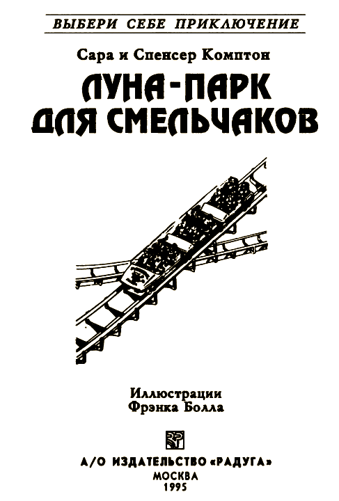

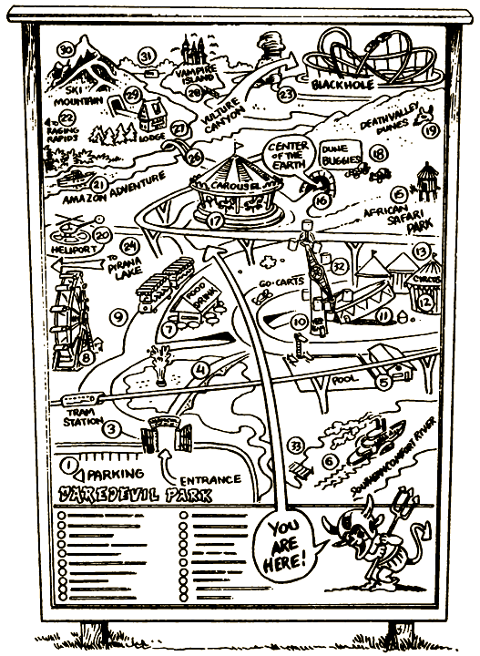

Это необычная книга. Не пытайся читать ее по порядку с начала до конца, переходя от одной страницы к другой, — ничего не получится! Ведь это игра, где тебя ждет много сюрпризов — считай, что ты выиграл бесплатный билет в Луна-парк для смельчаков. Время от времени тебе придется выбирать дорогу — она приведет либо к победе, либо к поражению.

Помни: ты сам в ответе за свой выбор! А чтобы узнать, какие приключения он тебе сулит, — следуй нашим инструкциям.

Прежде чем что-то решить, хорошенько подумай. Обычные луна-парки устроены для забав и развлечений, а в Луна-парке для смельчаков тебя, кроме них, подстерегают и опасности. Поэтому не спеши посетить все аттракционы подряд — как бы потом не пожалеть об этом!

Удачи тебе!

### ОБ АВТОРАХ

Сара Комптон написала множество стихов, песен и сюжетов для передачи «Улица Сезам» и для других телешоу. Она — лауреат семи премий «Эмми». А также автор книги «Stranded!» из серии «Выбери себе приключение. Для самых маленьких» и нескольких книг, опубликованных в серии «Испытатели Земли».

Спенсер Комптон — в настоящее время студент Университета в Колорадо. Над созданием этой книги трудился с пятилетнего возраста.

### О ХУДОЖНИКЕ

Фрэнк Болл учился в Институте Пратта. Работал в популярных американских журналах и до сих пор рисует комиксы. Он оформлял рекламные и учебные пособия для детей, сотрудничал в газетах (всем известны его комиксы «Annie» и «Winnie Winkle»). Его рисунки появились на страницах многих книг серии «Выбери себе приключение»; последние из них: «The Lost Ninja», «Kidnapped!», «The Terrorist Trap», «Ghost Train», «Magic Master», «Master of Martial Arts». Фрэнк Болл также иллюстрировал серию периодических изданий «The Young Indiana Jones Chronicles». Родился он в Нью-Йорке, а теперь живет и работает в Уэстпорте (штат Коннектикут).

#### [Начать приключение](#1)

# 1

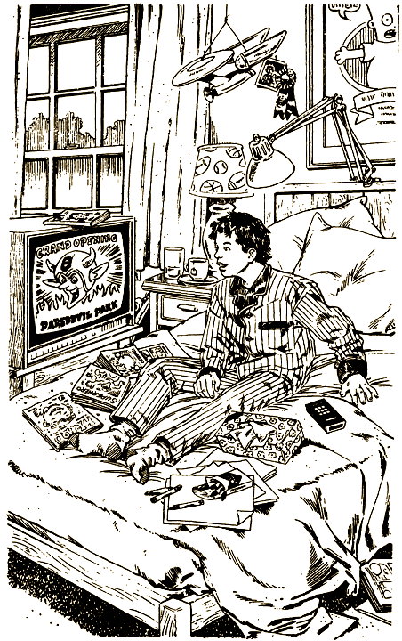

Третий день ты лежишь с гриппом, жутко надоело валяться и смотреть телевизор. Выключить бы эти дурацкие сериалы, но пульт куда-то подевался, а у тебя нет сил перетряхивать всю постель. Ты отворачиваешься, закрываешь глаза, хочется и уши заткнуть от надоевших звуков.

Ты уже проваливаешься в сон, как вдруг необычно громкая музыка привлекает твое внимание. Она звучит волнующе, таинственно и даже немного зловеще. Ты бросаешь взгляд на экран, по которому проносятся яркие образы: уходящие в пропасть американские горки… ныряющая в водопад байдарка… атакующий лев… отвратительно уродливое лицо в окне дома с привидениями.

— Самые удивительные чудеса — в Луна-парке для смельчаков! — объявляет диктор.

Не веря своим ушам, ты подскакиваешь на кровати. Неужели он и вправду откроется, этот парк? Не может быть! Ведь таких чудес не бывало еще ни в одном луна-парке! Вы с друзьями уже несколько лет слышите об этом, но открытие почему-то все откладывалось, говорят, администрация не уверена в полной безопасности аттракционов.

Музыка смолкла. На экране появился красный черт в рогатом шлеме.

— Эй, смельчаки, слышите? Парк откроется ровно через месяц, но для четверых счастливчиков мы устраиваем предварительное открытие! Если вам повезет, вы сможете провести полный приключений уик-энд. Весь парк будет в вашем распоряжении!

Ты резко садишься на постели. Как?! И в очереди стоять не надо? Последний раз, когда ты был в луна-парке, у тебя ушло два с половиной часа, чтобы попасть на американские горки и насладиться всего полутораминутным захватывающим полетом.

Черт в телестудии снимает трубку телефона и трясет ею у тебя перед носом.

— Я выберу наугад четырех смельчаков. Если хочешь быть одним из них — дождись моего звонка, возьми трубку и скажи: «Да».

Ты копошишься под одеялом, разыскивая пульт. Наконец находишь его под грудой комиксов. Выключаешь телевизор. Больше ничего уже не будет: пустая болтовня про кошек и собак тебя не интересует. Сейчас необходимо мысленно передать ведущему, чтобы он позвонил именно тебе. Конечно, глупо на что-то надеяться, но, кроме этой дурацкой надежды, у тебя ничего нет. Мечтать о том, что родители когда-нибудь отвезут тебя за тысячу километров на экскурсию в Луна-парк для смельчаков, еще глупее.

В ушах звенит от волнения, и когда этому звону начинает вторить телефон, ты подпрыгиваешь, как от электрического разряда.

— Ура, я выиграл!

Соскакиваешь с кровати; в голове туман, коленки дрожат, и все же кое-как добираешься до прихожей.

— Не смей вставать! — кричит мама.

Ну, еще два шага! Но к горлу подкатывает дурнота. А телефон звонит уже третий раз. Слышится стук маминых каблучков — она снимает трубку на кухне. Одним прыжком ты оказываешься у телефона, дрожащими руками хватаешь трубку и отчаянно вопишь:

— Да-а-а!

Из трубки доносится уже знакомый голос ведущего:

— Береги голос, юноша. Он тебе еще понадобится. Ты выиграл.

— Что выиграл? — удивляется мама.

А у тебя уже нет сил. Голова кружится так, что ты вот-вот грохнешься на пол.

— Мам, запиши, пожалуйста, все, что тебе скажут. А я пойду лягу.

Ты плетешься в спальню и забираешься под одеяло. Выиграл! С усталой и счастливой улыбкой мгновенно проваливаешься в сон.

Ровно через месяц ты уже сидишь в самолете частной авиакомпании и пытаешься сквозь иллюминатор хоть мельком увидеть таинственные очертания Луна-парка для смельчаков. Проплывающие мимо облака заслоняют видимость, и тебе удается углядеть только огромные водные массы да крутые спирали американских горок.

— А вот и наши горки, — сообщает сидящий в соседнем кресле молодой человек. (Как будто у тебя глаз нету!).

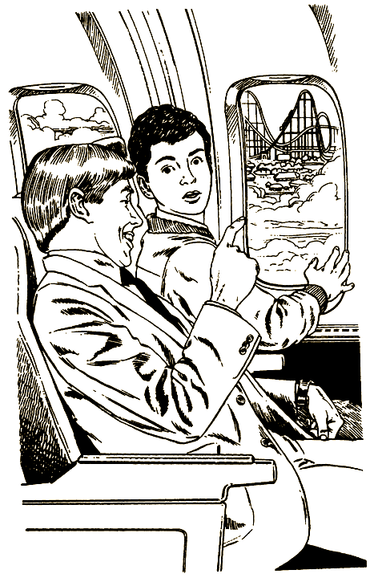

Зовут его Уолтер. Он служащий рекламного агентства при Луна-парке, и ему поручено тебя сопровождать. Ты бы прекрасно обошелся вообще без взрослых, но уж лучше Уолтер, чем родители.

— Самые большие горки в мире! — с гордостью заявляет твой гид. — Мы назвали их «Черной Дырой».

Бедняга, ему так хочется завоевать твои симпатии! Но как может понравиться человек, говорящий на языке рекламных проспектов? Ты молча киваешь, а тем временем самолет заходит на посадку.

— Ну вот, мы и на месте! — восклицает Уолтер. (Видно, он держит тебя за полного идиота!).

Вздохнув, отстегиваешь ремень безопасности и сходишь по трапу на асфальтовую площадку. Здесь тебя поджидает лимузин — уже второй за сегодняшний день.

Неподалеку толпятся репортеры. Ты идешь к машине, а они как бешеные щелкают своими вспышками.

— Они тебя фотографируют, — продолжает свои объяснения Уолтер.

К тебе подходят солидные дяденьки в костюмах (по твоим предположениям, члены совета директоров), и ты вместе с ними позируешь перед камерами. Наконец Уолтер ведет тебя в отель.

Здание все из стекла: ты уже в вестибюле, а кажется, еще на улице. Посреди холла декоративная каменная стенка — по ней струится вода. Лифты прозрачные.

— Впечатляет, а? — спрашивает Уолтер, подавая тебе ключ от номера.

— Да, ничего, — откликаешься ты, а про себя думаешь: на кой мне нужен твой отель, мне бы скорей на американские горки!

Уолтер провожает тебя до двери номера.

— Ужин в шесть. В ресторане встретишься с тремя остальными смельчаками. А пока чувствуй себя как дома.

Легко сказать! Так хочется прокатиться на горках, а ты торчи в отеле и «чувствуй себя как дома»!

До ужина целый час. Можно потратить его на видеоигры: в каждом номере есть специальная приставка к телевизору. Говорят, от этих игр дух захватывает. А может, лучше побродить по отелю: вдруг с верхнего этажа видны аттракционы?

Остаться [в номере](#108) или [осмотреть отель](#14)?

# 7

Ты пробуешь открыть дверцу — не поддается. Изо всех сил давишь на дверную ручку, да еще напираешь плечом.

Но тут в памяти всплывает картина: после столкновения Бок выбирался из окошка. Дверцу заклинило, и ее нельзя открыть изнутри!

— Эй, ты чего? — Бок хватает тебя за руку.

Ты вырываешься, хочешь вылезти в окно. Бок ловит тебя за ногу и втягивает обратно.

— Пусти! — отбиваясь, вопишь ты.

Бок внезапно отпускает твою ногу. Но вы еще не выехали из леса, и, кажется, вам отсюда уже не выбраться. Ты отпихиваешь Бока и видишь, как он вжимает в пол педаль акселератора.

Вообще-то, идея выпрыгнуть из мчащейся машины, за рулем которой безумец, была не самой блестящей, успеваешь подумать ты за секунду до того, как пикап врезается в могучий дуб.

Несомненно одно: у тебя уже не будет возможности повторить эту ошибку.

#### КОНЕЦ

# 14

Ты опускаешь в карман ключ от номера и выходишь в просторный, устланный ковром коридор — отсюда начнется твой осмотр. Идешь к лифту, но тут из двери соседнего номера высовывается вихрастая голова мальчишки примерно одних с тобой лет. Выйдя в коридор, он вдруг спохватывается:

— Ах, черт, ключ!

Но дверь уже захлопнулась.

— Спустись вниз, попроси запасной, — советуешь ты.

— Дырявая башка! — ругает себя сосед. — Привык во всем полагаться на гида. Мы с ним летели от самого Далласа. Не успел отдохнуть от него малость, как сразу влип в историю!

— Это уж точно! — смеешься ты. — Я сам до смерти рад, что избавился от этого зануды Уолтера.

— Так ты тоже смельчак? — Вихрастый, сияя, протягивает тебе руку. — Меня зовут Том Харбер.

Ты рад знакомству. Пожимаешь ему руку и посвящаешь его в свои планы:

— Решил побродить немного вокруг отеля.

— Я с тобой! — оживляется Том. — Давай попробуем в парк пробраться.

Вы входите в стеклянный лифт и спускаетесь в вестибюль. Пересекаете большую площадь перед отелем и устремляетесь по извилистой тропинке, ведущей к Луна-парку.

Ворота, разумеется, на замке. На самом верху массивной железной решетки светятся буквы: ДОБРО ПОЖАЛОВАТЬ В ЛУНА-ПАРК ДЛЯ СМЕЛЬЧАКОВ! А к воротам прибита маленькая табличка: «Посторонним вход воспрещен».

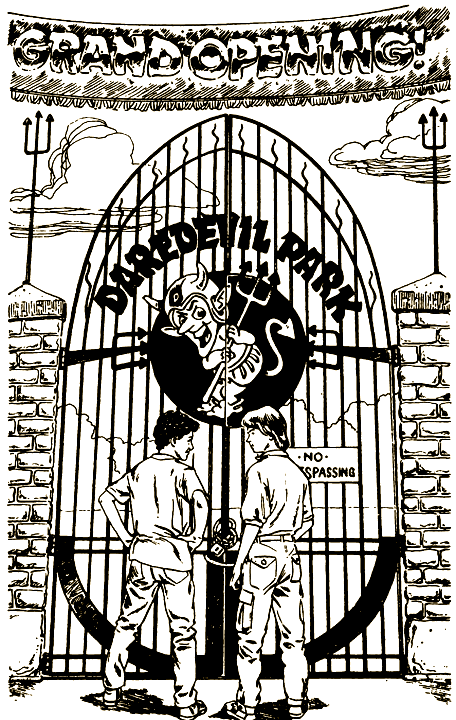

— Да, не повезло! — вздыхаешь ты. — Пошли, что ли, хоть в бассейне поплаваем.

— Еще чего! Кто так быстро сдается? — протестует твой новый знакомый. — Давай поищем дырку в заборе.

— А вывеска? Мы же посторонние, — колеблешься ты.

— Да кто нас увидит? — ухмыляется Том. — Завтра чертовы гиды станут следить за каждым нашим шагом, а пока мы без них все разведаем. Времени вагон, к ужину вернемся, никому и в башку не стукнет, что мы выходили из номера. Здорово, правда?

Конечно, здорово, мысленно соглашаешься ты, немного завидуя уверенности Тома. Хотя поплавать тоже было бы неплохо, да и безопасней.

Поискать с Томом лазейку [в парк](#18) или [поплавать](#20)?

# 16

— Если не возражаете, сэр, я бы побродил по замку, — смиренно отзываешься ты.

— Валяй! — отвечает доктор Бок и, засунув руку за ржавые доспехи, нажимает кнопку на стене.

Ты видишь перед собой старинное подъемное устройство, нечто вроде лифта. Доктор Бок отворяет скрипучую дверцу.

— Осмотр лучше начинать сверху, с Восточной башни.

— Благодарю вас, — киваешь ты и улыбаешься доктору Боку, но его суровое лицо остается неподвижным.

Лифт дергается и тут же останавливается. Потом продолжает движение уже медленно, с жуткой тряской и скрежетом. Прежде ты не боялся оставаться один в закрытой кабине лифта, но при виде этого дряхлого сооружения невольно думаешь: неужели он когда-нибудь доберется до цели? Твое внимание привлекает новый звук — какое-то странное жужжанье. По мере того как лифт ползет в башню, оно становится все громче.

Ты силишься понять, откуда исходит звук, и за секунду до остановки лифта содрогаешься от внезапной догадки. Дверь открывается, и ты видишь…

Летучих мышей! Так и знал! Это были крылья — тысячи крыльев, заполняющих всю башню. Летучие твари облепляют тебя. Одна маленькая мышь вцепляется прямо в волосы. Ты вопишь, мечешься, тебя передергивает от омерзения.

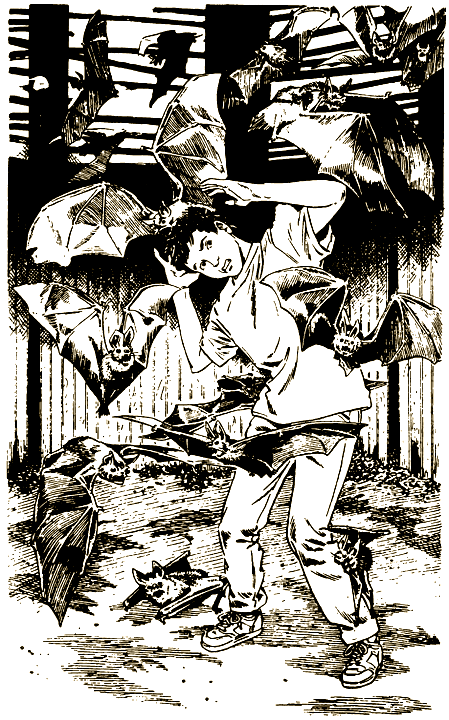

Конечно, это не настоящие летучие мыши, а роботы, внушаешь ты себе, пробираясь по стене башни. А ведь совсем как живые! Даже запах от них такой резкий, словно вокруг полно тухлятины.

Наконец ты дошел до узкой каменной лестницы на другом краю площадки. Вскоре убеждаешься, что мыши не запрограммированы на спуск вместе с тобой, и все же на всякий случай прикрываешь лицо руками.

Лестница выводит тебя из башни, и ты попадаешь в просторный зал. Тебя еще трясет, когда ты переступаешь через порог.

Зал слабо освещен лунным светом, что струится сквозь открытое окно. Внимание твое привлекает огромная кровать, на которой лежит золотоволосая красавица.

Уж не мертвая ли? — грешным делом подумал ты. Но нет, в тишине ты слышишь ее легкое дыхание.

Вроде бы все спокойно, однако внутреннее напряжение не оставляет тебя, как будто что-то должно вот-вот случиться.

И ты не ошибся. Из дальнего угла доносится скрип, и, обратив туда глаза, ты замечаешь длинный ящик — гроб. Изнутри крышку медленно приподнимает мужская рука. И вот мертвец встал из гроба. Высокий, худой, очень-очень бледный. На нем черный костюм и черная бархатная, подбитая красным шелком накидка, он глядит прямо на тебя. Потом губы раздвигаются в жутком оскале, и ты видишь два клыка. Перед тобой вампир.

Вампир подкрадывается к спящей красавице.

Ты сразу понял, что у него на уме: вампиры редко меняют свои пристрастия. А еще ты готов поспорить, что девица сейчас проснется и начнет визжать.

Хотя робот выглядит очень натурально, тебе уже порядком наскучила страшная история, которую ты миллион раз видел в кино и в комиксах. Поэтому ты решаешься заглянуть в гроб. Остановить тебя некому — здесь никого нет, а узнать, как управляют роботами, крайне любопытно. В темноте поблескивает откидная панель. Должно быть, за ней какое-то электронное устройство — хорошо бы его потрогать! Вряд ли когда-нибудь тебе снова представится возможность управлять вампиром.

Гроб оказывается глубже, чем ты предполагал, и тебе никак не дотянуться до панели, разве что залезть внутрь. Наконец ты открываешь крышку — за ней кнопки, кнопки… Ах, жаль, фонарика нету!

Пронзительные крики золотоволосой красавицы сменяет органная музыка, сопровождающая мерный перестук шагов. Ты выглянул из-под крышки. Увидев перед собой вампира, хочешь встать, но он ударяет тебя по голове ботинком.

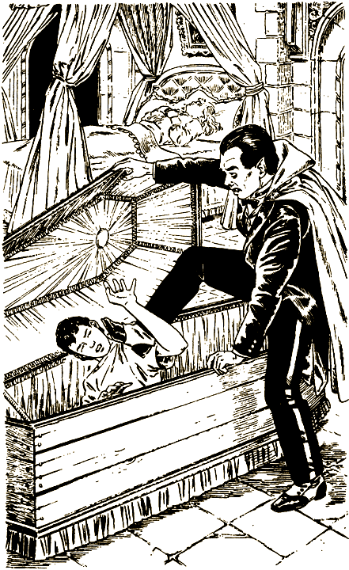

— Эй, думай, что делаешь! — кричишь ты.

Но, разумеется, роботы не могут думать — они делают то, на что запрограммированы. На сей раз программа предписывает ему прыгнуть в гроб и захлопнуть крышку.

Пытаешься отпихнуть вампира, но, оказывается, роботы гораздо тяжелей, чем ты предполагал.

— Доктор Бок! Эй, кто-нибудь! Помогите! — кричишь ты, но органная музыка заглушает твои крики.

Ты вытягиваешься в гробу, прижимаешься к стенке, чтобы проклятый вампир тебя не раздавил. Крышка захлопывается, и ты не в силах ей помешать.

Органная музыка смолкла. Ты вопишь что есть мочи, в душе понимая, что никто здесь тебя не услышит. Навалившегося робота тебе кое-как удается сбросить, но, несмотря на все твои усилия, крышка не открывается.

До пульта тебе тоже не дотянуться, а если б и дотянулся, ты же не знаешь, какую кнопку нажимать. В отчаянии ощупываешь стенку гроба: может, хоть какая щель найдется — воздуху глотнуть. Но гроб заколочен на совесть.

Снова ложишься и думаешь: надо экономить кислород. Интересно, сколько времени пройдет, прежде чем ты станешь таким же холодным и безжизненным, как твой сосед. Слезы наворачиваются на глаза. Ты утираешь их краешком вампировой бархатной накидки.

Ты не знаешь, сколько времени прошло — двадцать минут или двадцать часов, — но вдруг снова раздается органная музыка: судя по всему, она возвещает выходы вампира.

Он и в самом деле зашевелился, приоткрывает крышку гроба. Ты вскакиваешь, рвешься к свету, вопишь:

— Я живой! Живо-ой!

А вампир опять пробирается к златовласке.

Она визжит, но все разом обрывается, и на сцену выступает служитель Луна-парка.

— Ты как? Ничего?

— Ничего. Руки и ноги малость занемели, — откликаешься ты.

Служитель награждает тебя неодобрительным взглядом.

— Если б тебя не хватились, еще не то было бы.

— И давно я в этой ловушке? — интересуешься ты.

— Кто ж тебя знает? Мы уже восемь часов ищем — с ног сбились. — Он выводит тебя из комнаты. — Хорошо, что догадались направить сюда видеокамеры.

Без промедления тебя сажают в самолет и отправляют домой. Можешь радоваться: в гробу побывал — вот тебе и весь Луна-парк!

#### КОНЕЦ

# 18

— Ладно, пошли! — соглашаешься ты.

Вы начинаете искать дырку в железной ограде. Дырки нет, зато у забора стоит фургон. Как раз то, что нужно! Озираетесь кругом — нет ли кого поблизости, — залезаете на капот, потом на крышу фургона. С нее перелезаете на забор. Прыжок — и вы уже на территории Луна-парка.

Шатаясь, встаешь на ноги. Том приземляется рядом с тобой, потирает ушибленный локоть, но на лице у него торжествующая ухмылка.

— Ну, что я говорил?

Осмотревшись, видите тропинку: скорее всего, она и ведет к американским горкам. Поначалу вам обоим страшновато: а вдруг вас засекут? Но вокруг ни сторожей, ни мастеров, ни конструкторов. Никого, кроме тебя и Тома. И вы успокаиваетесь.

Тропинка вьется мимо палаток со всякими сувенирами и закусками. Вы петляете по ней минут десять. Том заметно приуныл.

— По-моему, тут горками и не пахнет.

За поворотом тропа разветвляется. На развилке указатель:

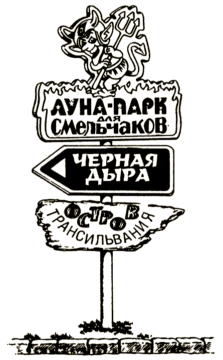

— Нам налево! — заявляет Том.

— А почему не направо? — возражаешь ты. — Говорят, на острове Трансильвания страх как интересно. Там наверняка больше всего увидишь.

— Увидишь?! Ты что, смотреть сюда приехал? Вон, горки-то работают! — Том показывает вдаль на продвигающиеся к вершине вагонетки. — Представляешь, на них еще никто не катался! Мы будем первыми.

— Но там нас наверняка застукают.

— Попытка — не пытка. — Том подталкивает тебя в спину. — Раз уж мы сюда забрались, не бросать же на полдороге?

Вот кто настоящий смельчак! А тебя все время одолевают сомнения. Вряд ли вы так же легко попадете на американские горки, как в сам парк. К тому же любопытно, какие такие чудеса ждут тебя на острове Трансильвания.

Идти с Томом к «[Черной Дыре](#37)» или выбрать остров [Трансильвания](#54)?

# 20

— Нет уж! — Ты мотаешь головой. — Давай без меня.

— Ну, как хочешь… — пожимает плечами Том. — Увидимся за ужином.

Ты провожаешь его взглядом. Эх, напрасно он так рискует, надо было его отговорить!.. Потом возвращаешься в номер за плавками.

Через пятнадцать минут ты и думать забыл о Томе. В бассейне плавают еще двое — мальчик и девочка. Наверно, тоже смельчаки. Решив с ними познакомиться, ты ныряешь с вышки и обдаешь мальчика брызгами. Он протирает глаза.

— Погоди, я тебе еще устрою! — кричит он и, улыбаясь, протягивает мокрую руку. — Я — Сэм Бреннер из Анкориджа.

— Это что ж, возле самой Аляски?

— Ну не во Флориде же! — усмехается он.

К вам подплывает девочка.

— Привет! Я — Лесли Харрис. А мы тут с Сэмом сидим и думаем, куда же другие смельчаки подевались? Говорят, четвертого зовут Том. Ты его уже видел?

Ты не знаешь, что ответить. С Томом нехорошо вышло. Вдруг он теперь в опасности?.. Ладно, не каркай! Ты начинаешь что-то мямлить, но в этот момент из парка доносится вой сирены.

Мимо вас проносится к воротам охранник. В одной руке у него портативная рация, в другой пистолет.

Ты выпрыгиваешь из бассейна и летишь за ним. У ворот уже целая толпа охранников. Подбегая, ты замечаешь пулей промчавшийся гоночный автомобиль. У сидящего в кабине Тома лицо белое как мел, а глаза вылезли на лоб. Он явно впервые в жизни сел за руль.

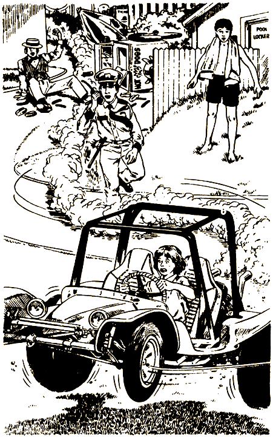

Машина врезается в ограждение, опрокидывает лоток для продажи сосисок, перелетает через невысокий каменный парапет и со всего размаха плюхается в пруд.

Ты, запыхавшись, добегаешь до пруда. Машина ушла под воду, а Том барахтается на поверхности.

— Том! — вопишь ты.

Он смотрит на тебя виноватыми глазами. Наконец ему удается выдавить улыбку.

— Видишь, я тоже решил чуток поплавать.

Ты ныряешь в пруд и за две секунды доплываешь до него.

— Ты как? Не ушибся?

— Я-то ничего, — отвечает он. — А вот машине, думаю, крышка.

К вам обоим уже плывет охранник.

— Эй, сынок, не бойся! — ласково говорит он. — Сейчас я тебя вытащу.

Но тон его голоса резко меняется, как только он узнает, что злоумышленник не пострадал. На берегу Тома уже поджидает его гид.

— За пять минут нанес парку ущерб в пятьдесят тысяч долларов! — восклицает он и тащит Тома к лимузину. — Надо скорей отправить тебя обратно в Даллас, пока ты все нам тут не разворотил.

Перед тем как забраться на заднее сиденье лимузина, Том дружески подмигивает тебе.

— Прокатись разок за меня на «Черной Дыре»! — Но голос у него дрожит; бедняга с трудом сдерживает слезы.

Ты долго машешь вслед лимузину и, когда он скрывается из виду, идешь в отель переодеться, думая о том, какие еще сюрпризы преподнесет тебе Луна-парк в эти выходные.

Без пяти шесть ты спускаешься на лифте в вестибюль, где встречаешь Уолтера в шахтерском шлеме и шортах цвета хаки. Увидев его, ты чуть не прыснул со смеху. Про Тома он ни словом не обмолвился, однако прочел тебе строгую нотацию о бдительности и ответственности.

— Мы понимаем ваше нетерпение, поэтому решили не дожидаться завтрашнего дня. Ужинать будем на яхте «Королева Амазонки».

— Ух ты! Здорово!

Уолтер идет к выходу, а ты вприпрыжку бежишь следом. Перед отелем стоит гоночный автомобиль; на заднем сиденье Лесли и Сэм. Уолтер садится за руль; ты усаживаешься возле него, и машина трогается.

Вы въезжаете в парк не через главные ворота, а откуда-то сбоку. Минут пять колесите по тропинкам и наконец резко останавливаетесь. Перед вами чуть покачивается белоснежное пятнадцатиметровое судно. И самое удивительное — оно не на воде, а будто плывет по облаку густого тумана.

— А где же Амазонка? — спрашиваешь ты.

— Увидишь, — улыбается Уолтер.

Вместе с Уолтером, Лесли и Сэмом ты поднимаешься по трапу на борт. Палуба слегка покачивается под ногами; явственно слышится плеск воды.

— Странно! — шепчет тебе на ухо Сэм. — Вроде бы мы на воде, а никакой воды не видно.

Вслед за Уолтером вы поднимаетесь на верхнюю палубу. Перед вами стол, заставленный всякой всячиной: жареными цыплятами, хрустящим картофелем, пирожными — ешь сколько влезет!

— Угощайтесь, друзья мои! — приглашает Уолтер. — А я вынужден вас покинуть. Желаю вам вернуться из «Джунглей Амазонки» целыми и невредимыми.

Он уходит, а вы втроем растерянно переглядываетесь. Ваше любопытство разыгралось не меньше, чем аппетит. Но из-за тумана ничего не видно вокруг, поэтому вы налегаете на еду. Через несколько минут по сигналу сирены судно отчаливает.

Проходит еще четверть часа. Вы уже съели по третьему куску цыпленка и приступили к пирожным. Яхта набирает скорость, но за бортом все та же плотная туманная завеса — в трех метрах ничего не разглядишь. Хорошенькое путешествие! Так вы и будете всю дорогу болтаться в молочной пелене. Но вдруг туман, как по волшебству, рассеивается.

— Ой, мамочки! — ахает Лесли.

Сэм тоже выпучил глаза.

— Где это мы?

В ответ ему из динамика раздается голос:

— Добро пожаловать в «Джунгли Амазонки» — самое дикое место на земле!

От этого зрелища дух захватывает. Яхта плывет по широкой реке, а с обеих сторон непроходимые джунгли. Тридцатиметровые стволы деревьев обвиты лианами; на них раскачиваются птицы ярчайшей окраски; в воздухе мелькают тучи бабочек.

— А почему ж мы не видели их с борта самолета, эти джунгли? — удивляется Лесли.

— Да они, скорей всего, ненастоящие, — догадываешься ты. — Я читал, что в Луна-парке для смельчаков аниматроника раз в десять совершеннее, чем в других парках, и даже в Диснейленде.

— Аниматроника? — озадаченно переспрашивает Сэм. — А что это такое?

Ты отвечаешь не сразу, поскольку внимание твое привлекает стая диких обезьян, прыгающих по деревьям. Они качаются на лианах и пронзительно верещат. К пояснице одной мартышки крепко прицепился детеныш.

— Электронные люди и животные — вот как эти обезьяны, — объясняешь ты. — Но главный фокус в том, что вместе с аниматроникой в парках есть и живые существа. Поди догадайся, где робот, а где настоящие обезьяна или, скажем, тигр…

Лесли хватает тебя за руку.

— А этот настоящий? — И указывает на что-то движущееся по реке в вашу сторону.

Ты напрягаешь зрение. В грубо сработанном каноэ сидит свирепого вида человек и гребет прямо к вам.

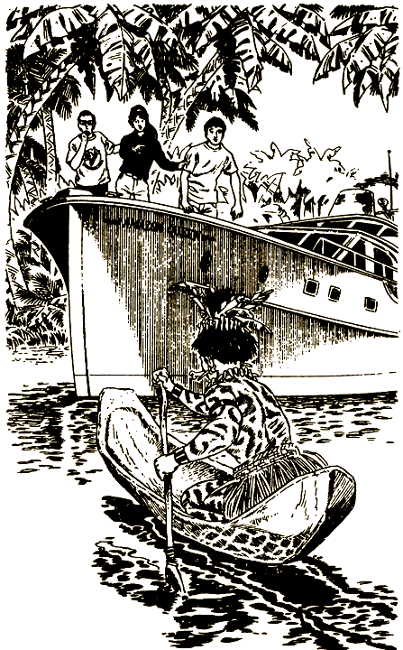

— В «Джунглях Амазонки» вас ожидает много удивительных приключений! — объявляет голос из динамика.

Приключения приключениями, а про каноэ ни слова. Странно! Между тем оно уже близко, и правит им юноша, как две капли воды похожий на индейца с берегов Амазонки. Именно такими их рисуют на картинках: почти голый, все тело в оранжевых и черных загогулинах, а в прямых волосах цвета воронова крыла украшение из ярких перьев.

Индеец ловко подгребает к вашей яхте и, уцепившись за борт, скрывается в трюме.

— Будьте начеку! — предупреждает динамик. — Дикие индейцы порой нападают на…

Голос обрывается. А вместе с ним и негромкое урчание мотора.

Вы с тревогой глядите друг на друга.

— Тут что-то не то, — заключает Сэм.

— А может, попугать решили? — высказываешь ты еще одну догадку. — Они на всех аттракционах пугают.

— Если так, — шепчет Лесли, — им это удалось.

Из трюма доносятся шум и возня.

— Пошли, посмотрим! — предлагает Сэм.

— Как бы не так! — заявляет Лесли. — Я отсюда ни ногой.

Ты задумываешься. Сэм прав: любопытно взглянуть, что там внизу. Но и Лесли права: с дикими индейцами лучше не связываться. Пока ты пребываешь в сомнениях, в трюме разгорается настоящая битва.

Спуститься [в трюм](#23) или [остаться](#34) с Лесли?

# 23

Вслед за Сэмом ты устремляешься вниз по ступенькам.

— Ага! А я здесь одна останусь? — восклицает Лесли и бежит за вами.

В трюме происходит ожесточенная схватка между индейцем и дородным охранником.

— Стойте! — властным голосом командуешь ты.

От неожиданности дерущиеся замирают на месте. Несколько секунд оторопело смотрят на тебя, потом продолжают бороться.

Сэм обхватил индейца за пояс, Лесли пытается пролезть между краснокожим и охранником, ты за ремень оттаскиваешь последнего. Но взрослые отшвыривают вас в сторону. Вам ничего не остается, как беспомощно наблюдать за схваткой. Может, она входит в сценарий? — успокаиваешь себя ты.

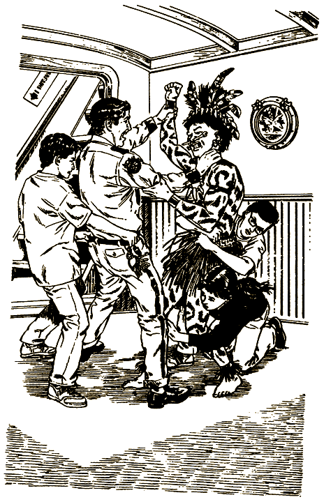

Но, взглянув на свирепое лицо индейца, тут же отказываешься от этой мысли. Нет, он явно вышел на тропу войны. Из ушей и носа у него торчат кости, а на шее висит ожерелье из страшных клыков.

Ему удается положить противника на обе лопатки. Сняв пояс, он скручивает ему руки. Потом поворачивается и пронзает яростным взглядом тебя, Сэма и Лесли.

— Если не станете мне препятствовать, — на чистейшем английском языке заявляет индеец, — останетесь целы.

— А в чем препятствовать? — поинтересовался Сэм.

— В моем протесте, — отвечает краснокожий. — Меня зовут Кайано. Я родился на берегах Амазонки, а теперь учусь в Нью-Мексико, в университете. Этот Луна-парк возводит клевету на мой народ — потому я здесь.

— То есть? — не понял ты.

Кайано оглядывает помещение.

— Их «аттракцион» — «Джунгли Амазонки» изображает нас как головорезов. Я не позволю им обливать грязью мое племя!

Ты невольно бросаешь взгляд на охранника, со связанными руками.

Глаза Кайано вспыхивают гневом.

— Я не собирался драться с ним, но он вытащил нож. — Он указывает на пол, где и вправду валяется нож. — У меня не было выбора.

— Нас предупреждали о нападении диких индейцев, — вмешивается Лесли. — Я знаю, это неправда. Недавно я прочла книгу о джунглях Амазонки. Ваше дело правое, — заявляет она. — В Луна-парке полно журналистов, так что здешнее начальство поневоле выслушает ваши претензии.

По правому борту слышится рокот моторки.

— Ну вот, — говоришь ты, — на ловца и зверь бежит!

На борт поднимается солидный, шикарно одетый господин в сопровождении охраны.

— Взять его! — приказывает он, врываясь в трюм.

— И нас вместе с ним! — восклицаешь ты и загораживаешь собой Кайано.

Друзья следуют твоему примеру.

Охранники в недоумении смотрят на шикарного седовласого господина.

— Ваш так называемый «аттракцион» «В джунглях Амазонки» изображает индейцев как шайку головорезов, которые нападают на ни в чем не повинных людей! — с горячностью говорит ему Лесли.

Но холодные голубые глаза администратора глядят невозмутимо.

— Я — Бернард Уэстон, президент компании, учредившей Луна-парк для смельчаков. — Он протягивает индейцу руку. — Предлагаю всем сесть за стол переговоров.

Мистер Уэстон начинает подробно расспрашивать Кайано, а ты про себя отмечаешь, что этот человек недаром занимает столь высокий пост. Через четверть часа он заявляет, что аттракцион не откроется до тех пор, пока сценарий не будет переработан, и даже просит Кайано помочь в таком нелегком деле.

Вы пересаживаетесь в моторку. По пути мистер Уэстон отдает распоряжение по рации, чтобы для Кайано подали самолет, который доставит его в Нью-Мексико. Затем президент останавливает свои немигающие голубые глаза на тебе и друзьях.

— Ну, раз путешествие по Амазонке не состоялось, не хотите ли взамен прокатиться по «Белопенной Стремнине»?

«Белопенная Стремнина»!

— Почему бы и нет? — с напускным спокойствием отвечаешь ты, вспомнив жуткое зрелище ныряющего в водопад каяка из телерекламы Луна-парка для смельчаков.

У Сэма и Лесли такой взволнованно-испуганный вид, что ты сразу понимаешь: они рады к тебе присоединиться.

Спустя десять минут ты уже смотришь вниз на крутые излучины горной реки, бегущей по глубокому каменистому ущелью. Высота водопада — метров пятнадцать; у подножия пенный омут, а дальше река продолжает головокружительный спуск по стремнине.

Ты вызвался пойти первым. Мистер Уэстон самолично помогает тебе надеть защитный шлем.

— В него вмонтировано контрольное устройство, — объясняет он. — Наш эксперт Винс… — он кивает на человека в наушниках, — будет передавать тебе инструкции по радио, чтобы у тебя не возникло затруднений.

Ты подтягиваешь ремень шлема, оглядываешься напоследок на Сэма и Лесли и прыгаешь в каяк — маленькую лодку на одного человека. Хватаешься за весло, готовый грести изо всех сил, чтоб не наткнуться на какой-нибудь валун или не врезаться в скалистую стену ущелья. Ты, конечно, понимаешь, что это аттракцион и, греби не греби, конец все равно один. И тем не менее…

— Смелей! — напутствует мистер Уэстон, подталкивая каяк на край водопада. — Ты первый, но не последний, кому посчастливилось попасть на «Белопенную Стремнину». Думаю, она станет одним из самых популярных аттракционов в Луна-парке для смельчаков.

Сердце колотится. Ты набираешь воздуху в легкие, когда нос каяка свешивается над краем бездны. И вот с безумной скоростью ты летишь вниз. В ушах стоит рев ветра и воды, а ты все падаешь, пока по резкому удару об днище не догадываешься, что уже погрузился в омут.

Каяк бешено вращается. Тебе страшно. Спираль закручивается все туже и увлекает тебя к мощной воронке. Сейчас затянет!

— Греби! — слышится в микрофоне крик Винса.

Ты отчаянно работаешь веслами и чувствуешь, как лодка мало-помалу двигается вперед. Неизвестно, благодаря ли твоим лихорадочным движениям или чему еще, но каяк выбирается из водоворота.

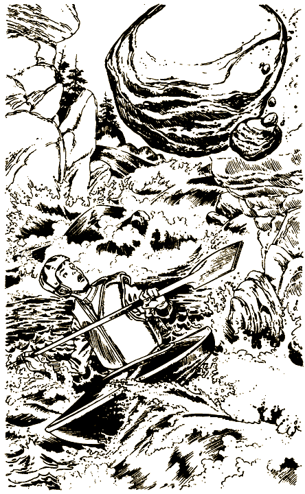

Ты переводишь дух, пытаешься собраться с мыслями, а твое суденышко уже скользит по зеркально-гладкой воде. Но вдруг сверху доносится угрожающий рокот. Подняв глаза, ты бледнеешь при виде огромной глыбы, что сорвалась со скалы и неудержимо летит в ущелье.

— Берегись! — вопит Винс.

А как беречься? Лодка чересчур медленно скользит по ровному пространству. Гигантский валун навис над твоей головой, и ты гребешь из последних сил, пытаясь свернуть с его пути. Никогда еще тебе не было так жутко.

И все же сокрушительный удар буквально в метре от борта лодки застигает тебя врасплох. Он оглушил тебя, всего окатил водой, но ты остался жив. И лишь тогда вспомнил, что это аттракцион и здесь тебе не причинят вреда — во всяком случае, ты питаешь такую надежду. Главное — собрать силы, не поддаться страху и с достоинством продержаться до конца.

— Ну, страшней уж не будет, — говоришь ты вслух, подбадривая себя.

— Будет! — обещает Винс.

Ты вновь хватаешься за весло, услыхав впереди грохот воды. Огибаешь излучину, и у тебя мутится в глазах: впереди раскинулись ужасающие пороги.

Ущелье здесь такое узкое, а пороги такие крутые, что воды почти не видно — сплошная пена. Отсюда, наверно, и название аттракциона — «Белопенная Стремнина».

Ты ощущаешь мощный рывок — это твой каяк перепрыгивает через огромное скопление валунов; потом еще несколько ударов послабее — это он погружается в пену. Его швыряет из стороны в сторону средь бурливых волн, а ты пытаешься в точности исполнять все команды Винса.

Весло кажется тебе копьем, когда ты отталкиваешь свою лодчонку от каменных громад, но внезапно налетевший вал вырывает его у тебя из рук. Теперь тебе остается только вцепиться в борт и уповать на судьбу.

Каяк мчится вперед, следуя за сумасшедшими изгибами потока. На одном из поворотов он подпрыгивает и несется прямо на скалу.

— Спасите! — голосишь ты и, зажмурив глаза, врезаешься в скалу.

Странно: ты совсем не чувствуешь боли, только очень перепугался. Потом наступает прекрасное ощущение полета, но вслед за этим каяк вновь содрогается, ударяясь о воду. Мало того — тебе чудится, что он ушел в глубину метров на шесть и мучительно медленно всплывает.

Ты затравленно озираешься и видишь, как лодка уже скользит к пристани. Следом за тобой причаливают Лесли и Сэм. По их лицам видно, что они в таком же шоке.

И вдруг тебя осеняет: ты еще жив! И не можешь удержаться от истерического хохота.

— Ур-ра! Доплыли! — кричишь ты друзьям.

— Вот страху-то натерпелись! — откликается Сэм.

На пристани вас встречает мистер Уэстон, одаривает дежурно-радушной улыбкой и по очереди помогает вам выбраться на берег.

— Вот это да! — говоришь ты ему, с трудом сохраняя равновесие. Потом оглядываешь себя с ног до головы. Что-то здесь не так. — Ну надо же, — удивленно говоришь ты, — я уже считал себя утопленником, а весь почему-то сухой, будто и в воде не был!

— Естественно, — подтверждает мистер Уэстон. — Это специально разработанные психологические эффекты, — говорит он. — Все движется так стремительно, что у вас на самом деле возникает ощущение, будто вы плывете в бурном потоке.

Лесли смотрит на часы.

— Неужели это длилось всего семь минут? Не может быть!

Мистер Уэстон глубокомысленно кивает.

— Когда ваше сознание помещают в непривычную ситуацию, время тоже воспринимается иначе — словно бы растягивается. — Он кладет тебе руку на плечо. — Я рад, ребятки, что вам понравилось. А теперь отдыхать! Завтра у вас очень насыщенная программа.

Вернувшись в номер отеля, ты натягиваешь пижаму и плюхаешься в постель. Хорошо бы перед сном посмотреть телевизор, но нет сил дотянуться до пульта. Ты и впрямь будто провел целый день на ревущей стремнине. Через минуту ты уже крепко спишь.

Наутро ты завтракаешь возле бассейна вместе с Лесли, Сэмом и Уолтером.

— Какой аттракцион вы хотели бы посетить прежде всего? — спрашивает Уолтер.

— А какой самый интересный — туда и пойдем.

— Я с тобой! — заявляет Лесли.

У Сэма рот набит пирогом с ежевикой, но он усиленно кивает.

— Ну, на «Стремнине» вы уже были, — размышляет вслух Уолтер. — Это один из наших коронных номеров. Не уступают ему, по-моему, только «Черная Дыра» и «Отчаянный Горнолыжник».

— Про «Черную Дыру» мы уже слыхали, — говорит Лесли, — это американские горки. А вот что такое «Отчаянный Горнолыжник»?

— О, это замечательная игра! — восклицает Уолтер. — Надеваете лыжи, на подъемнике вас доставляют к вершине горы, и вы мчитесь вниз по трассе.

— А кто никогда не стоял на лыжах?.. — испуганно спрашивает Лесли.

— В том-то и штука! Аттракцион управляется совершеннейшим электронным устройством. Даже если вы ни разу не стояли на лыжах, благодаря электронике вы сразу почувствуете себя мастерами горнолыжного спорта. Обещаю: этот спуск будет захватывающим!

— Давайте сперва туда! — воодушевилась Лесли.

— А мне все-таки хотелось бы на американские горки, — не сдается Сэм.

Уолтер поворачивается к тебе.

— Судя по всему, твой голос решающий.

Выбрать «[Черную Дыру](#102)» или начать с «[Отчаянного Горнолыжника](#107)»?

# 34

Ты решил остаться с Лесли. А Сэм спускается в трюм.

— Будь осторожен, — предупреждаешь его ты.

Лесли затыкает уши и забивается в уголок.

— Да может, там и страшного-то ничего нету, — пытаешься ты успокоить не столько ее, сколько самого себя.

Держась за поручни, Лесли смотрит вниз, потом переводит взгляд на берег.

— Вообще-то, не так уж далеко… — нерешительно произносит она.

Ты понимаешь ее с полуслова. К шуму битвы, доносящемуся снизу, добавляются крики Сэма, и тебе не терпится сбежать отсюда как можно скорее. Ты берешь инициативу в свои руки.

— Рискнем!

Первым залезаешь на борт и прыгаешь…

Да, это было необдуманное решение. Ты забыл о том, что не все в Луна-парке для смельчаков реально. На вашу беду, яхта стоит вовсе не на реке, а ее покачивание — только иллюзия. Ты готов погрузиться в воду, а вместо этого шлепаешься на твердый цемент. Вероятно, при таком падении есть шанс уцелеть — один на тысячу. Но ты и Лесли к тем счастливчикам не принадлежите.

#### КОНЕЦ

# 37

На пути к американским горкам вам попадается очень странное сооружение: башня метра четыре высотой, а к ней прикреплены круглые клетки на стальных рычагах, торчащих во все стороны. Одни клетки висят высоко, другие — у самой земли. Внутри каждой имеются страховочные ремни для четверых.

Том читает на башне надпись здоровенными буквами: «БЕЗУМНЫЙ ДЕРВИШ». Вы вместе осматриваете нижнюю клетку.

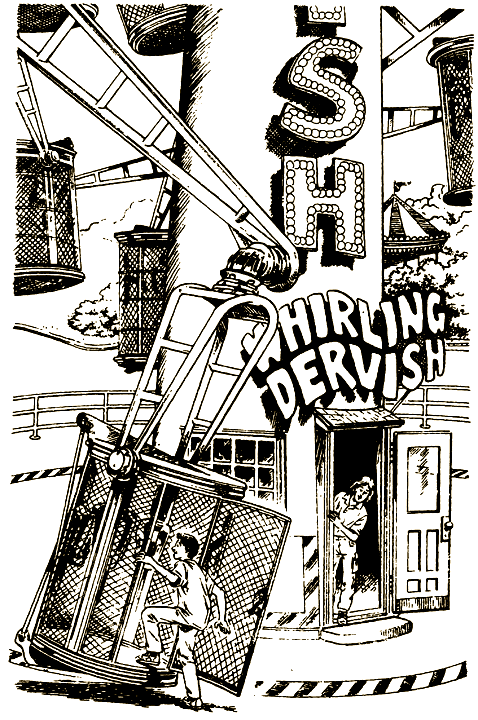

— И что это, по-твоему, такое? — спрашивает он.

— Не знаю. — Ты входишь в клетку, просовываешь руки под ремни. — Наверно, надо встать вот так и пристегнуться, чтоб не кидало по всей клетке.

Повозившись с этими ремнями, ты застегиваешь их на груди. И вдруг клетка начинает двигаться. Ты вертишь головой: где же Том? А он, оказывается, вошел в башню. Сквозь открытую дверь тебе видно, как он склонился над электронным щитом управления.

— Эй, Том, чего задумал? — кричишь ты ему.

— Да вот, хочу ее запустить. — Голос у Тома дрожит от азарта. — Питание подключил. А все остальное, по-моему, регулируется изнутри. Вот он, пульт!

Размахивая устройством дистанционного управления, Том выбегает из башни и прыгает в клетку. Становится против тебя, пристегивает ремни.

— Том! Ты что, хочешь…

Но ты не успеваешь закончить: Том уже нажал кнопку, и клетка ползет вверх.

Сначала медленно. Потом все быстрее. Начинает вращаться. Пальцы Тома давят еще на какие-то кнопки, и тебя закручивает такой вихрь, что ты прилипаешь к решетке.

Клетка достигла верха башни и ухает оттуда вниз. Том скалит зубы и продолжает орудовать пультом управления.

Скорость увеличивается. Слышится какое-то лязганье, и ты с ужасом замечаешь, что пол и потолок клетки отвалились. Глядишь на стремительно приближающуюся землю. Клетка на миг приостанавливается и снова летит к небу. Косишься на Тома. Его, как и тебя, пригвоздило к решетке; руки и ноги растопырены; на лице дикий страх.

— А зачем тогда привязные ремни? — недоумеваешь ты. Ведь центробежная сила вращающейся клетки и так не выпустит тебя.

Да, такой карусели ты еще не видел. Закрываешь глаза, чтобы насладиться стремительным полетом. Хочешь поднять кверху большой палец — мол, здорово, Том! — но какое там: ты не только рукой шевельнуть не в силах, даже веки не разлепляются.

Вот именно, глаза будто сургучом запечатаны. Наконец тебе все-таки удается их открыть, и тут ты понимаешь весь ужас приятеля. Пульт вылетел у него из рук, прилип к стенке, и Том никак не может до него дотянуться. Иными словами, крутиться вам до тех пор, пока кто-нибудь не придет на выручку, — может, до завтрашнего утра.

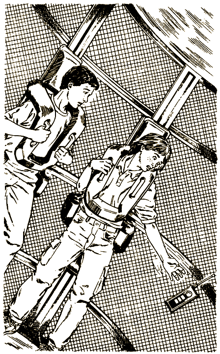

Как бы все-таки добраться до пульта? Ты уставился на металлический прямоугольник и мысленно взываешь: «Ну подползи же хоть чуть-чуть!» Но пульт будто пришпилен к стенке.

И вдруг тебе в голову приходит блестящая идея: отстегнуть ремни и по стенке добраться до пульта. Ты уже сыт по горло этим «Безумным Дервишем»! Но с другой стороны, затея опасная. Может, лучше все-таки дождаться подмоги?

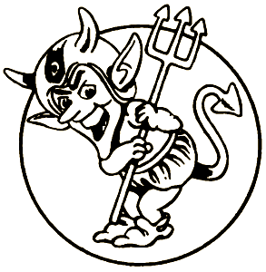

Решишся [рискнуть](#112) или предпочитаешь [подождать помощи](#80) извне?

# 47

Сердце дико бьется в груди, когда ты открываешь дверь и входишь во мрак замка. Глаза не сразу привыкают к темноте, но наконец ты различаешь широкую каменную лестницу и массивную люстру над головой. Со стен на тебя угрюмо взирают портреты, оправленные в богатые рамы. Рядом коллекция старинного оружия: этими алебардами и мечами можно вооружить по меньшей мере пятьдесят воинов. В углу стоят рыцарские доспехи. Все покрыто паутиной и толстым слоем пыли. Единственное движение в мрачном вестибюле — покачивание маятника огромных напольных часов, наполняющих пространство монотонным тиканьем.

Ты переходишь в следующую комнату, расположенную сразу же за вестибюлем. Здесь царит та же могильная тьма, то же безмолвие. Поневоле стараешься не спугнуть эту гнетущую тишину.

И вдруг чья-то тяжелая рука опускается тебе на плечо. Холодея, ты оборачиваешься и встречаешь пронзительный взгляд человека с копной седых волос и густыми черными усами над жесткой линией рта.

— Я же велел тебе уносить ноги! — рычит он, еще пристальнее вглядываясь в твое лицо, и, видимо, остается недоволен осмотром. — Мальчишка! И, похоже, дерзкий, безрассудный мальчишка!

— Мне просто было любопытно взглянуть на ваш дом, — совершенно искренне отвечаешь ты и оглядываешься вокруг. — Потрясающе! — За льстивой улыбкой ты пытаешься скрыть свой страх.

— Ну, коли так, проходи, полюбуйся. — В его голосе, как и во взгляде, ты ощущаешь явную угрозу. — Но прежде я задам тебе несколько вопросов. С тобой еще кто-нибудь есть?

— Нет, что вы!

— А сюда пробрался…

— Тайком, — признаешься ты.

— И кто будешь?

— Один из смельчаков. — Ты называешь ему свое имя.

— А я доктор Бок, главный конструктор Луна-парка для смельчаков, — представляется он. — Я провожу испытания, и ты оторвал меня от работы. Надо бы охранников позвать, да времени нет. Хочешь, поброди по замку или пойдем со мной в подвал, в мою лабораторию.

Тебе хотелось бы продолжить осмотр замка. Однако и в лабораторию ты не прочь заглянуть.

Хочешь [осмотреть замок](#16) или [сопровождать доктора](#79) Бока?

# 54

— Пока, — говоришь ты Тому и устремляешься по тропе к острову Трансильвания. Ты опасаешься за своего беспечного спутника и поневоле думаешь, удастся ли еще свидеться.

Миновав ряды ларьков и палаток, ты вступаешь в таинственное царство. Лес перед тобою стоит плотной стеной, но деревья почти все мертвы и покрыты свисающими прядями лишайников. Тропинка постепенно сужается.

Ты идешь по ней до шатких мостков, перекинутых через стоячее болото. Они теряются в густом зеленовато-сером тумане. К одной из стоек прикреплен щит с надписью:

**ЕСЛИ НЕ СТРАШНО — ВХОДИ!**

Тебе, по правде сказать, страшновато; ты понимаешь, это и есть загадочный остров Трансильвания. Но все же ставишь ногу на мостки, и тебя мгновенно окутывает туман.

Ощупью пробираешься вперед, цепляясь за неструганые перила, но вдруг в ужасе отскакиваешь: рука натыкается на человечий череп! Перейдя через болото, с трудом различаешь в тумане мрачные очертания старинного замка.

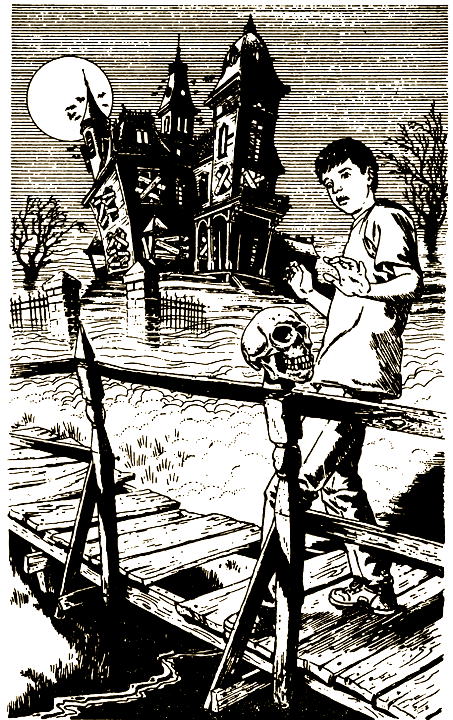

Ты приближаешься к замку. Вид у него заброшенный. Окна трех этажей заколочены, а в нескольких, что наверху, под самой крышей, горит свет.

По обеим сторонам крыши вздымаются две круглые башни. От ворот к крыльцу тянется мощеная дорожка, когда-то, видно, проходившая через лужайку, но теперь все вокруг поросло бурьяном. Запустение и смерть витают в воздухе вокруг этого угрюмого строения, а что-то ждет тебя внутри?..

С опаской поднимаешься на скрипучее деревянное крыльцо и видишь две черные двери. На каждой скалит зубы с огромным, зажатым в них кольцом отлитое из бронзы чудовище. Должно быть, надо постучать одним из колец.

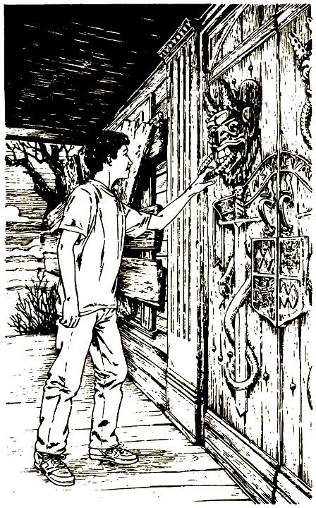

Бум-бум-бум! Грохот кольца по медной пластине эхом разносится внутри. Ты ждешь, когда откроют, но вместо этого слышишь грозный рык:

— Уноси ноги, если жизнь дорога!

От этого рыка по спине бегут мурашки и волосы встают дыбом. Чуть отступив, ты напоминаешь себе, что дело происходит в Луна-парке и страсти тут невсамделишные. Но спокойней на душе не становится. К страхам добавляется не слишком приятная мысль, что вообще-то никто тебя сюда не приглашал.

Ты берешься за кольцо и тянешь его на себя в надежде, что дверь окажется заперта. Но к твоему ужасу, она отворяется. Изнутри доносится дьявольский смех, еще более грозный, чем рык, который ты слышал только что.

Может, повернуть назад, пока не поздно? Ты здесь один, и никто не узнает, что ты струсил. Однако перед самим собой тоже стыдно: дошел, можно сказать, до цели — и на попятный!

[Сбежать](#64) или все же решишься [войти](#47)?

# 60

Сидя в джипе, вы любуетесь окрестностями. Вдруг Уолтер круто сворачивает в сторону, едва избежав столкновения с пикапом.

— Идиот! — восклицает Лесли. — Впервые за рулем, что ли?

Уолтер бледнеет и шепчет:

— Этого только не хватало!

Затем разворачивает машину и хватается за радиотелефон.

— Говорит Уолтер. Мимо нас только что промчался один из братьев Бок. По-моему, он движется к «Аллее Смельчаков». Мы чуть не столкнулись у «Разъяренного слона».

«Разъяренный слон» — это название ресторана, который попался вам на пути.

— А кто такие братья Бок? — спрашивает Сэм.

— Два гения. Им принадлежит идея создания Луна-парка для смельчаков. — Уолтер нервно трясет головой. — Практически все наши невероятные аттракционы придуманы этими близнецами-изобретателями.

— Изобретатель — и машину не умеет водить? — удивляется Лесли. — Может, у него с головой не в порядке?

— Да нет, — отмахивается Уолтер. — Водят они оба плохо. Но один к тому же не только плохой водитель, но и очень плохой человек. А поскольку они похожи как две капли воды, я не знаю, который из них чуть не сшиб нас в кювет.

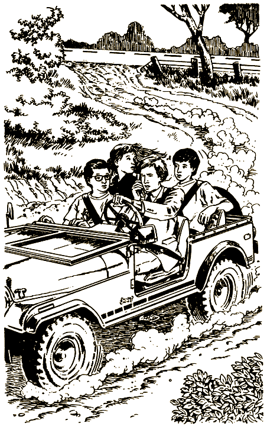

— А почему он плохой человек? — интересуешься ты.

— Да как тебе сказать? — вздыхает Уолтер. — Несколько месяцев назад у него появились странности. Боки — Ирвинг и Стэнли — работали вместе. Но Ирвинг вдруг заявил, что все аттракционы — его изобретение. А потом и вовсе спятил — стал предлагать далеко не безопасные зрелищные эффекты. Кончилось тем, что нам пришлось его уволить. И теперь он хочет отомстить.

— Представляю, как брат огорчился, — замечаешь ты.

— Стэнли его защищал, — говорит Уолтер. — Но в конце концов и ему пришлось признать, что Ирвинг не в себе. Со Стэнли нам было жаль расставаться, но что поделаешь, если они так похожи? И голоса одинаковые. Поэтому Ирвинг в любой момент может выдать себя за Стэнли. А кроме того, он проектировал этот парк, и ему известны здесь все ходы и выходы. Он даже разработал систему безопасности — ему ли не знать, как она действует?

— Да, неладно! — сокрушается Лесли.

— Надеюсь, его уже схвати…

Уолтер не успевает закончить фразу. Голубой пикап мчится прямо на вас, а за рулем сидит один из братьев Бок, сигналит, кричит что-то, трясет кулаком.

— По-моему, он хочет нас объехать, — предполагает Лесли.

Пикап летит прямо на вас, и Уолтер лишь в последнюю минуту давит на тормоз. Машины сталкиваются; джип три раза поворачивается вокруг своей оси и летит в придорожную канаву.

К счастью, все вы крепко пристегнуты ремнями — иначе бы вам крышка. А так пассажиры отделались несколькими ссадинами. Правда, Уолтер никак не может прийти в себя; вы втроем вытаскиваете его из джипа и укладываете на траву.

— Телефон испорчен, — сообщает Сэм (он пытался дозвониться в администрацию парка).

— Бедный Уолтер! — вздыхает Лесли. — У него глубокий порез над глазом. Где аптечка?

В нескольких метрах валяется разбитый пикап. При виде его у тебя все внутри холодеет. Но, к счастью, водитель, тщедушный человечек с взъерошенными седыми волосами, выбирается через окошко.

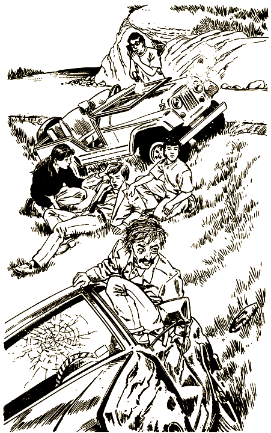

Ты уже позабыл, что он может быть опасен, и бросаешься к нему.

— С вами все в порядке?

Бок вроде и не слышит твоего вопроса, а смотрит туда, где Лесли и Сэм суетятся вокруг Уолтера, прикладывают компресс к его ране.

— Если б я знал, что за рулем он! — бурчит он. — Как можно сажать детей к нему в машину! Ведь он же никудышный водитель!

Бок с трудом ставит пикап на колеса, открывает покореженную дверцу и делает тебе знак:

— Давай, садись. Мне нужна твоя помощь. До открытия остается мало времени, одному не справиться.

Ты стоишь как болван, не понимая, чего хочет от тебя этот тип. А он, видимо, настроен серьезно, потому что вытаскивает из-за пояса пистолет.

— Ну что, тебя уговаривать надо?

Выхода нет. Садишься рядом с ним в кабину. Мотор, как ни странно, заводится. Бок вцепляется в руль и нажимает на газ. Видя, как ты проносишься мимо на пикапе, друзья разевают рты.

Бок лихо сворачивает с дороги в поля. Начинается жуткая тряска по кочкам. Этак все кости переломать можно, думаешь ты, пожалуй, почище американских горок будет!

Вы пересекаете поле и принимаетесь петлять по лесной тропе. Она такая узкая и неровная, что даже твой безумный водитель поневоле сбрасывает скорость. Чтоб не садануться головой в потолок пикапа, ты хватаешься за щиток.

Похититель так сосредоточен на управлении автомобилем, что на тебя и не смотрит. Скорость небольшая, прикидываешь ты, может, взять да и спрыгнуть на ходу? Среди деревьев легко затеряться.

И все же дело рискованное. Не исключено, что, прыгая из машины, ты ногу сломаешь или врежешься в дерево — лес-то густой. Однако времени на размышления у тебя нет.

Решишься [прыгать](#7) или сочтешь, что безопаснее [остаться](#109)?

# 64

— Ну нет! — говоришь себе ты. — С меня хватит этих страхов! — И бежишь обратно к мосткам.

Туман сгущается, ты продвигаешься почти вслепую. Но мысль работает. И с каждым ее поворотом тобой все больше овладевает паника. Скорей, скорей отсюда! Ты уже не заботишься о том, чтобы выйти на прежнюю тропинку, а бежишь прямо через лес. И вскоре понимаешь, что заблудился.

Надо собраться, успокоиться, а ты не можешь. Все мчишься вперед, не разбирая дороги. Ветви деревьев цепляются за одежду, ты запыхался и весь взмок.

Наконец выходишь на опушку, вдали виднеется твой отель. Облегченно вздохнув, направляешься к нему.

Но вскоре перед тобой возникает каменная ограда. Перелезть через нее — плевое дело, но за ней проходит ров десятиметровой глубины. И стена, и овраг тянутся в обе стороны, насколько хватает глаз.

Перелезаешь через ограду и спускаешься в ров. Затем с трудом выкарабкиваешься. Отряхиваешь джинсы и спешишь к отелю. Солнце уже садится, а тебе надо поспеть до темноты.

По эту сторону оврага раскинулась широкая долина, посреди которой островками высятся утесы. Обследуешь один из скалистых островков, и вдруг кровь застывает у тебя в жилах от низкого грозного рева.

Он доносится прямо из-за твоей спины. Ты с опаской поворачиваешь голову и оказываешься лицом к лицу с громадным леопардом. Передними лапами он уцепился за край утеса, и ты понимаешь, что он может достать тебя одним прыжком. Если, конечно, это настоящий леопард, а не робот, выполненный в натуральную величину.

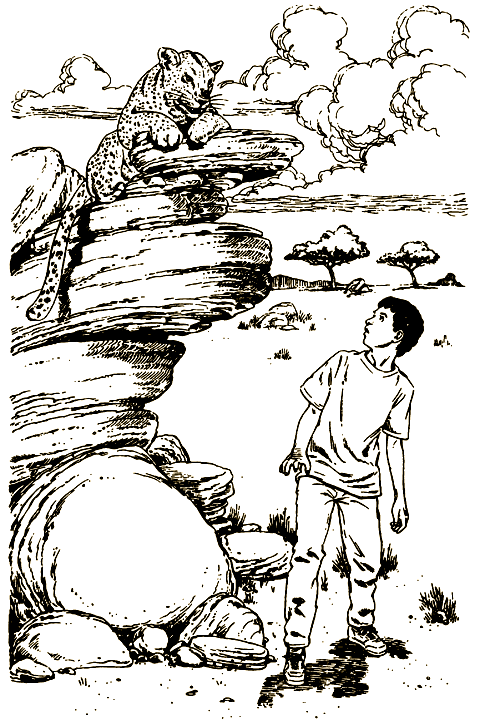

Возможно, это африканский пейзаж Луна-парка, рассуждаешь ты. Кажется, ты видел в проспекте название аттракциона: «Африканская охота-сафари», — где тебя возят на джипе и где непременно должны встретиться дикие звери и прочие ужасы. А если он все-таки настоящий?.. — думаешь ты. Такого опасного приключения в твоей жизни еще не было. Ты растерялся и отчаянно ищешь выход из положения. Все зависит от того, как быстро ты его найдешь.

По-твоему, леопард [настоящий](#81) или ты убедил себя в том, что это [робот](#86)?

# 79

— Я с вами, — заявляешь ты доктору Боку. — Очень хочется посмотреть, как работает аудиоаниматроника.

Он удивленно поднимает бровь.

— Ишь ты, каких слов нахватался! Нынче даже малолетки учеными стали. Ну что ж, пойдем. Раз ты такой умный, может, и постигнешь мой замысел.

Он отворяет проржавевшую железную дверь. За нею лестница ведет вниз.

— Сюда, — говорит доктор, и ты следом за ним спускаешься по ступеням.

Заброшенный замок выглядит так натурально, что ты почти уверен: сейчас тебе предстанет сырое и мрачное подземелье. А вместо этого вдруг оказываешься в чистом и светлом помещении, оборудованном по последнему слову техники: компьютеры, мониторы, телеэкраны и все такое прочее.

Доктор Бок указывает тебе на стул перед главным компьютером, а сам роется в шкафу.

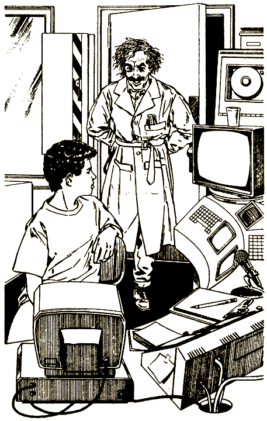

— Я рад, что ко мне в гости зашел парень, разбирающийся в технике… Ну вот, как раз то, что нужно!

Он подходит к тебе, что-то пряча за спиной. На его изжелта-бледном лице впервые за все время появляется улыбка.

Однако от этой улыбки у тебя мороз по коже. Надо бежать, думаешь ты, лестница рядом. Но вдруг твои страхи напрасны? Скорей всего, он просто безобидный чудак, и, улизнув от него, ты упустишь случай разобраться в механике всех этих сказочных аттракционов.

Обратиться [в бегство](#87) или рискуешь [остаться](#98)?

# 80

Ты решил, что расстегивать ремни — не самая удачная идея. Вместо этого пытаешься сбросить напряжение и терпеливо ждешь подмоги. Тебя подташнивает, и в глазах мутится. Неужели этот «Дервиш» может закружить до смерти?..

Через десять часов ты получаешь ответ на свой вопрос, когда какой-то охранник вдруг замечает, что «Безумный Дервиш» работает, хотя все испытатели давно разошлись по домам.

К этому времени у тебя и у Тома такое чувство, будто вы превратились в студень. Ни встать, ни даже ногой шевельнуть вы не можете. Вот когда ты на собственной шкуре испытал, что Земля вращается.

За ночь врачи приводят тебя в норму, а наутро в сопровождении гида ты отправляешься домой. Шагая к самолету, думаешь: удастся ли еще побывать в Луна-парке для смельчаков? Да и захочется ли?..

#### КОНЕЦ

# 81

Леопард явно изготовился к прыжку. У тебя холодеют руки и ноги.

Ты знаешь, что хищников лучше не дразнить, поэтому стоишь как вкопанный и, по возможности, стараешься не дышать.

Время идет. То и дело леопард угрожающе рычит, а ты боишься шелохнуться.

Стемнело. На небо высыпали звезды. В отеле одно за другим загораются окна. А ты стоишь тут среди ночной пустыни один на один с леопардом.

Стоишь и сам себе удивляешься: как до сих пор не умер от страха и усталости?

Так проходит целая ночь. Едва рассвело, вдали появляется джип. Водитель выходит из кабины, меряет тебя взглядом, потом леопарда и снова тебя.

— Не бойся, парень, он не тронет. Это же не настоящий леопард, а робот.

Переводя дух, ты валишься на траву как подкошенный. Слезы градом катятся по лицу, а ноги от многочасового стояния свело судорогой.

Ты чувствуешь себя круглым идиотом.

— Представляю, что вы там обо мне подумали! — говоришь ты, качая головой и не сводя глаз с леопарда. — Стоит перед роботом всю ночь, как последний болван и трус!

Молодой водитель в майке с напечатанным призывом «Спасите китов!» вполне серьезно откликается:

— Вовсе нет. Так и было задумано, чтоб люди верили, что наши роботы настоящие. Иначе игра не стоит свеч.

Он помогает тебе забраться в кабину и по радиотелефону докладывает:

— На связи Эд Джексон. Я нашел пропавшего смельчака. — Потом слушает, что говорят ему в ответ, кладет трубку и сочувственно похлопывает тебя по плечу. — Как ни жаль, приятель, но ты нынче же полетишь домой. Слишком много с тобой хлопот.

Ты обреченно вздыхаешь, воображая, сколько интересного мог бы увидеть, если б не лез в смельчаки, когда тебя не просят!

#### КОНЕЦ

# 86

Ты улепетываешь так, что пятки сверкают. Леопард-робот, конечно, не станет тебя преследовать. Пролетев метров двести, с замиранием сердца оглядываешься: хищник по-прежнему стоит на утесе и устрашающе ревет. Так и есть, липа!

Облегченно вздохнув, спешишь к отелю. К ужину опоздать никак нельзя, иначе придется объяснять, где был. Но темнеет здесь быстро, и ты поневоле замедляешь шаг. На часах без пяти шесть. Только чудом ты можешь поспеть вовремя.

И чудо является, как по заказу: позади светятся фары джипа. Если он тебя подбросит, то через минуту-другую ты будешь в отеле. Скорее всего, за рулем служитель Луна-парка; какое ему дело до того, что занесло тебя сюда?

Ты выходишь на дорогу и машешь руками водителю, чтоб остановился. Джип мчится прямо на тебя. Он уже в десяти метрах и вроде не собирается сбрасывать скорость. Странно! Ты не трогаешься с места. Наверняка остановится.

Но он не останавливается. Перед тем как ощутить страшный удар бампером, ты успеваешь взглянуть в лицо водителю. У него улыбка робота. Ну, уж если леопарду не удалось тебя одурачить, то этому и подавно. Ты отлично понимаешь, кто он, однако от этого тебе не легче.

#### КОНЕЦ

# 87

Не желая рисковать, ты взлетаешь по лестнице и ощупью пробираешься по темному замку. Нащупываешь дверную ручку — дверь открывается. Ты выходишь на задний двор, заваленный пустыми банками из-под краски, грудами щепок, сломанными роботами. Стараешься не шуметь, поэтому путь обратно к мосткам занимает довольно много времени.

Шагов не слышно, и ты, набравшись смелости, оборачиваешься. Никого! Ну, слава Богу, наверно, доктор Бок все еще разыскивает тебя внутри замка!

В густом тумане почти ничего не видно. Нетрудно догадаться, кто его напустил. Ты еще раз оглядываешься и видишь, как дверь отворяется. Доктор Бок бежит за тобой, размахивая руками.

Ты даешь деру не разбирая дороги. И вдруг проваливаешься в пустоту.

Стоя по колено в воде, смотришь вверх на мостки. В них не хватает нескольких досок. Не иначе, мерзавец доктор их вытащил, пока ты блуждал по двору.

Удирая от вероломного доктора, ты пускаешься вплавь. Кажется, спасен! В уме ты уже репетируешь свой рассказ репортерам о приключениях на острове Трансильвания.

Но ты рано обрадовался. Впереди слышится грохот: тебя неудержимо несет к водопаду. Заманчивая перспектива, будь это очередной аттракцион Луна-парка. Но, к несчастью, водопад настоящий.

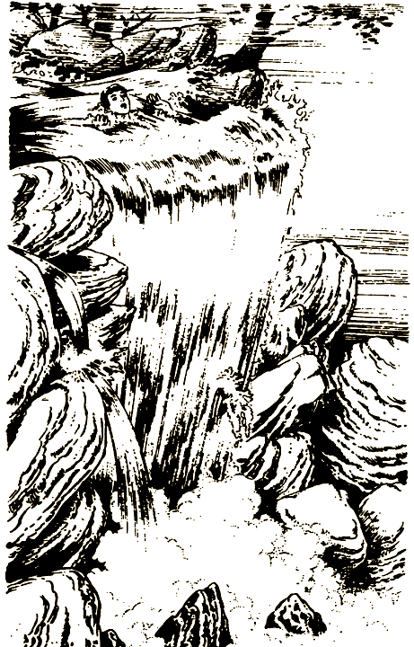

#### КОНЕЦ

# 98

Внушив себе, что бояться нечего, ты улыбаешься в ответ доктору Боку. Внезапно он жестом фокусника выхватывает из-за спины веревку и накрепко привязывает тебя к стулу.

— Эй! Вы чего?! — кричишь ты, отбиваясь руками и ногами.

Но в следующий момент чувствуешь во рту платок. Мотаешь головой, однако доктору удается как следует закрепить кляп. Ты нем и беспомощен.

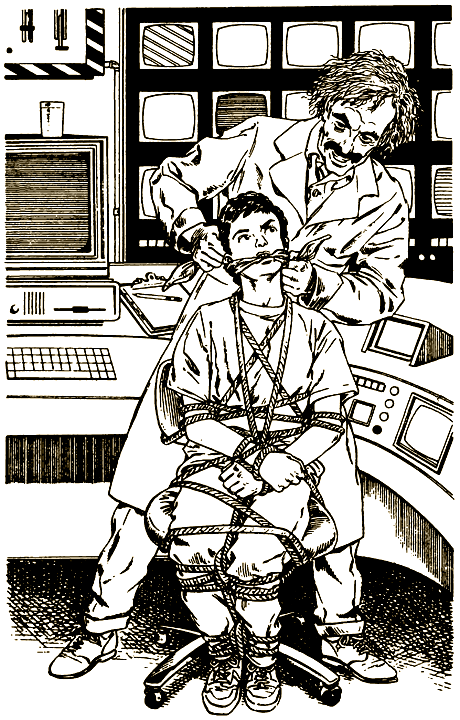

Трудно представить, что тебя ожидает, но, как ни странно, ты скорее рассержен, чем испуган. И негодуешь больше на себя самого. Сперва попался в ловушку, потом сидел тут, как дурак, и ждал, пока этот псих отыщет веревку!

Теперь деваться некуда: сиди себе на стуле и не рыпайся!

Тем временем доктор Бок нажимает кнопку на компьютере. Тут же вспыхивает один из экранов. Ты узнаешь мрачный вестибюль замка. Рыцарский доспех начинает медленно двигаться к видеокамере.

Доктор Бок нажимает вторую кнопку, включает еще один монитор. По большому залу перемещается скелет.

— Смотри, ну как живой! — с гордостью говорит доктор Бок. — Я двадцать два года работал над этой аниматроникой, и теперь моих вампиров и призраков никто не отличит от настоящих.

Он все больше возбуждается, рассказывая о своих творениях; в глазах безумный блеск. Точно одержимый носится он по комнате от одного компьютера к другому, давит на кнопки; экраны показывают все новые комнаты замка.

— И для чего это все? — спрашивает он. — Чтоб меня уволили за неделю до открытия?! — Он глядит на тебя; его левая бровь сильно подергивается; на лбу вздулись жилы. — За что?.. — вопрошает он, дрожа от ярости. — Да потому, видите ли, что мои блестящие эффекты, мои легендарные аттракционы чересчур опасны! — Он плюхается на стул подле тебя. — Что же мне делать? — говорит он тихо и обреченно.

Несмотря на страх, ты восхищен представлением полоумного доктора. Этот тип явно жаждет славы, а ты — единственный зритель. Надо как-нибудь довести до его сознания, что тебе крайне интересно все происходящее. Тогда, может, и выпутаешься из опасной переделки.

Однако трудно уследить за сменой его настроений. Взгляд из обреченного становится вызывающим. Бок вскакивает со стула и бежит к телемониторам.

— Но сегодня я снова на коне! — восклицает он. — Остров Трансильвания — мое величайшее изобретение — станет орудием чудовищной мести.

Он выдвигает какой-то ящик и начинает выкладывать на пол шашки динамита. Какой ужас! Взрывчатки хватит, чтобы разметать в пух и прах весь остров.

— Я заложу динамит в компьютер. И поставлю взрывное устройство на завтра после полудня.

Ты киваешь и мычишь сквозь платок:

— О-о о-а а а-о а-а…

Доктор Бок с любопытством глядит на тебя. Ему явно не терпится услышать комплимент в свой адрес, поэтому он вытаскивает кляп.

— Что-что?

— Такого аттракциона я еще не видал, — переводишь ты на человечий язык. — Жалко, что больше никто не сможет им полюбоваться.

Доктор Бок поигрывает на ладони шашкой динамита. Ага, задумался, значит, есть надежда! Ты начинаешь развивать свою идею:

— По-моему, сэр, несправедливо лишать публику такого зрелища. Ведь, несмотря ни на что, остров Трансильвания остается вашим гениальным изобретением.

Доктор Бок, не выпуская из рук динамит, внимательно смотрит на тебя.

— Надо, чтобы весь мир узнал, кому в действительности принадлежит заслуга создания Луна-парка для смельчаков. — (Ты говоришь как по писаному.) — Держу пари, скоро у вас не будет отбоя от журналистов, от приглашений выступить по телевизору, написать книгу! Про вас будут фильмы снимать — целые сериалы! — (Во загнул!).

Доктор Бок откладывает взрывчатку.

— Ты вправду так думаешь? — заинтересованно спрашивает он.

Ты улыбаешься во весь рот.

— Еще бы! Знаете, что мне пришло в голову? Почему бы не устроить пресс-конференцию прямо здесь? Созовем газетчиков, телевизионщиков, и вы поведаете им о своей грандиозной работе, А я готов подтвердить это как очевидец.

Доктор Бок запускает пальцы в свою седую гриву.

— Вообще-то у меня была мысль обратиться в прессу… — Но он тут же умолкает.

— Если вы окажете любезность меня развязать, — вкрадчиво говоришь ты, — я тут же начну обзванивать все газеты. Вот увидите — репортеры слетятся как мухи на мед.

Доктор Бок нерешительно переминается с ноги на ногу.

— Неужто вы хотите разрушить дело всей жизни, даже не получив должного признания? — спрашиваешь ты.

Это его добило. Он развязывает опутавшую тебя веревку, а ты стараешься не показать ему, как дрожат руки. Тебе удалось подольститься к доктору Боку, но ты понимаешь, что один неверный шаг может оказаться роковым.

Наконец руки у тебя развязаны, ты потираешь их и бросаешься к телефону.

Но доктор Бок отталкивает тебя.

— Нет уж, лучше я сам, — заявляет он.

За несколько минут он обзвонил все местные газеты и телевидение. Скоро журналисты явятся в лабораторию.

— Что я говорил?! — восклицаешь ты. — Им не терпится взять у вас интервью. Давайте немного здесь приберем к их приходу. Я смотаю веревку, а вы спрячете динамит.

Доктор Бок с готовностью убирает шашки. Ты заговариваешь ему зубы, пока снаружи не раздается рев мотора.

— Вот и они! — радуешься ты. — Пойду встречу!

— Зачем? — возражает Бок. — У меня все продумано.

Он говорит в микрофон:

— Добро пожаловать! Я — доктор Бок. Прошу вас, проходите в дверь слева. — Он нажимает кнопку на щитке. — Спускайтесь по лестнице в мою лабораторию, где состоится пресс-конференция.

Он смотрит на тебя, явно ожидая восхищения.

— Толково придумано, — одобряешь ты.

На лестнице слышатся шаги, и вскоре в дверном проеме возникает молодая женщина. За ней следуют двое мужчин — у одного в руках видеокамера, у другого осветительная аппаратура.

— Позвольте представиться: Жанетта Уоллес, ведущая пятого канала, я готовлю шестичасовые новости. — Женщина оглядывает помещение, подходит к доктору Боку и берет его под руку. — Вам лучше встать вот здесь, перед вашими мониторами.

Ты размышляешь, какой бы знак им подать, чтобы вызвали полицию, но все происходит слишком стремительно. Операторы устанавливают оборудование, а мисс Уоллес советует доктору Боку держаться перед камерой как можно раскованнее. Ладно, пускай берут свое интервью, а я пока придумаю, что делать, решаешь ты.

Мисс Уоллес берет в руки микрофон.

— Я — Жанетта Уоллес. Мы ведем репортаж из Луна-парка для смельчаков, где проходит операция по задержанию известного преступника доктора Ирвинга Бока.

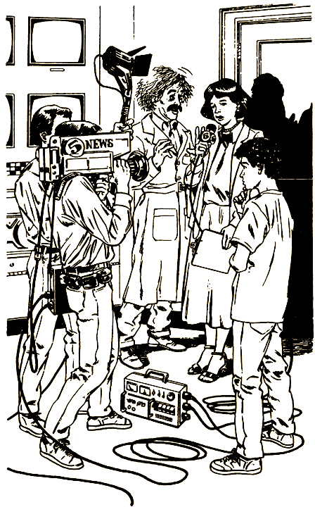

У Бока отвисла челюсть. Двое операторов хватают его под руки.

Мисс Уоллес показывает ему значок.

— Мы переодетые сотрудники полиции. После вашего звонка газеты немедленно поставили нас в известность. Мы давно за вами следим.

Доктор Бок с ненавистью смотрит на тебя.

— Ты меня обманул!

— Нет, — отвечаешь ты. — Я в самом деле еще не видел такого аттракциона.

Час спустя президент компании, слушая твой рассказ о событиях на острове Трансильвания, потрясенно качает головой.

— Судя по всему, он действительно собирался взорвать замок. — Он снимает трубку и отдает распоряжение: — Немедленно проверить все аттракционы и места общественного питания. До тех пор пока не будет гарантии полной безопасности, мы не можем открыть Луна-парк.

На пути домой ты гадаешь, пригласят ли тебя сюда еще раз, учитывая твою помощь в разоблачении преступных планов доктора Бока, или, наоборот, больше близко к парку не подпустят за то, что ты нарушил инструкции.

Там видно будет!

#### КОНЕЦ

# 102

«Черная Дыра» похожа на другие американские горки, какие ты уже видел, только здесь все выше, круче, грандиознее.

Ты усаживаешься на переднее сиденье; Лесли и Сэм поместились сзади. Служитель Луна-парка проверяет, надежно ли закреплены ремни безопасности.

Подъем длится слишком долго — это действует на нервы. Но вот вы уже почти у самой вершины. Ты выгнул шею, чтобы взглянуть вниз. С такой высоты виден весь парк, но он кажется малюсеньким, игрушечным.

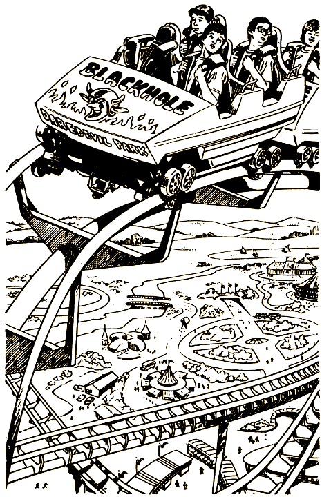

— Ох, зря мы, наверно… — неуверенно шепчет Лесли.

— Да не бойся, — разуверяет ее Сэм. — Здесь безопасно, иначе бы нас не пустили. Ух ты, красотища! Я был в Диснейленде, в «Шести Флагах» и в других парках, а такого еще не видывал.

Кабина слегка покачивается.

— Поехали! — тихонько говоришь ты, видя, как нос ее высовывается над гребнем горы.

Четыре с половиной минуты вы летите в бездну. Сначала ты испытываешь невесомость, потом, напротив, тело точно каменеет. Жуткие погружения, стремительные повороты, мертвые петли — все как обычно. Но «Черная Дыра» благодаря своим размерам доставляет тебе вчетверо больше острых ощущений, чем прочие аттракционы.

Вы летите к стоянке, и, увидев впереди нечто странное, ты через плечо оглядываешься на Сэма и Лесли. Они сидят бледные как полотно.

— Вот ужас! — выдохнул Сэм.

Что это? Вместо того чтобы остановиться, вы поворачиваетесь вокруг своей оси и снова начинаете движение — только задом наперед. Это уж не «Черная Дыра», а какой-то антимир!

Двигаться назад еще страшней и муторней, чем вперед. Когда вы прошли последнюю мертвую петлю и едва не вылетели из кабины на резком повороте, вам кажется, что вы больше и на ноги-то не встанете.

И вправду, без помощи служителя на старте вы бы, наверное, не сошли на землю. Еще минут десять вас шатает из стороны в сторону, и вы смеетесь как ненормальные.

Но вот наконец все внутри перестало трепыхаться, голова больше не кружится, и вы на твердых ногах идете к джипу Уолтера.

— Куда теперь? — спрашивает он.

Вы переглядываетесь. Глупый вопрос!

— К «Отчаянному Горнолыжнику»! — кричите вы дружным хором.

— Слушаюсь! — кивает Уолтер, и вы пускаетесь [в путь](#60).

# 107

Через полчаса ты стоишь на вершине горы в лыжных ботинках и в специально оборудованном шлеме. Трудно сказать, действительно ли ты ощущаешь свист ветра в ушах, или все это шумовые эффекты.

С ужасом ты смотришь на заснеженную трассу; перед тобой распахиваются стартовые ворота. Вцепившись в лыжные палки, ныряешь вниз и летишь по склону.

Дыхание перехватывает. Как пить дать сейчас упадешь и покатишься кубарем. Но что за чудо? Лыжи плавно скользят по снегу, и тело твое во всем повинуется электромагнитному управлению. Сначала спуск ровный, широкий, ты движешься большими зигзагами, оставляя за собой красивый волнообразный след и наслаждаясь равновесием, какого прежде не испытывал. Ты и впрямь в один миг стал заправским горнолыжником.

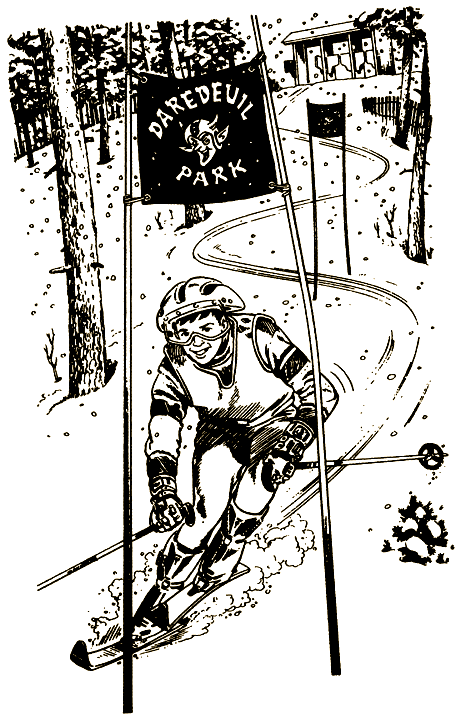

Потом трасса сужается: значит, ты должен показать еще более высокий класс. Наращиваешь скорость; в глазах полнейшая муть. И вдруг вместо пушистого снега ощущаешь под ногами лед. Лыжи звонко дребезжат по нему.

Ты подпрыгиваешь, перетряхивая все внутренности. Впереди припорошенная снегом площадка, а за ней — пустота.

Ты из последних сил стараешься не сойти с дистанции, но у магнитного устройства, управляющего тобой, видимо, другие планы. Тебя подбрасывает в воздух, и ты всем телом подаешься вперед.

Паришь в воздухе; время словно оборвалось. Как ни странно, ты хорошо приземлился и продолжаешь скользить по лыжне.

Теперь от тебя требуется мастерство слаломиста. По обеим сторонам трека ты видишь толпы болельщиков. Они кричат, свистят, подбадривая тебя. Внизу на земле расстелено полотнище, обозначающее конец скоростного спуска.

Флажки, отмечающие слаломный отрезок трассы, остались позади. Теперь от финиша тебя отделяет лишь отвесный ледяной склон. Ты скрючился, вопишь во всю глотку и устремляешься вниз.

Под приветственный рев толпы пересекаешь линию финиша и читаешь на табло, что показал скорость сто сорок пять километров в час. Ты выпрямляешься, победно поднимаешь руки и скользишь к кабине главного арбитра состязаний.

Тебе помогают снять шлем — и тут же толпа, снег, лыжная трасса бесследно исчезают. Не верится, что все пережитые тобой ощущения нереальны. Ведь ты страшно устал, и ноги дрожат мелкой дрожью.

— Специальное устройство заставляло вас выполнять непривычные движения, — объясняет Уолтер, подвозя тебя и твоих друзей к американским горкам. — Эффекты столь правдоподобны, что человек невольно напрягает мышцы. Далеко не всякий выдержит физическую нагрузку «Отчаянного Горнолыжника». Мы допускаем на трассу только тех, кто находится в прекрасной форме.

— А как вы можете об этом судить? — спрашивает Лесли.

— Да очень просто, — отвечает Уолтер. — Чтобы попасть на трассу, необходимо принести медицинское свидетельство. К счастью, вы все совершенно здоровы.

— А-а! — Ты хлопаешь себя по лбу. — Я-то думал, зачем вам понадобилась справка [от врача](#60)?

# 108

Ты предпочел видеоигры. Первым делом осматриваешь номер. Вот бы пригласить сюда всех друзей и повеселиться на славу. Кровать широченная, есть еще раскладной диван. На телевизоре с громадным экраном стоит видеоприставка.

Ты зажигаешь свет в ванной. По размерам она не уступает вашей гостиной, и вся в мраморе, в зеркалах. А ванна!.. Да это ж целый бассейн — хоть вдоль ложись, хоть поперек. И можно включить водный массаж — отлично снимает усталость после целого дня бешеных гонок.

Плюхаешься на кровать, врубаешь приставку. А что, если поиграть, лежа в ванной?..

Наполняешь ванну, выливаешь туда бутылочку шампуня, включаешь гидромассаж. Вода крутится, точно в омуте, и покрывается мыльной пеной.

Так, теперь подвинем телевизор — а то он слишком далеко и экран смотрит в другую сторону. Но это, оказывается, непросто: телевизор стоит на подставке, намертво прикрепленной к полу.

Тебя вдруг осеняет идея: в коридоре, прямо перед дверью, стоит тележка, на которой привозят в номер еду из ресторана. Чем не подставка для телевизора?

Открываешь дверь. Тебе повезло: тележку не убрали. Ты мигом стряхнул остатки пищи и вкатываешь ее к себе в номер.

Да, могла бы быть и поустойчивей, думаешь ты, взгромождая на тележку довольно тяжелый телевизор. Надо еще проверить, чтобы провод не угодил под колесо, и развернуть экран в сторону ванны.

Ну, вперед!

Ты разделся, погасил свет и включил потрясающую игру — называется «Четвертое Июля». И вот вступаешь в облако мыльной пены.

Отлично! Телевизор так близко, словно ты сам находишься посреди фейерверка, сверкающего на экране… Ох, черт, пульт остался на кровати! Что делать? Не вылезать же из ванны? Лучше придвинуть вплотную телевизор.

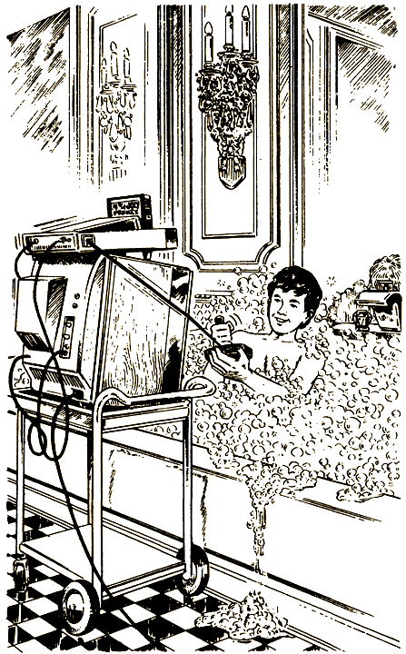

Встаешь на ноги. Дно ванны слишком скользкое: наверно, ты перелил шампуня.

Тебе известно, что мокрыми руками электроприборы лучше не трогать, потому ты тянешься за полотенцем, что висит на крючке прямо над телевизором.

Полотенце огромное, как и все в этом отеле; сдернуть его с крючка не так-то просто. Ты поскользнулся, а ухватиться не за что.

Плюх! — падаешь обратно в ванну. Выныриваешь, весь в мыле, и снова протягиваешь руку к полотенцу, чтоб стереть с глаз проклятую пену.

К несчастью, краем полотенца ты задеваешь телевизор и опрокидываешь его с шаткой тележки прямо в ванну.

Рвущиеся на экране хлопушки гаснут в воде, потом тебя пронзает молниеносный электрический разряд, и ты даже не успеваешь почувствовать боли.

#### КОНЕЦ

# 109

Как бы ни были плохи твои дела, все же это безопаснее, чем прыгать на ходу, решаешь ты.

Километра полтора вы тащитесь по грязной тропе, и наконец лес редеет. Бок останавливает машину близ мощеной дороги и озирается — опасливо, словно хищный зверь, перед тем как выйти из норы.

— Уже недолго осталось…

Вроде он немного успокоился, и ты рискуешь завязать с ним разговор:

— А куда мы едем, мистер Бок?

От невинного вопроса он снова приходит в ярость.

— Доктор Бок! Ты что думаешь, Луна-парк для смельчаков может быть творением какого-то «мистера»? У меня, между прочим, три ученых степени!

— Извините, доктор Бок, я не хотел вас обидеть, — поспешно поправляешься ты.

Похититель сверлит тебя глазами.

— Все мои изобретения опираются на строго научную основу. — Он сокрушенно вздыхает. — Впрочем, кому я это объясняю? Если даже родной брат считает, что мои аттракционы опасны. — Бок опять глядит по сторонам и, убедившись, что поблизости никого нет, катит по дороге. — В Киддиленд, — мрачно бросает он.

— Что-что, простите?

— Ты хотел знать, куда мы едем. Так вот, мы едем туда, где им и в голову не придет меня искать. К их дурацкому Киддиленду я не имею никакого отношения.

В Киддиленде все словно игрушечное. Аттракционы для сопливых малышей. Доктор Бок огибает цепочку маленьких розовых слоников и въезжает в гараж.

— Без фокусов! — приказывает он и похлопывает по торчащей из-за пояса рукоятке.

Ты как раз занят обдумыванием очередного «фокуса», но под угрозой пистолета как-то ничего не приходит в голову. Ты послушно вылезаешь из пикапа и помогаешь доктору Боку накрыть машину брезентом.

Бок ведет тебя к занятной карусели. Будь тебе пять лет, ты пришел бы в восторг.

Он открывает дверь в маленькую кабину и знаком приглашает тебя внутрь.

— Управлять каруселью предельно просто, — объясняет он, указывая на металлическую панель с кнопками и рычажками. — Вот здесь включаешь. А это… — он касается пальцем другого рычага, — регулятор скорости. — Затем лезет в карман за отверткой, снимает панель, и ты видишь сеть проводов. — Надо сделать так, чтобы каждого, кто взгромоздится на этих лошадок, ждал особенный сюрприз.

Доктор Бок наклоняется и начинает копаться в проводах.

Дай-ка я заговорю ему зубы, думаешь ты, и незаметно выхвачу у него пистолет.

— Какой сюрприз? Приятный?

Доктор Бок выстреливает в тебя глазами.

— Для тех, кто любит быструю езду.

— Так вы собираетесь увеличить скорость? — спрашиваешь ты, пытаясь его раззадорить. — Вот здорово!

Доктор приподнимает бровь.

— Здорово? Ничего здорового! — Он привинчивает панель, а сам дрожит от ярости. — Вам, соплякам, все здорово! — Он хватает тебя за плечи и начинает бешено трясти.

Ты и не думал, что это будет так просто. Пока он тебя трясет, вырываешь у него из-за пояса пистолет и приставляешь к животу.

Потом отходишь на шаг, продолжая целиться.

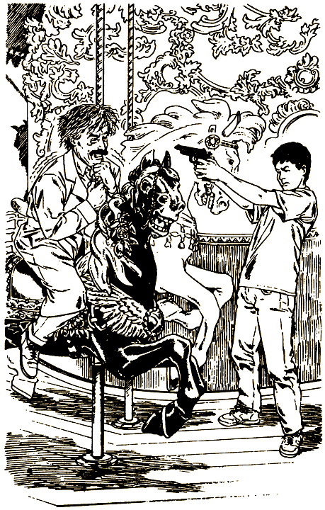

— К двери! — командуешь ты и, когда он поворачивается, подталкиваешь его в спину стволом. — Ну, доктор, не хотите ли отведать собственного лекарства?

— Ох, нет! — пугается он. — Только не это!

Ты подводишь его к черной лошадке.

— Садитесь!

Доктор Бок влезает, трясущимися руками хватается за шест. Держа его под прицелом, ты вбегаешь в будку и включаешь карусель.

Звучит музыка — чудный вальс. Карусель крутится все быстрей и быстрей. Ты устанавливаешь регулятор скорости в верхнее положение, чтобы доктор ни в коем случае не смог спрыгнуть.

Долго ждать не приходится: к будке одна за другой подкатывают полицейские машины. Молодой лейтенант подбегает к тебе.

— Прошу вас, лейтенант. — Жестом ты указываешь на бешено вертящуюся карусель.

Полицейский сдвигает на затылок фуражку и переводит удивленный взгляд с тебя на Бока.

— Не знаю, как тебе это удалось, — говорит он, — но вижу, что ты смелый парень.

Приятно, когда тебя почитают героем. А вот в том, что администрация решила отложить открытие, пока не будут проведены повторные испытания, приятного мало.

Уолтер уныло плюхается рядом с тобой на сиденье лимузина, который должен доставить вас к самолету.

— Это место наверняка сглазили, — заявляет он. — Боюсь, ты, Лесли и Сэм так и останетесь единственными смельчаками в мире.

Ты от души надеешься, что он окажется не прав, ведь все вы получили приглашение вернуться сюда, когда парк наконец-то откроется. Даже страшно подумать, что ты никогда больше не увидишь «самых удивительных чудес на свете»!

#### КОНЕЦ

# 112

Руки отяжелели, голова будто свинцом налита, но ты все-таки изловчился и отстегнул ремни. Облегченно вздыхаешь и смотришь вниз: метрах в трех стремительно вращается земля.

Центробежная сила удерживает тебя в клетке, и ты начинаешь передвигать по ней свое невероятно отяжелевшее тело. До пульта какой-нибудь метр, но кажется, проходит целая вечность — четыре тысячи круговращений и около двухсот подъемов и спусков, — прежде чем ты достигаешь цели.

Наконец пальцы нащупали гладкий металлический пульт.

— Есть! — кричишь ты, хватая его.

Стоп машина! Видимо, на радостях ты нечаянно нажал кнопку. Клетка резко останавливается, и ты летишь вниз — а дна-то нету! Пытаешься уцепиться за что-нибудь рукой, ногой — безнадежно! Ничто не удержит тебя от падения с трехметровой высоты.

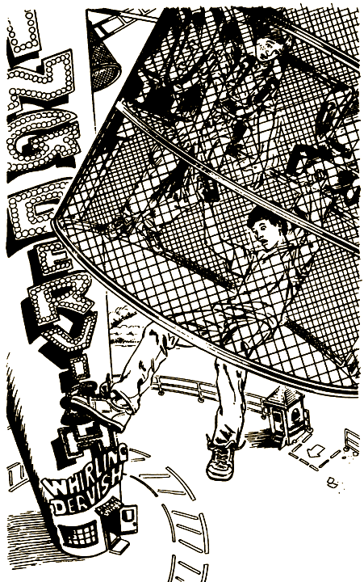

На беду, когда ты нажал кнопку, клетка находилась в верхнем положении, иначе ты, может, и уцелел бы. А так в мире стало одним смельчаком меньше.

#### КОНЕЦ
