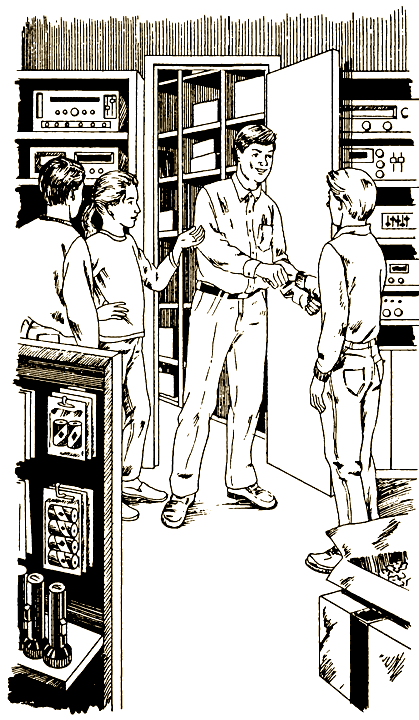

# 0

## Дуг Уилхелм

# МЕСТО ПРЕСТУПЛЕНИЯ

#### Посвящается Кристоферу Уилхелму

Не читай эту книжку по порядку, от начала до конца. Ведь это игра, где тебя ждет множество разных приключений, если ты хочешь разоблачить заговор, зреющий в твоем родном городе.

Твои приключения будут зависеть только от тебя. И отвечать за все будешь ты. Когда примешь решение — следуй инструкциям, и тогда, узнаешь, что с тобой произойдет дальше.

Прежде чем действовать, хорошенько все обдумай. Люди, с которыми ты вступаешь в борьбу, безжалостны и способны на все, лишь бы их планы осуществились. Тебе одному известно, что они задумали, но сможешь ли ты остановить их? Если попытаешься, будь готов ко всему.

Успеха тебе!

### ОБ АВТОРЕ

Дуг Уилхелм — писатель и редактор, автор книги «The Forgotten Planet» из серии «Выбери себе приключение». Он пишет статьи и еженедельные обзоры для газет и журналов. Живет он в Монпелье, штат Вермонт, у него есть сын Брэдли, которому шесть лет.

### О ХУДОЖНИКЕ

Том Ла Падула окончил Парсонскую художественную школу и получил степень бакалавра искусств, после этого он продолжил образование в Сиракузском университете и получил ученое звание магистра искусств.

Более десяти лет Том работает в американских и международных журналах, рекламных компаниях и издательствах. Кроме того, он ведет курс художественного иллюстрирования в Институте Пратта.

Том Ла Падула проиллюстрировал «The Luckiest Day of Your Life» и «Secret of the Dolphins» в серии «Выбери себе приключение». Он живет в Нью-Рошелл, штат Нью-Йорк, вместе с женой, сыном и дочерью.

#### [Начать приключение](#1)

# 1

Лето на исходе, и ты только что приехал домой от бабушки с дедушкой, у которых гостил полтора месяца. Там было здорово, но ты рад вернуться в родной Грэнтшайр, маленький городок в штате Вермонт. На следующее утро ты отправляешься на велосипеде к большущему пустырю на окраине. Для взрослых это всего-навсего запущенный участок: трава, кусты да деревья. Но ты со своими друзьями называешь его бейсбольным полем, знаешь здесь все потаенные места, все тропинки, в течение многих лет протоптанные ребятами, играющими в бейсбол.

Ваше воображение превращало старый пустырь в место действия многих приключений: это и Фенуэй-парк, база вашей обожаемой бейсбольной команды «Бостон Ред Соке», и непроходимые джунгли на берегах Амазонки, и тропический остров, где зарыты награбленные пиратами сокровища.

Но едва ты подъехал к пустырю, тебя точно обухом по голове ударило. Дорогу тебе преградило большое объявление:

**СТРОИТЕЛЬСТВО ТОРГОВОГО ЦЕНТРА «КЛЕНОВАЯ РОЩА»**

**ДЕВЯНОСТО СЕМЬ МАГАЗИНОВ!**

**ПРОХОДА НЕТ**

Ты глазам своим не веришь. Поворачиваешь велосипед и, вовсю нажимая на педали, мчишься в Агентство Хорнбека по продаже и аренде недвижимости, где служит твоя мать. Когда ты вбегаешь, она разговаривает по телефону. Однако, увидев твое лицо, быстро прощается и кладет трубку.

— Что случилось? — спрашивает она.

— Мама, наше бейсбольное поле хотят уничтожить!

— Ах, голубчик, извини, я хотела раньше тебе сказать! Ты только представь — большой торговый центр! И знаешь, твои друзья очень рады.

Ты пожимаешь плечами:

— Что ж, может, это и хорошо. Но почему на нашем поле?

В нескольких кварталах от агентства ты встречаешь своих лучших друзей, Кори и Кейт. Они сидят на крыльце дома Кори.

Увидев тебя, они радостно вскакивают.

— Привет, ребята! — говоришь ты. — Слышали про торговый центр?

— А что, здорово! — восклицает Кейт. — Там, наверно, и большой магазин электроники будет.

— И видеозал, и магазин пластинок, и пиццерия, — подхватывает Кори. — Наконец-то будет куда пойти.

— Похоже на то, — отвечаешь ты. — Но лучше бы они выбрали другое место.

— Да эти парни что хотят, то и воротят, — пожимает плечами Кори. — Становиться им поперек дороги опасно.

— В каком смысле? — спрашиваешь ты.

Кори протягивает тебе местную еженедельную газету «Грэнтшайрское обозрение»:

— А вот — прочитай.

Ты берешь газету, и твое внимание привлекает заголовок:

**ИСЧЕЗНОВЕНИЕ МУНИЦИПАЛЬНОГО СОВЕТНИКА**

**ФРЭНК СОРРЕЛ — ЕДИНСТВЕННЫЙ ПРОТИВНИК ТОРГОВОГО ЦЕНТРА**

Ты пробегаешь заметку и узнаешь, что Грэнтшайрский городской совет вскоре должен принять решение: давать ли «добро» проекту строительства торгового центра «Кленовая роща» или нет. Из членов совета лишь один был против строительства — это Фрэнк Соррел, отставной следователь нью-йоркской полиции. Но на прошлой неделе Соррел отправился на рыбалку и до сих пор не вернулся.

«На данном этапе полиция еще не начала бить тревогу, — сообщает газета. — Но имеются сведения, что для выяснения обстоятельств из Нью-Йорка приезжает дочь советника, адвокат Анджела Соррел».

Остаток дня ты проводишь в размышлениях о торговом центре. Неужели его владельцы устранили Фрэнка Соррела? Не верится, что подобное может произойти в Грэнтшайре.

Вечером ты снова отправляешься к дому Кори. Хочешь все это с ним обсудить.

Ты решаешь подойти к дому Кори одному тебе известной дорогой: пересекаешь автостоянку городского супермаркета, который уже закрыт, перелезаешь через проволочную ограду, подтягиваешься на руках и оказываешься верхом на ветви большой старой яблони позади дома Кори.

Только ты собрался спрыгнуть наземь, как из-за угла супермаркета появляется длинный черный автомобиль с погашенными фарами и останавливается прямо под тем деревом, на котором ты сидишь. Мотор не выключают.

Еще миг, и подъезжает вторая машина — белый обшарпанный седан — и тоже останавливается рядом с деревом.

Фары у обеих машин выключены, однако моторы продолжают работать. Ты замечаешь на радиоантеннах какие-то загогулины, похожие на спиральную проволоку из блокнота.

В черном автомобиле нажали кнопку, и оконное стекло с жужжанием опускается.

Опускает стекло и водитель белой машины. Ты едва видишь его лицо, однако узнаешь советника Арта Коллинза.

Он говорит довольным грубоватым голосом. Стараясь получше расслышать его слова, ты медленно ползешь вперед по самой низкой ветви и, обхватив ее, тихо лежишь и слушаешь.

— Клюет, — слышишь ты слова Коллинза. — Скоро все будет как надо.

— Хорошо, — доносится ответ. — Так и должно быть.

Из черного автомобиля высовывается рука. В ней туго набитый пакет. Советник Коллинз берет его и кивает.

— Еще встретимся, так ведь? — говорит Коллинз. — Вечером после голосования. Это будет главный платеж.

— Да. Свяжемся как прежде.

Коллинз поднимает оконное стекло и выезжает со стоянки. Черный автомобиль ждет несколько минут. Затем отбывает и он.

Пока ты следишь, как отъезжает черный автомобиль, в голове у тебя проносится вихрь. Ты с трудом веришь тому, что увидел и услышал. Сперва городской совет должен одобрить или отклонить очень крупный, дорогостоящий проект, затем внезапно исчезает единственный противник этого проекта. А теперь кто-то в роскошном автомобиле передает муниципальному советнику толстый пакет.

Ты спрыгиваешь с дерева на землю и осторожно оглядываешься по сторонам. Но вокруг никого нет.

Ты сейчас был свидетелем подкупа, дачи взятки. Единственным свидетелем! Необходимо что-то предпринять, но что?

Ты решаешь никому ничего не говорить, даже Кори, пока не обдумаешь все как следует. По дороге домой ты решаешь, что возможны три варианта действия.

Можно пойти в газету «Грэнтшайрское обозрение» и рассказать о том, что слышал. Можно разыскать Анджелу Соррел, дочь исчезнувшего советника. Если она приехала из Нью-Йорка, стало быть, тоже что-то заподозрила. И можно посоветоваться с Кори и Кейт. Лучше вас троих город никто не знает. Может быть, вам удастся раскрыть эту тайну самим — хотя ты пока не знаешь как.

Пойдешь [в редакцию газеты](#10), попытаешься [найти Анджелу Соррел](#28) или решишь [посоветоваться с друзьями](#71)? 

# 10

На следующее утро ты отправляешься в газету, чья редакция занимает деревянную развалюху в переулке, отходящем от Кулидж-авеню — главной улицы города. В кабинете редактора ты видишь ворох бумаг и компьютер, из-за которого едва виден лысеющий человек.

Он смотрит на тебя и моргает.

— Привет, — говорит он. — Чем могу служить?

— Мне нужен редактор.

— Я — Лу Миллман, редактор, — говорит он. — А также репортер, художник-дизайнер, рекламный агент. — И улыбается. — Наша газета маленькая.

Ты рассказываешь Лу Миллману, что видел на стоянке за супермаркетом, а также делишься подозрениями о том, что городской совет подкуплен: за взятку он одобрит строительство «Кленовой рощи».

— …так что вы можете провести журналистское расследование, — заканчиваешь ты.

Но редактор качает головой.

— Мне очень жаль, — говорит он. — Голосование о строительстве торгового центра сегодня в семь вечера. А следующий номер газеты выйдет только в четверг. Даже будь у меня какое-то время на расследование — в чем сомневаюсь, — все равно уже поздно, ничего нельзя изменить.

— Но подкуп муниципального советника — противозаконное действие! — говоришь ты редактору. — Это же сенсация!

— Была бы сенсация, если б ты доказал, — отвечает Лу Миллман. — А никаких доказательств у тебя нет: ты скажешь одно, мистер Коллинз — другое, и делу конец. Кроме того, люди из корпорации «Каир» думают на этом центре здорово нажиться. И не позволят помешать им.

— А что это за корпорация «Каир»?

— Очень крупная. Действуют они в общегосударственном масштабе: скупают пустые земельные участки и строят большие торговые центры. Говорят, эти люди совершенно беспощадны. Если я попытаюсь их остановить, они могут лишить меня газеты. А уж что с тобой сделают, и сказать не берусь. На твоем месте я вообще забыл бы о том, что видел.

Ты поворачиваешься к выходу.

— Спасибо за совет.

— Не за что, — говорит редактор. И добавляет вдогонку: — А я-то думал, что вас, ребят, строительство центра очень обрадовало!

Ты оборачиваешься.

— Торговые центры — дело хорошее, — говоришь ты. — Но когда одного муниципального советника подкупают, а другого похищают, ничего хорошего в этом нет!

Ты выходишь из редакции, вскакиваешь на велосипед и пытаешься решить, что делать дальше.

Можно отправиться прямо в полицейское управление и рассказать начальнику, что ты видел вчера вечером. А можно попробовать и самому добыть доказательства, по словам Лу Миллмана, тебе необходимые. Но как?

Отправишься [в полицию](#53) или попробуешь [добыть доказательства](#22) сам? 

# 16

Ты решаешь поговорить со Стрессеном; Заседание городского совета начнется в семь вечера. Вы с Кори и Кейт подходите к ратуше без двадцати семь и в тени здания ждете, когда покажется длинный черный автомобиль.

— Не придет, — без пяти семь говорит Кори.

— Обязательно придет, — возражает Кейт. — Он должен проконтролировать, как голосуют его деньги.

— Смотрите! — шепчешь ты. — Машина Стрессена заворачивает на стоянку.

Дверца отворяется, и выходит светловолосый мужчина в темном костюме.

— Скорей! — говорит Кори. — Что лучше: подойти к нему на стоянке или подождать, пока он войдет в здание?

Подойдете к Стрессену [немедленно](#112) или заговорите с ним [в ратуше](#110)? 

# 22

Полиция тебе ни за что не поверит. Лучше заручиться помощью друзей. Ты звонишь маме и говоришь, что идешь ужинать к Кейт.

Вообще-то сейчас не время ужинать, но тебе пришла в голову идея, и помощь подруги очень нужна. На твое счастье, Кейт здорово разбирается в технике.

— Ты по делу? — спрашивает Кейт, отворяя дверь.

— Слушай, если бы ты хотела потихоньку записать на пленку чей-то разговор, что бы ты сделала?

— Чудной ты стал, с тех пор как вернулся, — говорит она, прищурившись. — Что случилось?

Ты быстро ей все рассказываешь.

— Ух ты! — восклицает она, когда ты замолкаешь. — И что же ты решил?

— Нужны доказательства, — объясняешь ты. — Если советник Коллинз случайно проговорится, что вчера вечером был во дворе супермаркета, а я запишу его слова…

— …то это станет доказательством, — завершает Кейт.

Ты киваешь.

— Заседание совета начнется сегодня в семь. Если я туда приду чуть раньше, то успею переговорить с Коллинзом до начала. И поэтому без твоей помощи мне не обойтись.

— Знал, куда пойти, — улыбается Кейт.

Без двадцати семь ты ставишь велосипед у ратуши. Крохотный кассетный магнитофон Кейт приклеила пластырем тебе на грудь под рубашкой. От него сквозь дырочку в рубашке идет проводок к микрофону-«жучку», пришпиленному на груди под большим значком с эмблемой бейсбольной команды.

Ты нервничаешь, но заставляешь себя дышать ровно. Лезешь рукой под рубашку и нажимаешь кнопку «запись». Идешь к зданию и вдруг видишь, что белая машина Арта Коллинза остановилась в нескольких футах от тебя. А вдруг он видел, как ты включал магнитофон?

Сердце бешено колотится, но, приближаясь к белой машине, ты стараешься вести себя как ни в чем не бывало. Подходишь ближе и видишь: Коллинз никакого внимания на тебя не обращает, а говорит по телефону.

Ты делаешь глубокий вдох и стучишь пальцем по стеклу. Коллинз заканчивает разговор и опускает стекло.

— Здорово, парень, — говорит он. — Тебе чего?

— Видите ли, сэр, — заявляешь ты, — я хотел бы поступить на работу в супермаркет. Ведь вы там директор?

— Да нет, — чешет голову Коллинз, — я обувь продаю.

— Ух ты, извините. Но я видел, как вы вчера вечером отъезжали от черного хода. Вот я и решил, что вы его запирали.

Советник спокойно улыбается.

— Да нет, — заявляет он, — вчера я весь вечер дома сидел. Это был не я.

— А! — говоришь ты. — Но машина была белая, совсем как эта.

— Ну, эта старушка, — опять улыбается Коллинз. — У нас в городе таких, наверно, с десяток наберется. А тебе я вот что посоветую: пойди-ка прямо в супермаркет и попроси бланк для заявления. Уверен, что молодой человек вроде тебя получит там работу — если только ты не слишком уж молод. — И внимательно тебя разглядывает.

— Ну да… может быть. Во всяком случае, простите за беспокойство.

— Да никакого беспокойства!

Вот хитрюга! — думаешь ты, пока идешь назад к велосипеду. Выезжая со стоянки, оглядываешься на белую машину. Коллинз опять говорит по телефону, и вид у него очень взволнованный.

И смотрит он прямо на тебя.

Что-то тебе подсказывает: пора домой, да поскорее! Через несколько минут ты гонишь велосипед что есть мочи, жмешь вовсю на педали, тяжело дыша. Тебе слышно, что за тобой следует машина. Ты сворачиваешь за угол и слышишь, как машина тоже свернула.

Вокруг — никого. Тебе страшно оглянуться, ты гонишь из последних сил. А машина едет все быстрее — ты уже слышишь шорох ее шин…

И вдруг ты чувствуешь, что летишь по воздуху. Больше ты ничего не помнишь.

Ты приходишь в себя на больничной койке. Голова дико болит, на левом плече — белый панцирь. Оно тоже болит, и двинуть им нельзя. Болят и ребра.

У койки сидит мама. Когда ты открываешь глаза, она откладывает газету.

— Ну, слава Богу! — восклицает она. — Очнулся!

— Ма-ам… что случилось?

— Тебя сшибла какая-то машина, а когда ты полетел, то еще ударился о дерево. Весь удар пришелся на плечо и грудь, но и голова пострадала. Ты получил серьезное сотрясение мозга, перелом плеча и двух ребер. Трое суток ты был без сознания!

— Трое суток? — удивляешься ты.

— Невероятно, правда? Посмотри: какое число на газете?

Этот номер «Грэнтшайрского обозрения» датирован четвергом. Значит, прошло три дня после заседания городского совета. На первой полосе ты видишь заголовок:

ТОРГОВЫЙ ЦЕНТР «КЛЕНОВАЯ РОЩА»

БУДЕТ ПОСТРОЕН

— Не могу понять, почему водитель, который тебя сшиб, не остановился, — продолжает мама. — Полиция заявила, что никаких улик нет. А доктора говорят, что ты везучий, если жив остался.

Ты откидываешься на подушки и закрываешь глаза.

— По-моему, они правы, — тихо произносишь ты.

#### КОНЕЦ

# 28

На следующее утро ты заезжаешь за Кори, и вы направляетесь к дому Фрэнка Соррела, рассчитывая поговорить с его дочерью Анджелой. Примерно на полпути вы останавливаетесь на красный свет. Рядом с вами тормозит длинный черный автомобиль. Именно он приезжал на секретное свидание!

— Кори, нам надо ехать за этой машиной, — говоришь ты.

Зажигается зеленый свет, автомобиль вырывается вперед и сворачивает на дорогу, ведущую из города. Вы с Кори гоните велосипеды как можно быстрее, но через несколько секунд автомобиль пропадает из виду.

— Давай проедем чуточку дальше, — предлагаешь ты.

За поворотом дороги вы видите, что автомобиль остановился во дворе маленького транспортного агентства «Бельвиль». Вы съезжаете с дороги, ставите велосипеды за большим кленом и следите, как из машины выходит стройный белокурый человек в темно-сером костюме. Он идет в контору агентства, расположенную в угловой комнате квадратного одноэтажного здания.

— Что ему тут надо? — шепчешь ты.

— Не знаю, — отвечает Кори. — Может, они схватили Соррела и прячут в автофургоне.

Ты смотришь на друга.

— Кори, — шепчешь ты, — а это не такая уж дикая идея.

Внезапно сзади на тебя кто-то нападает.

Ты выворачиваешься и видишь, что схватил тебя начальник полиции Марвин Тернер. Такой здоровяк, а подкрался бесшумно. Своими ручищами он ухватил вас обоих. Поодаль стоит патрульная машина.

— Я знаю, что ребятам надоедает купаться да перестреливаться из водяных пистолетов, — говорит он. — Но с какой стати шпионить за транспортным агентством?

— Ммм… — мямлишь ты. — Ну, шеф, мы… — Говорить ему правду ты не хочешь.

— Фургоны! — вмешивается Кори. — Мы фургоны обожаем!

— А! — улыбается Тернер и отпускает вас. — Я ими и сам когда-то увлекался. Но здесь — частные владения.

— А мы не на их территории.

И тут Тернер суровеет.

— Ребята, я вам по-хорошему говорю: вы здесь не околачивайтесь! Если я вас тут снова застукаю, придется отвезти вас домой да поговорить с родителями. Предупреждаю! — И он идет к своей машине.

— Что ему, по-твоему, тут понадобилось? — спрашивает Кори. — Или он просто патрулирует?

— А может, он обращает на «Бельвиль» особое внимание! — отзываешься ты.

И вдруг боковым зрением замечаешь какое-то движение. Поворачиваешься и видишь, как белокурый человек выходит из конторы. Вы с Кори снова прячетесь за деревом и наблюдаете.

Ты оглядываешься назад, желая убедиться, что патрульная машина ушла. И вместе с Кори продолжаешь следить, как блондин садится в свой автомобиль. Хрустя гравием, он выезжает из ворот «Бельвиля» и заворачивает на дорогу, ведущую к городу. Вы с Кори плашмя падаете наземь, и автомобиль проскальзывает мимо.

— Как по-твоему, он видел нас? — шепчет Кори.

— Не думаю, — отвечаешь ты. — Слишком уж быстро ехал.

— Давай за ним! — предлагает Кори.

— Не уверен, что стоит, — медленно говоришь ты. — Это рискованно! Пожалуй, лучше просто поехать к дому Соррела.

— Как хочешь, — пожимает плечами Кори. — Но по-моему, надо проследить за этим типом.

Следовать [за черным автомобилем](#69) или отправиться [к дому Соррела](#40)? 

# 30

Необходимо убедить совет выслушать тебя и разобраться в том, что ты видел. Это, может, единственный шанс сорвать заговор.

В тот вечер ты садишься на велосипед и катишь в центр. В конце твоей улицы за углом стоит у тротуара полицейская машина. Что они тут делают? — спрашиваешь ты себя.

В ратушу ты попадаешь в самом начале восьмого. Надеясь, что приехал вовремя, ты ставишь велосипед и вбегаешь внутрь. Ты даже нервничать забываешь, пока не входишь в конференц-зал. Когда ты распахиваешь двустворчатую дверь, два-три десятка человек оборачиваются и смотрят на тебя. Ты застываешь на месте.

За длинным столом президиума сидят шестеро муниципальных советников. Арт Коллинз — с краю. Посередине председатель городского совета, женщина, в руке у нее молоток. Она собирается стукнуть им по столу.

— Если никто больше не желает высказаться, — говорит она в микрофон, — ставлю вопрос о строительстве торгового центра «Кленовая роща» на голосование.

Ты открываешь рот, но говорить не в силах. И делаешь шаг вперед.

В этот момент женщина-председатель смотрит на тебя и удивленно поднимает брови. Шаг назад — и ты кидаешься прочь сквозь двустворчатую дверь.

В холле ты переводишь дух и слышишь стук молотка.

Доказательств нет, думаешь ты, пока совет голосует за строительство «Кленовой рощи». У меня не было никаких шансов.

#### КОНЕЦ

# 40

Ты убеждаешь Кори бросить черный автомобиль, и вы направляетесь к дому Фрэнка Соррела. Вас не очень удивляет, что там стоит полицейская машина.

— Едем мимо, — говоришь ты Кори. — Держись как ни в чем не бывало.

Он кивает. Вы вдвоем минуете полицейскую машину и сворачиваете за угол. Там ты останавливаешься, Кори — возле тебя.

— По-моему, незачем городской полиции знать, что мы навещаем Анджелу Соррел, — говоришь ты.

— Нет проблем! — отзывается Кори. — Я эти места знаю как свои пять пальцев. Давай за мной.

Он вкатывает велосипед куда-то в кусты, смотрит направо и налево, а затем скрывается между двумя домами.

Следуя за Кори, ты вскорости убеждаешься, что эти места он изучил досконально и знает, что позади домов тянется глубокая канава.

— За мной, — шепчет он, — а голову держи пониже.

Через несколько минут вы с Кори поднимаете головы над краем канавы.

— Здесь, — говорит Кори и кивает в сторону белого деревянного дома с темно-зелеными ставнями.

Ты замечаешь, что лужайка перед домом заросла травой.

— Явное доказательство, что он не по своей воле куда-то уехал, — шепчешь ты. — В таких случаях, если собираются уехать, поручают кому-нибудь подстригать газон.

Кори кивает. Затем толкает тебя локтем и указывает на выходящее во двор окно кухни. Оттуда смотрит на вас женщина. На какие-то секунды она скрывается с глаз. После этого дверь черного хода приоткрывается — самую малость.

Перескакивая от одного куста к другому, вы с Кори приближаетесь к двери. Она открывается, и вы проскальзываете внутрь.

— Я Анджела Соррел, — говорит высокая симпатичная брюнетка лет тридцати.

Вы называете себя, а после этого ты говоришь:

— Мисс Соррел, по нашему мнению, с торговым центром что-то неладно.

— Я сама так думаю, — отвечает она. — Заходите, поговорим.

Сидя на кухне Фрэнка Соррела, ты рассказываешь Анджеле, что увидел на автостоянке супермаркета.

— Должно быть, кто-то из корпорации «Каир», — угрюмо произносит Анджела. — Этот центр — их рук дело. Они такие строят по всей стране. А всё или всех, кто встает поперек дороги, в порошок стирают. Вот почему я так волнуюсь за отца.

И тогда ты рассказываешь о том, как черный автомобиль ездил зачем-то в «Бельвиль».

— Н-да… Подождите минутку, — говорит Анджела. И идет наверх.

Вскоре она возвращается и сообщает:

— Я только что звонила секретарю муниципалитета. Транспортное агентство «Бельвиль» всего месяц назад купила корпорация «Каир».

— Что бы это значило? — удивляется Кори. — Зачем корпорации «Каир» покупать такой захудалый гараж, как «Бельвиль»?

— Вот мои предположения, — отвечает Анджела. — «Каир» подкупил и полицию, и городской совет, и Бог знает кого еще — лишь бы добиться одобрения своих планов. А мой отец не согласился. Фрэнк Соррел служил в нью-йоркской полиции сорок пять лет и ни единой взятки не принял. Я уверена, что он собирал улики, хотел доказать, какую власть над городом получает корпорация «Каир». Поэтому он и «исчез».

— То есть его убили?

Анджела бледнеет.

— Надеюсь, что нет, — говорит она. — Надеюсь, что его только похитили. Хотела бы я знать, какие бельвильские автофургоны выезжали в день исчезновения отца и куда именно. Это значит, что сегодня ночью надо пойти в «Бельвиль».

Ты смотришь на Кори, он кивает.

— Мы хотим вам помочь, — говоришь ты.

— Не знаю… — мнется она.

— Да вам без нас не обойтись! — настаивает Кори. — Лучше нас город никто не знает.

— Что ж, — медленно произносит Анджела, — в этом есть резон. Поскольку я нездешняя, мне одной будет трудно. — И очень серьезно смотрит на вас. — Но вы должны мне обещать, что будете осторожны и не станете лезть туда, где опасно.

Вы с Кори киваете.

Позже, тем же вечером, одетые в темное, вы с Кори ведете Анджелу по тропинке через лесок возле транспортного агентства «Бельвиль». Когда вы доходите до территории агентства, ты поднимаешь руку. Кори и Анджела становятся у тебя за спиной. Ты показываешь на квадратное одноэтажное здание.

В гараже тихо. Мощеный участок вокруг него обнесен старой проволочной оградой. В одном месте под оградой сделан подкоп. Когда вы были маленькими, то иногда пробирались на территорию «Бельвиля» — просто забавы ради. Вы втроем проползаете под оградой и встаете во весь рост на другой стороне.

— Кто-нибудь один пусть останется на страже, — шепчет Анджела, — а другой пойдет со мною.

Кори смотрит на тебя:

— Ну, ты что хочешь делать?

Останешься [снаружи](#42) или пойдешь [с Анджелой](#45)? 

# 41

Ты решаешь бросить это дело. К чему зря силы тратить? Все равно тебе никто не поверит. И отправляешься смотреть телевизор.

Через три дня выходит очередной номер газеты. Шапка на первой полосе сообщает:

**«КЛЕНОВАЯ РОЩА» БУДЕТ ПОСТРОЕНА**

Без Фрэнка Соррела проект был принят единогласно. В статье говорится, что об исчезнувшем советнике никаких вестей по-прежнему нет. Ты сидишь на крыльце с газетой на коленях и думаешь, правильно ли поступил.

#### КОНЕЦ

# 42

— Я здесь останусь, — говоришь ты.

Кори и Анджела кивают.

— В случае чего свисти, — говорит Анджела.

После этого они с Кори быстро идут к зданию. Доходят до черного хода, и ты видишь, как Анджела достает небольшую ножовку и перепиливает дужку висячего замка. Затем они с Кори проскальзывают внутрь и скрываются из виду.

Тихая ночь. Полумесяц отбрасывает на участок тусклый свет. Около здания стоит пустой автофургон.

И вдруг все темнеет. Кто-то накинул тебе на голову мешок, вывернул руки. Через мгновение тебя уже тащат куда-то, ты слышишь, как скрипит гравий под ногами, как поднимают дверь автофургона. Ты пытаешься вырваться — но все напрасно: тебя грубо швыряют на холодный металлический пол. Дверь падает вниз, мотор заработал, рывок — и фургон тронулся.

Тебя похитили!

Машина набирает скорость, и тебя подкидывает на металлическом полу. На повороте ты ударяешься о стенку, а тряпка все еще туго обматывает тебе лицо.

Ты чувствуешь, что находишься в кузове один. Как ты ни перепуган, а все-таки вспоминаешь: когда тебя швырнули в фургон, рокоча, опустилась дверь, но щелчка не было.

К счастью, руки у тебя свободны. Ты дергаешь грубую колючую дерюгу, закрывающую тебе лицо. Нащупываешь на затылке толстый узел. Терпеливо стараешься ослабить его и наконец сбрасываешь мешок.

Воздух в кузове горячий и затхлый. От движения фургона тебя шатает из стороны в сторону, но ты бесшумно, осторожно ползешь, глядя на тонкую полоску лунного света под дверью. Ты прав: в спешке ее не заперли!

Надо попытаться поднять дверь: может, водитель тебя не услышит. Тогда ты выпрыгнешь и убежишь. Но ты не знаешь, где вы едете, ведь можно и покалечиться. Не лучше ли остаться внутри и узнать, кто такие похитители? Может, тогда тебе удастся узнать, куда увезли Фрэнка Соррела.

[Бежать](#95) или [остаться](#54) в фургоне?

# 45

— Я пойду с вами, — говоришь ты Анджеле.

— Хорошо, — соглашается она. — А ты, Кори, оставайся здесь и наблюдай. В случае чего свистни.

— Ладно, — соглашается Кори. — Счастливо!

Ты идешь с Анджелой к зданию, стараясь двигаться как можно быстрее и тише. По дороге замечаешь: на затемненной автостоянке находится только один фургон. У тебя дух захватывает, когда Анджела достает небольшую ножовку и перепиливает дужку висячего замка на двери черного хода. Ты ждешь сигнала тревоги, но ничего не слышно.

Ты входишь в здание вслед за Анджелой. Ваши карманные фонарики отбрасывают на стены кружки света. Вы находите диспетчерскую — маленькую комнату с окном, выходящим на погрузочный участок. В комнате только одна обшарпанная картотека, в ней хранятся папки с документами. Анджела опускается на колени и просматривает бумаги. Ты мысленно желаешь ей хоть что-нибудь найти, и поскорее.

Но она вполголоса ругается:

— Что за неразбериха!

— Анджела, — говоришь ты, — посмотрите, карта Вермонта!

Ты заметил на стене большую карту вашего штата. Некоторые дороги обведены розовым, зеленым или желтым фломастером. Они ведут из Грэнтшайра в Барлингтон, Монпелье, Миддлбери, другие вермонтские города и поселки, а также в штаты Нью-Йорк и Нью-Хэмпшир и даже в Канаду.

— Здесь все их маршруты! — шепчет Анджела.

— Правильно, — соглашаешься ты. — А теперь посмотрите сюда.

Многие маршруты машин «Бельвиля» проходят через населенный пункт под названием Мельница Вударда, расположенный милях в тридцати от Грэнтшайра.

— Что это? — спрашивает Анджела.

— Захолустный городишко, — отвечаешь ты, пожимая плечами. — Что там делать фургонам?

Анджела тоже пожимает плечами.

— Если нужна информация, — говорит она, — сначала обратись к самому простоту источнику.

Она хватает со шкафа телефонную книжку. Пролистывает ее. И останавливается.

— Ага! — восклицает она.

— Что? — спрашиваешь ты, заглядывая ей через плечо.

— Посмотри-ка.

Фонарик Анджелы освещает часть страницы на букву «Б».

— «Бельвиль», транспортное агентство, — читаешь ты. — Дирекция и главный гараж — город Грэнтшайр, улица Старый Мост. Склад — поселок Мельница Вударда, проезд Чертова Канава.

Анджела опять сверяется с картой на стене.

— Отец ездит на рыбалку по этой дороге. Они могли схватить его и перевезти в свой пакгауз.

— А где же мы найдем Чертову Канаву?

— Найдем, — говорит она. — Пошли!

Но подойдя к двери, вы успеваете увидеть, что автофургон ожил. Раскидывая гравий, с ревом выруливает он с территории и мчится прочь из города.

И лишь тогда ты понимаешь, что Кори похитили.

— Они схватили Кори! — восклицаешь ты.

— Знаю, — угрюмо произносит Анджела. — Напрасно я втравила вас в это дело.

— Они свернули в сторону от Грэнтшайра, на Мельницу Вударда, — говоришь ты. — Скорей за ними!

Через несколько секунд вы уже возле темно-зеленого гоночного автомобиля Анджелы.

— Влезай, — говорит она.

И машет у тебя перед носом новейшим выпуском «Географического атласа штата Вермонт». В нем помещены подробные карты с дорогами и реками, есть даже тропинки и узкие ручейки — в общем, каждый уголок Вермонта.

— Только вчера купила, — говорит она, — подумала, пригодится. А как быстрее всего добраться до этой Мельницы?

— Сначала по автомагистрали № 7, — говоришь ты, найдя нужную страницу. — А потом — сейчас посмотрю…

Едва мощная машина трогается, тебя рывком откидывает на спинку сиденья.

Ты нашел нужный план в атласе штата Вермонт и рассматриваешь его при свете фонарика.

— Поезжайте по дороге № 7 до поворота на Ньюкомб, затем сверните на восток, на дорогу № 74. А там недалеко до Мельницы Вударда. Смотрите, тут на плане есть и проезд под названием Чертова Канава.

— Слушаю, штурман, — говорит Анджела.

Она доводит скорость до пятидесяти миль — предельной скорости, разрешенной в Вермонте. Но через несколько минут машина дает шестьдесят, а дальше — семьдесят, семьдесят пять миль в час.

— Анджела, — говоришь ты, — а что, если нас остановят? Я грэнтшайрской полиции не доверяю.

— У фургона большая фора, — отвечает она. — Может быть, под угрозой жизнь твоего друга и моего отца. Но ты здешний, местные порядки знаешь. Если, по-твоему, нас могут остановить, я сбавлю скорость. А если согласишься со мной, что рискнуть стоит, я постараюсь доехать как можно скорее.

Посоветуешь [не превышать](#59) скорость или [гнать вовсю](#68)? 

# 53

Марвин Тернер, начальник городской полиции, задержался на работе допоздна. Он сам впускает тебя в здание. Сидя за столом, он слушает твой рассказ, а сам попивает «Диет-колу». Когда ты заканчиваешь, он ставит банку и откидывается на спинку кресла.

— То, что, по твоим словам, ты видел пакет, не доказательство, — объясняет шеф полиции. — Ты ведь не знаешь, с кем советник разговаривал. Не знаешь и что было в пакете. Даже не можешь доказать, что это был именно советник.

— Но я видел его лицо. Неужели его нельзя допросить?

Шеф качает головой.

— Я не намерен обвинять всеми уважаемого гражданина нашего города во взяточничестве, если единственное на то основание — слова ребенка о том, что он якобы видел.

Ты вне себя. Ребенка!

Выйдя из полиции, ты бросаешь взгляд в окно начальника. Он взял телефонную трубку и набирает номер.

По дороге домой ты прикидываешь, кому это он звонит. Неужели и он замешан в заговоре?

Вернувшись домой, ты рассказываешь маме о том, что видел за супермаркетом.

— Ты ведь мне веришь, мама?

— Конечно, верю, — отвечает она. — Только почему ты думаешь, будто видел что-то нехорошее? Мало ли что было в пакете!

— Но ведь они говорили про следующий платеж. Именно так!

Мать пристально смотрит на тебя.

— А может быть, ты просто расстроен из-за бейсбольного поля?

— Что? Так и ты не веришь мне?

— Ну, успокойся же, — говорит она. — Я знаю, как сильно ты любишь это место, но благодаря торговому центру многие у нас в городе получат работу. Так что, пожалуйста, не надо чересчур поддаваться фантазиям.

Взрослые тебе не верят. Друзья считают, что торговый центр — это здорово. И ты остаешься один. Может, лучше вообще забыть о том, что видел?

Но, с другой стороны, ты можешь оказаться единственным, кто знает правду. Еще не поздно пойти на заседание городского совета. А там можно встать и рассказать о том, что видел. И при этом надеяться, что тебе поверят.

Пойдешь [на заседание](#30) или [останешься дома](#41)? 

# 54

Ты решаешь остаться в автофургоне. И теперь можно лишь одно: изучить на ощупь, что есть внутри. Ты осторожно обходишь всю площадь машины. Ладонями шаришь по грязному полу. Залезаешь в углы. Пальцы твои ощупывают каждый дюйм.

Ты обнаруживаешь, что фанерная обшивка фургона отстает фута на четыре от стен, чтобы груз не ударялся о металл. Ты ощупываешь верх фанеры. Пальцы натыкаются на несколько листков тонкой бумаги, необычной на ощупь. Их сложили и засунули между фанерой и стенкой. Ты кладешь листки в карман.

Спустя какое-то время фургон останавливается. Ты хватаешь мешковину и натягиваешь себе на голову. Через мгновение дверь поднимается, тебя грубо хватают под мышки и выволакивают наружу.

Похитители не говорят ни слова. Они связывают тебе руки и ноги и оставляют на земле. Затем их шаги, хрустя по гравию, удаляются.

Фургон взревел и умчался прочь, оставив тебя одного.

Тебе страшно. Ты не знаешь, где находишься, а освободиться не можешь. Несомненно, это самая долгая ночь в твоей жизни.

На заре тебя обнаруживает в кустах полицейский патруль. Оказывается, ты попал на дорогу к Мельнице Вударда.

И тут-то ты вспоминаешь про листки у тебя в кармане. Достаешь их — это накладные, написанные под копирку. Водители носят с собой такие на каждый груз, который доставляют. Накладная — это листок бумаги, где сказано, из чего состоит груз, ее выписывают под копирку в нескольких экземплярах. Один экземпляр дают отправителю, другой — водителю, а третий доставят получателю.

— Наверно, шофер заткнул свой экземпляр за фанеру, когда разгружал фургон, — говоришь ты полицейскому. — То, что я их нашел, — чистая случайность.

Но это счастливая случайность! Копии накладных выведут заговорщиков на чистую воду.

На копиях подпись одного из бельвильских водителей. Когда полиция штата предъявляет ему обвинение в похищении, он все рассказывает: корпорация «Каир» купила их транспортное агентство и с помощью автофургонов похитила Фрэнка Соррела, а затем и тебя. Клубок начинает распутываться.

Фрэнка Соррела находят в пакгаузе «Бельвиля», на расстоянии тридцати миль, в поселке Мельница Вударда. Он сообщает полиции штата Вермонт сведения, им собранные.

Дельцам из корпорации «Каир» грозят серьезные неприятности. Им предъявлены обвинения в похищении двух людей и в подкупе шестерых должностных лиц. Кроме того, начальника полиции и трех муниципальных советников обвиняют во взяточничестве. Для Грэнтшайра ото ужасные новости, но было бы гораздо хуже, если бы всем городом стала заправлять корпорация «Каир».

Лу Миллман из газеты «Грэнтшайрское обозрение» берет у тебя интервью о твоей роли в разоблачении корпорации «Каир».

— Ну, каково оно — чувствовать себя героем? — спрашивает корреспондент, откладывая блокнот и беря фотоаппарат.

— Не знаю… — ты пожимаешь плечами.

Вспышка.

Именно это фото, на котором ты с глупым видом пожимаешь плечами, появляется на первой полосе газеты.

#### КОНЕЦ  

# 59

— Пожалуй, лучше не рисковать и не превышать скорость, — говоришь ты Анджеле. — К тому же это даст нам время обдумать, что делать дальше.

— Хорошо, — соглашается она. И сбавляет скорость до пятидесяти трех миль.

Пока машина глотает дорогу, ты изучаешь по карте план Мельницы Вударда.

— Чертова Канава — милях в двух от центра поселка, — говоришь ты. — Слишком уж уединенное место для пакгауза.

— А это удобно, если прячешь что-то… или кого-то, — замечает Анджела.

Ты киваешь.

— Автомагистраль № 74!

Машина легко сворачивает направо. Ты искоса смотришь на Анджелу.

— Открыто подъехать к пакгаузу нельзя, — соображаешь ты. — Если они там, то услышат. Наверняка кто-нибудь и снаружи сторожит.

— Я только что сама об этом подумала, — соглашается Анджела. — А если… Ого! Что это?

Она резко тормозит и сворачивает на обочину. Прямо впереди, в кустах, ты видишь неясные очертания. Кто-то там ворочается.

— Может, это зверь какой? — спрашивает Анджела.

— Не знаю… Уж больно здоровый! — Ты включаешь фонарик и ахаешь. — Это Кори!

Вы с Анджелой выскакиваете из машины, кидаетесь к вашему другу и освобождаете его от полосок мешковины, которыми у него завязаны глаза, стянуты руки и ноги.

Кори моргает.

— Не знаю, как это вы меня разыскали, — хрипло произносит он, — но я ужасно рад.

— Пошли! — зовешь ты. — Быстрей!

Вы втроем спешите к машине. Анджела заводит мотор и выруливает на дорогу.

— Давно они уехали? — спрашивает она Кори.

— Пять минут, не больше.

— Ты их разглядел?

— Нет. Они схватили меня сзади и швырнули в фургон. А потом остановились и запихнули под куст. По-моему, их было двое.

— А что-нибудь говорили? — спрашивает Анджела.

— Ага, — тихо отвечает Кори. — Когда они залезали обратно в кабину, я слышал, как один из них сказал: «Теперь займемся стариканом».

Пальцы Анджелы впиваются в руль.

— Папа! — шепчет она и вовсю жмет на акселератор. Машина летит по проселку, словно ракета.

— Знаете, у этих бандитов наверняка есть оружие, — говорит Кори. — Может, лучше доехать до телефона и позвонить в полицию?

— Пока патрульная машина доберется до пакгауза, фургона и след простынет, — отвечает Анджела.

— Если только мы их не задержим, — возражаешь ты, изучая карту. — Я кое-что придумал.

Следуя твоим указаниям, Анджела останавливается у кювета вдоль Чертовой Канавы, по которому пробегает ручеек, — это ярдах в сорока от пакгауза. Мотор она оставляет включенным, а фары гасит. Лес тут густой, увидеть пакгауз за деревьями из машины невозможно.

Вы с Кори идете вдоль ручья, пока не доходите до места, откуда видно и Анджелу — внизу, и пакгауз — вверху.

Кори остается здесь. У него в кармане фонарик. Другой — у тебя, вместе с ножом.

Ты пробираешься вверх вдоль берега ручья, временами выглядывая из кювета. Через десять минут ты видишь длинное прямоугольное здание из гофрированного металла — пакгауз транспортного агентства «Бельвиль».

К погрузочной площадке примостился автофургон. У переднего бампера стоит человек и оглядывается. Внутри пакгауза слышен какой-то шум. А снаружи — тишина, слышится только журчание ручья у тебя за спиной.

Человек возле фургона следит за дорогой. Ты не знаешь, сколько у тебя осталось времени. Нужно действовать быстро.

Ты переползаешь через край кювета. Несколько шагов — и ты у задней стены пакгауза.

Ты крадешься вдоль стены, приближаясь к автофургону сзади. Охранник далеко, возле кабины.

Ты тихо опускаешься наземь, подползаешь к фургону и проскальзываешь под него. Лежа на животе между задними колесами, ты видишь ноги сторожа. Достаешь фонарик и, направляя его вниз по течению ручья, делаешь одну короткую вспышку.

Кори ждет твоего сигнала. Как только он его увидит, то должен отвернуться от пакгауза и просигналить Анджеле, загораживая фонарик своим телом.

Через несколько секунд ты слышишь, что приближается автомобиль. Звук мощного мотора слышен все громче, и ноги охранника поворачиваются: он следит за машиной. Ты достаешь и раскрываешь карманный нож.

Пока машина Анджелы с ревом пролетает мимо, ты вонзаешь нож в правую заднюю шину. Рев мотора заглушает шипение выходящего наружу воздуха.

Тем временем Анджела развернулась и мчится в обратном направлении. Охранник бросается в кабину за миг до того, как машина проносится мимо него. Ты знаешь: теперь Анджела гонит к ближайшему селу, чтобы вызвать полицию. Только ты собрался выползти из-под фургона и рвануть к ручью, как дверь пакгауза распахивается и появляются двое, они волокут третьего, связанного, с кляпом во рту. Ты замираешь. Это Фрэнк Соррел!

Связанные ноги Фрэнка Соррела волочатся по земле, пока двое негодяев тащат его к двери автофургона. И вот его ноги всего лишь в нескольких дюймах от твоего лица. Соррела отпускают, и он встает. Жив!

Его швыряют внутрь. Ты затаил дыхание. А что, если они проверят шины?

Соррел валится на металлический пол фургона прямо над тобой. Похитители опускают дверь и бегут к кабине.

— Да это мог быть какой-нибудь местный сорвиголова, — говорит один.

— Машинка-то не здешняя, — отвечает другой, — а заграничная, спортивная. Ну, ходу!

Мотор ревет, и машина делает рывок вперед, лязгая и вихляясь. Надо уходить, пусть даже тебя и заметят.

Ты выползаешь из укрытия и, согнувшись в три погибели, бежишь к пакгаузу. Едва успеваешь прижаться к стене, как двери кабины распахиваются и похитители выпрыгивают наружу.

Находят порванную шину и ругаются.

— Надо же, именно сейчас! — злится один.

— Давай-ка сменим, да побыстрее, — откликается другой.

Едва дыша, ты вжимаешься в стену: ведь всего на расстоянии шести футов от тебя двое преступников. А вдруг они заметят, что шина только что умышленно пропорота, и решат обыскать весь участок?

Заменить шину — дело нелегкое. У них на это уходит по меньшей мере пятнадцать минут. Тебе, вжавшемуся в стену в нескольких футах от них, кажется, будто время застыло. Ты гадаешь: а нашла ли Анджела телефон? Где-то неподалеку в лесу ждет Кори, такой же беспомощный, как и ты.

Наконец похитители сменили шину, старую отшвырнули в сторону и запрыгнули в кабину. Вот они уже выезжают на дорогу.

Ты в отчаянии. Уйдут! И это после всего!

Фургон катит по Чертовой Канаве. Ты выходишь вслед за ним и посылаешь Кори световой сигнал. Всматриваешься в темноту и видишь ответную вспышку. И вдруг с другой стороны появляется яркий свет: это мигалка патрульной полицейской машины! Она мчится сверху, прямо на автофургон.

Ревет сирена, и ты кричишь от восторга. Вы победили!

#### КОНЕЦ

# 68

— По-моему, лучше не сбавлять скорость, — говоришь ты Анджеле. — Мы должны нагнать фургон.

— Идет, — отвечает Анджела. Мощный автомобиль, гудя, мчится по извилистой дороге, словно по рельсам. С трудом верится, что он делает семьдесят пять миль в час. В темноте вы пролетаете мимо здания фермы и двух амбаров. Внезапно ты замечаешь у обочины машину.

— Ого! — произносишь ты. Оборачиваешься и видишь, что машина гонится за вами. Еще секунда — и завыла сирена, а на крыше мигает голубой фонарь полицейского патруля.

Анджела вздыхает и, тормозя, говорит тебе:

— Ничего страшного: оштрафуют, и вся недолга. Через пять минут снова поедем.

Ты следишь, как преследователи останавливаются позади вас. Видишь, что сидящий внутри полицейский говорит по радиопередатчику. Через несколько томительных минут он вылезает наружу и приближается к машине Анджелы. Но вместо того, чтобы подойти к окну, останавливается сзади и кладет ладонь на рукоять пистолета.

— Выходите по одному, — говорит он. — Вы арестованы.

Вы с Анджелой выходите и прислоняетесь к машине, а полицейский хлопает вас по карманам: нет ли оружия.

— Я адвокат, — говорит Анджела. — В чем меня обвиняют?

— Вы подозреваетесь в том, что проникли со взломом в помещение транспортного агентства «Бельвиль», — отрывисто отвечает полицейский.

Он заворачивает тебе руки за спину. Ты чувствуешь холод металла на запястьях, и наручники защелкиваются.

Той же ночью тебя как несовершеннолетнего отпускают. А Кори находят лишь под утро на глухом проселке невдалеке от Мельницы Вударда.

Анджелу Соррел держат под стражей целых двое суток. В полиции говорят, что окружной судья в отпуске, а другого судью, который освободил бы ее под залог, найти не удается. Анджела вне себя, но сделать ничего не может.

Когда ее наконец отпускают, она звонит в полицейское управление штата Вермонт и настаивает на обыске пакгауза в Мельнице Вударда. Однако там, конечно же, ничего не обнаруживают.

Тело Фрэнка Соррела так и не нашли.

#### КОНЕЦ

# 69

— Ладно, поехали за ним, — соглашаешься ты. Вы с Кори хватаете велосипеды и гоните во весь дух, но, сделав поворот, видите, что автомобиля и след простыл.

Делать нечего, вы решаете вернуться в город. И тут вдруг черный автомобиль внезапно появляется сзади, обгоняет вас и останавливается. Дверца отворяется, и выходит тот самый блондин. Он стоит возле автомобиля и смотрит прямо на вас. Взгляд у него жесткий, холодный. Мороз продирает тебя по коже.

Вы с Кори изо всех сил жмете на педали, проезжаете мимо него и во весь дух мчитесь к железнодорожному мосту на окраине Грэнтшайра. Потом сволакиваете велосипеды под мост и переглядываетесь. У Кори вид перепуганный, но ты не винишь его, потому что и сам здорово напуган.

— А злой какой этот тип, — говорит Кори.

— Откуда, по-твоему, он узнал, что мы за ним следим?

— Должно быть, это шеф полиции каким-то образом дал ему знать. И тогда он свернул с дороги и пропустил нас вперед, чтобы догнать сзади.

— Наверно, просто пугал, — предполагаешь ты.

— Что ж, это ему удалось, — замечает Кори. — А вдобавок он хорошенько разглядел нас.

— Ну и что? Мы ничего плохого не сделали.

— Не сделали, — соглашается Кори. — Но теперь нам нужно действовать очень осторожно.

— Давай к дому Соррела.

— Ты уверен, что это безопасно?

— Да ладно тебе! Там ведь людные улицы.

Через несколько минут, когда вы с Кори проезжаете мимо старого бейсбольного поля, становится слышно, что вас быстро нагоняет машина. Только черный ли это автомобиль, вы так и не узнаете, ибо не успеваете даже оглянуться.

Весь город был потрясен, узнав, что двух подростков застрелили из промчавшегося мимо автомобиля. Ничего подобного в Грэнтшайре до этого не было.

#### КОНЕЦ

# 71

Тебе, Кори и Кейт приходилось сталкиваться со многими трудностями, и поэтому ты решаешь заручиться помощью друзей.

На следующее утро вы встречаетесь у бывшего бейсбольного поля, усаживаетесь под купой берез и ты все рассказываешь.

— Ты уверен, что слышал именно это? — спрашивает Кори.

— Полностью.

— А откуда ты знаешь, что тот тип в белой машине — муниципальный советник? — в свою очередь спрашивает Кейт.

— Потому что я его узнал, — отвечаешь ты. — Я его как следует рассмотрел. Это точно был Коллинз.

— Ладно, допустим, творится что-то противозаконное, — рассуждает Кори. — Как мы сможем им помешать?

— Нужно добыть доказательства, — говоришь ты. — Настоящие, веские доказательства.

— Каким образом? — спрашивает Кейт.

Ты смотришь на друзей. Из вас троих Кори — самый смекалистый, с таким нигде не пропадешь. А Кейт — настоящий талант в смысле техники: какой угодно прибор мигом освоит.

— Добыть их можно, — уверяешь ты, — но только нужно разработать план. Так что давайте думать. Что нам пока известно?

— Мы знаем, что один муниципальный советник исчез, — говорит Кори.

— Мы знаем, что советник Коллинз замешан в чем-то неблаговидном, — говорит Кейт. — Ему передавали плату за что-то.

— И мы знаем, что передадут еще — основную сумму в качестве окончательного расчета, — добавляешь ты.

— Верно. Мы почти уверены, что всем верховодит субъект, который разъезжает в длинном черном автомобиле. Это он встречался с Коллинзом.

— И они условились, — снова добавляешь ты, — «связаться как прежде».

— Значит, за супермаркетом? — говорит Кори. — Можно их там засечь.

— Почему бы и нет? — волнуется Кейт. — Если мы втроем подтвердим, что видели их, это что-нибудь да будет значить?

— Похоже на то, — отвечаешь ты. — Но Коллинз уточнил, что окончательный расчет будет произведен «вечером после голосования». А когда оно произойдет?

— Мне удалось узнать, — говорит Кейт, — что голосование городского совета о постройке торгового центра состоится сегодня вечером.

— Как же тебе удалось это узнать? — спрашиваешь ты.

— А мне довольно часто удается читать нашу газету, — отвечает Кейт.

— Газету! — подхватывает Кори. — Мне еще кое-что в голову пришло!

— Что именно? — спрашиваешь ты.

— Ну, — говорит Кори, — ты ведь хочешь узнать побольше и про Коллинза, и про этого субъекта в черном автомобиле? Может, нам это и удастся.

— Как? — удивляется Кейт.

— Мы сделаем репортаж о торговом центре для городской газеты, — поясняет Кори. — Это позволит нам задавать вопросы, не вызывая подозрений.

— Да с какой стати нас возьмут в репортеры?

— Все ребята в нашем городе хотят знать про этот центр. Правильно? — хитро улыбается Кори. — Так почему бы газете не заказать статью, написанную с точки зрения именно ребят?

— А идея неплохая, — говорит Кейт, — не считая одного: если последние деньги передадут сегодня, а мы этого не увидим, то можем упустить возможность поймать их с поличным.

— Пожалуй, ты права, — уступает Кори. И поворачивается к тебе. — Как, по-твоему, лучше поступить? Просто засесть на стоянке или попытаться стать репортерами?

Устроить засаду [на стоянке](#102) или попробовать [стать репортерами](#82)? 

# 82

— Будь по-твоему, Кори, — говоришь ты. — Стать репортерами — это здорово!

Вы втроем едете в центр, подходите к редакции газеты «Грэнтшайрское обозрение». Стены деревянного здания облупились, вид у него жалкий.

— А пора бы хибарку на слом, — замечает Кори.

И тут дверь с грохотом распахивается. Запихивая ворох бумаг в парусиновую сумку, выскакивает лысеющий человек. Ты пытаешься отскочить, но он все равно натыкается на тебя, и оба вы падаете, а бумаги разлетаются во все стороны.

— Ох, мои рекламные листы! — И человек бросается за ними. Кори и Кейт тоже гонятся за бумагами, которые уносит ветерок.

— Извините, — говоришь ты.

— Нет, это я виноват. Дел уйма, так что и смотреть по сторонам некогда. А вы ко мне?

— Мы хотели поговорить с редактором газеты.

— Это я. Лу Миллман, редактор, репортер, издатель, а сегодня еще и рекламный агент.

Он обменивается рукопожатием с каждым из вас.

— Мистер Миллман, — начитает Кори, — все ребята в городе говорят о проекте торгового центра. Они хотят знать: а что нам это даст?

— Хороший вопрос! — замечает Миллман. — Может быть, я об этом напишу.

А не лучше, если мы вам об этом напишем? — предлагает Кейт.

Миллман чешет затылок.

— Идея недурна, — отзывается он. — Заплатить я вам ничего не могу, а если дадите хороший материал, напечатаю.

— Годится! — восклицаешь ты. — Но для начала нам надо получить у вас исходную информацию.

— Пожалуйста, — говорит Миллман. — Строить торговый центр будет крупная фирма, она называется корпорация «Каир». Заправляют ею люди богатые, влиятельные и, ходят слухи, беспощадные. Их местный агент — Гил Стрессен. Ты, может быть, видел его. Белобрысый такой, хорошо одетый.

— Это он, — спрашиваешь ты, пытаясь казаться безразличным, — ездит в большом черном автомобиле?

— Он самый, — подтверждает Миллман. — Только репортеров он не любит. Считает, что доверять нам нельзя. Можете попробовать обратиться к нему, но, по-моему, больше вы узнаете от муниципального советника Арта Коллинза.

Вы с Кори и Кейт переглядываетесь.

— Коллинз почему-то как никто поддерживает проект торгового центра, — продолжает Миллман. — Просто соловьем заливается. Между прочим, сегодня вечером городской совет ставит этот вопрос на голосование. Ну, а Коллинз служит коммивояжером, у него вся жизнь на колесах. Он и дела свои решает по радиотелефону, прямо из машины. Так что позвоните ему, и все узнаете.

Последние слова Миллмана кое-что подсказали тебе.

— Ладно, — говоришь ты, — принимаемся за дело. Спасибо! — и торопишь Кори и Кейт.

— Не за что! — кричит вам вдогонку Миллман. — В случае чего я вам помогу.

— Кейт, — спрашиваешь ты, когда вы отходите довольно далеко, — у сотовых радиотелефонов есть на антеннах загогулинки?

— Обязательно, — отвечает она. — Если на антенне «загогулинка», значит, радиотелефон в машине подключен к сотовой системе связи. А что?

— А то, что и у Коллинза, и у Стрессена одинаковые антенны. Когда они сказали: «Свяжемся как прежде», может, они имели в виду радиотелефон?

Вместо ответа Кейт резко сворачивает в сторону.

— Пошли со мной, — бросает она на ходу.

— Куда это ты?

— В «Радиопещеру».

Через несколько минут вы входите в «Радиопещеру» — магазин электроники. Из служебного помещения появляется лохматый молодой человек с веселым лицом.

— Привет, Кейт! — говорит он, широко улыбаясь.

— Это Тед, — объясняет Кейт тебе и Кори, — мой консультант по вопросам техники.

— Да, это моя сфера, — возглашает Тед. — Что у тебя на сей раз, Кейт?

— Можно ли перехватить передачу по сотовому радиотелефону?

— Свободно. Это своего рода радиопередатчик, работающий на определенной частоте. А тебе потребуется хороший широкодиапазонный приемник. У тебя такой есть. Не сломался еще?

— Нет. А как различить позывные нужного мне телефона?

— Надо просто искать, — нахмурясь, говорит Тед. — Если ты знаешь голос говорящего, может быть, и удастся. Вот еще что: у того, с кем он разговаривает, другая волна, и ты не услышишь, что он отвечает, как на обыкновенном телефоне.

Кейт задумывается.

— Но если найдешь нужную волну, то услышишь все, что с этого аппарата говорят. Верно?

— Не совсем, — уточняет Тед. — Видишь ли, сотовая радиосвязь — это система участков окружностью в двадцать пять миль. Все передачи на каждом участке принимаются одной базовой релейной станцией. Когда абонент выходит с ней на связь, эта релейная станция направляет его на свободную волну в пределах своего диапазона.

— Ладно, буду проверять весь диапазон, — говорит Кейт. — И тогда поймаю нужную передачу?

— Вероятно, да, — отвечает Тед. — В маленьком городке вроде нашего сотовых телефонов не так-то много. Но ты вторгнешься в чужую жизнь, нарушишь права личности. Слушать радио таким образом не запрещено законом, но кое-кому это может и не понравиться.

— Пожалуй, — соглашается Кейт. — Ну, а если кто-нибудь использует телефон для преступного сговора, это ведь еще хуже?

— М-да. Использование радиоволн для противозаконной деятельности — уголовное преступление. — Тед внимательно смотрит на Кейт. — А в чем, собственно, дело?

— О… — начинает Кейт.

— Мы сочиняем пьесу для школы, — перебивает Кори. — Это нужно для сюжета.

— А-а! — снова улыбается Тед. — Спешите начать новый учебный год?

Вы прощаетесь с Тедом и выходите.

— Так или иначе, — говорит Кейт, — нам надо засечь разговор хотя бы одного из этих типов, надо разыскать его частоту.

— Я знаю, что делать, — говорит Кори. — Позвоним одному из заговорщиков по радиотелефону. В конце концов, мы ведь репортеры! Будем задавать ему вопросы, а тем временем Кейт его засечет.

— Блеск! — восклицаешь ты. — И тогда Кейт сможет слушать все его разговоры. Мы этих негодяев выведем на чистую воду!

— Только одна трудность, — замечает Кейт. — Радиотелефоны — частные, номер такого аппарата может сообщить только владелец.

Кори пожимает плечами.

— Спросим Лу Миллмана.

И направляется к телефону-автомату. Ты видишь, как он набирает номер, недолго разговаривает и что-то записывает.

— Номера Стрессена он не знает. Ведь Стрессен журналистам не доверяет. А Коллинз со всеми треплется. Вот его номер.

— Давайте позвоним ему, — говоришь ты. — Болтун он тот еще. Но главный все-таки Стрессен. Как бы узнать его номер?

— Спросим его самого! — предлагает Кори. — Сегодня в совете голосование, так ведь? Готов спорить на что угодно: Стрессен явится. Мы постараемся прийти чуть раньше, а когда увидим его, то начнем брать интервью. Ему, конечно, разговаривать будет некогда, и мы попросим разрешения позвонить завтра.

— А ведь может выйти… — медленно произносишь ты.

— Ну конечно, может! — восклицает Кори. — Кто это заподозрит трех ребят?

— Не знаю, — сомневается Кейт. — Очень уж хлопотно, проще взять и позвонить Коллинзу. — Она смотрит на тебя. — А как по-твоему, что лучше?

Предлагаешь [позвонить Коллинзу](#90) или [обратиться к Стрессену](#16)? 

# 90

На следующее утро вы втроем готовитесь звонить советнику Арту Коллинзу из дома Кейт. Хотя вас и расстроило то, что городской совет накануне вечером проголосовал за строительство «Кленовой рощи», вы решаете продолжать расследование.

В цокольном этаже, где у Кейт студия, прохладно. Стены обшиты сосновыми досками. На столе стоит широкодиапазонный приемник в фанерном корпусе и маленький кассетный магнитофон. Рядом с магнитофоном — рычажный переключатель.

Проверив аппаратуру, Кейт поворачивается на табурете и снимает наушники.

— Я готова, — говорит она. — Давайте звоните.

Вы с Кори поднимаетесь по деревянной лестнице, а Кейт снова надевает наушники. В кухне ты подходишь к телефону. Кори садится рядом, держа список вопросов. Рядом с тобой — самодельный ящичек с лампочкой, от ящичка вниз по лестнице к Кейт идет провод.

Когда ты набираешь номер радиотелефона Коллинза, отвечает низкий веселый голос: — Да!

— Алло, мистер Коллинз?

— Я. А кто это?

Ты называешь себя по имени.

— Мистер Коллинз, я пишу для газеты статью о торговом центре «Кленовая роща». Мы должны ответить на те вопросы, которые интересуют ребят нашего города.

— Шикарная идея! — восклицает Коллинз. — Уж для молодежи центр этот прямо-таки раем станет! Много там будет всего.

— А чего именно? — спрашиваешь ты.

— Ну, скажем, пиццерия, видеозал, магазин пластинок, три магазина одежды со скидкой — всего и не упомнишь. Мы… то есть они… они даже подумывают, а не сделать ли на автостоянке площадку для катания на роликовых коньках.

— Площадку для роликов? Это что-то новое. Не могли бы вы рассказать об этом подробнее?

— Само собой, — говорит Коллинз. — Хозяева центра очень заинтересованы в привлечении молодежи. Отсюда и ролики. И уж лучше, чем делать из этого проблему…

Ты прикрываешь микрофон ладонью и шепчешь:

— Ну и трепло!

Кори кивает и вращает глазами. Коллинз все говорит, а вы следите за самодельной коробкой с лампочкой. Еще два вопроса, два многословных ответа — и лампочка наконец вспыхивает. Кори поднимает большой палец. Вспышка означает, что Кейт засекла волну Коллинза.

Ты закругляешься, и тогда-то начинается главное. Вы с Кори возвращаетесь в подвал. Кейт отодвигает приемник, ставит вместо него сканер нового типа. И настраивает его на поиск в той части шкалы, где находится волна Коллинза. Не один час вы с Кори околачиваетесь вокруг нее и слушаете, а Кейт сидит, в любую секунду готовая включить магнитофон на запись.

Вы ловите несколько разговоров, да только не Коллинза. Проходит еще несколько часов. Вы с Кори перелистываете журнал за журналом. Уже начинает казаться, что ничего не выйдет, как вдруг слышится голос Коллинза:

— Алло, мистер Стрессен. Очень рад слышать вас.

Кейт включает запись.

— Есть! — шепчет она.

— Идет. Сегодня, — говорит Коллинз. — В одиннадцать. Само собой. Где? Угол Парсон и Кулидж. Понял. Я приду пешком… Очень хорошо. До встречи.

Раздается щелчок: Коллинз положил трубку. Кейт выключает магнитофон.

— Угол Парсон-стрит и Кулидж-авеню — да ведь это у нашего бейсбольного поля, — говорит она. — Уж эти-то места мы знаем, — добавляет Кори.

Кейт подходит к металлическому стеллажу, до отказа набитому приборами всякого рода, и достает микрофон на длинном штативе и фотоаппарат со вспышкой.

— Кори, — говорит она, — это микрофон-телескоп, он ловит разговоры на расстоянии до двадцати пяти футов. Ты орудуй им, а я займусь кассетным магнитофоном. Ну, а тебе — самое опасное дело.

Ты киваешь. Чтобы добыть доказательства, надо сделать хотя бы один снимок. А вечером без вспышки не обойтись.

В тот же вечер ты, Кори и Кейт, одетые в черное, приходите к бейсбольному полю. И прячетесь в кустах.

Без двух минут одиннадцать по Кулидж-авеню проезжает черный автомобиль и сворачивает направо, на Парсон-стрит. Он останавливается по другую сторону кустов, за которыми вы спрятались. Кори медленно поднимает микрофон.

Вверх по Парсон-стрит шагает человек, подходит к черному автомобилю и останавливается. Это советник Коллинз. Окно автомобиля опускается, и ты узнаешь Гила Стрессена.

— Задание выполнено, — докладывает Коллинз.

— Молодец, — говорит Стрессен. И протягивает толстый пакет. — Вот последний взнос.

— Здесь двадцать тысяч?

— Как договаривались.

И в тот самый миг, когда Коллинз берет пакет, ты подскакиваешь и нажимаешь кнопку. Вспышка застигает их врасплох, и они смотрят в объектив — ошеломленные, руки на пакете.

Вы поворачиваетесь и бежите во весь дух.

Преследователи продираются сквозь кусты. Ты бежишь к просвету между двумя купами берез и слышишь за спиной тяжелый топот. Добежав до просвета, ты подпрыгиваешь. Друзья твои — тоже.

Преследователи мчатся отчаянно, вскоре они добегают до просвета — и до проволоки, которую вы протянули между березами.

Ты слышишь, как они шмякнулись оземь, вопят и ругаются, а вы втроем скрываетесь среди густых деревьев.

Как было условлено, вы разбегаетесь врассыпную по разным тропинкам, хорошо вам известным. Ты пересекаешь Кулидж-авеню, на другой стороне улицы резко поворачиваешь. Кидаешься за авторемонтную мастерскую, пересекаешь железнодорожное полотно и перепрыгиваешь через забор. Вскоре ты в безопасности.

Еще несколько минут — и ты поднимаешь металлическую дверь, которая ведет в полуподвал дома Кейт, в ее студию. Там в темноте уже поджидает Кори и улыбается тебе.

Вскоре вы слышите негромкие шаги Кейт. Ты поднимаешь дверь, и она вбегает.

— У тебя, наверно, получилось, — говорит она.

Ты поднимаешь фотоаппарат:

— Еще бы!

Кейт вынимает из кармана кассету и улыбается:

— У меня тоже!

На следующее утро снятое тобой фото, сильно увеличенное, появляется на первой полосе городской газеты. Над фотографией — шапка:

**МУНИЦИПАЛЬНЫЙ СОВЕТНИК ЗАСТИГНУТ ЗА ПОЛУЧЕНИЕМ ВЗЯТКИ**

**ПРИЧИНА ПОДКУПА — ПОСТРОЙКА ТОРГОВОГО ЦЕНТРА**

В загроможденном бумагами помещении редакции Лу Миллман вручает тебе и твоим друзьям по нескольку экземпляров газеты.

— Коллинза и Стрессена вчера ночью арестовали, — рассказывает он. — Вот-вот объявят и о новых арестах. Пойду, надо делать репортаж. — Он устремляется к двери, но останавливается. — Вы такое дело сделали — даже трудно поверить! — восклицает он. — Представляю, какими в школе героями будете!

— Вот уж нет, — возражаешь ты. — Очень многие ребята хотят, чтобы этот центр построили.

— Ну, а лично я рад, что корпорацию «Каир» из города выдворили, — говорит Миллман. — И обещаю вам, «Грэнтшайрское обозрение» позаботится о том, чтобы на вашем пустыре и вправду сделали бейсбольное поле!

— А можно мы напишем об этом?

— И ты еще спрашиваешь! Да ваша троица — лучшие репортеры, которые у меня когда-либо печатались!

#### КОНЕЦ

# 95

Медленно, дюйм за дюймом ты поднимаешь дверь автофургона. Когда она почти поднялась на нужную высоту, фургон въезжает в рытвину, и тебя швыряет об стенку.

Фургон замедляет ход. Ты и дохнуть не смеешь. Водитель как будто в нерешительности. Но еще миг — и фургон с ревом двигается вперед. Ты облегченно вздыхаешь и опять постепенно поднимаешь дверь.

Наконец-то можно проскользнуть наружу! Ты решаешь подождать, когда фургон сбавит скорость на повороте. Наконец ты чувствуешь, как ход замедляется и фургон враскачку поворачивает налево. Мечтая упасть на мягкую травку, ты делаешь глубокий вдох, закрываешь глаза и плечом вперед прыгаешь.

И это твое последнее осознанное действие. Ты ударяешься головой о камень и скатываешься в глубокую канаву. В ней прохладно. Глухой проселок блекнет и становится расплывчатым пятном…

Тело твое, наполовину погруженное в воду, находят лишь через несколько дней. Анджела Соррел отчаянно пытается убедить власти, что тебя похитили. Но ей говорят, что доказательств нет. И твоя гибель остается загадкой.

В память о тебе торговому центру дают новое название — твое имя.

#### КОНЕЦ

# 102

— Я предлагаю пойти к супермаркету, — говоришь ты. — Так будет вернее.

В назначенный час, без малого в девять вечера, ты встречаешься с друзьями во дворе дома Кори.

— Свет в супермаркете еще горит, — докладываешь ты, — но, должно быть, скоро закроют.

— Будем надеяться, что нам повезет и они встретятся, — вздыхает Кейт.

— Не нам повезет, а мы изловчимся, — поправляет Кори. — Думаю, каждому из нас нужно выбрать место, где спрятаться, и достаточно близко, чтобы все разглядеть и расслышать.

— Свет погас! — перебиваешь ты.

И без лишних слов вы все трое забираетесь на яблоню.

— Времени у нас, судя по всему, немного, — говоришь ты друзьям. Вы втроем сидите на низкой ветви яблони, откуда просматривается автостоянка.

Вам мало что видно, если не считать темно-зеленого мусорного бака. А за ним — груды больших картонных коробок.

— Кому-нибудь из нас надо спрятаться в коробке, — говоришь ты.

— Ну уж нет! — отказывается Кейт. — Я в такую грязную коробку не полезу.

— Что ж, есть выбор и по-приятнее, — отвечаешь ты.

— Какой?

Ты улыбаешься и показываешь на бак.

— Да брось ты! — возмущается Кейт. — Никакой заговор этого не стоит.

— Ладно, ладно! — отвечаешь ты. — Оставайся здесь. Кори спрячется в коробке. А бак я возьму на себя.

— О'кей. Только надо спешить, — говорит Кори. — А то эти мерзавцы могут здесь оказаться с минуты на минуту.

Вы с Кори спрыгиваете на стоянку, а Кейт прячется в листве.

Слегка нервничая, ты подходишь к мусорному баку.

— Подсади меня, ладно? — шепчешь ты Кори.

Ты ставишь ногу в его сцепленные замком руки, подтягиваешься и смотришь внутрь. Как назло, почти доверху навалено всякой дряни.

— Ну что ж, — вздыхаешь ты. — Надо — значит, надо.

Подтягиваешься через борт и плюхаешься вниз.

Кроссовки попадают на что-то скользкое и мягкое. Левая нога промокла до колена. Внезапно ты слышишь на стоянке какое-то странное бибиканье. Выглядываешь из бака и видишь два красных огонька: задним ходом подъезжает мусоровоз.

Ты ошеломлен и не сразу соображаешь, как поступить. Если выпрыгнуть, в кабине тебя могут не заметить и раздавят. А мусоровоз уже в нескольких ярдах.

В этот миг ты поднимаешь голову и видишь, что Кейт раскачивается на ветви и спрыгивает на стоянку. Она пытается остановить мусоровоз, но он пятится чересчур быстро. Его левый задний угол изо всей силы ударяет ее в грудь. Кейт складывается пополам и валится наземь, а машина продолжает свой ход.

— Кейт! — вопишь ты. — Стойте!

Но твой голос заглушают гудки.

И тогда из-за бака вылетает вторая фигура. Это Кори. Он вскакивает на подножку мусоровоза и молотит кулаком по дверце.

Мусоровоз останавливается. Ты переваливаешься через край бака и спрыгиваешь наземь. Кейт лежит без движения в двух дюймах от огромного заднего колеса.

Подбегают Кори и водитель. Они садятся на корточки рядом с тобой.

— Кейт, — шепчешь ты. — Кейт!

Ответа нет.

Водитель бережно кладет большую ладонь на висок Кейт.

— Пульс хороший. Дышит нормально. Только без сознания. — Он встает. — Вызову по рации «скорую помощь». Будут через две минуты. Все обойдется, не бойтесь. А как вы сюда попали, ребята?

— Да так, — отвечаешь ты, — мы просто…

— Ныряли в бак, — вмешивается Кори.

— Ныряли? — недоумевает водитель.

— Ну да, — говорит Кори. — И заодно искали, не найдется ли что-нибудь стоящее.

— Вот это здорово, — качает головой водитель, направляясь к кабине. — А интересная, оказывается, у меня работа.

Пока он вызывает по рации помощь, ты смотришь на Кори.

— И как только тебе такое в голову приходит? — спрашиваешь ты.

Кори улыбается и пожимает плечами:

— Наверно, талант.

— А вот таланта раскрывать преступления, — качаешь ты головой, — нам явно не хватает.

— Может, лучше заявить в полицию? — предлагает Кори.

— Местным это не по зубам, — отвечаешь ты. — Завтра утром позвоним в центральное управление.

От удивления Кори даже присвистнул.

— Только говорить будешь сам!

— Не беспокойся, — отвечаешь ты с улыбкой. Ты чуточку нервничаешь, но тебе не терпится позвонить.

#### КОНЕЦ

# 104

— Хорошо, попробуем за ним проследить, — говоришь ты.

Остаток дня вы строите разные планы. Около восьми ты отправляешься к гостинице, а Кейт собирает аппаратуру. Без малого в девять Кори и Кейт подъезжают к твоему наблюдательному пункту через дорогу от гостиничной автостоянки. Маленький рюкзак Кейт набит битком.

— Ну как? — спрашивает Кори.

— Не выходил, — отвечаешь ты. — Автомобиль на месте.

— Хорошо, — говорит Кейт, сходя с велосипеда.

Вы втроем прячетесь в затененном дверном проеме закрытого на ночь магазина. Кейт вынимает из рюкзака три ручных двусторонних радиопередатчика.

— У всех велосипедов фонари исправны? — спрашивает она.

— Да, — отвечаете вы с Кори. К рулю твоего велосипеда недавно приладили фонарь, работающий от батареи, с выключателем и мигалкой. У Кори такой же.

— Вот, — говорит Кейт, — эти передатчики можно положить в карман. Действуют они примерно на милю.

— Готово, — говоришь ты. — Кейт, дожидайся тут. Когда Стрессен выйдет, то двинет на Кулидж-авеню. Оттуда ему надо будет повернуть или на юг, по направлению к супермаркету, или на север, на автомагистраль номер 7. Ты, Кори, поезжай на юг и остановись в четырех-пяти кварталах. Я проеду несколько кварталов на север. А ты, Кейт, как увидишь, что Стрессен вышел, сразу включай передатчик.

— Не бойся, не забуду, — отвечает Кейт. — Он у меня в рюкзаке.

— О'кей. Поехали! — командуешь ты.

Темнеет. Пока ты едешь по Кулидж-авеню, главной улице города, ты включаешь свой новый фонарь. Несколько кварталов к северу — и ты останавливаешься и ждешь.

Тихий летний вечер. Машин на улицах немного. Ты вертишь в руках передатчик. Долго ждать не приходится. Раздается треск, и слышится голос Кейт:

— Он садится за руль. Не отключайся. Он выезжает.

Ты уже в седле велосипеда. Если Стрессен повернет на юг, в сторону Кори, вы с Кейт последуете за ним как можно быстрее. Если же на север, то по направлению к тебе поедут Кори и Кейт. А ты надеешься, что Стрессен проедет мимо тебя и ты сможешь за ним последовать.

— Поворачивает, — говорит Кейт, — едет на север!

— Я двинулся, — слышится голос Кори. — Ждите меня!

Ты отводишь велосипед с обочины и ставишь у стены какого-то здания, чтобы Стрессен тебя не заметил. Через несколько секунд знакомый черный автомобиль проносится мимо. Ты выводишь велосипед и вовсю жмешь на педали. Стрессен едет не очень быстро, но велосипеду за ним не угнаться, и отрыв увеличивается.

Вот Стрессен включил сигнал правого поворота. Ты смотришь на указатель: Парсон-стрит. И вдруг до тебя доходит, где именно состоится встреча.

Парсон-стрит — безлюдная улица на окраине. Помимо пустыря, где вы играете в бейсбол, на ней ничего интересного. Вот где Стрессен собирается передать Коллинзу деньги!

Ты задыхаешься, потому что никогда в жизни не ездил так быстро. Велосипедный фонарик освещает темнеющую дорогу. Ты не знаешь, далеко ли от тебя Кори и Кейт, но мысленно просишь их: скорее, скорее! Ведь фотоаппарат у Кейт.

Наконец ты доезжаешь до угла. И видишь красные огоньки сзади на автомобиле Стрессена: он замедляет ход возле пустыря и останавливается у обочины на расстоянии футов двести от тебя.

Ты оглядываешься. Вдалеке, на Кулидж-авеню, ты видишь две колеблющиеся световые точки: это Кори и Кейт. Но они еще так далеко, что доберутся сюда лишь через несколько минут.

Ты смотришь на Парсон-стрит. Другой машины не видно, но через мгновение из-за нежилого дома появляется человек и, перейдя улицу, приближается к автомобилю.

Это Коллинз. Сейчас произойдет окончательный расчет. Что делать? Если Кейт успеет, можно снять фото, которое окажется решающей уликой. Но Кейт может и опоздать!

Если ты опять станешь единственным свидетелем передачи денег, доказательств у тебя окажется не больше, чем теперь.

Колеблясь, приближаются огни. Это Кейт и Кори, тяжело дыша, изо всех сил жмут на педали.

Ты смотришь в сторону бейсбольного поля, но толком ничего разглядеть не можешь. Фары у Стрессена погашены, как тогда, за супермаркетом.

Друзья подъезжают. Кори, запыхавшись, спрашивает:

— Где?

— Вон там. Пошли.

Но Кейт задыхается, она согнулась пополам.

— Не могу, — еле выдавливает она. — Одну только секунду! — И выпрямляется, держась за живот. — Ладно. Где они?

— На бейсбольном поле.

Кори резко говорит:

— Давай, Кейт! Приготовь аппарат.

— Возьми ты, — просит она тебя. — У меня руки дрожат.

И протягивает аппарат. Зажигается оранжевый сигнал — можно включать вспышку. Ты бежишь к бейсбольному полю. Но впереди вдруг появляются какие-то красные огоньки. Это Стрессен включил фары и помчался вперед. А Коллинз быстро идет пешком вниз по улице.

— Все кончено, — вздыхаешь ты.

Ты понурился, Кори и Кейт — тоже.

— Мы сделали все, что могли, — оправдывается Кори.

— Знаю, — говоришь ты.

— А если снять Коллинза? — предлагает Кейт.

— Как он идет по улице? Это ничего не даст, — возражаешь ты.

— Ага, — соглашается она. — А ведь чуть-чуть не удалось…

Под покровом темной летней ночи вы едете назад по Кулидж-авеню.

— А знаете, — говоришь ты друзьям, — мы ведь классная команда.

— И всегда были, — добавляет Кори. Он кивает назад, в сторону пустыря. — Очень мне его будет не хватать.

— И мне, — вторит Кейт.

— И мне, — подводишь ты черту. — Увидимся у торгового центра.

#### КОНЕЦ

# 110

— Поймаем его в зале, — говоришь ты.

Вы следуете за Стрессеном в ратушу и через двустворчатую дверь попадаете в конференц-зал городского совета. Там уже сидят человек двадцать пять. Заседание, видимо, вот-вот начнется. Ты делаешь глубокий вдох, подходишь к Стрессену и дергаешь его сзади за рукав. Он оборачивается и смотрит на тебя ледяным взглядом.

— Да? — спрашивает он, поднимая бровь.

— Извините за беспокойство, мистер Стрессен, — еле слышно выговариваешь ты, — но мы пишем для городской газеты о торговом центре с точки зрения подростков. Не могли бы мы позвонить вам завтра и взять небольшое интервью?

Стрессен озирается. Видит, что за вашим разговором следят несколько человек, и с раздраженным видом лезет в карман.

— Хорошо, — говорит он. — Вот номер. — Пишет на клочке бумаги цифры и протягивает тебе.

Ты киваешь, улыбаешься и быстро пятишься к двери.

В коридоре Кори хлопает тебя по спине.

— Сработало! — восклицает он.

— По-моему, он с удовольствием отшил бы нас, но при таком количестве народа это было неудобно, — соглашаешься ты.

— Позвоним ему завтра, — заключает Кейт. — Будем надеяться, что это номер телефона в его автомобиле.

На следующее утро вы сидите в кухне у Кейт. В десять часов ты подходишь к телефону и набираешь номер, который дал тебе Стрессен.

Отвечает женский голос:

— Алло, гостиница «Грэнтшайр». Какой номер вам нужен?

— Э-э-э… — мямлишь ты. — Наверно, я не туда попал. Извините. — И вешаешь трубку. — Черт! Это гостиница!

— Должно быть, он там остановился, — говорит Кори.

— Значит, все пропало! — стонет Кейт.

— Необязательно, — возражает Кори. — Может, с автомобильным телефоном у нас и не выйдет. Но мы знаем, что сегодня вечером Коллинз и Стрессен встречаются для окончательного расчета.

— Вопрос — где, — говорит Кейт. — И когда.

— «Когда» — вероятно, около девяти, как в прошлый раз, — соображаешь ты, — как только стемнеет. А вот «где» — потрудней будет!

— Можно засесть за супермаркетом, — предлагает Кейт. — А вдруг они опять туда придут!

— Вряд ли, — опять возражает Кори. — Встречаться в одном и том же месте два раза — рискованно.

— Да почему? — в свою очередь возражаешь ты. — Они ведь не знают, что их засекли.

— Можно попробовать проследить за Стрессеном, — предлагает Кори. — Ходить за ним по пятам. А один на всякий случай будет ждать у гостиницы. Для связи у нас есть портативные передатчики. Может не получиться, но, с другой стороны, может и получиться. Если же мы все пойдем к супермаркету, а их там не окажется, то упустим возможность. — И пожимает плечами. — Я только предложил, выбирать тебе.

Ждать [у супермаркета](#102) или следить [за Стрессеном](#104)? 

# 112

Ты быстро прикидываешь и говоришь:

— Давайте сейчас. Пошли.

Стрессен широкими шагами приближается к двери, в руке у него черный портфель.

— Добрый день, — говоришь ты, стараясь идти с ним в ногу. — Здравствуйте, мистер Стрессен.

Тот не обращает на вас никакого внимания.

— Мистер Стрессен, мы пишем для городской газеты очерк о торговом центре, — объявляет Кейт.

— Для ребят, — добавляет Кори.

— Вот именно, — говоришь ты. — Поэтому нельзя ли взять у вас интервью? То есть не сейчас — я вижу, что вы торопитесь. — Стрессен и не смотрит в твою сторону, но ты настаиваешь, пока он поднимается по ступенькам: — Нельзя ли вам позвонить? Например, завтра.

Наконец-то он к вам оборачивается. На его гладком лице никакого выражения.

— Нет, — отрезает он.

— Но… — начинаешь ты.

— Никакого дела с прессой я иметь не намерен. И больше не просите. Я не люблю, когда меня беспокоят.

Вы стоите и с открытыми ртами наблюдаете, как Стрессен входит в ратушу.

— Ну и тип! — восклицает Кейт.

— Для него все равно, репортер ты или школьник.

— Что и говорить! — соглашается Кейт.

— Пойдемте-ка в ратушу, — говоришь ты. — Нам надо узнать, одобрят ли строительство.

В большом квадратном зале, освещенном лампами дневного света, на складных стульях сидят человек двадцать пять. За длинным столом президиума — шестеро муниципальных советников. Единственная женщина в президиуме, сидящая посередине, стучит деревянным молотком в знак того, что заседание открыто.

— Должно быть, председатель, — шепчешь ты. Оглядываешься по сторонам и видишь, что Стрессен сидит в другом конце зала, один.

— Сегодня мы должны принять решение о торговом центре «Кленовая роща», — говорит женщина-председатель. — Не желает ли высказаться кто-нибудь из присутствующих?

Поднимается молодая, аккуратно одетая женщина.

— Можно мне? — спрашивает она, слегка нервничая. — Я безработная. Шесть лет я работала продавщицей, но меня уволили. Торговый центр городу нужен. Людям нужна работа. — И садится.

— Кто-нибудь еще?

— Можно мне? — спрашивает немолодой мужчина в клетчатой охотничьей куртке. — Я в этом городе прожил всю свою жизнь, хотя и по свету пришлось поездить, — говорит он. — Видел я, что такие же торговые центры натворили в других городах. Если центр откроют, все остальные магазины придется позакрывать. А зачем нам позволять какой-то корпорации не из нашего штата разорять земляков?

Он садится. Ты видишь, как Коллинз метнул нервный взгляд в сторону Стрессена.

Через несколько минут совет единогласно (шесть голосов) принимает проект строительства торгового центра «Кленовая роща». Люди в зале все еще спорят, а ваша троица встает и выходит. Вы должны подумать, что делать дальше.

— Значит, каждый человек может высказать городскому совету свое мнение? — спрашивает Кори.

— Может, — отвечаешь ты. — Но только и всего.

— Мы воздух сотрясаем, а решают они! — возмущается Кейт. — Меня прямо бесит: сунул кто-то им потихоньку деньги — и готово дело!

— Если мы их накроем, тюрьма им обеспечена, — говоришь ты. — Но вот как это провернуть?

— Стрессен от своих слов не отступит, — заявляет Кори. — Думаю, надо действовать через Коллинза, надо заставить его разговориться по радиотелефону.

— Надеюсь, получится, — говоришь ты, садясь [на велосипед](#90).

